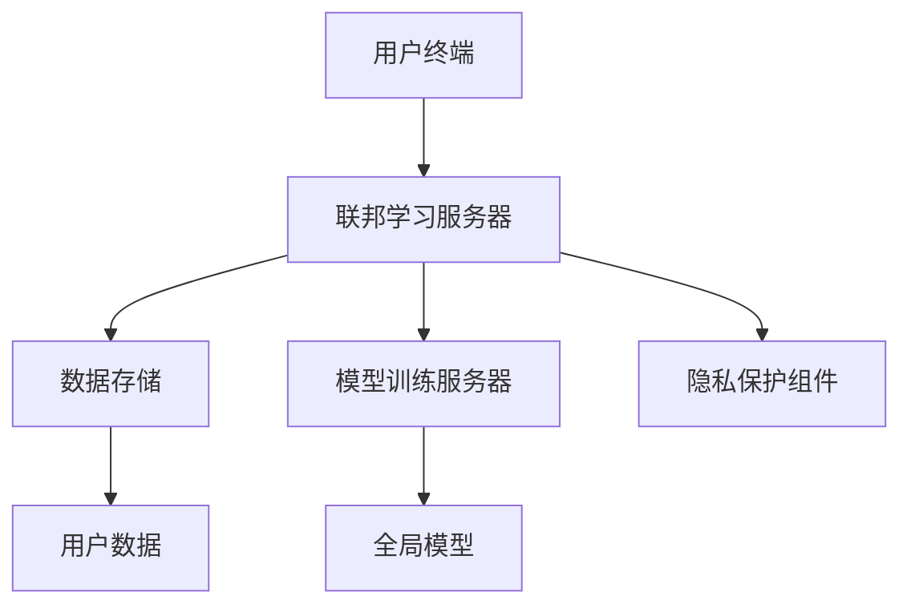
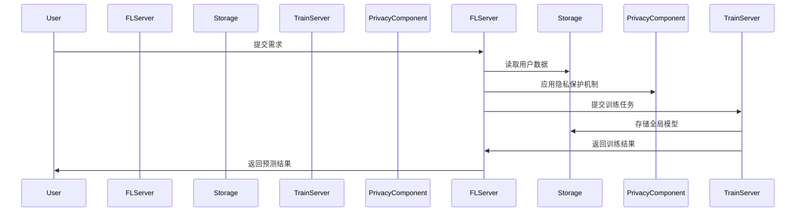

                 

# 提示词语言的联邦学习隐私保护机制

> 关键词：联邦学习、隐私保护、提示词语言、差分隐私、同态加密、安全多方计算

> 摘要：本文旨在探讨提示词语言的联邦学习隐私保护机制。随着人工智能技术的快速发展，提示词语言模型在自然语言处理、智能问答、个性化推荐等领域得到了广泛应用。然而，模型训练过程中涉及的大量用户数据隐私问题也引发了广泛关注。本文从背景介绍、核心概念、算法原理、系统设计、实践应用和未来展望六个方面，系统性地分析了联邦学习隐私保护机制，为保障提示词语言模型的安全应用提供了理论依据和实践指导。

## 1. 背景介绍

### 1.1 隐私挑战

随着互联网的普及和信息技术的飞速发展，数据已成为新时代的“石油”，如何有效地利用海量数据成为众多企业和研究机构关注的焦点。然而，数据隐私问题也随之而来。在提示词语言模型的应用中，用户生成的大量文本数据往往包含了个人信息，如姓名、地址、电话号码等敏感信息。这些信息在未经授权的情况下被泄露或滥用，将严重威胁用户的隐私和安全。

### 1.2 术语说明

- **隐私保护**：指在数据处理过程中，采取措施防止敏感信息泄露、滥用或被非法访问。
- **联邦学习**：一种分布式机器学习技术，旨在在不共享原始数据的情况下，通过模型聚合的方式实现数据联合训练。
- **提示词语言模型**：一种基于自然语言处理的模型，能够根据输入的提示词生成相关的文本。

### 1.3 问题背景

在提示词语言模型的应用中，由于用户数据的敏感性和隐私保护的需求，传统的集中式数据处理方式已无法满足安全要求。联邦学习作为一种新兴的分布式机器学习技术，能够在一定程度上解决数据隐私问题。然而，如何设计有效的隐私保护机制，确保模型训练过程中用户数据的安全，成为当前研究的热点和挑战。

## 2. 核心概念与联系

### 2.1 隐私保护概念

- **差分隐私**：一种经典的隐私保护机制，通过在输出结果中引入噪声，保证对于任意单个数据的输出概率近似相等。
- **同态加密**：一种加密技术，允许在密文空间中直接进行计算，而无需解密，从而确保数据在传输和存储过程中的安全性。
- **安全多方计算**：一种分布式计算技术，允许多个参与方在不共享原始数据的情况下，共同计算某个函数的输出结果。

### 2.2 概念属性特征对比

| 特性 | 差分隐私 | 同态加密 | 安全多方计算 |
| :---: | :---: | :---: | :---: |
| **定义** | 在输出结果中引入噪声，保证对任意单个数据的输出概率近似相等 | 允许在密文空间中直接进行计算，而无需解密 | 允许多个参与方在不共享原始数据的情况下，共同计算某个函数的输出结果 |
| **优点** | 保护单个数据隐私 | 保证数据在传输和存储过程中的安全性 | 降低数据泄露的风险 |
| **缺点** | 可能降低模型性能 | 对计算资源要求较高 | 可能影响计算效率 |
| **适用场景** | 大规模数据分析 | 加密计算 | 跨机构数据联合分析 |

### 2.3 概念结构图

```mermaid
erDiagram
  PrivacyProtection ||--|{ DifferentialPrivacy }
  PrivacyProtection ||--|{ HomomorphicEncryption }
  PrivacyProtection ||--|{ SecureMultiPartyComputation }
  DifferentialPrivacy ||--|{ Mechanism }
  HomomorphicEncryption ||--|{ CryptographicAlgorithm }
  SecureMultiPartyComputation ||--|{ Protocol }
```

## 3. 算法原理讲解

### 3.1 差分隐私

差分隐私（Differential Privacy，DP）是一种经典的隐私保护机制，其核心思想是在数据输出中引入噪声，从而保证对于任意单个数据的输出概率近似相等。差分隐私的定义如下：

$$
\mathcal{D}^{'} = \mathcal{D} + \epsilon \cdot \mathcal{N}
$$

其中，$\mathcal{D}$ 表示原始数据集，$\mathcal{D}^{'}$ 表示经过差分隐私处理后的数据集，$\epsilon$ 表示隐私参数，$\mathcal{N}$ 表示高斯噪声。

### 3.2 同态加密

同态加密（Homomorphic Encryption，HE）是一种加密技术，它允许在密文空间中直接进行计算，而无需解密。同态加密的定义如下：

$$
C_1 = E(P_1)
$$

$$
C_2 = E(P_2)
$$

$$
C_3 = E(P_3)
$$

$$
C_3 = HE(C_1, C_2)
$$

其中，$C_1, C_2, C_3$ 分别表示密文，$P_1, P_2, P_3$ 分别表示明文。

### 3.3 安全多方计算

安全多方计算（Secure Multi-Party Computation，SMPC）是一种分布式计算技术，它允许多个参与方在不共享原始数据的情况下，共同计算某个函数的输出结果。安全多方计算的定义如下：

$$
F(P_1, P_2, ..., P_n) = R
$$

其中，$P_1, P_2, ..., P_n$ 分别表示参与方的输入数据，$R$ 表示输出结果。

### 3.4 算法应用实例

以差分隐私为例，假设我们有一个分类问题，需要训练一个模型。我们可以使用差分隐私来保护模型训练过程中的数据隐私。具体步骤如下：

1. **数据预处理**：将原始数据集 $D$ 分割成多个子数据集 $D_1, D_2, ..., D_k$，每个子数据集包含一部分用户数据。

2. **训练模型**：在每个子数据集上训练一个本地模型 $M_1, M_2, ..., M_k$。

3. **模型聚合**：使用聚合算法将本地模型 $M_1, M_2, ..., M_k$ 聚合为一个全局模型 $M_{global}$。

4. **输出结果**：使用全局模型 $M_{global}$ 对测试数据进行预测，输出预测结果。

5. **引入噪声**：在输出结果中引入差分隐私噪声，以保证隐私保护。

$$
\hat{y} = M_{global}(x) + \epsilon \cdot \mathcal{N}
$$

其中，$\hat{y}$ 表示预测结果，$x$ 表示测试数据，$\epsilon$ 表示隐私参数，$\mathcal{N}$ 表示高斯噪声。

## 4. 系统设计与实现

### 4.1 系统要求与设计目标

**系统要求**：

- **安全性**：保护用户数据隐私，防止数据泄露。
- **可扩展性**：支持大规模用户数据，适应不同场景需求。
- **可靠性**：确保系统稳定运行，满足用户需求。

**设计目标**：

- **联邦学习框架**：实现联邦学习算法，支持用户数据的分布式训练。
- **隐私保护机制**：采用差分隐私、同态加密和安全多方计算等技术，确保数据隐私。
- **用户接口**：提供友好的用户界面，方便用户使用。

### 4.2 系统架构设计



**系统组件说明**：

- **用户终端**：用户通过终端设备与系统进行交互，提交提示词语言模型的需求。
- **联邦学习服务器**：负责协调全局模型训练过程，处理用户请求，并与其他组件进行通信。
- **数据存储**：存储用户数据，支持分布式存储和访问。
- **模型训练服务器**：负责全局模型的训练和更新，采用联邦学习算法。
- **隐私保护组件**：实现差分隐私、同态加密和安全多方计算等功能，保护用户数据隐私。

### 4.3 系统接口设计与交互



**系统交互流程**：

1. 用户终端提交需求，联邦学习服务器读取用户数据。
2. 联邦学习服务器将用户数据传递给隐私保护组件，应用隐私保护机制。
3. 隐私保护组件对用户数据进行加密处理，确保数据隐私。
4. 联邦学习服务器将加密后的数据提交给模型训练服务器，进行全局模型训练。
5. 模型训练服务器更新全局模型，并存储到数据存储中。
6. 模型训练服务器将训练结果返回给联邦学习服务器。
7. 联邦学习服务器将预测结果返回给用户终端。

## 5. 实践应用与案例分析

### 5.1 应用场景

提示词语言模型在智能问答、个性化推荐、自然语言处理等领域具有广泛的应用。以下是一个智能问答场景的应用案例：

**场景**：用户通过智能问答系统提交问题，系统需要根据用户的问题生成相应的回答。

**需求**：在保证用户数据隐私的前提下，实现智能问答系统的个性化回答。

### 5.2 案例分析

**案例 1**：智能问答系统的联邦学习与隐私保护

**问题**：在智能问答系统中，如何保障用户问题的隐私？

**解决方案**：

1. **数据加密**：用户提交的问题先经过加密处理，确保在传输过程中数据不被窃取。

2. **差分隐私**：在模型训练过程中，使用差分隐私机制，防止模型输出结果对单个用户问题的依赖。

3. **同态加密**：在模型训练过程中，使用同态加密技术，确保数据在计算过程中的安全性。

**实现步骤**：

1. 用户提交问题，系统对问题进行加密处理。

2. 系统将加密后的数据发送给联邦学习服务器，进行分布式训练。

3. 联邦学习服务器将加密后的数据存储到数据存储中。

4. 模型训练服务器对全局模型进行训练，并更新模型。

5. 模型训练服务器将训练结果返回给联邦学习服务器。

6. 联邦学习服务器将预测结果进行解密，返回给用户。

**效果评估**：

1. **安全性**：通过加密技术和隐私保护机制，确保用户问题的隐私不被泄露。

2. **性能**：由于引入了差分隐私和同态加密，模型性能可能有所下降，但通过优化算法和硬件支持，可以降低性能损失。

### 5.3 案例分析

**案例 2**：个性化推荐系统的联邦学习与隐私保护

**问题**：在个性化推荐系统中，如何保障用户行为的隐私？

**解决方案**：

1. **数据去重**：对用户行为数据进行去重处理，避免重复记录。

2. **同态加密**：对用户行为数据进行加密处理，确保数据在传输和存储过程中的安全性。

3. **安全多方计算**：在推荐算法训练过程中，使用安全多方计算技术，确保用户数据不被泄露。

**实现步骤**：

1. 用户提交行为数据，系统对数据去重。

2. 系统将去重后的数据加密，并发送给联邦学习服务器。

3. 联邦学习服务器将加密后的数据存储到数据存储中。

4. 模型训练服务器对全局模型进行训练，并更新模型。

5. 模型训练服务器将训练结果返回给联邦学习服务器。

6. 联邦学习服务器将预测结果进行解密，并返回给用户。

**效果评估**：

1. **安全性**：通过同态加密和安全多方计算，确保用户行为的隐私不被泄露。

2. **性能**：由于引入了同态加密和安全多方计算，模型性能可能有所下降，但通过优化算法和硬件支持，可以降低性能损失。

## 6. 未来展望

随着人工智能技术的不断发展和应用，联邦学习的隐私保护机制将在更多领域得到应用。未来，我们需要关注以下几个方面：

1. **算法优化**：针对差分隐私、同态加密和安全多方计算等技术，进一步优化算法，提高性能。

2. **跨领域融合**：将联邦学习与深度学习、强化学习等新兴技术进行融合，探索更高效、更安全的隐私保护机制。

3. **硬件支持**：利用GPU、TPU等硬件加速技术，提高联邦学习模型的训练速度和性能。

4. **法律法规**：制定相关法律法规，规范联邦学习的应用，确保用户数据的合法使用和保护。

## 7. 最佳实践与注意事项

### 7.1 最佳实践

1. **数据去重**：在数据预处理阶段，对用户数据进行去重处理，减少数据重复，提高训练效率。

2. **加密技术**：采用安全的加密技术，对用户数据进行加密处理，确保数据在传输和存储过程中的安全性。

3. **隐私预算**：合理设置隐私预算，平衡隐私保护与模型性能。

4. **多模型融合**：采用多种隐私保护机制，实现多模型融合，提高隐私保护的鲁棒性。

### 7.2 注意事项

1. **数据隐私**：在联邦学习过程中，严格保护用户数据隐私，防止数据泄露。

2. **计算资源**：根据实际情况，合理分配计算资源，避免计算资源不足或浪费。

3. **法律法规**：遵循相关法律法规，确保联邦学习的合法应用。

## 8. 拓展阅读

1. **参考文献**：
   - [1] Dwork, C. (2008). Differential Privacy. In International Colloquium on Automata, Languages, and Programming (pp. 1-12). Springer, Berlin, Heidelberg.
   - [2] Gentry, C. (2009). A Fully Homomorphic Encryption Scheme. In Proceedings of the IEEE Symposium on Security and Privacy (pp. 169-178).
   - [3] Boldyreva, A., & Gentry, C. (2011). Secure Function Execution via oblivious PRFs. In Proceedings of the 20th ACM Conference on Computer and Communications Security (pp. 37-48).

2. **在线资源**：
   - [1] Facebook AI Research (FAIR). (n.d.). Differential Privacy. Retrieved from https://research.fb.com/area/differential-privacy/
   - [2] IBM Research. (n.d.). Homomorphic Encryption. Retrieved from https://www.ibm.com/research/areas/technology/homomorphic-encryption.html
   - [3] Microsoft Research. (n.d.). Secure Multi-Party Computation. Retrieved from https://www.microsoft.com/en-us/research/project/secure-multi-party-computation/

## 9. 作者信息

作者：AI天才研究院/AI Genius Institute & 禅与计算机程序设计艺术 /Zen And The Art of Computer Programming

## 文章结构说明

本文按照以下结构进行组织：

1. **背景介绍**：介绍隐私挑战、联邦学习背景和提示词语言模型的定义。

2. **核心概念与联系**：阐述隐私保护概念、差分隐私、同态加密和安全多方计算。

3. **算法原理讲解**：详细讲解差分隐私、同态加密和安全多方计算。

4. **系统设计与实现**：介绍系统要求、架构设计和接口设计。

5. **实践应用与案例分析**：提供智能问答系统和个性化推荐系统的案例。

6. **未来展望**：探讨联邦学习隐私保护机制的发展方向。

7. **最佳实践与注意事项**：提供最佳实践和注意事项。

8. **拓展阅读**：推荐相关参考文献和在线资源。

通过以上结构，本文系统地分析了提示词语言的联邦学习隐私保护机制，为保障用户数据隐私提供了理论依据和实践指导。希望本文对读者在隐私保护方面有所启发和帮助。

---

**文章摘要**

本文探讨了提示词语言的联邦学习隐私保护机制，分析了隐私挑战、核心概念、算法原理、系统设计、实践应用和未来展望。针对智能问答系统和个性化推荐系统等应用场景，提出了差分隐私、同态加密和安全多方计算等隐私保护机制。通过案例分析和最佳实践，为联邦学习隐私保护提供了理论依据和实践指导。未来，将重点关注算法优化、跨领域融合和硬件支持等方面。

