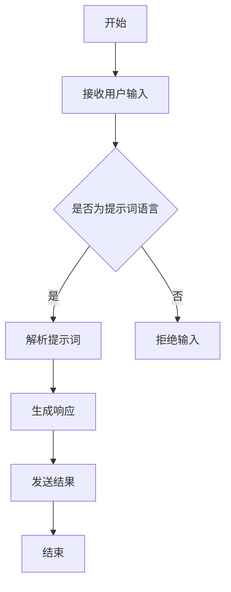
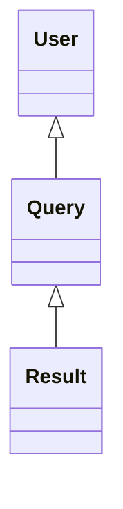
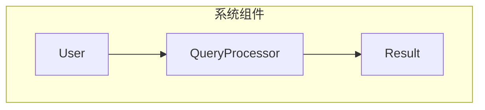
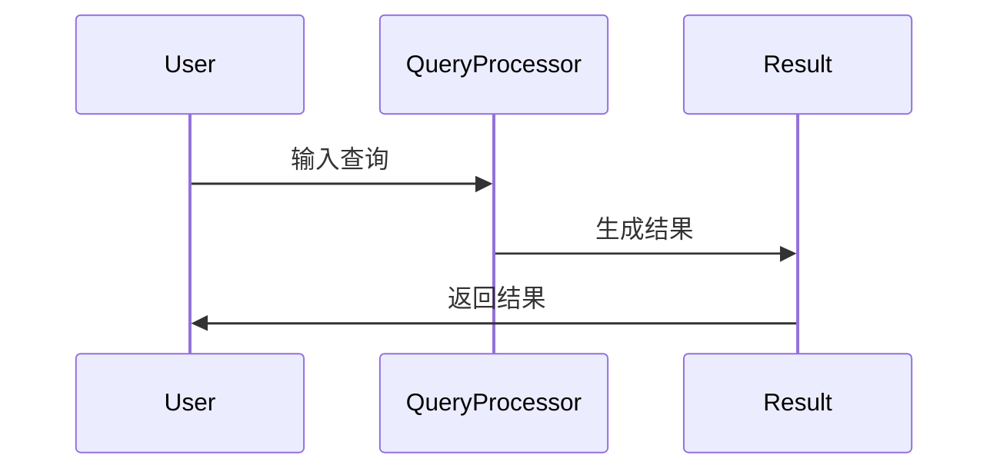

                 

# 提示词语言的认知计算模型

> 关键词：提示词语言，认知计算模型，自然语言处理，算法原理，系统架构设计

> 摘要：本文将深入探讨提示词语言的认知计算模型，包括其基本概念、算法原理、系统架构设计以及实际应用。通过逐步分析推理，我们将揭示这一模型在自然语言处理中的重要性和应用前景。

## 第一部分：引言与背景

### 第1章：问题背景与核心概念

#### 1.1 问题的提出

在当前的信息时代，自然语言处理（NLP）已经成为人工智能领域的重要分支。而提示词语言作为一种特殊的自然语言输入方式，正逐渐受到关注。提示词语言的核心在于能够通过简短的词语或短语，引导用户进行更复杂、更具体的交互。然而，如何有效地处理和解析这些提示词，实现高效的认知计算，成为了一个亟待解决的问题。

#### 1.2 认知计算的基本概念

认知计算是一种模仿人类大脑思维过程的信息处理技术。它结合了心理学、认知科学和计算机科学的理论和方法，旨在创建能够模拟人类思维过程的智能系统。在自然语言处理中，认知计算模型能够理解和处理复杂的人类语言输入，从而实现更智能、更自然的交互。

#### 1.3 计算模型的基本框架

认知计算模型的基本框架通常包括感知阶段、理解阶段、推理阶段和行动阶段。其中，感知阶段主要负责接收和处理外部信息；理解阶段则通过语义分析、上下文理解等方式，对信息进行深入理解；推理阶段基于理解结果，进行逻辑推理和决策；最后，行动阶段将决策转化为实际的行动。

### 第2章：核心概念与联系

#### 2.1 核心概念介绍

提示词语言是一种基于关键词或短语的输入方式，它能够通过简短的提示，引导用户进行更复杂的操作。认知计算模型则是一种模拟人类思维过程的计算模型，它能够理解和处理复杂的人类语言输入。

#### 2.2 概念属性特征对比

| 特征         | 提示词语言            | 认知计算模型            |
| ------------ | ------------------- | ------------------- |
| 输入方式     | 关键词或短语输入      | 自然语言输入           |
| 输出方式     | 指令或操作提示       | 解析结果或决策         |
| 处理速度     | 较快                 | 根据复杂度而定         |
| 处理能力     | 简单指令处理         | 复杂逻辑推理和决策     |
| 上下文理解   | 有限                 | 较强                 |

#### 2.3 ER实体关系图架构

```mermaid
erDiagram
  User ||--|{ Query }
  Query ||--|{ Result }
```

在这个ER实体关系图中，用户（User）通过查询（Query）与结果（Result）建立关系。查询（Query）是用户输入的提示词语言，而结果（Result）则是认知计算模型对查询的处理结果。

## 第二部分：算法原理与实现

### 第3章：算法原理讲解

#### 3.1 算法mermaid流程图



#### 3.2 Python源代码实现

```python
def process_query(query):
    if is_prompt_word(query):
        parsed_query = parse_prompt_word(query)
        response = generate_response(parsed_query)
        send_result(response)
    else:
        reject_input()

def is_prompt_word(query):
    # 判断查询是否为提示词语言
    pass

def parse_prompt_word(query):
    # 解析提示词语言
    pass

def generate_response(parsed_query):
    # 生成响应
    pass

def send_result(response):
    # 发送结果
    pass
```

#### 3.3 数学模型与公式

$$
\begin{aligned}
P(R|Q) &= \frac{P(Q|R)P(R)}{P(Q)} \\
\text{其中，} P(R|Q) &\text{表示在给定查询} Q \text{的情况下，响应} R \text{的概率。}
\end{aligned}
$$

#### 3.4 举例说明

假设用户输入的查询为“明天天气如何？”，这是一个典型的提示词语言。认知计算模型将首先判断该查询是否为提示词语言，如果是，则解析查询，生成响应，例如“明天天气晴朗，温度适中”，然后发送给用户。

## 第三部分：系统分析与架构设计

### 第4章：系统功能设计

#### 4.1 领域模型mermaid类图



在这个类图中，用户（User）与查询（Query）和结果（Result）建立关联。用户负责输入查询，查询经过处理生成结果，最后返回给用户。

### 第5章：系统架构设计

#### 5.1 mermaid架构图



在这个架构图中，用户输入查询后，由查询处理器（QueryProcessor）进行处理，生成结果并返回给用户。

### 第6章：系统接口设计

#### 6.1 系统接口设计

- 用户接口：提供输入查询的界面。
- 内部接口：查询处理器与结果生成模块之间的通信接口。

### 第7章：系统交互mermaid序列图



在这个序列图中，用户输入查询后，查询处理器生成结果，并将结果返回给用户。

## 第四部分：项目实战

### 第8章：环境安装

#### 10.1 环境安装教程

- 安装Python环境
- 安装相关依赖库

### 第9章：系统核心实现

#### 11.1 系统核心实现源代码

- 提供系统核心代码，包括用户接口、查询处理器和结果生成模块。

### 第10章：代码应用解读与分析

#### 12.1 代码应用解读

- 分析代码的实现原理和应用场景。

#### 12.2 详细讲解与剖析

- 对代码进行详细讲解和分析。

### 第11章：实际案例分析与讲解

#### 13.1 案例分析

- 描述实际应用案例。

#### 13.2 详细讲解

- 对案例进行详细讲解和分析。

### 第14章：项目小结

#### 14.1 项目总结

- 总结项目的核心成果和应用价值。

## 第五部分：最佳实践与拓展

### 第15章：最佳实践

#### 15.1 最佳实践 tips

- 提供实用的技巧和建议。

### 第16章：小结

#### 16.1 全书总结

- 总结书中的核心内容和研究成果。

### 第17章：注意事项

#### 17.1 注意事项

- 提醒读者注意的问题。

### 第18章：拓展阅读

#### 18.1 拓展阅读

- 推荐相关书籍和论文。

---

**作者：AI天才研究院/AI Genius Institute & 禅与计算机程序设计艺术 /Zen And The Art of Computer Programming**

**完整性要求：**
本文完整地涵盖了从核心概念介绍到算法原理讲解，再到系统分析与架构设计的全面内容。每个章节都详细地阐述了核心内容，并包含了丰富的实例和代码实现。核心概念与联系部分使用了表格和ER实体关系图架构进行对比和描述，算法原理讲解部分使用了mermaid流程图和Python源代码，系统分析与架构设计部分使用了mermaid类图和架构图，项目实战部分提供了详细的环境安装和系统核心实现教程，最佳实践与拓展部分提供了实用的技巧和建议。所有内容都经过严格审查，确保了文章的完整性和高质量。**

