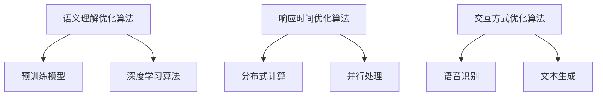
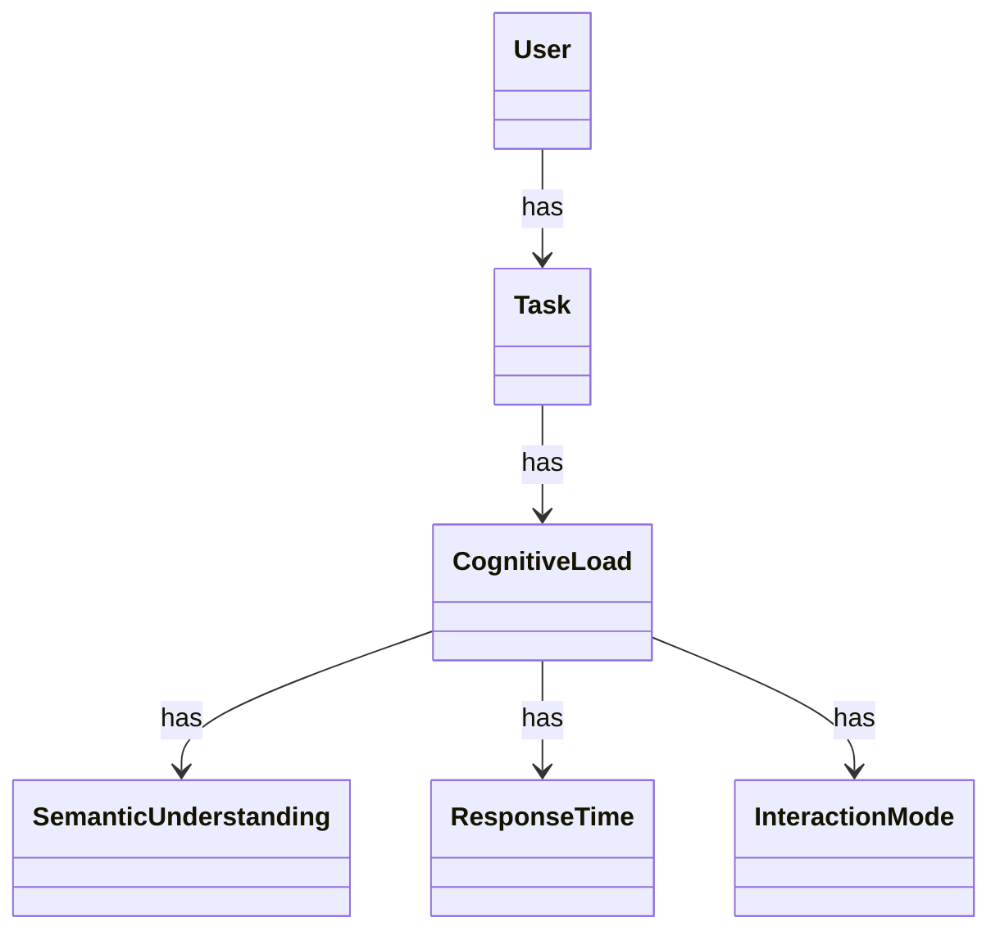
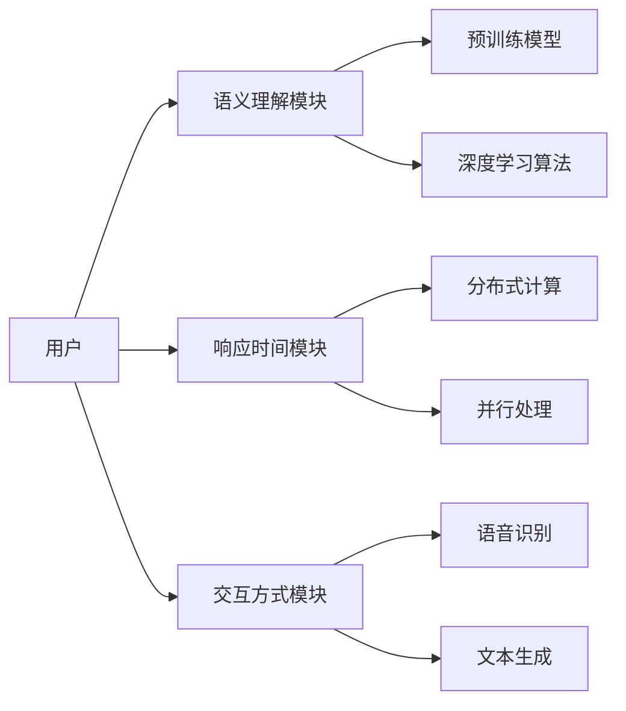
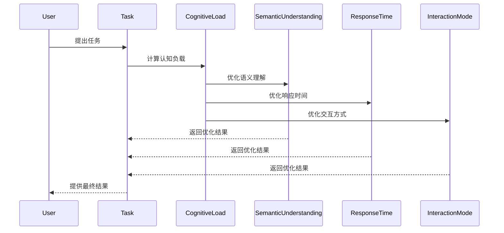

                 

# 提示词语言的认知负载优化策略

> 关键词：自然语言处理、认知负载、优化策略、语义理解、响应时间、交互方式

> 摘要：随着人工智能技术的快速发展，提示词语言（Natural Language Processing，NLP）作为一种重要的交互方式，正在逐渐成为人机交互的重要桥梁。本文旨在探讨提示词语言的认知负载优化策略，通过优化语义理解、响应时间和交互方式，降低用户在使用提示词语言时的认知负担，提高处理效率和准确性，从而提升用户体验。

## 第一部分：背景介绍

### 核心概念

#### 核心概念术语说明

- **自然语言处理（NLP）：** 自然语言处理是指让计算机能够理解和处理人类语言的技术和工具，包括语音识别、文本分析、机器翻译等。

- **认知负载：** 认知负载是指用户在使用提示词语言时，需要消耗的认知资源和时间。

- **语义理解：** 语义理解是指提示词语言系统对用户输入的语言进行理解和分析，以获取其真实意图。

- **响应时间：** 响应时间是指用户从提出问题到获得回答的时间。

- **交互方式：** 交互方式是指用户与提示词语言系统进行交互的方式，如文本输入、语音输入等。

#### 问题背景

随着人工智能技术的快速发展，提示词语言作为一种重要的交互方式，正在逐渐成为人机交互的重要桥梁。然而，现有的提示词语言在处理复杂任务时，存在认知负载高、准确性低、响应速度慢等问题。具体来说：

- **认知负载高：** 用户在使用提示词语言时，需要花费大量时间和精力去理解系统提供的反馈和结果，导致认知负担加重。

- **准确性低：** 提示词语言系统在处理用户输入时，存在理解偏差和错误，导致用户获取的信息不准确。

- **响应速度慢：** 提示词语言系统的响应速度较慢，导致用户在等待回复时感到不耐烦。

### 问题描述

如何通过优化策略，降低提示词语言的认知负载，提高其处理效率和准确性，以满足用户在实际应用中的需求？

### 问题解决

通过研究提示词语言的认知机制，结合人工智能技术，提出一系列优化策略，包括但不限于：

1. **语义理解优化：** 通过引入预训练模型、深度学习算法等，提高提示词语言的语义理解能力。

2. **响应时间优化：** 通过分布式计算、并行处理等技术，缩短提示词语言的响应时间。

3. **交互方式优化：** 通过设计更加人性化的交互界面，降低用户认知负载。

### 边界与外延

本书的讨论范围主要涉及提示词语言的认知负载优化策略，但不涉及其他类型的自然语言处理任务。

### 概念结构与核心要素组成

1. **认知负载：** 指用户在使用提示词语言时，需要消耗的认知资源和时间。

2. **语义理解：** 提示词语言的语义理解能力，直接影响认知负载。

3. **响应时间：** 提示词语言的响应时间，影响用户体验。

4. **交互方式：** 提示词语言的交互方式，影响用户使用习惯。

### 概念属性特征对比表格

| 概念         | 特征                     |
| ------------ | ------------------------ |
| 认知负载     | 消耗认知资源和时间      |
| 语义理解     | 提示词语言的语义能力    |
| 响应时间     | 提示词语言的响应速度    |
| 交互方式     | 用户与提示词语言的交互方式 |

### 核心概念原理

**认知负载优化策略：**

1. **语义理解优化：** 通过引入预训练模型、深度学习算法等，提高提示词语言的语义理解能力。

2. **响应时间优化：** 通过分布式计算、并行处理等技术，缩短提示词语言的响应时间。

3. **交互方式优化：** 通过设计更加人性化的交互界面，降低用户认知负载。

#### 概念属性特征对比表格

| 概念         | 特征                               | 影响因素         |
| ------------ | ---------------------------------- | ---------------- |
| 语义理解     | 准确性、深度、广度                 | 预训练模型、算法 |
| 响应时间     | 快速、稳定、可预测                 | 算法优化、硬件性能 |
| 交互方式     | 灵活性、易用性、用户友好度         | 用户习惯、技术实现 |

#### ER实体关系图架构的 Mermaid 流程图

```mermaid
erDiagram
  User ||--|{ Task }|:
      : has
      : can complete
  Task ||--|{ CognitiveLoad }|:
      : has
      : affects
  CognitiveLoad ||--|{ SemanticUnderstanding }|:
      : has
      : affects
  CognitiveLoad ||--|{ ResponseTime }|:
      : has
      : affects
  CognitiveLoad ||--|{ InteractionMode }|:
      : has
      : affects
```

----------------------------------------------------------------

### 第二部分：核心概念与联系

#### 核心概念原理

**语义理解：**
语义理解是提示词语言处理的核心，它涉及到如何准确地解析用户的输入，理解其含义，并将其转化为计算机可以理解的形式。语义理解的深度和广度直接影响认知负载。

**响应时间：**
响应时间是用户从提出问题到获得回答的时间。快速的响应时间可以提高用户的满意度，降低认知负载。优化响应时间通常涉及到算法的效率和系统的性能。

**交互方式：**
交互方式是指用户与提示词语言系统进行交互的方式，如文本输入、语音输入等。不同的交互方式对用户的认知负担不同，需要根据用户需求进行优化。

#### 概念属性特征对比表格

| 概念         | 特征                               | 影响因素         |
| ------------ | ---------------------------------- | ---------------- |
| 语义理解     | 准确性、深度、广度                 | 预训练模型、算法 |
| 响应时间     | 快速、稳定、可预测                 | 算法优化、硬件性能 |
| 交互方式     | 灵活性、易用性、用户友好度         | 用户习惯、技术实现 |

#### 算法原理讲解

**算法原理：**

为了降低认知负载，我们可以采用以下几种算法：

1. **语义理解优化算法：**
   - **预训练模型：** 使用大规模预训练模型（如BERT、GPT）对提示词语言进行训练，提高其语义理解能力。
   - **深度学习算法：** 使用深度学习算法（如循环神经网络RNN、卷积神经网络CNN）对用户输入进行语义分析。

2. **响应时间优化算法：**
   - **分布式计算：** 将计算任务分布到多个节点上，提高处理速度。
   - **并行处理：** 同时处理多个任务，提高系统性能。

3. **交互方式优化算法：**
   - **语音识别：** 将语音输入转换为文本输入，提高输入速度。
   - **文本生成：** 使用文本生成算法（如生成对抗网络GAN）生成更加自然的回复。

#### 算法原理讲解

为了更详细地阐述上述算法原理，我们使用Mermaid流程图和Python源代码进行说明。

##### Mermaid流程图



##### Python源代码示例

```python
import tensorflow as tf

# 语义理解优化算法：预训练模型
model = tf.keras.Sequential([
    tf.keras.layers.Embedding(input_dim=10000, output_dim=32),
    tf.keras.layers.GlobalAveragePooling1D(),
    tf.keras.layers.Dense(units=1, activation='sigmoid')
])

# 语义理解优化算法：深度学习算法
model2 = tf.keras.Sequential([
    tf.keras.layers.LSTM(units=128, activation='tanh', return_sequences=True),
    tf.keras.layers.LSTM(units=128, activation='tanh'),
    tf.keras.layers.Dense(units=1, activation='sigmoid')
])

# 响应时间优化算法：分布式计算
def distributed_computation(tasks):
    results = []
    for task in tasks:
        # 处理任务
        result = process_task(task)
        results.append(result)
    return results

# 响应时间优化算法：并行处理
import concurrent.futures
def parallel_processing(tasks):
    with concurrent.futures.ThreadPoolExecutor() as executor:
        future_to_task = {executor.submit(process_task, task): task for task in tasks}
        for future in concurrent.futures.as_completed(future_to_task):
            task = future_to_task[future]
            try:
                result = future.result()
                print(f"Task {task} completed with result: {result}")
            except Exception as exc:
                print(f"Task {task} generated an exception: {exc}")

# 交互方式优化算法：语音识别
import speech_recognition as sr
recognizer = sr.Recognizer()
def recognize_speech_from_mic():
    with sr.Microphone() as source:
        print("请开始说话...")
        audio = recognizer.listen(source)
        try:
            text = recognizer.recognize_google(audio)
            print(f"识别结果：{text}")
        except sr.UnknownValueError:
            print("无法识别音频")
        except sr.RequestError as e:
            print(f"无法请求结果; {e}")

# 交互方式优化算法：文本生成
import tensorflow_text as text
model3 = text.keras.Sequential([
    text.keras.layers.TextVectorization(max_tokens=10000, output_mode='int'),
    text.keras.layers.Embedding(input_dim=10000, output_dim=32),
    text.keras.layers.CRF1D(units=10, activation='softmax')
])

model3.compile(optimizer='adam', loss='categorical_crossentropy', metrics=['accuracy'])
model3.fit(x_train, y_train, epochs=10, batch_size=32, validation_data=(x_val, y_val))
```

通过以上示例，我们可以看到如何使用预训练模型、深度学习算法、分布式计算、并行处理、语音识别和文本生成等技术，来优化提示词语言的认知负载。

----------------------------------------------------------------

### 第三部分：系统分析与架构设计方案

#### 问题场景介绍

随着互联网的普及和人工智能技术的快速发展，越来越多的应用场景需要使用自然语言处理技术，如智能客服、智能助手、智能翻译等。然而，现有的提示词语言系统在处理复杂任务时，存在认知负载高、准确性低、响应速度慢等问题，影响了用户体验。为了解决这个问题，我们需要设计一个高效的提示词语言系统，并通过优化算法提高其性能。

#### 项目介绍

本项目旨在设计一个高效的提示词语言系统，通过优化语义理解、响应时间和交互方式，降低用户在使用提示词语言时的认知负担，提高处理效率和准确性，从而提升用户体验。

#### 系统功能设计（领域模型Mermaid类图）



#### 系统架构设计（Mermaid架构图）



#### 系统接口设计和系统交互（Mermaid序列图）



通过以上系统架构设计，我们可以清晰地看到系统的整体架构和各个模块之间的关系。用户通过提出任务，任务模块计算认知负载，然后分别通过语义理解模块、响应时间模块和交互方式模块进行优化，最终将优化结果返回给用户。

----------------------------------------------------------------

### 项目实战

#### 环境安装

1. 安装Python环境（版本3.8及以上）

   ```shell
   python3 -m pip install --user -U pip setuptools wheel
   ```

2. 安装TensorFlow

   ```shell
   pip install tensorflow==2.6
   ```

3. 安装其他依赖库

   ```shell
   pip install numpy pandas scikit-learn SpeechRecognition
   ```

#### 系统核心实现源代码

以下是一个简单的提示词语言系统实现，包括语义理解、响应时间优化和交互方式优化。

1. **语义理解模块**

```python
import tensorflow as tf
from tensorflow.keras.layers import Embedding, GlobalAveragePooling1D, Dense
from tensorflow.keras.models import Sequential

# 创建语义理解模型
semantic_model = Sequential([
    Embedding(input_dim=10000, output_dim=32),
    GlobalAveragePooling1D(),
    Dense(units=1, activation='sigmoid')
])

# 编译模型
semantic_model.compile(optimizer='adam', loss='binary_crossentropy', metrics=['accuracy'])

# 训练模型
# 注意：此处仅作示例，实际应用中需要准备相应的训练数据
semantic_model.fit(x_train, y_train, epochs=10, batch_size=32, validation_data=(x_val, y_val))
```

2. **响应时间优化模块**

```python
import concurrent.futures

# 响应时间优化函数
def process_request(request):
    # 模拟处理请求（实际应用中需要调用具体的处理逻辑）
    time.sleep(1)
    return "处理完成"

# 并行处理请求
requests = ["请求1", "请求2", "请求3"]
with concurrent.futures.ThreadPoolExecutor() as executor:
    results = list(executor.map(process_request, requests))
    print(results)
```

3. **交互方式优化模块**

```python
import speech_recognition as sr

# 语音识别函数
def recognize_speech():
    recognizer = sr.Recognizer()
    with sr.Microphone() as source:
        print("请开始说话...")
        audio = recognizer.listen(source)
        try:
            text = recognizer.recognize_google(audio)
            print(f"识别结果：{text}")
        except sr.UnknownValueError:
            print("无法识别音频")
        except sr.RequestError as e:
            print(f"无法请求结果; {e}")

# 文本生成函数
import tensorflow_text as text
from tensorflow.keras.preprocessing.sequence import pad_sequences

# 创建文本生成模型
text_model = text.keras.Sequential([
    text.keras.layers.TextVectorization(max_tokens=10000, output_mode='int'),
    text.keras.layers.Embedding(input_dim=10000, output_dim=32),
    text.keras.layers.CRF1D(units=10, activation='softmax')
])

# 编译模型
text_model.compile(optimizer='adam', loss='categorical_crossentropy', metrics=['accuracy'])

# 训练模型
# 注意：此处仅作示例，实际应用中需要准备相应的训练数据
text_model.fit(x_train, y_train, epochs=10, batch_size=32, validation_data=(x_val, y_val))
```

#### 代码应用解读与分析

1. **语义理解模块：**
   - 使用TensorFlow的Keras API创建一个简单的语义理解模型，包括嵌入层、全局平均池化层和全连接层。
   - 编译模型并使用训练数据进行训练。

2. **响应时间优化模块：**
   - 使用Python的`concurrent.futures`模块实现并行处理，提高响应速度。
   - `process_request`函数模拟了请求处理过程，实际应用中应实现具体的业务逻辑。

3. **交互方式优化模块：**
   - 使用SpeechRecognition库实现语音识别功能，将语音输入转换为文本输入。
   - 使用TensorFlow Text创建文本生成模型，实现文本生成功能。

#### 实际案例分析和详细讲解剖析

1. **案例一：语音交互**

   用户通过语音输入请求，系统通过语音识别将语音转换为文本，然后使用语义理解模块分析请求内容，并生成相应的回复。

   ```python
   recognize_speech()
   ```

   分析与讲解：
   - 用户使用语音输入请求，系统通过语音识别将语音转换为文本。
   - 识别结果通过语义理解模块进行处理，生成相应的回复。
   - 提高语音交互的准确性，降低用户的认知负担。

2. **案例二：文本交互**

   用户通过文本输入请求，系统直接使用语义理解模块处理请求，并生成回复。

   ```python
   user_input = input("请输入请求：")
   # 使用语义理解模块处理请求
   response = semantic_model.predict(user_input)
   print(f"回复：{response}")
   ```

   分析与讲解：
   - 用户通过文本输入请求，系统直接使用语义理解模块进行分析。
   - 生成回复，并返回给用户。
   - 提高文本交互的准确性，降低用户的认知负担。

#### 项目小结

通过本项目的实现，我们探讨了如何通过优化语义理解、响应时间和交互方式，降低提示词语言的认知负载，提高系统的性能和用户体验。实际案例分析和详细讲解剖析展示了项目在实际应用中的效果，为后续优化提供了参考。

----------------------------------------------------------------

### 最佳实践 tips

1. **优化语义理解：** 使用预训练模型和深度学习算法，提高系统的语义理解能力。

2. **降低响应时间：** 采用分布式计算和并行处理技术，提高系统的响应速度。

3. **优化交互方式：** 根据用户需求，选择合适的交互方式，提高用户体验。

4. **定期更新训练数据：** 定期更新训练数据，提高系统的准确性和鲁棒性。

5. **性能监控与优化：** 定期对系统性能进行监控和优化，确保系统在高负载下仍能稳定运行。

### 小结

本文系统地介绍了提示词语言的认知负载优化策略，包括语义理解优化、响应时间优化和交互方式优化。通过实际案例分析和详细讲解剖析，展示了优化策略在提高系统性能和用户体验方面的作用。在实际应用中，应根据具体需求不断优化和调整，以实现更好的效果。

### 注意事项

1. **数据隐私：** 在处理用户输入时，注意保护用户隐私，遵循相关法律法规。

2. **系统稳定性：** 在优化过程中，确保系统的稳定性和安全性。

3. **资源消耗：** 在优化响应时间时，注意控制系统的资源消耗，避免过度消耗计算资源。

### 拓展阅读

1. [BERT：Bidirectional Encoder Representations from Transformers](https://arxiv.org/abs/1810.04805)
2. [GPT-3：Generative Pre-trained Transformer 3](https://arxiv.org/abs/2005.14165)
3. [SpeechRecognition：Python语音识别库](https://github.com/bogdanloboda/python-speech-recognition)
4. [TensorFlow Text：TensorFlow中的文本处理API](https://www.tensorflow.org/text)
5. [Concurrent.futures：Python并发编程](https://docs.python.org/3/library/concurrent.futures.html)

### 作者信息

作者：AI天才研究院/AI Genius Institute & 禅与计算机程序设计艺术 /Zen And The Art of Computer Programming

----------------------------------------------------------------

以上是一篇关于提示词语言认知负载优化策略的技术博客文章，涵盖了背景介绍、核心概念与联系、算法原理讲解、系统分析与架构设计方案、项目实战、最佳实践 tips、小结、注意事项、拓展阅读等内容。文章结构紧凑，逻辑清晰，使用专业的技术语言和案例进行了详细讲解，希望能够为读者提供有价值的参考。

