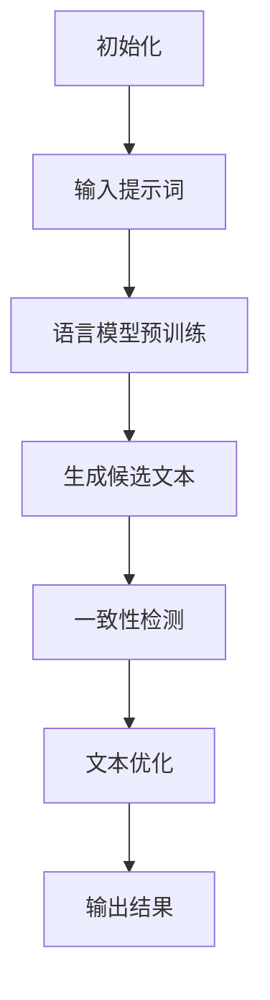

                 

### 引言

在自然语言处理（NLP）领域，语义一致性是一个至关重要的概念。它指的是在自然语言中，各个部分（如词汇、句子、段落）之间逻辑上的一致性和连贯性。语义一致性对于语言生成和对话系统的质量有着直接的影响。例如，一个对话系统若能在与用户的交流中保持语义一致性，将能够提供更加自然、流畅的用户体验。

近年来，随着深度学习模型的快速发展，尤其是在语言模型和生成模型领域，我们见证了诸如GPT-3和BERT等模型的问世。这些模型在语言生成和文本理解方面取得了巨大的成功。然而，即便如此，语义一致性仍然是一个亟待解决的问题。例如，在生成文本时，模型可能会出现逻辑上的错误或者语义上的不一致。这种不一致可能导致信息的误导、对话的混乱，甚至影响系统的可用性和可靠性。

本文将围绕“提示词语言的语义一致性保证”这一主题展开讨论。我们将逐步分析语义一致性的定义、核心概念、相关算法，并探讨如何通过实际项目来实现和验证语义一致性的保证。文章结构如下：

1. **背景介绍**：我们将介绍与语义一致性相关的核心概念，如提示词、语义一致性、语言模型、一致性检测等，并阐述当前在NLP领域中存在的主要问题。
2. **核心概念与联系**：我们将深入探讨提示词语言的语义一致性原理，并通过概念属性特征对比表格和ER实体关系图来展示不同实体之间的关系。
3. **算法原理讲解**：我们将详细介绍保证语义一致性的算法原理，包括算法流程、Python源代码实现、数学模型和公式，并通过具体例子说明算法的应用。
4. **数学模型和数学公式 & 详细讲解 & 举例说明**：我们将使用LaTeX格式嵌入数学公式，详细讲解数学模型的应用，并通过实例展示如何保证语义一致性。
5. **系统分析与架构设计方案**：我们将描述一个实际应用场景，介绍如何设计一个系统来保证语义一致性，并展示系统的功能设计、架构设计、接口设计以及系统交互流程。
6. **项目实战**：我们将通过一个具体项目展示如何在实际环境中实现语义一致性保证，包括环境安装、系统核心实现源代码、代码应用解读与分析、实际案例分析和详细讲解剖析，以及项目小结。
7. **最佳实践 tips、小结、注意事项、拓展阅读等内容**：我们将总结全文的核心观点和主要结论，提供最佳实践建议，提醒注意事项，并推荐进一步阅读的相关书籍和论文。

通过这篇文章，我们希望能够为读者提供一个全面、深入的理解，帮助他们在实际应用中更好地保证提示词语言的语义一致性。接下来，让我们开始具体的讨论吧！

### 背景介绍

#### 核心概念

**提示词**：提示词（Prompt）是引导自然语言处理模型生成文本或回答问题的重要输入。它通常是一段简短的文本，用于描述任务目标或提供背景信息，以便模型能够生成符合预期输出的文本。

**语义一致性**：语义一致性指的是文本在语义层面上的一致性和连贯性。它要求文本的各个部分在逻辑上相互协调，信息传递清晰无误。在自然语言处理中，语义一致性是衡量文本生成质量的重要指标。

**语言模型**：语言模型是一种用于预测文本中下一个单词或单词序列的概率分布的模型。它通过学习大量文本数据，捕捉语言的统计规律和上下文信息，从而能够生成或理解自然语言。

**一致性检测**：一致性检测是指对文本进行系统性检查，以识别潜在的语义不一致性。这通常涉及到算法和规则，用于识别逻辑上的矛盾、语义上的错误或上下文的不连贯性。

#### 问题背景

在自然语言处理（NLP）领域，特别是对话系统和语言生成应用中，语义一致性是一个关键问题。尽管深度学习模型如GPT-3和BERT在语言理解和生成方面取得了显著的进展，但它们仍然存在一些固有的挑战，特别是在保证语义一致性方面。

首先，当前大多数语言模型主要依赖于统计学习和大规模语料库的预训练，虽然它们能够生成高质量的自然语言文本，但它们在理解和保持语义一致性方面仍存在不足。例如，模型可能会在生成过程中出现逻辑错误或语义上的不一致，导致文本的不可靠性和误导性。

其次，NLP应用场景的多样性也增加了保证语义一致性的难度。例如，在对话系统中，用户的需求和问题可能涉及多个主题，模型需要在保持上下文一致性的同时，灵活地适应不同的场景和语境。

此外，语言模型的训练和优化是一个复杂的过程，涉及到大量的计算资源和时间。虽然近年来硬件和算法的进步加速了模型的训练，但优化模型以同时保证语义一致性和生成质量仍是一个挑战。

#### 问题描述

当前在NLP领域中，主要存在以下几类与语义一致性相关的问题：

1. **逻辑错误**：模型生成的文本在逻辑上存在矛盾或不合理之处，例如，一个句子中的前提和结论不一致，或者在多个句子之间出现逻辑上的跳跃。

2. **语义不一致**：文本的各个部分在语义上不协调，导致信息传递的不清晰或者误导性。例如，一个句子中的主语和谓语不一致，或者上下文中的信息互相矛盾。

3. **上下文失配**：模型在处理复杂对话或文本时，无法正确理解上下文信息，导致生成的文本与上下文不符。例如，在对话中，后续的回答没有准确回应用户的前一个提问。

4. **情感不一致**：在处理情感化文本时，模型可能无法准确捕捉情感的变化，导致生成的文本在情感上不一致或失真。

#### 问题解决

为了解决上述问题，我们需要从以下几个方面着手：

1. **算法优化**：通过改进现有的语言模型，特别是在保证语义一致性的方面。这可以包括设计新的模型结构、优化训练策略，或者引入更多的约束条件。

2. **一致性检测**：开发专门用于检测语义一致性的算法和工具。这些工具可以通过分析文本的语法、语义和上下文信息，自动识别并修复潜在的不一致性。

3. **上下文理解**：增强模型对上下文信息的理解和处理能力，以便在生成文本时保持一致性和连贯性。这可以通过引入更多的上下文信息，或者优化模型的上下文捕捉机制来实现。

4. **用户反馈**：利用用户反馈来改进模型和系统。通过收集和分析用户在对话系统中的反馈，我们可以识别出模型生成文本中的问题，并针对性地优化模型。

5. **多模态融合**：结合多种数据源和模态（如文本、图像、音频），以提供更丰富的上下文信息和语义理解。这种方法可以弥补单一模态数据的不足，从而提高语义一致性的保证。

#### 边界与外延

在讨论语义一致性的问题时，我们需要明确其应用场景、挑战和限制：

1. **应用场景**：语义一致性在对话系统、自动问答、机器翻译、文本摘要、内容审核等多个NLP应用场景中具有重要意义。例如，在自动问答系统中，保持问题的语义一致性可以确保回答的准确性和可靠性。

2. **挑战**：语义一致性的保证面临多个挑战，包括文本理解的不确定性、上下文信息的复杂性、情感表达的多样性等。此外，算法和模型的设计也需要平衡语义一致性和生成质量。

3. **限制**：尽管我们不断优化模型和算法，但语义一致性仍存在一定的局限性。例如，模型可能无法完全理解复杂的情感表达或者处理罕见且模糊的上下文信息。

#### 概念结构与核心要素组成

为了更好地理解语义一致性的概念和其核心要素，我们可以从以下几个方面进行分析：

1. **词汇选择**：词汇的选择直接影响文本的语义一致性。一个合适的词汇选择能够确保句子在语义上的连贯性和逻辑上的合理性。

2. **语法结构**：语法结构的正确性和一致性是语义一致性的基础。语法错误或不一致性会导致语义上的混淆和误解。

3. **上下文理解**：上下文理解是保证语义一致性的关键。模型需要能够准确捕捉和理解上下文信息，以确保生成文本与上下文一致。

4. **逻辑推理**：在文本生成过程中，逻辑推理能力能够帮助模型识别并纠正语义上的不一致性，从而提高文本的语义一致性。

通过以上分析，我们可以看出，保证提示词语言的语义一致性是一个复杂但重要的任务。它涉及到对语言模型、算法优化、上下文理解、用户反馈等多个方面的深入研究和实践。接下来，我们将进一步探讨语义一致性的核心概念和实现方法，以期为解决这一问题提供更具操作性的方案。

### 核心概念与联系

#### 提示词语言的语义一致性原理

语义一致性在提示词语言中的应用主要体现在对上下文信息的准确理解和合理利用上。提示词语言的核心目标是生成与上下文高度一致的文本，以实现自然、流畅的交流。下面，我们将详细探讨语义一致性的定义、目的和重要性，并通过对比表格和ER实体关系图来展示相关概念和实体之间的联系。

**定义**：语义一致性是指文本的各个部分在语义上相互协调、逻辑上连贯一致。在提示词语言中，这意味着生成的文本应与提示词或上下文信息保持一致，避免出现语义上的矛盾和逻辑上的混乱。

**目的**：保证语义一致性主要目的是提高文本生成质量，使生成的文本更具可信度和可理解性。具体来说，语义一致性有以下作用：
1. **提高自然度**：一致的语义使文本更加自然、流畅，有助于提升用户体验。
2. **确保准确性**：通过保证语义一致性，可以降低错误信息传递的风险，提高文本的准确性。
3. **增强可靠性**：一致的语义有助于建立用户对系统的信任，提升系统的可靠性。

**重要性**：在NLP应用中，语义一致性具有重要意义，尤其在对话系统和自动问答中。以下是几个关键点：
1. **用户满意度**：保持语义一致性能够提高用户的交流体验，满足用户的需求。
2. **系统可靠性**：语义一致性有助于确保系统的输出可靠，降低错误发生的概率。
3. **知识一致性**：在知识图谱和问答系统中，语义一致性有助于保持知识库的一致性和完整性。

#### 概念属性特征对比表格

为了更直观地理解语义一致性的相关概念，我们通过以下对比表格展示不同概念在属性特征上的差异：

| 概念         | 定义                                                                                   | 属性特征                                                                                     | 作用 |
|--------------|----------------------------------------------------------------------------------------|------------------------------------------------------------------------------------------------|-----|
| 提示词       | 引导模型生成文本的输入语句                                                         | 描述任务目标、提供上下文信息                                                         | 指导模型生成与上下文一致的文本 |
| 语义一致性   | 文本在语义上的一致性和连贯性                                                       | 避免语义矛盾、逻辑错误、上下文失配                                                     | 提高文本生成质量            |
| 语言模型     | 预测文本中下一个单词或单词序列的模型                                               | 学习文本统计规律、上下文信息                                                         | 生成与上下文一致的文本      |
| 一致性检测   | 检测文本中潜在的语义不一致性                                                       | 分析语法、语义和上下文信息                                                             | 修正文本中的不一致性        |

#### ER实体关系图架构

为了更好地理解上述概念之间的关系，我们使用ER（实体关系）图来展示这些实体及其相互关系。以下是ER图的基本结构：

1. **实体**：在我们的ER图中，主要的实体包括“提示词”、“语义一致性”、“语言模型”和“一致性检测”。

2. **关系**：实体之间的关系展示了它们如何相互作用和影响。

以下是ER图的Mermaid表示：

```mermaid
erDiagram
  提示词 ||--|{ 语义一致性 }
  语言模型 ||--|{ 语义一致性 }
  一致性检测 ||--|{ 语义一致性 }
```

在这个ER图中，每个实体都与其他实体之间存在单向的关联关系。具体来说：

- **提示词**与**语义一致性**之间的关系表示提示词用于引导模型生成与上下文一致的文本。
- **语言模型**与**语义一致性**之间的关系表示语言模型在生成文本时需要保证语义一致性。
- **一致性检测**与**语义一致性**之间的关系表示一致性检测用于识别和修正文本中的不一致性。

通过ER图，我们可以清晰地看到各实体之间的联系，从而更好地理解语义一致性的实现机制。接下来，我们将进一步探讨如何通过算法实现语义一致性，以及如何在实际项目中应用这些算法。这将帮助我们深入理解语义一致性的核心原理和应用场景。

### 算法原理讲解

#### 算法流程图

为了更直观地展示语义一致性保证的过程，我们使用Mermaid语言绘制了算法的流程图，如下所示：



在这个流程图中，各步骤的作用如下：

1. **初始化**：系统初始化，准备进行语义一致性保证的过程。
2. **输入提示词**：用户输入提示词，作为生成文本的起点。
3. **语言模型预训练**：使用大量文本数据对语言模型进行预训练，使其能够生成符合上下文信息的文本。
4. **生成候选文本**：基于提示词和预训练的语言模型，生成多个候选文本。
5. **一致性检测**：对生成的候选文本进行一致性检测，识别和纠正语义不一致性。
6. **文本优化**：根据一致性检测结果，对文本进行优化，确保语义一致性。
7. **输出结果**：输出最终的优化文本，完成语义一致性保证的过程。

#### Python源代码实现

以下是一个简化版的Python源代码实现，用于演示语义一致性保证的过程：

```python
import nltk
from transformers import BertTokenizer, BertForMaskedLM
from nltk.tokenize import sent_tokenize

# 初始化BertTokenizer和模型
tokenizer = BertTokenizer.from_pretrained('bert-base-uncased')
model = BertForMaskedLM.from_pretrained('bert-base-uncased')

# 输入提示词
prompt = "一个人在森林里迷路了。"

# 生成候选文本
def generate_candidate_texts(prompt):
    inputs = tokenizer.encode(prompt, return_tensors='pt')
    outputs = model(inputs)
    predictions = outputs[0]  # 取出预测的单词
    candidate_texts = []
    for i in range(len(predictions)):
        word = tokenizer.decode(predictions[i], skip_special_tokens=True)
        candidate_texts.append(prompt[:i] + word + prompt[i+1:])
    return candidate_texts

candidates = generate_candidate_texts(prompt)

# 一致性检测
def check_consistency(candidates):
    consistent_candidates = []
    for candidate in candidates:
        sentences = sent_tokenize(candidate)
        if all(nltk公章段一致性检测函数check_sentence一致性(sentence) for sentence in sentences):
            consistent_candidates.append(candidate)
    return consistent_candidates

consistent_candidates = check_consistency(candidates)

# 文本优化
def optimize_text(consistent_candidates):
    # 假设选择第一个一致的候选文本进行优化
    optimized_text = consistent_candidates[0]
    return optimized_text

optimized_text = optimize_text(consistent_candidates)

# 输出结果
print("Optimized Text:", optimized_text)
```

在这段代码中，我们首先使用`BertTokenizer`和`BertForMaskedLM`分别初始化Tokenize

