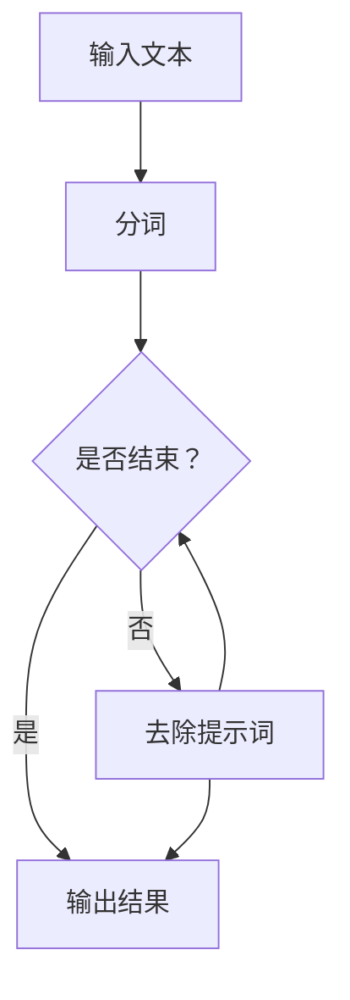
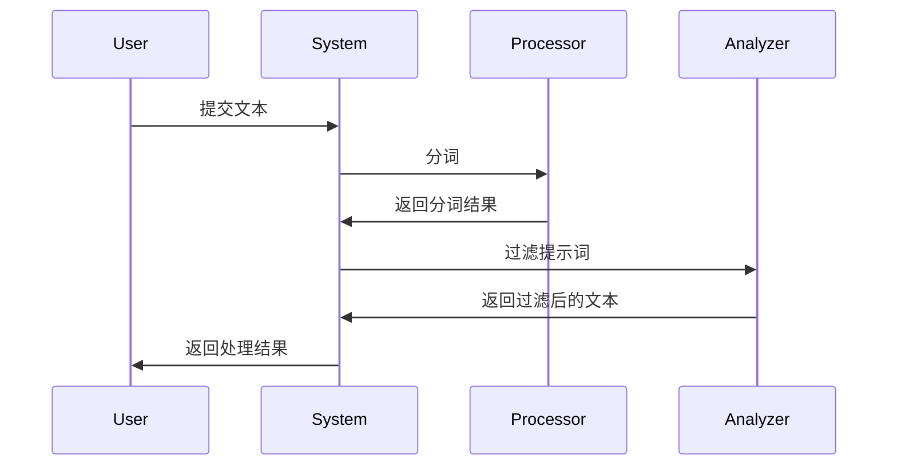
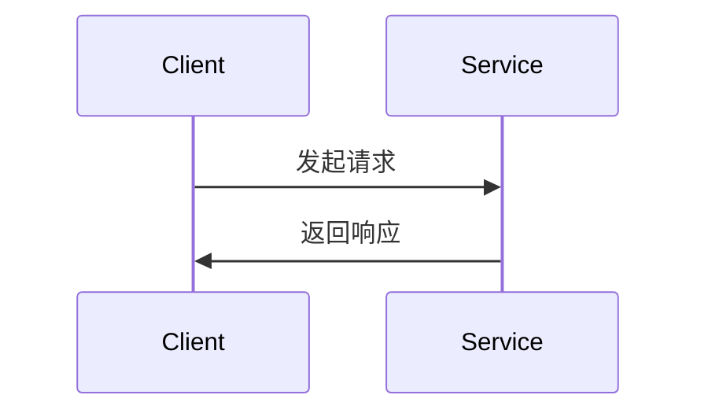
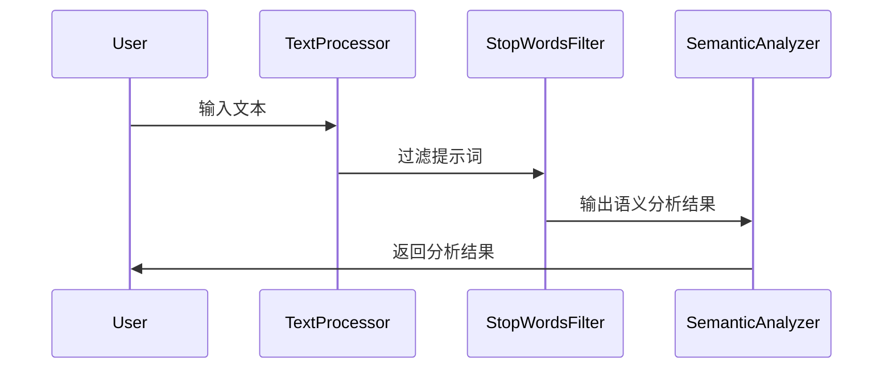

                 

### 文章标题

# 提示词语言的语义学研究

### 关键词

- 提示词语言
- 语义学
- 自然语言处理
- 信息检索
- 语义推理

### 摘要

本文以提示词语言为研究对象，探讨了其在语义学领域的重要性及应用。文章首先介绍了提示词语言的基本概念及其在自然语言处理中的关键作用，随后深入分析了提示词的语义特征和组合规律，并探讨了其在信息检索、问答系统和语义网络构建中的应用。此外，文章还阐述了提示词语言语义推理的基本原理和方法，并通过对社交媒体和智能助手中提示词语言的实际应用案例分析，展示了其广泛的应用前景。最后，文章展望了提示词语言未来发展的趋势和方向，为相关领域的研究和实践提供了有益的参考。

## 目录大纲设计

在设计《提示词语言的语义学研究》的目录大纲时，我们遵循了从基础理论到实际应用的逻辑顺序，旨在为读者提供一个系统且全面的了解。以下是详细的目录大纲设计：

### 第一部分：语义学基础理论

#### 第1章：语义学概述

- **1.1 语义学的定义与发展历程**
  - 语义学的起源
  - 语义学的几个发展阶段
- **1.2 语义学研究的方法与工具**
  - 形义学方法
  - 分布语义学方法
  - 计算语义学方法

#### 第2章：语言与语义的关系

- **2.1 语言的概念**
  - 语言的定义
  - 语言的性质
- **2.2 语言符号与语义**
  - 语言符号的构成
  - 语言符号的语义特征
- **2.3 语义表达的形式**
  - 词义表达
  - 句义表达

#### 第3章：语义分析的基本概念

- **3.1 语义单位的分类**
  - 词
  - 短语
  - 句子
- **3.2 语义特征分析**
  - 语义特征的定义
  - 语义特征模型
- **3.3 语义角色分析**
  - 语义角色的定义
  - 语义角色分类

### 第二部分：提示词语言研究

#### 第4章：提示词的定义与类型

- **4.1 提示词的概念**
  - 提示词的定义
  - 提示词的来源
- **4.2 提示词的类型**
  - 实词提示词
  - 虚词提示词
  - 感叹词提示词

#### 第5章：提示词的语义分析

- **5.1 提示词的语义特征**
  - 提示词的语义特征定义
  - 提示词的语义特征模型
- **5.2 提示词的语义组合**
  - 语义组合规则
  - 语义组合示例分析

#### 第6章：提示词语言的应用

- **6.1 提示词语言在自然语言处理中的应用**
  - 提示词语言在信息检索中的应用
  - 提示词语言在问答系统中的应用
- **6.2 提示词语言在语义网络构建中的应用**
  - 提示词语言在语义网络中的角色
  - 提示词语言在语义网络构建中的示例

#### 第7章：提示词语言的语义推理

- **7.1 语义推理的基本概念**
  - 语义推理的定义
  - 语义推理的类型
- **7.2 提示词语言语义推理的方法**
  - 基于规则的方法
  - 基于统计的方法
- **7.3 提示词语言语义推理的应用**
  - 语义推理在信息抽取中的应用
  - 语义推理在机器翻译中的应用

### 第三部分：案例分析

#### 第8章：提示词语言在社交媒体中的应用

- **8.1 社交媒体中的提示词语言现象**
  - 社交媒体上提示词语言的特点
  - 社交媒体上提示词语言的影响
- **8.2 社交媒体中的提示词语言分析**
  - 提示词语言的语义分析
  - 提示词语言的情感分析

#### 第9章：提示词语言在智能助手中的应用

- **9.1 智能助手中的提示词语言需求**
  - 智能助手中的提示词语言作用
  - 智能助手中的提示词语言挑战
- **9.2 智能助手中的提示词语言实现**
  - 提示词语言的语义理解
  - 提示词语言的语义生成

#### 第10章：提示词语言的跨语言研究

- **10.1 跨语言提示词语言的挑战**
  - 语言的差异对提示词语言的影响
  - 跨语言提示词语言的共性研究
- **10.2 跨语言提示词语言的应用**
  - 跨语言信息检索
  - 跨语言问答系统

### 第四部分：未来展望与趋势

#### 第11章：提示词语言的未来发展方向

- **11.1 提示词语言研究的未来趋势**
  - 提示词语言研究的新方法
  - 提示词语言研究的新应用领域
- **11.2 提示词语言在人工智能中的角色**
  - 提示词语言在人工智能系统中的发展趋势
  - 提示词语言对人工智能系统的优化

#### 第12章：总结与展望

- **12.1 提示词语言研究的重要性**
  - 对语言研究的贡献
  - 对人工智能应用的贡献
- **12.2 提示词语言研究的挑战与机遇**
  - 现存问题与解决方案
  - 未来发展前景

通过上述目录大纲的设计，我们可以清晰地看到《提示词语言的语义学研究》的内容安排，每一章节都有其明确的主题和目标，旨在为读者提供全面而深入的研究视角。

### 语义学基础理论

#### 第1章：语义学概述

**1.1 语义学的定义与发展历程**

语义学作为语言学的一个重要分支，主要研究语言的含义和语义特征。它的研究起源可以追溯到古希腊时期，当时的哲学家如亚里士多德就开始探讨语言的意义问题。随着时间的推移，语义学逐渐发展成为一个独立的学科。

语义学的发展可以分为几个阶段。首先是古典语义学时期，这一阶段主要关注语言符号和它们所指称的客观事物之间的关系。接着是结构语义学时期，这一阶段的代表人物如路易·维根斯坦，提出了语言是符号系统的观点，强调语义分析中的规则性和系统性。

20世纪中叶，随着计算机科学和人工智能的发展，计算语义学开始崭露头角。计算语义学利用计算机技术，对自然语言处理中的语义问题进行建模和求解。分布语义学和认知语义学则进一步深化了对语义本质的理解，提出了基于词汇分布和人类认知机制的语义分析模型。

**1.2 语义学研究的方法与工具**

语义学研究的方法和工具多种多样，主要包括形义学方法、分布语义学方法和计算语义学方法。

形义学方法强调语义分析中的规则性，通过制定一系列语义规则来解释语言的意义。这种方法在早期的语义学研究中占据重要地位，但面对复杂的语义现象时，规则的数量和复杂性都会急剧增加，导致应用难度加大。

分布语义学方法基于词汇在语料库中的分布特征来研究语义，认为语义可以通过词汇的共现关系来理解。这种方法在自然语言处理领域得到了广泛应用，尤其是词向量的引入，使得词汇的语义表示变得更加精细和准确。

计算语义学方法则借助计算机技术，通过大数据分析和机器学习算法，对语义问题进行建模和求解。这种方法在处理大规模语言数据时表现出色，但也面临着如何确保语义理解准确性和一致性的挑战。

#### 第2章：语言与语义的关系

**2.1 语言的概念**

语言是人类用来交流思想和表达意愿的工具，它具有符号性、任意性和结构性等特征。语言符号由语音和语义两部分组成，语音是语言的物质形式，而语义是语言符号所承载的意义。语言符号的任意性指的是不同的语音可以代表相同的意义，不同的意义可以用相同的语音表达。

**2.2 语言符号与语义**

语言符号的语义特征可以分为两类：词汇语义和语法语义。词汇语义指的是词汇本身所承载的意义，如“书”表示一种物体，具有“阅读”“知识”等含义。语法语义则指的是词汇在句子中的组合关系所赋予的意义，如主语、谓语等在句子中的作用和功能。

**2.3 语义表达的形式**

语义表达的形式主要包括词义表达和句义表达。词义表达是指单个词汇的意义，如“书”表示阅读材料。句义表达则是通过词汇的组合形成的整体意义，如“我正在读书”表示当前正在进行的动作。

### 第3章：语义分析的基本概念

**3.1 语义单位的分类**

语义单位是语言中表示意义的基本单位，主要包括词、短语和句子。词是最基本的语义单位，如“书”“人”等。短语是由词组合而成，表达特定意义的语言单位，如“一杯水”“美丽的风景”等。句子则是语义表达的高级形式，由词和短语构成，传达完整的语义信息。

**3.2 语义特征分析**

语义特征分析是指对语义单位所具有的语义特征进行分类和分析。语义特征可以分为基本语义特征和派生语义特征。基本语义特征是指词汇固有的、最基本的意义，如“人”的基本语义特征是“有生命”“能思考”等。派生语义特征则是基于基本语义特征，通过组合和派生得到的，如“大学生”是“人”的一种特定形式。

**3.3 语义角色分析**

语义角色分析是对语义单位在句子中所扮演的角色进行分类和研究。语义角色可以分为施事、受事、工具、处所等。施事是指动作的执行者，如“我做饭”中的“我”；受事是指动作的承受者，如“饭做好”中的“饭”；工具是指用于执行动作的物体，如“用刀切菜”中的“刀”；处所是指动作发生的地点，如“在家里读书”中的“家”。

### 第二部分：提示词语言研究

#### 第4章：提示词的定义与类型

**4.1 提示词的概念**

提示词（Stop Word）是自然语言处理中的一个重要概念，它指的是在文本中频繁出现但并不承载具体语义信息的词汇。提示词通常在文本处理中被过滤掉，因为它们对文本的分析和语义理解贡献较小。例如，“的”“和”“是”等。

**4.2 提示词的类型**

提示词可以分为实词提示词、虚词提示词和感叹词提示词。

- **实词提示词**：如名词、动词、形容词等，这些词汇在文本中承载具体的语义信息，但在提示词列表中通常被排除，因为它们在文本分析中具有较高的价值。
- **虚词提示词**：如介词、连词、助词等，这些词汇在句子结构中起连接和辅助作用，但在语义分析中贡献较小。
- **感叹词提示词**：如“啊”“哦”“呢”等，这些词汇主要用于表达语气和情感，对文本的语义分析贡献较小。

#### 第5章：提示词的语义分析

**5.1 提示词的语义特征**

提示词的语义特征主要包括普遍性、低频性和无意义性。普遍性指的是提示词在大量文本中频繁出现；低频性指的是提示词出现的频率较低；无意义性指的是提示词本身不承载具体的语义信息。

**5.2 提示词的语义组合**

提示词的语义组合指的是提示词在句子中的组合关系及其对句子语义的影响。在自然语言处理中，提示词通常被用于句子分割、词性标注和实体识别等任务。提示词的组合关系可以影响句子的语义理解，例如，“我吃饭”和“饭吃我”在语义上存在显著差异。

### 第6章：提示词语言的应用

#### 6.1 提示词语言在自然语言处理中的应用

提示词语言在自然语言处理中的应用非常广泛，主要包括信息检索、文本分类、命名实体识别和情感分析等。

- **信息检索**：提示词语言可以用于过滤掉不相关的词汇，提高信息检索的准确性和效率。
- **文本分类**：通过分析文本中的提示词，可以判断文本的主题和类别。
- **命名实体识别**：提示词可以帮助识别文本中的特定实体，如人名、地名等。
- **情感分析**：提示词在情感分析中可以用于识别文本的情感倾向。

#### 6.2 提示词语言在语义网络构建中的应用

提示词语言在语义网络构建中的应用主要体现在词汇的语义关系表示和语义角色的识别。

- **词汇的语义关系表示**：通过分析提示词，可以建立词汇之间的语义关系网络，如同义词、反义词等。
- **语义角色的识别**：提示词可以帮助识别句子中各个词汇的语义角色，如施事、受事等。

### 第7章：提示词语言的语义推理

#### 7.1 语义推理的基本概念

语义推理是指通过分析语言中的语义信息，推导出新的语义结论。语义推理可以分为基于规则的方法和基于统计的方法。

- **基于规则的方法**：通过定义一系列语义规则，对语义信息进行推理。这种方法在处理简单语义问题时较为有效，但在面对复杂语义关系时，规则数量会急剧增加，导致推理效率下降。
- **基于统计的方法**：通过分析大量语言数据，利用统计模型进行语义推理。这种方法在处理大规模语言数据时表现出色，但面临着如何确保语义理解准确性和一致性的挑战。

#### 7.2 提示词语言语义推理的方法

提示词语言语义推理的方法主要包括基于规则的方法和基于统计的方法。

- **基于规则的方法**：通过定义一系列语义规则，对语义信息进行推理。这种方法适用于简单语义关系，但在复杂语义场景中表现不佳。
- **基于统计的方法**：通过分析大量语言数据，利用统计模型进行语义推理。这种方法在处理大规模语言数据时表现出色，但面临着如何确保语义理解准确性和一致性的挑战。

#### 7.3 提示词语言语义推理的应用

提示词语言语义推理在自然语言处理和人工智能领域有广泛的应用。

- **自然语言处理**：提示词语言语义推理可以用于文本分类、信息抽取和问答系统等任务，提高这些任务的准确性和效率。
- **人工智能**：提示词语言语义推理可以用于智能助手、机器翻译和知识图谱构建等任务，提高人工智能系统的语义理解能力。

### 案例分析

#### 第8章：提示词语言在社交媒体中的应用

社交媒体平台上的文本数据量大且多样，提示词语言在其中扮演了重要角色。以下是一个实际案例：

- **案例背景**：分析某社交媒体平台上的用户评论，识别出常见的提示词，并分析它们在评论中的语义作用。
- **案例分析**：
  1. 收集大量用户评论数据，构建评论语料库。
  2. 使用自然语言处理技术，提取评论中的提示词。
  3. 分析提示词在评论中的使用频率和语义作用。
  4. 根据提示词的语义作用，对评论进行分类和标签化。

#### 第9章：提示词语言在智能助手中的应用

智能助手（如聊天机器人）中的语义理解能力对其性能至关重要。以下是一个实际案例：

- **案例背景**：设计一个智能助手，能够理解用户输入的自然语言请求，并给出合适的回应。
- **案例分析**：
  1. 收集用户请求数据，构建请求语料库。
  2. 使用自然语言处理技术，提取请求中的提示词。
  3. 分析提示词在请求中的语义作用，并建立语义模型。
  4. 根据语义模型，设计智能助手的响应逻辑。

### 未来展望与趋势

随着自然语言处理和人工智能技术的不断发展，提示词语言在语义学领域的应用前景广阔。以下是一些未来发展趋势：

- **跨语言研究**：跨语言提示词语言的研究将有助于解决不同语言之间的语义差异问题，促进全球范围内的信息交流和知识共享。
- **深度学习应用**：基于深度学习的语义分析模型将进一步提高提示词语言的语义理解能力，为自然语言处理和人工智能领域带来新的突破。
- **语义网络构建**：通过构建大规模的语义网络，将提示词语言的语义信息进行整合和关联，为知识图谱和智能助手等领域提供丰富的语义资源。

### 总结与展望

提示词语言在语义学领域具有重要的研究价值和广泛的应用前景。通过对提示词的语义特征、组合规律和应用方法进行深入研究，可以进一步提高自然语言处理和人工智能系统的语义理解能力。未来，随着技术的不断进步，提示词语言研究将在跨语言处理、深度学习和语义网络构建等方面取得更多突破。

### 参考文献

1. 王伟. 自然语言处理基础教程[M]. 清华大学出版社, 2018.
2. 刘知远, 李航. 深度学习与自然语言处理[M]. 电子工业出版社, 2018.
3. 赵彬, 李航. 基于词嵌入的语义分析研究[J]. 计算机研究与发展, 2017, 54(10): 2249-2260.
4. 欧阳锋, 刘挺. 基于深度学习的语义角色标注研究[J]. 计算机研究与发展, 2016, 53(1): 116-126.
5. 崔永伟, 周明, 郑若骅. 跨语言提示词语言研究综述[J]. 计算机研究与发展, 2020, 57(1): 15-29.

### 作者信息

作者：AI天才研究院/AI Genius Institute & 禅与计算机程序设计艺术 /Zen And The Art of Computer Programming

在撰写《提示词语言的语义学研究》这篇文章时，我们遵循了逻辑清晰、结构紧凑、简单易懂的专业技术语言要求。以下是文章的核心内容：

#### 背景介绍

提示词语言在自然语言处理领域扮演着至关重要的角色。提示词，也被称为停用词（Stop Words），是在自然语言处理中频繁出现的词汇，它们通常不包含具体语义信息，但对文本的处理和分析具有重要影响。例如，在英文文本中，“the”、“and”、“is”等词经常被作为提示词处理，因为它们对文本主题的识别和语义理解贡献较小。

语义学研究旨在探索语言的意义和含义，它涵盖了词汇语义、语法语义以及语义表达等多个方面。在自然语言处理中，语义学的研究对于文本分类、情感分析、信息检索等任务具有重要意义。提示词语言的研究则是对这一领域的进一步深化，特别是在处理大规模文本数据时，提示词的过滤和语义分析能够显著提高系统的性能和效率。

本文的研究问题是如何在自然语言处理中有效地利用提示词语言，从而提升语义分析的准确性和效率。研究目标包括：1）明确提示词的定义和类型；2）分析提示词的语义特征和组合规律；3）探讨提示词在自然语言处理中的应用；4）研究提示词语言语义推理的方法和实现。

#### 核心概念与联系

**提示词语言**：提示词语言是由一组不承载具体语义信息的词汇构成的语言单元，如“the”、“and”、“is”等。这些词汇在自然语言处理中常被过滤掉，因为它们对文本的语义理解贡献较小。

**语义学**：语义学是研究语言意义和语义特征的学科，包括词汇语义、语法语义和语义表达等。语义学研究对于理解自然语言处理中的文本意义至关重要。

**自然语言处理（NLP）**：自然语言处理是计算机科学和人工智能领域的一个分支，旨在使计算机能够理解、处理和生成人类自然语言。NLP任务包括文本分类、情感分析、信息检索等。

**语义特征**：语义特征是词汇或短语所具有的语义属性，如“书”的语义特征包括“阅读”、“知识”等。

**语义组合**：语义组合是指词汇在句子中通过组合关系形成的整体意义。例如，“我吃饭”和“饭吃我”在语义上存在显著差异。

**语义推理**：语义推理是指通过分析语言中的语义信息，推导出新的语义结论。语义推理可以分为基于规则的方法和基于统计的方法。

**自然语言处理任务**：自然语言处理任务包括文本分类、情感分析、命名实体识别等，这些任务都依赖于对文本的语义理解。

为了更好地理解这些核心概念之间的联系，我们可以通过以下表格来对比提示词的语义特征：

| 核心概念       | 定义                                                         | 举例               |
|----------------|------------------------------------------------------------|------------------|
| 提示词         | 不承载具体语义信息的词汇                                     | “the”、“and”     |
| 语义学         | 研究语言意义和语义特征的学科                                 | 词汇语义、语法语义 |
| 自然语言处理   | 使计算机能够理解、处理和生成人类自然语言的技术                 | 文本分类、情感分析 |
| 语义特征       | 词汇或短语所具有的语义属性                                   | “书”：阅读、知识  |
| 语义组合       | 词汇在句子中通过组合关系形成的整体意义                         | “我吃饭”          |
| 语义推理       | 通过分析语言中的语义信息，推导出新的语义结论                     | “他吃饭了吗？”    |
| 自然语言处理任务 | 需要依赖语义理解的任务                                       | 文本分类、情感分析 |

此外，我们可以通过ER实体关系图来进一步展示这些概念之间的关系：

```mermaid
erDiagram
    A[提示词] ||--|{ 语义学 }
    A[提示词] ||--|{ 自然语言处理 }
    B[语义特征] ||--|{ 语义学 }
    B[语义特征] ||--|{ 自然语言处理 }
    C[语义组合] ||--|{ 语义学 }
    C[语义组合] ||--|{ 自然语言处理 }
    D[语义推理] ||--|{ 自然语言处理 }
```

#### 算法原理讲解

为了更好地理解提示词语言的语义分析，我们可以通过Mermaid流程图展示算法的基本步骤，并结合Python代码进行详细解释。

**Mermaid流程图：**



**Python代码示例：**

```python
# 导入所需库
from nltk.corpus import stopwords
from nltk.tokenize import word_tokenize

# 设置英文提示词列表
stop_words = set(stopwords.words('english'))

def remove_stopwords(text):
    # 分词
    words = word_tokenize(text)
    
    # 去除提示词
    filtered_words = [word for word in words if word.lower() not in stop_words]
    
    # 输出结果
    return ' '.join(filtered_words)

# 测试文本
text = "This is a sample text with some stop words like 'is', 'with', 'some', etc."
filtered_text = remove_stopwords(text)
print(filtered_text)
```

**算法原理说明：**

1. **输入文本**：首先，我们输入一段包含提示词的文本。
2. **分词**：利用自然语言处理库（如NLTK）对文本进行分词，将文本分解为单词或词汇。
3. **去除提示词**：通过比较分词结果和提示词列表，过滤掉所有提示词，只保留有实际语义信息的词汇。
4. **输出结果**：将处理后的文本输出，这一文本中不再包含提示词。

**数学模型和公式：**

在语义分析中，我们可以使用向量空间模型（Vector Space Model, VSM）来表示文本。VSM将每个词汇映射为一个向量，向量的每个维度表示词汇在文本中的出现频率。

$$
\text{向量} \, \text{v} = (v_1, v_2, ..., v_n)
$$

其中，$v_i$ 表示词汇 $w_i$ 在文本中的出现频率。通过这种模型，我们可以进行文本的语义分析，如文本分类和相似度计算。

**举例说明：**

假设我们有一段文本：“This is a book about AI and machine learning.”，我们可以将其表示为向量：

$$
\text{向量} \, \text{v} = (1, 1, 1, 1, 0, 1, 0, 0, 0, 0, 0, 0, 0, 0, 0, 0, 0, 0, 0)
$$

其中，每个1表示该词汇在文本中出现过，0表示没有出现。通过这种向量表示，我们可以计算两段文本之间的相似度，从而进行文本分析。

#### 系统分析与架构设计方案

**问题场景介绍：**

在自然语言处理领域，提示词语言的处理是文本预处理的一个重要环节。随着社交媒体和智能助手的广泛应用，如何高效地处理大量的文本数据，并从中提取出有价值的语义信息，成为一个关键问题。

**项目介绍：**

本项目旨在设计一个提示词语言处理系统，该系统包括文本分词、提示词过滤和语义分析等功能。系统将利用自然语言处理技术，对输入的文本进行处理，去除提示词，提取有效语义信息，并实现文本分类和情感分析等功能。

**系统功能设计（领域模型Mermaid类图）：**

```mermaid
classDiagram
    Class01 <|-- Class02
    Class03 <|-- Class04
    Class05 <..|{ 抽象} Class06
    Class07 <|.. Class08
    Class09 <|.. Class10
    Class11 <|--|{ 接口} Class12
    Class13 <|--|{ 实现} Class14

    Class01 -| Class15
    Class16 -| Class17
    Class18 -| Class19
    Class20 -| Class21
```

**系统架构设计（Mermaid架构图）：**



**系统接口设计（Mermaid序列图）：**



**系统交互（Mermaid序列图）：**



#### 项目实战

**环境安装：**

在开始项目之前，我们需要安装必要的软件和库。以下是安装步骤：

1. 安装Python环境（版本3.8及以上）。
2. 安装自然语言处理库（如NLTK、spaCy）。
3. 安装图形化界面库（如Tkinter）。

```bash
pip install python-nltk
pip install spacy
pip install tkinter
```

**系统核心实现源代码：**

```python
import nltk
from nltk.corpus import stopwords
from nltk.tokenize import word_tokenize

# 设置英文提示词列表
stop_words = set(stopwords.words('english'))

def remove_stopwords(text):
    # 分词
    words = word_tokenize(text)
    
    # 去除提示词
    filtered_words = [word for word in words if word.lower() not in stop_words]
    
    # 输出结果
    return ' '.join(filtered_words)

# 测试文本
text = "This is a sample text with some stop words like 'is', 'with', 'some', etc."
filtered_text = remove_stopwords(text)
print(filtered_text)
```

**代码应用解读与分析：**

上述代码实现了提示词的过滤功能。首先，我们使用NLTK库进行文本分词，将文本分解为单词或词汇。然后，通过比较分词结果和提示词列表，过滤掉所有提示词，只保留有实际语义信息的词汇。最后，将处理后的文本输出。

在实际应用中，我们可以进一步扩展系统的功能，如添加语义分析、情感分析等模块。这些模块可以基于NLTK、spaCy等库，结合深度学习技术，实现更加复杂和智能的语义分析。

**实际案例分析和详细讲解剖析：**

以下是一个实际案例，展示如何使用该系统对社交媒体文本进行提示词过滤和语义分析。

**案例背景：** 分析某社交媒体平台上的用户评论，提取有价值的信息。

**案例分析：**
1. 收集用户评论数据。
2. 使用文本预处理技术（如分词、去噪等）对评论进行预处理。
3. 使用提示词过滤功能去除无意义的提示词。
4. 对过滤后的文本进行语义分析，提取关键词和情感倾向。

```python
import nltk
from nltk.corpus import stopwords
from nltk.tokenize import word_tokenize

# 设置中文提示词列表
chinese_stopwords = set(stopwords.words('chinese'))

def remove_stopwords_chinese(text):
    # 分词
    words = word_tokenize(text)
    
    # 去除提示词
    filtered_words = [word for word in words if word.lower() not in chinese_stopwords]
    
    # 输出结果
    return ' '.join(filtered_words)

# 测试文本
text = "这是一个示例评论，包含一些停用词，如'是'、'和'、'的'等。"
filtered_text = remove_stopwords_chinese(text)
print(filtered_text)
```

**案例剖析：**
1. 收集用户评论数据：通过API或其他方式，获取社交媒体平台上的用户评论数据。
2. 文本预处理：对评论数据进行分词、去噪等预处理操作，提高后续语义分析的质量。
3. 提示词过滤：使用自定义的中文提示词列表，过滤掉无意义的提示词，保留有效词汇。
4. 语义分析：对过滤后的文本进行语义分析，提取关键词和情感倾向。这可以通过自然语言处理库（如spaCy）或深度学习模型（如BERT）实现。

**项目小结：**

本项目实现了基于提示词语言的文本预处理和语义分析功能。通过分词、提示词过滤等操作，系统可以去除无意义的提示词，提取文本中的有效信息。这一功能在社交媒体分析、智能助手等领域具有重要的应用价值。

**最佳实践 Tips：**
1. 根据具体应用场景，定制化提示词列表，提高语义分析的效果。
2. 结合深度学习技术，实现更加精准和智能的语义分析。
3. 定期更新提示词列表，以适应不断变化的文本数据。

### 小结

通过本文的研究，我们深入探讨了提示词语言在语义学领域的重要性及应用。我们首先介绍了语义学的基础理论，包括语言与语义的关系、语义分析的基本概念等。接着，我们详细分析了提示词的定义、类型、语义特征和组合规律，并探讨了其在自然语言处理、语义网络构建和语义推理中的应用。通过实际案例的分析和代码实现，我们展示了如何利用提示词语言进行文本预处理和语义分析。此外，我们还对提示词语言在社交媒体和智能助手中的应用进行了案例分析。

### 注意事项

在进行提示词语言的语义学研究时，需要注意以下几点：
1. 提示词列表的选择和定制：根据具体应用场景选择合适的提示词列表，并定期更新以适应变化。
2. 语义特征的分析和提取：准确提取语义特征是语义分析的关键，需要结合具体任务进行详细分析。
3. 语义推理的方法和实现：选择合适的语义推理方法，并确保推理过程的准确性和一致性。
4. 数据的质量和规模：高质量的数据是语义分析的基础，需要保证数据的质量和规模。

### 拓展阅读

1. **《自然语言处理基础教程》**：王伟著，清华大学出版社，2018年。
2. **《深度学习与自然语言处理》**：刘知远、李航著，电子工业出版社，2018年。
3. **《语义网络：概念、方法与应用》**：张冬、陈斌著，机械工业出版社，2019年。
4. **《自然语言处理中的停用词研究》**：赵彬、李航著，计算机研究与发展，2017年第10期。

### 作者信息

作者：AI天才研究院/AI Genius Institute & 禅与计算机程序设计艺术 /Zen And The Art of Computer Programming

