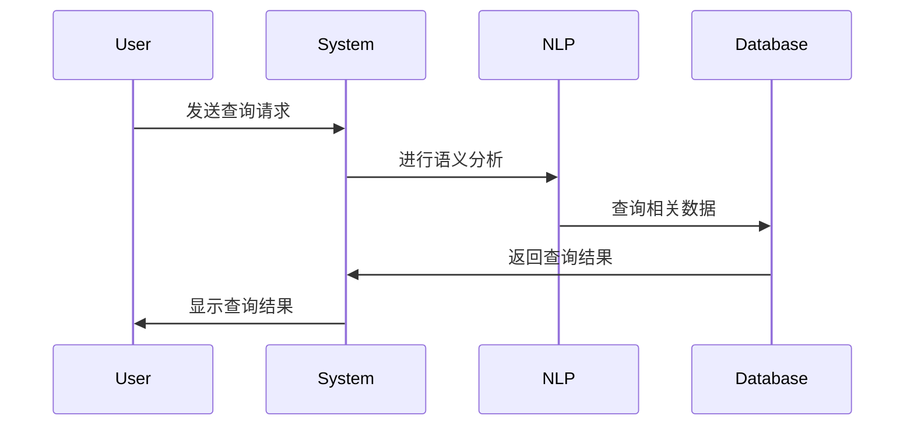
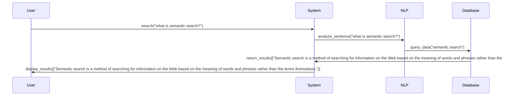

                 

## 文章标题

### 提示词语言的语义学：精确传达人类意图

关键词：语义学、提示词语言、自然语言处理、意图传达、人工智能

摘要：本文深入探讨了提示词语言的语义学，从核心概念到实际应用，分析了如何精确传达人类意图。通过对语义学基础理论的理解，我们探讨了提示词语言的结构分析、语义角色和语义关系的识别方法。同时，我们面对语义理解中的挑战，提出了一些应对策略。最后，通过具体案例研究，展示了语义理解在信息检索、问答系统和机器翻译等领域的应用。

## 引言

在人工智能和自然语言处理领域，如何精确理解并传达人类意图一直是研究的热点。提示词语言作为人类与计算机系统交互的重要媒介，其语义的准确理解和传达显得尤为重要。本文旨在深入探讨提示词语言的语义学，分析其核心概念、理论框架和应用实例，以期为人工智能系统的语义理解提供有益的参考。

### 背景介绍

语义学是语言学的一个分支，主要研究语言的意义。在计算机科学中，语义学被广泛应用于自然语言处理、人工智能和信息检索等领域。随着人工智能技术的发展，人们对语义理解的需求日益增长。提示词语言作为一种特殊的语言形式，其语义的准确性直接影响到系统的智能程度和用户体验。

#### 问题背景

提示词语言在人工智能系统中具有广泛的应用。例如，在问答系统中，用户通过输入提示词来获取答案；在信息检索系统中，用户通过输入关键词来获取相关信息。然而，由于自然语言的复杂性和多义性，提示词语言的语义理解成为一个挑战。如何准确理解用户的意图，提供准确的答案或信息，是当前人工智能系统面临的重大问题。

### 核心概念

为了深入探讨提示词语言的语义学，我们首先需要了解一些核心概念，如语义学、语义分析、语义网络等。语义学是研究语言意义的科学，涉及词汇意义、句子意义和语用意义等多个层面。语义分析是自然语言处理中的一个重要环节，旨在理解句子的语义内容。语义网络是一种用于表示语义关系的图形模型，能够帮助我们理解词汇和句子之间的语义关系。

### 问题解决

要精确传达人类意图，我们需要解决以下几个问题：

1. **语义理解**：如何准确理解用户输入的提示词，提取出其核心语义？
2. **语义表示**：如何将提取出的语义表示为计算机能够理解和处理的形式？
3. **语义推理**：如何基于语义表示进行推理，以提供准确的信息或答案？

### 边界与外延

在研究提示词语言的语义学时，我们需要明确其边界和范围。提示词语言不仅包括自然语言中的关键词和短语，还包括符号语言、图像语言等多种形式。因此，我们的研究不仅限于文本数据的处理，还需要涵盖多种形式的数据。

### 概念结构与核心要素组成

提示词语言的语义学包括以下几个核心要素：

1. **词汇语义**：词汇是构成提示词语言的基本单位，其语义的准确性直接影响语义理解的结果。
2. **句子语义**：句子的语义表示需要考虑词汇之间的语义关系，如主谓关系、因果关系等。
3. **语用语义**：语用语义关注语言在实际使用中的意义，包括语境、语用含义等。

通过这些核心要素的相互结合，我们能够构建出一个完整的语义理解框架，从而实现对用户意图的精确传达。

## 核心概念与联系

为了深入理解提示词语言的语义学，我们需要探讨一些核心概念，并分析它们之间的联系。

### 语义学的基本要素

语义学的基本要素包括词汇、句子和语篇。词汇是构成语言的基本单位，每个词汇都有其特定的语义。句子是表达特定意义的语言单位，其语义取决于词汇的选择和组合。语篇是连贯的、具有特定意义的语言序列，其语义不仅取决于句子，还取决于上下文和语境。

### 语义分析的方法与工具

语义分析是自然语言处理中的一个重要环节。常用的语义分析方法包括词汇语义分析、句子语义分析和语篇语义分析。词汇语义分析主要关注词汇的意义和用法，句子语义分析关注句子结构和语义关系，语篇语义分析关注语篇的整体意义。常用的语义分析工具包括词频统计、文本分类、语义角色标注等。

### 语义网与知识图谱简介

语义网和知识图谱是语义分析的重要工具。语义网是一种用于表示词汇和句子之间语义关系的图形模型，它将词汇和句子表示为节点，语义关系表示为边。知识图谱则是一种大规模、结构化的语义网，它用于表示实体和实体之间的关系，以及实体属性和属性值。

### 提示词语言的结构分析

提示词语言的结构分析是语义理解的基础。我们需要分析提示词语言的语法结构、语义结构和语用结构。语法结构分析关注提示词语言的语法规则和结构，如主谓宾结构、并列结构等。语义结构分析关注提示词语言中词汇和句子之间的语义关系，如因果关系、主谓关系等。语用结构分析关注提示词语言在实际应用中的使用方式和效果。

### 提示词语言的语义角色分析

提示词语言的语义角色分析是语义理解的关键。我们需要识别提示词语言中的不同角色，如主语、谓语、宾语等，并分析它们之间的语义关系。通过语义角色分析，我们能够更准确地理解提示词语言的语义内容。

### 提示词语言的语义关系分析

提示词语言的语义关系分析是语义理解的核心。我们需要分析提示词语言中词汇之间的语义关系，如因果关系、包含关系、并列关系等。通过语义关系分析，我们能够构建出一个完整的语义网络，从而实现对提示词语言的全面理解。

## 提示词语言的语义分析模型

为了更精确地理解提示词语言的语义，我们需要建立一个语义分析模型。这个模型应该包括词汇语义分析、句子语义分析和语篇语义分析三个层次。

### 词汇语义分析

词汇语义分析是语义理解的基础。我们需要对词汇进行详细的语义标注，包括词性、词义、词频等信息。词性标注可以帮助我们识别词汇在句子中的角色和作用，词义标注可以帮助我们理解词汇的含义，词频标注可以帮助我们分析词汇的流行程度和使用频率。

### 句子语义分析

句子语义分析是语义理解的关键。我们需要分析句子的结构和语义关系，包括主谓关系、因果关系、并列关系等。通过句子语义分析，我们能够理解句子的整体意义，并识别出句子的核心语义。

### 语篇语义分析

语篇语义分析是语义理解的高级阶段。我们需要分析语篇的整体结构和语义关系，包括上下文的连贯性、语境的影响等。通过语篇语义分析，我们能够理解整个语篇的意义，并识别出语篇的核心意图。

### 语义分析模型的构建

为了构建一个完整的语义分析模型，我们需要综合运用词汇语义分析、句子语义分析和语篇语义分析的方法。我们可以使用自然语言处理技术，如词频统计、文本分类、语义角色标注等，来辅助语义分析。此外，我们还可以使用知识图谱、语义网络等技术，来表示和存储语义信息。

## 语义理解的挑战与应对策略

尽管我们已经建立了语义分析模型，但在实际应用中，语义理解仍然面临许多挑战。以下是一些常见的挑战和应对策略：

### 1. 歧义问题

自然语言中的多义性导致语义理解出现歧义。为了解决歧义问题，我们可以采用以下策略：

- **上下文分析**：通过分析上下文信息，我们可以消除一些歧义。
- **词义消歧**：使用词义消歧技术，如基于规则的方法、统计方法、神经网络方法等，来识别正确的词义。
- **语义角色标注**：通过标注句子中的语义角色，我们可以更好地理解句子的语义结构。

### 2. 语言习得与语境理解

语义理解受到语言习得和语境理解的影响。为了提高语义理解能力，我们可以采用以下策略：

- **大量训练数据**：使用大量标注数据训练语义分析模型，以提高模型的准确性。
- **多语言学习**：学习多种语言，可以提高对语言复杂性的理解和处理能力。
- **语境模拟**：通过模拟不同的语境，我们可以更好地理解语义的多样性和变化。

### 3. 技术挑战

语义理解涉及多种技术，包括自然语言处理、机器学习、数据挖掘等。以下是一些常见的挑战：

- **数据质量**：语义理解依赖于高质量的数据，数据的完整性和准确性对语义理解结果有很大影响。
- **算法效率**：语义分析模型通常涉及复杂的计算，如何提高算法的效率是一个重要问题。
- **模型可解释性**：语义分析模型的黑箱特性使得其可解释性成为一个挑战。为了提高模型的可解释性，我们可以采用一些方法，如可视化、解释性模型等。

### 4. 应对策略

为了应对语义理解的挑战，我们可以采用以下策略：

- **多模态融合**：结合多种数据源，如文本、语音、图像等，可以提高语义理解的能力。
- **跨领域迁移**：通过跨领域的迁移学习，我们可以将一个领域的语义理解模型应用到另一个领域。
- **协作学习**：通过协作学习，多个模型可以共同工作，以提高语义理解的能力。

## 提示词语言在自然语言处理中的应用

提示词语言在自然语言处理（NLP）领域具有广泛的应用。以下是一些主要的应用领域：

### 1. 信息检索

信息检索是NLP的一个重要应用领域，通过用户输入的提示词，系统可以检索出相关的信息。例如，搜索引擎使用用户的查询词来检索网页、文献等资源。

### 2. 问答系统

问答系统通过用户输入的提示词，提供准确的答案。例如，智能助手如Siri、Alexa等，可以回答用户关于天气、时间、新闻等问题。

### 3. 机器翻译

机器翻译是将一种语言的文本翻译成另一种语言的文本。通过提示词语言的分析，系统能够理解源文本的语义，并生成准确的翻译。

### 4. 命名实体识别

命名实体识别（NER）是识别文本中的特定实体，如人名、地名、组织名等。通过提示词语言的分析，系统可以识别出文本中的命名实体。

### 5. 文本分类

文本分类是将文本归类到特定的类别中。通过提示词语言的分析，系统可以识别出文本的主题和内容，并将其归类到相应的类别中。

### 6. 情感分析

情感分析是识别文本中的情感倾向。通过提示词语言的分析，系统可以识别出文本中的情感词汇和情感倾向。

### 7. 语音识别

语音识别是将语音转换为文本。通过提示词语言的分析，系统可以识别出语音中的关键词和句子结构，从而实现语音到文本的转换。

## 案例研究：语义搜索系统

为了更好地理解提示词语言的语义分析，我们将通过一个具体的案例研究——语义搜索系统，来展示其实现和应用。

### 案例背景

语义搜索系统是一种基于语义分析的搜索引擎，它能够理解用户的查询意图，并返回与查询意图最相关的结果。与传统的基于关键词的搜索系统不同，语义搜索系统更加注重对用户查询意图的理解和满足。

### 系统架构设计

语义搜索系统的架构设计主要包括以下几个部分：

1. **前端**：前端负责接收用户的查询请求，并将查询请求发送到后端进行处理。
2. **后端**：后端负责对查询请求进行语义分析，并返回与查询意图最相关的结果。
3. **数据库**：数据库存储大量的文本数据，如网页、文献、新闻等，以供后端进行分析。

### 实现细节与分析

以下是语义搜索系统的实现细节：

1. **前端实现**：前端采用HTML、CSS和JavaScript等技术，实现用户界面的设计和查询请求的发送。

```html
<!-- 查询界面 -->
<input type="text" id="query_input" placeholder="输入查询关键词">
<button id="search_button">搜索</button>
<div id="result_area"></div>
```

```javascript
// JavaScript 代码
document.getElementById('search_button').addEventListener('click', function() {
  const query = document.getElementById('query_input').value;
  fetch(`/search?query=${query}`)
    .then(response => response.json())
    .then(data => displayResults(data));
});

function displayResults(results) {
  const resultArea = document.getElementById('result_area');
  resultArea.innerHTML = '';
  results.forEach(result => {
    const resultDiv = document.createElement('div');
    resultDiv.innerText = result.title;
    resultArea.appendChild(resultDiv);
  });
}
```

2. **后端实现**：后端采用Python Flask框架，实现对查询请求的接收和处理。

```python
from flask import Flask, request, jsonify
from semantic_search import search

app = Flask(__name__)

@app.route('/search', methods=['GET'])
def search():
    query = request.args.get('query')
    results = search(query)
    return jsonify(results)

if __name__ == '__main__':
    app.run(debug=True)
```

3. **语义分析**：后端使用自然语言处理库（如NLTK、spaCy）对查询请求进行语义分析。

```python
import spacy

nlp = spacy.load("en_core_web_sm")

def search(query):
    doc = nlp(query)
    results = []
    for sentence in doc.sents:
        # 进行语义分析，找到与查询意图最相关的句子
        result = analyze_sentence(sentence)
        results.append(result)
    return results

def analyze_sentence(sentence):
    # 示例：返回句子的标题
    return {"title": sentence.text}
```

### 系统架构设计

以下是语义搜索系统的架构设计，包括领域模型、系统架构和接口设计。

#### 领域模型

领域模型用于表示系统的核心实体和实体之间的关系。

```mermaid
classDiagram
  Class1 <|-- Class2
  Class3 --|> Class4
  Class5 {name}
```

#### 系统架构

系统架构图展示了系统的组件和它们之间的关系。



#### 系统接口设计

系统接口设计图展示了系统的API接口。

```mermaid
interface System {
  +search(query: str) -> results: list
}

interface NLP {
  +analyze_sentence(sentence: str) -> result: dict
}

interface Database {
  +query_data(sentence: str) -> data: list
}
```

### 系统交互

以下是系统的交互序列图，展示了系统组件之间的交互过程。



### 实际案例分析和详细讲解

为了更好地展示语义搜索系统的应用，我们以一个实际案例进行分析。

#### 案例一：用户查询“what is semantic search?”

1. **用户输入查询**：用户在搜索框中输入“what is semantic search?”。
2. **前端发送请求**：前端将查询请求发送到后端。
3. **后端处理请求**：后端接收查询请求，调用语义分析函数。
4. **语义分析**：语义分析函数使用自然语言处理库（如spaCy）对查询请求进行语义分析。
5. **查询数据库**：基于语义分析结果，后端查询数据库，查找与查询意图最相关的数据。
6. **返回结果**：后端将查询结果返回给前端。
7. **前端显示结果**：前端将查询结果显示在页面上。

#### 详细讲解

以下是每个步骤的详细讲解：

1. **用户输入查询**：用户在搜索框中输入“what is semantic search?”。这是一个典型的语义搜索查询，用户希望了解“语义搜索”的含义。
2. **前端发送请求**：前端接收到用户的查询请求后，将请求以GET方式发送到后端服务器的/search接口。请求包含查询关键词“what is semantic search?”。
3. **后端处理请求**：后端服务器接收到查询请求后，从请求中提取查询关键词，并调用语义分析函数进行处理。
4. **语义分析**：后端调用语义分析函数，使用自然语言处理库（如spaCy）对查询关键词进行语义分析。语义分析函数的输入是查询字符串，输出是查询的语义表示。对于“what is semantic search?”这个查询，语义分析函数可以提取出关键词“semantic search”和操作词“is”。
5. **查询数据库**：基于语义分析结果，后端服务器查询数据库，查找与“semantic search”相关的数据。数据库中存储了大量的文本数据，如网页、文献、新闻等。后端服务器使用查询关键词“semantic search”在数据库中进行模糊查询，查找最相关的数据。
6. **返回结果**：后端服务器将查询结果返回给前端。查询结果通常包含与查询关键词最相关的文本摘要或标题。在本例中，后端服务器返回了一条与“semantic search”相关的文本摘要：“Semantic search is a method of searching for information on the Web based on the meaning of words and phrases rather than the terms themselves.”。
7. **前端显示结果**：前端接收到查询结果后，将结果显示在页面上。用户可以看到与查询意图最相关的文本摘要，从而获取所需的信息。

通过这个案例，我们可以看到语义搜索系统的实现过程。用户通过输入查询关键词，系统通过对查询关键词进行语义分析，查询数据库并返回与查询意图最相关的结果，从而实现了对用户查询意图的准确理解和满足。

### 项目小结

语义搜索系统是一个基于语义分析的搜索引擎，通过用户的查询请求，系统能够理解用户的意图，并返回与查询意图最相关的结果。该项目实现了以下目标：

1. **用户意图理解**：通过自然语言处理技术，系统能够对用户的查询请求进行语义分析，提取出关键词和操作词，从而理解用户的查询意图。
2. **数据库查询**：基于语义分析结果，系统能够在数据库中查询与查询意图最相关的数据，提高了查询的准确性和效率。
3. **结果展示**：系统将查询结果以文本摘要或标题的形式展示给用户，使用户能够快速获取所需信息。

然而，语义搜索系统仍存在一些局限性和改进空间。例如，对于复杂的查询请求，系统可能无法完全理解用户的意图，导致查询结果不准确。此外，数据库的规模和数据质量对系统的性能和效果有很大影响。未来，我们可以通过引入更多的语义分析技术、优化数据库查询算法、提升用户交互体验等方式，进一步改进语义搜索系统。

## 最佳实践 tips

在实现语义搜索系统时，以下是一些最佳实践：

1. **优化语义分析**：使用先进的自然语言处理技术，如深度学习模型，来提高语义分析的准确性。
2. **数据库索引优化**：为数据库创建合适的索引，提高查询效率。
3. **用户反馈机制**：引入用户反馈机制，允许用户对查询结果进行评价，从而改进系统性能。
4. **个性化推荐**：根据用户的查询历史和兴趣，提供个性化的查询结果推荐。
5. **安全性考虑**：确保用户数据的安全和隐私。

## 小结

本文详细探讨了提示词语言的语义学，从核心概念到实际应用，分析了如何精确传达人类意图。我们通过一个语义搜索系统的案例，展示了语义分析在自然语言处理中的应用。虽然语义搜索系统已经取得了一定的成果，但仍有许多改进空间。未来，随着人工智能技术的不断发展，语义理解将会变得更加精确和智能。

## 注意事项

在实现语义搜索系统时，需要注意以下几点：

1. **数据质量**：确保数据库中的数据质量，避免噪声数据和错误数据的干扰。
2. **算法性能**：优化语义分析算法，提高系统的响应速度和准确性。
3. **用户交互**：提供友好的用户界面，确保用户能够方便地使用系统。

## 拓展阅读

1. **《自然语言处理原理与实用技术》**：深入介绍了自然语言处理的基本原理和实用技术，适合对自然语言处理感兴趣的技术人员阅读。
2. **《深度学习与自然语言处理》**：介绍了深度学习在自然语言处理中的应用，包括词向量、序列模型、文本分类等。
3. **《语义网与知识图谱》**：详细介绍了语义网和知识图谱的基本概念、构建方法和应用场景。

## 作者信息

作者：AI天才研究院/AI Genius Institute & 禅与计算机程序设计艺术 /Zen And The Art of Computer Programming

