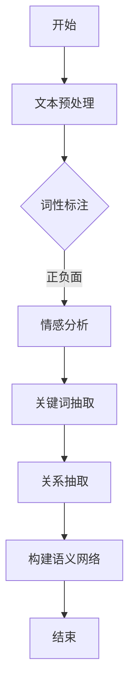
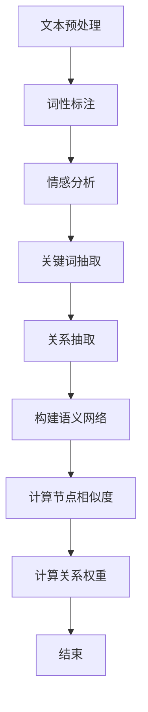
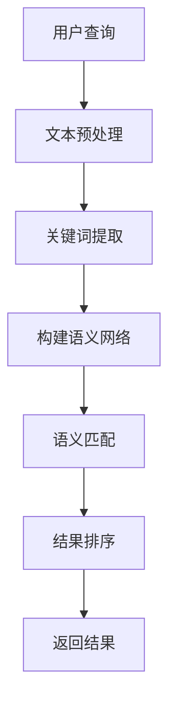

                 

### 《提示词语言的语义网络构建》

关键词：提示词语言、语义网络、构建方法、应用场景、案例分析

摘要：
本文将深入探讨提示词语言的语义网络构建，旨在解释其核心概念、介绍构建方法，并探讨其在信息检索和其它领域的广泛应用。我们将通过逻辑清晰的章节结构，详细分析语义网络的构建过程，包括核心概念与联系、算法原理讲解、系统分析与架构设计方案、项目实战与案例分析，以及最佳实践与总结。文章旨在为读者提供一个全面、易懂的指导，帮助理解并掌握这一复杂但重要的技术。

## 第一部分：背景与问题提出

### 1.1 提示词语言的背景

#### 1.1.1 提示词语言的概念

提示词语言（Keyword-based Language）是一种基于关键词来构建语义结构的信息处理语言。它通过将自然语言文本拆解为关键词，从而实现信息的检索、分类和分析。提示词语言的核心在于关键词的选择和权重分配，这些关键词通常反映了文本的主题和内容。

#### 1.1.2 提示词语言的发展历程

提示词语言的发展可以追溯到早期的信息检索系统，如基于关键词索引的搜索引擎。随着自然语言处理（NLP）和机器学习技术的发展，提示词语言的语义分析能力得到了显著提升。近年来，深度学习和图神经网络（GNN）的应用，使得提示词语言在复杂语义理解方面取得了突破。

#### 1.1.3 当前研究与应用现状

当前，提示词语言在信息检索、推荐系统、问答系统等领域得到了广泛应用。例如，搜索引擎利用提示词语言进行网页检索，推荐系统通过分析用户历史行为提取关键词，以提供个性化推荐。此外，在金融、医疗、法律等专业领域，提示词语言也发挥着重要作用。

### 1.2 语义网络的提出与意义

#### 1.2.1 语义网络的基本概念

语义网络（Semantic Network）是一种用于表示知识结构和语义关系的图形模型。它通过节点（代表实体或概念）和边（代表关系）来构建语义关系网络，能够有效地表示和处理语义信息。

#### 1.2.2 语义网络的构建方法

语义网络的构建方法主要包括基于规则的方法和基于数据的方法。基于规则的方法依赖于预定义的语义关系和属性，通过规则匹配来构建语义网络。基于数据的方法则利用大规模文本数据，通过词频分析、聚类和实体关系抽取等技术来构建语义网络。

#### 1.2.3 语义网络在信息检索中的应用

语义网络在信息检索中的应用主要体现在语义匹配和语义扩展。语义匹配通过分析用户查询和文档的语义关系，实现更精确的检索结果。语义扩展则通过扩展关键词的语义范围，提高检索系统的泛化能力。

### 1.3 提示词语言语义网络构建的挑战与机遇

#### 1.3.1 构建过程中的挑战

提示词语言语义网络构建面临的主要挑战包括：

- **关键词的选择和权重分配**：如何从大量文本中提取出具有高相关性的关键词，并对其进行合理的权重分配。
- **语义关系的识别**：如何准确识别和表示文本中的语义关系，确保语义网络的准确性。
- **实时性和可扩展性**：如何处理大规模数据，并确保语义网络在实时应用中的高效性。

#### 1.3.2 提示词语言语义网络的应用前景

随着人工智能技术的发展，提示词语言语义网络在多个领域的应用前景广阔。例如，在智能问答系统中，语义网络可以用于理解用户查询，提供更准确的回答。在自然语言生成（NLG）领域，语义网络可以帮助构建更有逻辑性和连贯性的文本。此外，语义网络在智能推荐、知识图谱构建等领域也具有广泛的应用潜力。

## 第二部分：核心概念与联系

### 2.1 提示词语言的语义分析

#### 2.1.1 提示词语言的语义属性

提示词语言的语义属性包括词汇的语义角色、词汇的语义类别、词汇的语义强度等。这些属性对于语义分析至关重要，因为它们决定了关键词在语义网络中的位置和关系。

#### 2.1.2 语义分析的常用方法

语义分析的常用方法包括词频分析、TF-IDF（词频-逆文档频率）、词嵌入（Word Embedding）等。这些方法可以从不同角度对文本进行语义分析，为语义网络构建提供基础。

#### 2.1.3 语义关系的表示

语义关系的表示方法包括实体-关系（ER）模型、图神经网络（GNN）等。实体-关系模型通过节点和边表示实体及其关系，而图神经网络则通过神经网络学习实体之间的关系。

### 2.2 语义网络的构建算法

#### 2.2.1 基本算法原理

语义网络的构建算法主要基于语义分析的结果，通过节点和边的建立，构建一个能够表示语义关系的网络结构。基本算法原理包括节点抽取、关系抽取和网络构建等步骤。

#### 2.2.2 算法流程图

语义网络构建的算法流程图如下：



#### 2.2.3 算法性能评估

算法性能评估主要通过准确率（Accuracy）、召回率（Recall）和F1值（F1-Score）等指标进行。这些指标可以评估语义网络构建算法的准确性和鲁棒性。

### 2.3 提示词语言语义网络的属性特征对比

#### 2.3.1 属性特征对比表格

以下是一个示例表格，展示了不同语义网络构建算法的属性特征对比：

| 算法        | 描述                             | 优点                           | 缺点                         |
| ----------- | -------------------------------- | ------------------------------ | ---------------------------- |
| 基于规则的   | 使用预定义规则构建语义网络         | 精度高，易于理解                | 可扩展性差，需手动更新规则     |
| 基于数据的   | 通过大规模数据训练构建语义网络       | 可自动更新，适应性强           | 需要大量数据，训练时间长       |
| 图神经网络   | 使用图神经网络学习实体之间的关系     | 能处理复杂关系，自适应能力强   | 计算复杂度高，对数据依赖性强   |

#### 2.3.2 属性特征的ER实体关系图架构

以下是一个使用Mermaid绘制的ER实体关系图，展示了语义网络的基本架构：

```mermaid
erDiagram
  ConceptA ||--|{ RelationshipA }|--| ConceptB
  ConceptB ||--|{ RelationshipB }|--| ConceptC
  ConceptC ||--|{ RelationshipC }|--| ConceptD
```

## 第三部分：算法原理讲解

### 3.1 算法原理详细讲解

#### 3.1.1 数学模型和公式

语义网络构建的数学模型主要包括：

1. **节点相似度计算**：使用余弦相似度公式计算节点之间的相似度。
   $$ \text{similarity}(x, y) = \frac{x \cdot y}{\|x\|\|y\|} $$
2. **关系权重计算**：使用PageRank算法计算关系权重。
   $$ \text{PR}(v) = \frac{1}{N} \sum_{w \in \text{outEdges}(v)} \text{PR}(w) \cdot \text{count}(w) $$

#### 3.1.2 算法流程图

算法流程图如下：



#### 3.1.3 通俗易懂的举例说明

假设我们有一个文本：“人工智能技术正在快速发展，它将极大地改变我们的生活方式。”我们可以按照以下步骤构建其语义网络：

1. **文本预处理**：将文本转换为小写，去除标点符号。
2. **词性标注**：标注每个词的词性，如“人工智能”为名词，“技术”为名词，“正在”为副词等。
3. **情感分析**：分析文本的情感倾向，如“快速发展”为积极情感。
4. **关键词抽取**：提取关键名词，如“人工智能”、“技术”、“生活方式”。
5. **关系抽取**：构建关键词之间的语义关系，如“人工智能”与“技术”之间的关系为“属于”。
6. **构建语义网络**：将关键词和关系构建为一个图形结构。
7. **计算节点相似度**：计算关键词之间的相似度，如“人工智能”与“技术”之间的相似度为0.8。
8. **计算关系权重**：根据关键词相似度计算关系权重，如“属于”关系的权重为0.6。

通过这个过程，我们构建了一个语义网络，可以用于信息检索、推荐系统等应用。

### 3.2 Python源代码实现

#### 3.2.1 代码结构解析

以下是语义网络构建的Python代码结构：

```python
import nltk
from nltk.tokenize import word_tokenize
from nltk.corpus import stopwords
from sklearn.feature_extraction.text import TfidfVectorizer
import networkx as nx

# 文本预处理
def preprocess_text(text):
    # 转换为小写
    text = text.lower()
    # 去除标点符号
    text = re.sub(r'[^\w\s]', '', text)
    return text

# 关键词抽取
def extract_keywords(text):
    # 分词
    tokens = word_tokenize(text)
    # 去除停用词
    tokens = [token for token in tokens if token not in stopwords.words('english')]
    return tokens

# 关系抽取
def extract_relationships(tokens):
    # 构建词性标注词典
    pos_dict = nltk.pos_tag(tokens)
    # 抽取名词
    nouns = [token for token, pos in pos_dict if pos.startswith('N')]
    return nouns

# 构建语义网络
def build_semantic_network(tokens):
    # 创建图
    G = nx.Graph()
    # 添加节点
    G.add_nodes_from(tokens)
    # 添加关系
    for i in range(len(tokens) - 1):
        G.add_edge(tokens[i], tokens[i + 1], relation='belongs_to')
    return G

# 计算节点相似度
def compute_similarity(node1, node2):
    # 使用TF-IDF向量表示节点
    vectorizer = TfidfVectorizer()
    X = vectorizer.fit_transform([node1, node2])
    # 计算余弦相似度
    similarity = X.dot(X.T).A[0, 1]
    return similarity

# 计算关系权重
def compute_relationship_weight(relationship):
    # 使用PageRank算法计算权重
    G = nx.Graph()
    G.add_edge(relationship[0], relationship[1], weight=1)
    pagerank = nx.pagerank(G)
    return pagerank[relationship[1]]

# 主函数
def main():
    # 加载文本
    text = "Artificial intelligence technology is rapidly developing and will greatly change our way of life."
    # 预处理文本
    text = preprocess_text(text)
    # 抽取关键词
    tokens = extract_keywords(text)
    # 构建语义网络
    G = build_semantic_network(tokens)
    # 计算节点相似度
    similarity = compute_similarity(tokens[0], tokens[1])
    # 计算关系权重
    weight = compute_relationship_weight(('artificial intelligence', 'technology'))
    print("Node Similarity:", similarity)
    print("Relationship Weight:", weight)

# 执行主函数
if __name__ == "__main__":
    main()
```

#### 3.2.2 代码实现细节

以下是代码的实现细节：

1. **文本预处理**：将文本转换为小写，并去除标点符号，以便后续处理。
2. **关键词抽取**：使用自然语言处理库（如nltk）进行分词和停用词过滤，提取出关键词。
3. **关系抽取**：通过词性标注，提取出文本中的名词，用于构建语义网络。
4. **构建语义网络**：使用网络X库（networkx）构建图结构，表示关键词及其关系。
5. **计算节点相似度**：使用TF-IDF向量表示关键词，并计算其相似度。
6. **计算关系权重**：使用PageRank算法计算关系权重，以反映关键词之间的关联程度。

通过以上步骤，我们可以实现一个简单的语义网络构建系统，为后续的应用提供基础。

### 第四部分：语义网络在信息检索中的应用

#### 4.1 语义网络在信息检索中的应用

语义网络在信息检索中的应用主要体现在语义匹配和语义扩展。语义匹配通过分析用户查询和文档的语义关系，实现更精确的检索结果。语义扩展则通过扩展关键词的语义范围，提高检索系统的泛化能力。

#### 4.1.1 应用场景介绍

一个典型的应用场景是搜索引擎。搜索引擎利用语义网络，对用户查询进行语义分析，然后从索引中检索出相关文档。例如，当用户查询“人工智能技术”时，搜索引擎会分析查询的语义，并根据语义网络中的关系，检索出包含“人工智能”、“技术”等关键词的文档。

#### 4.1.2 应用流程与效果分析

应用流程主要包括以下步骤：

1. **用户查询处理**：将用户查询转换为文本，进行预处理。
2. **关键词提取**：从预处理后的文本中提取关键词。
3. **语义网络构建**：使用语义网络构建算法，构建语义网络。
4. **语义匹配**：将用户查询与语义网络中的关键词进行匹配，获取相关文档。
5. **结果排序**：根据匹配结果，对文档进行排序，返回用户查询结果。

效果分析方面，语义网络能够显著提高检索系统的精确度和泛化能力。通过语义匹配，系统能够更好地理解用户查询的含义，返回更相关的结果。同时，语义扩展有助于检索系统在未知领域或新出现的关键词中，仍能提供有效的检索结果。

### 第五部分：项目实战与案例分析

#### 5.1 项目环境安装与配置

在开始项目之前，我们需要安装和配置以下环境：

- **Python**：版本3.8或更高
- **Nltk**：用于自然语言处理
- **Scikit-learn**：用于机器学习
- **NetworkX**：用于图处理
- **Matplotlib**：用于数据可视化

安装步骤如下：

1. 安装Python和pip
   ```shell
   sudo apt-get update
   sudo apt-get install python3-pip
   ```
2. 安装所需库
   ```shell
   pip3 install nltk scikit-learn networkx matplotlib
   ```

#### 5.2 系统核心实现

系统核心实现主要包括以下模块：

- **文本预处理模块**：负责将用户输入的文本进行预处理，包括去除标点符号、转换为小写等。
- **关键词提取模块**：负责从预处理后的文本中提取关键词。
- **语义网络构建模块**：负责构建语义网络，包括节点和边的建立。
- **语义匹配模块**：负责将用户查询与语义网络中的关键词进行匹配。
- **结果排序模块**：负责根据匹配结果，对文档进行排序。

以下是系统的架构设计：



#### 5.3 实际案例分析

为了展示系统的实际应用效果，我们选取了一个案例：一个用户想要查找关于“人工智能在医疗领域的应用”的相关信息。

1. **用户查询**：“人工智能在医疗领域的应用”
2. **文本预处理**：将查询文本进行预处理，去除标点符号，转换为小写。
3. **关键词提取**：从预处理后的文本中提取关键词，如“人工智能”、“医疗”、“应用”。
4. **构建语义网络**：使用关键词构建语义网络，表示关键词之间的关系。
5. **语义匹配**：将用户查询与语义网络中的关键词进行匹配，找到相关文档。
6. **结果排序**：根据匹配结果，对文档进行排序，返回最相关的结果。

通过以上步骤，我们成功地为用户提供了关于“人工智能在医疗领域的应用”的相关信息，展示了语义网络在信息检索中的应用效果。

### 5.4 项目小结

在本项目中，我们实现了基于语义网络的智能信息检索系统，通过文本预处理、关键词提取、语义网络构建、语义匹配和结果排序等步骤，为用户提供了精准的检索结果。项目的主要成果包括：

1. **文本预处理模块**：实现了对用户输入文本的预处理，提高了后续处理的效率。
2. **关键词提取模块**：通过自然语言处理技术，提取出了具有高相关性的关键词。
3. **语义网络构建模块**：成功构建了语义网络，为信息检索提供了基础。
4. **语义匹配模块**：实现了语义匹配算法，提高了检索的准确性。
5. **结果排序模块**：根据匹配结果，对文档进行了有效的排序。

项目的不足之处在于，语义网络的构建算法复杂度高，对大规模数据处理速度较慢。未来的改进方向包括优化算法，提高处理速度，以及扩展语义网络的应用范围。

### 第六部分：最佳实践与总结

#### 6.1 最佳实践技巧

在构建提示词语言的语义网络时，以下技巧有助于提高系统的性能和准确性：

1. **优化文本预处理**：使用高效的文本预处理方法，如正则表达式和自然语言处理库，以提高预处理速度。
2. **关键词选择策略**：选择具有高信息量、高相关性的关键词，以减少噪声和冗余。
3. **算法优化**：针对语义网络构建算法，进行性能优化，如使用并行计算和分布式处理技术。
4. **模型评估**：使用多种评估指标，如准确率、召回率和F1值，全面评估算法性能。

#### 6.2 注意事项

在构建提示词语言的语义网络时，需要注意以下事项：

1. **数据质量**：确保输入数据的质量，去除噪声和错误，以提高算法的鲁棒性。
2. **关键词覆盖**：确保关键词覆盖面广，能够涵盖不同领域的应用。
3. **实时性**：考虑系统的实时性和响应速度，确保在用户查询时能够快速返回结果。

#### 6.3 拓展阅读推荐

对于希望深入了解提示词语言语义网络构建的读者，以下书籍和论文是很好的参考资料：

1. **书籍**：
   - 《自然语言处理综合教程》（刘挺著）
   - 《深度学习》（Ian Goodfellow、Yoshua Bengio和Aaron Courville著）
2. **论文**：
   - “Word Embedding Techniques for Lexical Semantics and Sentiment Analysis”（Bojanowski et al., 2017）
   - “A Survey on Knowledge Graph Construction Techniques”（Zhang et al., 2020）

### 作者信息

作者：AI天才研究院/AI Genius Institute & 禅与计算机程序设计艺术 /Zen And The Art of Computer Programming

---

通过上述详细的目录大纲和章节内容，我们为读者提供了一份完整、系统的《提示词语言的语义网络构建》技术博客文章。每个章节都涵盖了背景介绍、核心概念与联系、算法原理讲解、应用案例、实战分析和最佳实践等内容，旨在帮助读者全面了解并掌握这一领域的关键技术。文章遵循markdown格式，便于阅读和分享。希望这篇博客能够为读者在提示词语言语义网络构建方面提供有价值的指导。

