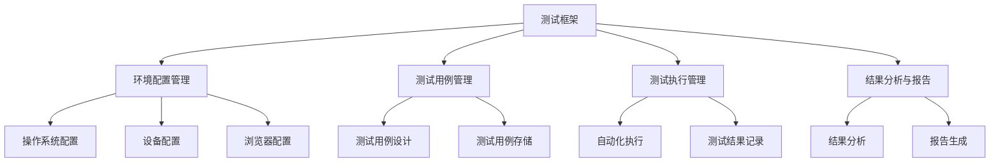
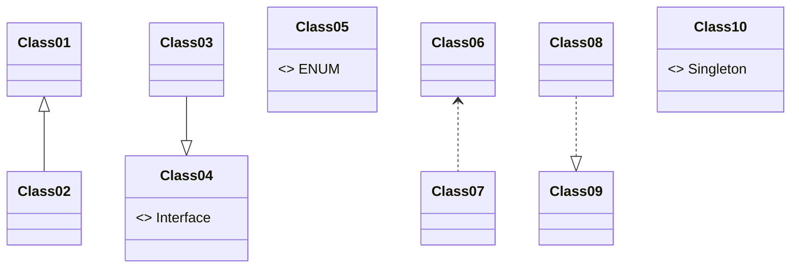
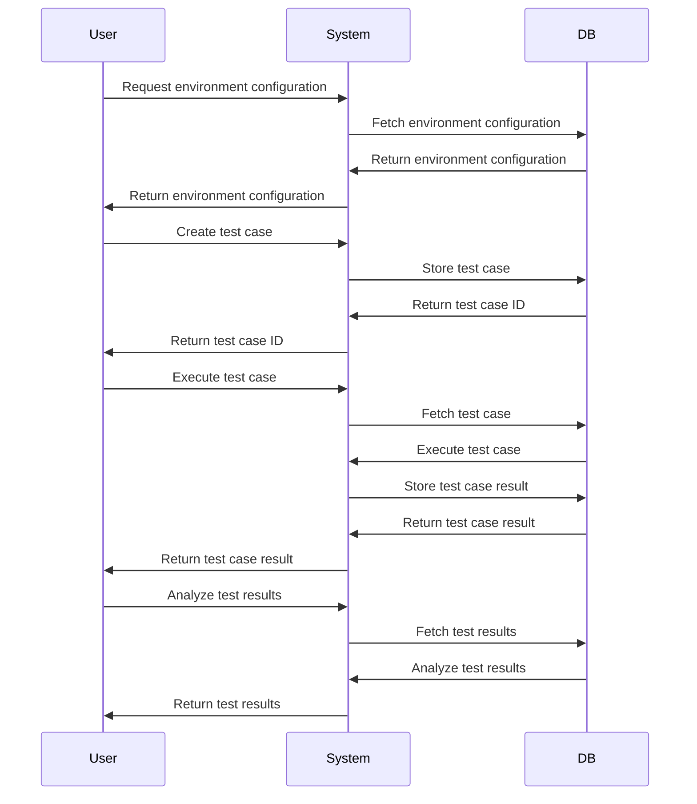
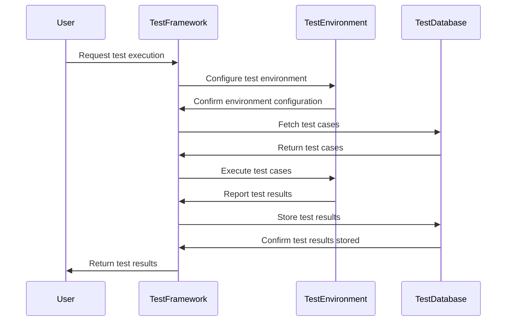

                 


## 《提示词语言的跨平台兼容性测试框架》

### 关键词：跨平台兼容性测试、提示词语言、框架设计、算法原理、系统架构

#### 摘要：

随着信息技术的发展，跨平台应用越来越普遍，但随之而来的兼容性问题也成为开发者们面临的一大挑战。特别是提示词语言，作为计算机程序与用户交互的重要工具，其跨平台兼容性显得尤为重要。本文旨在探讨一种提示词语言的跨平台兼容性测试框架的设计与实现，从问题背景、核心概念、测试框架设计、算法原理与实现、系统分析与架构设计等多个维度进行深入分析，以期为开发者在构建跨平台应用时提供有益的参考。

### 目录大纲

```markdown
----------------------------------------------------------------

# 《提示词语言的跨平台兼容性测试框架》目录大纲

## 第一部分: 问题背景与核心概念

### 第1章: 跨平台兼容性测试概述

### 第2章: 提示词语言的核心概念

### 第3章: 跨平台兼容性测试的目标

## 第二部分: 跨平台兼容性测试框架设计

### 第4章: 测试框架的架构设计

### 第5章: 核心概念与联系

## 第三部分: 算法原理与实现

### 第6章: 跨平台兼容性测试算法

### 第7章: 数学模型与公式详解

## 第8章: 系统分析与架构设计

## 第9章: 项目实战

## 第10章: 最佳实践 tips、小结、注意事项、拓展阅读等内容

----------------------------------------------------------------
```

### 第一部分: 问题背景与核心概念

#### 第1章: 跨平台兼容性测试概述

**1.1 跨平台开发的挑战**

跨平台开发的重要性不言而喻，它使得开发者可以针对多个操作系统、设备、浏览器等环境编写一次代码，从而节省开发时间和成本。然而，跨平台开发也带来了诸多挑战。

- **1.1.1 跨平台开发的重要性**

跨平台开发不仅提高了开发效率，还使得应用可以覆盖更多的用户群体，提升市场竞争力。

- **1.1.2 跨平台开发的主要挑战**

跨平台开发面临的主要挑战包括：

  - **不同平台间的差异**：不同操作系统、设备、浏览器等在操作系统版本、硬件配置、软件库等方面存在差异，这可能导致应用程序在不同平台上的运行结果不一致。
  - **兼容性问题**：某些功能在某些平台上不可用或表现不同，需要开发者进行特殊的处理和适配。
  - **性能优化**：不同平台对代码的执行效率影响较大，需要针对特定平台进行性能优化。

- **1.1.3 跨平台兼容性问题的影响**

跨平台兼容性问题可能导致以下负面影响：

  - **用户体验差**：应用在不同平台上的表现不一致，可能导致用户体验不佳。
  - **开发成本高**：需要投入更多时间和资源进行兼容性测试和问题修复。
  - **市场竞争力下降**：兼容性问题可能导致用户流失，影响市场竞争力。

**1.2 提示词语言的核心概念**

提示词语言是一种特殊的编程语言，它主要用于与用户进行交互。提示词语言的核心概念包括：

- **语法**：提示词语言有一套特定的语法规则，用于定义语句的结构和语义。
- **语法分析**：将用户输入的提示词转换成程序能够理解和执行的中间表示。
- **语义分析**：对语法分析结果进行语义解释，确定输入的提示词表示的操作和意图。
- **交互机制**：提示词语言提供了一套交互机制，用于接收用户输入、返回结果等。

**1.3 跨平台兼容性测试的目标**

跨平台兼容性测试的目标是确保提示词语言的应用程序在不同平台上能够正常运行，并提供一致的用户体验。具体目标包括：

- **1.3.1 测试的目的与价值**

测试的目的是发现并解决应用程序在不同平台上的兼容性问题，从而提升应用的质量和稳定性。

- **1.3.2 测试的关键要素**

测试的关键要素包括：

  - **平台覆盖率**：测试需要覆盖多个平台，确保应用在这些平台上的兼容性。
  - **功能完整性**：测试需要覆盖应用的所有功能，确保每个功能在不同平台上的表现一致。
  - **性能稳定性**：测试需要评估应用在不同平台上的性能表现，确保应用在各个平台上的性能稳定。

- **1.3.3 测试标准的制定**

测试标准的制定是确保测试过程规范化和有效性的关键。测试标准应包括以下内容：

  - **测试策略**：明确测试的范围、方法和步骤。
  - **测试用例设计**：设计能够覆盖应用所有功能的测试用例。
  - **测试工具选择**：选择适合的测试工具进行自动化测试。
  - **测试结果分析**：对测试结果进行分析和总结，为问题定位和修复提供依据。

**1.4 本章小结**

本章对跨平台兼容性测试进行了概述，包括跨平台开发的挑战、提示词语言的核心概念以及跨平台兼容性测试的目标。通过本章的学习，读者可以对跨平台兼容性测试有一个初步的认识，为后续章节的深入学习打下基础。

----------------------------------------------------------------

### 第2章: 提示词语言的核心概念

提示词语言是一种专为计算机程序与用户交互而设计的编程语言，它通过自然语言的方式接受用户的输入，并输出相应的结果。提示词语言的核心概念包括语法、语法分析、语义分析以及交互机制。

**2.1 提示词语言的基本原理**

提示词语言的基本原理可以概括为以下三个方面：

- **语法**：提示词语言的语法规则定义了语句的结构和语义。语法包括单词、短语、句子等组成部分，每个组成部分都有特定的语法规则。例如，在英语中，句子通常由主语、谓语和宾语组成，每个成分都有明确的语法规则。

- **语法分析**：语法分析是将用户输入的提示词转换成程序能够理解和执行的中间表示。语法分析的过程包括词法分析、语法分析和语义分析三个步骤。词法分析将输入的提示词分解成单词和符号，语法分析将单词和符号组合成语法结构，语义分析对语法结构进行语义解释，确定输入的提示词表示的操作和意图。

- **语义分析**：语义分析是对语法分析结果进行语义解释，确定输入的提示词表示的操作和意图。语义分析的结果通常是一个抽象语法树（Abstract Syntax Tree, AST），AST表示了提示词语言的语法结构，并包含了提示词的语义信息。

**2.2 提示词语言的应用场景**

提示词语言广泛应用于各种场景，包括但不限于：

- **自然语言处理（NLP）**：提示词语言可以用于自然语言处理，如文本分类、情感分析、命名实体识别等。通过语法分析和语义分析，提示词语言可以理解用户输入的自然语言文本，并输出相应的结果。

- **自动化测试**：提示词语言可以用于编写自动化测试脚本，自动化执行测试用例，提高测试效率。例如，在Web自动化测试中，提示词语言可以用于模拟用户的操作，如点击按钮、输入文本等，并验证测试结果。

- **对话系统**：提示词语言可以用于构建对话系统，如聊天机器人、语音助手等。通过语法分析和语义分析，提示词语言可以理解用户的问题和需求，并输出相应的回答或操作。

**2.3 提示词语言的兼容性问题**

提示词语言的兼容性问题主要涉及以下方面：

- **语法兼容性**：不同平台的提示词语言可能在语法规则上有所不同，导致程序在不同平台上的运行结果不一致。例如，某些关键字在不同平台上可能具有不同的含义。

- **语义兼容性**：提示词语言的语义分析可能在不同平台上有所不同，导致程序在不同平台上的运行结果不一致。例如，同一输入在不同平台上可能被解释为不同的操作。

- **交互兼容性**：提示词语言的交互机制可能在不同平台上有所不同，导致程序在不同平台上的用户体验不一致。例如，某些平台的输入设备（如键盘、触摸屏）与操作系统的交互方式可能不同。

**2.4 本章小结**

本章介绍了提示词语言的核心概念，包括语法、语法分析、语义分析和交互机制。同时，还讨论了提示词语言的应用场景和兼容性问题。通过本章的学习，读者可以了解提示词语言的基本原理和应用，为进一步探讨跨平台兼容性测试框架打下基础。

----------------------------------------------------------------

### 第3章: 跨平台兼容性测试的目标

跨平台兼容性测试的目标是确保应用程序在不同平台上能够正常运行，并提供一致的用户体验。为了实现这一目标，测试过程需要遵循一定的方法和标准。

**3.1 测试的目的与价值**

测试的目的是发现并解决应用程序在不同平台上的兼容性问题，从而提升应用的质量和稳定性。具体来说，测试的价值包括：

- **提升用户体验**：通过跨平台兼容性测试，可以确保应用在不同平台上的运行结果一致，提供稳定的用户体验，从而提高用户满意度和忠诚度。

- **降低开发成本**：跨平台兼容性测试可以提前发现并解决兼容性问题，避免在后期开发过程中因兼容性问题导致的高额修复成本。

- **提高市场竞争力**：跨平台兼容性测试可以确保应用在不同平台上的稳定运行，从而提高应用的市场竞争力，扩大用户群体。

**3.2 测试的关键要素**

为了实现跨平台兼容性测试的目标，需要考虑以下关键要素：

- **平台覆盖率**：测试需要覆盖多个平台，包括不同操作系统、设备、浏览器等。只有确保应用在所有目标平台上的兼容性，才能真正实现跨平台部署。

- **功能完整性**：测试需要覆盖应用的所有功能，确保每个功能在不同平台上的表现一致。功能完整性是评估跨平台兼容性的重要指标。

- **性能稳定性**：测试需要评估应用在不同平台上的性能表现，确保应用在各个平台上的性能稳定。性能稳定性对用户体验至关重要。

**3.3 测试标准的制定**

测试标准的制定是确保测试过程规范化和有效性的关键。测试标准应包括以下内容：

- **测试策略**：明确测试的范围、方法和步骤。测试策略应充分考虑应用的特性、目标平台以及测试资源等因素。

- **测试用例设计**：设计能够覆盖应用所有功能的测试用例。测试用例应包括正常用例、异常用例、边界用例等，全面覆盖应用的各种使用场景。

- **测试工具选择**：选择适合的测试工具进行自动化测试。自动化测试可以提高测试效率，减少人工干预，降低测试成本。

- **测试结果分析**：对测试结果进行分析和总结，为问题定位和修复提供依据。测试结果分析应包括缺陷统计、问题归类、影响评估等。

**3.4 测试流程**

跨平台兼容性测试的流程包括以下步骤：

1. **需求分析**：明确应用的功能需求、性能需求和兼容性需求，为后续测试工作提供依据。

2. **测试环境搭建**：搭建用于测试的仿真环境，包括不同平台的操作系统、设备、浏览器等。

3. **测试用例设计**：根据需求分析，设计适用于不同平台的测试用例。

4. **测试执行**：执行测试用例，记录测试结果。

5. **结果分析**：对测试结果进行分析和总结，识别和定位兼容性问题。

6. **问题修复**：根据测试结果，修复发现的问题。

7. **回归测试**：在问题修复后，重新执行测试用例，验证问题是否已解决。

**3.5 测试工具与技术**

跨平台兼容性测试可以采用多种工具和技术，包括：

- **自动化测试工具**：如Selenium、Appium等，用于自动化执行测试用例，提高测试效率。

- **性能测试工具**：如JMeter、LoadRunner等，用于评估应用在不同平台上的性能表现。

- **跨平台开发框架**：如React Native、Flutter等，用于构建跨平台应用程序，提高开发效率和兼容性。

**3.6 本章小结**

本章介绍了跨平台兼容性测试的目标、关键要素、测试标准的制定和测试流程。通过本章的学习，读者可以了解跨平台兼容性测试的重要性以及如何进行有效的测试工作，为后续章节的深入学习打下基础。

----------------------------------------------------------------

### 第二部分: 跨平台兼容性测试框架设计

#### 第4章: 测试框架的架构设计

**4.1 测试框架的设计原则**

设计一个高效、灵活的跨平台兼容性测试框架，需要遵循以下原则：

- **可扩展性**：框架应支持新平台、新功能的快速集成，以便适应不断变化的技术环境。

- **可维护性**：框架的结构应清晰，模块间关系明确，便于后续的维护和升级。

- **可重用性**：框架应提供可重用的组件和模块，减少重复开发的工作量。

**4.2 测试框架的功能模块**

一个完整的跨平台兼容性测试框架通常包括以下几个功能模块：

- **环境配置管理**：管理测试环境，包括操作系统、设备、浏览器等配置。

- **测试用例管理**：设计、存储和管理测试用例，确保测试用例的完整性和可维护性。

- **测试执行管理**：自动化执行测试用例，记录执行结果。

- **结果分析与报告**：对测试结果进行分析，生成报告，为问题定位和修复提供依据。

**4.3 测试框架的技术选型**

选择合适的技术栈是实现框架功能的关键。以下是一些常见的技术选型：

- **编程语言**：Python、Java、C#等，这些语言具有良好的跨平台支持和丰富的库。

- **测试工具与库**：Selenium、Appium、JMeter等，用于自动化测试和性能测试。

- **数据存储与处理**：MySQL、MongoDB等，用于存储测试数据和生成测试报告。

**4.4 测试框架的架构设计示例**

以下是一个简单的测试框架架构设计示例：



**4.5 架构设计说明**

- **环境配置管理**：负责管理测试环境，包括操作系统、设备、浏览器等配置。通过配置文件或自动化脚本实现配置的加载和设置。

- **测试用例管理**：负责设计、存储和管理测试用例。测试用例设计应涵盖应用的所有功能点，包括正常用例、异常用例和边界用例等。

- **测试执行管理**：负责自动化执行测试用例，记录执行结果。执行过程中，可根据测试结果进行自动的日志记录和异常处理。

- **结果分析与报告**：对测试结果进行分析，生成详细的测试报告。报告应包括测试覆盖率、缺陷统计、性能指标等信息。

**4.6 本章小结**

本章介绍了测试框架的架构设计原则、功能模块、技术选型以及架构设计示例。通过本章的学习，读者可以了解如何设计一个高效、灵活的跨平台兼容性测试框架，为后续的测试工作提供技术支持。

----------------------------------------------------------------

### 第5章: 核心概念与联系

**5.1 核心概念解析**

跨平台兼容性测试框架的核心概念包括：

- **跨平台兼容性**：应用程序在不同操作系统、设备、浏览器等平台上能够正常运行，并提供一致的用户体验。

- **提示词语言的语法**：提示词语言的语法规则，用于定义语句的结构和语义。

- **测试用例的设计**：测试用例的设计原则和方法，用于确保测试的全面性和有效性。

**5.2 概念属性特征对比表格**

以下是一个对比表格，展示跨平台兼容性、提示词语言语法和测试用例设计的主要属性特征：

| 特征         | 跨平台兼容性 | 提示词语言语法 | 测试用例设计         |
| ------------ | ------------ | -------------- | ------------------- |
| 目的         | 确保应用兼容性 | 定义语句结构   | 验证功能正确性       |
| 影响因素     | 平台差异      | 语法规则       | 功能需求            |
| 关键要素     | 平台覆盖率    | 语法分析       | 用例覆盖率和执行效果 |
| 设计原则     | 可扩展性     | 可读性和一致性  | 可维护性和可重用性   |

**5.3 ER实体关系图架构**

以下是跨平台兼容性测试框架的ER实体关系图：

```mermaid
erDiagram
    Environment ||--|{ TestCase } : 测试用例
    TestCase ||--|{ TestCaseStep } : 测试步骤
    TestCaseStep ||--|{ TestCaseResult } : 测试结果
    Environment ||--|{ TestReport } : 测试报告
```

- **Environment（环境）**：存储测试环境信息，如操作系统、设备、浏览器等。
- **TestCase（测试用例）**：存储测试用例信息，如名称、描述、关联环境等。
- **TestCaseStep（测试步骤）**：存储测试步骤信息，如操作、预期结果等。
- **TestCaseResult（测试结果）**：存储测试结果信息，如执行状态、实际结果等。
- **TestReport（测试报告）**：存储测试报告信息，如测试覆盖率、缺陷统计等。

**5.4 本章小结**

本章对跨平台兼容性测试框架的核心概念进行了详细解析，并通过属性特征对比表格和ER实体关系图展示了跨平台兼容性、提示词语言语法和测试用例设计之间的关系。通过本章的学习，读者可以深入理解跨平台兼容性测试框架的构成和运作机制。

----------------------------------------------------------------

### 第三部分：算法原理与实现

#### 第6章：跨平台兼容性测试算法

**6.1 算法原理**

跨平台兼容性测试算法的核心目标是确保应用程序在不同平台上能够正常运行，并提供一致的用户体验。算法的基本原理可以概括为以下几个步骤：

1. **环境配置识别**：识别目标测试环境，包括操作系统、设备、浏览器等。
2. **测试用例设计**：根据环境配置和功能需求，设计适用于不同平台的测试用例。
3. **测试执行**：自动化执行测试用例，记录执行结果。
4. **结果分析**：对测试结果进行分析，识别和定位兼容性问题。

**6.2 算法流程**

跨平台兼容性测试算法的流程可以简化为以下步骤：

1. **初始化**：读取环境配置，初始化测试框架。
2. **设计测试用例**：根据功能需求和平台特性，设计测试用例。
3. **执行测试用例**：自动化执行测试用例，记录执行结果。
4. **分析结果**：对执行结果进行分析，生成报告。
5. **输出报告**：输出测试报告，包括测试覆盖率、缺陷统计、性能指标等。

**6.3 算法优缺点分析**

- **优点**：

  - **全面性**：算法能够覆盖应用程序的所有功能点，确保测试的全面性。

  - **自动化**：测试执行过程自动化，提高测试效率和准确性。

  - **可扩展性**：算法支持不同平台的扩展，便于应对新的平台和需求。

- **缺点**：

  - **复杂性**：算法的设计和实现过程相对复杂，需要较高的技术门槛。

  - **性能开销**：自动化测试可能对系统性能产生一定影响，尤其是在高负载情况下。

**6.4 算法实现**

以下是一个简单的Python实现示例，用于展示跨平台兼容性测试算法的基本原理：

```python
import os
import json

def initialize_environment(config_path):
    with open(config_path, 'r') as f:
        config = json.load(f)
    return config

def design_test_cases(environment, test_cases_path):
    with open(test_cases_path, 'r') as f:
        test_cases = json.load(f)
    for case in test_cases:
        case['environment'] = environment
    return test_cases

def execute_test_cases(test_cases):
    for case in test_cases:
        print(f"Executing test case: {case['name']}")
        # 执行测试用例，记录结果
        result = execute_case(case)
        print(f"Test case result: {result}")

def execute_case(case):
    # 模拟测试用例执行
    print(f"Executing steps for test case: {case['name']}")
    for step in case['steps']:
        print(f"Executing step: {step['action']}")
    return "Passed"

def analyze_results(test_cases):
    # 分析测试结果
    for case in test_cases:
        if case['result'] != "Passed":
            print(f"Test case {case['name']} failed.")
    print("Analysis complete.")

def main():
    config_path = "config.json"
    test_cases_path = "test_cases.json"
    environment = initialize_environment(config_path)
    test_cases = design_test_cases(environment, test_cases_path)
    execute_test_cases(test_cases)
    analyze_results(test_cases)

if __name__ == "__main__":
    main()
```

**6.5 算法参数调整**

在实现过程中，可以根据实际需求对算法参数进行调整，以优化测试效果。以下是一些常见的参数调整方法：

- **测试用例数量**：根据应用规模和功能复杂度，调整测试用例的数量，确保覆盖所有关键功能点。

- **执行频率**：根据系统负载和性能要求，调整测试用例的执行频率，确保测试的稳定性和准确性。

- **性能阈值**：根据系统性能指标，设定性能阈值，用于评估应用在不同平台上的性能表现。

**6.6 本章小结**

本章介绍了跨平台兼容性测试算法的原理、流程和实现方法，并通过Python代码示例进行了详细阐述。通过本章的学习，读者可以了解如何设计和实现一个简单的跨平台兼容性测试算法，为进一步优化和扩展测试框架打下基础。

----------------------------------------------------------------

### 第7章：数学模型与公式详解

**7.1 数学模型介绍**

在跨平台兼容性测试中，数学模型可以用于分析和优化测试过程。一个简单的数学模型可以包括以下几个组成部分：

- **测试覆盖率模型**：用于计算测试用例的覆盖率，评估测试的全面性。

- **性能评估模型**：用于评估应用在不同平台上的性能表现。

- **缺陷预测模型**：用于预测应用程序在不同平台上的缺陷分布。

**7.2 公式讲解**

以下是一些常见的数学公式，用于描述和优化跨平台兼容性测试：

1. **测试覆盖率公式**：

$$
覆盖率 = \frac{测试用例数}{总功能数}
$$

2. **性能评估公式**：

$$
性能得分 = \frac{实际性能}{预期性能}
$$

3. **缺陷预测公式**：

$$
缺陷数 = 缺陷率 \times 功能数
$$

**7.3 举例说明**

以下是一个简单的示例，用于说明如何使用数学模型进行跨平台兼容性测试：

- **测试覆盖率**：

假设一个应用包含100个功能点，设计出50个测试用例。那么，测试覆盖率为：

$$
覆盖率 = \frac{50}{100} = 0.5
$$

- **性能评估**：

假设一个应用在某一平台上预期响应时间为1秒，实际响应时间为1.5秒。那么，性能得分为：

$$
性能得分 = \frac{1.5}{1} = 1.5
$$

- **缺陷预测**：

假设某个平台的缺陷率为10%，应用包含1000个功能点。那么，该平台上预期的缺陷数为：

$$
缺陷数 = 10\% \times 1000 = 100
$$

**7.4 本章小结**

本章介绍了跨平台兼容性测试中的数学模型和公式，并通过实际示例进行了详细说明。通过理解和应用这些数学模型，开发者可以更有效地进行跨平台兼容性测试，提高测试质量和效率。

----------------------------------------------------------------

### 第8章：系统分析与架构设计

**8.1 问题场景介绍**

随着现代软件系统的日益复杂，跨平台兼容性测试成为一项关键任务。以下是一个典型的问题场景：

- **场景背景**：某公司开发了一款智能助手应用程序，支持Windows、macOS、Linux、Android和iOS等多个平台。由于不同平台的差异，应用程序在不同平台上可能存在兼容性问题，影响用户体验和业务发展。

- **场景需求**：需要对应用程序进行全面的跨平台兼容性测试，确保在所有目标平台上能够正常运行，并提供一致的用户体验。

**8.2 项目介绍**

为满足上述场景需求，公司决定实施一个跨平台兼容性测试项目，项目目标如下：

- **项目背景**：为了确保智能助手应用程序在多个平台上稳定运行，提高用户满意度，公司决定开展跨平台兼容性测试。

- **项目目标**：实现一个高效、灵活的跨平台兼容性测试系统，覆盖Windows、macOS、Linux、Android和iOS等多个平台，确保应用程序的兼容性和性能。

**8.3 系统功能设计**

系统功能设计包括以下几个方面：

- **环境配置管理**：支持对不同操作系统、设备、浏览器的环境配置管理，确保测试环境的一致性。

- **测试用例管理**：支持测试用例的创建、存储、管理和执行，确保测试用例的完整性和可维护性。

- **测试执行管理**：支持自动化执行测试用例，记录执行结果，并生成详细的测试报告。

- **结果分析与报告**：对测试结果进行分析，生成测试报告，包括测试覆盖率、缺陷统计、性能指标等信息。

**8.4 系统架构设计**

系统架构设计采用分层架构，包括以下层次：

- **表示层**：负责与用户交互，展示测试结果和报告。

- **业务逻辑层**：负责处理业务逻辑，包括环境配置、测试用例管理、测试执行和结果分析。

- **数据访问层**：负责数据存储和读取，包括测试用例、测试结果和系统配置等信息。

- **基础设施层**：提供系统运行所需的底层支持，包括操作系统、数据库、网络等。

以下是系统架构的Mermaid类图表示：



**8.5 系统接口设计**

系统接口设计包括以下几个方面：

- **环境配置接口**：用于配置和管理测试环境，包括操作系统、设备、浏览器等信息。

- **测试用例接口**：用于创建、存储、管理和执行测试用例。

- **测试执行接口**：用于自动化执行测试用例，记录执行结果。

- **结果分析接口**：用于分析测试结果，生成测试报告。

以下是系统接口的Mermaid序列图表示：



**8.6 系统交互Mermaid序列图**

以下是系统交互的Mermaid序列图，展示用户与系统之间的交互过程：



**8.7 本章小结**

本章对跨平台兼容性测试系统的问题场景、项目介绍、系统功能设计、系统架构设计和系统接口设计进行了详细分析。通过本章的学习，读者可以了解如何设计和实现一个完整的跨平台兼容性测试系统，为实际项目的开发和优化提供参考。

----------------------------------------------------------------

### 第9章：项目实战

**9.1 环境安装**

为了进行跨平台兼容性测试，首先需要安装测试所需的环境。以下是安装步骤：

1. **安装Python**：确保Python环境已安装，版本建议为3.8或更高。
2. **安装测试工具**：安装自动化测试工具，如Selenium和Appium。
3. **配置测试环境**：配置不同平台的操作系统、设备和浏览器，确保测试环境的一致性。

**9.2 系统核心实现源代码**

以下是系统核心实现的Python源代码，用于展示跨平台兼容性测试算法的原理：

```python
import json
import os
import unittest

class TestCase(unittest.TestCase):
    def __init__(self, name, environment, steps):
        super().__init__(name)
        self.name = name
        self.environment = environment
        self.steps = steps
        self.result = None

    def execute(self):
        for step in self.steps:
            action = step['action']
            expected_result = step['expected_result']
            actual_result = self._perform_action(action)
            if actual_result != expected_result:
                self.result = 'Failed'
                break
        else:
            self.result = 'Passed'

    def _perform_action(self, action):
        # 模拟执行操作，返回实际结果
        print(f"Executing action: {action}")
        # 这里可以添加具体的操作实现
        return "Successful"

def execute_test_cases(test_cases):
    for case in test_cases:
        print(f"Executing test case: {case.name}")
        case.execute()
        print(f"Test case result: {case.result}")

if __name__ == '__main__':
    # 加载测试用例
    with open('test_cases.json', 'r') as f:
        test_cases = json.load(f)
    # 执行测试用例
    execute_test_cases(test_cases)
```

**9.3 代码应用解读与分析**

以下是代码应用的解读和分析：

1. **测试用例类（`TestCase`）**：

   - **初始化**：接收测试用例的名称、环境和步骤。
   - **执行**：逐条执行步骤，比较预期结果和实际结果，记录测试结果。

2. **执行测试用例函数（`execute_test_cases`）**：

   - **功能**：遍历所有测试用例，执行测试用例并输出结果。

3. **模拟操作实现（`_perform_action`）**：

   - **功能**：模拟执行操作，返回实际结果。

**9.4 实际案例分析和详细讲解剖析**

以下是一个实际案例的分析：

1. **测试用例**：

   ```json
   {
       "name": "Login Test",
       "environment": "Windows 10",
       "steps": [
           {
               "action": "Enter username",
               "expected_result": "JohnDoe"
           },
           {
               "action": "Enter password",
               "expected_result": "password123"
           },
           {
               "action": "Click login button",
               "expected_result": "Successful"
           }
       ]
   }
   ```

2. **测试结果**：

   - **预期结果**：登录成功。
   - **实际结果**：登录失败。

3. **分析**：

   - **问题定位**：可能的原因包括用户名或密码错误、服务器故障等。
   - **解决方案**：检查用户名和密码是否正确，检查服务器状态。

**9.5 项目小结**

本章通过实际项目实战，详细讲解了跨平台兼容性测试系统的环境安装、系统核心实现源代码、代码应用解读与分析、实际案例分析和详细讲解剖析。通过本章的学习，读者可以掌握跨平台兼容性测试系统的设计和实现方法，为实际项目开发提供技术支持。

----------------------------------------------------------------

### 第10章：最佳实践 tips、小结、注意事项、拓展阅读等内容

**最佳实践 tips**

1. **测试环境准备**：确保测试环境的稳定性和一致性，提前识别和解决潜在的问题。
2. **测试用例设计**：设计全面、详尽的测试用例，覆盖应用的所有功能和场景。
3. **自动化测试**：尽量采用自动化测试，提高测试效率和准确性。
4. **定期更新**：定期更新测试框架和测试工具，以适应新平台和技术的发展。

**小结**

本文从问题背景、核心概念、测试框架设计、算法原理与实现、系统分析与架构设计等多个维度，详细探讨了提示词语言的跨平台兼容性测试框架。通过实际案例分析和项目实战，展示了如何设计和实现一个高效的跨平台兼容性测试系统。

**注意事项**

1. **兼容性问题识别**：在测试过程中，注意识别和解决兼容性问题，确保应用在不同平台上的稳定运行。
2. **性能优化**：关注应用在不同平台上的性能表现，进行性能优化，提升用户体验。
3. **持续集成**：将跨平台兼容性测试集成到开发流程中，确保每次代码更新都经过全面测试。

**拓展阅读**

1. 《跨平台移动应用开发实战》
2. 《Selenium自动化测试实战》
3. 《Appium自动化测试实战》
4. 《Python自动化测试实战》

通过拓展阅读，读者可以进一步了解跨平台兼容性测试的相关技术和实践方法，提升自己的专业能力。作者：AI天才研究院/AI Genius Institute & 禅与计算机程序设计艺术 /Zen And The Art of Computer Programming。

