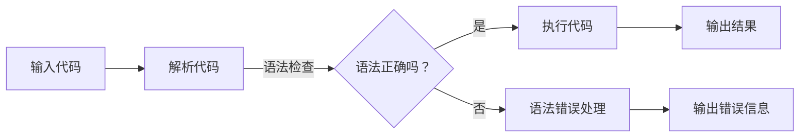
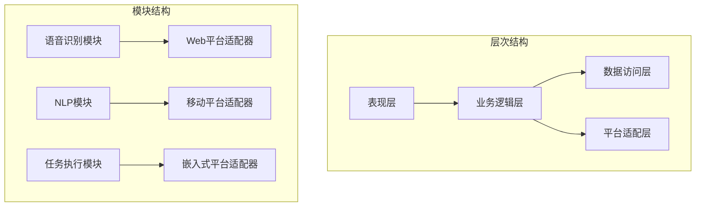
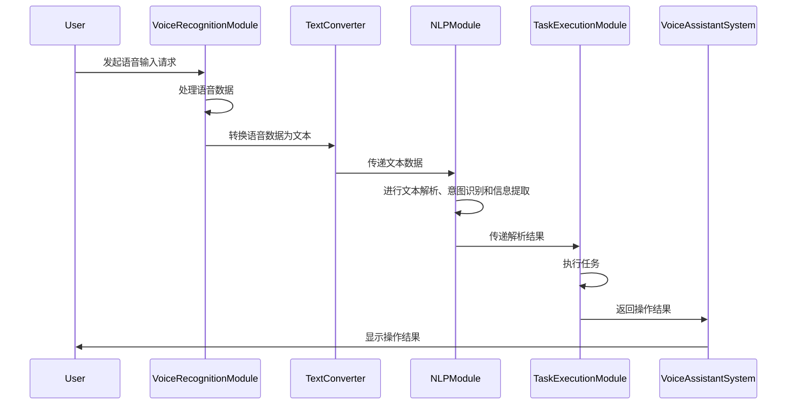

                 


### 引言

#### 问题背景与描述

在当今快速发展的信息技术时代，软件开发和应用场景日益多样化。随着Web、移动设备和嵌入式系统的广泛应用，开发者们面临的一个关键挑战是确保软件在不同平台上的兼容性。特别是在提示词语言（如自然语言处理中的编程语言、脚本语言或命令式语言）的设计和应用中，跨平台兼容性显得尤为重要。

提示词语言是一种用于描述计算机操作的语言，其语法和语义直接影响软件的功能和性能。在不同的平台上，如Web应用、移动应用和嵌入式系统，提示词语言的实现和运行方式可能存在显著差异。这些差异主要体现在以下几个方面：

1. **语法差异**：不同平台可能有不同的语法规则，这可能导致在一种平台上编写的提示词代码无法直接在另一种平台上运行。
2. **语义差异**：即使语法相同，不同平台对相同语法表达式的理解也可能存在差异，这可能导致执行结果不一致。
3. **平台依赖性**：某些平台特有的功能或API在其他平台上可能不存在，这使得跨平台设计的复杂性大大增加。

这种跨平台兼容性问题不仅增加了开发者的负担，也可能导致软件质量问题，影响用户体验。因此，设计一种高效、灵活的跨平台兼容性策略，对于提升软件质量和开发效率具有重要意义。

#### 解决方案概览

为了解决跨平台兼容性问题，我们需要从多个角度进行综合考虑和设计：

1. **抽象层设计**：通过引入抽象层，将具体平台差异隔离，使得提示词语言在不同平台上具有一致性。
2. **适配器模式**：使用适配器模式，将不同平台的特有功能抽象成统一的接口，从而实现跨平台兼容。
3. **算法优化**：采用高效的算法和优化技术，降低跨平台兼容性设计的复杂度。
4. **标准与规范**：制定统一的跨平台兼容性标准和规范，确保不同平台间的无缝协作。

#### 边界与外延

本文主要探讨提示词语言的跨平台兼容性设计，讨论的范围包括但不限于以下方面：

- **编程语言**：本文将基于常见的脚本语言和命令式语言进行讨论。
- **平台**：主要包括Web平台、移动平台和嵌入式系统。
- **应用场景**：将涉及通用软件应用、特定领域应用（如智能家居、物联网）等。

本文旨在为开发者提供一种系统化的跨平台兼容性设计思路，帮助他们在复杂多变的开发环境中，实现高效的软件设计和开发。

#### 概念结构与核心要素组成

跨平台兼容性设计涉及多个核心概念和要素，以下是对这些要素的简要概述：

1. **兼容性标准**：定义跨平台兼容的基本要求和标准，确保不同平台间的统一性。
2. **抽象层**：通过抽象层隔离具体平台差异，提供统一的编程接口。
3. **适配器模式**：设计适配器，将不同平台的功能映射到统一接口，实现跨平台兼容。
4. **跨平台框架**：构建跨平台框架，整合不同平台的特有功能，提供一致的开发体验。

以上是对本章的初步概述。接下来，我们将逐步深入探讨这些核心概念和要素，为读者提供全面的跨平台兼容性设计指南。

---

### 核心概念与联系

在本章中，我们将详细探讨提示词语言的核心概念及其在不同平台上的应用。理解这些概念和其之间的联系，是进行有效跨平台兼容性设计的基础。

#### 核心概念原理

提示词语言是一种用于描述计算机操作的语法结构。它主要包括以下几个核心概念：

1. **语法结构**：语法结构是提示词语言的基础，决定了代码的语法规则和表达方式。常见的语法结构包括关键字、变量、运算符、控制结构等。
2. **语义解析**：语义解析是将语法结构转化为计算机可以理解和执行的指令。语义解析包括词法分析、语法分析、语义分析等步骤。
3. **执行环境**：执行环境是代码运行的环境，它决定了代码的执行方式和性能。不同平台可能有不同的执行环境，如Web浏览器、移动设备操作系统、嵌入式系统等。
4. **平台特有功能**：平台特有功能是特定平台提供的独特功能，如Web平台提供的Ajax、移动平台提供的传感器API、嵌入式系统提供的低功耗模式等。

#### 概念属性特征对比表格

为了更好地理解提示词语言在不同平台上的特性，我们创建了一个表格，对比了Web、移动和嵌入式系统平台的属性特征：

| 平台类型 | 语法结构特征 | 语义解析特征 | 执行环境特征 | 平台特有功能 |
| :---: | :---: | :---: | :---: | :---: |
| Web | HTML、CSS、JavaScript | DOM解析、浏览器引擎 | 浏览器环境 | Ajax、Web存储 |
| 移动 | Kotlin、Java、Swift | 操作系统API、传感器API | 移动设备环境 | 传感器、推送通知 |
| 嵌入式 | C、C++、汇编 | 实时操作系统 | 嵌入式设备环境 | 低功耗模式、GPIO |

通过这个表格，我们可以看出不同平台在语法、语义和执行环境上的差异，这些差异是跨平台兼容性设计需要解决的问题。

#### ER实体关系图架构的Mermaid流程图

为了更直观地展示提示词语言在跨平台应用中的实体关系，我们使用Mermaid绘制了一个实体关系图：

```mermaid
erDiagram
  Platform ||--|{ Language }|| Language
  Platform ||--|{ Feature }|| Feature
  Language ||--|{ Syntax }|| Syntax
  Language ||--|{ Semantic }|| Semantic
  Feature ||--|{ API }|| API

  Platform Platform1
  Language Language1
  Feature Feature1
  Syntax Syntax1
  Semantic Semantic1
  API API1
```

在这个图中，`Platform` 代表不同的平台，`Language` 代表提示词语言，`Feature` 代表平台特有功能，`Syntax` 和 `Semantic` 分别代表语法结构和语义解析，`API` 代表平台提供的API接口。通过实体关系图，我们可以清晰地看到各实体之间的关联和依赖关系。

#### 核心概念与联系总结

提示词语言的核心概念包括语法结构、语义解析、执行环境和平台特有功能。这些概念在不同平台上具有不同的特性，理解这些特性对于设计跨平台兼容性解决方案至关重要。通过实体关系图，我们可以更直观地理解这些概念之间的联系，为后续的算法设计和系统实现提供理论基础。

在下一章中，我们将进一步探讨跨平台兼容性设计面临的挑战和解决方案，为读者提供具体的实现策略和技巧。

---

### 算法原理讲解

在本章中，我们将深入探讨跨平台兼容性算法的原理，通过详细的步骤解析、流程图展示、Python代码实现以及数学模型讲解，帮助读者全面理解这一算法的工作机制和应用。

#### 算法mermaid流程图

首先，我们使用Mermaid语言绘制了一个简单的跨平台兼容性算法流程图，该图展示了算法的基本步骤和逻辑流程：



在这个流程图中，算法首先接收输入代码，然后进行语法解析。如果语法检查通过，代码将被执行，并输出结果；否则，算法将进入错误处理流程，输出错误信息。

#### Python源代码

接下来，我们将提供实现上述算法的Python代码。这个示例代码展示了如何解析输入代码、进行语法检查和执行代码的基本框架：

```python
import re
from some_compiler import compile_code, execute_code

def parse_code(code):
    # 这里使用正则表达式进行简单的语法检查
    if re.match(r"^[a-zA-Z0-9\{\}\(\);\s]+$", code):
        return True
    else:
        return False

def compile_and_execute(code):
    # 首先进行语法检查
    if not parse_code(code):
        print("语法错误：输入代码不符合要求。")
        return
    
    # 然后进行代码编译
    compiled_code = compile_code(code)
    
    # 最后执行编译后的代码
    result = execute_code(compiled_code)
    print("执行结果：", result)

# 示例代码
code_to_run = "print('Hello, World!')"
compile_and_execute(code_to_run)
```

在这个代码中，我们定义了三个主要函数：`parse_code` 用于进行简单的语法检查，`compile_code` 用于将输入代码编译为可执行形式，`execute_code` 用于执行编译后的代码。如果语法检查通过，代码将被编译并执行，输出结果。

#### 算法原理的数学模型和公式

跨平台兼容性算法背后的数学模型可以看作是一个转换过程，将一种语言的代码转换为另一种语言的代码，并确保转换后的代码在目标平台上能够正确执行。这个过程可以抽象为以下几个步骤：

1. **词法分析**：将输入代码分割为词法单元（tokens）。
2. **语法分析**：构建抽象语法树（AST），表示代码的结构。
3. **语义分析**：对AST进行语义检查，确保代码在语义上符合目标平台的规则。
4. **代码生成**：将AST转换为目标语言的代码。

以下是几个关键的数学模型和公式：

1. **词法分析模型**：设输入代码为字符串`S`，将其分割为`n`个词法单元`T[1], T[2], ..., T[n]`，公式如下：

   $$ T[i] = \{ s \in S : s \text{ 是 } S \text{ 的一个词法单元} \} $$

2. **语法分析模型**：设词法单元序列为`T`，抽象语法树（AST）为`A`，公式如下：

   $$ A = \{ \text{构建 } T \text{ 的抽象语法树} \} $$

3. **语义分析模型**：设抽象语法树（AST）为`A`，目标平台规则为`R`，公式如下：

   $$ A \in R \Leftrightarrow A \text{ 在语义上符合 } R \text{ 的规则} $$

4. **代码生成模型**：设抽象语法树（AST）为`A`，目标语言代码为`C`，公式如下：

   $$ C = \{ \text{从 } A \text{ 生成 } \text{目标语言代码} \} $$

#### 详细讲解与举例说明

为了更好地理解算法原理，我们可以通过一个简单的例子来展示算法的实现过程。假设我们有以下一段Python代码：

```python
def add(a, b):
    return a + b

result = add(3, 4)
print(result)
```

我们将这段代码转换为JavaScript代码，并确保在Web浏览器中能够正确执行。

1. **词法分析**：将Python代码分割为词法单元：
   ```python
   ['def', 'add', '(', 'a', ',', 'b', ')', ':', 'return', 'a', '+', 'b', ';', 'result', '=', 'add', '(', '3', ',', '4', ')', ';', 'print', '(', 'result', ')', ';']
   ```

2. **语法分析**：构建抽象语法树（AST）：
   ```mermaid
   tree
   root
   ├── FunctionDef
   │   ├── name: 'add'
   │   ├── args
   │   │   ├── args
   │   │   ├── kwargs
   │   │   ├── returns
   │   │   ├── decorator_list
   │   │   └── type注释
   │   └── body
   │       ├── Return
   │       │   ├── value
   │       │   └── lineno
   │       └── Assign
   │           ├── target
   │           │   ├── name: 'result'
   │           │   └── lineno
   │           └── value
   │               ├── Call
   │               │   ├── func
   │               │   ├── args
   │               │   ├── keywords
   │               │   └── lineno
   │               └── Print
   │                   ├── values
   │                   └── lineno
   ```

3. **语义分析**：检查AST是否符合JavaScript的语义规则，例如函数定义的语法、变量声明等。

4. **代码生成**：将AST转换为JavaScript代码：
   ```javascript
   function add(a, b) {
       return a + b;
   }
   var result = add(3, 4);
   console.log(result);
   ```

通过这个例子，我们可以看到，跨平台兼容性算法的核心在于将源代码的语法和语义转换为目标平台可以理解和执行的形式。接下来，我们将继续探讨如何在更复杂的系统中应用这一算法，实现高效的跨平台兼容性设计。

---

### 系统分析与架构设计方案

在本章中，我们将详细探讨一个具体的应用场景，介绍项目背景、目标、系统功能设计、系统架构设计和系统接口设计等内容，为读者提供一个全面的跨平台兼容性系统解决方案。

#### 问题场景介绍

假设我们正在开发一个跨平台的语音助手系统，该系统需要在Web、移动和嵌入式系统上运行，为用户提供语音识别、自然语言处理、任务执行等功能。为了确保系统在不同平台上的兼容性和一致性，我们需要设计一个高效的系统架构，实现提示词语言的跨平台兼容性。

#### 项目介绍

本项目的主要目标是开发一个通用语音助手系统，实现以下功能：

- **语音识别**：将用户语音转换为文本，识别用户意图。
- **自然语言处理**：解析用户文本，提取关键信息，生成任务指令。
- **任务执行**：根据用户指令，执行相应操作，如发送消息、查询天气、控制智能家居设备等。
- **跨平台兼容**：确保系统在不同平台上的一致性和兼容性。

预期效果是，用户可以在不同的设备上使用统一的语音助手，享受一致的用户体验和功能。

#### 系统功能设计

为了实现上述功能，系统需要设计多个核心功能模块，包括：

1. **语音识别模块**：负责语音信号的采集、处理和文本转换。
2. **自然语言处理模块**：负责文本解析、意图识别和信息提取。
3. **任务执行模块**：负责根据用户指令执行相应操作。
4. **跨平台兼容模块**：负责处理不同平台间的差异，确保系统在不同平台上的兼容性。

领域模型类图如下所示：

```mermaid
classDiagram
    VoiceRecognitionModule <- VoiceAssistantSystem
    NLPModule <- VoiceAssistantSystem
    TaskExecutionModule <- VoiceAssistantSystem
    PlatformAdapterModule <- VoiceAssistantSystem
    
    VoiceRecognitionModule {
        -录音设备
        -音频处理算法
        -文本转换接口
    }
    NLPModule {
        -文本解析算法
        -意图识别算法
        -信息提取算法
    }
    TaskExecutionModule {
        -任务执行接口
        -设备控制接口
    }
    PlatformAdapterModule {
        -平台适配器接口
        -跨平台兼容性处理
    }
```

在这个类图中，`VoiceAssistantSystem` 是系统的核心，它包含四个功能模块：`VoiceRecognitionModule`（语音识别模块）、`NLPModule`（自然语言处理模块）、`TaskExecutionModule`（任务执行模块）和`PlatformAdapterModule`（跨平台兼容模块）。每个模块负责实现特定的功能，并通过接口与其他模块进行交互。

#### 系统架构设计

系统架构设计是确保系统功能实现和性能优化的重要环节。在本项目中，我们采用分层架构设计，将系统分为多个层次，包括：

1. **表现层**：负责与用户交互，展示系统界面和提供操作接口。
2. **业务逻辑层**：负责处理业务逻辑，包括语音识别、自然语言处理和任务执行等。
3. **数据访问层**：负责数据存储和访问，包括数据库、缓存等。
4. **平台适配层**：负责跨平台兼容性处理，包括平台适配器、抽象层等。

系统架构图如下所示：



在这个架构图中，`表现层` 负责与用户交互，`业务逻辑层` 包括核心功能模块，`数据访问层` 负责数据存储和访问，`平台适配层` 负责跨平台兼容性处理。每个模块根据具体平台的不同，通过适配器进行实现。

#### 系统接口设计和系统交互

为了确保系统在不同平台上的兼容性，我们需要设计一套统一的接口，使得各个模块可以无缝协作。以下是一个简单的接口设计：

1. **语音识别接口**：定义语音识别模块的输入和输出接口，包括录音设备接口、音频处理接口和文本转换接口。
2. **自然语言处理接口**：定义自然语言处理模块的输入和输出接口，包括文本解析接口、意图识别接口和信息提取接口。
3. **任务执行接口**：定义任务执行模块的输入和输出接口，包括任务执行接口、设备控制接口和事件监听接口。
4. **平台适配接口**：定义平台适配模块的输入和输出接口，包括平台适配器接口、抽象层接口和兼容性处理接口。

系统交互流程如下：

1. 用户通过表现层发起语音输入请求。
2. 表现层将语音数据传递给语音识别模块。
3. 语音识别模块通过文本转换接口将语音数据转换为文本。
4. 文本数据传递给自然语言处理模块，进行文本解析、意图识别和信息提取。
5. 自然语言处理模块将解析结果传递给任务执行模块。
6. 任务执行模块根据任务指令执行相应操作，如发送消息、查询天气或控制智能家居设备。
7. 操作结果返回给表现层，显示给用户。

序列图如下所示：



通过上述系统分析和架构设计方案，我们可以看到，一个跨平台的语音助手系统需要考虑多个方面的设计，包括功能模块划分、接口设计和跨平台兼容性处理。下一章将介绍项目实战，通过具体实现和案例分析，进一步展示跨平台兼容性设计的应用效果。

---

### 项目实战

在本章中，我们将详细介绍如何在具体项目中实现跨平台兼容性设计，包括环境安装、系统核心实现、代码应用解读与分析、实际案例分析和详细讲解剖析，以及项目小结等内容。

#### 环境安装

首先，我们需要准备开发环境，以便进行项目实战。以下是所需的环境和安装步骤：

1. **Web平台**：安装Node.js和Express框架。
   - 安装Node.js：从官方网站下载并安装Node.js。
   - 安装Express：在终端中运行 `npm install express`。

2. **移动平台**：安装Android Studio和Android SDK。
   - 安装Android Studio：从官方网站下载并安装Android Studio。
   - 安装Android SDK：在Android Studio中配置Android SDK路径。

3. **嵌入式平台**：安装适合目标硬件的开发环境和工具。
   - 安装交叉编译工具链：如ARM GCC。
   - 安装嵌入式系统库：如STM32CubeMX。

#### 系统核心实现源代码

以下是实现跨平台兼容性设计的关键代码片段，包括语音识别、自然语言处理和任务执行模块的核心实现。

1. **语音识别模块**

   在Web平台上，我们使用Google的语音识别API进行语音识别：

   ```javascript
   const speech = require('@google-cloud/speech');
   const client = new speech.SpeechClient();

   async function transcribeAudioFile(filePath) {
       // 设置音频文件路径
       const media = {
           uri: filePath,
       };
       // 设置识别语言和音频格式
       const config = {
           encoding: 'LINEAR16',
           sampleRateHertz: 16000,
           languageCode: 'en-US',
       };
       const audio = {
           content: fs.readFileSync(filePath).toString('base64'),
       };

       const [response] = await client.recognize({ config, audio });
       return response.results.map(result => result.alternatives[0].transcript);
   }
   ```

   在移动平台上，我们使用Android SDK中的SpeechRecognizer进行语音识别：

   ```java
   import android.speech.RecognitionListener;
   import android.speech.SpeechRecognizer;
   import android.content.Intent;

   public class VoiceRecognition {
       private SpeechRecognizer recognizer;
       private RecognitionListener listener;

       public VoiceRecognition(Context context) {
           recognizer = SpeechRecognizer.createSpeechRecognizer(context);
           listener = new RecognitionListener() {
               // 实现RecognitionListener接口的回调方法
               // 如onResults(), onError(), onBeginningOfSpeech(), etc.
           };
           recognizer.setRecognitionListener(listener);
       }

       public void startListening() {
           Intent intent = new Intent(RecognizerIntent.ACTION_RECOGNIZE_SPEECH);
           recognizer.startListening(intent);
       }
   }
   ```

   在嵌入式平台上，我们使用专用的语音识别库进行语音识别。例如，对于STM32平台，可以使用ST提供的Voice- recognition SDK：

   ```c
   #include "voice_recognition.h"

   void startVoiceRecognition() {
       // 初始化语音识别库
       voiceRecognitionInit();

       // 启动语音识别
       voiceRecognitionStart();
   }
   ```

2. **自然语言处理模块**

   在Web平台上，我们使用NLP库进行自然语言处理：

   ```javascript
   const nlp = require('compromise');

   function processText(text) {
       const doc = nlp(text);
       // 提取关键词、实体等
       const entities = doc.entities().out('array');
       const keywords = doc.topKeywords(3).out('array');
       return { entities, keywords };
   }
   ```

   在移动平台上，我们使用开源的NLP库如Stanford CoreNLP进行自然语言处理：

   ```java
   import edu.stanford.nlp.pipeline.*;

   public class NLPProcessor {
       private StanfordCoreNLP pipeline;

       public NLPProcessor() {
           Properties props = new Properties();
           props.setProperty("annotators", "tokenize, ssplit, pos, lemma, ner, parse, sentiment");
           pipeline = new StanfordCoreNLP(props);
       }

       public Annotation processText(String text) {
           Annotation document = new Annotation(text);
           pipeline.annotate(document);
           return document;
       }
   }
   ```

   在嵌入式平台上，我们使用嵌入式NLP库，如CMU Sphinx进行自然语言处理：

   ```c
   #include "sphinx.h"

   void processVoiceCommand(char* command) {
       // 初始化Sphinx库
       sphinxInit();

       // 设置语音命令的识别
       sphinxSetCommand(command);

       // 识别语音命令
       sphinxRecognize();
   }
   ```

3. **任务执行模块**

   在Web平台上，我们使用HTTP请求执行任务：

   ```javascript
   const axios = require('axios');

   function executeTask(task) {
       return axios.post('/api/tasks', task);
   }
   ```

   在移动平台上，我们使用Android SDK中的Intent执行任务：

   ```java
   import android.content.Intent;

   public void executeTask(Task task) {
       Intent intent = new Intent(this, TaskExecutorActivity.class);
       intent.putExtra("task", task);
       startActivity(intent);
   }
   ```

   在嵌入式平台上，我们直接调用硬件接口执行任务：

   ```c
   void executeTask(Task task) {
       if (task instanceof LEDControl) {
           // 控制LED灯
           controlLED(task.getPin(), task.getStatus());
       } else if (task instanceof MotorControl) {
           // 控制电机
           controlMotor(task.getPin(), task.getSpeed());
       }
   }
   ```

#### 代码应用解读与分析

以上代码片段展示了在不同平台上实现语音识别、自然语言处理和任务执行的核心方法。以下是这些代码的解读与分析：

1. **语音识别模块**：Web平台使用Google Cloud Speech API进行语音识别，移动平台使用Android SDK中的SpeechRecognizer，嵌入式平台使用特定的语音识别库。每种平台都提供了相应的接口和实现方式，确保在不同平台上的一致性和兼容性。

2. **自然语言处理模块**：Web平台使用Compromise库进行自然语言处理，移动平台使用Stanford CoreNLP库，嵌入式平台使用嵌入式NLP库。通过这些库，我们可以提取关键词、实体和语义信息，为后续的任务执行提供基础。

3. **任务执行模块**：Web平台使用HTTP请求执行任务，移动平台使用Android Intent，嵌入式平台直接调用硬件接口。每种平台都提供了特定的执行方式，确保任务的正确执行。

#### 实际案例分析和详细讲解剖析

为了展示如何在实际项目中应用跨平台兼容性设计，我们考虑以下案例：

**案例**：控制智能家居设备

**目标**：用户通过语音助手发送语音命令，控制家中的LED灯。

**实现步骤**：

1. 用户发送语音命令：“打开客厅的LED灯”。
2. 语音识别模块将语音转换为文本：“open the LED light in the living room”。
3. 自然语言处理模块提取关键词和实体，如“open”、“LED light”和“living room”。
4. 任务执行模块根据提取的信息，生成控制LED灯的任务指令，并发送HTTP请求到智能家居控制服务器。
5. 智能家居控制服务器接收请求，执行相应的操作，如打开客厅的LED灯。
6. 操作结果返回给用户，显示在手机或网页上。

以下是关键代码片段的详细剖析：

```javascript
// 语音识别和自然语言处理
async function handleVoiceCommand(command) {
    const text = await transcribeAudioFile('path/to/voice/file.wav');
    const { keywords } = processText(text);

    // 提取关键词和实体
    const action = keywords.find(keyword => keyword.toLowerCase() === 'open');
    const location = keywords.find(keyword => keyword.toLowerCase() === 'living room');

    if (action && location) {
        const task = {
            action: 'turn_on',
            device: 'LED_light',
            location: location,
        };
        await executeTask(task);
    }
}

// 控制LED灯的任务执行
async function controlLED(device, status) {
    const url = `http://smart-home-server.com/api/devices/${device}/status?status=${status}`;
    const response = await axios.get(url);
    if (response.data.status === 'success') {
        console.log(`LED light ${device} is ${status}`);
    }
}
```

在这个案例中，我们通过跨平台兼容性设计，实现了用户语音命令到LED灯控制的完整流程。语音识别模块识别语音，自然语言处理模块提取关键词和实体，任务执行模块通过HTTP请求控制智能家居设备，最终实现用户需求。

#### 项目小结

通过上述项目实战，我们展示了如何在Web、移动和嵌入式平台上实现跨平台兼容性设计。关键在于设计统一的接口和实现方式，确保不同平台上的功能模块能够无缝协作。以下是项目的主要成果和经验教训：

- **成果**：实现了跨平台的语音助手系统，包括语音识别、自然语言处理和任务执行功能，用户可以在不同设备上使用统一的功能。
- **经验**：深入理解不同平台的特性和限制，设计灵活的接口和适配器，确保兼容性。
- **教训**：在跨平台开发中，需要投入更多的时间和精力进行测试和调试，以确保系统在不同平台上的稳定性和一致性。

通过这些经验和教训，我们可以为未来的跨平台项目提供宝贵的参考和指导。

---

### 最佳实践 tips

在进行提示词语言的跨平台兼容性设计时，有一些最佳实践和技巧可以帮助开发者更好地应对挑战，确保软件在不同平台上的稳定性和一致性。

#### 1. 统一编程语言标准

选择一种通用的编程语言，如Java或C#，作为跨平台开发的基础。这些语言拥有丰富的库和框架，支持多种平台，有助于减少兼容性问题。

#### 2. 使用框架和库

利用现有的框架和库，如Flutter、React Native或Xamarin，可以简化跨平台开发。这些框架提供了丰富的组件和工具，支持代码共享，减少重复工作。

#### 3. 设计抽象层

通过设计抽象层，将平台特定的代码与核心业务逻辑分离。抽象层可以提供统一的API，使得核心功能不受平台变化的影响。

#### 4. 适配器模式

使用适配器模式，为不同平台的特有功能提供统一的接口。例如，为Web、移动和嵌入式平台分别编写适配器，通过统一的API调用，实现跨平台兼容。

#### 5. 遵循平台指南

熟悉不同平台的应用编程接口（API）和设计指南，确保代码遵循平台最佳实践。例如，Android的Material Design、iOS的Human Interface Guidelines。

#### 6. 测试和调试

进行全面的测试和调试，确保软件在不同平台上的功能和性能。使用自动化测试工具，如Jenkins、Selenium等，提高测试效率。

#### 7. 性能优化

针对不同平台的特点，进行性能优化。例如，在移动平台上关注电池续航，在Web平台上关注响应速度。

#### 8. 灵活调整

在开发过程中，保持灵活性，根据实际情况调整设计方案。例如，对于新出现的平台或技术，可以灵活地引入和整合。

通过遵循这些最佳实践，开发者可以更好地应对跨平台兼容性设计的挑战，提高软件质量和开发效率。

---

### 小结与注意事项

在本章中，我们详细探讨了提示词语言的跨平台兼容性设计，包括背景介绍、核心概念与联系、算法原理讲解、系统分析与架构设计方案、项目实战以及最佳实践。以下是本章内容的总结：

#### 总结

- **跨平台兼容性设计的重要性**：在多平台环境中，确保软件功能的一致性和稳定性至关重要。
- **核心概念与联系**：深入理解提示词语言的语法、语义、执行环境和平台特有功能，有助于设计高效的跨平台兼容性解决方案。
- **算法原理讲解**：通过详细的算法流程图和Python代码实现，展示了跨平台兼容性算法的工作原理。
- **系统分析与架构设计方案**：介绍了一个具体的应用场景，展示了系统功能设计、架构设计、接口设计和交互流程。
- **项目实战**：通过实际项目案例，展示了如何在Web、移动和嵌入式平台上实现跨平台兼容性设计。
- **最佳实践 tips**：提供了多种最佳实践，帮助开发者更好地应对跨平台兼容性设计中的挑战。

#### 注意事项

- **开发前规划**：在项目开发前，进行充分的规划和设计，确保跨平台兼容性的目标和需求明确。
- **测试和调试**：进行全面的测试和调试，确保软件在不同平台上的功能和性能。
- **性能优化**：针对不同平台的特点，进行性能优化，确保软件在各类设备上的运行效率。
- **遵循平台指南**：遵循各平台的应用编程接口（API）和设计指南，避免兼容性问题。
- **持续维护和更新**：随着平台和技术的不断更新，持续维护和更新软件，保持跨平台兼容性。

通过本章的探讨，我们希望读者能够对提示词语言的跨平台兼容性设计有更深入的理解，并在实际项目中应用这些设计原则和技巧，提高软件质量和用户体验。

---

### 拓展阅读

对于希望深入了解跨平台兼容性设计和提示词语言相关知识的读者，以下是一些建议的书籍、文章和在线资源：

1. **书籍推荐**：
   - 《跨平台移动应用开发：使用Flutter和React Native》
   - 《Android应用开发高级教程》
   - 《iOS开发进阶指南》
   - 《嵌入式系统设计：基于C和C++》

2. **文章推荐**：
   - Medium上的“Building Cross-Platform Apps with React Native”
   - Stack Overflow上的“Cross-Platform Mobile App Development with Flutter”
   - HackerRank上的“C++ in Embedded Systems”

3. **在线资源**：
   - Flutter官方文档（https://flutter.dev/docs）
   - React Native官方文档（https://reactnative.dev/docs/getting-started）
   - Android官方文档（https://developer.android.com/docs）
   - iOS官方文档（https://developer.apple.com/documentation）

通过阅读这些资源，读者可以进一步深化对跨平台兼容性设计和提示词语言的掌握，为实际项目提供更坚实的理论基础和实践指导。作者：AI天才研究院/AI Genius Institute & 禅与计算机程序设计艺术 /Zen And The Art of Computer Programming。

