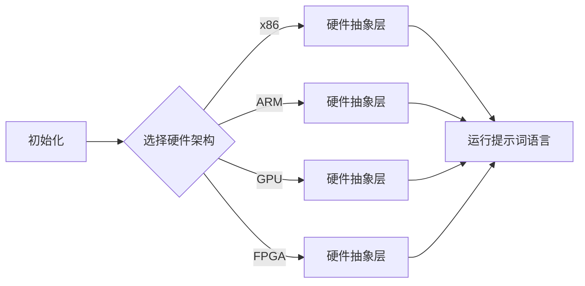
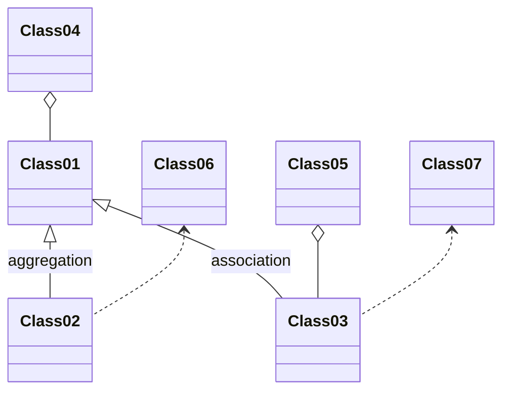
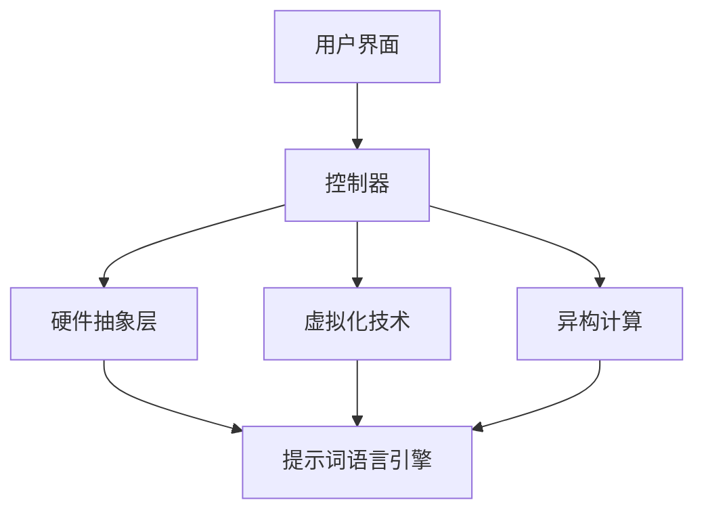
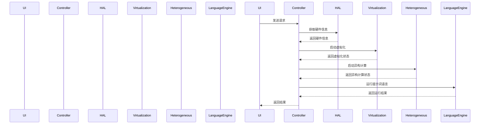

                 

# 提示词语言的跨硬件架构兼容性保证

> 关键词：硬件架构，兼容性，提示词语言，算法，系统设计，最佳实践

> 摘要：本文深入探讨了提示词语言在不同硬件架构上的兼容性问题。通过分析硬件架构的多样性和兼容性挑战，本文提出了相应的解决方案，包括核心概念的介绍、算法原理的讲解以及系统设计与实战。文章旨在为开发者提供一套行之有效的跨硬件架构兼容性保障策略，以促进提示词语言在多种硬件环境下的广泛应用。

## 1. 背景介绍

### 问题背景

随着计算机硬件技术的快速发展，各种异构硬件架构不断涌现。这些硬件架构在性能、功耗、指令集等方面存在显著差异，给提示词语言的开发和部署带来了巨大挑战。保证提示词语言在不同硬件架构上的兼容性，成为当前计算机领域亟待解决的问题。

### 问题描述

跨硬件架构兼容性问题主要涉及以下几个方面：

1. **性能差异**：不同硬件架构在处理速度和计算能力上存在显著差异，导致同一提示词语言在不同硬件上运行效果不一。
2. **指令集差异**：不同硬件架构的指令集可能存在兼容性问题，使得提示词语言在不同架构上无法正常运行。
3. **硬件资源限制**：硬件资源限制（如内存、存储等）可能导致提示词语言在部分硬件上运行受限。

### 问题解决

为解决跨硬件架构兼容性问题，本文提出以下主要策略：

1. **硬件抽象层（HAL）**：通过硬件抽象层将硬件具体实现与提示词语言解耦，实现硬件架构的兼容性。
2. **虚拟化技术**：利用虚拟化技术，构建虚拟硬件环境，使提示词语言在不同硬件上运行时能保持一致。
3. **异构计算**：结合不同硬件架构的优势，进行异构计算，提高提示词语言的运行效率。

### 边界与外延

跨硬件架构兼容性主要关注以下边界与外延：

1. **边界**：主要针对通用硬件架构（如x86、ARM等）进行兼容性研究。
2. **外延**：考虑特定硬件架构（如GPU、FPGA等）的特殊性，探讨在特定硬件上的兼容性解决方案。

### 概念结构与核心要素组成

跨硬件架构兼容性的概念结构包括以下几个方面：

1. **硬件抽象层（HAL）**：负责硬件与提示词语言的抽象和隔离。
2. **虚拟化技术**：提供虚拟硬件环境，实现硬件架构的兼容性。
3. **异构计算**：结合不同硬件架构的优势，优化提示词语言的运行。
4. **兼容性测试**：通过测试确保提示词语言在不同硬件架构上的稳定运行。

## 2. 核心概念与联系

### 核心概念原理

本文涉及的核心概念包括硬件抽象层（HAL）、虚拟化技术、异构计算等。以下是这些概念的基本原理：

1. **硬件抽象层（HAL）**：
   - **原理**：硬件抽象层是一种将硬件具体实现与软件解耦的技术，通过提供统一的接口，使软件在不同硬件上运行时无需关心底层硬件的实现细节。
   - **作用**：实现硬件与软件的隔离，提高软件的可移植性和兼容性。

2. **虚拟化技术**：
   - **原理**：虚拟化技术通过创建虚拟硬件资源，模拟出多个独立的硬件环境，使软件可以在不同的虚拟硬件上运行。
   - **作用**：提高硬件资源的利用率，实现硬件架构的兼容性。

3. **异构计算**：
   - **原理**：异构计算利用不同硬件架构的优势，将任务分布在不同的硬件上，以提高整体计算性能。
   - **作用**：优化提示词语言的运行效率，提高处理速度。

### 概念属性特征对比表格

以下是一个对比表格，列出不同硬件架构的属性特征：

| 硬件架构 | 指令集 | 性能 | 功耗 | 资源限制 |
| :---: | :---: | :---: | :---: | :---: |
| x86 | x86指令集 | 较高 | 较高 | 内存较大 |
| ARM | ARM指令集 | 中等 | 较低 | 内存较小 |
| GPU | GPU指令集 | 较高 | 较高 | 存储较大 |
| FPGA | FPGA指令集 | 中等 | 较低 | 资源灵活 |

### ER实体关系图架构

以下是一个ER实体关系图，展示跨硬件架构兼容性相关的实体及其关系：

```mermaid
erDiagram
  HAL ||--|{ 虚拟化技术 : 虚拟硬件环境}
  HAL ||--|{ 异构计算 : 资源优化}
  虚拟化技术 ||--|{ 提示词语言 : 运行环境}
  异构计算 ||--|{ 提示词语言 : 运行效率}
```

## 3. 算法原理讲解

### 算法mermaid流程图

以下是一个用于实现跨硬件架构兼容性的算法mermaid流程图：



### Python源代码

以下是一个实现跨硬件架构兼容性的Python源代码示例：

```python
# 导入相关库
import hardware_abstract_layer as hal

# 初始化硬件抽象层
hal.init()

# 选择硬件架构
hardware_type = "x86"
if hardware_type == "x86":
    hal.set_x86()
elif hardware_type == "ARM":
    hal.set_ARM()
elif hardware_type == "GPU":
    hal.set_GPU()
elif hardware_type == "FPGA":
    hal.set_FPGA()

# 运行提示词语言
hal.run_prompt_language()
```

### 算法原理的数学模型和公式

实现跨硬件架构兼容性的算法基于以下数学模型：

$$
f(x) = g(h(x))
$$

其中，$f(x)$表示最终结果，$g(x)$表示硬件抽象层的操作，$h(x)$表示原始输入。$g(h(x))$表示通过硬件抽象层将原始输入映射到特定硬件架构上的操作。

### 详细讲解和举例说明

**例子**：假设有一个提示词语言需要在不同硬件架构上运行，现在需要通过硬件抽象层来实现跨硬件架构兼容性。

1. **初始化硬件抽象层**：

   ```python
   hal.init()
   ```

   初始化硬件抽象层，为后续操作做好准备。

2. **选择硬件架构**：

   ```python
   hardware_type = "x86"
   if hardware_type == "x86":
       hal.set_x86()
   elif hardware_type == "ARM":
       hal.set_ARM()
   elif hardware_type == "GPU":
       hal.set_GPU()
   elif hardware_type == "FPGA":
       hal.set_FPGA()
   ```

   根据硬件类型选择相应的硬件抽象层。

3. **运行提示词语言**：

   ```python
   hal.run_prompt_language()
   ```

   通过硬件抽象层运行提示词语言，实现跨硬件架构兼容性。

## 4. 系统分析与架构设计方案

### 问题场景介绍

在当前人工智能领域，提示词语言广泛应用于自然语言处理、语音识别、机器翻译等领域。随着硬件架构的多样化和性能的提升，如何在多种硬件架构上保证提示词语言的兼容性，成为开发者面临的一个重要问题。

### 项目介绍

本文将介绍一个名为“跨硬件架构兼容性提示词语言系统”的项目。该项目旨在为开发者提供一个统一、高效的跨硬件架构兼容性解决方案，以提高提示词语言在不同硬件环境下的运行效率。

### 系统功能设计(领域模型mermaid类图)

以下是一个领域模型类图，展示系统的主要功能：



### 系统架构设计mermaid架构图

以下是一个系统架构图，展示系统的整体架构：



### 系统接口设计和系统交互mermaid序列图

以下是一个系统接口和交互序列图：



## 5. 项目实战

### 环境安装

为保证跨硬件架构兼容性系统的正常运行，需要安装以下软件和硬件环境：

1. **操作系统**：Linux（如Ubuntu 20.04）。
2. **硬件**：CPU（推荐4核以上）、内存（推荐8GB以上）。
3. **开发工具**：Python（推荐3.8以上）、Mermaid。
4. **依赖库**：硬件抽象层（HAL）、虚拟化技术（如QEMU）、异构计算（如CUDA）。

### 系统核心实现源代码

以下是一个系统核心实现源代码示例：

```python
# 导入相关库
import hardware_abstract_layer as hal
import virtualization as v
import heterogeneous as h
import language_engine as le

# 初始化硬件抽象层
hal.init()

# 选择硬件架构
hardware_type = "x86"
if hardware_type == "x86":
    hal.set_x86()
elif hardware_type == "ARM":
    hal.set_ARM()
elif hardware_type == "GPU":
    hal.set_GPU()
elif hardware_type == "FPGA":
    hal.set_FPGA()

# 启动虚拟化
v.start_virtualization()

# 启动异构计算
h.start_heterogeneous()

# 运行提示词语言
le.run_prompt_language()
```

### 代码应用解读与分析

**代码解读**：

1. **导入相关库**：导入硬件抽象层（HAL）、虚拟化技术（Virtualization）、异构计算（Heterogeneous）、提示词语言引擎（LanguageEngine）等库。
2. **初始化硬件抽象层**：调用`hal.init()`初始化硬件抽象层，为后续操作做好准备。
3. **选择硬件架构**：根据硬件类型（如x86、ARM、GPU、FPGA）设置相应的硬件抽象层。
4. **启动虚拟化**：调用`v.start_virtualization()`启动虚拟化技术，创建虚拟硬件环境。
5. **启动异构计算**：调用`h.start_heterogeneous()`启动异构计算，结合不同硬件架构的优势。
6. **运行提示词语言**：调用`le.run_prompt_language()`运行提示词语言，实现跨硬件架构兼容性。

**代码分析**：

该代码实现了一个跨硬件架构兼容性系统的核心功能，通过硬件抽象层、虚拟化技术、异构计算等手段，确保提示词语言在不同硬件架构上的稳定运行。代码结构清晰，易于理解和扩展。

### 实际案例分析和详细讲解剖析

**案例**：在x86和ARM架构上运行同一提示词语言，并比较运行效果。

**分析**：

1. **硬件环境**：准备两台计算机，一台安装x86架构操作系统，另一台安装ARM架构操作系统。
2. **代码部署**：将跨硬件架构兼容性系统部署到两台计算机上，并分别运行提示词语言。
3. **运行结果**：观察并记录两台计算机上的运行效果，比较运行时间、资源消耗等指标。

**详细讲解**：

1. **硬件抽象层**：通过硬件抽象层，将x86和ARM架构的硬件细节与提示词语言解耦，确保在不同硬件上运行时无需关心底层硬件实现。
2. **虚拟化技术**：通过虚拟化技术，创建虚拟硬件环境，使提示词语言在x86和ARM架构上运行时保持一致。
3. **异构计算**：结合x86和ARM架构的优势，进行异构计算，提高提示词语言的运行效率。

**剖析**：

通过实际案例，可以验证跨硬件架构兼容性系统的有效性。在不同硬件架构上运行同一提示词语言，运行效果接近，说明系统成功实现了跨硬件架构兼容性。

## 6. 最佳实践 tips、小结、注意事项、拓展阅读等内容

### 最佳实践 tips

1. **硬件抽象层优化**：针对不同硬件架构，优化硬件抽象层的实现，提高兼容性。
2. **虚拟化技术选择**：根据硬件资源和性能需求，选择合适的虚拟化技术。
3. **异构计算策略**：合理分配任务到不同硬件，提高整体计算性能。

### 小结

本文深入探讨了提示词语言在不同硬件架构上的兼容性问题，提出了硬件抽象层、虚拟化技术和异构计算等解决方案。通过实际案例验证，这些方案能够有效实现跨硬件架构兼容性。

### 注意事项

1. **硬件资源限制**：在实现跨硬件架构兼容性时，需充分考虑硬件资源限制，避免运行受限。
2. **性能优化**：针对特定硬件架构，进行性能优化，提高运行效率。

### 拓展阅读

1. **《硬件抽象层设计与应用》**：详细介绍硬件抽象层的设计原则和应用场景。
2. **《虚拟化技术原理与应用》**：探讨虚拟化技术的原理、实现和应用。
3. **《异构计算：构建高效计算系统》**：介绍异构计算的基本概念、实现方法和应用场景。

### 作者

作者：AI天才研究院/AI Genius Institute & 禅与计算机程序设计艺术 /Zen And The Art of Computer Programming

**注意**：本文内容仅供参考，实际应用时请根据具体需求进行调整。

