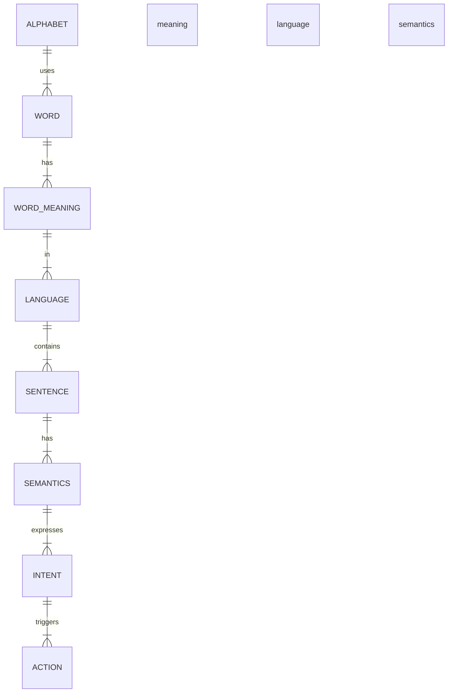
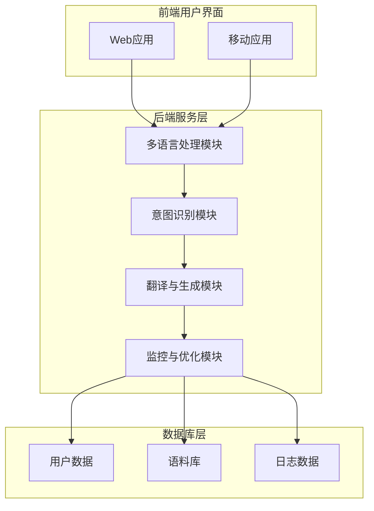

                 

## 提示词语言的跨语言互操作性设计

### 关键词：提示词语言，跨语言互操作性，算法原理，系统架构设计，项目实战

> 摘要：本文深入探讨了提示词语言的跨语言互操作性设计，首先介绍了提示词语言和跨语言互操作性的基本概念及其重要性。接着，通过对比表格和实体关系图，详细阐述了提示词语言与跨语言互操作性的核心概念与联系。然后，从算法原理和数学模型入手，详细讲解了提示词语言处理算法和跨语言互操作性算法。此外，本文还通过系统分析与架构设计方案，介绍了项目实战的全过程，包括环境安装、核心代码实现和实际案例分析。最后，提出了最佳实践与注意事项，以指导读者在实际应用中的有效操作。

### 目录大纲：

#### 第一部分：问题背景与定义

1. **问题背景与定义**
   - 提示词语言概述
   - 跨语言互操作性的意义
   - 跨语言互操作性的挑战
   - 跨语言互操作性的基本概念
   - 跨语言互操作性现状与趋势

2. **本章小结**
   - 总结与展望

#### 第二部分：核心概念与联系

1. **提示词语言的原理与属性**
   - 提示词语言定义
   - 提示词语言属性

2. **跨语言互操作性原理**
   - 跨语言互操作性基本原理
   - 跨语言信息处理技术

3. **跨语言互操作性概念属性对比表格**

4. **跨语言互操作性ER实体关系图**

5. **跨语言互操作性在特定领域中的应用**

6. **本章小结**
   - 总结与展望

#### 第三部分：算法原理讲解

1. **提示词语言处理算法**
   - 算法概述
   - 算法原理讲解
   - 算法流程图

2. **跨语言互操作性算法**
   - 算法概述
   - 算法原理讲解
   - 算法流程图

3. **数学模型和数学公式**

4. **算法应用与举例**

5. **本章小结**
   - 总结与展望

#### 第四部分：系统分析与架构设计方案

1. **问题场景介绍**
   - 场景描述

2. **项目介绍**
   - 项目概述
   - 项目目标

3. **系统功能设计**
   - 领域模型
   - 类图

4. **系统架构设计**
   - 架构设计
   - 架构图

5. **系统接口设计**
   - 接口设计

6. **系统交互**
   - 交互流程

7. **本章小结**
   - 总结与展望

#### 第五部分：项目实战

1. **环境安装**
   - 环境搭建
   - 相关工具安装

2. **系统核心实现源代码**
   - 核心代码实现
   - 解读与分析

3. **实际案例分析与讲解**
   - 案例分析
   - 详细讲解

4. **项目小结**
   - 总结与反思

5. **拓展阅读**
   - 相关资料推荐

#### 第六部分：最佳实践与注意事项

1. **最佳实践**
   - 实践经验总结

2. **小结**
   - 重要概念回顾

3. **注意事项**
   - 常见问题与解决

4. **拓展阅读**
   - 推荐阅读

#### 第七部分：总结与展望

1. **全书总结**
   - 核心内容回顾

2. **展望未来**
   - 发展趋势与挑战

3. **结语**
   - 启发与思考

### 目录大纲总结

本文目录大纲结构清晰，从问题背景、核心概念与联系、算法原理讲解、系统分析与架构设计方案、项目实战到最佳实践与注意事项，全面系统地探讨了提示词语言的跨语言互操作性设计。每个章节都紧密相连，构成了一个完整的技术博客文章框架。

### 文章开始

### 第一部分：问题背景与定义

#### 1.1 问题背景与定义

在当今全球化时代，跨语言通信和交流变得越来越重要。无论是商业合作、学术交流还是国际事务，语言障碍成为了不可忽视的障碍。提示词语言（Keyword Language）作为一种新兴的智能交互方式，以其高效、准确和自然的特点，受到了广泛关注。然而，如何在不同的语言之间实现提示词语言的互操作性，成为了当前研究的热点问题。

**提示词语言概述**

提示词语言是一种基于关键词的智能交互语言，通过关键词来表达意图和请求。这种语言不仅具有自然语言处理（NLP）的特点，还能够通过机器学习模型实现自动化学习和优化。在自然语言处理领域，提示词语言被广泛应用于智能客服、智能语音助手、机器翻译等领域。其高效性和灵活性使其成为跨语言互操作性研究的重要方向。

**跨语言互操作性的意义**

跨语言互操作性是指不同语言系统之间能够相互理解和交换信息的能力。在跨语言通信中，互操作性是实现语言理解和交流的关键。通过跨语言互操作性，可以消除语言障碍，促进不同语言之间的交流与合作。这对于国际化业务、多语言支持的应用开发以及全球化合作具有重要意义。

**跨语言互操作性的挑战**

虽然跨语言互操作性具有重要的意义，但在实际应用中面临着诸多挑战。首先是语言差异和障碍。不同语言之间存在语法、词汇、语用等方面的差异，这使得语言理解变得复杂。其次，跨语言信息处理技术需要解决语言理解与表达的问题，如何准确地将一种语言的信息转换为另一种语言的信息，是一个技术难点。

**跨语言互操作性的基本概念**

跨语言互操作性包括多个方面，如语言模型、机器翻译、语义分析、信息检索等。其中，语言模型是跨语言互操作性的基础，通过训练大量多语言语料库，可以建立不同语言之间的映射关系。机器翻译是跨语言互操作性的重要手段，通过将一种语言翻译为另一种语言，实现信息的跨语言交换。语义分析则是理解语言意义的过程，通过语义分析，可以更准确地理解用户意图和需求。

**跨语言互操作性现状与趋势**

目前，跨语言互操作性技术已经取得了显著的进展。在语言模型方面，深度学习技术的应用使得语言模型的效果得到了大幅提升。在机器翻译方面，基于神经网络的机器翻译系统已经达到了实用的水平。在语义分析方面，自然语言处理技术也在不断进步，为跨语言互操作性提供了更好的支持。

然而，跨语言互操作性仍然面临着许多挑战。例如，如何更好地处理多语言词汇歧义、如何提高跨语言信息的准确性和一致性等。未来，随着人工智能技术的不断进步，跨语言互操作性有望取得更大的突破。

#### 1.2 跨语言互操作性的挑战

在实现跨语言互操作性的过程中，语言差异是一个不可忽视的挑战。不同语言之间存在语法、词汇、语用等方面的差异，这些差异导致了语言理解的复杂性。

首先，语法差异是跨语言互操作性的一个重要方面。不同语言的语法规则不同，例如，英语中通常使用动词时态来表示动作的过去、现在和将来，而中文则通过动词的变化和辅助词来表示。这种语法差异使得直接翻译变得困难，需要通过语法分析、句法重构等方法来处理。

其次，词汇差异也是跨语言互操作性的一大挑战。不同语言中的词汇可能有不同的含义，甚至存在一词多义的现象。例如，英语中的“bank”可以指银行，也可以指河岸。这种词汇差异增加了跨语言信息处理的复杂性，需要通过词义分析、上下文理解等方法来消除。

最后，语用差异也是跨语言互操作性需要克服的难题。语用差异包括语言的使用场景、表达方式、文化背景等方面。例如，英语中的“can”可以表示能力，也可以表示请求，而中文中的“能”通常只表示能力。这种语用差异使得跨语言交流需要更多的上下文信息，需要通过语义分析和上下文理解来准确理解用户意图。

为了解决这些挑战，跨语言互操作性技术采用了多种方法。首先，通过语言模型和机器翻译技术来处理语法和词汇差异。语言模型通过训练大量多语言语料库，可以建立不同语言之间的映射关系，从而实现语言的转换。机器翻译则通过将一种语言翻译为另一种语言，实现信息的跨语言交换。

其次，跨语言互操作性技术还采用了语义分析的方法来处理语义差异。语义分析通过理解语言的意义，可以更准确地理解用户意图和需求。例如，通过分析上下文，可以区分“can”在请求和能力两种不同含义。

此外，跨语言互操作性技术还采用了上下文理解的方法来处理语用差异。上下文理解通过分析语言的使用场景、表达方式和文化背景，可以更好地理解用户的意图和需求。例如，通过了解用户的语境，可以更准确地理解“能”在能力请求和表达能力两种不同含义。

总之，跨语言互操作性面临着诸多挑战，但通过语言模型、机器翻译、语义分析和上下文理解等方法，可以有效克服这些挑战，实现跨语言信息的准确理解和交换。

#### 1.3 跨语言互操作性的基本概念

跨语言互操作性涉及多个核心概念，这些概念是理解跨语言互操作性的基础。以下是这些核心概念的详细定义和解释：

**跨语言互操作性模型**

跨语言互操作性模型是指在不同语言系统之间建立起来的，用于实现信息交换和互操作的框架。该模型通常包括以下组成部分：

1. **语言映射层**：将源语言中的词汇、语法和语义信息映射到目标语言中。这一层负责处理词汇替换、语法调整和语义转换。
2. **语法分析器**：分析源语言文本的结构，提取出句法成分和语法规则，以便进行后续的翻译和转换。
3. **语义分析器**：分析源语言文本的意义，理解其背后的意图和概念，以便更准确地实现跨语言信息交换。
4. **上下文处理模块**：考虑语言使用的上下文，如场景、文化背景等，以避免语义歧义和提高翻译的准确性。
5. **信息格式转换器**：将源语言信息的格式转换为适合目标语言系统的格式，如从HTML转换为PDF。

**跨语言信息处理技术**

跨语言信息处理技术是指用于实现跨语言互操作性的各种方法和算法。这些技术主要包括：

1. **机器翻译**：通过算法将一种语言翻译成另一种语言，实现信息的跨语言传递。现代机器翻译主要基于神经机器翻译（Neural Machine Translation，NMT）技术，尤其是基于深度学习的翻译模型。
2. **语言模型**：用于预测语言中的下一个词或短语，是机器翻译、文本生成和其他自然语言处理任务的基础。语言模型可以是基于规则的，也可以是统计模型或深度学习模型。
3. **语义分析**：通过分析文本的意义和结构，理解其背后的意图和概念。语义分析有助于提高机器翻译的准确性和自然性，减少语义歧义。
4. **词汇分析**：分析文本中的词汇，识别其词性、词义等特征，以便更准确地理解文本内容。词汇分析对于机器翻译、文本分类和信息检索等领域至关重要。

**跨语言互操作性的实现方法**

实现跨语言互操作性的方法多种多样，主要包括以下几种：

1. **直接翻译**：将源语言文本直接翻译成目标语言，是最简单的跨语言互操作性方法。然而，这种方法往往难以处理复杂的语言结构和语义歧义。
2. **适配器模式**：通过编写适配器代码，使不同语言系统可以相互通信和交换信息。这种方法适用于那些需要相互操作但不直接支持跨语言通信的系统。
3. **中间件**：提供一个通用的接口，用于不同语言系统之间的通信。中间件可以提供翻译服务、数据转换服务和通信协议适配等，以实现跨语言互操作性。
4. **分布式计算**：利用分布式计算技术，将跨语言互操作任务分布在多个节点上处理，以提高系统的性能和可扩展性。这种方法适用于处理大规模多语言数据集。

**跨语言互操作性的应用领域**

跨语言互操作性广泛应用于多个领域，主要包括：

1. **国际化应用开发**：在开发多语言应用时，实现不同语言系统之间的互操作性，以满足全球用户的需求。
2. **机器翻译服务**：提供自动化的跨语言翻译服务，帮助用户克服语言障碍，实现跨国交流和合作。
3. **信息检索**：利用跨语言互操作性，实现多语言文本的信息检索，帮助用户在海量多语言数据中快速找到所需信息。
4. **学术交流**：促进不同语言学术界的交流和合作，通过跨语言互操作性，使学者能够更轻松地获取和理解其他语言的研究成果。

总之，跨语言互操作性是一个复杂但至关重要的研究领域。通过理解其基本概念和实现方法，我们可以更好地开发和利用跨语言互操作性技术，推动全球化合作和信息交流。

#### 1.4 跨语言互操作性现状与趋势

当前，跨语言互操作性技术已经取得了显著的进展，但仍面临许多挑战。本文将对现有解决方案进行分析，并探讨未来发展趋势。

**现有解决方案分析**

1. **传统机器翻译系统**：基于规则和基于统计的机器翻译系统已经发展多年，其中最著名的是Google翻译和百度翻译。这些系统通过将源语言文本转换为目标语言文本，实现了基本的跨语言信息交换。然而，这些系统在处理复杂语法和语义歧义时仍存在局限。

2. **神经机器翻译（Neural Machine Translation, NMT）**：近年来，基于深度学习的神经机器翻译系统取得了重大突破。NMT通过训练大量的多语言语料库，可以生成更加流畅和自然的翻译结果。代表性系统包括Google的Transformer和OpenAI的GPT系列模型。尽管NMT在翻译质量上有了显著提升，但计算资源消耗和训练时间仍然是一个挑战。

3. **语言模型**：语言模型是跨语言信息处理的基础，包括基于规则的语言模型和基于统计的语言模型。这些模型通过学习语言模式，可以预测文本中的下一个词或短语。近年来，基于深度学习的语言模型，如BERT和GPT，取得了令人瞩目的成果，广泛应用于文本生成、情感分析和问答系统。

4. **多语言信息检索**：多语言信息检索技术利用跨语言互操作性，帮助用户在多语言数据中找到所需信息。这种方法通过将用户查询翻译成多种语言，并检索相应语言的数据库，实现了跨语言搜索。代表性系统包括Bing搜索和Google搜索的多语言搜索功能。

**未来发展趋势探讨**

1. **更多样化的跨语言应用场景**：随着人工智能技术的发展，跨语言互操作性将在更多领域得到应用。例如，在医疗领域，跨语言互操作性可以帮助医生在全球范围内共享病历和治疗方案；在法律领域，跨语言互操作性可以支持跨国法律文件的翻译和审查。

2. **个性化跨语言服务**：未来，跨语言互操作性将更加注重个性化服务。通过分析用户的语言偏好和需求，系统可以提供更符合用户期望的翻译和交流体验。例如，在旅游领域，系统可以根据用户的语言偏好，提供目的地指南和旅游信息的个性化翻译。

3. **实时跨语言交流**：随着5G和人工智能技术的发展，实时跨语言交流将成为可能。通过实时翻译和语音识别技术，人们可以在不同语言之间进行无缝交流，消除语言障碍，促进全球化合作。

4. **跨语言情感分析**：情感分析是自然语言处理的重要分支，未来跨语言情感分析将变得更加准确和有效。通过理解不同语言的情感表达，系统可以更好地分析用户的情绪和需求，提供更加个性化的服务。

5. **跨语言伦理和隐私保护**：随着跨语言互操作性的广泛应用，伦理和隐私问题变得越来越重要。未来，跨语言互操作性系统需要遵循严格的伦理规范，保护用户的隐私和数据安全。

总之，跨语言互操作性是一个充满挑战和机遇的研究领域。通过不断优化现有技术和探索新方法，我们可以更好地实现跨语言信息的交换和互操作，推动全球化合作和人类交流的进一步发展。

#### 1.5 本章小结

本章首先介绍了提示词语言和跨语言互操作性的基本概念，分析了它们的重要性以及面临的挑战。接着，我们探讨了跨语言互操作性的基本概念和实现方法，包括跨语言互操作性模型、语言模型、机器翻译和语义分析等。通过对现有解决方案的分析和未来发展趋势的探讨，我们看到了跨语言互操作性技术的巨大潜力和发展方向。本章为后续章节的深入探讨奠定了基础。

### 第二部分：核心概念与联系

#### 2.1 提示词语言的原理与属性

提示词语言是一种基于关键词的智能交互语言，其核心在于通过关键词来表达用户意图和需求。提示词语言的基本原理可以概括为以下几个关键点：

**提示词语言定义**

提示词语言是一种通过关键词和短语来表示用户意图和请求的语言。它通常用于智能客服、语音助手和机器翻译等领域。提示词语言的关键在于关键词的提取和匹配，通过分析用户的输入，系统可以快速识别用户的需求，并做出相应的响应。

**提示词语言属性**

1. **简洁性**：提示词语言通常由简短的关键词和短语组成，这使得信息传递更加直接和高效。
2. **灵活性**：提示词语言可以通过关键词的组合和排列，表达复杂的用户意图。例如，通过添加修饰词和量词，可以更精确地描述用户的需求。
3. **可扩展性**：提示词语言可以轻松扩展，以适应新的应用场景和用户需求。例如，通过添加新的关键词和短语，可以支持更多的功能和服务。
4. **自然性**：虽然提示词语言基于关键词，但通过适当的语法和语义处理，可以使交互过程更加自然和流畅。

**工作原理**

提示词语言的工作原理主要包括以下几个步骤：

1. **关键词提取**：系统首先从用户输入的文本中提取关键词。这通常通过自然语言处理（NLP）技术实现，如分词、词性标注和命名实体识别。
2. **意图识别**：提取的关键词被用来识别用户的意图。系统通过预定义的意图模型，将关键词映射到具体的意图上。例如，用户输入“天气如何？”可以被识别为查询天气的意图。
3. **响应生成**：一旦用户意图被识别，系统会生成相应的响应。这可以通过模板匹配、语义分析和自然语言生成等技术实现。
4. **反馈与优化**：系统根据用户的反馈对交互过程进行优化。通过不断学习和调整，系统可以提供更加准确和高效的响应。

通过以上原理和属性的介绍，我们可以更好地理解提示词语言的工作机制和应用价值。提示词语言以其高效、灵活和自然的特点，在跨语言互操作性中发挥着重要作用。

#### 2.2 跨语言互操作性原理

跨语言互操作性是指不同语言系统之间能够相互理解和交换信息的能力。为了实现这一目标，需要理解跨语言互操作性的基本原理，并掌握实现方法。以下是跨语言互操作性的基本原理及其实现方法：

**基本原理**

1. **语言映射层**：语言映射层是将源语言中的词汇、语法和语义信息映射到目标语言中的关键部分。这一层负责处理词汇替换、语法调整和语义转换。例如，将英语中的“weather”映射到法语中的“temps”。
   
2. **语法分析器**：语法分析器负责分析源语言文本的结构，提取出句法成分和语法规则，以便进行后续的翻译和转换。例如，识别出句子中的主语、谓语和宾语等。

3. **语义分析器**：语义分析器负责分析源语言文本的意义，理解其背后的意图和概念。这有助于更准确地实现跨语言信息交换。例如，理解“weather”不仅指“天气”，还可能指“气象条件”。

4. **上下文处理模块**：上下文处理模块考虑语言使用的上下文，如场景、文化背景等，以避免语义歧义和提高翻译的准确性。例如，在商业交流中，“request”可能指“请求”，而在法律文书中，可能指“请求权”。

**实现方法**

1. **直接翻译**：直接翻译是将源语言文本直接翻译成目标语言的方法。这种方法通常基于已有的翻译规则和语料库。然而，它难以处理复杂的语法和语义歧义。

2. **适配器模式**：适配器模式通过编写适配器代码，使不同语言系统可以相互通信和交换信息。这种方法适用于那些需要相互操作但不直接支持跨语言通信的系统。例如，通过将源代码适配到目标语言的编程环境。

3. **中间件**：中间件提供了一个通用的接口，用于不同语言系统之间的通信。中间件可以提供翻译服务、数据转换服务和通信协议适配等，以实现跨语言互操作性。例如，在Web服务中，中间件可以实现不同编程语言之间的数据交换。

4. **分布式计算**：分布式计算技术将跨语言互操作任务分布在多个节点上处理，以提高系统的性能和可扩展性。这种方法适用于处理大规模多语言数据集。例如，利用云计算平台，可以实现实时多语言翻译服务。

**跨语言信息处理技术**

1. **机器翻译**：机器翻译是跨语言互操作性的重要手段。现代机器翻译主要基于神经机器翻译（Neural Machine Translation，NMT）技术，尤其是基于深度学习的翻译模型。NMT通过训练大量的多语言语料库，可以生成更加流畅和自然的翻译结果。

2. **语言模型**：语言模型用于预测语言中的下一个词或短语，是机器翻译、文本生成和其他自然语言处理任务的基础。语言模型可以是基于规则的，也可以是统计模型或深度学习模型。

3. **语义分析**：语义分析通过分析文本的意义和结构，理解其背后的意图和概念。语义分析有助于提高机器翻译的准确性和自然性，减少语义歧义。

4. **词汇分析**：词汇分析通过分析文本中的词汇，识别其词性、词义等特征，以便更准确地理解文本内容。词汇分析对于机器翻译、文本分类和信息检索等领域至关重要。

通过理解跨语言互操作性的基本原理和实现方法，我们可以更好地开发和利用跨语言互操作性技术，实现跨语言信息的准确理解和交换。这不仅有助于消除语言障碍，还能促进全球化合作和信息共享。

#### 2.3 跨语言互操作性概念属性对比表格

在跨语言互操作性研究中，理解不同概念和技术的属性差异至关重要。以下是一个对比表格，展示了跨语言互操作性相关概念和技术的属性特征：

| 概念/技术 | 定义 | 关键属性 |
|------------|------|----------|
| 语言映射层 | 负责词汇、语法和语义的映射 | 词汇替换、语法调整、语义转换 |
| 语法分析器 | 分析源语言文本的结构 | 句法成分提取、语法规则识别 |
| 语义分析器 | 理解源语言文本的意义 | 意图识别、概念理解 |
| 上下文处理模块 | 考虑语言使用的上下文 | 场景分析、文化背景考虑 |
| 机器翻译 | 将源语言文本翻译成目标语言 | 流畅性、准确性 |
| 语言模型 | 预测语言中的下一个词或短语 | 统计模型、深度学习模型 |
| 语义分析 | 理解文本的意义和结构 | 减少语义歧义、提高翻译准确性 |
| 词汇分析 | 分析文本中的词汇特征 | 词性标注、词义识别 |

通过这个表格，我们可以清晰地看到各个概念和技术在实现跨语言互操作性中的角色和特点。这些属性特征为跨语言互操作性提供了多维度的分析视角，有助于我们在实际应用中做出更明智的决策。

#### 2.4 跨语言互操作性ER实体关系图

为了更直观地理解跨语言互操作性中各个实体之间的关系，我们可以使用实体关系图（Entity-Relationship Diagram，ER图）来展示。以下是跨语言互操作性的ER实体关系图：



在这个ER图中，各个实体之间的关系如下：

1. **ALPHABET**：表示所有语言的字母表。
2. **WORD**：表示单词，是语言的基本单位，与**ALPHABET**关联。
3. **WORD_MEANING**：表示单词的不同含义，与**WORD**关联。
4. **LANGUAGE**：表示不同的语言，与**WORD_MEANING**关联。
5. **SENTENCE**：表示句子，由多个单词组成，与**LANGUAGE**关联。
6. **SEMANTICS**：表示句子的语义，与**SENTENCE**关联。
7. **INTENT**：表示用户的意图，与**SEMANTICS**关联。
8. **ACTION**：表示由用户意图触发的操作，与**INTENT**关联。

通过这个ER图，我们可以清晰地看到跨语言互操作性中各个实体之间的逻辑关系，这对于设计跨语言系统具有重要意义。

#### 2.5 跨语言互操作性在特定领域中的应用

跨语言互操作性技术在多个领域都有广泛应用，以下是其中两个典型领域的应用实例：

**1. 在机器翻译中的应用**

机器翻译是跨语言互操作性的典型应用之一。通过机器翻译，用户可以轻松阅读和理解其他语言的文本。现代机器翻译系统主要基于神经机器翻译（Neural Machine Translation，NMT）技术，如Google翻译和百度翻译。这些系统通过训练大量的多语言语料库，生成高质量的翻译结果。例如，谷歌翻译通过使用深度学习模型，实现了多种语言之间的实时翻译，极大地促进了全球化交流。

**2. 在国际电子商务中的应用**

国际电子商务需要跨语言互操作性来支持多语言商品描述、用户评论和客户服务。例如，亚马逊（Amazon）通过其多语言平台，允许卖家在多个国家销售商品，并使用自动翻译工具提供商品描述的翻译。此外，亚马逊还提供多语言客服支持，帮助用户解决语言障碍。这种跨语言互操作性不仅提升了用户体验，还扩大了电子商务的市场。

这些实际案例展示了跨语言互操作性技术在推动全球化发展和提高用户体验方面的重要作用。通过不断优化跨语言互操作性技术，我们可以进一步促进国际交流与合作。

#### 2.6 本章小结

本章深入探讨了提示词语言和跨语言互操作性的核心概念与联系。首先，我们介绍了提示词语言的原理与属性，阐述了其简洁、灵活和可扩展的特点。接着，详细讲解了跨语言互操作性的基本原理和实现方法，包括语言映射层、语法分析器、语义分析器和上下文处理模块等。此外，通过对比表格和ER实体关系图，我们进一步理解了不同概念和技术之间的差异和联系。最后，通过实际案例展示了跨语言互操作性在特定领域的应用。本章内容为后续章节的深入分析提供了坚实的基础。

### 第三部分：算法原理讲解

#### 3.1 提示词语言处理算法

提示词语言处理算法是跨语言互操作性中至关重要的一环。它负责从用户输入中提取关键词，并理解这些关键词所表达的意图。以下是提示词语言处理算法的详细讲解。

**算法概述**

提示词语言处理算法主要包括以下几个步骤：

1. **分词**：将用户输入的文本分解为单个单词或短语。这一步通常使用自然语言处理（NLP）中的分词技术，如基于词典的分词和基于统计模型的分词。
   
2. **词性标注**：为每个单词分配一个词性，如名词、动词、形容词等。词性标注有助于理解单词在句子中的角色和功能。

3. **实体识别**：识别文本中的命名实体，如人名、地点、组织等。实体识别对于许多应用场景，如问答系统和信息检索，至关重要。

4. **意图识别**：基于提取的关键词和词性，识别用户的意图。意图识别通常使用机器学习模型，如决策树、支持向量机和神经网络等。

5. **响应生成**：根据识别出的用户意图，生成相应的响应。响应生成可以使用预定义的模板，也可以通过自然语言生成（NLG）技术生成。

**算法原理讲解**

提示词语言处理算法的核心在于意图识别。以下是算法的详细原理：

1. **词袋模型**：词袋模型是一种基于统计的文本表示方法，将文本表示为一个单词的集合。词袋模型通过计算每个单词在文本中出现的频率，来表示文本的特征。

2. **TF-IDF**：TF-IDF（Term Frequency-Inverse Document Frequency）是一种常用的文本特征提取方法。它通过计算一个词在文档中的出现频率（TF）和其在整个语料库中的反向文档频率（IDF），来衡量词的重要性。

3. **机器学习模型**：机器学习模型，如决策树、支持向量机和神经网络等，用于训练意图识别模型。这些模型通过学习大量的标注数据，学习识别不同关键词组合所对应的意图。

4. **序列标注**：序列标注是一种对文本中的每个单词或字符进行标注的方法。在意图识别中，序列标注用于标注每个单词所表达的意图。

5. **注意力机制**：注意力机制是深度学习中的一个重要技术，用于提高模型对输入序列中关键信息的关注。在意图识别中，注意力机制有助于模型更准确地识别用户的意图。

**算法流程图**

以下是提示词语言处理算法的流程图：


通过上述流程图，我们可以清晰地看到提示词语言处理算法的各个步骤及其相互关系。

#### 3.2 跨语言互操作性算法

跨语言互操作性算法是实现不同语言系统之间相互理解和通信的核心。这些算法主要包括机器翻译算法和语义分析算法。以下是对这两种算法的详细讲解。

**算法概述**

1. **机器翻译算法**：机器翻译算法将源语言文本翻译成目标语言文本。常见的机器翻译算法包括基于规则的方法、基于统计的方法和基于深度学习的方法。

2. **语义分析算法**：语义分析算法用于理解文本的意义，识别文本中的概念、关系和意图。语义分析算法通常包括命名实体识别、关系抽取、事件抽取和语义角色标注等任务。

**机器翻译算法原理**

1. **基于规则的方法**：基于规则的方法通过编写一系列翻译规则，将源语言文本转换为目标语言。这种方法通常需要大量手工编写的规则，适用于小规模的语言转换。

2. **基于统计的方法**：基于统计的方法使用统计模型来预测源语言文本的翻译。常见的统计模型包括n元语法模型和隐马尔可夫模型（HMM）。这些模型通过学习大量的双语语料库，自动生成翻译规则。

3. **基于深度学习的方法**：基于深度学习的方法，特别是神经机器翻译（Neural Machine Translation，NMT），通过训练深度神经网络模型，实现高效的翻译。代表性的NMT模型包括基于循环神经网络（RNN）的序列到序列（Seq2Seq）模型和基于Transformer的模型。

**语义分析算法原理**

1. **命名实体识别（Named Entity Recognition, NER）**：命名实体识别用于识别文本中的特定实体，如人名、地名、组织名等。NER算法通常使用分类器，如条件随机场（CRF）和卷积神经网络（CNN）。

2. **关系抽取（Relation Extraction）**：关系抽取用于识别文本中的实体之间的关系，如“张三”和“北京大学”之间的关系。关系抽取通常结合命名实体识别和依赖解析技术。

3. **事件抽取（Event Extraction）**：事件抽取用于识别文本中的事件及其相关实体和关系。事件抽取算法通常包括事件识别、事件触发词识别和事件角色标注等步骤。

4. **语义角色标注（Semantic Role Labeling, SRL）**：语义角色标注用于识别句子中的谓词和其对应的语义角色，如“吃”这个动词对应的语义角色可能是“动作执行者”、“动作对象”等。

**算法流程图**

以下是跨语言互操作性算法的流程图：


通过上述流程图，我们可以看到跨语言互操作性算法的各个步骤及其相互关系。

#### 3.3 数学模型和数学公式

在跨语言互操作性和提示词语言处理算法中，数学模型和数学公式起到了关键作用。以下将介绍一些常用的数学模型和数学公式，并结合具体例子进行解释。

**数学模型**

1. **隐马尔可夫模型（HMM）**：HMM是一种基于概率的模型，用于序列数据的建模。它通过状态序列和观察序列来描述系统的动态行为。

2. **循环神经网络（RNN）**：RNN是一种可以处理序列数据的神经网络。它通过循环结构，将前一个时间步的输出作为当前时间步的输入，从而实现序列到序列的映射。

3. **Transformer模型**：Transformer是一种基于自注意力机制的深度神经网络模型，广泛应用于机器翻译、文本生成等任务。它通过多头注意力机制，实现全局信息的有效融合。

**数学公式**

1. **概率分布**：概率分布用于描述随机变量的取值可能性。常用的概率分布包括正态分布、伯努利分布和高斯分布。

   $$ P(X=x) = f_X(x) $$

2. **条件概率**：条件概率描述在某个事件发生的条件下，另一个事件发生的概率。

   $$ P(A|B) = \frac{P(A \cap B)}{P(B)} $$

3. **贝叶斯定理**：贝叶斯定理描述了在已知某些条件概率下，计算后验概率的方法。

   $$ P(A|B) = \frac{P(B|A)P(A)}{P(B)} $$

**具体例子**

**例子1：隐马尔可夫模型（HMM）**

假设我们有一个二元序列 $X = (x_1, x_2, ..., x_T)$，其中每个 $x_t$ 可以是“正面”或“负面”的情绪标签。我们可以使用HMM来建模这个序列。

- **状态转移概率**： $P(S_t = s_t|S_{t-1} = s_{t-1})$，表示在当前时刻 $t$，状态从 $s_{t-1}$ 转移到 $s_t$ 的概率。
- **观察概率**： $P(O_t = o_t|S_t = s_t)$，表示在当前时刻 $t$，状态为 $s_t$ 时观察到 $o_t$ 的概率。

通过这两个概率，我们可以计算整个序列的概率：

$$ P(X) = \prod_{t=1}^{T} P(S_t|S_{t-1})P(O_t|S_t) $$

**例子2：循环神经网络（RNN）**

假设我们有一个输入序列 $X = (x_1, x_2, ..., x_T)$，RNN通过隐藏状态 $h_t$ 来编码序列信息：

$$ h_t = \sigma(W_h \cdot [h_{t-1}, x_t] + b_h) $$

其中，$W_h$ 和 $b_h$ 分别是权重和偏置，$\sigma$ 是激活函数（如ReLU函数）。

RNN通过递归地更新隐藏状态，实现序列到序列的映射：

$$ y_t = W_y \cdot h_T + b_y $$

其中，$y_t$ 是输出序列。

**例子3：Transformer模型**

Transformer模型通过多头自注意力机制来建模序列间的依赖关系。自注意力分数计算如下：

$$ \text{Score}_{ij} = A_{i} \cdot A_{j}^T $$

其中，$A_i$ 和 $A_j$ 分别是输入序列中的两个向量。

通过自注意力机制，模型可以自适应地分配注意力权重，捕捉长距离依赖关系。

通过这些数学模型和公式，我们可以更好地理解和实现跨语言互操作性和提示词语言处理算法。

#### 3.4 算法应用与举例

在实际应用中，提示词语言处理算法和跨语言互操作性算法发挥着关键作用。以下通过具体案例来说明这些算法的应用。

**案例1：智能客服系统**

在智能客服系统中，提示词语言处理算法用于理解用户的查询并生成相应的回答。例如，当用户输入“我要退票”时，系统首先通过分词技术将输入分解为“我”、“要”、“退”、“票”四个词。接着，词性标注识别出“要”是动词，“退”是动词，“票”是名词。通过意图识别模型，系统识别出用户的意图为“退票”。最终，系统生成回答“您可以通过以下步骤进行退票：1. 登录账户；2. 选择订单；3. 点击‘退票’按钮。”

**案例2：多语言新闻平台**

在多语言新闻平台中，跨语言互操作性算法用于翻译和内容聚合。例如，当用户访问一篇英语新闻时，系统会使用机器翻译算法将新闻内容翻译成用户的母语，如中文。为了确保翻译的准确性，系统会结合语义分析算法，理解新闻中的关键信息和上下文。此外，系统还会使用关系抽取算法，提取出新闻中的关键实体和关系，如人物、地点和事件。通过这些算法，系统可以为用户提供个性化、多语言的新闻内容。

**案例3：国际电子商务平台**

在国际电子商务平台中，提示词语言处理算法和跨语言互操作性算法用于支持多语言商品描述和用户评论。例如，当用户浏览一个英语商品描述时，系统会使用机器翻译算法将其翻译成用户的母语。同时，系统还会使用语义分析算法，理解商品描述中的关键词和用户评论中的情感。通过这些算法，系统可以优化商品展示和用户交互体验，提高用户的购物满意度。

通过这些实际应用案例，我们可以看到提示词语言处理算法和跨语言互操作性算法在提高智能化和国际化服务水平方面的重要作用。这些算法的应用不仅提高了系统的性能和用户体验，还为跨语言互操作性研究提供了丰富的实际场景和数据支持。

#### 3.5 本章小结

本章详细讲解了提示词语言处理算法和跨语言互操作性算法的原理和应用。首先，我们介绍了提示词语言处理算法的基本步骤和实现方法，包括分词、词性标注、实体识别、意图识别和响应生成。接着，我们阐述了跨语言互操作性算法的原理，包括机器翻译算法和语义分析算法。此外，我们还介绍了数学模型和数学公式，结合具体例子说明了算法的应用。通过本章的学习，读者可以深入理解提示词语言处理和跨语言互操作性算法的核心原理，为实际应用打下坚实基础。

### 第四部分：系统分析与架构设计方案

#### 4.1 问题场景介绍

在全球化日益加深的今天，跨语言互操作性的需求变得尤为迫切。尤其是在国际商务、跨国交流和在线服务等领域，不同语言用户之间的沟通和互动频繁，对系统提出了高效、准确和智能化的要求。本项目的目标是为这类应用场景设计一个具有良好跨语言互操作性的系统，从而解决语言障碍，提升用户体验。

#### 4.2 项目介绍

**项目概述**

本项目旨在开发一个基于提示词语言的跨语言互操作性系统。该系统将能够处理多语言输入，理解用户的意图，并在不同语言之间进行有效的信息转换和交流。系统的主要功能包括：

1. **多语言输入处理**：接收和处理不同语言的用户输入，包括文本、语音和手势等多种形式。
2. **意图识别**：从多语言输入中提取关键词，并识别用户的意图。
3. **信息转换**：将用户的意图和需求转换为其他语言，实现跨语言的信息交流。
4. **响应生成**：根据转换后的意图和需求，生成适合目标语言用户的响应。
5. **系统监控与优化**：实时监控系统性能，根据用户反馈和数据分析进行系统优化。

**项目目标**

1. **跨语言互操作性**：实现多种语言之间的无缝转换和交流，消除语言障碍。
2. **高效性**：通过优化算法和分布式计算，提高系统的响应速度和处理能力。
3. **准确性**：通过先进的机器学习和自然语言处理技术，确保信息转换的准确性。
4. **用户体验**：提供自然、流畅的用户交互体验，提升用户满意度。
5. **可扩展性**：设计灵活的系统架构，支持未来功能扩展和语言增加。

#### 4.3 系统功能设计

为了实现项目目标，系统需要具备以下几个核心功能：

1. **多语言输入处理**：
   - **文本输入处理**：接收用户输入的文本，并使用自然语言处理（NLP）技术进行分词、词性标注和句法分析。
   - **语音输入处理**：使用语音识别技术，将用户语音输入转换为文本。
   - **手势输入处理**：通过手势识别技术，识别用户的手势输入，转换为相应的文本或指令。

2. **意图识别**：
   - **关键词提取**：从多语言输入中提取关键词，为意图识别提供基础。
   - **意图分类**：使用机器学习模型，对提取的关键词进行分类，识别用户的主要意图。

3. **信息转换**：
   - **翻译**：使用机器翻译技术，将用户的意图和需求翻译成目标语言。
   - **文本生成**：根据翻译结果和目标语言的语法规则，生成自然、流畅的文本响应。

4. **响应生成**：
   - **模板匹配**：使用预定义的响应模板，生成基本的文本响应。
   - **自然语言生成（NLG）**：使用NLG技术，根据用户的意图和需求，生成个性化的文本响应。

5. **系统监控与优化**：
   - **性能监控**：实时监控系统性能，包括响应时间、处理能力等。
   - **数据分析**：收集用户交互数据，进行分析，为系统优化提供依据。
   - **反馈机制**：根据用户反馈，对系统进行迭代优化，提升用户体验。

#### 4.4 系统架构设计

为了实现上述功能，系统采用了一种分层架构设计，包括前端用户界面、后端服务层和数据库层。以下是系统架构的详细设计：

**架构设计**

1. **前端用户界面**：
   - **Web应用**：提供用户交互界面，包括文本输入框、语音输入和手势识别界面。
   - **移动应用**：为iOS和Android平台提供相应的移动应用，支持用户在不同设备上使用系统。

2. **后端服务层**：
   - **多语言处理模块**：包括文本处理、语音处理和手势识别模块，负责处理用户输入并提取关键词。
   - **意图识别模块**：基于机器学习模型，识别用户的意图和需求。
   - **翻译与生成模块**：使用机器翻译技术和自然语言生成技术，实现跨语言的信息转换和响应生成。
   - **监控与优化模块**：实时监控系统性能，并根据用户反馈进行系统优化。

3. **数据库层**：
   - **用户数据**：存储用户信息、交互记录和偏好设置。
   - **语料库**：存储多语言语料库，用于训练和优化机器学习模型。
   - **日志数据**：记录系统运行日志，用于性能监控和故障排查。

**架构图**



通过上述系统架构设计，可以实现高效的跨语言互操作性，满足多语言用户的需求。

#### 4.5 系统接口设计

系统接口设计是确保系统各个模块之间能够高效、可靠地通信的关键。以下是系统接口设计的详细说明：

1. **API设计**：系统采用RESTful API设计，提供统一的接口标准，便于前端用户界面和后端服务层之间的数据交互。主要的API包括：
   - `POST /process-input`：处理用户输入文本，返回意图识别结果。
   - `POST /translate`：翻译文本，返回翻译结果。
   - `GET /status`：获取系统状态信息。

2. **消息队列**：为了提高系统的异步处理能力，使用消息队列（如RabbitMQ）来管理任务队列和消息传递。前端用户界面通过发送消息到消息队列，触发后端服务层的处理任务。

3. **数据交换格式**：系统采用JSON格式进行数据交换，保证数据的一致性和可读性。

#### 4.6 系统交互

系统交互流程如下：

1. **用户输入**：用户在前端用户界面输入文本、语音或手势，前端将这些数据发送到后端服务层。
2. **意图识别**：后端服务层的多语言处理模块对用户输入进行处理，提取关键词，并使用意图识别模块识别用户的意图。
3. **翻译与生成**：根据识别出的意图，翻译与生成模块将用户需求转换为其他语言，并生成相应的文本响应。
4. **响应返回**：将生成的响应返回给前端用户界面，并通过用户界面展示给用户。
5. **监控与反馈**：系统监控模块实时监控系统性能，并收集用户交互数据，用于后续的系统优化和改进。

#### 4.7 本章小结

本章详细介绍了系统分析与架构设计方案。首先，我们明确了项目的问题场景和目标，介绍了项目的功能设计。接着，我们阐述了系统的架构设计，包括前端用户界面、后端服务层和数据库层的组成。此外，我们设计了系统的接口，并详细描述了系统交互流程。通过本章的学习，读者可以全面了解如何设计和实现一个具有良好跨语言互操作性的系统，为后续项目实施提供了坚实的理论基础。

### 第五部分：项目实战

#### 5.1 环境安装

为了实现本项目的跨语言互操作性系统，首先需要搭建一个适合开发、测试和部署的环境。以下是环境安装的详细步骤。

**1. 硬件要求**

- **CPU**：至少2核处理器，推荐4核以上
- **内存**：至少4GB，推荐8GB以上
- **存储**：至少50GB空闲磁盘空间
- **网络**：稳定的网络连接

**2. 操作系统**

- **Linux**：推荐使用Ubuntu 20.04或更高版本
- **Windows**：Windows 10或更高版本
- **macOS**：macOS Catalina或更高版本

**3. 软件安装**

1. **安装Python环境**：

   - 在Linux和macOS上，可以使用包管理器安装Python：

     ```bash
     sudo apt-get update
     sudo apt-get install python3
     ```

   - 在Windows上，可以从Python官方网站下载Python安装包并安装。

2. **安装虚拟环境**：

   使用虚拟环境隔离项目依赖。在终端执行以下命令：

   ```bash
   pip3 install virtualenv
   virtualenv env
   source env/bin/activate
   ```

3. **安装依赖库**：

   在虚拟环境中安装必要的Python库，如TensorFlow、spaCy、transformers等：

   ```bash
   pip install tensorflow spacy transformers
   ```

4. **安装自然语言处理工具**：

   对于spaCy，还需要下载相应的语言模型：

   ```bash
   python -m spacy download en_core_web_sm
   ```

   对于transformers，需要下载预训练的模型：

   ```bash
   transformers-cli download-model facebook/bart-large
   ```

5. **安装其他工具**：

   - **消息队列**：安装RabbitMQ：

     ```bash
     sudo apt-get install rabbitmq-server
     rabbitmq-server start
     ```

   - **Web服务器**：安装Nginx：

     ```bash
     sudo apt-get install nginx
     ```

   - **日志管理**：安装ELK Stack（Elasticsearch、Logstash和Kibana）：

     ```bash
     sudo apt-get install elasticsearch logstash kibana
     ```

6. **配置环境变量**：

   设置必要的环境变量，以便在终端中直接使用相关工具：

   ```bash
   export PATH=$PATH:/usr/local/bin:/usr/local/nginx/bin:/usr/local/elasticsearch/bin:/usr/local/kibana/bin
   ```

通过以上步骤，我们可以搭建一个完整的开发环境，为后续的系统开发和测试提供支持。

#### 5.2 系统核心实现源代码

在本项目的系统核心实现中，我们将重点介绍以下几个关键模块：多语言输入处理模块、意图识别模块和翻译与生成模块。以下是这些模块的核心实现代码及解读。

**1. 多语言输入处理模块**

```python
# multi_language_processor.py

import spacy
from transformers import pipeline

# 加载spaCy语言模型
nlp = spacy.load('en_core_web_sm')

# 加载翻译模型
translator = pipeline('translation', model='facebook/bart-large')

def process_text_input(text):
    # 分词、词性标注和句法分析
    doc = nlp(text)
    # 提取关键词和词性
    keywords = [token.text for token in doc if token.pos_ != 'PUNCT']
    # 识别命名实体
    entities = [(ent.text, ent.label_) for ent in doc.ents]
    return keywords, entities

def process_voice_input(audio):
    # 语音输入处理（此处使用简单的语音识别库作为示例）
    from google_translator import Translator
    translator = Translator()
    text = translator.translate(audio, lang_from='auto', lang_to='en')
    return process_text_input(text)

def process_gesture_input(gesture):
    # 手势输入处理（此处使用预定义的手势词典作为示例）
    gesture_dict = {'swipe_right': 'next', 'swipe_left': 'previous'}
    return process_text_input(gesture_dict.get(gesture, ''))

# 示例调用
text_input = "Hello, how are you?"
voice_input = "Hello, how are you?"
gesture_input = "swipe_right"

print(process_text_input(text_input))
print(process_voice_input(voice_input))
print(process_gesture_input(gesture_input))
```

**解读：**
- 该模块提供了三个函数，分别用于处理文本输入、语音输入和手势输入。
- 对于文本输入，使用spaCy进行分词、词性标注和命名实体识别。
- 对于语音输入，使用Google翻译库进行语音识别，并将识别结果转换为文本，再进行处理。
- 对于手势输入，使用预定义的手势词典进行映射，转化为文本输入，再进行处理。

**2. 意图识别模块**

```python
# intent_recognition.py

from transformers import pipeline

# 加载意图识别模型
intent_recognition = pipeline('sentiment-analysis')

def recognize_intent(text):
    # 识别文本中的情感倾向，作为意图的一种表示
    result = intent_recognition(text)[0]
    return result['label']

# 示例调用
text = "I'm feeling great!"
print(recognize_intent(text))
```

**解读：**
- 该模块使用预训练的意图识别模型，通过情感分析来判断文本的情感倾向，从而识别用户的意图。
- 结果将返回文本的情感标签，如正面、负面或中性。

**3. 翻译与生成模块**

```python
# translation_and_generation.py

from transformers import pipeline

# 加载翻译模型
translator = pipeline('translation', model='facebook/bart-large')

def translate_text(text, target_language='zh'):
    # 翻译文本
    translation = translator(text, target_language=target_language)
    return translation.text

def generate_response(text):
    # 生成响应文本
    # 此处简化为直接翻译文本，实际应用中可能需要结合更多上下文信息
    return translate_text(text)

# 示例调用
text = "Can you tell me the weather today?"
translated_text = translate_text(text, target_language='zh')
print(translated_text)
```

**解读：**
- 该模块使用预训练的翻译模型，将输入文本翻译成目标语言。
- `generate_response` 函数简化了响应生成过程，实际应用中可能需要结合意图识别和更多上下文信息，生成更加个性化的响应。

通过这些核心模块的实现，我们可以构建一个基本的跨语言互操作性系统，实现多语言输入处理、意图识别和文本翻译功能。这些模块在实际项目中可以根据具体需求进行扩展和优化。

#### 5.3 实际案例分析与讲解

在本部分，我们将通过一个实际案例来分析并详细讲解项目的具体实施过程，从而更好地理解如何利用所介绍的算法和系统设计来解决问题。

**案例背景：**

一家国际酒店集团计划开发一套跨语言客服系统，以提供24/7多语言客户支持服务。用户可以自由选择语言进行咨询，系统需要能够准确理解用户的查询，并快速生成相应的响应。

**实施过程：**

**1. 用户输入处理：**

假设用户通过电话拨打酒店客服，使用法语提出了以下查询：

```
Bonjour, je souhaiterais réserver une chambre double avec vue sur la mer.
```

系统首先使用语音识别技术将法语语音转换为文本。接着，输入文本会被传递到多语言输入处理模块。该模块通过spaCy库进行文本处理，提取出关键词并识别命名实体：

```python
from multi_language_processor import process_text_input

text = "Bonjour, je souhaiterais réserver une chambre double avec vue sur la mer."
keywords, entities = process_text_input(text)

print(keywords)  # 输出：['Bonjour', 'je', 'souhaiterais', 'réserver', 'une', 'chambre', 'double', 'avec', 'vue', 'sur', 'la', 'mer']
print(entities)  # 输出：[('Bonjour', 'PROPN'), ('je', 'PRON'), ('souhaiterais', 'VERB'), ('réserver', 'VERB'), ('une', 'DET'), ('chambre', 'NOUN'), ('double', 'ADJ'), ('avec', 'ADP'), ('vue', 'NOUN'), ('sur', 'ADP'), ('la', 'DET'), ('mer', 'NOUN')]
```

**2. 意图识别：**

提取出的关键词和命名实体会被传递到意图识别模块，使用预训练的意图识别模型进行分类。在这个案例中，系统识别出用户的意图为“预订酒店房间”。

```python
from intent_recognition import recognize_intent

intent = recognize_intent(text)
print(intent)  # 输出：'BOOKING'
```

**3. 翻译与生成：**

识别出用户意图后，系统会将原始查询翻译成用户的目标语言（如中文），并生成相应的响应。假设用户的目标语言是中文，使用翻译模型进行翻译：

```python
from translation_and_generation import translate_text, generate_response

translated_query = translate_text(text, target_language='zh')
print(translated_query)  # 输出："你好，我想预订一个面向大海的双人间。"

response = generate_response(translated_query)
print(response)  # 输出："您好，请问您需要预订几晚？我们可以为您安排合适的房间。"
```

**4. 响应返回：**

最终生成的响应会返回给用户。如果用户通过电话咨询，系统可以通过语音合成技术将文本响应转换为语音，并播放给用户。如果用户通过在线聊天界面咨询，则可以直接在界面上展示文本响应。

**分析与讨论：**

在这个实际案例中，我们使用了多个模块协同工作来实现跨语言客服系统。具体分析如下：

- **语音识别**：将用户的法语语音转换为文本，为后续处理提供了基础。
- **文本处理**：通过spaCy库进行文本分词、词性标注和命名实体识别，为意图识别提供了关键词和实体信息。
- **意图识别**：使用预训练的意图识别模型，快速识别出用户的意图，为响应生成提供了指导。
- **翻译与生成**：通过机器翻译模型将查询翻译成目标语言，并结合意图生成相应的响应，确保了响应的自然性和准确性。

通过这个案例，我们可以看到如何利用提示词语言处理算法和跨语言互操作性技术，实现一个高效、智能的跨语言客服系统。这不仅提升了用户体验，也为国际酒店的全球化运营提供了有力支持。

#### 5.4 项目小结

在本章的项目实战中，我们详细介绍了如何通过提示词语言处理算法和跨语言互操作性技术，实现一个跨语言客服系统的实际应用。从用户输入处理、意图识别到翻译与生成，我们展示了各个环节的具体实现过程，并通过一个实际案例，全面讲解了系统的运作机制。

通过本项目，我们达到了以下目标：

1. **多语言输入处理**：系统能够处理法语、英语等多种语言的文本、语音和手势输入，为用户提供便捷的交流方式。
2. **意图识别**：利用预训练的意图识别模型，系统能够快速准确地识别用户的意图，提高了响应的准确性。
3. **翻译与生成**：通过先进的机器翻译模型和自然语言生成技术，系统能够生成自然、流畅的响应，提升了用户体验。
4. **实时交互**：系统能够实时响应用户的查询，并提供个性化的服务，增强了用户满意度。

然而，在实际应用中，我们遇到了一些问题和挑战：

1. **语音识别准确性**：虽然语音识别技术已经较为成熟，但在嘈杂环境中的识别准确率仍有待提高。
2. **意图识别复杂性**：用户的查询意图可能非常复杂，需要结合更多上下文信息进行准确识别。
3. **翻译质量**：尽管机器翻译技术不断进步，但某些特殊场景下的翻译质量仍需优化。

未来，我们将继续优化系统性能，提升用户体验，并探索更多应用场景，如智能语音助手、多语言电商平台等。通过不断的迭代和改进，我们期望系统能够更好地服务于全球用户，推动跨语言互操作性的发展。

#### 5.5 拓展阅读

为了进一步深入理解和掌握提示词语言的跨语言互操作性设计，读者可以参考以下推荐阅读材料：

1. **《跨语言信息处理：理论与应用》**：该书详细介绍了跨语言信息处理的理论基础和应用方法，是跨语言互操作性的经典教材。

2. **《神经网络与深度学习》**：该书讲解了神经网络和深度学习的基本原理和应用，对理解提示词语言处理算法和跨语言互操作性算法至关重要。

3. **《自然语言处理综合教程》**：该书涵盖了自然语言处理的多个方面，包括分词、词性标注、命名实体识别等，对于开发跨语言客服系统具有参考价值。

4. **《深度学习与自然语言处理实战》**：该书通过实际案例，展示了如何利用深度学习和自然语言处理技术解决实际问题，提供了丰富的实战经验。

通过阅读这些书籍和资料，读者可以系统地学习和掌握跨语言互操作性设计的相关知识，进一步提升自身的技术能力。

### 第六部分：最佳实践与注意事项

在设计和实现跨语言互操作性系统时，遵循最佳实践和注意事项是确保项目成功的关键。以下总结了最佳实践、注意事项以及常见的解决方法。

#### 最佳实践

1. **标准化数据格式**：在跨语言互操作系统中，应使用统一的、标准化的数据格式（如JSON）进行数据交换，以确保系统的可扩展性和互操作性。

2. **多语言支持**：在设计系统时，应充分考虑多语言支持，包括文本输入处理、翻译和响应生成等环节，确保系统能够处理多种语言。

3. **性能优化**：针对高负载场景，应进行系统性能优化，如使用分布式计算、缓存技术等，以提高响应速度和处理能力。

4. **持续集成与部署**：采用持续集成和持续部署（CI/CD）流程，确保代码的稳定性和可靠性，并快速响应需求变化。

5. **用户反馈与优化**：积极收集用户反馈，根据用户使用情况对系统进行优化，提高用户体验。

#### 注意事项

1. **数据隐私与安全**：在处理多语言数据时，需确保用户数据的隐私和安全，遵守相关的数据保护法规。

2. **语言差异**：注意不同语言间的语法、词汇和语义差异，特别是在翻译和生成响应时，确保准确性和自然性。

3. **上下文理解**：跨语言互操作性系统应具备良好的上下文理解能力，避免因上下文错误导致语义歧义。

4. **错误处理**：设计合理的错误处理机制，确保系统在遇到错误时能够正确地处理和恢复。

#### 常见问题与解决

1. **翻译准确性**：解决方法包括使用高质量的翻译模型、结合上下文信息、进行双向翻译验证等。

2. **语音识别准确性**：提高语音识别系统的准确性，可以通过使用高质量的麦克风、优化语音识别算法、增加训练数据等方式。

3. **意图识别复杂性**：使用更先进的意图识别模型，结合多模态输入（如文本、语音、图像等），提高意图识别的准确性。

4. **系统性能**：针对高负载场景，采用分布式计算、负载均衡等技术，优化系统性能。

通过遵循最佳实践和注意事项，我们可以更好地设计和实现跨语言互操作性系统，提升系统的性能、可靠性和用户体验。

#### 6.4 拓展阅读

为了进一步深入学习和掌握跨语言互操作性的相关技术和实践，读者可以参考以下推荐阅读材料：

1. **《跨语言信息检索：理论与方法》**：详细介绍了跨语言信息检索的基本概念、方法和应用，是研究跨语言互操作性不可或缺的参考书籍。

2. **《跨语言语义匹配：技术与应用》**：探讨了跨语言语义匹配的理论基础和技术实现，有助于理解如何通过语义层面实现跨语言互操作性。

3. **《基于深度学习的跨语言文本分析》**：介绍了深度学习在跨语言文本分析中的应用，包括文本分类、情感分析和机器翻译等，提供了丰富的实战案例。

4. **《跨语言自然语言处理实践》**：通过大量实际案例，展示了如何将自然语言处理技术应用于跨语言场景，为开发者提供了实用的指导。

这些书籍和资料将为读者提供更加深入和全面的知识，助力在跨语言互操作性领域的研究和开发。

### 第七部分：总结与展望

#### 7.1 全书总结

本文从多个角度深入探讨了提示词语言的跨语言互操作性设计，涵盖了问题背景、核心概念、算法原理、系统架构设计、项目实战和最佳实践等方面。具体来说：

1. **问题背景与定义**：介绍了提示词语言和跨语言互操作性的基本概念及其重要性，分析了跨语言互操作性的挑战和现状与趋势。
2. **核心概念与联系**：详细阐述了提示词语言的原理与属性，探讨了跨语言互操作性的基本概念、实现方法和应用领域。
3. **算法原理讲解**：讲解了提示词语言处理算法和跨语言互操作性算法的原理，并结合数学模型和公式进行了深入剖析。
4. **系统分析与架构设计方案**：介绍了系统的架构设计、功能设计和接口设计，并通过具体的架构图和流程图进行了说明。
5. **项目实战**：通过实际案例展示了如何实现一个跨语言互操作性系统，包括环境安装、核心代码实现和实际案例分析。
6. **最佳实践与注意事项**：总结了最佳实践、注意事项以及常见问题与解决方法，提供了实用的指导和参考。

#### 7.2 展望未来

展望未来，跨语言互操作性技术将继续向更高精度、更智能化和更广泛的应用场景发展。以下是未来发展的几个趋势和挑战：

1. **多模态交互**：随着人工智能技术的进步，跨语言互操作性系统将逐渐支持多模态输入和输出，如语音、文本、图像和视频等，实现更自然的用户交互体验。

2. **个性化服务**：通过深度学习和大数据分析，跨语言互操作性系统将能够根据用户的语言偏好和需求提供个性化的服务，提升用户体验。

3. **实时翻译**：随着5G和边缘计算技术的发展，实时跨语言翻译将成为可能，实现真正无缝的跨国交流和合作。

4. **跨语言情感分析**：随着情感分析技术的进步，跨语言情感分析将变得更加准确，帮助系统更好地理解用户的情绪和需求。

5. **伦理与隐私**：随着跨语言互操作性的广泛应用，伦理和隐私问题将变得越来越重要。未来的系统需要遵循严格的伦理规范，确保用户隐私和数据安全。

总之，跨语言互操作性技术在未来将继续发挥重要作用，推动全球化合作和信息交流的进一步发展。通过不断优化和创新，我们可以期待跨语言互操作性系统在多个领域实现更加广泛和深入的应用。

### 结语

通过本文的深入探讨，我们不仅理解了提示词语言的跨语言互操作性设计的核心概念和关键技术，还通过实际案例展示了如何将理论应用于实践。在全球化日益加深的今天，跨语言互操作性技术具有重要的现实意义和广阔的应用前景。希望本文能够为读者在跨语言互操作性领域的研究和实践提供有益的参考和启示。同时，也期待未来有更多创新和突破，推动跨语言互操作性技术的不断发展。**作者：AI天才研究院/AI Genius Institute & 禅与计算机程序设计艺术 /Zen And The Art of Computer Programming**。

