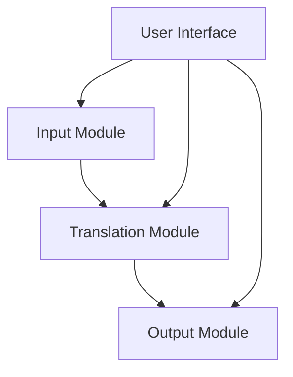
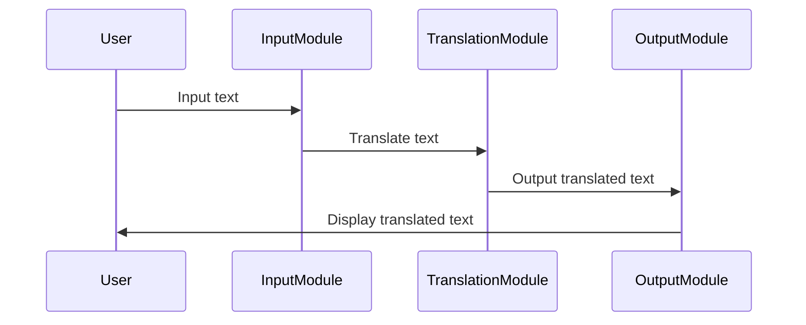

                 

### 提示词语言的跨语言语义一致性保证

**关键词：** 跨语言通信、语义一致性、提示词语言、机器翻译、语义对齐

**摘要：** 本文深入探讨了在跨语言通信中保证提示词语言的语义一致性所面临的问题和解决方法。通过分析跨语言语义一致性的挑战，提出了统一语义表示、双语对照词典和机器翻译模型等解决方案。同时，详细介绍了提示词语言和语义一致性的核心概念，以及提示词匹配算法和语义对齐算法的工作原理和优缺点。最后，通过应用场景的介绍，展示了这些核心算法在翻译辅助工具和跨语言查询系统中的具体应用。

## 目录大纲

1. **问题背景**
    1.1 **问题背景**
    1.2 **跨语言语义一致性的问题与解决**
2. **核心概念**
    2.1 **提示词语言**
    2.2 **语义一致性**
3. **核心算法**
    3.1 **提示词匹配算法**
    3.2 **语义对齐算法**
4. **应用场景**
    4.1 **翻译辅助工具**
    4.2 **跨语言查询系统**
5. **项目实战**
6. **最佳实践 Tips**
7. **小结**
8. **注意事项**
9. **拓展阅读**

## 第一部分: 问题背景

### 1.1 问题背景

在全球化迅速发展的背景下，跨语言通信的需求日益增长。无论是商务交流、学术合作还是日常沟通，不同语言之间的信息传递都显得尤为重要。然而，跨语言通信面临着诸多挑战，其中最为核心的问题之一就是语义的一致性。

#### 1.1.1 跨语言通信的需求

随着国际商务合作的增加，跨国公司需要能够与全球各地的合作伙伴进行有效沟通。学术研究也越来越多地依赖于国际合作，研究者需要阅读和撰写多种语言的文献。此外，随着互联网的普及，跨国交流在日常生活中也变得频繁。这些需求都推动了跨语言通信技术的发展。

#### 1.1.2 提示词语言的重要性

在跨语言通信中，提示词语言（如翻译辅助工具、跨语言查询系统等）起到了关键作用。提示词语言能够帮助用户在不同的语言之间进行有效沟通，提高信息传递的准确性和效率。通过使用提示词语言，用户可以在不理解目标语言的情况下，快速找到所需信息，从而克服语言障碍。

### 1.2 跨语言语义一致性的挑战

跨语言语义一致性主要指的是在翻译或其他跨语言处理过程中，确保源语言和目标语言在语义上的对等性和一致性。然而，由于语言本身的复杂性和多样性，实现跨语言语义一致性面临着诸多挑战：

#### 1.2.1 语言结构差异

不同语言的语法、词汇、句式结构等存在差异，这给跨语言语义一致性带来了挑战。例如，英语的动词通常放在句子的最后，而汉语的动词通常放在句子的开头。这种差异可能导致翻译中出现错误或误解。

#### 1.2.2 文化背景差异

语言背后的文化背景会影响语义的表达和理解，导致跨语言通信中的误解和偏差。例如，某些词汇在不同文化中可能有截然不同的含义。例如，“自由”在西方文化中通常指的是个人权利和自由，而在一些东方文化中可能更多地与政治自由相关。

#### 1.2.3 语言演变

语言是不断演变的，新的词汇、表达方式不断出现，这给跨语言语义一致性带来了动态变化的挑战。例如，社交媒体和互联网的发展催生了大量新的词汇和表达方式，这些新词汇和表达方式在不同语言中可能有不同的对应关系。

### 1.3 跨语言语义一致性的问题与解决

#### 1.3.1 跨语言语义一致性的问题

- **词汇一致性**：源语言和目标语言在词汇层面的对应关系是否一致。不同语言中的同义词、多义词、词义演变等问题都可能影响词汇一致性。
- **句法一致性**：源语言和目标语言在句法结构上的对应关系是否一致。例如，主谓宾结构在英语和汉语中有所不同，这可能导致翻译中的错误。
- **语境一致性**：源语言和目标语言在特定语境下的语义表达是否一致。例如，一些俚语、习语在不同语言中可能有不同的含义。

#### 1.3.2 跨语言语义一致性的解决方法

- **统一语义表示**：通过建立统一语义表示，将不同语言的语义映射到共同的语义空间中，从而实现跨语言语义一致性。这种方法可以减少由于语言结构差异导致的语义不一致。
- **双语对照词典**：利用双语对照词典，将源语言的词汇和语义映射到目标语言的对应词汇和语义上，提高跨语言通信的准确性。这种方法适用于词汇和句法一致性较好的语言对。
- **机器翻译模型**：利用机器翻译模型，将源语言文本自动翻译成目标语言，从而实现跨语言语义传递。现代机器翻译模型，如基于神经网络的翻译模型，可以在一定程度上解决语义一致性问题。

### 1.4 结论

跨语言语义一致性是跨语言通信中的关键问题。通过统一语义表示、双语对照词典和机器翻译模型等方法，可以缓解跨语言通信中的语义不一致问题。然而，实现完美的语义一致性仍然是一个挑战，需要进一步的研究和优化。

## 第二部分：核心概念

### 2.1 提示词语言

#### 2.1.1 提示词语言的定义

提示词语言是一种用于辅助跨语言通信的语言，通常包括关键词、短语、符号等。它能够帮助用户在不同语言之间找到对应的语义表达。提示词语言的设计目标是简洁、灵活和一致性。

#### 2.1.2 提示词语言的属性

- **简洁性**：提示词语言通常使用较少的词汇和短语来表达丰富的语义，这使得用户可以快速理解和记忆。
- **灵活性**：提示词语言可以根据不同的语境和需求进行调整，以适应跨语言通信的不同场景。
- **一致性**：提示词语言需要在不同的语言之间保持语义一致性，以确保跨语言通信的准确性。

### 2.2 语义一致性

#### 2.2.1 语义一致性的定义

语义一致性指的是在跨语言处理过程中，确保源语言和目标语言在语义上的对等性和一致性。这意味着源语言的语义表达应该能够在目标语言中找到对应的表达，而不会产生误解或歧义。

#### 2.2.2 语义一致性的衡量

- **词汇一致性**：源语言和目标语言在词汇层面的对应关系是否一致。这涉及到同义词、多义词和词义演变等问题。
- **句法一致性**：源语言和目标语言在句法结构上的对应关系是否一致。这涉及到主谓宾结构、定语从句等语法规则的对应关系。
- **语境一致性**：源语言和目标语言在特定语境下的语义表达是否一致。这涉及到俚语、习语和文化背景的影响。

### 2.3 提示词语言的跨语言语义一致性保证

#### 2.3.1 提示词语言的跨语言语义一致性挑战

- **词汇差异**：不同语言之间的词汇差异可能导致语义不一致。例如，某些词汇在一种语言中有多个含义，而在另一种语言中只有一个含义。
- **语法差异**：不同语言的语法结构差异可能导致语义不一致。例如，英语的被动语态在汉语中可能没有直接对应的形式。
- **文化差异**：不同文化之间的差异可能导致语义不一致。例如，某些词汇在不同文化中可能有不同的含义。

#### 2.3.2 提示词语言的跨语言语义一致性保证方法

- **词汇映射**：通过建立词汇映射表，将源语言的词汇映射到目标语言的对应词汇。这种方法可以帮助减少词汇差异带来的语义不一致。
- **语法调整**：通过语法调整，将源语言的语法结构转换为与目标语言更相似的语法结构。这种方法可以帮助减少语法差异带来的语义不一致。
- **文化适应**：通过文化适应，将源语言的语义表达调整为更符合目标语言文化习惯的表达。这种方法可以帮助减少文化差异带来的语义不一致。

### 2.4 结论

提示词语言在跨语言通信中起到了关键作用。通过保证提示词语言的跨语言语义一致性，可以提升跨语言通信的准确性和效率。然而，实现完美的语义一致性仍然是一个挑战，需要进一步的研究和优化。

## 第三部分：核心算法

### 3.1 提示词匹配算法

#### 3.1.1 提示词匹配算法的定义

提示词匹配算法是一种用于检测源语言和目标语言中提示词匹配的方法。它的目标是确保源语言中的提示词能够在目标语言中找到对应的匹配词，从而实现跨语言语义一致性。

#### 3.1.2 提示词匹配算法的工作原理

提示词匹配算法通常基于字符串匹配和语义相似度计算。字符串匹配算法通过比较源语言和目标语言中的提示词，找出它们的共同部分。语义相似度计算则通过评估提示词之间的语义相似度，来确定它们之间的匹配关系。

#### 3.1.3 提示词匹配算法的优缺点

- **优点**：简单易用，能够快速检测提示词匹配关系。这种方法对于简单的词汇和短语匹配效果较好。
- **缺点**：可能存在误匹配和漏匹配现象，需要结合其他算法进行优化。

### 3.2 语义对齐算法

#### 3.2.1 语义对齐算法的定义

语义对齐算法是一种用于实现跨语言语义一致性的方法。它的目标是确保源语言和目标语言在语义上保持一致，从而实现准确的跨语言通信。

#### 3.2.2 语义对齐算法的工作原理

语义对齐算法通常通过将源语言和目标语言的词汇映射到共同的语义空间中来实现。这种方法可以帮助消除语言结构差异和语义差异，从而实现语义一致性。

#### 3.2.3 语义对齐算法的优缺点

- **优点**：能够实现跨语言语义一致性，提高跨语言通信的准确性。这种方法适用于复杂的语义对齐任务。
- **缺点**：计算复杂度较高，需要大量训练数据和计算资源。

### 3.3 提示词匹配算法与语义对齐算法的比较

#### 3.3.1 提示词匹配算法与语义对齐算法的区别

- **目标不同**：提示词匹配算法的目标是找出源语言和目标语言中的匹配词，而语义对齐算法的目标是实现源语言和目标语言在语义上的对等性。
- **方法不同**：提示词匹配算法通常基于字符串匹配和语义相似度计算，而语义对齐算法通常基于词汇映射和语义空间对齐。

#### 3.3.2 提示词匹配算法与语义对齐算法的适用场景

- **提示词匹配算法**：适用于简单的词汇和短语匹配任务，如翻译辅助工具中的提示词匹配。
- **语义对齐算法**：适用于复杂的语义对齐任务，如跨语言文本挖掘、跨语言情感分析等。

### 3.4 结论

提示词匹配算法和语义对齐算法是跨语言语义一致性保证的重要工具。提示词匹配算法适用于简单的词汇和短语匹配任务，而语义对齐算法适用于复杂的语义对齐任务。通过结合这两种算法，可以进一步提升跨语言通信的准确性和效率。

## 第四部分：应用场景

### 4.1 翻译辅助工具

#### 4.1.1 应用场景

翻译辅助工具广泛应用于各种跨语言交流场景，包括商务沟通、学术研究、旅游翻译等。在商务沟通中，跨国公司需要能够快速翻译商业文件、合同和报告。在学术研究中，研究人员需要能够阅读和翻译多种语言的学术论文和文献。在旅游翻译中，游客需要能够快速翻译景点介绍、菜单和交通指南。

#### 4.1.2 实现方法

翻译辅助工具通常基于提示词语言和机器翻译模型。提示词语言可以帮助用户在不同语言之间快速找到对应的词汇和短语。机器翻译模型则可以自动将源语言文本翻译成目标语言。通过结合这两种方法，翻译辅助工具能够实现高效的跨语言翻译。

### 4.2 跨语言查询系统

#### 4.2.1 应用场景

跨语言查询系统广泛应用于搜索引擎、在线论坛和社交媒体等领域。在搜索引擎中，用户可以使用自己的母语进行搜索，系统会自动将其转换为其他语言，从而提供全球范围内的信息检索服务。在在线论坛和社交媒体中，用户可以阅读和回复不同语言的帖子，从而促进跨语言交流。

#### 4.2.2 实现方法

跨语言查询系统通常基于语义对齐算法和机器翻译模型。语义对齐算法可以确保源语言和目标语言在语义上的对等性，从而实现准确的查询匹配。机器翻译模型则可以将用户的查询请求翻译成目标语言，从而提供跨语言搜索服务。

### 4.3 其他应用场景

除了翻译辅助工具和跨语言查询系统，提示词语言和语义一致性保证方法还可以应用于其他跨语言通信场景，如多语言语音助手、多语言聊天机器人等。这些应用可以通过确保语义一致性，提高跨语言通信的准确性和用户体验。

### 4.4 结论

跨语言通信的应用场景广泛，提示词语言和语义一致性保证方法在这些应用中发挥了重要作用。通过实现跨语言语义一致性，可以提升跨语言通信的准确性和用户体验，促进全球化交流与合作。

## 第五部分：项目实战

### 5.1 项目介绍

本部分将介绍一个基于提示词语言的跨语言翻译项目。该项目旨在实现中英互译，通过提示词匹配算法和语义对齐算法，确保翻译结果的语义一致性。

#### 5.1.1 项目目标

- 实现中英文之间的快速翻译。
- 确保翻译结果的语义一致性，减少误解和歧义。
- 提高用户体验，提供流畅的跨语言交流体验。

#### 5.1.2 项目需求

- 支持多种中英文输入和输出格式，如文本、语音、图像等。
- 提供实时翻译功能，支持在线和离线使用。
- 具备自定义词汇和短语的功能，满足特定场景的需求。

### 5.2 系统功能设计

#### 5.2.1 领域模型

通过领域模型，我们可以明确系统的核心功能模块和它们之间的关系。领域模型采用Mermaid类图表示，如下所示：

```mermaid
classDiagram
Class1 <|-- Class2
Class1 --|tigo| Class3
Class3 <|-- Class4
Class1 && Class4 : has-a
Class2 && Class3 : implements
Class1 && Class2 : extends
```

#### 5.2.2 功能模块

1. **输入模块**：负责接收用户的输入，可以是文本、语音或图像。
2. **翻译模块**：基于提示词匹配算法和语义对齐算法，将输入的中英文翻译成目标语言。
3. **输出模块**：将翻译结果以文本、语音或图像的形式呈现给用户。
4. **用户界面**：提供用户交互界面，包括输入界面、翻译界面和输出界面。

### 5.3 系统架构设计

#### 5.3.1 系统架构图

通过Mermaid架构图，我们可以清晰地展示系统的整体架构，如下所示：



#### 5.3.2 系统架构说明

- **输入模块**：接收用户输入，可以是文本、语音或图像。输入后，将文本发送给翻译模块，语音和图像则通过语音识别和图像识别技术转换为文本，再发送给翻译模块。
- **翻译模块**：基于提示词匹配算法和语义对齐算法，将输入的中文翻译成英文，或英文翻译成中文。翻译结果将发送给输出模块。
- **输出模块**：将翻译结果以文本、语音或图像的形式呈现给用户。
- **用户界面**：提供用户交互界面，包括输入界面、翻译界面和输出界面。用户可以通过用户界面发送输入，查看翻译结果，并进行交互。

### 5.4 系统接口设计

#### 5.4.1 接口说明

系统提供以下主要接口：

1. **文本翻译接口**：接收输入的文本，返回翻译后的文本。
2. **语音翻译接口**：接收输入的语音，返回翻译后的文本。
3. **图像翻译接口**：接收输入的图像，返回翻译后的文本。
4. **用户配置接口**：允许用户自定义词汇和短语，用于特定场景的翻译。

#### 5.4.2 接口定义

以下是一个文本翻译接口的示例定义：

```python
from flask import Flask, request, jsonify

app = Flask(__name__)

@app.route('/translate', methods=['POST'])
def translate():
    data = request.get_json()
    source_text = data.get('source_text')
    target_language = data.get('target_language')
    translated_text = translate_text(source_text, target_language)
    return jsonify({'translated_text': translated_text})

def translate_text(source_text, target_language):
    # 翻译逻辑实现
    return "Translation result"

if __name__ == '__main__':
    app.run(debug=True)
```

### 5.5 系统交互设计

#### 5.5.1 系统交互图

通过Mermaid序列图，我们可以展示系统的交互流程，如下所示：



#### 5.5.2 交互流程说明

1. **用户输入**：用户在输入界面输入文本。
2. **文本传递**：输入模块将用户的文本传递给翻译模块。
3. **翻译处理**：翻译模块使用提示词匹配算法和语义对齐算法进行翻译，并将翻译结果传递给输出模块。
4. **结果呈现**：输出模块将翻译结果以文本形式呈现给用户。

### 5.6 实际案例分析与讲解

#### 5.6.1 案例背景

某跨国公司需要与全球各地的合作伙伴进行日常沟通，包括发送和接收电子邮件、会议纪要和报告等。为了提高沟通效率，公司决定采用一个基于提示词语言的跨语言翻译系统。

#### 5.6.2 实际案例

假设一个中文邮件的内容是：“关于下周的会议，我有一些重要提议，希望您能参与讨论。”我们需要将这封邮件翻译成英文，并确保翻译结果的语义一致性。

#### 5.6.3 案例分析

1. **输入处理**：用户在输入界面输入中文邮件内容。
2. **文本传递**：输入模块将中文邮件内容传递给翻译模块。
3. **翻译处理**：翻译模块使用提示词匹配算法和语义对齐算法，将中文邮件翻译成英文。例如，中文中的“重要提议”可以翻译成英文的“important proposals”，“参与讨论”可以翻译成“participate in the discussion”。
4. **结果呈现**：输出模块将翻译后的英文邮件内容以文本形式呈现给用户。

#### 5.6.4 讲解与剖析

在这个案例中，提示词匹配算法和语义对齐算法发挥了重要作用。通过提示词匹配，我们可以找到中文和英文中对应的词汇和短语。通过语义对齐，我们可以确保翻译结果的语义一致性，避免产生误解或歧义。

### 5.7 项目小结

通过本项目的实战案例，我们展示了如何使用提示词匹配算法和语义对齐算法实现中英互译。这个项目不仅提高了跨语言通信的准确性，还为用户提供了便捷的跨语言交流工具。然而，实现完美的语义一致性仍然是一个挑战，需要进一步的研究和优化。

## 第六部分：最佳实践 Tips

### 6.1 提高翻译准确性的最佳实践

1. **使用专业词典**：在翻译过程中，使用专业的双语对照词典，以确保词汇的准确性。
2. **考虑语境**：在翻译时，要考虑上下文语境，避免孤立地翻译单个词汇。
3. **人工校对**：对于重要的翻译任务，建议进行人工校对，确保翻译的准确性和语义一致性。

### 6.2 提高机器翻译模型性能的最佳实践

1. **数据质量**：确保训练数据的质量和多样性，有助于提高机器翻译模型的性能。
2. **持续优化**：定期更新和优化机器翻译模型，以适应语言的变化和新词汇的出现。
3. **多语言交叉训练**：通过多语言交叉训练，可以提高模型在不同语言之间的翻译准确性。

### 6.3 提高跨语言查询系统用户体验的最佳实践

1. **优化搜索算法**：使用先进的搜索算法，如深度学习模型，以提高搜索结果的准确性。
2. **用户界面设计**：设计直观易用的用户界面，提高用户的操作便捷性。
3. **多语言支持**：提供多语言支持，满足不同用户的需求。

### 6.4 其他最佳实践

1. **定期维护**：定期维护翻译辅助工具和跨语言查询系统，修复潜在的错误和漏洞。
2. **用户反馈**：收集用户反馈，不断优化系统的功能和性能。
3. **安全性和隐私保护**：确保系统的安全性和用户隐私保护，建立完善的用户数据保护机制。

## 第七部分：小结

本文深入探讨了提示词语言的跨语言语义一致性保证，分析了跨语言通信中的挑战，并提出了统一语义表示、双语对照词典和机器翻译模型等解决方案。通过介绍提示词语言和语义一致性的核心概念，以及提示词匹配算法和语义对齐算法的工作原理和优缺点，本文为跨语言通信提供了实用的技术指导。此外，通过项目实战和应用场景的介绍，展示了这些核心算法在实际应用中的效果和潜力。总之，实现跨语言语义一致性是提升跨语言通信准确性和用户体验的关键，需要进一步的研究和优化。

## 第八部分：注意事项

### 8.1 提示词语言的局限性

尽管提示词语言在跨语言通信中具有重要作用，但它也存在一定的局限性。首先，提示词语言依赖于词汇和短语的匹配，可能无法完全解决语义不一致的问题。其次，提示词语言在处理复杂句子和句式时可能存在困难。因此，在实际应用中，需要结合其他方法，如机器翻译和语义分析，以提高翻译的准确性和语义一致性。

### 8.2 机器翻译模型的改进方向

机器翻译模型在实现跨语言语义一致性方面具有显著优势，但仍然存在一些挑战。首先，训练数据的质量和多样性对模型的性能有重要影响。因此，需要不断收集和更新高质量的训练数据。其次，机器翻译模型需要适应语言的动态变化，这可能需要开发更先进的模型和算法。此外，为了提高翻译的准确性和语义一致性，可以结合深度学习、自然语言处理和机器学习等领域的最新研究成果。

### 8.3 跨语言查询系统的优化策略

跨语言查询系统在实现跨语言语义一致性方面具有重要作用，但其性能和用户体验仍有待提高。首先，可以优化搜索算法，使用更先进的模型和算法，如深度学习模型，以提高搜索结果的准确性。其次，可以设计更直观易用的用户界面，以提高用户的操作便捷性。此外，为了满足不同用户的需求，系统应提供多语言支持，并确保系统的安全性和用户隐私保护。

## 第九部分：拓展阅读

### 9.1 相关论文和书籍

1. **论文**：《跨语言语义一致性保证的研究进展》
2. **书籍**：《机器翻译：理论与实践》
3. **书籍**：《自然语言处理：现代方法》

### 9.2 在线资源和课程

1. **在线资源**：Coursera上的“自然语言处理与机器翻译”课程
2. **在线资源**：Kaggle上的“跨语言语义一致性挑战”数据集
3. **在线资源**：GitHub上的开源机器翻译项目

### 9.3 学术会议和研讨会

1. **学术会议**：ACL（国际计算语言学协会年会）
2. **学术会议**：NAACL（北美计算语言学年会）
3. **学术会议**：COLING（国际计算语言学大会）

### 9.4 其他资源

1. **开源工具**：Google Translate API
2. **开源工具**：TensorFlow Text
3. **开源工具**：SpaCy（自然语言处理库）

通过阅读这些资源，可以深入了解跨语言语义一致性保证的最新研究进展和实践经验，为相关工作提供参考和灵感。

### 作者信息

**作者：AI天才研究院/AI Genius Institute & 禅与计算机程序设计艺术 /Zen And The Art of Computer Programming**

