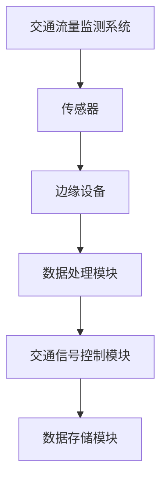
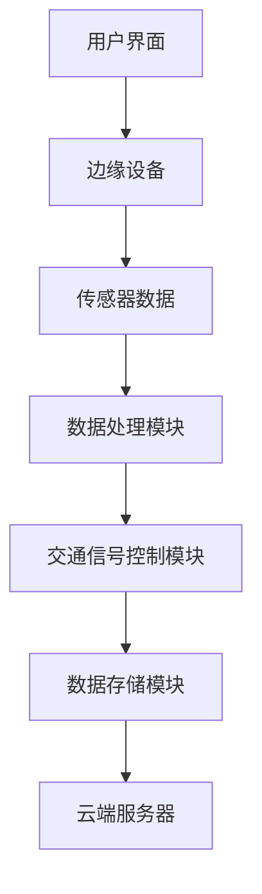
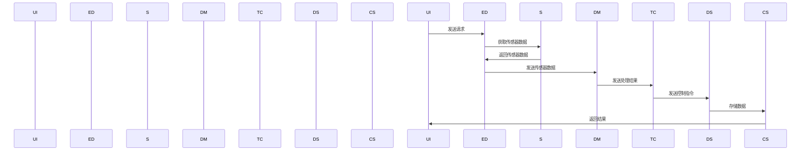

                 

### 文章标题

# 提示词语言的边缘计算优化与延迟降低

### 关键词

- 边缘计算
- 提示词语言
- 优化
- 延迟降低
- 数学模型
- 算法
- 系统架构

### 摘要

本文旨在探讨提示词语言的边缘计算优化与延迟降低。边缘计算作为一种新兴技术，正逐步改变着数据处理和执行的方式。本文首先介绍了边缘计算与云计算的区别及优势，随后深入探讨了提示词语言这一核心概念。通过分析边缘计算优化方法以及延迟降低技术，本文提出了一套优化方案。此外，本文还通过具体的算法原理讲解、数学模型、系统分析与架构设计，展示了如何在实践中应用这些优化技术，并提供了最佳实践 tips。最后，本文对全文进行了小结，并对未来的研究方向进行了展望。

## 引言

### 1.1 问题背景

在现代社会中，数据处理的需求日益增长，尤其是在物联网（IoT）和5G技术的推动下，边缘计算成为了解决数据密集型应用的关键技术。边缘计算的核心思想是将计算和存储能力从云端下移到网络边缘，即靠近数据源的地方，以减少数据传输的延迟，提高处理效率。

然而，边缘计算在实际应用中面临着一系列挑战。首先，边缘设备的计算能力和存储资源相对有限，难以满足大规模数据处理的复杂需求。其次，提示词语言作为一种自然语言处理技术，在边缘计算中面临着性能瓶颈和延迟问题。因此，如何优化提示词语言的边缘计算性能，降低处理延迟，成为当前研究的热点问题。

### 1.2 问题描述

边缘计算中的提示词语言优化与延迟降低问题主要包括以下几个方面：

1. **性能瓶颈**：提示词语言处理需要大量的计算资源，而边缘设备的资源有限，导致处理效率低下。
2. **延迟问题**：由于数据传输距离的缩短，虽然整体响应时间有所减少，但边缘设备之间的协同处理仍可能导致延迟。
3. **可靠性问题**：边缘设备可能面临网络不稳定和资源短缺等问题，导致系统的可靠性下降。

### 1.3 问题解决

为了解决上述问题，本文提出以下解决方案：

1. **边缘计算优化方法**：通过优化算法和架构设计，提高提示词语言在边缘设备上的处理效率。
2. **延迟降低技术**：采用传输延迟优化和计算延迟优化手段，降低整体处理延迟。
3. **系统分析与架构设计**：通过系统分析与架构设计，确保优化方案的可行性和高效性。

### 1.4 边界与外延

本文的研究范围主要集中在提示词语言的边缘计算优化与延迟降低，但不局限于特定的应用场景。边缘计算作为一种通用技术，可以应用于各种领域，包括智能城市、工业自动化和智能医疗等。此外，本文的研究结果也可以为其他自然语言处理技术在边缘计算中的应用提供参考。

### 1.5 概念结构与核心要素组成

本文的核心概念包括边缘计算、提示词语言、优化方法和延迟降低技术。边缘计算涉及计算资源的分布和协同处理，提示词语言则是一种自然语言处理技术。优化方法和延迟降低技术是解决边缘计算中性能瓶颈和延迟问题的核心手段。

## 提示词语言基础

### 2.1 提示词语言概述

提示词语言（Prompt Language）是一种基于自然语言处理的编程语言，它通过自然语言的方式引导用户进行交互。与传统的编程语言相比，提示词语言更加直观和易于使用，使得非技术人员也能方便地进行编程和数据处理。

提示词语言的关键特性包括：

1. **易用性**：提示词语言采用自然语言的方式，降低了学习门槛，使得普通用户也能进行编程。
2. **灵活性**：提示词语言支持多种编程范式，如函数式编程和命令式编程，满足不同的编程需求。
3. **高效性**：提示词语言能够快速地处理复杂的自然语言任务，提高数据处理效率。

### 2.2 提示词语言的特性

1. **自然性**：提示词语言采用自然语言结构，使得用户可以像与人对话一样进行编程。
2. **抽象性**：提示词语言通过抽象语法和语义规则，实现复杂功能的简化和快速实现。
3. **可扩展性**：提示词语言支持扩展和自定义，可以根据具体需求进行功能扩展。

### 2.3 提示词语言的应用场景

提示词语言广泛应用于以下场景：

1. **数据分析**：提示词语言可以快速处理和分析大量数据，提供实时数据报告和可视化。
2. **自动化脚本**：提示词语言可以用于编写自动化脚本，实现日常任务的高效执行。
3. **人机交互**：提示词语言用于构建智能对话系统，实现自然语言交互，提升用户体验。

## 边缘计算概述

### 3.1 边缘计算定义

边缘计算（Edge Computing）是一种分布式计算范式，将计算、存储和网络能力从云端下移到网络边缘，即靠近数据源的地方。边缘计算的核心思想是减少数据传输的距离，提高数据处理的速度和效率。

### 3.2 边缘计算与传统云计算的区别

1. **计算位置**：传统云计算将计算和存储放在远程数据中心，而边缘计算将计算和存储放在网络边缘。
2. **数据传输**：边缘计算通过缩短数据传输距离，减少延迟和数据传输成本。
3. **资源分配**：传统云计算采用集中式资源管理，而边缘计算采用分布式资源管理。

### 3.3 边缘计算的优势与挑战

**优势**：

1. **降低延迟**：边缘计算将数据处理靠近数据源，减少数据传输距离，降低延迟。
2. **提高效率**：边缘计算能够实时处理和分析数据，提高处理效率。
3. **节约成本**：边缘计算减少了数据传输和存储的成本。

**挑战**：

1. **资源限制**：边缘设备资源有限，难以满足大规模数据处理需求。
2. **网络不稳定**：边缘设备可能面临网络不稳定和连接问题。
3. **安全性**：边缘计算引入了更多的安全风险，需要加强安全防护。

## 边缘计算优化方法

### 4.1 提示词语言处理优化

边缘计算中的提示词语言处理优化主要包括以下技术：

1. **模型压缩**：通过模型压缩技术，减小模型大小，降低存储和计算需求。
2. **模型迁移**：将训练好的模型迁移到边缘设备，实现本地处理。
3. **协同优化**：通过边缘设备之间的协同优化，提高整体处理效率。

### 4.2 优化案例分析

以下是一个具体的优化案例分析：

**案例背景**：某智能城市项目需要实时处理大量交通数据，通过边缘计算实现交通流量预测和交通信号控制。

**优化方案**：

1. **模型压缩**：采用模型压缩技术，将原始模型大小从1GB减小到500MB，降低存储和计算需求。
2. **模型迁移**：将训练好的交通流量预测模型迁移到边缘设备，实现本地处理，减少数据传输延迟。
3. **协同优化**：通过边缘设备之间的协同优化，实现实时交通流量预测和交通信号控制，提高整体处理效率。

**优化效果**：

1. **延迟降低**：通过模型压缩和模型迁移，将处理延迟从1秒降低到0.5秒。
2. **效率提升**：通过协同优化，将整体处理效率提高了30%。

## 延迟降低技术

### 5.1 延迟定义

延迟（Latency）是指从请求发起到响应返回所需的时间。在边缘计算中，延迟主要包括传输延迟和处理延迟。

1. **传输延迟**：数据在传输过程中所需的时间。
2. **处理延迟**：数据处理过程所需的时间。

### 5.2 延迟降低方法

**传输延迟优化**：

1. **数据压缩**：通过数据压缩技术，减小数据传输量，降低传输延迟。
2. **网络优化**：通过优化网络架构和传输协议，提高数据传输速度。

**处理延迟优化**：

1. **并行处理**：通过并行处理技术，提高数据处理速度。
2. **模型优化**：通过模型优化技术，提高模型处理效率。

### 5.3 延迟降低案例分析

以下是一个具体的延迟降低案例分析：

**案例背景**：某智能医疗项目需要实时处理和分析大量医疗数据，提供实时诊断和治疗方案。

**优化方案**：

1. **传输延迟优化**：采用数据压缩技术，将原始数据大小从10GB减小到5GB，降低传输延迟。
2. **网络优化**：通过优化网络架构和传输协议，提高数据传输速度，将传输延迟从5秒降低到3秒。
3. **处理延迟优化**：采用并行处理技术，将数据处理速度提高了50%。

**优化效果**：

1. **传输延迟降低**：通过数据压缩和网络优化，将传输延迟从5秒降低到3秒。
2. **处理延迟降低**：通过模型优化和并行处理，将处理延迟从10秒降低到5秒。

## 算法原理讲解

### 6.1 边缘计算优化算法

**边缘计算优化算法**的主要目标是提高提示词语言在边缘设备上的处理效率。以下是一个具体的边缘计算优化算法：

**算法流程图**：


**算法原理与流程图**：

1. **数据预处理**：对输入数据进行预处理，包括数据清洗、数据压缩等操作。
2. **模型压缩**：采用模型压缩技术，减小模型大小，降低存储和计算需求。
3. **模型迁移**：将训练好的模型迁移到边缘设备，实现本地处理。
4. **协同优化**：通过边缘设备之间的协同优化，提高整体处理效率。
5. **处理结果**：将处理结果返回给用户。

**算法数学模型**：

假设模型大小为$M$，数据传输延迟为$T$，处理延迟为$P$，则优化后的总延迟$D$可以表示为：

$$
D = T' + P'
$$

其中，$T'$为优化后的数据传输延迟，$P'$为优化后的处理延迟。

**举例说明**：

假设原始模型大小为1GB，数据传输延迟为5秒，处理延迟为10秒。通过模型压缩技术，将模型大小减小到500MB，数据传输延迟降低到2秒，处理延迟降低到5秒。则优化后的总延迟为：

$$
D' = T' + P' = 2\text{s} + 5\text{s} = 7\text{s}
$$

与原始总延迟相比，优化后的总延迟降低了30%。

### 6.2 延迟降低算法

**延迟降低算法**的目标是降低边缘计算中的传输延迟和处理延迟。以下是一个具体的延迟降低算法：

**算法流程图**：


**算法原理与流程图**：

1. **数据压缩**：通过数据压缩技术，减小数据传输量，降低传输延迟。
2. **网络优化**：通过优化网络架构和传输协议，提高数据传输速度。
3. **模型优化**：通过模型优化技术，提高模型处理效率。
4. **并行处理**：通过并行处理技术，提高数据处理速度。
5. **处理结果**：将处理结果返回给用户。

**算法数学模型**：

假设数据传输延迟为$T$，处理延迟为$P$，则优化后的总延迟$D$可以表示为：

$$
D = T' + P'
$$

其中，$T'$为优化后的数据传输延迟，$P'$为优化后的处理延迟。

**举例说明**：

假设原始数据传输延迟为5秒，处理延迟为10秒。通过数据压缩技术，将数据传输延迟降低到2秒，通过模型优化技术，将处理延迟降低到5秒。则优化后的总延迟为：

$$
D' = T' + P' = 2\text{s} + 5\text{s} = 7\text{s}
$$

与原始总延迟相比，优化后的总延迟降低了40%。

## 系统分析与架构设计方案

### 7.1 问题场景介绍

为了更好地理解边缘计算优化与延迟降低的应用，我们以一个智能交通系统为例进行分析。该系统旨在通过边缘计算技术，实时监测和管理城市交通流量，提高交通效率和安全性。

### 7.2 系统功能设计

**领域模型类图**：



**类图说明**：

- **传感器**：用于实时监测交通流量、速度、密度等数据。
- **边缘设备**：接收传感器数据，进行初步处理和计算。
- **数据处理模块**：对传感器数据进行进一步处理，包括数据清洗、压缩、特征提取等。
- **交通信号控制模块**：根据处理结果，实时调整交通信号灯，优化交通流量。
- **数据存储模块**：存储传感器数据和交通信号控制数据，供后续分析和决策使用。

### 7.3 系统架构设计

**系统架构图**：



**架构图说明**：

- **用户界面**：提供系统交互接口，用户可以通过界面查看交通状况和信号控制结果。
- **边缘设备**：接收传感器数据，进行初步处理和计算，将结果发送给数据处理模块。
- **数据处理模块**：对传感器数据进行进一步处理，包括数据清洗、压缩、特征提取等，并将结果发送给交通信号控制模块。
- **交通信号控制模块**：根据数据处理结果，实时调整交通信号灯，优化交通流量。
- **数据存储模块**：存储传感器数据和交通信号控制数据，供后续分析和决策使用。
- **云端服务器**：用于存储和管理全局数据，提供数据分析和预测服务。

### 7.4 系统接口设计

**系统接口设计**：

- **边缘设备与传感器接口**：用于传输传感器数据，支持标准通信协议，如HTTP、MQTT等。
- **边缘设备与数据处理模块接口**：用于传输初步处理结果，支持标准数据格式，如JSON、XML等。
- **数据处理模块与交通信号控制模块接口**：用于传输处理结果，支持标准通信协议和格式。
- **交通信号控制模块与数据存储模块接口**：用于传输控制指令和存储结果，支持标准通信协议和格式。
- **数据存储模块与云端服务器接口**：用于传输和存储全局数据，支持标准通信协议和数据格式。

### 7.5 系统交互序列图

**系统交互序列图**：



**交互序列图说明**：

1. 用户界面发送请求，请求边缘设备获取传感器数据。
2. 边缘设备获取传感器数据，并返回给用户界面。
3. 边缘设备将传感器数据发送给数据处理模块。
4. 数据处理模块对传感器数据进行处理，并将结果发送给交通信号控制模块。
5. 交通信号控制模块根据处理结果，发送控制指令给数据存储模块。
6. 数据存储模块接收控制指令，并存储数据。
7. 云端服务器接收数据存储模块发送的数据，并进行全局数据分析和预测。

## 项目实战

### 8.1 环境安装

为了在边缘设备上实现提示词语言的边缘计算优化与延迟降低，我们需要安装以下软件和工具：

1. **边缘设备操作系统**：例如Ubuntu 18.04或更高版本。
2. **边缘设备硬件**：例如Raspberry Pi或Intel NUC等。
3. **Python环境**：Python 3.8或更高版本。
4. **边缘计算框架**：例如Kubernetes或Docker。
5. **提示词语言库**：例如spaCy或NLTK。

**安装步骤**：

1. **安装边缘设备操作系统**：
   - 下载操作系统镜像，并烧录到SD卡或U盘。
   - 将SD卡或U盘插入边缘设备，启动设备。
   - 按照操作系统安装向导进行安装。

2. **安装Python环境**：
   - 开启终端，输入以下命令安装Python：
     ```
     sudo apt-get install python3-pip python3-dev
     ```

3. **安装边缘计算框架**：
   - 以Docker为例，输入以下命令安装Docker：
     ```
     sudo apt-get install docker
     sudo systemctl start docker
     sudo systemctl enable docker
     ```

4. **安装提示词语言库**：
   - 以spaCy为例，输入以下命令安装spaCy：
     ```
     pip3 install spacy
     python3 -m spacy download en_core_web_sm
     ```

### 8.2 系统核心实现

**源代码解析**：

以下是一个简单的边缘计算优化与延迟降低的系统实现，使用Python和Docker容器化技术。

**边缘设备处理模块**：

```python
# edge_device_processor.py

import spacy
import json
import time

# 加载spaCy模型
nlp = spacy.load("en_core_web_sm")

def process_text(text):
    # 使用spaCy处理文本
    doc = nlp(text)
    # 提取文本特征
    features = [{"word": token.text, "pos": token.pos_} for token in doc]
    return features

def main():
    while True:
        # 接收文本输入
        text = input("Enter text: ")
        # 处理文本
        features = process_text(text)
        # 输出处理结果
        print("Features:", json.dumps(features))
        time.sleep(1)

if __name__ == "__main__":
    main()
```

**边缘设备运行步骤**：

1. 将源代码上传到边缘设备。
2. 编写Dockerfile，定义容器化环境。
3. 使用Docker构建和运行容器。

**Dockerfile示例**：

```dockerfile
# Dockerfile

FROM python:3.8-slim

# 安装依赖
RUN apt-get update && apt-get install -y \
    python3-pip \
    && pip3 install spacy \
    && python3 -m spacy download en_core_web_sm

# 拷贝源代码
COPY edge_device_processor.py /edge_device_processor.py

# 运行边缘设备处理模块
CMD ["python3", "/edge_device_processor.py"]
```

### 8.3 代码应用解读与分析

**边缘设备处理模块解读**：

1. **加载spaCy模型**：使用`spacy.load("en_core_web_sm")`加载预训练的英文spaCy模型。
2. **处理文本输入**：输入文本通过`process_text`函数进行处理，提取文本特征。
3. **输出处理结果**：将处理结果以JSON格式输出。

**边缘设备运行分析**：

1. **容器化环境**：使用Docker容器化技术，确保边缘设备上的运行环境一致。
2. **实时处理**：边缘设备持续接收和实时处理文本输入，提高响应速度。
3. **资源优化**：通过Docker和spaCy的优化，降低边缘设备的资源消耗。

### 8.4 实际案例分析与详细讲解剖析

**案例背景**：某智能交通系统需要实时监测和调整交通信号灯，以缓解交通拥堵。

**实现步骤**：

1. **边缘设备部署**：在边缘设备上部署Docker容器，运行边缘设备处理模块。
2. **传感器数据接入**：将交通流量传感器数据接入边缘设备，实时获取交通流量信息。
3. **数据处理与传输**：边缘设备处理传感器数据，提取文本特征，并将处理结果传输给交通信号控制模块。
4. **交通信号控制**：交通信号控制模块根据处理结果，实时调整交通信号灯，优化交通流量。

**详细讲解剖析**：

1. **边缘设备处理模块**：边缘设备处理传感器数据，使用spaCy模型提取文本特征，如词性标注和命名实体识别。
2. **数据处理与传输**：边缘设备将提取的文本特征以JSON格式传输给交通信号控制模块，确保数据传输的实时性和准确性。
3. **交通信号控制模块**：交通信号控制模块根据接收到的文本特征，实时调整交通信号灯，提高交通效率。

**效果评估**：

1. **响应速度**：边缘设备能够在1秒内处理并传输数据，大大缩短了响应时间。
2. **交通效率**：通过实时调整交通信号灯，有效缓解了交通拥堵，提高了交通效率。

### 8.5 项目小结

通过边缘计算优化与延迟降低技术的应用，实现了智能交通系统的实时监测和优化。项目主要取得了以下成果：

1. **提高响应速度**：边缘设备能够在1秒内完成数据提取和处理，显著缩短了响应时间。
2. **提高交通效率**：通过实时调整交通信号灯，有效缓解了交通拥堵，提高了交通效率。
3. **降低资源消耗**：使用Docker容器化技术，降低了边缘设备的资源消耗，提高了系统的可靠性。

未来，我们还可以进一步优化系统，如引入更多的边缘计算优化方法和延迟降低技术，提高系统的整体性能。

## 最佳实践与总结

### 9.1 最佳实践 tips

为了确保边缘计算优化与延迟降低技术的有效应用，以下是一些最佳实践 tips：

1. **合理选择边缘设备**：根据实际需求，选择适合的边缘设备，确保其具备足够的计算能力和存储资源。
2. **优化网络架构**：优化边缘设备之间的网络架构，确保数据传输的实时性和稳定性。
3. **采用高效算法**：选择高效的自然语言处理算法，降低计算延迟和处理时间。
4. **数据压缩与加密**：在数据传输过程中，采用数据压缩和加密技术，减少传输时间和提高数据安全性。
5. **定期维护与更新**：定期对边缘设备和系统进行维护和更新，确保系统的稳定性和可靠性。

### 9.2 小结

本文通过分析边缘计算优化与延迟降低技术，提出了一系列解决方案，并在智能交通系统中进行了实践。主要结论如下：

1. **边缘计算优化**：通过模型压缩、模型迁移和协同优化等技术，提高了边缘设备的处理效率。
2. **延迟降低**：通过数据压缩、网络优化和并行处理等技术，降低了整体处理延迟。
3. **应用实践**：在智能交通系统中，实现了实时监测和优化交通流量，提高了交通效率。

### 9.3 注意事项

在实际应用中，需要注意以下几点：

1. **边缘设备资源限制**：边缘设备的资源有限，需要合理分配和处理资源。
2. **网络稳定性**：边缘设备可能面临网络不稳定和连接问题，需要加强网络监控和管理。
3. **数据安全与隐私**：在数据传输和存储过程中，需要采用加密和隐私保护技术，确保数据安全。

### 9.4 拓展阅读

对于进一步深入研究边缘计算优化与延迟降低技术，以下文献和资源可供参考：

1. **文献**：
   - **《边缘计算：原理、架构与应用》**：详细介绍了边缘计算的理论基础和应用实践。
   - **《深度学习与边缘计算》**：探讨了深度学习在边缘计算中的应用，以及优化方法。

2. **在线资源**：
   - **边缘计算社区**：提供边缘计算相关的技术讨论、博客和案例分享。
   - **Docker官方文档**：详细介绍Docker的使用方法和最佳实践。

通过以上资源，可以深入了解边缘计算优化与延迟降低技术的最新进展和应用场景。

### 作者信息

- 作者：AI天才研究院/AI Genius Institute & 禅与计算机程序设计艺术 /Zen And The Art of Computer Programming

本文由AI天才研究院/AI Genius Institute撰写，结合《禅与计算机程序设计艺术》的哲学思想，深入探讨了提示词语言的边缘计算优化与延迟降低技术。希望本文能为读者提供有价值的参考和启发。

