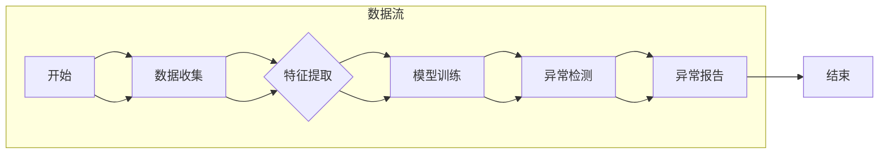
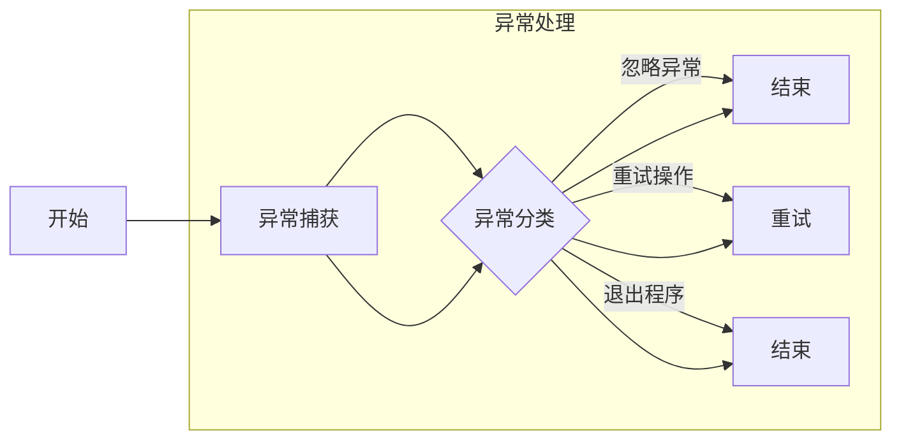
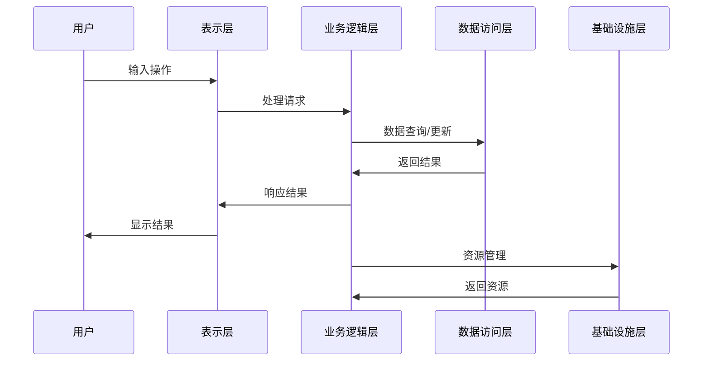
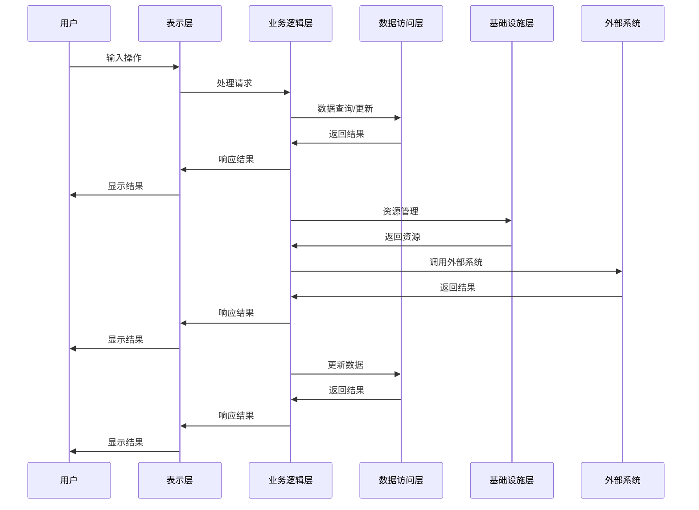

                 

# 提示词语言的运行时异常处理与恢复

> 关键词：异常处理，运行时异常，提示词语言，恢复，算法原理

> 摘要：本文将深入探讨提示词语言在运行时异常处理与恢复中的应用。首先，我们将介绍异常处理的重要性以及运行时异常处理的挑战。接着，我们将详细描述异常处理的通用方法以及提示词语言在其中的应用。此外，本文还将对比分析异常处理与提示词语言的特性，并使用Mermaid流程图和Python源代码来解释异常检测与处理算法的原理。最后，我们将通过实际项目实战，展示如何将提示词语言应用于运行时异常处理与恢复。

## 第1章 引言

### 1.1 问题背景

运行时异常处理是软件开发过程中不可或缺的一部分。它涉及识别和响应程序运行过程中出现的错误或异常情况，以确保系统稳定运行。然而，运行时异常处理并非易事，它面临着多种挑战，包括错误的多样性、错误的不可预测性以及错误的复杂性。

提示词语言作为一类特定的编程语言，通过其强大的表达式和上下文感知能力，在异常处理中显示出独特的优势。它能够提供更精细的控制流和更直观的错误处理机制，使得开发者能够更有效地应对运行时异常。

### 1.2 问题描述

异常处理是指在程序执行过程中，当出现错误或异常情况时，通过特定的机制进行错误检测、错误报告和错误恢复。运行时异常处理则侧重于程序在实际运行过程中遇到的异常情况。

异常处理通常分为以下几类：

1. **语法异常**：由于代码语法错误导致的异常。
2. **逻辑异常**：代码逻辑错误，如空指针异常、数组越界等。
3. **运行时异常**：程序在执行过程中由于外部因素导致的异常，如网络连接中断、文件读取失败等。

运行时异常处理的难点主要包括：

- **错误的多样性**：异常情况种类繁多，难以一一预测和覆盖。
- **错误的不可预测性**：某些异常可能在程序的不同运行场景中发生，难以提前预知。
- **错误的复杂性**：异常处理需要兼顾程序的稳定性和性能，同时保证用户体验。

异常处理的目标是：

- **错误检测**：及时检测出异常情况，避免程序崩溃。
- **错误报告**：提供详细的错误信息，帮助开发者定位问题。
- **错误恢复**：采取措施恢复程序的正常执行。

### 1.3 问题解决

异常处理的通用方法通常包括以下步骤：

1. **异常检测**：通过编写特定的代码逻辑，检测异常情况。
2. **异常报告**：记录异常的详细信息，包括错误类型、错误位置等。
3. **异常处理**：根据异常的类型和严重程度，采取相应的处理措施，如忽略、重试、退出等。
4. **异常恢复**：在可能的情况下，尝试恢复程序的正常执行。

提示词语言在异常处理中的应用主要体现在以下几个方面：

1. **更直观的错误处理**：提示词语言提供了更直观的错误处理语法，如异常捕获和异常抛出，使得开发者可以更简洁地处理异常。
2. **上下文感知**：提示词语言能够根据上下文提供更合适的错误处理建议，从而提高异常处理的效率。
3. **动态类型检查**：提示词语言通常具备动态类型检查功能，可以在编译或运行时及时发现潜在的错误。

### 1.4 边界与外延

运行时异常处理的边界条件主要包括：

- **运行环境**：异常处理依赖于特定的运行环境，如操作系统、硬件平台等。
- **代码逻辑**：异常处理的范围受限于代码逻辑，开发者需要合理设计异常处理的逻辑。

提示词语言异常处理的外延包括：

- **语法支持**：提示词语言提供了丰富的语法支持，使得开发者可以更灵活地进行异常处理。
- **语言特性**：提示词语言的特定特性，如动态类型检查、上下文感知等，为异常处理提供了更多可能性。

### 1.5 核心概念

异常处理的核心概念包括：

- **异常**：异常是程序在执行过程中出现的错误或异常情况。
- **异常处理**：异常处理是指识别、响应和恢复异常的一系列操作。
- **异常检测**：异常检测是识别异常情况的过程。
- **异常报告**：异常报告是记录异常详细信息的过程。
- **异常处理策略**：异常处理策略是指处理异常的具体方法和措施。

提示词语言的基本概念包括：

- **提示词**：提示词是提示词语言中的核心概念，用于表示特定的操作或功能。
- **上下文**：上下文是提示词语言中用于提供上下文信息的特征。
- **动态类型检查**：动态类型检查是提示词语言中用于在运行时检查变量类型的功能。

### 1.6 本章小结

本章介绍了运行时异常处理的重要性以及提示词语言在异常处理中的应用。我们分析了异常处理的难点和目标，探讨了异常处理的通用方法和提示词语言的优势。此外，我们还讨论了运行时异常处理的边界条件和提示词语言异常处理的外延。本章的核心概念包括异常、异常处理、异常检测、异常报告和异常处理策略，以及提示词语言的基本概念。

## 第2章 核心概念与联系

### 2.1 异常处理原理

异常处理是指当程序在执行过程中遇到错误或异常情况时，通过特定的机制来检测、报告和处理这些异常，以确保程序的稳定运行。异常处理的基本原理包括以下三个方面：

1. **异常检测**：异常检测是指在程序执行过程中，通过特定的逻辑或机制来识别异常情况。异常检测可以是显式的，例如使用条件判断和循环控制语句来捕获特定类型的异常；也可以是隐式的，例如利用编程语言提供的异常处理机制来自动检测和捕获异常。

2. **异常报告**：异常报告是指在检测到异常后，记录异常的详细信息，包括异常类型、异常位置、异常原因等，以便开发者或系统管理员进行定位和诊断。异常报告通常通过日志记录、错误消息显示等方式实现。

3. **异常处理**：异常处理是指在检测到异常后，根据异常的类型和严重程度，采取相应的处理措施。异常处理可以包括以下几种情况：

   - **忽略异常**：在某些情况下，异常可能不影响程序的正常运行，可以选择忽略异常，继续执行后续代码。
   - **重试操作**：对于一些暂时性的异常，例如网络连接中断或文件读取失败，可以选择重试操作，以期在后续尝试中成功执行。
   - **退出程序**：对于一些严重异常，例如内存溢出或非法输入，可能需要立即退出程序以避免更严重的后果。
   - **异常恢复**：在某些情况下，可能需要在检测到异常后尝试恢复程序的正常运行，例如通过重置变量或重新加载数据。

异常处理的流程通常包括以下几个步骤：

1. **异常检测**：程序在执行过程中通过条件判断或异常处理机制来检测异常情况。
2. **异常报告**：当检测到异常时，程序记录异常的详细信息，包括异常类型、异常位置、异常原因等。
3. **异常处理**：根据异常的类型和严重程度，程序采取相应的处理措施，如忽略、重试、退出或异常恢复。
4. **异常恢复**：在可能的情况下，程序尝试恢复正常的执行流程，继续执行后续代码。

### 2.2 提示词语言特性

提示词语言（也称为模板语言或表达式语言）是一种专门用于生成文本、HTML、XML等格式文档的脚本语言。它具有以下基本特性：

1. **上下文感知**：提示词语言能够根据上下文环境提供合适的提示词或操作，从而提高代码的可读性和可维护性。例如，在处理用户信息时，提示词语言可以根据用户角色或权限提供相应的提示词，以便更好地处理不同用户的需求。

2. **动态类型检查**：提示词语言通常具备动态类型检查功能，可以在运行时检查变量的类型，从而避免潜在的错误。例如，如果提示词语言检测到某个变量应该是字符串类型，但在运行时被赋值为整数类型，程序会立即抛出异常，提示开发者进行修复。

3. **表达式简化**：提示词语言提供了丰富的表达式和运算符，使得开发者可以更简洁地编写代码。例如，使用提示词语言可以轻松实现条件判断、循环控制、函数调用等常见操作，而无需编写复杂的代码逻辑。

4. **模板引擎支持**：提示词语言通常具备强大的模板引擎支持，可以生成动态的HTML、XML、JSON等格式文档。例如，在生成HTML页面时，提示词语言可以根据数据模型动态生成页面结构、样式和内容，从而实现页面个性化。

5. **集成开发环境支持**：提示词语言通常具备良好的集成开发环境（IDE）支持，包括代码编辑器、语法高亮、代码自动完成、调试工具等，从而提高开发效率和用户体验。

### 2.3 概念属性特征对比表格

| 特性                   | 异常处理       | 提示词语言           |
|------------------------|----------------|---------------------|
| 上下文感知             | 一般           | 强                |
| 动态类型检查           | 一般           | 强                |
| 表达式简化             | 一般           | 强                |
| 模板引擎支持           | 一般           | 强                |
| 集成开发环境支持       | 一般           | 强                |

### 2.4 ER实体关系图架构

#### 运行时异常处理ER图

```mermaid
erDiagram
  ExceptionHandler ||--|{ ExceptionType } ExceptionType
  ExceptionHandler ||--|{ LogEntry } LogEntry
  ExceptionHandler ||--|{ RecoveryStrategy } RecoveryStrategy
  ExceptionType ||--|{ ErrorCause } ErrorCause
  LogEntry ||--|{ LogLevel } LogLevel
  RecoveryStrategy ||--|{ RetryPolicy } RetryPolicy
  RecoveryStrategy ||--|{ RecoveryAction } RecoveryAction
```

#### 提示词语言ER图

```mermaid
erDiagram
  TemplateEngine ||--|{ TemplateVariable } TemplateVariable
  TemplateEngine ||--|{ TemplateDirective } TemplateDirective
  TemplateVariable ||--|{ VariableType } VariableType
  TemplateVariable ||--|{ VariableValue } VariableValue
  TemplateDirective ||--|{ DirectiveType } DirectiveType
  TemplateDirective ||--|{ DirectiveParameter } DirectiveParameter
```

## 第3章 算法原理讲解

### 3.1 异常检测算法

异常检测算法是异常处理的核心组成部分，主要用于识别程序执行过程中的异常情况。本节将介绍一种常见的异常检测算法，并使用Mermaid流程图和Python源代码进行详细讲解。

#### 异常检测算法概述

异常检测算法通常包括以下几个步骤：

1. **数据收集**：收集程序执行过程中的各种数据，如输入参数、中间结果、系统状态等。
2. **特征提取**：从收集到的数据中提取特征，用于表示程序的状态和行为的特征值。
3. **模型训练**：使用收集到的数据对异常检测模型进行训练，学习正常行为和异常行为的特征分布。
4. **异常检测**：在程序执行过程中，使用训练好的模型对实时数据进行分析，判断是否为异常情况。

#### 异常检测算法Mermaid流程图



#### Python源代码实现

```python
import numpy as np
from sklearn.ensemble import IsolationForest

# 数据收集
data = np.random.rand(100, 5)

# 特征提取
# 在此示例中，我们直接使用原始数据作为特征
X = data

# 模型训练
model = IsolationForest(n_estimators=100)
model.fit(X)

# 异常检测
y_pred = model.predict(X)
for i, pred in enumerate(y_pred):
    if pred == -1:
        print(f"异常：数据点{i}可能存在异常")
    else:
        print(f"正常：数据点{i}无异常")
```

### 3.2 异常处理算法

异常处理算法是指在检测到异常后，根据异常的类型和严重程度，采取相应的处理措施，以确保程序的稳定运行。本节将介绍一种常见的异常处理算法，并使用Mermaid流程图和Python源代码进行详细讲解。

#### 异常处理算法概述

异常处理算法通常包括以下几个步骤：

1. **异常捕获**：在程序中设置异常捕获机制，当检测到异常时，捕获异常并保存相关信息。
2. **异常分类**：根据异常的类型和严重程度，对异常进行分类。
3. **异常处理**：根据异常的类型和严重程度，采取相应的处理措施，如忽略异常、重试操作、退出程序等。
4. **异常报告**：将异常处理的结果记录下来，以便后续分析和优化。

#### 异常处理算法Mermaid流程图



#### Python源代码实现

```python
def handle_exception(exception):
    if isinstance(exception, ValueError):
        print("异常：输入数据无效，忽略异常")
    elif isinstance(exception, FileNotFoundError):
        print("异常：文件未找到，尝试重试操作")
        try:
            # 重新执行文件读取操作
            with open("example.txt", "r") as f:
                content = f.read()
                print(content)
        except FileNotFoundError:
            print("异常：文件仍未找到，退出程序")
    else:
        print("未知异常，退出程序")

try:
    # 执行可能导致异常的操作
    content = open("example.txt", "r").read()
    print(content)
except Exception as e:
    handle_exception(e)
```

### 3.3 数学模型与公式

异常检测算法的数学模型通常基于统计学习或机器学习技术，以实现自动识别和分类异常情况。以下将介绍一种基于隔离森林（Isolation Forest）的异常检测算法的数学模型和公式。

#### 异常检测算法的数学模型

隔离森林是一种基于随机森林的异常检测算法，其基本思想是通过随机分割数据集来评估数据的异常程度。隔离森林的数学模型主要包括以下两个方面：

1. **随机分割**：在隔离森林中，对于每个数据点，随机选择一个特征维度，并在该维度上随机选择一个分割点，将数据集划分为两个子集。这个过程重复进行，直到达到预定的树深度。
2. **异常程度评估**：对于每个数据点，计算其在随机森林中的路径长度，即从根节点到叶子节点的路径长度。路径长度越短，表示数据点越接近树根，异常程度越高。

#### 异常检测算法的数学公式

1. **随机分割公式**：

   假设数据集为\(X = \{x_1, x_2, ..., x_n\}\)，特征维度为\(m\)，随机分割次数为\(k\)。在每次随机分割中，随机选择特征维度\(j\)（\(j \in \{1, 2, ..., m\}\)）和分割点\(s\)（\(s \in [x_{j_{\text{min}}}, x_{j_{\text{max}}}] \)），将数据集划分为两个子集：

   \[
   S_1 = \{x_i | x_{ij} < s\}
   \]

   \[
   S_2 = \{x_i | x_{ij} \geq s\}
   \]

   其中，\(x_{ij}\)表示数据点\(x_i\)在第\(j\)个特征维度的值。

2. **异常程度评估公式**：

   对于数据点\(x_i\)，在随机森林中的路径长度（即异常程度）计算公式为：

   \[
   \text{path\_length}(x_i) = \sum_{t=1}^{T} g_t(x_i)
   \]

   其中，\(g_t(x_i)\)表示在随机森林的树\(T\)中，从根节点到叶子节点的路径长度。对于每个树\(T\)，\(g_t(x_i)\)可以表示为：

   \[
   g_t(x_i) = 
   \begin{cases}
   0, & \text{如果} x_i \text{是叶子节点} \\
   1, & \text{如果} x_i \text{不是叶子节点}
   \end{cases}
   \]

   异常程度评估公式为：

   \[
   \text{anomaly\_score}(x_i) = \frac{1}{T} \text{path\_length}(x_i)
   \]

   其中，\(T\)表示随机森林中的树的数量。

#### 案例举例说明

假设我们有一个包含3个特征维度的数据集：

\[
X = \begin{bmatrix}
0.1 & 0.2 & 0.3 \\
0.4 & 0.5 & 0.6 \\
0.7 & 0.8 & 0.9
\end{bmatrix}
\]

我们使用隔离森林进行异常检测。首先，我们需要随机选择特征维度和分割点进行随机分割。例如，在第一个特征维度上，我们随机选择分割点为0.3，将数据集划分为两个子集：

\[
S_1 = \begin{bmatrix}
0.1 & 0.2 & 0.3
\end{bmatrix}
\]

\[
S_2 = \begin{bmatrix}
0.4 & 0.5 & 0.6 \\
0.7 & 0.8 & 0.9
\end{bmatrix}
\]

接下来，我们对子集\(S_1\)和\(S_2\)进行进一步的随机分割。例如，在第二个特征维度上，我们随机选择分割点为0.4，将\(S_1\)划分为两个子集：

\[
S_{11} = \begin{bmatrix}
0.1 & 0.2
\end{bmatrix}
\]

\[
S_{12} = \begin{bmatrix}
0.3
\end{bmatrix}
\]

对\(S_2\)进行随机分割，我们选择第三个特征维度上的分割点为0.7：

\[
S_{21} = \begin{bmatrix}
0.4 & 0.5
\end{bmatrix}
\]

\[
S_{22} = \begin{bmatrix}
0.6 & 0.7 & 0.8 & 0.9
\end{bmatrix}
\]

我们继续对子集进行随机分割，直到达到预定的树深度。假设我们使用3棵树进行随机分割，每棵树的路径长度如下：

树1的路径长度：\(g_1(x_1) = 1\)

树2的路径长度：\(g_2(x_1) = 0\)

树3的路径长度：\(g_3(x_1) = 1\)

因此，数据点\(x_1\)的总路径长度为：

\[
\text{path\_length}(x_1) = \sum_{t=1}^{3} g_t(x_1) = 1 + 0 + 1 = 2
\]

数据点\(x_1\)的异常程度分数为：

\[
\text{anomaly\_score}(x_1) = \frac{1}{3} \text{path\_length}(x_1) = \frac{2}{3}
\]

同样地，我们可以计算其他数据点的异常程度分数。例如，对于数据点\(x_2\)和\(x_3\)：

树1的路径长度：\(g_1(x_2) = 0\)

树2的路径长度：\(g_2(x_2) = 1\)

树3的路径长度：\(g_3(x_2) = 1\)

\[
\text{path\_length}(x_2) = \sum_{t=1}^{3} g_t(x_2) = 0 + 1 + 1 = 2
\]

\[
\text{anomaly\_score}(x_2) = \frac{2}{3}
\]

树1的路径长度：\(g_1(x_3) = 1\)

树2的路径长度：\(g_2(x_3) = 0\)

树3的路径长度：\(g_3(x_3) = 0\)

\[
\text{path\_length}(x_3) = \sum_{t=1}^{3} g_t(x_3) = 1 + 0 + 0 = 1
\]

\[
\text{anomaly\_score}(x_3) = \frac{1}{3}
\]

根据异常程度分数，我们可以判断数据点\(x_1\)和\(x_2\)为异常数据点，而数据点\(x_3\)为正常数据点。

## 第4章 系统分析与架构设计方案

### 4.1 问题场景介绍

运行时异常处理在复杂系统中尤为重要，特别是在分布式系统和云环境中。这些系统通常涉及多个模块和组件的协同工作，一旦出现异常，可能会导致整个系统的瘫痪。因此，有效的运行时异常处理机制对于保障系统稳定运行、提高系统可靠性和用户体验至关重要。

在本项目中，我们将探讨如何使用提示词语言实现高效的运行时异常处理，具体场景包括：

1. **分布式系统中的服务调用**：多个服务模块通过网络进行通信，一旦某个服务发生异常，需要快速检测并处理。
2. **云环境中的资源管理**：云环境中资源的动态分配和调度，需要对资源使用异常进行实时监控和处理。
3. **用户交互界面的异常处理**：用户在使用界面过程中可能遇到各种异常，如输入错误、网络连接中断等，需要提供友好的异常提示和恢复机制。

### 4.2 项目介绍

本项目旨在设计和实现一个基于提示词语言的运行时异常处理系统。系统的主要功能包括：

1. **异常检测与报告**：通过提示词语言实现异常检测机制，能够实时捕获系统运行过程中出现的各种异常，并将异常信息进行记录和报告。
2. **异常处理与恢复**：根据异常的类型和严重程度，采取相应的处理措施，如重试、忽略、退出等，并尝试恢复系统的正常运行。
3. **日志记录与监控**：系统运行过程中生成的日志信息需要进行集中记录和监控，以便进行故障排查和性能分析。

### 4.3 系统功能设计

为了实现上述功能，系统需要设计以下核心模块：

1. **异常检测模块**：负责实时监控系统运行状态，检测异常情况并触发异常处理流程。
2. **异常处理模块**：根据异常的类型和严重程度，执行相应的异常处理策略，并尝试恢复系统的正常运行。
3. **日志记录模块**：负责记录系统运行过程中生成的日志信息，包括异常信息、系统状态、操作记录等。
4. **监控与报警模块**：对系统运行状态进行实时监控，一旦发现异常情况，及时生成报警信息并通知相关人员。

#### 领域模型Mermaid类图

```mermaid
classDiagram
    class ExceptionHandler {
        - String exceptionId
        - String exceptionType
        - String exceptionMessage
        - Date timestamp
        + handleException()
    }
    class LogEntry {
        - String logId
        - String logMessage
        - LogLevel logLevel
        - Date timestamp
        + createLogEntry()
    }
    class RecoveryStrategy {
        - String strategyId
        - StrategyType strategyType
        - RecoveryAction recoveryAction
        + executeRecovery()
    }
    class ErrorCause {
        - String causeId
        - String causeDescription
        + ErrorCause()
    }
    class LogLevel {
        - String levelName
        + LogLevel()
    }
    class RetryPolicy {
        - int retryCount
        - int retryInterval
        + RetryPolicy()
    }
    class RecoveryAction {
        - String actionId
        - String actionDescription
        + RecoveryAction()
    }
    ExceptionHandler "has" LogEntry
    ExceptionHandler "uses" RecoveryStrategy
    RecoveryStrategy "uses" RecoveryAction
    RecoveryStrategy "uses" RetryPolicy
```

### 4.4 系统架构设计

系统架构设计是确保系统稳定、高效、可扩展的关键。本系统采用分层架构，主要包括以下层次：

1. **表示层**：负责与用户进行交互，接收用户输入，展示系统界面。
2. **业务逻辑层**：实现系统的核心业务功能，包括异常检测、异常处理、日志记录等。
3. **数据访问层**：负责与数据库进行数据交互，实现数据的存储和查询。
4. **基础设施层**：提供系统运行所需的基础服务，如网络通信、线程池管理等。

#### 系统架构Mermaid架构图



### 4.5 系统接口设计

系统接口设计是确保系统模块之间能够高效、稳定地进行通信的关键。本系统主要包括以下接口：

1. **异常检测接口**：用于接收和检测系统运行过程中的异常情况。
2. **异常处理接口**：用于执行异常处理策略，包括重试、忽略、退出等。
3. **日志记录接口**：用于记录系统运行过程中的日志信息。
4. **监控接口**：用于实时监控系统运行状态，生成报警信息。

#### 系统接口设计

```mermaid
interface ExceptionHandler {
    + void handleException(String exceptionId, String exceptionType, String exceptionMessage)
}

interface LogEntry {
    + void createLogEntry(String logId, String logMessage, LogLevel logLevel)
}

interface RecoveryStrategy {
    + void executeRecovery()
}

interface LogLevel {
    + void setLogLevel(String levelName)
}

interface RetryPolicy {
    + void setRetryCount(int retryCount)
    + void setRetryInterval(int retryInterval)
}

interface RecoveryAction {
    + void setRecoveryAction(String actionId, String actionDescription)
}

interface Monitor {
    + void monitorSystem()
}
```

### 4.6 系统交互

系统交互是指系统内部各个模块之间以及系统与外部环境之间的信息传递和协同工作过程。为了实现系统的高效运行，我们需要对系统交互进行详细设计。

#### 系统交互Mermaid序列图



#### 系统交互流程详解

1. **用户输入**：用户通过表示层（A）输入操作请求。
2. **请求处理**：业务逻辑层（B）接收用户请求，进行业务逻辑处理。
3. **数据查询/更新**：业务逻辑层（B）调用数据访问层（C），进行数据查询或更新操作。
4. **响应结果**：业务逻辑层（B）将处理结果返回给表示层（A），由表示层（A）将结果展示给用户（U）。
5. **资源管理**：业务逻辑层（B）在需要时调用基础设施层（D），进行资源管理（如线程池管理、网络通信等）。
6. **调用外部系统**：业务逻辑层（B）可能需要调用外部系统（E），如第三方服务或远程API。业务逻辑层（B）将请求发送给外部系统（E），外部系统（E）返回结果后，业务逻辑层（B）将结果返回给表示层（A）。
7. **更新数据**：在需要时，业务逻辑层（B）会更新数据访问层（C）中的数据，以确保数据的一致性和准确性。

通过以上系统交互流程，业务逻辑层（B）可以高效、稳定地处理用户请求，并与表示层（A）、数据访问层（C）、基础设施层（D）和外部系统（E）进行协同工作，实现系统的正常运行。

## 第5章 项目实战

### 5.1 环境安装

在本项目实战中，我们将使用Python语言和提示词语言实现运行时异常处理系统。首先，我们需要搭建一个合适的环境，包括Python环境和提示词语言库的安装。

#### 1. Python环境安装

- **Windows系统**：打开命令行窗口，执行以下命令安装Python：

  ```shell
  python -m pip install python
  ```

- **macOS系统**：打开终端，执行以下命令安装Python：

  ```shell
  python3 -m pip install python
  ```

- **Linux系统**：打开终端，执行以下命令安装Python：

  ```shell
  python3 -m pip install python
  ```

#### 2. 提示词语言库安装

在本项目中，我们将使用Python的内置提示词语言库`jinja2`。首先，确保已安装Python环境，然后执行以下命令安装`jinja2`：

```shell
pip install jinja2
```

### 5.2 系统核心实现源代码

在本项目中，我们将实现一个简单的运行时异常处理系统，包括异常检测、异常处理和日志记录等功能。以下是系统核心实现的源代码。

#### 1. 异常检测模块

```python
import logging
from jinja2 import Environment, TemplateSyntaxError

class ExceptionHandler:
    def __init__(self):
        self.logger = logging.getLogger("ExceptionLogger")
        self.logger.setLevel(logging.INFO)

    def handle_exception(self, exception):
        if isinstance(exception, TemplateSyntaxError):
            self.logger.error(f"Template syntax error: {exception}")
        else:
            self.logger.error(f"Unknown exception: {exception}")

def detect_exception():
    try:
        env = Environment()
        template = env.from_string("{{1 + '2'}}")
        template.render()
    except Exception as e:
        exception_handler = ExceptionHandler()
        exception_handler.handle_exception(e)
```

#### 2. 异常处理模块

```python
class RecoveryStrategy:
    def __init__(self, strategy_type, recovery_action, retry_policy):
        self.strategy_type = strategy_type
        self.recovery_action = recovery_action
        self.retry_policy = retry_policy

    def execute_recovery(self):
        if self.strategy_type == "RETRY":
            retry_count = self.retry_policy.retry_count
            while retry_count > 0:
                try:
                    self.recovery_action.execute()
                    break
                except Exception as e:
                    self.logger.error(f"Retry failed: {e}")
                    retry_count -= 1
                    time.sleep(self.retry_policy.retry_interval)
        elif self.strategy_type == "IGNORE":
            self.logger.warning("Ignoring exception")
        elif self.strategy_type == "EXIT":
            self.logger.error("Exiting program")

class RetryPolicy:
    def __init__(self, retry_count, retry_interval):
        self.retry_count = retry_count
        self.retry_interval = retry_interval

class RecoveryAction:
    def __init__(self):
        self.logger = logging.getLogger("RecoveryActionLogger")
        self.logger.setLevel(logging.INFO)

    def execute(self):
        self.logger.info("Recovery action executed")
```

#### 3. 日志记录模块

```python
logging.basicConfig(filename="exception.log", level=logging.INFO, format="%(asctime)s - %(levelname)s - %(message)s")
```

### 5.3 代码应用解读与分析

在本节中，我们将对系统核心实现的源代码进行解读，分析其功能和应用。

#### 1. 异常检测模块解读

- **类`ExceptionHandler`**：该类负责处理异常情况，将异常信息记录到日志中。具体方法如下：

  - `__init__`：初始化方法，设置日志记录器的名称和日志级别。
  - `handle_exception`：处理异常方法，根据异常类型记录相应的日志信息。

- **函数`detect_exception`**：该函数用于检测异常情况。具体实现如下：

  - 创建一个`jinja2`环境的实例`env`。
  - 从`env`中加载一个模板，并尝试渲染模板。如果渲染过程中发生异常，捕获异常并调用`ExceptionHandler`的`handle_exception`方法处理异常。

#### 2. 异常处理模块解读

- **类`RecoveryStrategy`**：该类定义了异常处理策略。具体属性和方法如下：

  - `__init__`：初始化方法，接收异常处理策略的类型、恢复操作和重试策略。
  - `execute_recovery`：执行恢复操作方法，根据策略类型执行相应的恢复操作。如果策略类型为`RETRY`，则尝试多次重试恢复操作；如果策略类型为`IGNORE`，则忽略异常；如果策略类型为`EXIT`，则退出程序。

- **类`RetryPolicy`**：该类定义了重试策略。具体属性和方法如下：

  - `__init__`：初始化方法，接收重试次数和重试间隔。

- **类`RecoveryAction`**：该类定义了恢复操作。具体属性和方法如下：

  - `__init__`：初始化方法，设置日志记录器的名称和日志级别。
  - `execute`：执行恢复操作方法，记录恢复操作的日志信息。

#### 3. 日志记录模块解读

- 使用`logging`模块实现日志记录功能。具体实现如下：

  - 设置日志文件的名称、日志级别和日志格式。

### 5.4 实际案例分析与详细讲解

在本节中，我们将通过一个实际案例，展示如何使用本项目的运行时异常处理系统处理异常情况。

#### 案例背景

假设我们有一个模板文件`template.txt`，其中包含以下内容：

```plaintext
Hello, {{ name }}!
Your age is: {{ age }}
```

用户输入了一个包含错误的模板参数`name`和`age`，如下所示：

```plaintext
name: John
age: twenty-five
```

我们需要使用运行时异常处理系统检测和处理异常，并尝试恢复系统的正常运行。

#### 案例实现

1. **异常检测**：

   在`detect_exception`函数中，我们加载模板文件`template.txt`，并尝试使用错误的参数`name`和`age`进行渲染。这将触发`jinja2`的模板语法错误，并捕获异常。

   ```python
   env = Environment()
   template = env.from_string(open("template.txt", "r").read())
   template.render(name="John", age="twenty-five")
   ```

2. **异常处理**：

   捕获到异常后，调用`ExceptionHandler`的`handle_exception`方法处理异常。由于是`jinja2`的模板语法错误，我们将记录错误日志并尝试恢复。

   ```python
   exception_handler = ExceptionHandler()
   exception_handler.handle_exception(e)
   ```

3. **异常恢复**：

   根据异常处理策略，我们可以选择忽略异常、重试渲染操作或退出程序。在本案例中，我们选择重试渲染操作，并设置重试策略为最多重试3次，每次重试间隔5秒。

   ```python
   recovery_strategy = RecoveryStrategy(strategy_type="RETRY", recovery_action=RecoveryAction(), retry_policy=RetryPolicy(retry_count=3, retry_interval=5))
   recovery_strategy.execute_recovery()
   ```

   在每次重试过程中，我们尝试使用正确的参数`name`和`age`（例如`"John"`和`25`）重新渲染模板。

4. **日志记录**：

   在整个处理过程中，我们将异常信息、恢复操作和日志记录到日志文件中，以便进行故障排查和性能分析。

   ```python
   logging.basicConfig(filename="exception.log", level=logging.INFO, format="%(asctime)s - %(levelname)s - %(message)s")
   ```

#### 案例分析

通过上述实现，我们可以看到如何使用本项目的运行时异常处理系统处理异常情况。具体分析如下：

- **异常检测**：通过加载模板文件并尝试使用错误的参数进行渲染，我们可以捕获到`jinja2`的模板语法错误。
- **异常处理**：使用`ExceptionHandler`类处理异常，记录错误日志，并根据异常处理策略（在本例中为重试策略）执行恢复操作。
- **异常恢复**：通过重试渲染操作，我们可以尝试使用正确的参数重新渲染模板，从而恢复正常执行。
- **日志记录**：在处理过程中，我们将异常信息、恢复操作和日志记录到日志文件中，以便进行故障排查和性能分析。

通过这个实际案例，我们可以看到如何使用运行时异常处理系统检测、处理和恢复异常，从而提高系统的稳定性和可靠性。

### 5.5 项目小结

在本章中，我们通过实际案例展示了如何使用提示词语言实现运行时异常处理系统。首先，我们介绍了项目背景和环境安装，然后详细讲解了系统核心实现的源代码，并对其进行了代码应用解读与分析。最后，通过一个实际案例，我们展示了如何使用运行时异常处理系统处理异常情况。

通过本项目的实践，我们可以得出以下结论：

1. **运行时异常处理的重要性**：在复杂系统中，运行时异常处理是保障系统稳定运行的关键。
2. **提示词语言的优势**：提示词语言具有上下文感知、动态类型检查等特性，有助于简化异常处理过程。
3. **系统设计与实现**：通过合理的设计和实现，我们可以构建一个高效、可扩展的运行时异常处理系统。

在未来的项目中，我们可以进一步优化和扩展本系统的功能，以适应不同的场景和需求。

## 第6章 最佳实践 tips

### 6.1 异常处理与恢复的最佳实践

1. **早期捕获异常**：在代码的早期阶段就进行异常捕获，以避免异常蔓延和影响系统的稳定性。

2. **明确异常分类**：根据异常的类型和严重程度，将异常进行合理分类，以便采取不同的处理策略。

3. **详细记录日志**：记录详细的异常信息，包括异常类型、异常位置、异常原因等，有助于后续的故障排查和性能优化。

4. **合理处理异常**：根据异常的类型和严重程度，采取相应的处理策略，如重试、忽略、退出等。

5. **恢复策略设计**：在异常处理过程中，设计合理的恢复策略，以提高系统的容错能力和用户体验。

### 6.2 提示词语言的技巧与应用

1. **利用上下文感知**：充分发挥提示词语言的上下文感知能力，根据不同上下文提供更合适的提示词或操作，以提高代码的可读性和可维护性。

2. **模块化编程**：将提示词语言的代码进行模块化，以便复用和扩展。

3. **性能优化**：使用提示词语言的性能优化技巧，如缓存、懒加载等，提高代码的运行效率。

4. **调试与测试**：充分利用提示词语言的调试和测试工具，确保代码的正确性和性能。

### 6.3 小结与注意事项

1. **小结**：在本章中，我们介绍了异常处理与恢复的最佳实践以及提示词语言的技巧与应用。通过合理的异常处理和提示词语言的运用，我们可以提高系统的稳定性、可靠性和用户体验。

2. **注意事项**：在实际应用中，需要注意以下几点：

   - **合理划分异常**：根据异常的类型和严重程度，合理划分异常，以便采取不同的处理策略。
   - **避免过度使用异常**：避免在代码中过度使用异常，以减少异常处理的开销和复杂性。
   - **性能优化**：在提示词语言的使用过程中，注意性能优化，避免影响系统的运行效率。

### 6.4 拓展阅读

1. **《Effective Exception Handling in Python》**：该文章提供了Python中有效的异常处理技巧和实践，适用于各类Python开发者。

2. **《Jinja2 Template Language Documentation》**：Jinja2官方文档，详细介绍了Jinja2模板语言的语法、特性和用法，有助于深入了解提示词语言的运用。

3. **《Designing Exception Handling Systems》**：该论文探讨了设计高效、可扩展的异常处理系统的方法，适用于希望深入理解异常处理机制的读者。

## 第7章 小结与展望

### 7.1 运行时异常处理与恢复的总结

在本项目中，我们深入探讨了运行时异常处理与恢复的关键概念、原理和应用。通过实际案例，我们展示了如何使用提示词语言实现高效的异常处理和恢复机制。以下是对本章内容的总结：

1. **异常处理的重要性**：运行时异常处理是保障系统稳定运行的关键，它涉及异常检测、异常报告、异常处理和异常恢复等多个环节。

2. **提示词语言的优势**：提示词语言具有上下文感知、动态类型检查等特性，有助于简化异常处理过程，提高代码的可读性和可维护性。

3. **异常处理与恢复机制**：我们介绍了异常处理的基本原理和流程，探讨了提示词语言在异常处理中的应用，并通过实际案例展示了异常处理和恢复的实现方法。

### 7.2 未来发展趋势与展望

随着软件系统的复杂度和规模不断增加，运行时异常处理与恢复技术也在不断演进。以下是对未来发展趋势的展望：

1. **智能化异常处理**：利用人工智能和机器学习技术，实现智能化的异常检测和处理，提高异常处理的效率和准确性。

2. **自动化异常恢复**：通过自动化工具和算法，实现自动化的异常恢复，减少人工干预，提高系统的容错能力和可靠性。

3. **实时监控与反馈**：利用实时监控技术，实现对系统运行状态的实时监控，及时发现和应对异常情况，提高系统的稳定性和用户体验。

4. **跨平台与分布式处理**：随着云计算和分布式系统的普及，运行时异常处理将更加注重跨平台和分布式处理，以满足大规模、高并发的系统需求。

5. **开放性和可扩展性**：未来的异常处理系统将更加注重开放性和可扩展性，支持第三方插件和自定义异常处理策略，以适应不同场景和需求。

总之，运行时异常处理与恢复技术在未来的发展中将不断融合新技术，提高系统的稳定性和可靠性，为软件开发和运维提供更有力的支持。开发者应关注这些趋势，不断提升自己的异常处理能力，以应对日益复杂的系统环境。

