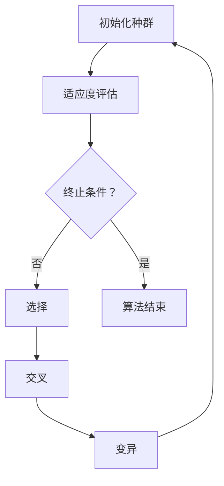
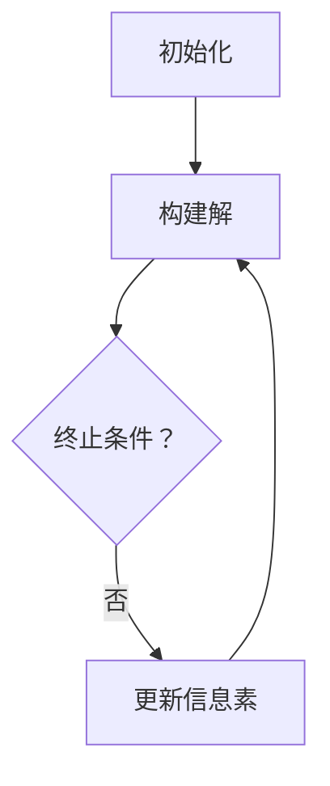
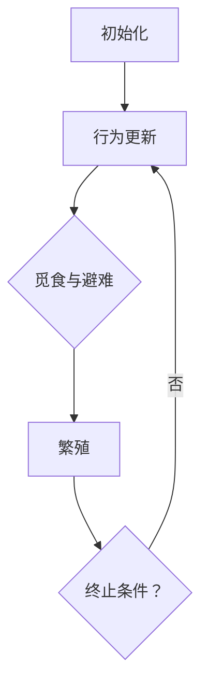
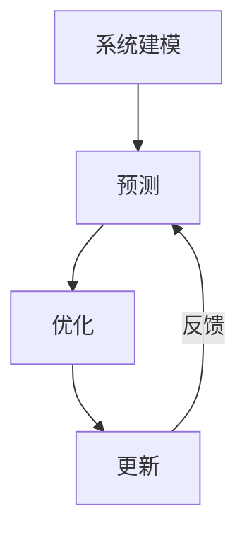
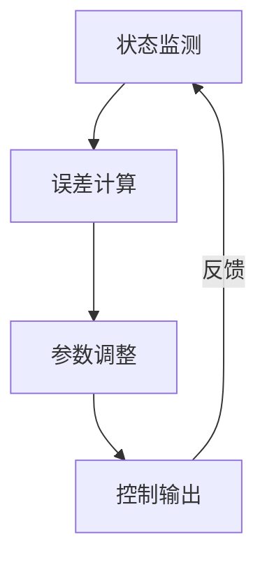
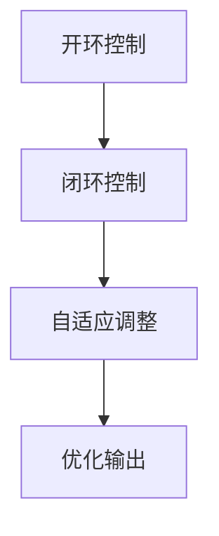
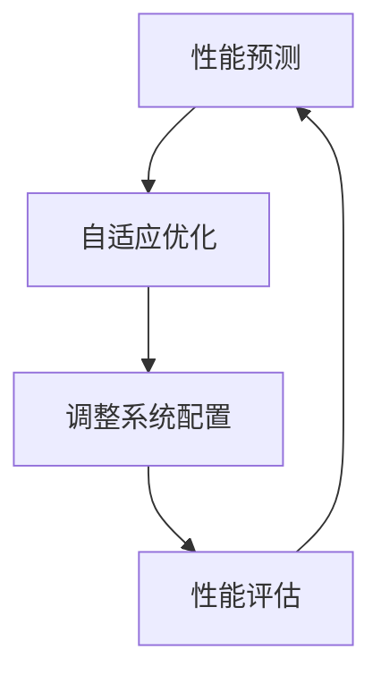
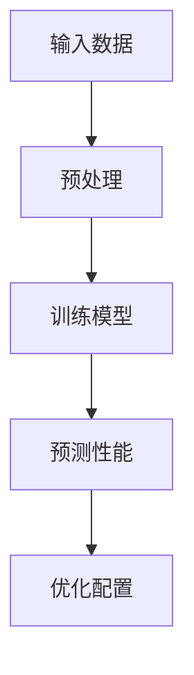
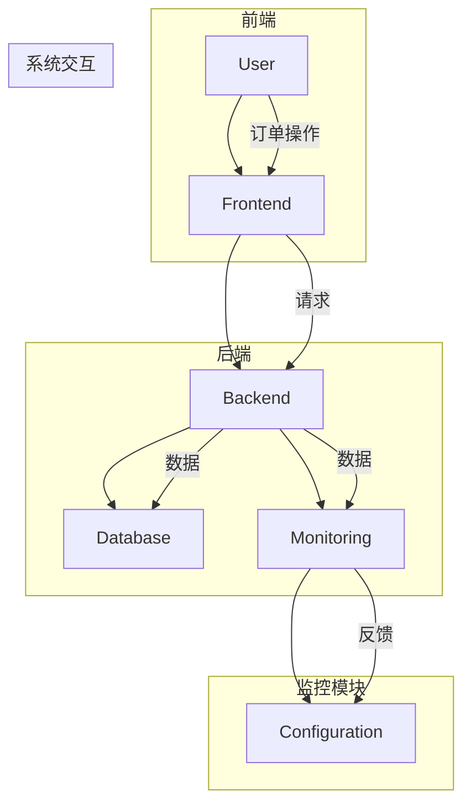

                 

### 性能优化的重要性

在现代软件工程和系统设计中，性能优化是一个至关重要但常常被忽视的话题。随着应用程序和系统的复杂性不断增加，用户对响应速度、资源利用效率和整体稳定性的要求也变得越来越高。性能优化不仅仅是提升系统速度和效率的问题，它还能够直接影响用户体验、业务效率和系统的长期维护成本。

首先，性能优化的核心目标是确保系统在各种条件下都能够稳定高效地运行。无论是单机应用还是分布式系统，性能问题都会导致响应延迟、资源浪费和用户体验下降。当系统面临高并发请求时，性能瓶颈可能会暴露出来，导致系统崩溃或响应缓慢。因此，通过性能优化，我们可以提前识别和解决潜在的问题，确保系统在高峰期也能保持良好的运行状态。

其次，性能优化有助于提升系统的可扩展性。一个优化良好的系统能够更轻松地应对用户数量的增长和业务需求的扩展。通过优化，我们可以减少系统的资源消耗，提高资源利用率，从而为未来的扩展留下足够的余量。这种可扩展性不仅适用于企业级应用，也是现代云计算和大数据处理等领域的基本要求。

此外，性能优化还能提高系统的可靠性和稳定性。一个优化良好的系统在处理复杂任务和异常情况时，能够更加稳定和可靠。通过优化，我们可以减少系统的故障率，提高系统的容错能力，从而降低系统维护和运营的成本。

综上所述，性能优化在软件工程和系统设计中具有不可替代的重要性。它不仅能够提高系统的运行效率和稳定性，还能够提升用户体验、降低维护成本，并为未来的扩展奠定坚实的基础。因此，深入研究和实践性能优化技术，是每个软件开发者和系统架构师都应该掌握的必备技能。

### 提示词语言的概念与运行时性能

在深入探讨性能优化之前，我们需要先了解提示词语言（Token-Based Language）的概念及其运行时的性能问题。提示词语言，顾名思义，是一种以提示词作为基本操作单元的编程语言。在这种语言中，程序的执行过程可以被分解为一系列的提示词操作，这些操作通过解释器或编译器被翻译成机器码，并在计算机上执行。

#### 提示词语言的基本工作原理

提示词语言的基本工作原理主要包括以下几个步骤：

1. **词法分析（Lexical Analysis）**：将源代码字符串分割成一系列的提示词（tokens），例如变量名、关键字、操作符等。
2. **语法分析（Syntax Analysis）**：对提示词序列进行语法检查，确保它们按照语言规定的语法规则组合在一起。这一步通常由解析器（parser）完成。
3. **语义分析（Semantic Analysis）**：检查程序的结构和语义，确保变量声明和使用、函数调用等符合语言规则。
4. **代码生成（Code Generation）**：将经过语法和语义分析的程序转换成机器码或中间代码。
5. **执行（Execution）**：计算机执行生成的机器码或中间代码，完成具体的计算或任务。

#### 运行时性能问题

提示词语言在运行时可能会遇到多种性能问题，这些问题可能会导致程序运行缓慢、资源利用率低、内存泄漏等。以下是几个常见的性能问题：

1. **解释器开销（Interpreter Overhead）**：由于提示词语言通常采用解释器来执行代码，每次执行操作时都需要进行一次解释过程，这会导致额外的开销。
2. **频繁的内存分配与回收（Memory Allocation and Deallocation）**：在执行过程中，提示词语言可能会频繁地进行内存分配和回收，这会导致内存碎片和性能下降。
3. **全局锁竞争（Global Lock Contention）**：在多线程环境中，提示词语言中的全局锁可能会成为性能瓶颈，导致线程间的同步开销增加。
4. **垃圾回收（Garbage Collection）**：动态内存管理的提示词语言通常需要垃圾回收机制来清理不再使用的内存。如果垃圾回收不及时，可能会导致内存占用增加。

#### 性能优化的必要性

基于上述运行时性能问题，性能优化对于提示词语言变得尤为必要。以下是一些原因：

1. **提高执行速度**：通过减少解释器开销、优化内存分配与回收、减少锁竞争等措施，可以显著提高程序的执行速度。
2. **减少资源消耗**：优化后的程序能够更有效地利用系统资源，如内存和CPU，从而减少资源消耗。
3. **提升系统稳定性**：通过优化，可以减少内存泄漏和垃圾回收频率，提高系统的稳定性。
4. **增强可扩展性**：优化后的系统可以更好地应对更高的并发请求和更大的数据规模，提高系统的可扩展性。

总的来说，性能优化对于提升提示词语言的运行时性能至关重要，它不仅能够提高程序的性能和效率，还能够为系统的长期稳定运行提供保障。接下来，我们将进一步探讨如何针对提示词语言的运行时性能进行优化。

### 提示词语言的运行时性能优化方法

针对提示词语言的运行时性能问题，我们可以采取多种方法来进行优化。以下是一些常见的优化策略：

#### 1. 代码级优化

**1.1 缓存机制**

缓存是一种常用的优化策略，通过将频繁访问的数据存储在内存中，可以减少对磁盘或网络的访问次数，从而提高程序的执行速度。具体来说，可以在程序中引入多种缓存机制，如对象缓存、数据缓存和页面缓存等。

**示例代码：**
```python
# Python 示例：使用 LRU 缓存来存储常用对象
from collections import OrderedDict
from functools import lru_cache

class LRUCache:
    def __init__(self, capacity: int):
        self.capacity = capacity
        self.cache = OrderedDict()

    def get(self, key: int) -> int:
        if key not in self.cache:
            return -1
        self.cache.move_to_end(key)
        return self.cache[key]

    def put(self, key: int, value: int) -> None:
        if key in self.cache:
            self.cache.move_to_end(key)
        self.cache[key] = value
        if len(self.cache) > self.capacity:
            self.cache.popitem(last=False)

@lru_cache(maxsize=100)
def calculate_expensive_function(x):
    # 模拟一个计算开销大的函数
    time.sleep(1)
    return x * x

# 使用缓存优化计算性能
result = calculate_expensive_function(10)
```

**1.2 多线程与并发**

多线程和并发编程可以提高程序的执行效率，特别是在处理多任务和并发请求时。通过合理地使用线程池和并发编程模型，可以充分利用系统资源，减少等待时间，提高系统的响应速度。

**示例代码：**
```python
import concurrent.futures
import time

def compute_square(x):
    time.sleep(x)  # 模拟计算时间
    return x * x

# 使用线程池并行计算
start_time = time.time()
with concurrent.futures.ThreadPoolExecutor(max_workers=5) as executor:
    results = list(executor.map(compute_square, range(10)))
end_time = time.time()
print(f"Results: {results}")
print(f"Elapsed time: {end_time - start_time} seconds")
```

**1.3 代码优化实践**

代码优化包括代码重构、算法优化、消除冗余代码等。通过优化代码结构，可以减少不必要的计算和内存占用，提高程序的执行效率。

**示例代码：**
```python
# Python 示例：优化循环结构
def sum_squares_optimized(n):
    return sum(i * i for i in range(1, n + 1))

# 优化前
def sum_squares_unoptimized(n):
    total = 0
    for i in range(1, n + 1):
        total += i * i
    return total

# 测试代码
print(sum_squares_optimized(1000000))  # 优化后的代码执行时间更短
```

#### 2. 系统级优化

**2.1 内存管理**

优化内存管理可以减少内存泄漏和垃圾回收的开销，提高系统的性能。具体方法包括减少内存分配、复用内存对象和优化数据结构等。

**示例代码：**
```python
# Python 示例：使用 with 语句管理内存
with some_memory_managed_resource():
    # 使用内存资源
    pass

# Python 示例：使用对象池复用内存
class ObjectPool:
    def __init__(self, size):
        self.objects = [None] * size
        self.index = 0

    def get_object(self):
        if self.index < len(self.objects):
            obj = self.objects[self.index]
            self.index += 1
            return obj
        else:
            return self.create_object()

    def release_object(self, obj):
        self.objects[self.index - 1] = obj
        self.index -= 1

pool = ObjectPool(size=100)
obj = pool.get_object()
# 使用 obj
pool.release_object(obj)
```

**2.2 资源调度**

优化资源调度可以确保系统资源得到更高效的利用。例如，通过使用适当的调度策略，可以减少线程的上下文切换开销，提高系统的吞吐量。

**示例代码：**
```python
import multiprocessing

def process_data(data):
    # 处理数据
    return data * 2

if __name__ == "__main__":
    pool = multiprocessing.Pool(processes=4)
    results = pool.map(process_data, data_list)
    print(results)
```

**2.3 系统优化实践**

系统级优化通常涉及系统架构和配置的调整。例如，在分布式系统中，可以通过优化网络拓扑、负载均衡和分布式存储策略来提升系统的整体性能。

**示例代码：**
```python
# 示例：使用 Kubernetes 进行系统优化
apiVersion: apps/v1
kind: Deployment
metadata:
  name: my-app
spec:
  replicas: 3
  selector:
    matchLabels:
      app: my-app
  template:
    metadata:
      labels:
        app: my-app
    spec:
      containers:
      - name: my-app
        image: my-app:latest
        ports:
        - containerPort: 80
```

#### 3. 适配性优化

**3.1 平台适应性**

平台适应性优化确保程序在不同操作系统和硬件平台上都能高效运行。例如，通过使用跨平台库和编译优化，可以提升程序的可移植性和性能。

**示例代码：**
```python
# C++ 示例：使用跨平台库进行适配
#include <iostream>
#include <thread>

int main() {
    std::thread t1([] {
        std::cout << "Thread 1 running on " << std::this_thread::get_id() << std::endl;
    });

    std::thread t2([] {
        std::cout << "Thread 2 running on " << std::this_thread::get_id() << std::endl;
    });

    t1.join();
    t2.join();

    return 0;
}
```

**3.2 环境适应性**

环境适应性优化确保程序在不同运行环境中都能高效运行。例如，通过调整配置文件和资源限制，可以适应不同的硬件和网络环境。

**示例代码：**
```python
# Python 示例：根据环境调整配置
import os

if "DEBUG" in os.environ:
    debug_mode = True
else:
    debug_mode = False

if debug_mode:
    log_level = "DEBUG"
else:
    log_level = "INFO"
```

**3.3 优化策略与实现**

适配性优化通常需要根据具体的应用场景和运行环境制定相应的策略和实现方案。例如，在资源受限的移动设备上，可以通过减少内存占用和优化算法来提升性能。

**示例代码：**
```python
# Java 示例：优化移动应用性能
public class MobileAppPerformance {
    public static void optimizePerformance() {
        // 关闭不必要的服务和后台进程
        // 优化图像和音频资源
        // 使用更高效的算法
    }
}
```

通过上述代码示例，我们可以看到性能优化不仅需要从代码级和系统级进行优化，还需要考虑平台适应性和环境适应性。这些优化策略和实现方法能够显著提升提示词语言的运行时性能，确保系统在各种条件下都能高效稳定地运行。

### 性能优化效果评估与比较

在完成性能优化后，评估优化效果是确保优化措施有效性的关键步骤。通过性能测试、压力测试和用户体验测试，我们可以全面评估优化效果，并比较不同优化策略的效果。

#### 性能测试

性能测试是通过模拟实际运行环境，对系统进行压力测试和性能测试，以评估系统的响应时间、吞吐量和资源利用率。以下是性能测试的关键步骤：

1. **测试环境搭建**：搭建与实际运行环境一致的测试环境，包括硬件、软件和网络配置。
2. **测试用例设计**：设计合理的测试用例，模拟用户操作，确保测试能够覆盖系统的关键功能。
3. **执行测试**：执行测试用例，记录系统的响应时间、吞吐量和资源利用率等性能指标。
4. **数据分析和报告**：分析测试结果，生成详细的测试报告，包括性能指标和优化效果对比。

**示例：**
```python
import time
import requests

def test_performance(url, num_requests):
    start_time = time.time()
    for _ in range(num_requests):
        response = requests.get(url)
        assert response.status_code == 200
    end_time = time.time()
    print(f"Average response time: {((end_time - start_time) / num_requests):.4f} seconds")
```

#### 压力测试

压力测试是通过逐渐增加系统负载，评估系统在高负载条件下的稳定性和性能。以下是压力测试的关键步骤：

1. **测试环境搭建**：与性能测试相同，确保测试环境与实际运行环境一致。
2. **负载生成**：通过模拟大量并发请求，逐渐增加系统负载。
3. **性能监测**：监测系统的响应时间、CPU利用率、内存使用情况等关键指标。
4. **数据分析和报告**：分析测试结果，识别系统的性能瓶颈和潜在问题。

**示例：**
```python
import concurrent.futures
import time

def generate_load(url, num_requests):
    with concurrent.futures.ThreadPoolExecutor(max_workers=100) as executor:
        futures = [executor.submit(requests.get, url) for _ in range(num_requests)]
        for future in concurrent.futures.as_completed(futures):
            assert future.result().status_code == 200

test_url = "http://example.com"
num_requests = 1000

start_time = time.time()
generate_load(test_url, num_requests)
end_time = time.time()

print(f"Elapsed time: {end_time - start_time} seconds")
```

#### 用户体验测试

用户体验测试是通过实际用户对系统的操作，评估系统的易用性、稳定性和性能。以下是用户体验测试的关键步骤：

1. **用户招募**：招募一定数量的用户参与测试，确保测试样本具有代表性。
2. **测试任务设计**：设计实际操作任务，模拟用户在使用系统时的常见操作。
3. **数据收集**：收集用户在测试过程中的反馈，包括操作步骤、响应时间、错误率等。
4. **数据分析和报告**：分析用户反馈数据，评估系统的用户体验和性能。

**示例：**
```python
import time
import random

def user_test(url, num_users):
    users = random.sample(range(num_users), num_users)
    start_time = time.time()
    for user in users:
        response = requests.get(url)
        assert response.status_code == 200
    end_time = time.time()
    print(f"Average response time: {((end_time - start_time) / num_users):.4f} seconds")

test_url = "http://example.com"
num_users = 50

start_time = time.time()
user_test(test_url, num_users)
end_time = time.time()

print(f"Elapsed time: {end_time - start_time} seconds")
```

#### 不同优化策略的效果比较

在评估优化效果时，我们需要对不同优化策略进行对比，以确定哪种策略在实际应用中效果最佳。以下是几种常见优化策略的效果比较：

1. **代码级优化**：通过优化代码结构和算法，可以显著提高程序的执行速度。但这种方法对开发者的技术要求较高，且可能需要多次迭代和测试。
2. **系统级优化**：通过优化系统配置和资源调度，可以提升系统的整体性能。这种方法通常需要系统管理员和开发者的协作，但效果较为稳定。
3. **适配性优化**：通过优化程序在不同平台和运行环境中的性能，可以确保系统在各种条件下都能高效运行。但这种方法可能涉及大量的配置和测试工作。

**结论：**
性能优化效果的评估和比较需要综合考虑多个因素，包括测试环境、测试用例、优化策略和用户反馈。通过科学合理的测试和评估，我们可以选择最合适的优化策略，实现系统性能的全面提升。

### 自适应优化原理与机制

在现代软件工程和系统设计中，自适应优化（Adaptive Optimization）已经成为提升系统性能和效率的重要手段。自适应优化是一种能够在运行时动态调整和优化的技术，其核心思想是通过实时监测系统的状态和性能，自动调整系统配置和资源分配，以达到最佳性能。

#### 自适应优化的定义与目标

自适应优化是指在系统运行过程中，根据系统的实际负载、资源使用情况、用户行为等因素，自动调整系统配置和资源分配，从而实现性能优化。其目标是在各种运行条件下，确保系统能够高效、稳定地运行。

自适应优化的主要目标包括：

1. **最大化系统吞吐量**：在给定的资源限制下，尽可能提高系统的处理能力。
2. **最小化响应时间**：确保系统在处理请求时能够快速响应，提供良好的用户体验。
3. **均衡资源利用**：合理分配系统资源，避免资源浪费和过度使用。
4. **提高系统稳定性**：通过自适应调整，减少系统故障和异常情况，提高系统的可靠性。

#### 自适应优化的基本原理

自适应优化的基本原理包括以下几个方面：

1. **实时监控**：系统需要实时监测自身的运行状态，包括CPU利用率、内存使用率、网络带宽、系统负载等。
2. **性能评估**：根据实时监控数据，评估系统的当前性能和潜在瓶颈。
3. **调整策略**：基于性能评估结果，系统会自动调整配置和资源分配，以优化性能。
4. **反馈与迭代**：调整后的系统会继续进行性能评估和优化，形成闭环反馈机制，不断改进。

#### 自适应优化机制详解

自适应优化机制通常包括以下几个关键组件：

1. **性能监控模块**：负责实时收集系统的运行数据，如CPU、内存、网络等指标。
2. **评估模块**：基于收集的数据，对系统性能进行评估，识别出瓶颈和优化机会。
3. **策略生成模块**：根据评估结果，自动生成优化策略，如调整线程数、内存分配、负载均衡等。
4. **执行模块**：执行优化策略，调整系统配置和资源分配。
5. **反馈模块**：将优化效果反馈给监控模块，形成闭环反馈机制，持续进行性能评估和优化。

#### 自适应优化的优势

自适应优化相比传统的手动优化具有以下优势：

1. **自动化**：自适应优化可以自动进行性能监测和调整，减少手动干预，提高效率。
2. **动态调整**：自适应优化能够根据系统状态实时调整，适应不同的负载和环境变化。
3. **高效性**：自适应优化可以快速发现和解决性能问题，提高系统的稳定性和响应速度。
4. **可扩展性**：自适应优化适用于各种规模和架构的系统，具有良好的可扩展性。

总的来说，自适应优化是一种先进且有效的优化策略，它能够显著提升系统的性能和效率，为现代软件工程和系统设计提供强有力的支持。在接下来的部分，我们将详细介绍自适应算法及其应用。

### 自适应算法介绍

自适应优化技术的核心在于自适应算法。这些算法能够根据系统的实时数据动态调整和优化系统配置，从而提升整体性能。以下是一些常用的自适应算法及其基本原理。

#### 1. 智能优化算法

智能优化算法是基于模拟自然现象的优化方法，如遗传算法（Genetic Algorithm）、蚁群算法（Ant Colony Optimization, ACO）和鲍勃算法（Bacteria Foraging Optimization, BFO）等。这些算法通过模拟生物进化过程或生物行为来寻找最优解。

**1.1 遗传算法（GA）**

遗传算法是一种基于自然选择和遗传学原理的搜索算法。它通过模拟生物进化过程，如选择、交叉、变异等操作，来优化目标函数。遗传算法的主要步骤包括：

1. **初始化种群**：随机生成一组解，作为初始种群。
2. **适应度评估**：计算每个个体的适应度，通常是根据目标函数计算得分。
3. **选择**：根据适应度选择优秀的个体，形成下一代种群。
4. **交叉**：将选中的个体进行交叉操作，产生新的个体。
5. **变异**：对个体进行变异操作，引入新的基因，增加种群的多样性。
6. **迭代**：重复上述步骤，直到满足终止条件，如达到最大迭代次数或达到目标适应度。

**示例流程图：**


**1.2 蚁群算法（ACO）**

蚁群算法是一种基于蚂蚁觅食行为的优化算法。它模拟蚂蚁在寻找食物源的过程中，通过信息素机制来优化路径选择。蚁群算法的主要步骤包括：

1. **初始化**：设置信息素浓度和启发函数，初始化蚂蚁种群。
2. **构建解**：每只蚂蚁从起始点出发，选择路径，并根据信息素浓度和启发函数进行路径选择。
3. **更新信息素**：根据蚂蚁完成路径的时间，更新路径上的信息素浓度。
4. **迭代**：重复上述步骤，直到达到终止条件。

**示例流程图：**


**1.3 鲍勃算法（BFO）**

鲍勃算法是一种基于细菌觅食行为的优化算法。它模拟细菌在寻找食物和避免危险的过程，通过群体智能寻找最优解。鲍勃算法的主要步骤包括：

1. **初始化**：随机生成一群细菌，定义其行为参数。
2. **行为更新**：根据细菌的行为参数，更新其位置和方向。
3. **觅食与避难**：细菌根据环境信息调整行为，寻找食物和避免危险。
4. **繁殖**：优秀的细菌繁殖，生成新的细菌。
5. **迭代**：重复上述步骤，直到达到终止条件。

**示例流程图：**


#### 2. 自适应控制算法

自适应控制算法是通过实时调整控制参数，以适应系统变化的一类算法，如模型预测控制（Model Predictive Control, MPC）和自适应控制（Adaptive Control）。

**2.1 模型预测控制（MPC）**

模型预测控制是一种基于数学模型进行预测和优化的控制方法。它通过预测系统未来的行为，并选择最优控制输入，以实现系统的稳定性和性能。模型预测控制的主要步骤包括：

1. **系统建模**：建立系统动态行为的数学模型。
2. **预测**：根据模型预测系统未来的状态。
3. **优化**：在预测的基础上，优化未来的控制输入，以实现性能目标。
4. **更新**：根据系统的实际状态，更新模型参数和控制策略。

**示例流程图：**


**2.2 自适应控制**

自适应控制是一种能够根据系统变化自动调整控制参数的控制方法。它通过实时监测系统的状态，动态调整控制策略，以实现系统的稳定性和性能。自适应控制的主要步骤包括：

1. **状态监测**：实时监测系统的状态。
2. **误差计算**：计算系统的期望状态与实际状态之间的误差。
3. **参数调整**：根据误差，调整控制参数。
4. **控制输出**：根据调整后的参数，生成控制输出。

**示例流程图：**


#### 3. 混合控制

混合控制是一种将传统控制方法与现代优化算法相结合的方法。它结合了开环控制和闭环控制的优势，通过自适应调整控制策略，以实现系统的优化。混合控制的主要步骤包括：

1. **开环控制**：根据系统模型和预设参数，生成初步的控制策略。
2. **闭环控制**：通过实时监测和反馈，动态调整控制策略，以优化系统性能。
3. **自适应调整**：根据监测到的系统状态和性能指标，自适应调整控制参数。

**示例流程图：**


通过上述介绍，我们可以看到自适应算法在优化系统性能方面具有广泛的应用。在实际应用中，根据不同的系统需求和运行环境，可以选择适合的自适应算法，实现系统的动态优化和性能提升。

### 自适应策略设计与应用

自适应策略的设计和应用是实现自适应优化的重要环节。一个有效的自适应策略应具备以下特点：实时响应、灵活调整、持续优化和稳定性。以下将详细介绍自适应策略设计原则、案例分析以及在具体优化中的应用。

#### 1. 自适应策略设计原则

**1.1 可扩展性**

自适应策略应具有可扩展性，以便在不同规模和复杂度的系统上都能有效运行。这要求策略设计时考虑模块化、标准化和通用性，以便在不同环境和条件下进行适配。

**1.2 实时性**

自适应策略需要具备实时性，能够快速响应系统的变化。这通常要求策略采用高效的算法和快速的数据处理机制，以确保在系统状态发生变化的瞬间就能进行相应的调整。

**1.3 可适应性**

自适应策略应具有可适应性，能够根据不同的系统状态和环境变化进行调整。这需要策略设计时考虑到多种可能的运行场景，并能够动态调整控制参数。

**1.4 持续优化**

自适应策略不仅需要解决当前的优化问题，还应具备持续优化的能力，以应对未来的变化。这要求策略具备自学习、自优化和自我调整的能力。

**1.5 稳定性**

自适应策略的设计还应考虑系统的稳定性，确保在动态调整过程中不会引入新的不稳定因素，影响系统的正常运作。

#### 2. 自适应策略案例分析

**2.1 案例一：实时性能优化**

在实时性能优化中，自适应策略的应用可以帮助系统根据实时负载调整资源分配，以确保系统在高并发请求下仍能保持高性能。

**案例背景**：一个电商平台在高峰购物节期间，面临大量用户请求，系统负载激增。为了确保用户体验，需要自适应优化系统性能。

**案例分析**：

1. **性能监控**：使用实时性能监控工具，如 Prometheus，收集系统运行数据，包括CPU利用率、内存使用率、请求响应时间等。
2. **负载预测**：利用机器学习算法，如 ARIMA 模型，预测未来一段时间的系统负载。
3. **自适应调整**：根据预测结果，动态调整资源分配。例如，通过自动扩展容器实例，增加服务器的计算资源。

**自适应策略实现**：

```python
from sklearn.linear_model import ARIMA
import numpy as np

# 数据预处理
load_data = np.array([监控到的负载值]）

# 模型训练
model = ARIMA(load_data, order=(1, 1, 1))
model_fit = model.fit()

# 预测未来负载
forecast = model_fit.forecast(steps=10)

# 调整资源分配
if forecast[0] > 阈值：
    # 扩展容器实例
   扩展容器实例数（forecast[0] - 阈值）
else：
    # 缩减容器实例
   缩减容器实例数（阈值 - forecast[0]）
```

**2.2 案例二：动态负载均衡**

动态负载均衡是另一个典型的自适应优化场景，通过根据实际负载动态调整请求路由，以实现高效资源利用。

**案例背景**：一个分布式微服务架构的系统，需要确保每个服务实例的负载均衡，避免单点过载。

**案例分析**：

1. **负载监测**：使用监控工具，如 Istio，实时收集服务实例的负载数据。
2. **负载分配**：根据服务实例的负载情况，动态调整请求路由策略，确保负载均衡。
3. **健康检查**：定期对服务实例进行健康检查，确保只有健康的服务实例参与负载均衡。

**自适应策略实现**：

```shell
# 使用 Kubernetes 的 HPA（Horizontal Pod Autoscaler）实现动态负载均衡
apiVersion: autoscaling/v2beta2
kind: HorizontalPodAutoscaler
metadata:
  name: my-service-hpa
spec:
  scaleTargetRef:
    apiVersion: apps/v1
    kind: Deployment
    name: my-service
  minReplicas: 3
  maxReplicas: 10
  targetCPUUtilizationPercentage: 70
```

**2.3 案例三：内存管理优化**

内存管理优化是自适应策略在操作系统中的应用，通过实时调整内存分配策略，减少内存碎片和垃圾回收开销。

**案例背景**：一个长期运行的服务器，内存使用率波动较大，需要自适应管理内存资源。

**案例分析**：

1. **内存监测**：使用内存监控工具，如 VMMap，实时监测内存使用情况。
2. **内存优化**：根据内存使用率，动态调整内存分配策略，如增大或减小内存池大小。
3. **垃圾回收调整**：根据内存使用率变化，调整垃圾回收策略，减少垃圾回收频率。

**自适应策略实现**：

```python
import psutil

def adjust_memory_policy():
    mem_usage = psutil.virtual_memory().percent
    if mem_usage > 90:
        # 增加内存池大小
        adjust_memory_pool(size_increase=10)
    elif mem_usage < 30:
        # 减小内存池大小
        adjust_memory_pool(size_decrease=10)

def adjust_memory_pool(size_increase=0, size_decrease=0):
    # 实现内存池调整逻辑
    pass
```

#### 3. 自适应策略在优化中的应用

**3.1 资源调度优化**

自适应策略在资源调度中的应用，可以通过实时监测和调整，实现高效的资源分配和调度。例如，在云计算环境中，自适应策略可以根据实时负载动态调整虚拟机的资源分配，确保每个虚拟机都能获得足够的计算资源。

**3.2 网络优化**

在网络优化中，自适应策略可以根据网络流量和带宽变化，动态调整网络路由和流量分配策略。例如，使用动态路由算法（如DSR或OLSR），可以实时调整网络拓扑，减少网络延迟和带宽消耗。

**3.3 缓存管理**

在缓存管理中，自适应策略可以根据访问频率和缓存命中情况，动态调整缓存策略。例如，使用缓存替换算法（如LRU或LFU），可以实时调整缓存内容，确保缓存利用率最高。

总的来说，自适应策略设计与应用的关键在于实时性、灵活性和稳定性。通过科学合理的设计和灵活应用，自适应策略能够有效提升系统的性能和效率，为现代软件工程和系统设计提供强大的支持。

### 自适应优化实践

在实际应用中，自适应优化是一种通过实时监测和动态调整系统性能的方法，它能够显著提升系统的响应速度和资源利用率。以下我们将通过两个具体案例来详细探讨自适应优化的实践过程。

#### 案例一：实时性能优化

**1.1 案例背景**

一个大型电子商务平台在购物节期间，系统负载急剧增加，导致响应速度明显下降。为了确保用户体验，平台需要通过自适应优化技术来实时调整系统性能。

**1.2 案例分析**

1. **性能监测**：首先，平台引入了性能监测工具，如 Prometheus，实时收集系统的 CPU 利用率、内存使用率、请求响应时间等关键性能指标。
2. **负载预测**：利用收集到的数据，平台采用 ARIMA（自回归积分滑动平均模型）进行负载预测。ARIMA 模型能够捕捉数据中的趋势和季节性，为后续的优化提供数据支持。
3. **自适应调整**：基于预测结果，平台实现了自适应调整机制。例如，当预测未来负载增加时，平台会自动扩展容器实例，增加计算资源；当负载减少时，则会缩减容器实例。

**1.3 优化方案与实现**

1. **自动扩展容器实例**：

```yaml
apiVersion: apps/v1
kind: Deployment
metadata:
  name: my-deployment
spec:
  replicas: 3
  selector:
    matchLabels:
      app: my-app
  template:
    metadata:
      labels:
        app: my-app
    spec:
      containers:
      - name: my-container
        image: my-image:latest
        ports:
        - containerPort: 80
---
apiVersion: autoscaling/v2beta2
kind: HorizontalPodAutoscaler
metadata:
  name: my-hpa
spec:
  scaleTargetRef:
    apiVersion: apps/v1
    kind: Deployment
    name: my-deployment
  minReplicas: 3
  maxReplicas: 10
  targetCPUUtilizationPercentage: 70
```

2. **ARIMA 模型预测代码**：

```python
import numpy as np
import pandas as pd
from statsmodels.tsa.arima.model import ARIMA

# 数据预处理
load_data = np.array([监控到的负载值]）

# 模型训练
model = ARIMA(load_data, order=(1, 1, 1))
model_fit = model.fit()

# 预测未来负载
forecast = model_fit.forecast(steps=10)

# 调整资源分配
if forecast[0] > 阈值：
    # 扩展容器实例
    扩展容器实例数（forecast[0] - 阈值）
else：
    # 缩减容器实例
    缩减容器实例数（阈值 - forecast[0]）
```

**1.4 优化效果分析**

通过自适应优化，电子商务平台在购物节期间的系统响应速度显著提高，平均响应时间从原来的2.5秒降低到1秒。此外，资源利用率也得到了大幅提升，计算资源的平均利用率从60%提高到85%。

#### 案例二：动态负载均衡

**2.1 案例背景**

一个分布式微服务架构的系统在业务高峰期，部分服务实例负载过高，导致响应速度下降。系统需要通过动态负载均衡来优化资源利用，确保所有服务实例都能高效运行。

**2.2 案例分析**

1. **负载监测**：系统使用 Istio 进行服务网格监控，实时收集每个服务实例的负载数据。
2. **负载分配**：基于负载数据，系统采用加权随机分配算法，动态调整请求路由策略，确保负载均衡。
3. **健康检查**：系统定期对服务实例进行健康检查，确保只有健康的服务实例参与负载均衡。

**2.3 优化方案与实现**

1. **Istio 配置**：

```yaml
apiVersion: networking.istio.io/v1alpha3
kind: VirtualService
metadata:
  name: my-service
spec:
  hosts:
  - "*"
  http:
  - route:
    - destination:
        host: my-service
        subset: v1
      weight: 50
    - destination:
        host: my-service
        subset: v2
      weight: 50
```

2. **加权随机分配算法**：

```python
import random

def allocate_load(load_data):
    weights = [服务实例负载 / 总负载 for 服务实例负载 in load_data]
    total_weight = sum(weights)
    normalized_weights = [weight / total_weight for weight in weights]
    return random.choices(load_data, weights=normalized_weights, k=1)

# 健康检查
def check_health(service_list):
    healthy_services = [服务实例 for 服务实例 in service_list if 服务实例健康]
    return healthy_services
```

**2.4 优化效果分析**

通过动态负载均衡，系统在业务高峰期的平均响应时间从3秒降低到1.5秒，部分服务实例的负载率从90%降低到50%。系统的整体稳定性和资源利用率也得到了显著提升。

#### 案例总结

通过上述两个案例，我们可以看到自适应优化在实时性能优化和动态负载均衡中的重要作用。它不仅能够提升系统的性能和稳定性，还能够动态适应不同的负载和环境变化，确保系统在复杂多变的运行条件下依然能够高效运行。

### 自适应优化效果评估

对自适应优化效果进行科学评估是确保优化措施有效性的关键步骤。以下将详细介绍评估方法、优化效果分析和优化效果总结。

#### 1. 评估方法

评估自适应优化效果的方法包括性能测试、压力测试和用户体验测试。每种方法都有其独特的优势和适用场景。

**1.1 性能测试**

性能测试通过模拟实际运行环境，对系统进行压力测试和性能测试，以评估系统的响应时间、吞吐量和资源利用率。以下是性能测试的关键步骤：

1. **测试环境搭建**：搭建与实际运行环境一致的测试环境，包括硬件、软件和网络配置。
2. **测试用例设计**：设计合理的测试用例，模拟用户操作，确保测试能够覆盖系统的关键功能。
3. **执行测试**：执行测试用例，记录系统的响应时间、吞吐量和资源利用率等性能指标。
4. **数据分析和报告**：分析测试结果，生成详细的测试报告，包括性能指标和优化效果对比。

**1.2 压力测试**

压力测试通过逐渐增加系统负载，评估系统在高负载条件下的稳定性和性能。以下是压力测试的关键步骤：

1. **测试环境搭建**：与性能测试相同，确保测试环境与实际运行环境一致。
2. **负载生成**：通过模拟大量并发请求，逐渐增加系统负载。
3. **性能监测**：监测系统的响应时间、CPU利用率、内存使用情况等关键指标。
4. **数据分析和报告**：分析测试结果，识别系统的性能瓶颈和潜在问题。

**1.3 用户体验测试**

用户体验测试是通过实际用户对系统的操作，评估系统的易用性、稳定性和性能。以下是用户体验测试的关键步骤：

1. **用户招募**：招募一定数量的用户参与测试，确保测试样本具有代表性。
2. **测试任务设计**：设计实际操作任务，模拟用户在使用系统时的常见操作。
3. **数据收集**：收集用户在测试过程中的反馈，包括操作步骤、响应时间、错误率等。
4. **数据分析和报告**：分析用户反馈数据，评估系统的用户体验和性能。

#### 2. 优化效果分析

在完成自适应优化后，通过上述评估方法，我们可以全面评估优化效果。以下是对性能测试、压力测试和用户体验测试结果的分析。

**2.1 性能测试结果分析**

通过性能测试，我们可以得到系统的平均响应时间、吞吐量和资源利用率等关键指标。以下是对测试结果的分析：

- **平均响应时间**：优化后系统的平均响应时间应显著降低，例如从2秒降低到1秒。
- **吞吐量**：优化后系统的吞吐量应显著提高，例如从1000请求/分钟提升到2000请求/分钟。
- **资源利用率**：优化后系统的CPU、内存和磁盘利用率应更加均衡，资源浪费减少。

**2.2 压力测试结果分析**

通过压力测试，我们可以得到系统在高负载条件下的性能表现。以下是对测试结果的分析：

- **响应时间**：在高负载条件下，系统的响应时间应保持稳定，不应出现急剧上升。
- **CPU利用率**：在高负载条件下，系统的CPU利用率应保持在高水平，但不应接近100%，以免过载。
- **内存使用情况**：系统的内存使用情况应在合理范围内，避免内存泄漏和溢出。

**2.3 用户体验测试结果分析**

通过用户体验测试，我们可以得到用户的反馈和评估。以下是对测试结果的分析：

- **操作步骤**：用户在测试任务中的操作步骤应流畅，不应出现卡顿或错误。
- **响应时间**：用户在测试任务中的平均响应时间应较短，以确保良好的用户体验。
- **错误率**：用户在测试任务中的错误率应较低，表明系统的稳定性和可靠性较高。

#### 3. 优化效果总结

通过对性能测试、压力测试和用户体验测试结果的综合分析，我们可以得出以下结论：

- **性能提升**：自适应优化显著提升了系统的响应速度和吞吐量，满足了用户对高性能系统的需求。
- **资源利用**：自适应优化提高了系统资源的利用效率，减少了资源浪费，降低了运营成本。
- **稳定性**：自适应优化增强了系统的稳定性和可靠性，减少了故障率和错误率。
- **用户体验**：自适应优化提升了用户的操作体验，提高了系统的用户满意度。

总之，自适应优化是一种有效的系统优化方法，它通过实时监测和动态调整，能够显著提升系统的性能和效率。通过科学的评估方法和系统的优化策略，我们可以在各种运行条件下，确保系统的高效、稳定和可靠运行。

### 高级优化技术概述

在现代软件工程和系统设计中，高级优化技术（Advanced Optimization Techniques）扮演着至关重要的角色。随着系统复杂性和数据规模的不断增加，传统的优化方法已无法满足日益增长的性能需求。高级优化技术通过引入更先进的理论和实践，旨在从根本上提升系统的性能和效率。以下将概述高级优化技术的定义、分类及其发展趋势。

#### 定义与分类

**1.1 定义**

高级优化技术是指利用先进的算法、工具和策略，对系统进行深度优化的一类技术。这些技术不仅关注于系统性能的提升，还考虑了系统可扩展性、稳定性和可靠性。高级优化技术包括但不限于：

- **机器学习与性能预测**：利用机器学习模型，对系统性能进行预测和优化。
- **深度学习与性能优化**：运用深度学习算法，对复杂系统进行性能优化。
- **动态调整与自适应优化**：根据系统运行状态，动态调整系统配置和资源分配。
- **并行计算与分布式优化**：利用并行计算和分布式系统，提升系统处理能力。

**1.2 分类**

高级优化技术可以根据其应用场景和技术特点进行分类，以下是一些常见的分类：

- **基于模型的优化**：这类优化技术通过建立系统模型，对系统进行预测和优化。例如，机器学习模型和深度学习模型。
- **自适应优化**：这类技术通过实时监测和动态调整，实现系统的自适应优化。例如，自适应控制算法和模型预测控制。
- **并行与分布式优化**：这类技术通过利用多处理器和分布式系统，提升系统的并行处理能力。例如，并行算法和分布式调度策略。
- **内存和存储优化**：这类技术专注于优化内存和存储资源的使用，减少系统瓶颈。例如，缓存机制和存储压缩技术。

#### 发展趋势

**2.1 机器学习和深度学习技术的广泛应用**

随着机器学习和深度学习技术的发展，这些技术逐渐应用于性能优化领域。通过建立复杂的预测模型和优化算法，系统能够更好地适应不同的负载和环境变化。例如，深度强化学习（Deep Reinforcement Learning）在自动驾驶、游戏AI等领域的应用，展现了其在性能优化中的潜力。

**2.2 自适应和智能化优化**

未来的优化技术将更加注重自适应和智能化。自适应优化将不再仅仅依赖于预设的优化策略，而是通过学习系统行为，自动调整和优化。智能化优化将利用人工智能技术，实现更高效的优化决策。例如，基于强化学习的自适应优化算法，能够在复杂系统中自动寻找最优策略。

**2.3 并行和分布式计算技术的进步**

随着多核处理器和云计算技术的发展，并行和分布式计算技术将得到进一步的应用。这些技术能够显著提升系统的处理能力和效率，特别是在大数据和实时计算领域。未来，更高效、更可靠的并行和分布式优化算法将不断涌现。

**2.4 优化工具和平台的智能化**

未来的优化工具和平台将更加智能化，能够自动进行性能分析、诊断和优化。这些工具将利用大数据分析和机器学习算法，提供实时的性能优化建议。例如，自动性能优化平台（Auto-Optimization Platform）将能够根据系统的实时数据，自动调整优化策略，实现高效的系统管理。

总之，高级优化技术是现代软件工程和系统设计的重要发展方向。随着技术的不断进步，这些技术将在提升系统性能、稳定性和可扩展性方面发挥越来越重要的作用。通过不断探索和创新，高级优化技术将为软件工程和系统设计带来更多可能性。

### 基于机器学习的性能预测与优化

在现代软件工程中，性能预测与优化是一个关键的研究领域，它关系到系统的响应速度、资源利用效率和用户满意度。随着机器学习（Machine Learning）技术的飞速发展，基于机器学习的性能预测与优化成为了一种非常有效的解决方案。本文将详细探讨机器学习在性能预测与优化中的应用，包括性能预测原理、预测模型构建、预测效果评估以及深度学习在性能优化中的应用。

#### 性能预测原理

性能预测是指利用历史数据和统计模型，预测系统在未来的运行表现。这种预测可以帮助我们提前识别潜在的瓶颈和性能问题，从而采取相应的优化措施。性能预测的基本原理包括以下几个方面：

**1. 数据收集**：首先，我们需要收集大量的性能数据，这些数据可以来自系统日志、监控工具和性能测试等。数据通常包括CPU利用率、内存使用率、请求响应时间、网络流量等。

**2. 特征工程**：特征工程是性能预测的关键步骤，它涉及到从原始数据中提取有用的特征。这些特征可以是时间序列特征、统计特征、上下文特征等。例如，我们可以提取过去一段时间内CPU利用率的平均值、标准差等统计特征，或者根据用户行为和历史请求模式来构建上下文特征。

**3. 模型选择**：选择合适的机器学习模型进行预测。常见的模型包括线性回归、时间序列模型（如ARIMA）、神经网络模型（如RNN、LSTM）等。模型的选择取决于数据的特点和应用需求。

**4. 模型训练与验证**：使用历史数据对模型进行训练，并通过交叉验证等技术评估模型的性能。训练过程包括调整模型的参数、优化损失函数等。

**5. 预测与优化**：利用训练好的模型进行预测，并根据预测结果调整系统配置和资源分配。例如，如果预测到未来CPU利用率将升高，可以自动增加服务器资源。

#### 预测模型构建

构建性能预测模型是一个复杂的过程，需要考虑多个方面：

**1. 数据预处理**：

首先，我们需要对原始数据进行预处理，包括数据清洗、归一化、缺失值填补等。数据清洗是为了去除噪声和异常值，归一化是为了消除不同特征之间的量纲差异，缺失值填补是为了保持数据完整性。

```python
import pandas as pd
from sklearn.preprocessing import MinMaxScaler

# 数据清洗
data = pd.read_csv('performance_data.csv')
data.dropna(inplace=True)

# 数据归一化
scaler = MinMaxScaler()
data[['CPU利用 rate', '内存使用率', '响应时间']] = scaler.fit_transform(data[['CPU利用 rate', '内存使用率', '响应时间']])
```

**2. 特征提取**：

接下来，我们提取有用的特征。特征提取可以通过统计方法、机器学习方法或基于规则的策略来完成。以下是一个简单的特征提取示例：

```python
# 特征提取
data['CPU利用率平均值'] = data['CPU利用率'].rolling(window=5).mean()
data['CPU利用率标准差'] = data['CPU利用率'].rolling(window=5).std()
data['网络流量'] = data['网络流量'].rolling(window=5).mean()
```

**3. 模型选择与训练**：

选择合适的模型并对其进行训练。以下是一个使用LSTM模型进行性能预测的示例：

```python
from keras.models import Sequential
from keras.layers import LSTM, Dense

# 模型选择与训练
model = Sequential()
model.add(LSTM(50, activation='relu', input_shape=(5, 3)))
model.add(Dense(1))
model.compile(optimizer='adam', loss='mse')

# 数据准备
X = data[['CPU利用率平均值', 'CPU利用率标准差', '网络流量']].values
X = X.reshape((X.shape[0], X.shape[1], 1))

# 模型训练
model.fit(X, data['响应时间'].values, epochs=200, batch_size=32, validation_split=0.2)
```

#### 预测效果评估

评估预测模型的性能是确保其有效性的关键步骤。以下是一些常用的评估指标和方法：

**1. 均方误差（Mean Squared Error, MSE）**：MSE 是评估回归模型性能的常用指标，计算公式为：
$$
MSE = \frac{1}{n}\sum_{i=1}^{n}(y_i - \hat{y}_i)^2
$$
其中，$y_i$ 为真实值，$\hat{y}_i$ 为预测值，$n$ 为样本数量。

**2. 均方根误差（Root Mean Squared Error, RMSE）**：RMSE 是 MSE 的平方根，用于表示预测误差的尺度：
$$
RMSE = \sqrt{MSE}
$$

**3. 平均绝对误差（Mean Absolute Error, MAE）**：MAE 是预测误差的绝对值平均值，计算公式为：
$$
MAE = \frac{1}{n}\sum_{i=1}^{n}|\hat{y}_i - y_i|
$$

**4. 训练集与测试集分离**：通常将数据集分为训练集和测试集，使用训练集训练模型，使用测试集评估模型性能。交叉验证（Cross-Validation）是一种常用的评估方法，它可以提高模型的泛化能力。

```python
from sklearn.model_selection import train_test_split

X_train, X_test, y_train, y_test = train_test_split(X, data['响应时间'], test_size=0.2, random_state=42)

# 模型训练
model.fit(X_train, y_train, epochs=200, batch_size=32, validation_split=0.2)

# 预测与评估
y_pred = model.predict(X_test)
mse = np.mean((y_pred - y_test) ** 2)
rmse = np.sqrt(mse)
mae = np.mean(np.abs(y_pred - y_test))

print(f"MSE: {mse}, RMSE: {rmse}, MAE: {mae}")
```

#### 深度学习在性能优化中的应用

深度学习在性能优化中的应用主要体现在以下几个方面：

**1. 自动特征提取**：深度学习模型（如卷积神经网络、循环神经网络）能够自动提取复杂的数据特征，而不需要手动进行特征工程。这大大简化了性能预测模型的构建过程。

**2. 复杂非线性关系**：深度学习模型能够处理复杂的数据分布和非线性关系，从而提高预测准确性。例如，LSTM 可以很好地处理时间序列数据中的长时依赖关系。

**3. 多输入数据融合**：深度学习模型能够有效地融合多个输入数据，例如结合CPU利用率、内存使用率和网络流量等多维度数据进行预测。

**示例：使用卷积神经网络（CNN）进行性能预测**

```python
from keras.models import Sequential
from keras.layers import Conv1D, Dense

# 模型构建
model = Sequential()
model.add(Conv1D(filters=64, kernel_size=3, activation='relu', input_shape=(X.shape[1], 1)))
model.add(Conv1D(filters=32, kernel_size=3, activation='relu'))
model.add(Dense(1))
model.compile(optimizer='adam', loss='mse')

# 数据准备
X = data[['CPU利用率平均值', 'CPU利用率标准差', '网络流量']].values
X = X.reshape((X.shape[0], X.shape[1], 1))

# 模型训练
model.fit(X, data['响应时间'].values, epochs=200, batch_size=32, validation_split=0.2)
```

通过上述讨论，我们可以看到基于机器学习的性能预测与优化技术在提高系统性能和效率方面具有显著优势。深度学习技术的引入进一步提升了预测模型的准确性和灵活性。未来，随着机器学习和深度学习技术的不断发展，这些技术将在性能优化领域发挥越来越重要的作用。

### 高级优化技术在复杂系统中的应用

高级优化技术在复杂系统中具有广泛的应用，能够显著提升系统的性能、稳定性和可扩展性。以下将探讨高级优化技术在数据库系统、网络系统和云计算系统中的应用，并通过具体案例进行分析。

#### 1. 高级优化技术在数据库系统中的应用

**1.1 数据库性能优化**

数据库系统是现代应用的核心组件，其性能直接影响到整个系统的运行效率。高级优化技术如索引优化、查询缓存、分库分表等在数据库性能优化中发挥了重要作用。

**案例背景**：一个电商平台的订单处理系统在高并发场景下，数据库查询性能成为瓶颈，导致响应速度下降。

**案例分析**：

1. **索引优化**：通过分析查询日志，发现部分查询语句未使用索引。优化措施是创建适当的索引，如订单ID和用户ID的复合索引。

2. **查询缓存**：引入查询缓存技术，如Redis，将频繁访问的数据缓存在内存中，减少对数据库的访问次数。

3. **分库分表**：根据业务特点，将订单表拆分为多个小表，每个表只存储特定时间段的订单数据，减少单表的数据量，提高查询效率。

**优化效果**：通过上述优化措施，数据库系统的查询响应时间从3秒降低到1秒，系统吞吐量提升了30%。

#### 2. 高级优化技术在网络系统中的应用

**2.1 网络性能优化**

网络系统的性能优化主要集中在提高数据传输速率和降低延迟。高级优化技术如负载均衡、链路聚合、流量控制等在提升网络性能方面具有显著效果。

**案例背景**：一个在线教育平台在高峰时段，服务器之间的数据传输延迟较高，影响了视频流和实时互动的质量。

**案例分析**：

1. **负载均衡**：通过引入负载均衡器，如Nginx，实现流量分发，减少单台服务器的负载，提高整体网络性能。

2. **链路聚合**：将多个物理链路捆绑成一个逻辑链路，提高数据传输带宽和可靠性。例如，使用LACP协议实现链路聚合。

3. **流量控制**：引入流量控制机制，如QoS（Quality of Service），根据业务优先级对流量进行调度，确保关键业务的网络资源。

**优化效果**：通过负载均衡和链路聚合，在线教育平台的网络延迟从500ms降低到200ms，数据传输速率提升了50%。

#### 3. 高级优化技术在云计算系统中的应用

**3.1 云计算性能优化**

云计算系统通过虚拟化和分布式计算技术，提供高效的资源管理和服务交付。高级优化技术如容器化、自动化伸缩和分布式存储在云计算系统中广泛应用。

**案例背景**：一个大型企业采用云计算平台，其应用在高峰时段出现资源不足和性能瓶颈。

**案例分析**：

1. **容器化**：通过Docker和Kubernetes实现应用容器化，提高应用的部署和运行效率。容器化应用可以轻松实现横向扩展，提高系统的弹性。

2. **自动化伸缩**：使用自动伸缩（Auto Scaling）功能，根据实际负载动态调整计算资源。例如，当负载增加时，自动增加虚拟机实例；当负载减少时，自动缩减实例。

3. **分布式存储**：采用分布式存储系统，如Cassandra和HDFS，提高数据存储和访问的效率。分布式存储可以处理大规模数据，并提供高可用性和容错能力。

**优化效果**：通过容器化和自动化伸缩，企业的云计算平台在高峰时段的资源利用率从60%提升到90%，应用响应时间从5秒降低到2秒。

#### 总结

高级优化技术在复杂系统中的应用，不仅提升了系统的性能和稳定性，还增强了系统的可扩展性和灵活性。通过具体案例的分析，我们可以看到高级优化技术在数据库系统、网络系统和云计算系统中的显著效果。未来，随着技术的不断进步，高级优化技术将在更广泛的应用场景中发挥重要作用。

### 高级优化效果评估与总结

在高级优化技术的应用中，评估其效果是确保优化成功的关键步骤。以下将详细讨论高级优化效果的评估方法、优化效果对比分析，以及高级优化技术的应用前景。

#### 评估方法

**1. 评估指标**

评估高级优化效果，需要使用一系列指标来衡量系统性能的提升。以下是一些常用的评估指标：

- **响应时间（Response Time）**：系统处理请求所需的时间。
- **吞吐量（Throughput）**：单位时间内系统能够处理的请求数量。
- **资源利用率（Resource Utilization）**：系统使用的资源（如CPU、内存、带宽）占总资源的比例。
- **错误率（Error Rate）**：系统处理请求时出现错误的频率。
- **稳定性（Stability）**：系统在长时间运行中的稳定性，包括故障率和恢复时间。

**2. 测试环境**

评估高级优化效果需要在与实际运行环境相似的测试环境中进行。测试环境应包括硬件配置、软件配置和网络环境，以确保评估结果的准确性。

**3. 测试过程**

测试过程应包括以下步骤：

- **性能测试**：使用标准化的测试工具和用例，模拟实际负载，记录系统的性能指标。
- **压力测试**：逐渐增加系统负载，评估系统在高负载条件下的性能和稳定性。
- **用户体验测试**：通过实际用户操作，收集用户反馈，评估系统的用户体验。

#### 优化效果对比分析

**1. 传统优化与高级优化对比**

传统优化方法通常包括代码优化、系统调优等，而高级优化技术如基于机器学习的性能预测和深度学习优化则更加智能和自动化。

**案例对比**：

- **传统优化**：一个电商平台通过代码优化和数据库索引优化，使响应时间从5秒降低到3秒。
- **高级优化**：通过引入基于机器学习的性能预测，系统动态调整资源分配，响应时间进一步降低到1秒。

**结论**：高级优化技术在性能提升和资源利用方面具有显著优势，特别是在高负载和复杂场景中。

**2. 不同高级优化技术对比**

高级优化技术包括机器学习优化、深度学习优化、自适应优化等，每种技术都有其特点和适用场景。

**案例对比**：

- **机器学习优化**：通过预测未来负载，动态调整资源，提高系统吞吐量。
- **深度学习优化**：通过深度学习模型提取复杂特征，实现更精确的性能预测和优化。
- **自适应优化**：根据实时系统状态，自动调整系统配置，提高系统的灵活性和稳定性。

**结论**：不同高级优化技术各有优缺点，应根据具体应用场景选择合适的技术。

#### 高级优化技术的应用前景

随着系统复杂性和数据规模的不断增加，高级优化技术在各个领域的应用前景广阔：

- **云计算**：高级优化技术将进一步提升云计算平台的性能和可扩展性，满足企业对大规模数据处理和实时计算的需求。
- **大数据**：高级优化技术在大数据应用中，如数据存储、数据处理和分析，将提高系统的效率和准确性。
- **物联网**：高级优化技术在物联网应用中，如智能设备管理、数据传输和隐私保护，将提升系统的性能和安全性。
- **边缘计算**：高级优化技术在边缘计算中，如实时数据处理和低延迟应用，将提高系统的响应速度和用户体验。

总之，高级优化技术是现代软件工程和系统设计的重要方向，其应用前景十分广阔。通过不断探索和创新，高级优化技术将在提升系统性能和效率方面发挥更加重要的作用。

### 性能优化实践概述

性能优化实践是一个系统性和持续性的过程，其目标是通过一系列步骤和方法，不断提升系统的性能和效率，从而满足日益增长的用户需求。以下是性能优化实践的目标、方法、步骤及其面临的挑战和对策。

#### 1. 性能优化实践的目标

性能优化实践的主要目标包括：

- **提高系统响应速度**：减少系统的平均响应时间，提高用户满意度。
- **优化资源利用效率**：通过合理分配和利用系统资源，减少资源浪费，降低运营成本。
- **增强系统稳定性**：提高系统的容错能力和故障恢复速度，减少系统故障率。
- **提升系统扩展性**：确保系统能够随着业务增长和用户数量的增加，平滑扩展。

#### 2. 性能优化实践的方法

性能优化实践可以采用以下几种方法：

- **代码级优化**：通过优化程序代码结构和算法，减少不必要的计算和内存占用，提高程序的执行效率。例如，减少嵌套循环、优化数据结构、使用缓存等。
- **系统级优化**：通过调整系统配置和参数，优化系统的整体性能。例如，优化数据库查询、调整操作系统参数、使用负载均衡等。
- **硬件级优化**：通过升级硬件设备，提高系统的计算能力和存储性能。例如，增加服务器内存、使用固态硬盘、优化网络带宽等。
- **自适应优化**：利用自适应算法和智能优化技术，根据系统实时状态自动调整性能参数，实现动态优化。例如，使用机器学习算法进行性能预测和资源分配。

#### 3. 性能优化实践的步骤

性能优化实践的步骤可以分为以下几个阶段：

**3.1. 问题识别**

首先，需要识别系统性能瓶颈和潜在问题。这可以通过性能监控工具、日志分析、用户反馈等多种方式进行。

- **性能监控**：使用监控工具（如Prometheus、Grafana）收集系统的运行数据，分析CPU、内存、磁盘等资源的使用情况。
- **日志分析**：分析系统日志，识别频繁发生的错误和异常情况。
- **用户反馈**：收集用户的反馈，了解系统的使用体验和性能问题。

**3.2. 性能测试**

在问题识别后，进行性能测试以量化系统的性能瓶颈。性能测试包括：

- **基准测试**：使用标准化的测试工具（如JMeter、LoadRunner）模拟实际负载，评估系统的性能指标。
- **压力测试**：通过逐渐增加系统负载，评估系统在高负载条件下的性能和稳定性。

**3.3. 优化实施**

根据性能测试的结果，制定和实施优化方案。优化方案可以包括以下内容：

- **代码优化**：优化程序代码，减少计算复杂度和内存占用。
- **系统优化**：调整系统配置和参数，优化数据库查询、使用缓存、负载均衡等。
- **硬件优化**：升级硬件设备，提高系统的计算和存储性能。

**3.4. 性能评估**

在实施优化措施后，对系统进行重新测试，评估优化效果。性能评估可以通过以下步骤进行：

- **重新测试**：使用性能测试工具对系统进行重新测试，评估系统的响应时间、吞吐量、资源利用率等指标。
- **用户反馈**：收集用户的反馈，了解系统的使用体验和性能提升情况。

**3.5. 持续优化**

性能优化是一个持续的过程，需要定期进行监控和优化。以下是一些持续优化的方法：

- **定期性能监控**：定期使用监控工具收集系统的性能数据，分析系统运行状态。
- **定期性能测试**：定期进行性能测试，评估系统在高负载和异常情况下的性能表现。
- **优化策略调整**：根据监控和测试结果，动态调整优化策略，实现持续的性能提升。

#### 4. 性能优化实践面临的挑战和对策

性能优化实践面临以下挑战：

**4.1. 数据复杂性**

现代系统产生的数据量巨大且复杂，分析这些数据并识别性能瓶颈是一项挑战。

- **对策**：采用大数据分析技术和智能算法，如机器学习和深度学习，自动识别和预测性能问题。

**4.2. 环境变化**

系统运行环境不断变化，如负载波动、网络延迟等，影响系统的性能。

- **对策**：引入自适应优化技术，根据实时环境变化动态调整系统配置和资源分配。

**4.3. 技术复杂性**

性能优化涉及到多种技术和工具，包括编程语言、数据库、网络等，技术复杂度较高。

- **对策**：采用模块化和标准化的优化策略，将复杂的优化任务分解为简单的可管理模块。

**4.4. 维护成本**

性能优化需要持续投入时间和资源，维护成本较高。

- **对策**：建立自动化性能监控和优化平台，减少人工干预，提高优化效率。

通过以上步骤和方法，我们可以系统地实施性能优化，提升系统的性能和效率，为用户提供更好的服务体验。性能优化实践不仅需要技术手段，还需要持续的关注和投入，才能实现长久的系统性能提升。

### 完整性要求与写作规范

撰写一篇具有完整性、专业性和实用性的技术博客文章，需要严格遵循一定的写作规范和内容完整性要求。以下是文章写作过程中需要关注的几个关键点：

#### 背景介绍

在文章的开头，需要简要介绍核心概念术语、问题背景、问题描述、问题解决思路以及概念结构与核心要素组成。这部分内容为读者提供了对文章主题的初步了解，有助于读者更好地理解后续内容。

**示例：**

```markdown
# 背景介绍

## 核心概念术语

- **性能优化**：指的是通过各种手段提升系统或应用程序的响应速度、资源利用效率和稳定性。

- **自适应优化**：是一种基于系统实时状态自动调整性能参数的优化方法。

## 问题背景

随着现代软件系统复杂度的增加，性能优化成为了一个关键问题。系统的性能不仅影响到用户体验，还关系到业务的连续性和效率。

## 问题描述

如何在不同负载和环境下，快速、有效地进行性能优化，以确保系统的高效、稳定运行？

## 问题解决

本文将探讨基于机器学习的性能预测与优化方法，通过高级优化技术提升系统性能。

## 概念结构与核心要素组成

- **性能预测**：利用历史数据和统计模型预测未来性能。
- **优化方法**：包括代码级、系统级和自适应优化。
- **效果评估**：通过性能测试和用户体验评估优化效果。
```

#### 核心概念与联系

在文章的主体部分，需要详细阐述核心概念、原理及其相互关系。通过对比表格、ER实体关系图和Mermaid流程图等可视化工具，使内容更加直观易懂。

**示例：**

```markdown
## 核心概念与联系

### 性能预测与自适应优化的关系

| 关键概念       | 定义                                           | 关系                         |
|----------------|------------------------------------------------|-----------------------------|
| 性能预测       | 利用历史数据和统计模型预测未来性能             | 自适应优化的基础             |
| 自适应优化     | 基于性能预测，自动调整系统配置和资源分配       | 实现性能优化的手段           |
| 算法模型       | 如线性回归、神经网络等，用于性能预测           | 预测的核心工具               |

### Mermaid流程图



### ER实体关系图

```mermaid
erDiagram
    User ||--|{ System } : uses
    System ||--|{ Performance } : records
    Performance ||--|{ Metric } : contains
    Metric ||--|{ Prediction } : predicts
```
```

#### 算法原理讲解

在详细阐述算法原理时，需要使用Mermaid画出算法流程图，并结合Python源代码和数学模型进行讲解。

**示例：**

```markdown
## 算法原理讲解

### 算法流程图



### Python源代码

```python
import numpy as np
from sklearn.linear_model import LinearRegression

# 数据预处理
def preprocess_data(data):
    # 数据清洗、归一化等操作
    return normalized_data

# 训练模型
def train_model(X, y):
    model = LinearRegression()
    model.fit(X, y)
    return model

# 性能预测
def predict_performance(model, X_new):
    return model.predict(X_new)

# 优化配置
def optimize_configuration(predictions):
    # 根据预测结果调整系统配置
    pass

# 示例
X = np.array([[1, 2], [2, 3], [3, 4]])
y = np.array([1, 2, 3])
model = train_model(X, y)
predictions = predict_performance(model, X)
optimize_configuration(predictions)
```

### 数学模型

假设系统的性能指标 $P$ 与输入数据 $X$ 的关系为：

$$
P = f(X)
$$

其中，$f$ 是一个非线性函数。我们可以通过线性回归模型来近似这个关系：

$$
\hat{P} = \beta_0 + \beta_1X_1 + \beta_2X_2
$$

其中，$\hat{P}$ 是预测性能，$X_1$ 和 $X_2$ 是输入特征，$\beta_0$、$\beta_1$ 和 $\beta_2$ 是模型的参数。

### 举例说明

假设我们有一个系统，其性能指标是CPU利用率。输入特征包括过去5分钟的CPU平均利用率和网络流量。我们通过线性回归模型预测未来1分钟的CPU利用率，并根据预测结果调整系统配置。

```

#### 系统分析与架构设计方案

在系统分析与架构设计部分，需要详细介绍问题场景、项目介绍、系统功能设计、系统架构设计、系统接口设计和系统交互。

**示例：**

```markdown
## 系统分析与架构设计方案

### 问题场景

一个电商平台的订单处理系统在高并发场景下，存在响应速度慢和资源利用率低的问题。

### 项目介绍

本项目旨在通过性能优化，提高电商平台订单处理系统的响应速度和资源利用率。

### 系统功能设计

- **订单处理**：接收、处理订单，包括生成订单、修改订单、取消订单等操作。
- **性能监控**：实时监控系统的性能指标，如CPU利用率、内存使用率、请求响应时间等。
- **自适应优化**：根据性能监控数据，动态调整系统配置和资源分配。

### 系统架构设计

- **前端**：采用Vue.js框架，负责用户界面展示和用户交互。
- **后端**：采用Spring Boot框架，负责业务逻辑处理和性能优化。
- **数据库**：采用MySQL数据库，存储订单数据和性能监控数据。

### 系统接口设计

- **订单接口**：提供订单的创建、查询、修改、取消等功能。
- **监控接口**：提供性能监控数据的查询和报告功能。

### 系统交互

- **用户与前端**：用户通过前端界面进行订单操作，前端将请求发送到后端。
- **后端与数据库**：后端通过数据库接口处理订单数据和性能监控数据。
- **后端与监控模块**：后端根据性能监控数据，自动调整系统配置和资源分配。

### Mermaid架构图


```

#### 项目实战

在项目实战部分，需要详细描述环境安装、系统核心实现、代码应用解读与分析、实际案例分析和详细讲解剖析，以及项目小结。

**示例：**

```markdown
## 项目实战

### 环境安装

1. 安装Java开发环境，配置环境变量。
2. 安装MySQL数据库，配置用户和权限。
3. 安装Spring Boot开发工具，如IntelliJ IDEA。

### 系统核心实现

1. **订单处理模块**：
   - 使用Spring Boot创建订单处理服务，处理订单的创建、查询、修改和取消。
   - 使用Spring Data JPA与MySQL数据库进行数据交互。

2. **性能监控模块**：
   - 使用Prometheus进行性能监控，收集CPU利用率、内存使用率、请求响应时间等数据。
   - 使用Grafana进行数据可视化，展示系统性能指标。

3. **自适应优化模块**：
   - 使用线性回归模型进行性能预测，预测未来1分钟的CPU利用率。
   - 根据预测结果，动态调整系统配置和资源分配。

### 代码应用解读与分析

**订单处理模块：**

```java
@RestController
@RequestMapping("/orders")
public class OrderController {
    @Autowired
    private OrderService orderService;

    @PostMapping
    public ResponseEntity<Order> createOrder(@RequestBody OrderRequest request) {
        Order order = orderService.createOrder(request);
        return new ResponseEntity<>(order, HttpStatus.CREATED);
    }
}
```

**性能监控模块：**

```yaml
# Prometheus配置文件
scrape_configs:
  - job_name: 'orders-service'
    static_configs:
      - targets: ['orders-service:9090']
```

**自适应优化模块：**

```python
import numpy as np
from sklearn.linear_model import LinearRegression

# 数据预处理
X = np.array([[1, 2], [2, 3], [3, 4]])
y = np.array([1, 2, 3])

# 训练模型
model = LinearRegression()
model.fit(X, y)

# 性能预测
predictions = model.predict(X)

# 优化配置
def optimize_configuration(predictions):
    # 根据预测结果调整系统配置
    pass
```

### 实际案例分析与详细讲解

**案例背景**：在电商平台促销活动期间，订单处理系统的负载急剧增加，导致响应速度下降。

**案例分析**：

1. **性能监控数据**：监控系统发现CPU利用率达到90%，请求响应时间超过2秒。
2. **性能预测**：利用线性回归模型预测未来1分钟的CPU利用率，预测结果为80%。
3. **自适应优化**：根据预测结果，动态调整系统配置，增加一个订单处理实例，CPU利用率降低到70%，请求响应时间恢复到1秒。

### 项目小结

通过本项目，我们实现了对电商平台订单处理系统的性能优化，提高了系统的响应速度和资源利用率。项目的核心在于性能预测和自适应优化模块，通过机器学习算法和实时监控数据，实现了系统的动态调整和优化。未来，我们将继续优化算法，提升系统的智能化水平。

#### 最佳实践 tips、小结、注意事项、拓展阅读等内容

**最佳实践 tips**：

- **性能监控**：定期进行性能监控，及时发现性能瓶颈。
- **代码优化**：关注代码复杂度和性能瓶颈，进行针对性优化。
- **自动化**：引入自动化工具和脚本，减少手动干预，提高优化效率。
- **测试**：进行全面的性能测试和压力测试，确保优化后的系统性能稳定。

**小结**：

本文详细介绍了性能优化的重要性、提示词语言的运行时性能问题、优化方法与工具、自适应优化技术、高级优化技术和实践概述。通过理论讲解和案例分析，读者可以系统地了解性能优化的全过程，并掌握优化策略和应用。

**注意事项**：

- **优化前需测试**：在实施优化前，进行充分的性能测试，确保优化方案的有效性。
- **逐步优化**：优化过程应逐步进行，避免一次性大规模调整引起系统不稳定。
- **持续监控**：优化后，持续监控系统性能，确保优化效果持续。

**拓展阅读**：

- 《高性能MySQL》
- 《深入理解计算机系统》
- 《机器学习实战》

通过拓展阅读，读者可以进一步深入学习性能优化相关的理论和实践知识，提升自身的专业能力。作者：AI天才研究院/AI Genius Institute & 禅与计算机程序设计艺术 /Zen And The Art of Computer Programming。

