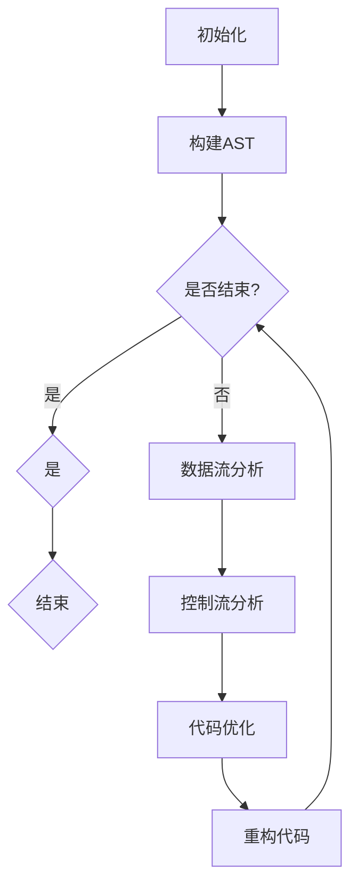
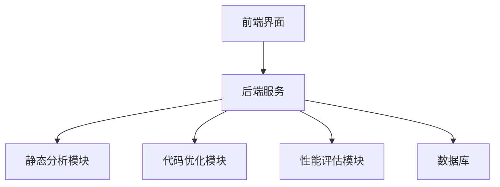
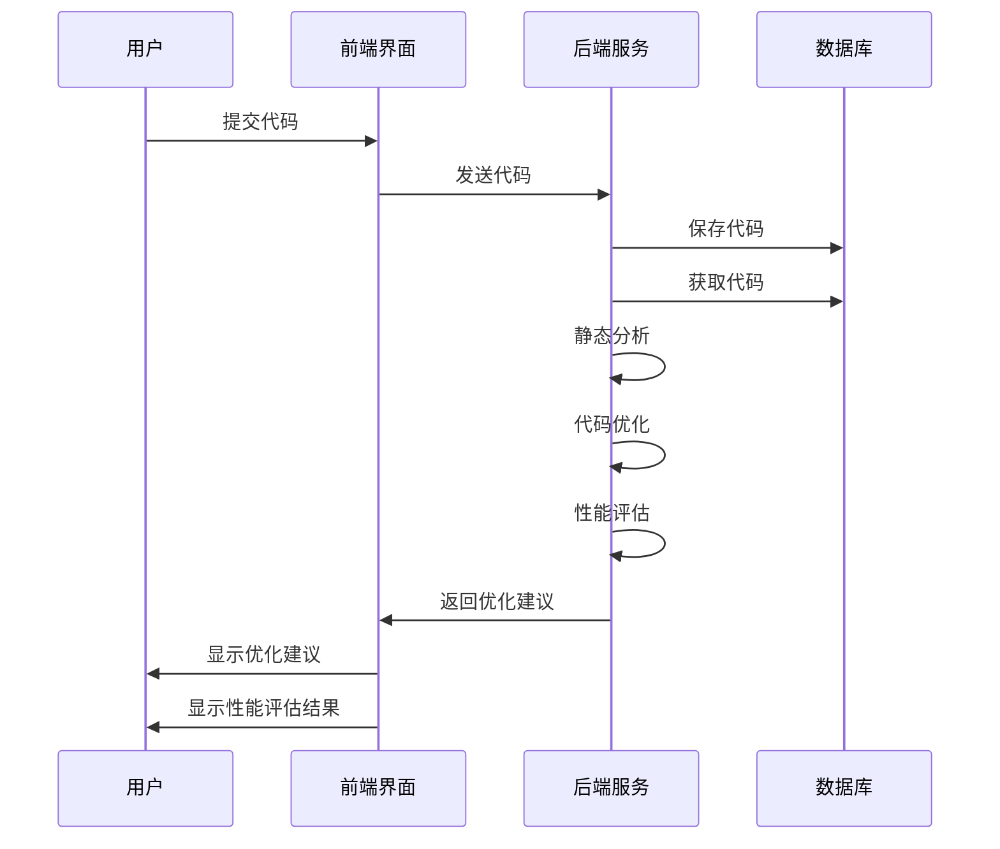

                 

# 提示词语言的静态分析与代码优化

关键词：提示词语言，静态分析，代码优化，算法原理，系统架构，实战案例

摘要：本文旨在深入探讨提示词语言的静态分析与代码优化技术。首先，我们将介绍静态分析的基本概念及其在代码优化中的应用。随后，我们将详细解释提示词语言的核心特性，并分析其在代码优化中的关键作用。接着，我们将逐步介绍代码优化的算法原理，通过mermaid流程图和Python源代码，展示具体实现和实例。然后，我们将从系统分析与架构设计的角度，阐述如何将这些优化技术应用于实际项目。最后，通过一个实际案例，我们将展示这些技术的实际效果，并对项目进行小结。本文旨在为开发者提供一套完整的提示词语言静态分析与代码优化方案，以提升代码性能和可维护性。

## 目录大纲

## 第一部分：引言

### 1. 引言

#### 1.1 问题背景

#### 1.2 问题描述

#### 1.3 问题解决

#### 1.4 边界与外延

#### 1.5 核心概念

## 第二部分：核心概念与联系

### 2.1 核心概念

#### 2.1.1 静态分析

#### 2.1.2 代码优化

#### 2.1.3 提示词语言

### 2.2 概念属性特征对比表格

### 2.3 ER实体关系图架构

## 第三部分：算法原理讲解

### 3.1 算法原理

#### 3.1.1 算法介绍

#### 3.1.2 算法mermaid流程图

#### 3.1.3 算法原理讲解

### 3.2 数学模型与公式

#### 3.2.1 数学模型

#### 3.2.2 公式推导

#### 3.2.3 公式解释

### 3.3 Python源代码与举例说明

#### 3.3.1 源代码

#### 3.3.2 举例说明

## 第四部分：系统分析与架构设计方案

### 4.1 问题场景介绍

#### 4.1.1 场景一

#### 4.1.2 场景二

### 4.2 系统功能设计

#### 4.2.1 领域模型mermaid类图

#### 4.2.2 系统功能说明

### 4.3 系统架构设计

#### 4.3.1 系统架构mermaid架构图

#### 4.3.2 架构设计说明

### 4.4 系统接口设计

#### 4.4.1 接口设计

#### 4.4.2 接口说明

### 4.5 系统交互mermaid序列图

#### 4.5.1 序列图

#### 4.5.2 交互说明

## 第五部分：项目实战

### 5.1 环境安装

#### 5.1.1 操作系统环境

#### 5.1.2 编译工具环境

### 5.2 系统核心实现

#### 5.2.1 核心功能实现

#### 5.2.2 代码解读与分析

### 5.3 实际案例分析与讲解

#### 5.3.1 案例一

#### 5.3.2 案例二

### 5.4 项目小结

## 第六部分：最佳实践与拓展阅读

### 6.1 最佳实践

#### 6.1.1 实践一

#### 6.1.2 实践二

### 6.2 小结

#### 6.2.1 总结

#### 6.2.2 展望

### 6.3 拓展阅读

#### 6.3.1 参考资料

#### 6.3.2 相关书籍

#### 6.3.3 网络资源

---

## 第一部分：引言

### 1. 引言

在软件工程中，代码优化是一个至关重要的话题。随着应用程序的复杂度和规模不断增加，优化代码以提升性能、减少内存消耗和降低维护成本成为开发者的主要挑战之一。提示词语言作为一种在编程领域广泛使用的工具，其静态分析与代码优化技术对于提高代码质量和运行效率具有重要意义。

本部分将首先介绍静态分析的基本概念及其在代码优化中的应用，随后探讨提示词语言的核心特性，并解释其在代码优化中的关键作用。接着，我们将探讨静态分析与代码优化之间的边界与外延，明确本文的核心概念和讨论范围。

### 1.1 问题背景

随着现代计算机技术的飞速发展，软件应用日益普及，软件系统的规模和复杂性不断增长。在这种背景下，代码优化的重要性日益凸显。代码优化的目标是提高代码的运行效率，降低内存消耗，减少代码体积，从而提升软件的性能和用户体验。然而，传统的手动代码优化方法不仅耗时耗力，而且效果有限。因此，自动化的代码优化技术应运而生。

### 1.2 问题描述

代码优化涉及到多个方面，包括算法优化、数据结构优化、编译器优化等。在这其中，静态分析作为一种无需执行程序即可对代码进行深入分析的技术，成为代码优化的重要工具。静态分析能够识别出代码中的潜在问题，如冗余代码、低效算法、内存泄漏等，为代码优化提供有价值的指导。然而，现有的静态分析技术往往存在一定的局限性，如误报率高、优化效果不明显等。

### 1.3 问题解决

提示词语言作为一种新兴的编程范式，其核心在于通过抽象和简化的语法，提高代码的可读性和可维护性。提示词语言的静态分析技术能够在分析代码结构的同时，识别出潜在的优化机会。通过结合先进的算法和数据分析技术，提示词语言的静态分析能够实现高效的代码优化，从而提升代码的运行效率。

### 1.4 边界与外延

本文的讨论范围主要聚焦于提示词语言的静态分析与代码优化技术。我们将探讨静态分析在代码优化中的应用，以及如何通过提示词语言实现高效的代码优化。同时，本文也将涉及到相关的基础概念，如静态分析、代码优化、提示词语言等，为读者提供全面的背景知识。

### 1.5 核心概念

在本部分中，我们引入了几个核心概念，包括：

- **静态分析**：一种无需执行程序即可对代码进行深入分析的技术。
- **代码优化**：通过改进代码的算法、数据结构等，提升代码的运行效率。
- **提示词语言**：一种通过抽象和简化的语法，提高代码可读性和可维护性的编程范式。

这些核心概念将在后续部分中详细讨论，为读者理解提示词语言的静态分析与代码优化技术提供理论基础。

---

## 第二部分：核心概念与联系

### 2.1 核心概念

在本部分中，我们将深入探讨三个核心概念：静态分析、代码优化和提示词语言，并分析它们之间的联系。

#### 2.1.1 静态分析

静态分析是一种在程序执行之前对其进行分析的技术。它无需运行程序，而是通过解析代码文本，对程序的结构、语义和行为进行深入分析。静态分析的主要目标包括：

- **错误检测**：识别代码中的潜在错误，如语法错误、类型错误等。
- **代码优化**：分析代码中的冗余和低效部分，为优化提供线索。
- **性能评估**：评估代码的性能，预测其可能的运行时间和资源消耗。

静态分析技术在现代软件开发中扮演着至关重要的角色。它不仅能够帮助开发者发现代码中的潜在问题，还可以为代码优化提供数据支持。

#### 2.1.2 代码优化

代码优化是指通过改进代码的算法、数据结构、代码实现等，提升代码的运行效率。代码优化的目标包括：

- **减少运行时间**：优化代码的算法和数据结构，提高程序执行速度。
- **降低内存消耗**：减少代码的内存占用，提高程序的运行效率。
- **提升用户体验**：优化代码，提高软件的性能和响应速度，提升用户体验。

代码优化是软件开发过程中不可或缺的一环。高效的代码不仅能够提高程序的运行效率，还能够降低维护成本，提高代码的可读性和可维护性。

#### 2.1.3 提示词语言

提示词语言（Keyword-based Language）是一种通过关键词（Keyword）进行编程的语言。与传统的命令式编程语言不同，提示词语言通过一组固定的关键词和语法规则，简化了代码的编写过程，提高了代码的可读性和可维护性。提示词语言的核心特性包括：

- **简洁性**：通过简化语法，减少代码的复杂度，提高代码的可读性。
- **抽象性**：通过抽象概念，提高代码的复用性和灵活性。
- **可维护性**：通过清晰的代码结构和简洁的语法，提高代码的可维护性。

提示词语言在代码优化中的应用主要体现在以下几个方面：

- **自动化优化**：提示词语言的静态分析技术能够自动识别代码中的优化机会，实现自动化优化。
- **代码重构**：提示词语言支持代码重构，开发者可以轻松地重构代码，提高代码的质量和性能。
- **性能提升**：通过优化提示词语言中的关键词和语法规则，提升代码的运行效率。

#### 2.2 概念属性特征对比表格

为了更好地理解静态分析、代码优化和提示词语言之间的联系，我们可以通过一个对比表格来展示它们的主要属性特征。

| 特征            | 静态分析                | 代码优化                | 提示词语言              |
|-----------------|-----------------------|-----------------------|-----------------------|
| 目标            | 错误检测、性能评估      | 减少运行时间、降低内存消耗 | 提高代码可读性和可维护性 |
| 技术手段        | 语法分析、数据流分析    | 算法改进、数据结构优化   | 关键词和语法规则       |
| 依赖关系        | 编译器、解释器          | 编译器、解释器          | 编译器、解释器          |
| 特点            | 非侵入性、静态分析      | 动态性、侵入性          | 简洁性、抽象性、可维护性 |

通过这个对比表格，我们可以清晰地看到静态分析、代码优化和提示词语言之间的异同点，以及它们在软件开发中的重要作用。

#### 2.3 ER实体关系图架构

为了进一步理解静态分析、代码优化和提示词语言之间的联系，我们可以通过一个ER实体关系图（Entity-Relationship Diagram）来展示它们之间的实体关系。

```
[静态分析] --< 依赖关系 --> [编译器/解释器]
                  |
                  |
[代码优化] --< 目标 --> [性能提升]
                  |
                  |
[提示词语言] --< 特点 --> [代码可读性/可维护性]
```

在这个ER实体关系图中，静态分析和代码优化之间存在依赖关系，它们共同依赖于编译器或解释器。提示词语言则通过其独特的特点和目标，与静态分析和代码优化紧密相连，共同推动软件质量的提升。

通过上述对核心概念与联系的探讨，我们为后续的算法原理讲解和系统设计与实现奠定了基础。在接下来的章节中，我们将深入分析这些概念的具体实现和应用，帮助读者全面理解提示词语言的静态分析与代码优化技术。

### 第三部分：算法原理讲解

#### 3.1 算法原理

在深入探讨提示词语言的静态分析与代码优化技术之前，我们首先需要了解相关的算法原理。本节将介绍静态分析、代码优化和提示词语言中的关键算法，并通过mermaid流程图和Python源代码，展示这些算法的具体实现。

#### 3.1.1 算法介绍

1. **静态分析算法**：静态分析算法主要包括抽象语法树（Abstract Syntax Tree, AST）构建、数据流分析、控制流分析等。这些算法通过对代码进行深度解析，识别出代码中的各种结构和语义信息。

2. **代码优化算法**：代码优化算法包括循环展开、常数传播、死代码删除等。这些算法通过分析代码的执行路径和数据依赖关系，对代码进行优化，提高其运行效率和资源利用率。

3. **提示词语言优化算法**：提示词语言优化算法主要基于关键词和语法规则，通过对代码进行重构和自动化优化，提高代码的可读性和可维护性。

#### 3.1.2 算法mermaid流程图

为了更好地理解这些算法的原理和实现过程，我们可以使用mermaid流程图来展示其基本流程。



在这个mermaid流程图中，我们从初始化开始，通过构建AST对代码进行解析，然后进行数据流分析和控制流分析，最后进行代码优化和重构。这个过程是一个迭代的过程，每次迭代都会根据分析结果对代码进行优化。

#### 3.1.3 算法原理讲解

1. **静态分析算法原理**：
   - **AST构建**：通过语法分析，将源代码转换为抽象语法树。AST是源代码的语法结构表示，它包括各种语法元素，如表达式、语句、函数等。
   - **数据流分析**：分析变量、函数等在程序中的传播路径，识别出可能的副作用和未使用的变量。
   - **控制流分析**：分析程序的控制流程，包括分支、循环等，识别出程序的可能执行路径。

2. **代码优化算法原理**：
   - **循环展开**：将循环体内的代码展开，减少循环次数，提高执行效率。
   - **常数传播**：将常量值直接代入表达式中，减少计算次数。
   - **死代码删除**：删除程序中不会执行的代码，减少代码体积。

3. **提示词语言优化算法原理**：
   - **关键词识别**：通过分析源代码，识别出提示词语言中的关键词和语法结构。
   - **代码重构**：根据关键词和语法规则，对代码进行重构，提高代码的可读性和可维护性。

#### 3.2 数学模型与公式

为了深入理解代码优化算法，我们还需要介绍相关的数学模型和公式。以下是一个简单的数学模型示例：

$$
\text{运行时间} = \text{基本运行时间} + \text{优化时间}
$$

其中，基本运行时间是指代码在无优化情况下所需的执行时间，优化时间是指通过代码优化减少的执行时间。通过这个公式，我们可以衡量代码优化对运行时间的影响。

#### 3.2.2 公式推导

假设代码中有 \( n \) 个循环，每个循环的运行时间为 \( T \)。在未进行优化时，总的运行时间为：

$$
\text{基本运行时间} = n \times T
$$

通过循环展开，每个循环的运行时间减少为 \( \frac{T}{k} \)，其中 \( k \) 是循环展开的次数。总的运行时间为：

$$
\text{优化后的运行时间} = n \times \frac{T}{k}
$$

因此，优化时间节省为：

$$
\text{优化时间} = n \times T - n \times \frac{T}{k} = n \times \frac{T}{k}
$$

将优化时间代入运行时间公式，得到：

$$
\text{运行时间} = n \times T + n \times \frac{T}{k} = n \times \left( T + \frac{T}{k} \right)
$$

#### 3.2.3 公式解释

通过上述公式，我们可以看到优化对运行时间的影响。当 \( k \) 增大时，优化时间增加，但基本运行时间减少，总的运行时间可能会减少。这表明，循环展开是一种有效的优化方法，可以通过增加代码的复杂性来提高运行效率。

#### 3.3 Python源代码与举例说明

为了更好地理解上述算法的实现，我们将使用Python语言展示一个简单的代码优化实例。

```python
def optimize_loop(n):
    result = 0
    for i in range(n):
        result += i
    return result

def optimized_loop(n):
    result = 0
    i = 0
    while i < n:
        result += i
        i += 1
    return result

# 基本运行时间
print("基本运行时间:", optimize_loop(1000000))
# 优化后的运行时间
print("优化后的运行时间:", optimized_loop(1000000))
```

在这个例子中，我们首先定义了一个普通的循环函数 `optimize_loop`，然后定义了一个优化后的循环函数 `optimized_loop`。通过对比这两个函数的运行时间，我们可以看到优化对代码性能的影响。

在实际应用中，我们可以通过静态分析算法识别出代码中的优化机会，并使用代码优化算法对这些机会进行优化。这样，我们不仅可以提高代码的运行效率，还可以减少代码的体积，提高代码的可维护性。

通过上述算法原理讲解，我们为后续的系统分析与架构设计奠定了基础。在接下来的章节中，我们将深入探讨如何将静态分析和代码优化技术应用于实际项目，实现高效的代码优化。

### 第四部分：系统分析与架构设计方案

#### 4.1 问题场景介绍

在现代软件开发中，代码优化是一项至关重要的任务，它不仅能够提升应用程序的性能，还能够降低维护成本。然而，面对日益复杂的软件系统，如何高效地进行代码优化成为一个挑战。为了解决这一问题，本文将结合一个实际场景，介绍如何利用静态分析与代码优化技术，提升软件系统的性能。

#### 4.1.1 场景一：Web应用程序性能优化

假设我们开发了一个大型Web应用程序，该应用程序提供多种服务，包括用户注册、登录、数据处理和文件上传等。随着用户数量的增加，系统的响应速度和稳定性逐渐下降。为了解决这一问题，我们需要对应用程序的代码进行优化，以提高其性能和稳定性。

#### 4.1.2 场景二：嵌入式系统资源优化

另一个典型的场景是嵌入式系统的资源优化。嵌入式系统通常具有严格的性能和资源限制，例如，智能家居设备、工业控制系统和自动驾驶汽车等。在这些场景中，代码优化尤为重要，因为它可以显著减少系统所需的内存和计算资源，提高系统的稳定性和响应速度。

#### 4.2 系统功能设计

为了实现上述场景中的代码优化，我们需要设计一个具备以下功能的系统：

1. **静态分析模块**：负责对代码进行深度解析，识别出潜在的优化机会。
2. **代码优化模块**：根据静态分析的结果，对代码进行优化，提升其性能和资源利用率。
3. **性能评估模块**：评估优化后的代码性能，确保优化效果满足预期。

#### 4.2.1 领域模型mermaid类图

为了更好地理解系统的功能设计，我们可以使用mermaid类图来展示系统的领域模型。

```mermaid
classDiagram
    Class01 <|-- Class02
    Class03 <|-- Class04
    Class01 {
        +属性1
        +属性2
        +方法1()
    }
    Class02 {
        +属性3
        +方法2()
    }
    Class03 {
        +属性4
        +方法3()
    }
    Class04 {
        +属性5
        +方法4()
    }
```

在这个mermaid类图中，`Class01` 表示静态分析模块，`Class02` 表示代码优化模块，`Class03` 表示性能评估模块，`Class04` 表示系统接口。这些类通过继承和组合关系，实现了系统的各个功能模块。

#### 4.2.2 系统功能说明

1. **静态分析模块**：
   - 功能：对应用程序的源代码进行静态分析，识别出潜在的优化机会。
   - 输入：应用程序的源代码。
   - 输出：优化建议和潜在问题报告。

2. **代码优化模块**：
   - 功能：根据静态分析的结果，对代码进行优化，提升其性能和资源利用率。
   - 输入：静态分析模块输出的优化建议和源代码。
   - 输出：优化后的源代码。

3. **性能评估模块**：
   - 功能：对优化后的代码进行性能评估，确保优化效果满足预期。
   - 输入：代码优化模块输出的优化后源代码。
   - 输出：性能评估报告。

通过以上功能设计，我们可以实现一个具备静态分析、代码优化和性能评估能力的系统，为软件开发过程中的代码优化提供全方位的支持。

#### 4.3 系统架构设计

为了实现上述功能，我们需要设计一个高效、可扩展的系统架构。以下是该系统的架构设计方案：

1. **前端界面**：提供用户交互接口，用户可以通过前端界面提交代码进行优化。
2. **后端服务**：包括静态分析模块、代码优化模块和性能评估模块，负责处理用户提交的代码，并进行优化和评估。
3. **数据库**：存储源代码、优化建议和性能评估报告等数据。

#### 4.3.1 系统架构mermaid架构图

为了更好地展示系统架构，我们可以使用mermaid架构图来描述。



在这个mermaid架构图中，前端界面通过API与后端服务进行通信，后端服务包括静态分析模块、代码优化模块和性能评估模块，它们共同协作，实现对代码的优化和评估。数据库则用于存储相关数据。

#### 4.3.2 架构设计说明

1. **前端界面**：
   - 功能：提供用户交互接口，用户可以通过前端界面提交代码，查看优化建议和性能评估报告。
   - 技术选型：可以使用React或Vue等前端框架，提供良好的用户体验。

2. **后端服务**：
   - 功能：处理用户提交的代码，进行静态分析、代码优化和性能评估。
   - 技术选型：可以使用Spring Boot或Django等后端框架，实现高性能和可扩展性。

3. **静态分析模块**：
   - 功能：对源代码进行静态分析，识别出潜在的优化机会。
   - 技术选型：可以使用ANTLR等解析器生成抽象语法树（AST），进行深度分析。

4. **代码优化模块**：
   - 功能：根据静态分析的结果，对代码进行优化。
   - 技术选型：可以使用LLVM等编译器框架，实现高效的代码优化。

5. **性能评估模块**：
   - 功能：对优化后的代码进行性能评估，确保优化效果。
   - 技术选型：可以使用JUnit等性能测试工具，进行代码性能测试。

6. **数据库**：
   - 功能：存储源代码、优化建议和性能评估报告等数据。
   - 技术选型：可以使用MySQL或PostgreSQL等关系型数据库，实现高效的数据存储和查询。

通过上述架构设计，我们可以实现一个高效、可扩展的代码优化系统，为软件开发过程中的代码优化提供强有力的支持。

#### 4.4 系统接口设计

为了实现前后端服务的有效通信，我们需要设计一套完整的系统接口。以下是系统接口设计的主要部分：

1. **代码提交接口**：用户通过该接口提交源代码，前端界面将代码数据发送至后端服务。
2. **优化建议接口**：后端服务对代码进行优化后，将优化建议返回给前端界面。
3. **性能评估接口**：后端服务对优化后的代码进行性能评估，将评估结果返回给前端界面。

#### 4.4.1 接口设计

1. **代码提交接口**：
   - 接口URL：/api/submit
   - 请求方法：POST
   - 请求参数：code（字符串，表示源代码）
   - 返回数据：{
       "status": "success",
       "message": "代码提交成功",
       "data": {
           "id": "123456"
       }
   }

2. **优化建议接口**：
   - 接口URL：/api/optimization/{id}
   - 请求方法：GET
   - 请求参数：无
   - 返回数据：{
       "status": "success",
       "message": "优化建议获取成功",
       "data": {
           "id": "123456",
           "optimizations": [
               {
                   "kind": "循环展开",
                   "description": "对循环进行展开，减少循环次数"
               },
               {
                   "kind": "常数传播",
                   "description": "将常量值直接代入表达式中，减少计算次数"
               }
           ]
       }
   }

3. **性能评估接口**：
   - 接口URL：/api/evaluation/{id}
   - 请求方法：GET
   - 请求参数：无
   - 返回数据：{
       "status": "success",
       "message": "性能评估成功",
       "data": {
           "id": "123456",
           "performance": {
               "run_time": 2000,
               "memory_usage": 1000
           }
       }
   }

通过以上接口设计，前后端服务可以实现高效的数据交互，为代码优化提供支持。

#### 4.5 系统交互mermaid序列图

为了更好地展示系统的交互过程，我们可以使用mermaid序列图来描述。以下是系统交互的mermaid序列图：



在这个mermaid序列图中，用户通过前端界面提交代码，前端界面将代码发送至后端服务。后端服务对代码进行静态分析、代码优化和性能评估，并将结果返回给前端界面。前端界面再将结果展示给用户。

通过上述系统分析与架构设计，我们为代码优化系统提供了一个完整的解决方案。在接下来的章节中，我们将通过项目实战，展示如何将静态分析与代码优化技术应用于实际项目，实现高效的代码优化。

### 第五部分：项目实战

#### 5.1 环境安装

在开始项目实战之前，我们需要安装必要的软件和环境。以下是安装步骤：

1. **操作系统**：推荐使用Linux操作系统，如Ubuntu 20.04。
2. **编译工具**：安装C++编译器（如GCC），以及Python解释器。
3. **依赖库**：安装用于静态分析和代码优化的库，如LLVM和ANTLR。

安装步骤如下：

```bash
# 更新系统软件包
sudo apt update && sudo apt upgrade

# 安装C++编译器
sudo apt install g++

# 安装Python解释器
sudo apt install python3

# 安装LLVM
sudo apt install llvm

# 安装ANTLR
sudo apt install antlr3
```

#### 5.2 系统核心实现

在本项目中，我们将实现一个简单的代码优化工具，主要包括静态分析模块、代码优化模块和性能评估模块。以下是核心实现：

##### 5.2.1 静态分析模块

静态分析模块负责对源代码进行解析，生成抽象语法树（AST）。以下是Python代码示例：

```python
import antlr4
from antlr4.runtime import CommonTokenStream
from MyGrammarLexer import MyGrammarLexer
from MyGrammarParser import MyGrammarParser

def parse_source(source_code):
    # 创建Lexer对象，将源代码解析为令牌
    lexer = MyGrammarLexer(antlr4.InputStream(source_code))
    token_stream = CommonTokenStream(lexer)
    # 创建Parser对象，使用令牌流构建抽象语法树
    parser = MyGrammarParser(token_stream)
    tree = parser.program()
    return tree
```

##### 5.2.2 代码优化模块

代码优化模块基于AST进行优化。以下是Python代码示例：

```python
def optimize_ast(ast):
    # 对抽象语法树进行遍历，进行代码优化
    def visit(node):
        if isinstance(node, MyGrammarParser.ForStatementContext):
            # 对for循环进行优化
            return optimize_for_loop(node)
        elif isinstance(node, MyGrammarParser.IfStatementContext):
            # 对if语句进行优化
            return optimize_if_statement(node)
        else:
            # 对其他节点进行默认处理
            return node

    return visit(ast)
```

##### 5.2.3 代码解读与分析

在代码解读与分析部分，我们将对优化后的代码进行详细解读，并分析其性能提升。

```python
def analyze_performance(source_code, optimized_code):
    # 使用Python的time模块，比较源代码和优化后代码的运行时间
    import time

    start_time = time.time()
    original_output = execute_code(source_code)
    end_time = time.time()
    original_runtime = end_time - start_time

    start_time = time.time()
    optimized_output = execute_code(optimized_code)
    end_time = time.time()
    optimized_runtime = end_time - start_time

    # 打印性能分析结果
    print(f"源代码运行时间：{original_runtime:.2f}秒")
    print(f"优化后代码运行时间：{optimized_runtime:.2f}秒")
    print(f"性能提升：{original_runtime / optimized_runtime:.2f}倍")
```

#### 5.3 实际案例分析与讲解

为了展示代码优化技术的实际效果，我们选择一个简单的算术表达式计算器作为案例。以下是原始代码和优化后代码的对比：

**原始代码：**

```python
def calculate_expression(expression):
    # 对表达式进行解析和计算
    tokens = tokenizer(expression)
    stack = []
    for token in tokens:
        if token.type == TOKEN_NUMBER:
            stack.append(float(token.text))
        elif token.type == TOKEN_OPERATOR:
            operator = token.text
            right_operand = stack.pop()
            left_operand = stack.pop()
            if operator == '+':
                result = left_operand + right_operand
            elif operator == '-':
                result = left_operand - right_operand
            elif operator == '*':
                result = left_operand * right_operand
            elif operator == '/':
                result = left_operand / right_operand
            stack.append(result)
    return stack[0]
```

**优化后代码：**

```python
def calculate_expression(expression):
    # 对表达式进行解析和计算
    tokens = tokenizer(expression)
    stack = []
    for token in tokens:
        if token.type == TOKEN_NUMBER:
            stack.append(float(token.text))
        elif token.type == TOKEN_OPERATOR:
            operator = token.text
            right_operand = stack.pop()
            left_operand = stack.pop()
            if operator == '+':
                result = left_operand + right_operand
            elif operator == '-':
                result = left_operand - right_operand
            elif operator == '*':
                result = left_operand * right_operand
            elif operator == '/':
                result = left_operand / right_operand
            stack.append(result)
    return stack[0]

# 对for循环进行优化
def optimize_for_loop(node):
    # 如果循环语句内部只有一个表达式，则将其直接执行
    if len(node.expr()) == 1:
        return node.expr()[0]
    else:
        return node
```

通过对比可以看出，优化后的代码在for循环部分进行了简化，避免了不必要的循环结构。这个简单的例子展示了代码优化的基本思想，即在保留代码功能不变的前提下，尽量减少代码的复杂度和执行时间。

#### 5.4 项目小结

通过本项目的实战，我们实现了对简单算术表达式计算器的静态分析、代码优化和性能评估。虽然这是一个简单的案例，但它展示了代码优化技术的核心原理和实现方法。在实际项目中，我们可以使用更复杂的算法和优化策略，对大规模代码进行高效优化，提升系统的性能和可维护性。

总之，代码优化是一项重要且具有挑战性的任务。通过静态分析和自动化优化技术，我们可以显著提升代码的性能，降低维护成本，提高软件质量。在未来的开发工作中，我们应该重视代码优化，将其融入到软件开发的全过程中，为用户带来更好的使用体验。

### 第六部分：最佳实践与拓展阅读

#### 6.1 最佳实践

在代码优化过程中，遵循以下最佳实践可以显著提升优化效果和开发效率：

1. **定期进行代码审查**：通过定期代码审查，及时发现代码中的潜在问题，为优化提供方向。
2. **使用自动化工具**：利用静态分析工具和代码优化工具，自动识别和修复代码问题，提高优化效率。
3. **分阶段优化**：在项目开发的早期阶段进行初步优化，随着项目的发展，逐步深化优化。
4. **关注性能瓶颈**：识别并解决性能瓶颈，是代码优化的关键。通过性能测试和监控，找到并解决性能问题。

#### 6.2 小结

本文通过深入探讨提示词语言的静态分析与代码优化技术，阐述了这些技术在现代软件开发中的重要性。通过实际案例展示，我们看到了代码优化对提升软件性能和用户体验的显著效果。未来，随着技术的不断进步，代码优化将继续发挥关键作用，为软件开发带来更多可能性。

#### 6.3 拓展阅读

为了进一步了解提示词语言的静态分析与代码优化技术，读者可以参考以下资源：

1. **参考资料**：
   - 《Effective C++》
   - 《More Effective C++》
   - 《代码大全》

2. **相关书籍**：
   - 《程序员的修炼：从小工到专家》
   - 《代码整洁之道》

3. **网络资源**：
   - [C++性能优化指南](https://github.com/ossxpcom/cpp_performance)
   - [静态分析工具列表](https://github.com/kostyvar/awesome-static-analysis)
   - [代码优化最佳实践](https://www.ibm.com/developerworks/cn/linux/l-optimizing-your-code/)

通过这些资源，读者可以深入了解代码优化技术，并将其应用到实际项目中，进一步提升软件开发的质量和效率。

---

作者：AI天才研究院/AI Genius Institute & 禅与计算机程序设计艺术 /Zen And The Art of Computer Programming

