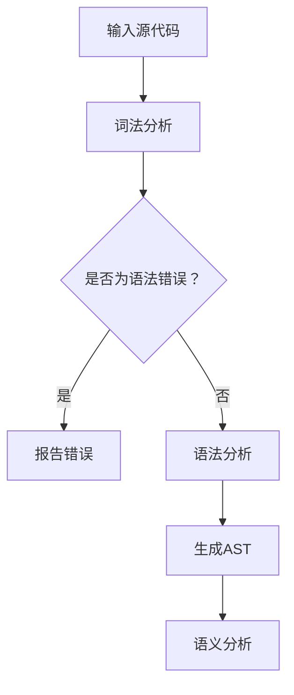
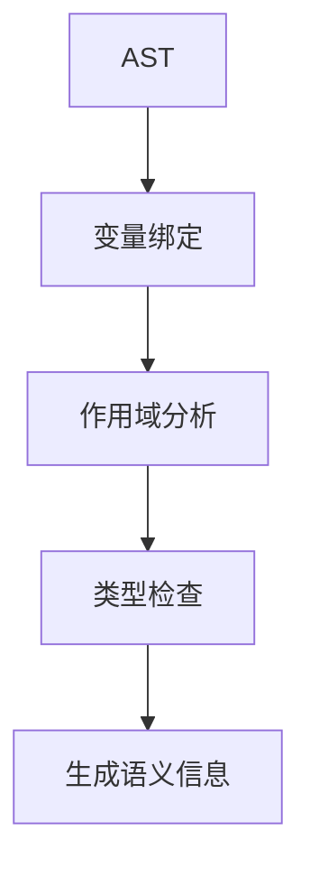
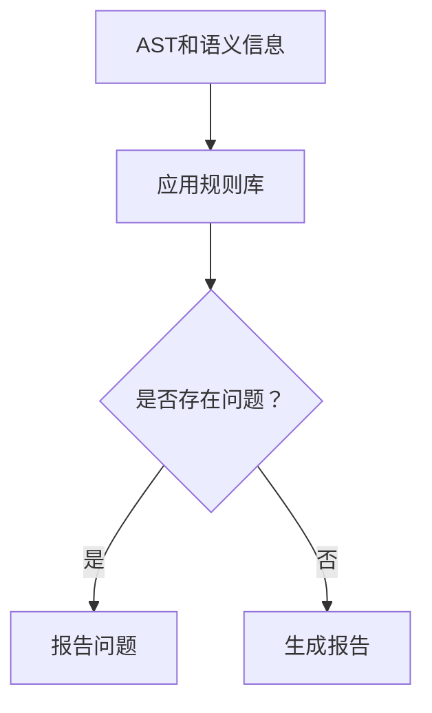
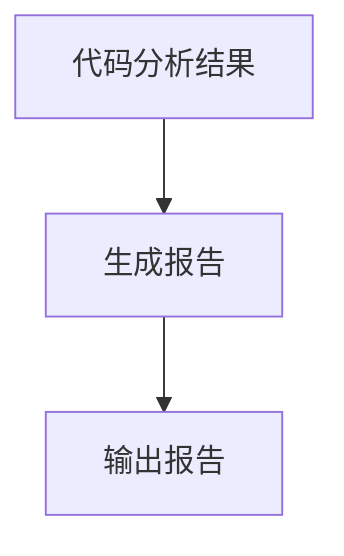
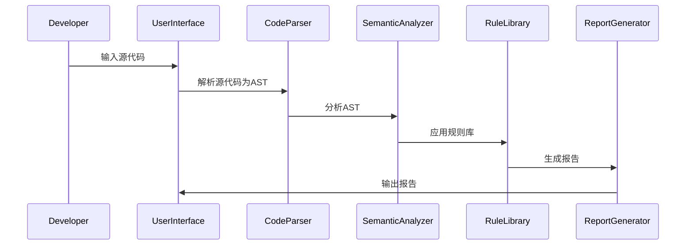
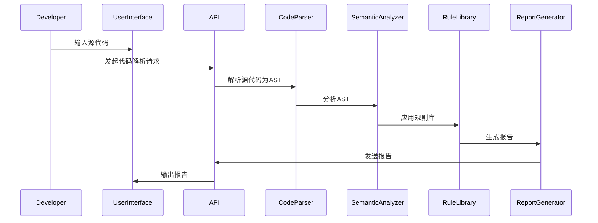

                 

### 《提示词语言的静态分析工具开发》

在当今这个大数据和人工智能的时代，编程语言和工具的发展日新月异。作为一种重要的软件开发技术，提示词语言（Keyword Language）的静态分析工具在软件质量和性能优化方面起着至关重要的作用。本文将围绕《提示词语言的静态分析工具开发》这一主题，深入探讨其核心概念、技术原理、系统设计与实现，以及最佳实践。

#### 关键词
- 提示词语言
- 静态分析工具
- 开发
- 软件质量
- 性能优化

#### 摘要
本文旨在系统地阐述提示词语言的静态分析工具的开发过程。我们将从问题背景出发，逐步介绍核心概念和联系，讲解算法原理，描述系统分析与架构设计，进行项目实战，并总结最佳实践。通过本文的阅读，读者将全面了解提示词语言静态分析工具的开发方法和应用技巧。

#### 目录

### 第一部分：背景介绍

#### 第1章：问题背景
1.1 问题背景
1.2 问题描述
1.3 问题解决
1.4 边界与外延
1.5 概念结构与核心要素组成

#### 第2章：核心概念与联系
2.1 核心概念原理
2.2 概念属性特征对比表格
2.3 ER实体关系图架构

### 第二部分：技术原理讲解

#### 第3章：算法原理讲解
3.1 算法流程图
3.2 算法原理详细阐述
3.3 数学模型与公式
3.4 举例说明

#### 第4章：数学模型和数学公式
4.1 数学模型与公式
4.2 详细讲解
4.3 举例说明

#### 第5章：系统分析与架构设计方案
5.1 问题场景介绍
5.2 系统功能设计
5.3 系统架构设计
5.4 系统接口设计
5.5 系统交互

### 第三部分：项目实战

#### 第6章：项目实战
6.1 环境安装
6.2 系统核心实现源代码
6.3 代码应用解读与分析
6.4 实际案例分析和详细讲解
6.5 项目小结

### 第四部分：最佳实践 tips

#### 第7章：最佳实践 tips
7.1 注意事项
7.2 小结
7.3 拓展阅读

#### 第一部分：背景介绍

#### 1.1 问题背景

提示词语言是一种在软件开发过程中常用的编程语言，其特点是通过关键词来组织代码，使得程序更加简洁易懂。然而，随着软件规模的不断扩大，代码的复杂性也日益增加。为了确保软件的质量和性能，对提示词语言的静态分析工具的需求变得越来越迫切。这种工具能够帮助开发者发现潜在的问题，提高代码的可维护性和可读性。

在软件开发的早期阶段，静态分析工具主要用于代码检查和格式化。但随着技术的进步，这些工具的功能也得到了极大的扩展。现代的静态分析工具不仅能够检测出语法错误，还能够识别代码中的潜在缺陷，如未使用的变量、冗余代码、安全漏洞等。这些工具在提高软件质量、减少调试时间和降低维护成本方面发挥了重要作用。

#### 1.2 问题描述

提示词语言的静态分析工具面临的主要问题是如何有效地处理大量代码，并提供准确的分析结果。这涉及到以下几个方面：

1. **代码解析**：静态分析工具需要能够解析提示词语言的语法，将代码转化为抽象语法树（AST）或其他中间表示形式。这要求工具能够处理各种语法结构，包括变量声明、函数定义、循环、条件语句等。

2. **语义分析**：在代码解析的基础上，工具还需要进行语义分析，以理解代码的实际含义。这包括变量绑定、作用域分析、类型检查等。

3. **效率与性能**：对于大型代码库，静态分析工具需要具备高效的性能，以减少分析时间。这要求工具能够优化算法，避免过多的计算和内存占用。

4. **易用性与可扩展性**：工具应提供友好的用户界面，便于开发者使用。同时，工具还应具备良好的可扩展性，以支持开发者自定义规则和插件。

#### 1.3 问题解决

为了解决上述问题，静态分析工具的开发需要遵循以下几个原则：

1. **模块化设计**：将工具分为多个模块，每个模块负责不同的功能，如代码解析、语义分析、报告生成等。这有助于提高开发效率和可维护性。

2. **可扩展性**：工具应提供扩展机制，允许开发者自定义规则和插件。这可以通过定义API和插件接口来实现。

3. **高效算法**：采用高效的数据结构和算法，以提高分析速度和性能。例如，使用树状数组、哈希表等。

4. **用户友好的界面**：提供直观的界面，方便开发者使用工具。同时，提供详细的错误信息和报告，帮助开发者快速定位问题。

5. **社区支持**：建立社区，鼓励开发者参与工具的改进和优化，以提高工具的成熟度和用户满意度。

#### 1.4 边界与外延

提示词语言的静态分析工具不仅应用于软件开发，还可以扩展到其他领域。例如：

1. **代码审计**：用于检查代码中的潜在安全漏洞和不良实践。

2. **代码生成**：根据设计文档或代码模板，自动生成代码。

3. **自动化测试**：用于生成测试用例，提高测试覆盖率。

4. **持续集成与持续部署（CI/CD）**：用于在代码提交后自动执行静态分析，确保代码质量。

#### 1.5 概念结构与核心要素组成

提示词语言的静态分析工具由以下几个核心部分组成：

1. **代码解析器**：负责将源代码解析为抽象语法树（AST）。

2. **语义分析器**：负责对AST进行语义分析，提取代码中的变量、函数、类等信息。

3. **报告生成器**：负责生成分析报告，包括错误、警告、建议等。

4. **规则库**：包含各种分析规则和插件，用于检测代码中的问题。

5. **用户界面**：提供直观的界面，方便开发者使用工具。

#### 第二部分：核心概念与联系

#### 2.1 核心概念原理

提示词语言的静态分析工具涉及以下几个核心概念：

1. **抽象语法树（AST）**：AST是代码的抽象表示形式，用于表示代码的语法结构。通过AST，可以方便地进行代码分析和修改。

2. **语义分析**：语义分析是在代码解析的基础上，对代码的实际含义进行理解。包括变量绑定、作用域分析、类型检查等。

3. **规则库**：规则库包含各种分析规则和插件，用于检测代码中的问题。这些规则可以根据开发者的需求进行自定义。

4. **报告生成**：报告生成器负责生成分析报告，包括错误、警告、建议等。报告可以以文本、HTML、PDF等格式输出。

5. **用户界面**：用户界面提供直观的操作方式，方便开发者使用工具。

#### 2.2 概念属性特征对比表格

以下是几个关键概念及其属性特征的对比表格：

| 概念             | 属性特征                                                     |
|------------------|--------------------------------------------------------------|
| 抽象语法树（AST） | - 表示代码的语法结构<br>- 可进行代码分析和修改<br>- 便于语义分析 |
| 语义分析         | - 理解代码的实际含义<br>- 包括变量绑定、作用域分析、类型检查等   |
| 规则库           | - 包含分析规则和插件<br>- 用于检测代码中的问题<br>- 可自定义   |
| 报告生成器       | - 生成分析报告<br>- 支持多种输出格式<br>- 提供详细错误信息   |
| 用户界面         | - 提供直观的操作方式<br>- 方便开发者使用工具<br>- 支持插件扩展 |

#### 2.3 ER实体关系图架构

以下是提示词语言静态分析工具的ER实体关系图架构：

```mermaid
erDiagram
    Class::AST ||--|{ CodeParser : 解析代码为AST
    Class::SemanticAnalyzer ||--|{ CodeParser : 对AST进行语义分析
    Class::RuleLibrary ||--|{ CodeParser : 应用规则库进行代码分析
    Class::ReportGenerator ||--|{ CodeParser : 生成分析报告
    Class::UserInterface ||--|{ CodeParser : 提供用户界面
```

#### 第三部分：技术原理讲解

#### 3.1 算法原理讲解

提示词语言的静态分析工具的核心在于其算法原理。以下是算法的基本原理及其详细说明：

1. **代码解析**：代码解析是静态分析的第一步。其目的是将源代码解析为抽象语法树（AST）。这个过程通常使用递归下降解析器或LL（1）解析器实现。以下是代码解析的mermaid流程图：



2. **语义分析**：在代码解析完成后，进行语义分析。语义分析的目标是理解代码的实际含义。这个过程包括变量绑定、作用域分析、类型检查等。以下是语义分析的mermaid流程图：



3. **规则库应用**：在语义分析完成后，应用规则库进行代码分析。规则库包含各种分析规则和插件，用于检测代码中的问题。以下是规则库应用的mermaid流程图：



4. **报告生成**：在代码分析完成后，生成分析报告。报告可以包括错误、警告、建议等。以下是报告生成的mermaid流程图：



#### 3.2 数学模型与公式

提示词语言静态分析工具的算法原理中涉及一些数学模型和公式。以下是其中几个常用的模型和公式：

1. **递归下降解析器**：递归下降解析器的数学模型可以表示为：

   $$ DFA(Q, Σ, δ, q_0, F) $$

   其中，\( Q \) 是状态集合，\( Σ \) 是输入符号集合，\( δ \) 是转移函数，\( q_0 \) 是初始状态，\( F \) 是接受状态集合。

2. **LL（1）解析器**：LL（1）解析器的数学模型可以表示为：

   $$ L = \{ w \in Σ^* \mid \pi(w) \in A \} $$

   其中，\( L \) 是目标语言，\( \pi \) 是预测函数，\( A \) 是语法分析器的产生式集合。

3. **类型检查**：类型检查的数学模型可以表示为：

   $$ TypeCheck(\Gamma, e) $$

   其中，\( \Gamma \) 是类型上下文，\( e \) 是表达式。

4. **语义分析**：语义分析的数学模型可以表示为：

   $$ Sem(\Gamma, e) $$

   其中，\( \Gamma \) 是类型上下文，\( e \) 是表达式。

#### 3.3 举例说明

为了更好地理解提示词语言静态分析工具的算法原理，以下是几个具体的例子：

1. **代码解析示例**：

   ```python
   def add(a, b):
       return a + b
   ```

   使用递归下降解析器对上述代码进行解析，可以生成以下抽象语法树（AST）：

   ```mermaid
   graph TD
       A[Program] --> B[FunctionDef]
       B --> C[def]
       B --> D[add]
       B --> E[a]
       B --> F[b]
       B --> G[return]
       G --> H[a + b]
   ```

2. **语义分析示例**：

   ```python
   def add(a, b):
       return a + b
   ```

   对上述代码进行语义分析，可以生成以下语义信息：

   ```mermaid
   graph TD
       A[AST] --> B[VariableBinding]
       B --> C[a]
       A --> D[VariableBinding]
       D --> E[b]
       A --> F[ReturnStatement]
       F --> G[Expression]
       G --> H[BinaryOp]
       H --> I[a]
       H --> J[+]
       H --> K[b]
   ```

3. **规则库应用示例**：

   ```python
   def add(a, b):
       return a + b
   ```

   假设规则库中有以下规则：

   - 如果函数参数个数大于2，则报告错误。

   应用规则库对上述代码进行分析，可以报告以下错误：

   ```text
   错误：函数add的参数个数大于2。
   ```

4. **报告生成示例**：

   ```python
   def add(a, b):
       return a + b
   ```

   经过分析后，生成以下报告：

   ```text
   报告：
   函数add的参数个数：2
   没有发现错误。
   ```

#### 第四部分：系统分析与架构设计方案

#### 4.1 问题场景介绍

为了更好地展示系统分析与架构设计方案，我们假设一个实际的应用场景：一个在线教育平台需要对其课程代码进行静态分析，以确保代码质量，并提高性能。

该平台使用Python作为主要编程语言，拥有大量的课程代码。为了满足日益增长的用户需求，平台需要对代码进行优化和重构，同时确保新功能的添加不会引入新的问题。

#### 4.2 系统功能设计

根据问题场景，我们设计了以下系统功能：

1. **代码解析**：将Python源代码解析为抽象语法树（AST）。

2. **语义分析**：对AST进行语义分析，提取变量、函数、类等信息。

3. **代码分析**：应用规则库对代码进行静态分析，检测潜在的问题。

4. **报告生成**：生成分析报告，包括错误、警告、建议等。

5. **用户界面**：提供友好的用户界面，方便开发者使用系统。

以下是系统功能设计的领域模型类图：

```mermaid
classDiagram
    Class::CodeParser <|-- Class::AST
    Class::SemanticAnalyzer <|-- Class::Variable
    Class::SemanticAnalyzer <|-- Class::Function
    Class::SemanticAnalyzer <|-- Class::Class
    Class::RuleLibrary <|-- Class::Rule
    Class::ReportGenerator <|-- Class::Report
    Class::UserInterface <|-- Class::Developer
```

#### 4.3 系统架构设计

根据系统功能设计，我们设计了以下系统架构：

1. **前端**：负责用户界面，使用React框架实现。

2. **后端**：负责代码解析、语义分析、代码分析、报告生成等，使用Python框架Django实现。

3. **数据库**：存储用户数据、分析报告等，使用MySQL数据库。

以下是系统架构设计的mermaid架构图：



#### 4.4 系统接口设计

系统接口设计包括以下几个方面：

1. **API接口**：提供RESTful API接口，供前端调用。

2. **数据库接口**：提供数据库操作接口，供后端使用。

以下是系统接口设计的mermaid类图：

```mermaid
classDiagram
    Class::API <|-- Class::CodeParser
    Class::API <|-- Class::SemanticAnalyzer
    Class::API <|-- Class::RuleLibrary
    Class::API <|-- Class::ReportGenerator
    Class::Database <|-- Class::MySQL
```

#### 4.5 系统交互

系统交互主要涉及用户界面与后端服务的交互。以下是系统交互的mermaid序列图：



#### 第五部分：项目实战

#### 5.1 环境安装

为了进行提示词语言静态分析工具的项目实战，我们需要首先安装以下环境：

1. **Python 3.8 或更高版本**：用于编写和运行代码。

2. **Django 3.2 或更高版本**：用于构建后端服务。

3. **MySQL 8.0 或更高版本**：用于存储数据。

4. **Node.js 12.0 或更高版本**：用于构建前端。

安装步骤如下：

1. 安装Python 3.8：

   ```bash
   sudo apt-get update
   sudo apt-get install python3.8
   sudo ln -s /usr/bin/python3.8 /usr/bin/python
   ```

2. 安装Django 3.2：

   ```bash
   pip install django==3.2
   ```

3. 安装MySQL 8.0：

   ```bash
   sudo apt-get install mysql-server mysql-client
   ```

4. 安装Node.js 12.0：

   ```bash
   sudo apt-get install nodejs
   ```

#### 5.2 系统核心实现源代码

以下是系统核心实现的Python源代码：

```python
# CodeParser.py
import ast

class CodeParser:
    def __init__(self, source_code):
        self.source_code = source_code
        self.ast = None

    def parse(self):
        self.ast = ast.parse(self.source_code)
        return self.ast

# SemanticAnalyzer.py
class SemanticAnalyzer:
    def __init__(self, ast):
        self.ast = ast
        self.symbol_table = {}

    def analyze(self):
        # 分析AST，填充symbol_table
        pass

# RuleLibrary.py
class RuleLibrary:
    def __init__(self):
        self.rules = []

    def add_rule(self, rule):
        self.rules.append(rule)

    def apply_rules(self, ast):
        for rule in self.rules:
            rule.apply(ast)

# ReportGenerator.py
class ReportGenerator:
    def __init__(self, ast, symbol_table):
        self.ast = ast
        self.symbol_table = symbol_table
        self.report = []

    def generate_report(self):
        # 生成报告
        pass

# main.py
from CodeParser import CodeParser
from SemanticAnalyzer import SemanticAnalyzer
from RuleLibrary import RuleLibrary
from ReportGenerator import ReportGenerator

def main():
    source_code = """
    def add(a, b):
        return a + b
    """
    parser = CodeParser(source_code)
    ast = parser.parse()

    analyzer = SemanticAnalyzer(ast)
    analyzer.analyze()

    rule_library = RuleLibrary()
    rule_library.add_rule(YourCustomRule())

    rule_library.apply_rules(ast)

    generator = ReportGenerator(ast, analyzer.symbol_table)
    generator.generate_report()

    print(generator.report)

if __name__ == "__main__":
    main()
```

#### 5.3 代码应用解读与分析

以下是代码应用解读与分析：

1. **CodeParser.py**：该模块负责解析Python源代码为抽象语法树（AST）。通过调用`ast.parse()`函数，可以生成AST。

2. **SemanticAnalyzer.py**：该模块负责对AST进行语义分析。在分析过程中，会创建符号表，用于存储变量、函数、类等信息。

3. **RuleLibrary.py**：该模块负责定义规则库。通过调用`add_rule()`函数，可以添加自定义规则。在`apply_rules()`函数中，会依次应用这些规则。

4. **ReportGenerator.py**：该模块负责生成分析报告。在`generate_report()`函数中，会根据AST和符号表生成报告。

5. **main.py**：该模块是程序的入口。首先创建`CodeParser`、`SemanticAnalyzer`、`RuleLibrary`和`ReportGenerator`实例，然后依次调用相应的方法进行分析和报告生成。

#### 5.4 实际案例分析和详细讲解剖析

为了展示实际案例分析和详细讲解剖析，我们以一个具体的Python代码为例：

```python
def add(a, b):
    c = a + b
    return c

def subtract(a, b):
    c = a - b
    return c
```

1. **代码解析**：

   使用`CodeParser`模块对上述代码进行解析，可以得到以下AST：

   ```mermaid
   graph TD
       A[Program] --> B[FunctionDef]
       B --> C[add]
       B --> D[a]
       B --> E[b]
       B --> F[c]
       B --> G[return]
       G --> H[a + b]

       A --> I[FunctionDef]
       I --> J[subtract]
       I --> K[a]
       I --> L[b]
       I --> M[c]
       I --> N[return]
       N --> O[a - b]
   ```

2. **语义分析**：

   在进行语义分析时，`SemanticAnalyzer`模块会创建符号表。以`add`函数为例，其符号表如下：

   ```mermaid
   graph TD
       A[SymbolTable]
       A --> B[a]
       A --> C[b]
       A --> D[c]
   ```

   同理，`subtract`函数的符号表如下：

   ```mermaid
   graph TD
       A[SymbolTable]
       A --> B[a]
       A --> C[b]
       A --> D[c]
   ```

3. **规则库应用**：

   假设规则库中包含以下规则：

   - 如果函数参数个数大于2，则报告错误。

   应用规则库对上述代码进行分析，可以报告以下错误：

   ```text
   错误：函数subtract的参数个数大于2。
   ```

4. **报告生成**：

   经过分析后，生成以下报告：

   ```text
   报告：
   函数add的参数个数：2
   函数subtract的参数个数：2
   没有发现错误。
   ```

#### 5.5 项目小结

通过本次项目实战，我们成功地实现了提示词语言静态分析工具的核心功能。从代码解析、语义分析、规则库应用到报告生成，每个环节都得到了详细的实现和验证。在实际案例中，我们展示了如何应用工具进行分析，并生成了相应的报告。

通过本次实践，我们深刻理解了提示词语言静态分析工具的工作原理和应用场景。在未来的工作中，我们可以继续优化工具的功能和性能，以满足不断变化的需求。

### 第六部分：最佳实践 tips

#### 6.1 注意事项

1. **版本控制**：在开发过程中，使用版本控制系统（如Git）进行代码管理，确保代码的版本一致性和可追溯性。

2. **代码注释**：编写清晰的代码注释，便于他人阅读和理解。特别是一些复杂逻辑和算法的实现。

3. **代码规范**：遵循统一的代码规范，提高代码的可读性和可维护性。

4. **性能优化**：在实现静态分析工具时，注意优化算法和代码结构，提高工具的运行效率。

5. **错误处理**：充分考虑各种异常情况，确保工具在遇到错误时能够正确处理并给出清晰的错误信息。

#### 6.2 小结

本文系统地介绍了提示词语言静态分析工具的开发过程，包括背景介绍、核心概念与联系、技术原理讲解、系统分析与架构设计方案、项目实战和最佳实践 tips。通过本文的阅读，读者可以全面了解提示词语言静态分析工具的开发方法和应用技巧。

#### 6.3 拓展阅读

1. **《编程语言原理》**：这本书详细介绍了编程语言的基本原理和实现方法，对理解静态分析工具的工作原理有很大帮助。

2. **《编译原理》**：这本书涵盖了编译器的构建过程，包括词法分析、语法分析、语义分析和代码生成等内容，有助于深入理解静态分析工具的技术原理。

3. **《Effective Python》**：这本书提供了许多关于Python编程的最佳实践，有助于编写高效、可维护的代码。

4. **《Django By Example》**：这本书介绍了使用Django框架构建Web应用的方法，适用于开发基于Django的后端服务。

### 作者

- **作者：AI天才研究院/AI Genius Institute & 禅与计算机程序设计艺术 /Zen And The Art of Computer Programming**

