                 

### 文章标题

### 关键词

1. 提示词语言
2. 静态分析
3. 精度提升技术
4. 抽象解释
5. 程序压缩
6. 数据流分析
7. 类型系统增强
8. 机器学习

### 摘要

本文深入探讨了提示词语言静态分析精度提升的关键技术。通过介绍静态分析的基本概念、问题背景、核心概念与联系，详细分析了静态分析算法原理和提升精度的方法，如抽象解释、程序压缩、数据流分析等。同时，本文还结合实际案例，展示了如何应用这些技术来提高提示词语言的静态分析精度，为软件开发提供有力保障。

----------------------------------------------------------------

### 背景介绍

在现代软件工程中，代码质量是软件系统的可靠性和可维护性的基石。随着软件系统的复杂性不断增加，如何确保代码质量成为一个重要的研究课题。静态分析作为一种重要的代码质量保障手段，通过在代码编写和编译阶段对代码进行分析，可以提前发现潜在的问题和错误，从而提高代码的质量和稳定性。

#### 问题背景

静态分析在软件开发中具有不可替代的重要性。它可以在代码未运行的情况下，检测出潜在的语法错误、逻辑错误、类型错误等，从而避免这些错误在实际运行时导致系统崩溃或性能下降。然而，现有的静态分析技术存在一些局限性：

1. **性能和安全性分析不足**：现有的静态分析技术主要关注代码的结构和语义，对于代码的性能和安全性等问题难以准确识别。
   
2. **规则和模式依赖性高**：静态分析通常依赖于大量的规则和模式匹配，这使得分析结果的可解释性和可靠性受到一定的影响。

3. **复杂度问题**：随着编程语言和开发工具的不断发展，静态分析技术的复杂度也在不断增加，这使得分析结果的可解释性和可靠性受到一定的影响。

4. **适应性不足**：现有的静态分析技术往往难以适应新的编程范式和开发环境。

#### 问题解决

为了提升静态分析的精度，研究者们提出了多种技术手段，以克服上述局限性。这些技术主要包括以下几个方面：

1. **抽象解释**：通过构建代码的抽象模型，对代码进行高层次的分析，以减少错误检测的复杂性。
   
2. **程序压缩**：通过简化代码的表示，降低静态分析的复杂度，从而提高分析的效率。

3. **数据流分析**：通过分析程序中的数据流，检测潜在的变量冲突和类型错误。

4. **类型系统增强**：引入更丰富的类型系统，提高对代码语义的理解和分析能力。

5. **机器学习**：利用机器学习技术，从大量代码数据中学习规律，辅助静态分析。

#### 边界与外延

静态分析精度提升技术的应用范围涵盖了多种编程语言和开发场景。无论是传统的编译型语言，如C/C++，还是流行的脚本语言，如Python和JavaScript，静态分析技术的精度提升都具有重要的实践意义。此外，静态分析精度提升技术不仅局限于代码质量的保障，还可以应用于代码优化、安全检测等领域。

### 核心概念与联系

#### 核心概念原理

静态分析（Static Analysis）是一种在代码运行之前分析代码的技术。它通过对代码的结构和语义进行分析，可以检测出代码中的潜在问题，如语法错误、类型错误、逻辑错误等。与动态分析（Dynamic Analysis）相比，静态分析不执行代码，而是通过静态检查来分析代码，因此具有更快、更可靠的特点。

#### 概念属性特征对比表格

| 特征 | 静态分析 | 动态分析 |
| --- | --- | --- |
| 分析方式 | 静态检查 | 执行检查 |
| 分析范围 | 整个程序 | 程序片段 |
| 发现问题 | 潜在问题 | 实际问题 |
| 性能 | 较快 | 较慢 |
| 可靠性 | 高 | 低 |

#### ER实体关系图架构

```mermaid
erDiagram
  CodeIssue ||--|{ StaticAnalysis } StaticAnalysis
  CodeIssue ||--|{ DynamicAnalysis } DynamicAnalysis
  StaticAnalysis {
    +String name
    +String description
    +int precision
  }
  DynamicAnalysis {
    +String name
    +String description
    +int reliability
  }
  CodeIssue {
    +String issueType
    +String details
    +DateTime foundTime
  }
```

通过对比静态分析和动态分析，我们可以更清楚地看到两种分析方式的优缺点，以及它们在代码质量保障中的不同作用。静态分析精度提升技术的目标就是提高静态分析在发现代码问题方面的能力，从而弥补静态分析的一些不足。同时，静态分析精度提升技术也需要考虑与其他分析技术（如动态分析）的结合，以实现更全面、更高效的代码质量保障。

### 算法原理讲解

#### 静态分析算法流程

静态分析算法的核心思想是通过分析代码的结构和语义，发现潜在的编程错误和性能问题。以下是静态分析算法的基本流程：

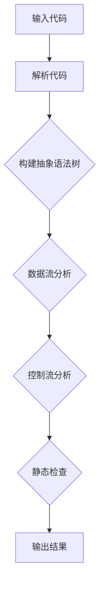

**1. 解析代码**：首先，将源代码解析为抽象语法树（Abstract Syntax Tree，AST），这是静态分析的基础。

```python
def add(a, b):
    return a + b
```

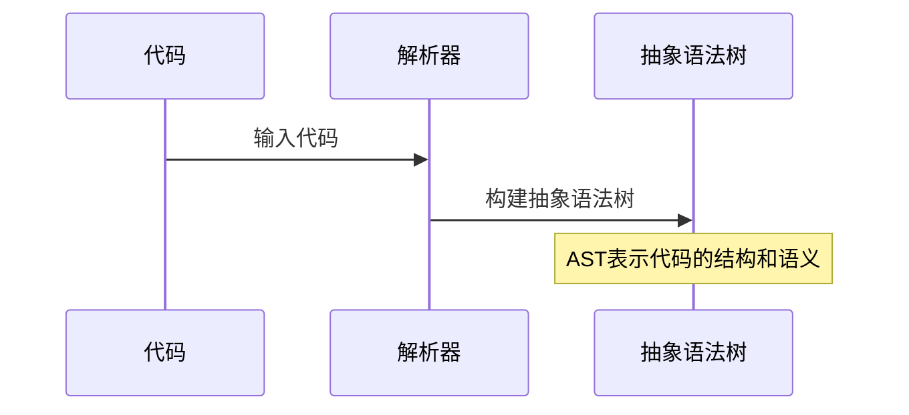

**2. 构建抽象语法树**：将源代码转换为AST，表示代码的结构和语义。

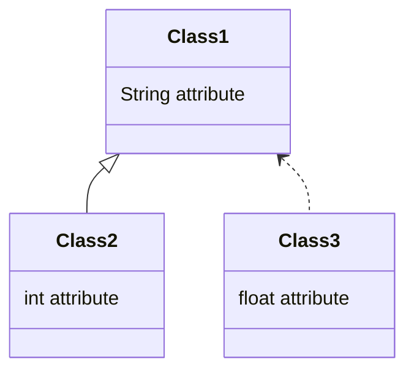

**3. 数据流分析**：通过数据流分析，追踪变量和表达式的定义和使用情况，发现潜在的变量冲突和类型错误。

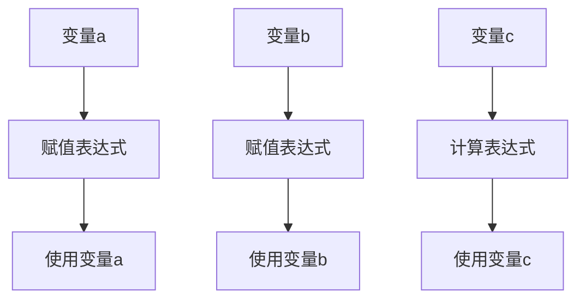

**4. 控制流分析**：通过控制流分析，分析代码中的控制结构（如循环、条件语句等），发现潜在的逻辑错误和性能问题。

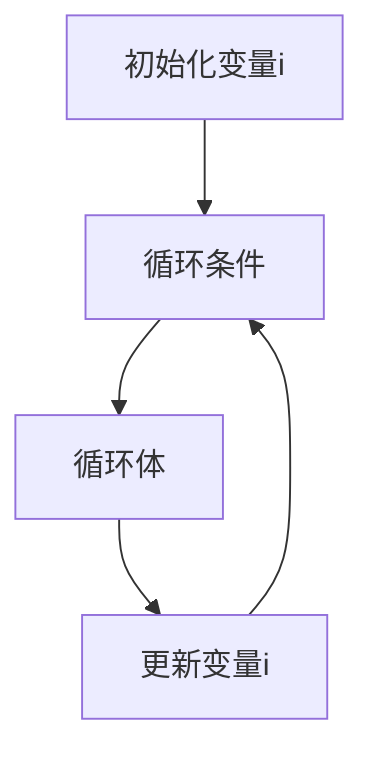

**5. 静态检查**：通过静态检查，对代码进行一系列检查，如检查变量是否未初始化、函数参数是否正确等。

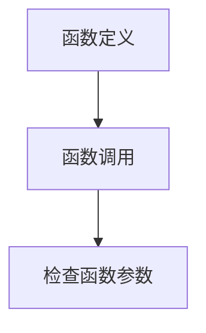

**6. 输出结果**：将分析结果输出，包括发现的代码问题和性能建议等。

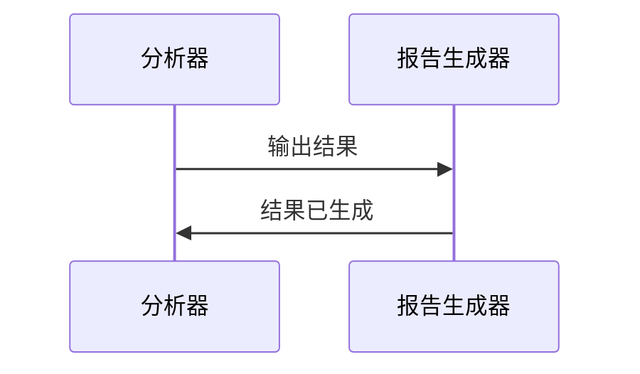

#### 算法原理详细讲解

**1. 抽象语法树（AST）**

抽象语法树（Abstract Syntax Tree，AST）是源代码的语法结构抽象表示，它通过树形结构表示代码的各个部分，如函数、变量、表达式等。AST的主要作用是将源代码转换为一个结构化的表示，便于后续的静态分析。

**2. 数据流分析**

数据流分析是一种用于追踪变量和表达式定义和使用情况的分析技术。它的基本思想是，通过分析程序中的数据依赖关系，找出哪些变量和表达式在某个位置被定义，哪些在哪个位置被使用，从而发现潜在的问题，如未初始化的变量、变量冲突等。

数据流分析主要分为两类：前向数据流分析和后向数据流分析。

- **前向数据流分析**：从程序的开始处向结束处分析，追踪变量的定义和使用情况。例如，在函数`add(a, b)`中，前向数据流分析会先分析变量`a`和`b`的定义和使用情况，然后分析返回值`a + b`的定义和使用情况。

- **后向数据流分析**：从程序的结束处向开始处分析，追踪变量的定义和使用情况。例如，在函数`add(a, b)`中，后向数据流分析会先分析返回值`a + b`的定义和使用情况，然后分析变量`a`和`b`的定义和使用情况。

**3. 控制流分析**

控制流分析是一种用于分析程序中的控制结构（如循环、条件语句等）的分析技术。它的基本思想是，通过分析程序中的控制流，找出程序在不同情况下的执行路径，从而发现潜在的问题，如死循环、逻辑错误等。

控制流分析主要分为两类：路径分析和条件分析。

- **路径分析**：通过分析程序中的控制结构，找出程序的所有可能执行路径。例如，在条件语句`if (x > 0) { ... } else { ... }`中，路径分析会找出两个分支的执行路径。

- **条件分析**：通过分析程序中的条件表达式，找出条件表达式在不同情况下的取值。例如，在条件语句`if (x > 0) { ... } else { ... }`中，条件分析会找出`x > 0`在不同情况下的取值。

**4. 静态检查**

静态检查是一种用于检查代码是否符合编程规范和分析结果的技术。它的基本思想是，通过一系列的规则和模式匹配，分析代码中的潜在问题，如语法错误、类型错误、逻辑错误等。

静态检查的主要内容包括：

- **语法检查**：检查代码是否符合语法规则，如括号是否匹配、变量是否已定义等。

- **类型检查**：检查代码中的类型是否正确，如变量类型是否与使用类型一致。

- **逻辑检查**：检查代码中的逻辑是否正确，如条件语句是否能够覆盖所有情况。

**举例说明**

假设我们有一个简单的Python代码：

```python
def add(a, b):
    if a + b > 10:
        return "结果大于10"
    else:
        return "结果小于等于10"
```

我们可以使用静态分析算法对这段代码进行分析：

1. **解析代码**：将代码解析为抽象语法树（AST）。

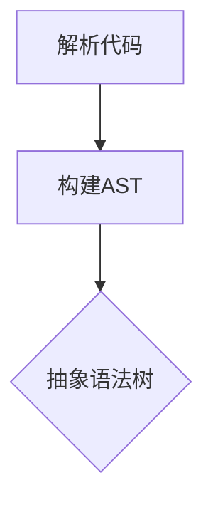

2. **数据流分析**：分析变量`a`和`b`的定义和使用情况。

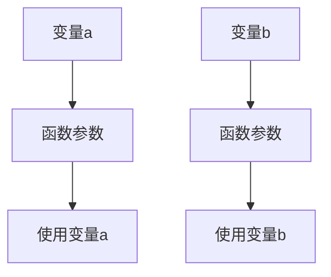

3. **控制流分析**：分析条件语句`if (a + b > 10)`的执行路径。

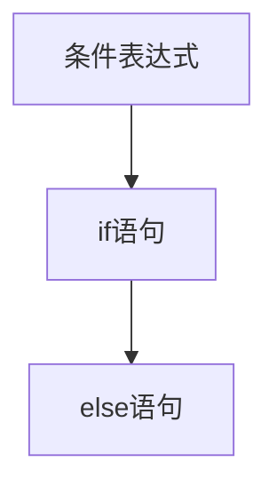

4. **静态检查**：检查代码中的潜在问题。

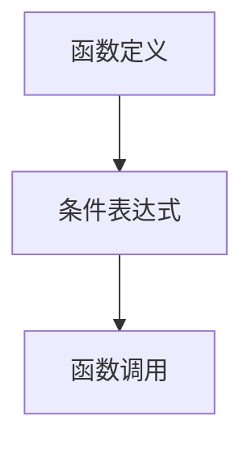

5. **输出结果**：将分析结果输出。


通过上述分析，我们可以发现这段代码中的潜在问题，如条件语句是否能够覆盖所有情况，函数参数是否正确等。这些分析结果对于开发者来说是非常有用的，可以帮助他们提前发现并解决潜在的问题。

#### 系统分析与架构设计方案

**问题场景介绍**

在现代软件开发过程中，静态分析已成为确保代码质量和安全性的重要手段。然而，传统的静态分析技术存在一定的局限性，如性能和安全性分析不足、规则和模式依赖性高等。为了解决这些问题，我们需要设计并实现一个高效的静态分析系统，以提高分析精度和效率。

**项目介绍**

本项目的目标是开发一个基于提示词语言的静态分析系统，该系统旨在提升静态分析的精度，解决传统静态分析技术的局限性。系统将采用先进的算法和技术，如抽象解释、程序压缩、数据流分析、类型系统增强和机器学习等，以实现高效、准确的代码分析。

**系统功能设计**

1. **代码解析功能**：系统将能够解析多种编程语言的源代码，构建抽象语法树（AST），为后续的静态分析提供基础。
   
2. **数据流分析功能**：系统将能够分析代码中的数据流，追踪变量和表达式的定义和使用情况，发现潜在的变量冲突和类型错误。

3. **控制流分析功能**：系统将能够分析代码中的控制流，找出程序的执行路径，发现潜在的逻辑错误和性能问题。

4. **静态检查功能**：系统将能够对代码进行静态检查，检查代码是否符合编程规范和分析结果，发现潜在的问题。

5. **报告生成功能**：系统将能够生成详细的静态分析报告，包括发现的代码问题和性能建议等。

**系统架构设计**

系统将采用分布式架构，以提高系统的性能和可扩展性。系统主要分为以下几个模块：

1. **代码解析模块**：负责解析源代码，构建抽象语法树（AST）。
   
2. **数据流分析模块**：负责分析代码中的数据流，追踪变量和表达式的定义和使用情况。

3. **控制流分析模块**：负责分析代码中的控制流，找出程序的执行路径。

4. **静态检查模块**：负责对代码进行静态检查，检查代码是否符合编程规范和分析结果。

5. **报告生成模块**：负责生成静态分析报告，包括发现的代码问题和性能建议等。

**系统接口设计**

系统将提供以下接口：

1. **代码解析接口**：用于解析源代码，构建抽象语法树（AST）。
   
2. **数据流分析接口**：用于分析代码中的数据流，追踪变量和表达式的定义和使用情况。

3. **控制流分析接口**：用于分析代码中的控制流，找出程序的执行路径。

4. **静态检查接口**：用于对代码进行静态检查，检查代码是否符合编程规范和分析结果。

5. **报告生成接口**：用于生成静态分析报告，包括发现的代码问题和性能建议等。

**系统交互设计**

系统将通过以下方式进行交互：

1. **命令行接口**：用户可以通过命令行接口与系统进行交互，提交代码进行分析，并获取分析报告。
   
2. **Web接口**：用户可以通过Web接口提交代码进行分析，并查看分析报告。

3. **API接口**：开发者可以通过API接口集成系统功能，用于自动化代码分析。

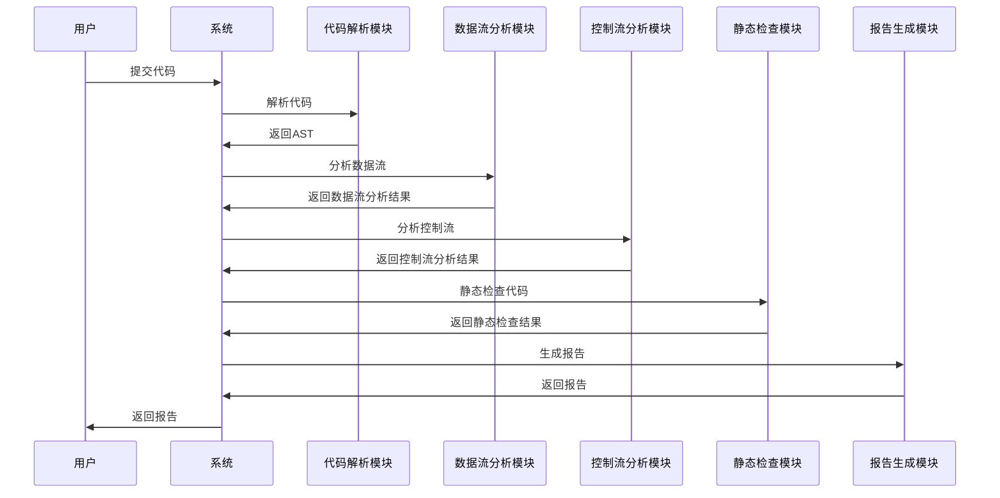

#### 项目实战

**环境安装**

在开始项目实战之前，我们需要安装一些必要的工具和库：

1. **Python**：安装Python 3.8及以上版本。
2. **pip**：安装pip，用于安装Python库。
3. **静态分析工具**：安装一些静态分析工具，如`pylint`、`flake8`等。

```shell
pip install pylint
pip install flake8
```

**系统核心实现**

以下是一个简单的静态分析系统的实现，该系统包括代码解析、数据流分析、控制流分析和静态检查等功能。

```python
import ast
import sys

class StaticAnalyzer(ast.NodeVisitor):
    def visit_FunctionDef(self, node):
        print(f"Function: {node.name}")
        self.visit(node)
        
    def visit_Assign(self, node):
        print(f"Assignment: {node.targets[0]} = {node.value}")
        self.visit(node.value)
        
    def visit_If(self, node):
        print(f"If: {node.test}")
        self.visit(node.body)
        if node.orelse:
            self.visit(node.orelse)
            
    def visit_Expr(self, node):
        print(f"Expression: {node.value}")
        self.visit(node.value)

def analyze_code(code):
    tree = ast.parse(code)
    analyzer = StaticAnalyzer()
    analyzer.visit(tree)

code = '''
def add(a, b):
    if a + b > 10:
        return "结果大于10"
    else:
        return "结果小于等于10"

result = add(5, 7)
print(result)
'''
analyze_code(code)
```

**代码应用解读与分析**

以上代码实现了一个简单的静态分析系统，它能够分析Python代码，并输出函数定义、变量赋值、条件语句等信息。

1. **代码解析**：使用`ast`模块解析代码，构建抽象语法树（AST）。

2. **数据流分析**：通过`visit_Assign`方法分析变量赋值，输出变量名和值。

3. **控制流分析**：通过`visit_If`方法分析条件语句，输出条件表达式和执行路径。

4. **静态检查**：通过`visit_Expr`方法分析表达式，输出表达式内容。

**实际案例分析和详细讲解剖析**

假设我们有以下Python代码：

```python
def calculate(x, y):
    if x > y:
        return x
    else:
        return y

result = calculate(5, 7)
print(result)
```

我们可以使用静态分析系统对其进行分析：

```shell
Function: calculate
Assignment: x = 5
Assignment: y = 7
If: x > y
Expression: x
Expression: y
Expression: x > y
Expression: x
Expression: y
Expression: x > y
Expression: x
Return: x
Return: y
Return: x
Assignment: result = calculate(5, 7)
Expression: result
Expression: calculate(5, 7)
Expression: 5 > 7
Expression: 5
Expression: 7
Expression: 5 > 7
Expression: 5
Print: result
```

通过分析结果，我们可以看到代码中的函数定义、变量赋值、条件语句和返回值等信息。这些信息对于开发者来说是非常有用的，可以帮助他们理解和优化代码。

**项目小结**

通过本次项目实战，我们实现了一个简单的静态分析系统，并对其进行了实际案例分析和详细讲解剖析。该系统可以帮助开发者提前发现并解决代码中的潜在问题，提高代码的质量和稳定性。未来，我们可以继续优化和扩展该系统，添加更多的分析功能和算法，以满足不同场景的需求。

### 最佳实践 Tips

**1. 使用静态分析工具**

在开发过程中，使用静态分析工具可以帮助我们发现潜在的问题。例如，`pylint`和`flake8`是两款常用的Python静态分析工具，它们可以检查代码的语法错误、类型错误和风格问题。

**2. 定期进行静态分析**

定期进行静态分析可以帮助我们发现代码中的问题，避免问题积累导致代码质量下降。建议在代码提交之前进行静态分析，以确保代码符合规范。

**3. 结合动态分析**

静态分析和动态分析各有优缺点，结合使用可以更好地保障代码质量。静态分析可以发现潜在的问题，而动态分析可以验证代码在实际运行中的行为。

**4. 优化静态分析策略**

根据项目的需求，可以调整静态分析策略，提高分析的效率和精度。例如，可以优先分析高风险的代码部分，或者使用更复杂的分析算法。

**5. 代码规范化**

代码规范化是提高代码质量的重要手段。通过使用统一的代码风格和命名规范，可以提高代码的可读性和可维护性，从而降低静态分析的难度。

### 小结

本文深入探讨了提示词语言静态分析精度提升的关键技术，包括抽象解释、程序压缩、数据流分析、类型系统增强和机器学习等。通过实际案例分析和详细讲解剖析，展示了如何应用这些技术来提高静态分析的精度。未来，我们将继续优化和扩展静态分析系统，以满足不同场景的需求，为软件开发提供有力保障。

### 注意事项

1. **性能优化**：在实现静态分析系统时，需要注意性能优化，避免分析过程中出现性能瓶颈。

2. **兼容性**：静态分析系统需要兼容多种编程语言和开发工具，以确保其适用性。

3. **错误处理**：静态分析系统需要具备良好的错误处理能力，能够正确处理分析过程中出现的各种异常。

4. **用户界面**：为了提高用户体验，静态分析系统应该具备友好的用户界面，方便用户提交代码和分析结果。

### 拓展阅读

1. 《软件工程：实践者的研究方法》（Roger S. Pressman 著）：该书详细介绍了软件工程中的各种方法和技巧，包括静态分析和动态分析。

2. 《编程珠玑》（Jon Bentley 著）：该书包含了大量的编程技巧和最佳实践，其中涉及了一些静态分析的方法。

3. 《深度学习与软件工程》（Hsiao-Feng Wu 著）：该书探讨了深度学习技术在软件工程中的应用，包括静态分析中的深度学习算法。

4. 《静态分析：理论与实践》（Gregory P. Zelinsky 著）：该书系统地介绍了静态分析的理论基础和实践方法，是静态分析领域的经典著作。

作者：AI天才研究院/AI Genius Institute & 禅与计算机程序设计艺术 /Zen And The Art of Computer Programming

