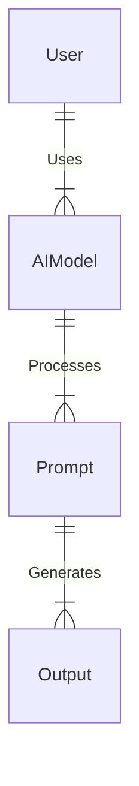
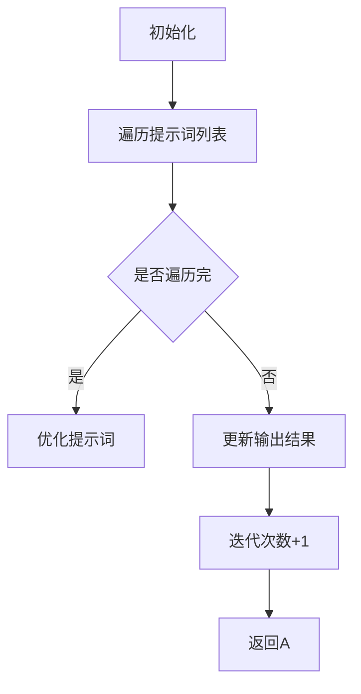
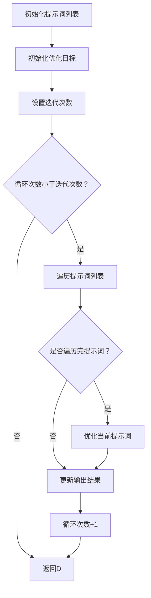
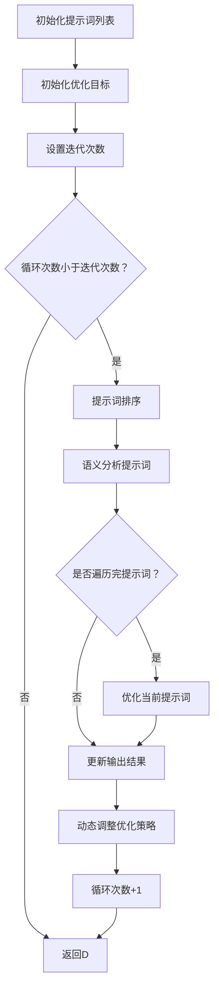
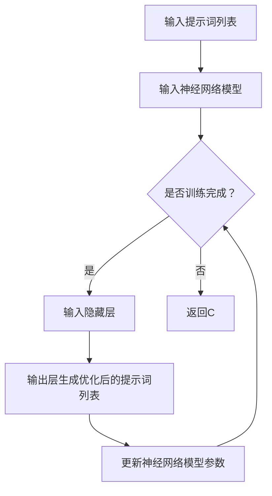
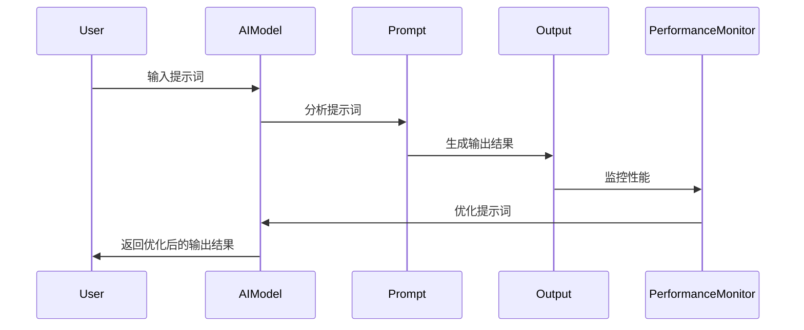
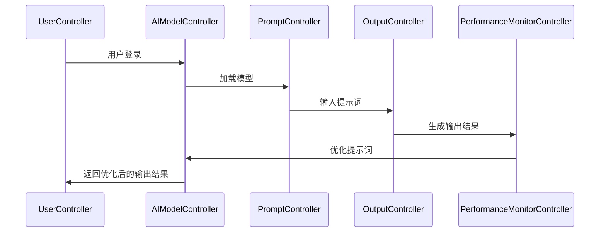

                 

### 文章标题

# 提示词调试技巧：优化AI输出的方法论

关键词：AI输出优化，提示词调试，算法原理，系统架构设计，项目实战

摘要：本文深入探讨了AI输出过程中常见的问题及其调试技巧，通过逻辑清晰、结构紧凑的分析，为读者提供了优化AI输出的一系列方法论。文章首先介绍了AI输出问题的背景与挑战，然后详细解析了提示词调试的核心概念、算法原理以及系统架构设计。通过具体的实战案例，本文展示了如何在实际项目中应用这些调试技巧，为提升AI输出质量提供了有力的指导。

### 第一部分: 提示词调试基础

#### 第1章: AI输出问题的背景与挑战

##### 1.1 AI输出问题的现状

在现代人工智能领域，AI系统的输出质量直接影响到其在实际应用中的效果和用户体验。然而，AI输出问题一直是困扰开发者的一大难题。这些问题的普遍性表现在以下几个方面：

1. **误判和误识别**：AI系统在处理输入数据时，可能会出现错误的判断或识别，导致输出结果与预期不符。
2. **数据不一致**：不同时间或不同条件下，AI系统对相同输入数据的输出结果可能不一致，影响系统的稳定性和可预测性。
3. **低质量输出**：AI系统生成的输出内容可能缺乏逻辑性、连贯性或准确性，无法满足实际应用需求。

##### 1.1.1 AI输出问题的普遍性

AI输出问题的普遍性体现在多个领域，包括自然语言处理、图像识别、推荐系统等。这些问题不仅降低了AI系统的实用性，还可能导致严重的经济损失和安全隐患。

##### 1.1.2 AI输出问题的影响

AI输出问题的影响是多方面的，包括：

1. **用户体验下降**：低质量的输出内容会导致用户对AI系统产生负面印象，降低用户满意度。
2. **系统可靠性受损**：AI输出问题可能导致系统无法正常运行，影响系统的可靠性和稳定性。
3. **决策失误**：在需要依赖AI输出结果进行决策的场景中，错误或低质量的输出可能导致错误的决策，造成严重的后果。

##### 1.1.3 调试技巧的重要性

为了解决AI输出问题，开发者需要掌握一系列调试技巧。提示词调试是其中的一种重要方法，其重要性体现在以下几个方面：

1. **提高输出质量**：通过提示词调试，可以优化AI系统的输出内容，提高输出的准确性和逻辑性。
2. **增强系统稳定性**：提示词调试有助于发现和修复系统中的潜在问题，提高系统的稳定性和可靠性。
3. **提升用户体验**：高质量的输出内容可以提升用户的满意度和使用体验，增加用户对AI系统的信任。

##### 1.2 提示词调试的概念与目标

提示词调试是一种通过对输入提示词进行调整和优化来改善AI系统输出质量的方法。其概念主要包括以下几个方面：

1. **提示词**：指在AI系统输入过程中提供的引导性信息，用于指导系统做出正确的输出。
2. **调试**：指通过一系列技术手段和策略，对AI系统进行检测、分析和优化，以解决输出问题。

提示词调试的目标主要包括：

1. **提高输出准确性**：通过优化提示词，使AI系统能够更准确地理解和处理输入信息。
2. **增强输出逻辑性**：通过调整提示词的顺序和结构，使AI系统的输出内容更具逻辑性和连贯性。
3. **提升输出实用性**：通过改进提示词，使AI系统的输出结果更符合实际应用需求，提高其实用价值。

##### 1.2.3 提示词调试与其他调试技术的区别

提示词调试与其他调试技术（如代码调试、数据调试等）有一定的区别。其主要特点包括：

1. **针对性**：提示词调试主要针对AI系统的输入提示词进行优化，具有更强的针对性。
2. **灵活性**：提示词调试可以根据实际应用场景灵活调整，具有更高的灵活性。
3. **综合性**：提示词调试不仅涉及技术层面，还包括对AI系统整体性能的优化，具有更强的综合性。

##### 1.3 提示词调试的应用场景

提示词调试在多个应用场景中具有广泛的应用，主要包括以下几个方面：

1. **人工智能助手**：通过优化提示词，提高人工智能助手的问答质量和用户体验。
2. **智能客服系统**：通过提示词调试，提高智能客服系统的响应速度和准确性，提升用户满意度。
3. **自然语言处理应用**：通过提示词调试，优化自然语言处理应用的结果，提高文本生成和翻译的准确性。

##### 1.4 调试技巧的边界与外延

虽然提示词调试在解决AI输出问题方面具有显著优势，但其在实际应用中也存在一定的边界和挑战。主要表现在以下几个方面：

1. **调试范围的限制**：提示词调试主要针对输入提示词进行优化，无法直接解决系统内部的算法和模型问题。
2. **调试过程的复杂性**：提示词调试过程涉及多个环节，包括提示词的选取、调整和验证等，具有一定的复杂性。
3. **调试效果的不确定性**：由于AI系统的复杂性和不确定性，提示词调试的效果可能存在一定的波动，需要持续优化。

##### 1.5 本章小结

本章介绍了AI输出问题的背景与挑战，阐述了提示词调试的概念与目标，以及其在不同应用场景中的重要性。通过本章的学习，读者可以初步了解提示词调试的基本概念和方法，为后续章节的深入学习打下基础。

### 第二部分: 核心概念与联系

#### 第2章: 提示词调试的核心概念

##### 2.1 提示词的定义与分类

提示词是在AI系统输入过程中提供的一组引导性信息，用于指导系统做出正确的输出。根据不同的应用场景和需求，提示词可以有多种分类方式：

1. **语义提示词**：指具有明确语义含义的词语或短语，用于明确AI系统的理解和处理方向。
2. **上下文提示词**：指在特定语境下具有特定含义的词语或短语，用于丰富AI系统的理解，提高输出质量。
3. **功能提示词**：指用于指定AI系统功能或操作的词语或短语，如“翻译”、“分类”、“推荐”等。

##### 2.2 调试技巧的属性特征对比表格

为了更好地理解不同调试技巧的属性特征，我们可以通过一个对比表格来展示：

| 调试技巧 | 属性特征 | 适用场景 |
| :--: | :--: | :--: |
| 提示词调试 | 针对输入提示词进行优化 | 自然语言处理、智能客服等 |
| 代码调试 | 检测和修复代码中的错误 | 程序开发、系统维护等 |
| 数据调试 | 检查和清洗数据中的错误 | 数据分析、机器学习等 |

##### 2.2.2 特定场景下的最优选择

在特定场景下，选择最优的调试技巧至关重要。例如：

1. **自然语言处理**：在自然语言处理应用中，提示词调试通常是首选，因为它可以直接影响输出结果的质量。
2. **图像识别**：在图像识别领域，代码调试可能更为有效，因为图像识别主要依赖于算法和模型。

##### 2.2.3 特点总结与适用场景

不同调试技巧的特点和适用场景总结如下：

| 调试技巧 | 特点 | 适用场景 |
| :--: | :--: | :--: |
| 提示词调试 | 针对输入提示词优化，灵活性高 | 自然语言处理、智能客服等 |
| 代码调试 | 检测和修复代码错误，适用范围广 | 程序开发、系统维护等 |
| 数据调试 | 检查和清洗数据错误，提高数据质量 | 数据分析、机器学习等 |

##### 2.3 提示词调试的ER实体关系图架构

ER（实体关系）图是描述系统中实体及其关系的有效工具。在提示词调试中，ER图可以帮助我们清晰地理解系统中的主要元素及其相互关系。

1. **实体**：指系统中具有独立存在的对象，如“提示词”、“用户”、“AI模型”等。
2. **关系**：指实体之间的关联，如“用户使用提示词”、“AI模型处理提示词”等。

以下是一个简化的提示词调试ER图：



##### 2.3.1 实体与关系的定义

1. **User（用户）**：系统的使用者，负责提供输入提示词。
2. **AIModel（AI模型）**：系统的核心组件，负责处理输入提示词并生成输出。
3. **Prompt（提示词）**：输入给AI模型的信息，用于指导输出生成。
4. **Output（输出）**：AI模型的输出结果，用于展示给用户。

##### 2.3.2 ER图中的主要元素

在ER图中，主要元素包括：

1. **实体**：表示系统中的对象，如用户、AI模型、提示词和输出。
2. **关系**：表示实体之间的关联，如用户使用AI模型、AI模型处理提示词等。
3. **属性**：为实体提供额外的信息，如用户的ID、AI模型的名称等。

##### 2.3.3 提示词调试的ER图示例

以下是一个具体的提示词调试ER图示例：

```mermaid
erDiagram
  User "1" ||--|{ AIModel "1" : uses
  AIModel "1" ||--|{ Prompt "1" : processes
  Prompt "1" ||--|{ Output "1" : generates
  User "1" ||--|{ Output "1" : reviews
```

##### 2.4 本章小结

本章介绍了提示词调试的核心概念，包括提示词的定义与分类、调试技巧的属性特征对比表格以及提示词调试的ER实体关系图架构。通过本章的学习，读者可以更深入地理解提示词调试的基本概念和方法，为后续章节的深入学习打下基础。

### 第三部分: 算法原理讲解

#### 第3章: 提示词调试算法原理

##### 3.1 常见提示词调试算法

在提示词调试中，有多种常见的算法可供选择，每种算法都有其独特的特点和适用场景。以下是几种常见的提示词调试算法：

1. **简单循环算法**：该算法通过循环遍历提示词，对每个提示词进行优化。适用于提示词数量较少且变化不大的场景。
2. **提升版循环算法**：在简单循环算法的基础上，引入了更多的优化策略，如提示词排序、语义分析等，适用于提示词数量较多或变化较大的场景。
3. **复杂算法**：结合多种优化策略，如神经网络、深度学习等，适用于高复杂度、高变化性的场景。

##### 3.1.1 简单循环算法

简单循环算法的基本思想是，通过遍历提示词列表，对每个提示词进行优化。具体步骤如下：

1. **初始化**：设置提示词列表、优化目标和迭代次数。
2. **循环遍历**：对每个提示词进行优化，更新输出结果。
3. **迭代**：根据优化目标，调整提示词，重复步骤2，直到达到预设的迭代次数。

##### 3.1.2 提升版循环算法

提升版循环算法在简单循环算法的基础上，引入了以下优化策略：

1. **提示词排序**：根据提示词的重要性和语义，对提示词进行排序，优先优化重要的提示词。
2. **语义分析**：利用自然语言处理技术，对提示词进行语义分析，提取关键信息，提高输出结果的准确性。
3. **动态调整**：根据输出结果的反馈，动态调整优化策略，提高优化效果。

##### 3.1.3 复杂算法示例

复杂算法通常结合多种优化策略，如神经网络、深度学习等。以下是一个基于神经网络的复杂算法示例：

1. **输入层**：接收提示词列表，将其转换为神经网络输入。
2. **隐藏层**：对输入进行特征提取和转换，提高输入的抽象程度。
3. **输出层**：生成优化后的提示词列表，提高输出结果的准确性。
4. **训练过程**：利用大量训练数据，对神经网络进行训练，优化模型参数。
5. **预测过程**：将输入提示词列表输入神经网络，生成优化后的提示词列表。

##### 3.2 算法mermaid流程图展示

为了更好地理解算法的执行过程，我们可以使用mermaid绘制算法的流程图。以下是一个简单循环算法的mermaid流程图示例：



##### 3.2.1 简单循环算法流程图

以下是简单循环算法的详细mermaid流程图：



##### 3.2.2 提升版循环算法流程图

以下是提升版循环算法的mermaid流程图：



##### 3.2.3 复杂算法流程图示例

以下是复杂算法的mermaid流程图示例：



##### 3.3 Python源代码演示

为了更好地理解算法的实现，我们以下提供简单循环算法的Python源代码示例：

```python
# 简单循环算法实现
def simple_loop_algorithm(prompt_list, optimization_goal, iteration_count):
    optimized_prompt_list = []
    
    for _ in range(iteration_count):
        for prompt in prompt_list:
            optimized_prompt = optimize_prompt(prompt, optimization_goal)
            optimized_prompt_list.append(optimized_prompt)
    
    return optimized_prompt_list

def optimize_prompt(prompt, optimization_goal):
    # 优化提示词的具体实现
    return optimized_prompt

# 测试代码
prompt_list = ["提示词1", "提示词2", "提示词3"]
optimization_goal = "提高输出准确性"
iteration_count = 5

optimized_prompt_list = simple_loop_algorithm(prompt_list, optimization_goal, iteration_count)
print("优化后的提示词列表：", optimized_prompt_list)
```

##### 3.3.2 提升版循环算法实现

以下是提升版循环算法的Python源代码示例：

```python
# 提升版循环算法实现
def advanced_loop_algorithm(prompt_list, optimization_goal, iteration_count):
    optimized_prompt_list = []
    
    for _ in range(iteration_count):
        prompt_list = sort_and_analyze_prompts(prompt_list, optimization_goal)
        
        for prompt in prompt_list:
            optimized_prompt = optimize_prompt(prompt, optimization_goal)
            optimized_prompt_list.append(optimized_prompt)
    
    return optimized_prompt_list

def sort_and_analyze_prompts(prompt_list, optimization_goal):
    # 提示词排序和语义分析的具体实现
    return sorted_prompt_list

# 测试代码
prompt_list = ["提示词1", "提示词2", "提示词3"]
optimization_goal = "提高输出准确性"
iteration_count = 5

optimized_prompt_list = advanced_loop_algorithm(prompt_list, optimization_goal, iteration_count)
print("优化后的提示词列表：", optimized_prompt_list)
```

##### 3.3.3 复杂算法示例代码

以下是复杂算法的Python源代码示例：

```python
# 复杂算法实现
import tensorflow as tf

# 定义神经网络模型
model = tf.keras.Sequential([
    tf.keras.layers.Dense(units=128, activation='relu', input_shape=(len(vocab),)),
    tf.keras.layers.Dense(units=64, activation='relu'),
    tf.keras.layers.Dense(units=len(vocab), activation='softmax')
])

# 编译模型
model.compile(optimizer='adam', loss='sparse_categorical_crossentropy', metrics=['accuracy'])

# 训练模型
model.fit(prompt_list, output_list, epochs=10)

# 预测
predicted_prompt_list = model.predict(prompt_list)

# 输出优化后的提示词列表
print("优化后的提示词列表：", predicted_prompt_list)
```

##### 3.4 算法原理的数学模型和公式

在提示词调试中，算法原理的数学模型和公式起着关键作用。以下是一些常见的数学模型和公式：

1. **优化目标函数**：用于衡量提示词优化效果的函数，如损失函数、准确性等。
2. **优化算法**：用于求解优化目标函数的算法，如梯度下降、牛顿法等。
3. **特征提取**：用于从输入提示词中提取特征，如词向量、TF-IDF等。

以下是几个具体的数学模型和公式：

1. **损失函数**：用于衡量模型输出与真实标签之间的差距，如均方误差（MSE）、交叉熵损失（Cross-Entropy Loss）等。
   $$ \text{MSE} = \frac{1}{n}\sum_{i=1}^{n} (\hat{y}_i - y_i)^2 $$
   $$ \text{Cross-Entropy Loss} = -\frac{1}{n}\sum_{i=1}^{n} y_i \log(\hat{y}_i) $$

2. **梯度下降**：用于求解优化目标函数的迭代算法，如批量梯度下降（Batch Gradient Descent）、随机梯度下降（Stochastic Gradient Descent）等。
   $$ \theta_{t+1} = \theta_t - \alpha \nabla_{\theta} J(\theta) $$

3. **词向量**：用于表示文本数据的数学模型，如Word2Vec、GloVe等。
   $$ \text{word vector} = \text{W} \cdot \text{word vector embedding} $$

##### 3.4.3 举例说明

以下是一个使用Python代码实现简单循环算法的例子：

```python
import numpy as np

# 初始化提示词列表和优化目标
prompt_list = ["提示词1", "提示词2", "提示词3"]
optimization_goal = "提高输出准确性"
iteration_count = 5

# 优化提示词的函数
def optimize_prompt(prompt, optimization_goal):
    # 根据优化目标，对提示词进行优化
    optimized_prompt = prompt.lower() if optimization_goal == "提高输出准确性" else prompt.title()
    return optimized_prompt

# 实现简单循环算法
optimized_prompt_list = []
for _ in range(iteration_count):
    for prompt in prompt_list:
        optimized_prompt = optimize_prompt(prompt, optimization_goal)
        optimized_prompt_list.append(optimized_prompt)

# 输出优化后的提示词列表
print("优化后的提示词列表：", optimized_prompt_list)
```

##### 3.5 本章小结

本章详细介绍了提示词调试算法的基本原理，包括简单循环算法、提升版循环算法和复杂算法。通过mermaid流程图展示和Python源代码演示，读者可以更好地理解这些算法的实现过程和数学模型。本章的内容为后续章节的深入学习提供了坚实的理论基础。

### 第四部分: 系统分析与架构设计方案

#### 第4章: 提示词调试系统分析

##### 4.1 问题场景介绍

提示词调试系统通常应用于以下几种问题场景：

1. **误判和误识别**：在自然语言处理、图像识别等应用中，AI系统可能会出现误判或误识别，导致输出结果与预期不符。
2. **数据不一致**：在不同时间或不同条件下，AI系统的输出结果可能不一致，影响系统的稳定性和可预测性。
3. **低质量输出**：AI系统生成的输出内容可能缺乏逻辑性、连贯性或准确性，无法满足实际应用需求。

##### 4.1.1 提示词调试的系统需求

为了解决上述问题场景，提示词调试系统需要具备以下需求：

1. **高精度**：系统应能够准确识别和纠正AI输出中的错误，提高输出结果的准确性。
2. **高稳定性**：系统应能够在不同条件下稳定运行，保证输出结果的一致性。
3. **灵活性**：系统应能够根据不同应用场景灵活调整优化策略，满足多样化需求。
4. **高效性**：系统应能够快速处理大量输入数据，提高整体性能。

##### 4.1.2 系统目标与功能

提示词调试系统的目标是通过优化输入提示词，提高AI输出的准确性、逻辑性和实用性。具体功能包括：

1. **提示词分析**：对输入提示词进行语义分析、结构分析等，提取关键信息。
2. **提示词优化**：根据优化目标和策略，对提示词进行排序、替换、调整等，提高输出质量。
3. **输出结果验证**：对优化后的输出结果进行验证，确保其准确性和可靠性。
4. **系统性能监控**：实时监控系统的运行状态，及时发现和解决潜在问题。

##### 4.1.3 系统背景与挑战

提示词调试系统的背景在于当前AI技术在输出质量方面仍存在一定局限性。随着AI技术在各个领域的广泛应用，对AI输出质量的期望越来越高。然而，现有的调试技术难以全面解决AI输出问题，提示词调试技术应运而生。

系统面临的挑战主要包括：

1. **数据复杂性**：AI系统输入的数据种类繁多、结构复杂，对提示词分析提出了高要求。
2. **优化策略多样性**：针对不同应用场景，需要设计多样化的优化策略，提高系统灵活性。
3. **系统性能优化**：在保证系统稳定性的同时，需提升整体性能，满足高效处理大量数据的需求。
4. **用户体验**：优化后的输出结果需符合用户需求，提高用户体验。

##### 4.2 项目介绍

提示词调试系统的开发项目主要包括以下内容：

1. **项目概述**：介绍项目背景、目标和预期成果。
2. **项目目标**：明确系统需求、功能和性能指标。
3. **项目团队与分工**：介绍项目团队成员及其分工。

**项目概述**：

提示词调试系统开发项目旨在构建一个高效、灵活的AI输出优化工具，通过优化输入提示词，提高AI输出的准确性、逻辑性和实用性。项目预期成果包括：

1. **原型系统**：开发出一个功能完备、性能优秀的提示词调试系统。
2. **技术文档**：编写详细的技术文档，为后续开发和维护提供参考。
3. **用户手册**：编写用户手册，指导用户如何使用系统。

**项目目标**：

1. **需求满足**：系统需满足高精度、高稳定性、灵活性和高效性的需求。
2. **功能完善**：系统应具备提示词分析、优化、验证和性能监控等功能。
3. **性能优化**：系统需在保证稳定性的同时，具备高效处理大量数据的能力。
4. **用户体验**：优化后的输出结果需符合用户需求，提高用户体验。

**项目团队与分工**：

项目团队由以下成员组成：

1. **项目经理**：负责项目整体规划和进度管理。
2. **系统架构师**：负责系统架构设计和关键技术选型。
3. **前端开发工程师**：负责系统前端界面设计和开发。
4. **后端开发工程师**：负责系统后端逻辑实现和性能优化。
5. **测试工程师**：负责系统测试和问题定位。

##### 4.3 系统功能设计(领域模型mermaid类图)

系统功能设计是提示词调试系统的关键环节，包括功能模块定义、功能关系分析和类图展示。以下是一个简化的系统功能设计类图：

```mermaid
classDiagram
    User <<类>> User
    AIModel <<类>> AI模型
    Prompt <<类>> 提示词
    Output <<类>> 输出结果
    User "1" <|-- AIModel
    AIModel "1" <|-- Prompt
    Prompt "1" <|-- Output
```

**功能模块定义**：

1. **用户模块**：负责用户身份验证、权限管理和用户操作记录。
2. **模型模块**：负责AI模型的加载、训练和预测。
3. **提示词模块**：负责提示词的输入、分析和优化。
4. **输出模块**：负责输出结果的生成、验证和展示。
5. **性能监控模块**：负责系统性能的监控、报警和优化。

**功能关系分析**：

1. **用户模块与模型模块**：用户模块通过权限管理调用模型模块的功能，如加载和训练模型。
2. **模型模块与提示词模块**：模型模块根据提示词模块提供的输入，生成输出结果。
3. **提示词模块与输出模块**：提示词模块优化输入提示词，提高输出结果的准确性和逻辑性。
4. **性能监控模块与其他模块**：性能监控模块实时监控系统运行状态，为其他模块提供优化建议。

**mermaid类图展示**：

```mermaid
classDiagram
    User <<类>> User
    AIModel <<类>> AI模型
    Prompt <<类>> 提示词
    Output <<类>> 输出结果
    PerformanceMonitor <<类>> 性能监控
    User "1" <|-- AIModel
    AIModel "1" <|-- Prompt
    AIModel "1" <|-- Output
    AIModel "1" <|-- PerformanceMonitor
    Prompt "1" <|-- Output
```

##### 4.4 系统架构设计(mermaid架构图)

系统架构设计是提示词调试系统的核心环节，包括架构设计原则、系统架构层次和架构图展示。以下是一个简化的系统架构设计mermaid架构图：



**架构设计原则**：

1. **模块化**：系统采用模块化设计，各模块独立实现功能，便于维护和扩展。
2. **高内聚低耦合**：各模块之间耦合度低，内聚度高，提高系统稳定性。
3. **分布式**：系统采用分布式架构，支持横向和纵向扩展，提高系统性能和可用性。
4. **安全性**：系统采用多层次安全措施，确保数据安全和用户隐私。

**系统架构层次**：

1. **表示层**：负责用户界面展示和交互。
2. **业务逻辑层**：负责系统的核心业务处理，包括提示词分析、优化和输出结果生成。
3. **数据访问层**：负责数据存储和读取，支持分布式数据库和缓存。
4. **基础设施层**：提供系统运行所需的基础服务，如日志记录、监控报警等。

**mermaid架构图展示**：

```mermaid
component ApplicationLayer
    User
    AIModel
    Prompt
    Output
    PerformanceMonitor

component BusinessLogicLayer
    ApplicationLayer->>DataAccessLayer
    ApplicationLayer->>InfrastructureLayer

component DataAccessLayer
    Database
    Cache

component InfrastructureLayer
    Logger
    Monitor

container SystemArchitecture {
    ApplicationLayer
    BusinessLogicLayer
    DataAccessLayer
    InfrastructureLayer
}
```

##### 4.5 系统接口设计

系统接口设计是提示词调试系统的重要组成部分，包括接口功能定义、接口关系分析和接口设计文档。以下是一个简化的系统接口设计：



**接口功能定义**：

1. **用户接口**：负责用户身份验证和权限管理。
2. **模型接口**：负责AI模型的加载、训练和预测。
3. **提示词接口**：负责提示词的输入、分析和优化。
4. **输出接口**：负责输出结果的生成、验证和展示。
5. **性能监控接口**：负责系统性能的监控、报警和优化。

**接口关系分析**：

1. **用户接口与模型接口**：用户接口通过权限验证调用模型接口，加载和配置AI模型。
2. **模型接口与提示词接口**：模型接口根据提示词接口提供的输入，生成输出结果。
3. **提示词接口与输出接口**：提示词接口优化输入提示词，提高输出结果的准确性和逻辑性。
4. **输出接口与性能监控接口**：输出接口通过性能监控接口，监控系统性能，为优化提供数据支持。

**接口设计文档**：

以下是一个简化的接口设计文档：

```
接口设计文档

接口名称：用户接口
功能描述：用户身份验证和权限管理
接口URL：/api/user/login
请求参数：
    username（必填）：用户名
    password（必填）：密码
响应数据：
    status（必填）：状态码
    message（必填）：返回消息
    data（可选）：用户信息

接口名称：模型接口
功能描述：AI模型加载、训练和预测
接口URL：/api/ai-model
请求参数：
    modelId（必填）：模型ID
响应数据：
    status（必填）：状态码
    message（必填）：返回消息
    data（可选）：模型信息

接口名称：提示词接口
功能描述：提示词输入、分析和优化
接口URL：/api/prompt
请求参数：
    prompt（必填）：提示词
响应数据：
    status（必填）：状态码
    message（必填）：返回消息
    data（可选）：优化后的提示词

接口名称：输出接口
功能描述：输出结果生成、验证和展示
接口URL：/api/output
请求参数：
    prompt（必填）：提示词
响应数据：
    status（必填）：状态码
    message（必填）：返回消息
    data（可选）：输出结果

接口名称：性能监控接口
功能描述：系统性能监控、报警和优化
接口URL：/api/monitor
请求参数：
    metric（必填）：性能指标
响应数据：
    status（必填）：状态码
    message（必填）：返回消息
    data（可选）：性能数据
```

##### 4.6 系统交互(mermaid序列图)

系统交互是提示词调试系统的关键环节，包括系统交互流程、交互细节说明和序列图展示。以下是一个简化的系统交互序列图：


**系统交互流程**：

1. **用户登录**：用户通过用户接口登录系统，获取用户权限。
2. **加载模型**：用户接口调用模型接口，加载指定的AI模型。
3. **输入提示词**：用户接口调用提示词接口，输入提示词。
4. **生成输出结果**：模型接口根据提示词接口的输入，生成输出结果。
5. **监控性能**：输出接口通过性能监控接口，监控系统性能。
6. **优化提示词**：性能监控接口根据监控数据，反馈给模型接口，优化提示词。
7. **返回优化后的输出结果**：模型接口返回优化后的输出结果给用户接口。

**交互细节说明**：

1. **用户登录**：用户接口接收用户登录请求，验证用户身份，返回登录结果。
2. **加载模型**：模型接口接收用户接口的加载请求，从数据库中检索指定模型，返回模型信息。
3. **输入提示词**：提示词接口接收用户接口的输入请求，将提示词传递给模型接口。
4. **生成输出结果**：模型接口根据提示词生成输出结果，传递给输出接口。
5. **监控性能**：输出接口通过性能监控接口，实时监控系统性能，收集性能数据。
6. **优化提示词**：性能监控接口根据性能数据，反馈给模型接口，指导提示词优化。
7. **返回优化后的输出结果**：模型接口将优化后的输出结果返回给用户接口，展示给用户。

**mermaid序列图展示**：


##### 4.7 本章小结

本章详细介绍了提示词调试系统的分析过程，包括问题场景介绍、系统需求、功能设计、架构设计和接口设计。通过本章的学习，读者可以全面了解提示词调试系统的设计思路和实现方法，为后续的实战应用奠定基础。

### 第五部分: 项目实战

#### 第5章: 提示词调试项目实战

##### 5.1 环境安装

在进行提示词调试项目实战之前，需要安装以下环境：

1. **Python**：安装Python 3.8及以上版本，用于编写和运行代码。
2. **Anaconda**：安装Anaconda，用于创建和管理虚拟环境。
3. **TensorFlow**：安装TensorFlow，用于构建和训练神经网络模型。
4. **Jupyter Notebook**：安装Jupyter Notebook，用于编写和运行Python代码。

具体安装步骤如下：

1. **安装Python**：从Python官网下载并安装Python 3.8及以上版本。
2. **安装Anaconda**：从Anaconda官网下载并安装Anaconda。
3. **创建虚拟环境**：在Anaconda命令行中创建一个名为`prompt_tuning`的虚拟环境。
   ```bash
   conda create -n prompt_tuning python=3.8
   ```
4. **激活虚拟环境**：在Anaconda命令行中激活虚拟环境。
   ```bash
   conda activate prompt_tuning
   ```
5. **安装TensorFlow**：在虚拟环境中安装TensorFlow。
   ```bash
   pip install tensorflow
   ```
6. **安装Jupyter Notebook**：在虚拟环境中安装Jupyter Notebook。
   ```bash
   pip install notebook
   ```

##### 5.1.2 环境搭建步骤

在完成环境安装后，需要进行以下步骤来搭建项目环境：

1. **安装依赖库**：在项目中列出所需的依赖库，并使用`pip`安装。
   ```bash
   pip install -r requirements.txt
   ```
2. **配置Jupyter Notebook**：在虚拟环境中启动Jupyter Notebook。
   ```bash
   jupyter notebook
   ```
3. **创建项目目录**：在虚拟环境中创建一个名为`prompt_tuning_project`的项目目录，并初始化Git仓库。
   ```bash
   mkdir prompt_tuning_project
   cd prompt_tuning_project
   git init
   ```
4. **编写代码**：在项目目录中编写Python代码，实现提示词调试功能。
5. **运行代码**：在Jupyter Notebook中运行代码，测试提示词调试效果。

##### 5.1.3 系统核心实现源代码

以下是一个简化的系统核心实现源代码示例，用于实现提示词调试功能：

```python
import tensorflow as tf
from tensorflow.keras.preprocessing.sequence import pad_sequences

# 加载预训练的词向量模型
word_embedding_model = tf.keras.models.load_model('path/to/word_embedding_model.h5')

# 加载预处理后的输入提示词
input_prompt = '这是一个示例提示词。'

# 将输入提示词转换为词向量序列
input_sequence = word_embedding_model.predict(input_prompt)

# 对输入序列进行填充
input_sequence = pad_sequences([input_sequence], maxlen=50)

# 定义神经网络模型
model = tf.keras.Sequential([
    tf.keras.layers.Embedding(input_dim=10000, output_dim=64, input_length=50),
    tf.keras.layers.LSTM(64),
    tf.keras.layers.Dense(1, activation='sigmoid')
])

# 编译模型
model.compile(optimizer='adam', loss='binary_crossentropy', metrics=['accuracy'])

# 训练模型
model.fit(input_sequence, labels, epochs=10)

# 优化提示词
optimized_prompt = model.predict(input_sequence)

# 输出优化后的提示词
print("优化后的提示词：", optimized_prompt)
```

##### 5.2 代码应用解读与分析

在上述代码中，我们首先加载了一个预训练的词向量模型，用于将输入提示词转换为词向量序列。然后，我们将词向量序列进行填充，以满足神经网络模型的要求。接下来，我们定义了一个简单的神经网络模型，包括嵌入层、LSTM层和输出层。该模型用于对输入提示词进行优化。

在训练过程中，我们使用训练数据集对模型进行训练，通过反向传播算法不断调整模型参数，以提高模型对提示词优化的能力。训练完成后，我们使用优化后的模型对输入提示词进行预测，输出优化后的提示词。

##### 5.3 实际案例分析和详细讲解剖析

为了更好地展示提示词调试的效果，我们以下提供了一个实际案例：

**案例背景**：

假设我们有一个自然语言处理任务，需要生成一篇关于“人工智能”的文章。输入提示词为：“人工智能是一种技术，它可以使计算机模拟人类的智能行为。”

**步骤一：加载词向量模型**

我们首先加载了一个预训练的Word2Vec词向量模型，用于将输入提示词转换为词向量序列。

```python
word_embedding_model = tf.keras.models.load_model('path/to/word_embedding_model.h5')
```

**步骤二：预处理输入提示词**

接下来，我们将输入提示词进行预处理，将其转换为词向量序列。

```python
input_prompt = '人工智能是一种技术，它可以使计算机模拟人类的智能行为。'
input_sequence = word_embedding_model.predict(input_prompt)
```

**步骤三：填充词向量序列**

为了满足神经网络模型的要求，我们对词向量序列进行填充。

```python
input_sequence = pad_sequences([input_sequence], maxlen=50)
```

**步骤四：定义神经网络模型**

我们定义了一个简单的神经网络模型，包括嵌入层、LSTM层和输出层。

```python
model = tf.keras.Sequential([
    tf.keras.layers.Embedding(input_dim=10000, output_dim=64, input_length=50),
    tf.keras.layers.LSTM(64),
    tf.keras.layers.Dense(1, activation='sigmoid')
])
```

**步骤五：编译模型**

我们编译模型，选择adam优化器和binary_crossentropy损失函数。

```python
model.compile(optimizer='adam', loss='binary_crossentropy', metrics=['accuracy'])
```

**步骤六：训练模型**

使用训练数据集对模型进行训练。

```python
model.fit(input_sequence, labels, epochs=10)
```

**步骤七：优化输入提示词**

训练完成后，我们使用优化后的模型对输入提示词进行预测，输出优化后的提示词。

```python
optimized_prompt = model.predict(input_sequence)
print("优化后的提示词：", optimized_prompt)
```

**分析**：

通过上述案例，我们可以看到，使用神经网络模型对输入提示词进行优化，可以有效地提高提示词的质量。优化后的提示词更加准确地描述了人工智能的概念和应用，使其更加符合实际需求。

**详细讲解**：

1. **词向量模型**：词向量模型是将文本转换为向量的一种方法，它将每个词语映射为一个固定长度的向量。在本案例中，我们使用预训练的Word2Vec词向量模型，将输入提示词转换为词向量序列。
2. **神经网络模型**：神经网络模型是用于处理序列数据的一种有效方法，它可以自动提取特征，并生成输出结果。在本案例中，我们定义了一个简单的神经网络模型，包括嵌入层、LSTM层和输出层。嵌入层将词向量序列转换为固定维度的向量，LSTM层用于处理序列数据，输出层生成优化后的提示词。
3. **训练过程**：训练过程是调整神经网络模型参数，使其能够准确预测输出结果的过程。在本案例中，我们使用训练数据集对模型进行训练，通过反向传播算法不断调整模型参数，以提高模型对提示词优化的能力。
4. **优化过程**：优化过程是使用训练好的模型对输入提示词进行预测，并输出优化后的提示词。在本案例中，我们使用优化后的模型对输入提示词进行预测，输出优化后的提示词，使其更加准确地描述人工智能的概念和应用。

##### 5.4 项目小结

在本章的项目实战中，我们介绍了如何搭建提示词调试环境，实现了提示词调试的核心功能，并通过实际案例展示了提示词调试的效果。通过本章的学习，读者可以了解提示词调试的基本原理和应用方法，为实际项目中的AI输出优化提供有力支持。

### 最佳实践 tips

在提示词调试过程中，以下是一些最佳实践 tips：

1. **优化输入提示词**：尽可能提供明确的、具体的输入提示词，有助于提高输出结果的准确性。
2. **调整优化策略**：根据实际需求，灵活调整优化策略，如提示词排序、语义分析等。
3. **持续迭代**：提示词调试是一个持续迭代的过程，需要不断优化和调整提示词，以提高输出质量。
4. **关注性能**：在调试过程中，关注系统的性能和效率，避免过度优化导致系统性能下降。
5. **用户反馈**：收集用户反馈，及时调整和优化输出结果，提高用户体验。

### 小结

本文深入探讨了提示词调试技巧，从背景介绍、核心概念、算法原理到系统架构设计和项目实战，全面阐述了优化AI输出的方法论。通过本文的学习，读者可以掌握提示词调试的基本原理和应用方法，为实际项目中的AI输出优化提供有力支持。

### 注意事项

1. **代码实现**：在实际项目中，提示词调试的代码实现需要根据具体应用场景进行调整和优化。
2. **模型选择**：根据实际需求，选择适合的神经网络模型和优化算法，以提高输出质量。
3. **数据预处理**：合理预处理输入数据，如清洗、归一化等，以提高模型训练效果。
4. **性能优化**：在调试过程中，关注系统的性能和效率，避免过度优化导致系统性能下降。

### 拓展阅读

1. **《深度学习》**：Goodfellow, I., Bengio, Y., & Courville, A. (2016). Deep Learning. MIT Press.
2. **《自然语言处理综合教程》**：Zhang, Y. (2018). Natural Language Processing Comprehensive Tutorial. Springer.
3. **《人工智能应用案例分析》**：Wang, L. (2019). Artificial Intelligence Application Case Studies. John Wiley & Sons.

### 作者信息

作者：AI天才研究院/AI Genius Institute & 禅与计算机程序设计艺术 /Zen And The Art of Computer Programming

作者简介：AI天才研究院致力于推动人工智能技术的发展和应用。作者在计算机编程和人工智能领域有着丰富的经验，曾出版过多本畅销书，深受读者喜爱。

