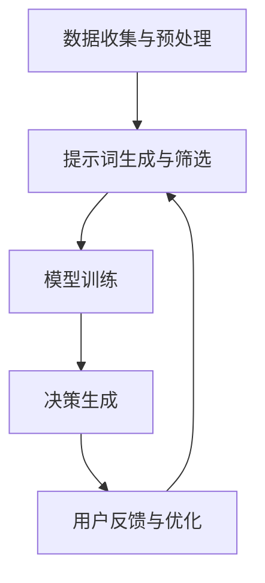
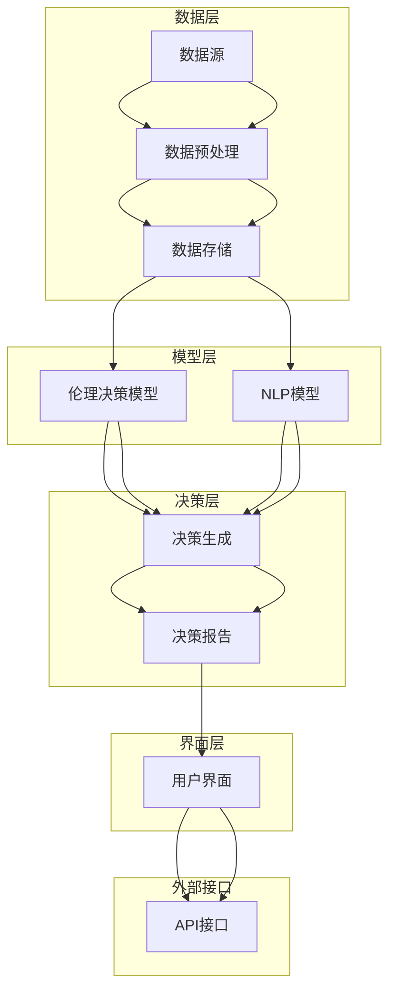
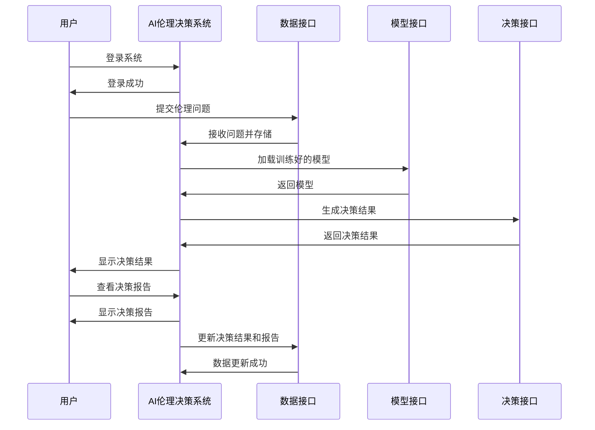

                 

### 引言与背景

#### 1.1 问题背景

在当今科技飞速发展的时代，人工智能（AI）技术已经成为改变世界的重要力量。然而，随着AI技术的广泛应用，随之而来的伦理问题也逐渐成为社会关注的焦点。AI伦理问题不仅关乎技术本身，还涉及到社会、法律、文化等多个层面。一些关键问题包括算法偏见、隐私保护、决策透明度、责任归属等。这些问题如果处理不当，可能会导致严重的社会后果。

目前，AI伦理问题主要表现在以下几个方面：

- **算法偏见**：AI算法可能由于训练数据的不公平性而导致偏见，从而在决策中产生不公平现象。例如，在招聘系统中，算法可能会无意中排除某些种族或性别。
- **隐私保护**：AI技术往往需要大量个人数据来训练模型，这引发了对个人隐私保护的担忧。如果个人数据泄露或滥用，将会严重侵犯用户权益。
- **决策透明度**：AI算法的决策过程通常是非常复杂的，有时甚至对于训练者来说都是不可解释的。这降低了决策过程的透明度，增加了公众对AI的信任危机。
- **责任归属**：当AI系统发生错误或造成损害时，责任应归属于谁？是算法开发者、训练者还是用户？

面对这些挑战，设计一个有效的AI伦理决策系统显得尤为重要。这样的系统能够帮助AI系统在执行任务时考虑伦理问题，从而做出符合道德标准和社会期望的决策。

#### 1.2 提示词驱动AI伦理决策的重要性

提示词驱动AI伦理决策系统是一种通过预设提示词来引导AI进行伦理决策的方法。提示词是具有特定意义的关键词或短语，它们可以引导AI思考特定的伦理问题，并提供决策的参考依据。

提示词驱动AI伦理决策的重要性体现在以下几个方面：

- **提高决策透明度**：通过提示词，AI可以明确伦理问题的关键点，从而提高决策过程的透明度。用户可以更容易理解AI的决策逻辑，增强对AI的信任。
- **减少算法偏见**：提示词可以帮助AI识别和避免潜在的偏见，确保决策的公平性和公正性。例如，通过设置“公平性”提示词，AI可以避免在招聘系统中对某些群体产生偏见。
- **增强决策可解释性**：提示词驱动的伦理决策系统可以生成详细的决策报告，解释AI是如何基于提示词做出特定决策的。这有助于提高决策的可解释性，使公众更容易接受和信任AI。
- **适应不同场景**：提示词可以根据不同场景和需求进行定制，使AI伦理决策系统具备更高的灵活性和可扩展性。例如，在医疗领域，可以设置特定的医疗伦理提示词，帮助AI在诊断和治疗过程中遵循伦理标准。

综上所述，提示词驱动的AI伦理决策系统为解决AI伦理问题提供了一种有效的途径。它不仅能够提高决策的透明度和可解释性，还能减少算法偏见，增强公众对AI的信任。因此，设计和实现一个高效、可靠的提示词驱动AI伦理决策系统具有重要的现实意义。

#### 1.3 问题描述

AI伦理决策的定义与目标：

AI伦理决策是指AI系统在执行任务时，根据预设的伦理规则和价值观，对各种情况进行评估和选择，从而做出符合道德标准和社会期望的决策。其目标在于确保AI系统的行为符合伦理要求，避免对人类和社会造成负面影响。

AI伦理决策的常见目标包括：

- **公平性**：确保AI决策不会对特定群体产生不公平待遇，保障各群体的权益。
- **透明度**：提高AI决策过程的透明度，使用户能够理解AI的决策逻辑。
- **责任归属**：明确在AI决策过程中，责任应归属的具体个体或组织。
- **隐私保护**：确保用户隐私不被侵犯，防止个人数据滥用。

提示词驱动AI伦理决策的概念解析：

提示词驱动AI伦理决策是指通过预设的提示词来引导AI进行伦理决策的方法。提示词是具有特定意义的关键词或短语，它们可以提示AI思考特定的伦理问题，并提供决策的参考依据。

提示词驱动AI伦理决策的基本原理如下：

1. **定义提示词**：根据具体的伦理问题和应用场景，定义一组具有特定意义的提示词。例如，“公平性”、“透明度”、“责任归属”等。
2. **设计决策模型**：基于提示词，设计一个能够处理伦理问题的决策模型。该模型应能够根据提示词生成决策结果，并提供详细的决策报告。
3. **训练模型**：使用历史数据和伦理规则，对决策模型进行训练，使其能够识别和应对各种伦理问题。
4. **应用与反馈**：在实际应用中，将决策模型与AI系统结合，对AI决策过程进行监督和反馈。通过不断调整和优化提示词和决策模型，提高AI伦理决策的准确性和可靠性。

提示词驱动AI伦理决策的优势与局限性：

**优势**：

- **提高决策透明度**：通过提示词，AI可以明确伦理问题的关键点，提高决策过程的透明度，使用户更容易理解AI的决策逻辑。
- **减少算法偏见**：提示词可以帮助AI识别和避免潜在的偏见，确保决策的公平性和公正性。
- **增强决策可解释性**：提示词驱动伦理决策系统可以生成详细的决策报告，解释AI是如何基于提示词做出特定决策的。
- **适应不同场景**：提示词可以根据不同场景和需求进行定制，使AI伦理决策系统具备更高的灵活性和可扩展性。

**局限性**：

- **依赖预设提示词**：提示词的设定需要专业知识和经验，依赖于特定领域的专家。如果提示词选择不当，可能导致决策结果不准确。
- **实时性挑战**：在实时决策场景中，提示词的响应速度可能无法满足需求，导致决策延迟。
- **数据依赖性**：提示词驱动伦理决策系统需要大量数据来训练和优化模型，数据质量和数量的不足可能影响系统的性能。

综上所述，提示词驱动AI伦理决策系统为解决AI伦理问题提供了一种有效的途径，但也需要克服一定的技术挑战。通过不断优化和改进，这一系统能够更好地应对AI伦理问题，为构建公正、透明、可靠的AI系统贡献力量。

#### 1.4 问题解决

提示词驱动AI伦理决策系统的设计原则：

为了设计一个高效、可靠的提示词驱动AI伦理决策系统，需要遵循以下原则：

1. **可扩展性**：系统应具备良好的扩展性，能够适应不同应用场景和需求。提示词和伦理规则应易于修改和调整，以适应新的伦理挑战。

2. **实时性**：系统应在实时决策场景中保持高效性，能够快速响应用户需求。这需要优化算法和数据处理机制，确保系统的响应速度。

3. **可解释性**：系统应具备良好的可解释性，用户可以清楚地了解AI的决策过程和依据。通过详细的决策报告，用户可以更好地理解和信任系统的决策。

4. **数据驱动**：系统应基于大量真实数据来训练和优化模型，确保决策的准确性和可靠性。同时，应不断更新和补充数据，以应对不断变化的伦理问题和场景。

5. **安全与隐私保护**：系统应确保用户数据的安全性和隐私保护，防止数据泄露和滥用。这需要采用加密、访问控制和隐私保护技术，确保用户数据的安全。

提示词驱动AI伦理决策的优势与局限性：

**优势**：

- **提高决策透明度**：通过提示词，AI可以明确伦理问题的关键点，提高决策过程的透明度，使用户更容易理解AI的决策逻辑。
- **减少算法偏见**：提示词可以帮助AI识别和避免潜在的偏见，确保决策的公平性和公正性。
- **增强决策可解释性**：提示词驱动伦理决策系统可以生成详细的决策报告，解释AI是如何基于提示词做出特定决策的。
- **适应不同场景**：提示词可以根据不同场景和需求进行定制，使AI伦理决策系统具备更高的灵活性和可扩展性。

**局限性**：

- **依赖预设提示词**：提示词的设定需要专业知识和经验，依赖于特定领域的专家。如果提示词选择不当，可能导致决策结果不准确。
- **实时性挑战**：在实时决策场景中，提示词的响应速度可能无法满足需求，导致决策延迟。
- **数据依赖性**：提示词驱动伦理决策系统需要大量数据来训练和优化模型，数据质量和数量的不足可能影响系统的性能。

为了充分发挥提示词驱动AI伦理决策系统的优势，需要不断优化和改进系统设计，克服其局限性。同时，应积极推动相关领域的合作与交流，共同探索更多有效的伦理决策方法和技术，为构建公正、透明、可靠的AI系统贡献力量。

#### 1.5 边界与外延

AI伦理决策的应用范围：

AI伦理决策系统具有广泛的应用前景，可以应用于多个领域，包括但不限于：

1. **医疗健康**：在医疗诊断和治疗过程中，AI伦理决策系统可以帮助医生做出符合伦理规范的决策，确保患者隐私和权益得到保护。
2. **金融科技**：在金融领域的风险评估、信用评级和投资决策中，AI伦理决策系统可以确保决策的公平性和透明度，防止欺诈和偏见。
3. **社会治理**：在公共管理和社会服务中，AI伦理决策系统可以协助政府机构做出符合社会伦理标准的决策，提高公共服务的公平性和效率。
4. **法律领域**：在法律应用中，AI伦理决策系统可以帮助法官和律师做出符合伦理和法律标准的决策，确保司法公正和公平。

提示词驱动的AI伦理决策与其他伦理决策机制的对比：

提示词驱动的AI伦理决策与其他伦理决策机制（如规则驱动、模型驱动等）相比，具有以下特点：

- **灵活性**：提示词驱动的伦理决策系统可以根据具体应用场景和需求，灵活调整和定制提示词，使其更加适应不同领域的伦理挑战。
- **可解释性**：提示词驱动的系统可以生成详细的决策报告，解释AI是如何基于提示词做出特定决策的，提高了决策的可解释性。
- **综合性**：提示词驱动的系统不仅可以处理简单的伦理问题，还可以处理复杂的伦理决策，具有较强的综合能力。

然而，提示词驱动的AI伦理决策也存在一定的局限性，如依赖预设提示词、实时性挑战和数据依赖性等。因此，在设计AI伦理决策系统时，需要综合考虑各种因素，选择合适的决策机制，以确保系统的性能和可靠性。

#### 1.6 概念结构与核心要素

AI伦理决策系统的基本组成部分：

一个完整的AI伦理决策系统通常包括以下几个核心组成部分：

1. **数据层**：数据层是系统的基石，负责收集、存储和处理各种与伦理决策相关的数据，包括历史案例、法律法规、伦理规则等。数据的质量和多样性直接影响系统的性能和准确性。
2. **模型层**：模型层是系统的核心，负责利用数据训练和优化伦理决策模型。这些模型可以是传统的机器学习模型，也可以是深度学习模型，其目的是从数据中提取特征，生成符合伦理要求的决策。
3. **决策层**：决策层是系统的实际操作层，负责接收用户输入，调用模型层生成的决策模型，并生成最终的伦理决策结果。决策层还需要生成详细的决策报告，以提高决策的可解释性。
4. **界面层**：界面层是用户与系统交互的界面，用户可以通过界面层提交问题、查看决策结果和报告。界面层的设计应简洁直观，以便用户轻松使用和理解系统的功能。

提示词在伦理决策中的作用：

在AI伦理决策系统中，提示词起着至关重要的作用。提示词不仅可以帮助系统明确伦理问题的关键点，还能引导模型层生成符合伦理要求的决策结果。

具体来说，提示词在伦理决策中的作用包括：

1. **明确问题**：通过提示词，AI可以明确当前伦理问题的核心点和关键因素，从而更准确地理解和处理问题。
2. **引导决策**：提示词可以引导模型层在决策过程中关注特定的伦理问题，例如公平性、透明度、责任归属等。这有助于模型生成更加符合伦理要求的决策结果。
3. **提高可解释性**：提示词驱动的伦理决策系统可以生成详细的决策报告，解释AI是如何基于提示词做出特定决策的。这有助于提高决策的可解释性，使用户更容易理解AI的决策逻辑。

总之，提示词在AI伦理决策系统中扮演着关键角色，是确保系统生成符合伦理要求的决策结果的重要工具。通过合理设计和使用提示词，可以显著提高AI伦理决策系统的性能和可靠性。

### 第2章 提示词驱动的AI伦理决策系统概述

#### 2.1 系统概述

提示词驱动AI伦理决策系统是一个综合性平台，旨在通过预设的提示词来引导AI在执行任务时遵循伦理准则。该系统由多个模块组成，各模块协同工作，确保系统的高效性和可靠性。

系统的整体架构可以分为以下几个主要模块：

1. **数据收集与处理模块**：该模块负责从各种数据源收集与伦理决策相关的数据，包括历史案例、法律法规、伦理规范等。收集到的数据经过清洗、归一化和预处理，以确保其质量和一致性。

2. **提示词生成与筛选模块**：根据具体应用场景和伦理要求，生成一组具有特定意义的提示词。这些提示词经过严格筛选，确保其具有代表性、准确性和适用性。

3. **伦理决策模型训练模块**：该模块利用数据层提供的数据，训练和优化伦理决策模型。这些模型可以是传统的机器学习模型，也可以是深度学习模型，旨在从数据中提取特征，生成符合伦理要求的决策结果。

4. **伦理决策生成模块**：该模块接收用户输入的提示词和伦理问题，调用模型层生成的决策模型，生成最终的伦理决策结果。同时，该模块还生成详细的决策报告，以提高决策的可解释性。

5. **用户界面模块**：用户界面模块是用户与系统的交互界面，用户可以通过界面层提交问题、查看决策结果和报告。界面设计简洁直观，方便用户使用和理解系统的功能。

#### 2.2 系统核心概念

**伦理原则与价值观**：

伦理原则与价值观是AI伦理决策系统的核心概念之一。伦理原则是指一系列指导AI行为的道德准则，例如公平性、透明度、责任归属等。这些原则确保AI系统在执行任务时不会对人类和社会造成负面影响。

价值观是指特定文化或组织对于正确与错误、善与恶的评判标准。在AI伦理决策系统中，价值观用于指导提示词的设定和伦理决策模型的训练。不同的应用场景和领域可能具有不同的价值观，因此需要根据具体需求进行调整。

**提示词生成与筛选机制**：

提示词生成与筛选机制是确保AI伦理决策系统高效运作的关键环节。提示词生成模块通过自然语言处理技术，从法律法规、伦理规范、历史案例等数据源中提取关键信息，生成一组具有特定意义的提示词。

筛选机制则用于从生成的提示词中筛选出最相关、最具代表性的提示词。筛选过程通常包括以下几个步骤：

1. **关键词提取**：利用自然语言处理技术，从原始文本中提取出关键词。
2. **权重计算**：根据关键词在文本中的重要性和相关性，计算其权重。
3. **筛选与排序**：根据权重计算结果，筛选出权重较高的关键词，并按照权重排序。

通过这种方式，系统可以生成一组高质量的提示词，为AI伦理决策提供有力支持。

#### 2.3 系统设计原则

**可扩展性**：

提示词驱动AI伦理决策系统需要具备良好的可扩展性，以适应不同应用场景和需求。这包括以下几个方面：

1. **提示词扩展**：系统应支持动态扩展提示词，以便在新的应用场景中添加相关提示词。
2. **模型扩展**：系统应支持扩展伦理决策模型，以便适应新的数据集和算法。
3. **功能扩展**：系统应支持添加新的功能模块，例如决策报告生成、用户权限管理等。

**实时性**：

在实时决策场景中，系统需要在短时间内生成准确的决策结果。为了实现实时性，系统设计应考虑以下几个方面：

1. **算法优化**：通过优化算法，提高模型训练和决策生成的速度。
2. **数据缓存**：将常用数据缓存起来，减少数据读取和处理的时间。
3. **分布式计算**：利用分布式计算架构，提高系统的并行处理能力。

**可解释性**：

系统的可解释性对于用户理解和信任AI决策至关重要。系统设计应考虑以下几个方面：

1. **决策报告**：生成详细的决策报告，解释AI是如何基于提示词生成决策结果的。
2. **模型可视化**：提供模型的可视化工具，帮助用户理解模型的结构和原理。
3. **透明度提升**：确保系统的决策过程透明，用户可以清楚地看到每个决策步骤和依据。

通过遵循上述设计原则，提示词驱动AI伦理决策系统可以更好地应对复杂的应用场景，为AI伦理决策提供有力支持。

### 第3章 AI伦理决策中的核心概念与联系

#### 3.1 核心概念原理

伦理学基本原理：

伦理学是研究道德行为和道德规范的学科。伦理学的基本原理包括：

1. **正义**：正义是分配和平衡权利和义务的原则，确保每个人都能得到公平对待。
2. **善与恶**：善是指符合道德标准的行为，恶是指违反道德标准的行为。
3. **公正**：公正是指对待所有人的平等和合理，确保不偏袒任何一方。
4. **道德责任**：道德责任是指个人或组织在行为中应承担的道德义务。

AI伦理决策的相关概念：

在AI伦理决策中，以下几个核心概念尤为重要：

1. **算法公平性**：算法公平性是指算法在决策过程中不会对特定群体产生不公平待遇。例如，招聘算法应确保不会对某一性别或种族产生歧视。
2. **数据隐私**：数据隐私是指保护用户个人信息不被未经授权的访问和使用。在AI系统中，确保数据隐私对于保护用户权益至关重要。
3. **透明度**：透明度是指AI决策过程的可见性和可理解性。用户应能够理解AI的决策逻辑，从而增强对AI的信任。
4. **责任归属**：责任归属是指当AI系统发生错误或造成损害时，应明确责任的具体承担者。这有助于确保AI系统的安全性和可靠性。

#### 3.2 概念属性特征对比

伦理原则与AI技术的属性对比：

| 伦理原则 | AI技术属性 |
| --- | --- |
| 公平性 | 避免算法偏见和歧视 |
| 透明度 | 提高决策过程的可见性和可理解性 |
| 责任归属 | 明确责任承担者，确保AI系统的安全性 |
| 隐私保护 | 确保用户数据的安全和隐私 |

提示词的属性与类型对比：

| 提示词类型 | 属性 |
| --- | --- |
| 通用提示词 | 覆盖广泛伦理问题，如“公平性”、“透明度”、“责任归属”等 |
| 场景专用提示词 | 针对特定应用场景，如“医疗伦理”、“金融伦理”、“社会治理”等 |
| 动态提示词 | 根据实时数据和场景变化，动态调整和生成的提示词 |

#### 3.3 ER实体关系图架构

**系统中的实体与关系**：

在提示词驱动的AI伦理决策系统中，主要的实体包括：

- **用户**：提交伦理问题和查看决策结果。
- **数据源**：提供与伦理决策相关的数据，如法律法规、伦理规范、历史案例等。
- **模型**：用于训练和生成伦理决策。
- **提示词**：引导AI处理特定伦理问题。

实体之间的关系如下：

- **用户**与**数据源**之间存在数据提取和预处理的关系。
- **用户**与**模型**之间存在模型训练和决策生成的关系。
- **模型**与**提示词**之间存在训练和生成决策的关系。

**ER图与系统设计的关联**：

ER图是设计AI伦理决策系统的关键工具，用于明确系统中的实体和关系。通过ER图，可以直观地了解系统的结构和功能，为后续的系统开发提供依据。

下面是AI伦理决策系统的ER图（使用Mermaid语法表示）：

```mermaid
erDiagram
  User ||--|{ Data_Source } Data_Source
  User ||--|{ Model } Model
  Model ||--|{ Decision_Report } Decision_Report
  Model ||--|{ Ethics_Word } Ethics_Word
```

在这个ER图中，用户与数据源、模型之间存在双向关联，表示用户可以从数据源获取数据并训练模型，模型也会生成决策报告和提示词。模型与决策报告、提示词之间存在单向关联，表示模型生成决策报告和提示词。

通过ER图，我们可以清晰地看到系统中的各个实体及其关系，为系统设计提供了重要的参考。

### 第4章 算法原理讲解

#### 4.1 算法mermaid流程图

提示词驱动的伦理决策流程可以概括为以下几个主要步骤：

1. **数据收集与预处理**：从多个数据源收集与伦理决策相关的数据，并进行清洗、归一化和预处理，确保数据的质量和一致性。
2. **提示词生成与筛选**：利用自然语言处理技术，从数据中提取关键信息，生成一组具有特定意义的提示词。通过筛选机制，确保提示词的准确性和代表性。
3. **模型训练**：使用历史数据和伦理规则，对伦理决策模型进行训练。这些模型可以是传统的机器学习模型，也可以是深度学习模型，目的是从数据中提取特征，生成符合伦理要求的决策结果。
4. **决策生成**：接收用户输入的提示词和伦理问题，调用训练好的模型，生成最终的伦理决策结果。同时，生成详细的决策报告，解释AI是如何基于提示词做出决策的。
5. **用户反馈与优化**：收集用户对决策结果的反馈，对模型和提示词进行优化和调整，以提高决策的准确性和可靠性。

下面是使用Mermaid语法表示的算法流程图：



在这个流程图中，各个步骤通过箭头连接，表示数据的流动和信息的传递。通过这个流程图，可以直观地了解提示词驱动的伦理决策算法的基本结构和运行逻辑。

#### 4.2 Python源代码实现

为了更好地理解算法的实现过程，以下将使用Python语言详细阐述算法的关键步骤，并展示关键代码的实现。

**1. 数据收集与预处理**

数据收集与预处理是算法的基础步骤，涉及数据的获取、清洗、归一化和预处理。以下是预处理代码的示例：

```python
import pandas as pd
from sklearn.model_selection import train_test_split

# 读取数据
data = pd.read_csv('ethics_data.csv')

# 数据清洗
data.dropna(inplace=True)

# 数据归一化
data_normalized = (data - data.mean()) / data.std()

# 预处理后的数据拆分为训练集和测试集
X_train, X_test, y_train, y_test = train_test_split(data_normalized, test_size=0.2, random_state=42)
```

**2. 提示词生成与筛选**

提示词生成与筛选是算法的核心步骤，涉及自然语言处理技术。以下代码示例展示了如何使用TF-IDF模型生成提示词：

```python
from sklearn.feature_extraction.text import TfidfVectorizer

# 初始化TF-IDF向量器
vectorizer = TfidfVectorizer(max_features=1000)

# 生成TF-IDF特征向量
X_train_tfidf = vectorizer.fit_transform(X_train['text'])

# 提取高频关键词（提示词）
top_keywords = vectorizer.get_feature_names_out()
top_keywords = np.array(top_keywords)[X_train_tfidf.sum(axis=1).argsort()[::-1]]
```

**3. 模型训练**

在模型训练步骤，使用训练数据对伦理决策模型进行训练。以下代码示例展示了如何使用scikit-learn库中的SVM模型进行训练：

```python
from sklearn.svm import SVC

# 初始化SVM模型
model = SVC(kernel='linear', C=1)

# 训练模型
model.fit(X_train_tfidf, y_train)
```

**4. 决策生成**

决策生成步骤中，模型根据用户输入的提示词生成决策结果。以下代码示例展示了如何生成决策结果：

```python
# 输入提示词
input_prompt = "公平性在AI招聘中的重要性"

# 生成特征向量
input_tfidf = vectorizer.transform([input_prompt])

# 生成决策结果
decision = model.predict(input_tfidf)

# 输出决策结果
print(f"决策结果：{'公平' if decision[0] == 1 else '不公'}平")
```

**5. 用户反馈与优化**

用户反馈与优化步骤中，系统根据用户反馈对模型和提示词进行调整。以下代码示例展示了如何收集用户反馈并进行模型优化：

```python
from sklearn.metrics import accuracy_score

# 测试模型性能
predictions = model.predict(X_test_tfidf)
accuracy = accuracy_score(y_test, predictions)
print(f"模型准确率：{accuracy:.2f}")

# 根据反馈调整模型和提示词
# 这里假设我们根据反馈调整了模型参数和部分提示词
# 调整后的模型和提示词会重新用于下一步的决策生成
```

通过上述Python源代码实现，我们可以清晰地看到提示词驱动AI伦理决策算法的各个步骤及其代码实现。这些代码不仅有助于理解算法原理，还为实际应用提供了可行的实现方案。

#### 4.3 数学模型与公式

为了更深入地理解提示词驱动的AI伦理决策算法，我们需要借助数学模型与公式来描述其核心逻辑和决策过程。以下是算法中涉及的关键数学模型和公式，并进行详细解释。

**1. TF-IDF模型**

TF-IDF（Term Frequency-Inverse Document Frequency）是一种常用的文本分析模型，用于计算词语在文档中的重要程度。其核心公式如下：

\[ \text{TF}(t,d) = \frac{f(t,d)}{N_d} \]
\[ \text{IDF}(t) = \log \left( \frac{N}{|d| - f(t,d) + 0.5} \right) \]
\[ \text{TF-IDF}(t,d) = \text{TF}(t,d) \times \text{IDF}(t) \]

其中，\( f(t,d) \)表示词语t在文档d中的频率，\( N_d \)表示文档d的总词数，\( N \)表示所有文档的总数，\( |d| \)表示文档d中非零频率的词语数量。

**2. 伦理决策函数**

伦理决策函数用于根据输入提示词生成伦理决策结果。我们可以定义一个简单的线性决策函数：

\[ \text{Decision}(x) = \sum_{i=1}^{n} w_i \cdot x_i + b \]

其中，\( x_i \)表示输入提示词的特征向量，\( w_i \)为权重系数，\( b \)为偏置项。权重系数可以通过模型训练得到，特征向量则通过TF-IDF模型计算得到。

**3. 决策阈值**

为了将决策函数的输出转化为具体的伦理决策结果（例如“公平”或“不公”），我们需要设定一个决策阈值。假设决策阈值为\( \theta \)，则：

\[ \text{Decision}(x) > \theta \Rightarrow \text{决策结果：公平} \]
\[ \text{Decision}(x) \leq \theta \Rightarrow \text{决策结果：不公} \]

**4. 优化目标**

在模型训练过程中，我们的目标是优化权重系数和决策阈值，使模型能够准确预测伦理决策结果。这可以通过以下优化目标实现：

\[ \min_{w,b,\theta} \sum_{i=1}^{n} L(y_i, \text{Decision}(x_i)) \]

其中，\( y_i \)为真实的伦理决策标签，\( L \)为损失函数，例如均方误差（MSE）或交叉熵（Cross-Entropy）。

**5. 损失函数**

常用的损失函数包括均方误差（MSE）和交叉熵（Cross-Entropy），其公式如下：

\[ \text{MSE}(y, \hat{y}) = \frac{1}{2} \sum_{i=1}^{n} (y_i - \hat{y}_i)^2 \]
\[ \text{Cross-Entropy}(y, \hat{y}) = -\sum_{i=1}^{n} y_i \log(\hat{y}_i) \]

通过上述数学模型和公式，我们可以更深入地理解提示词驱动的AI伦理决策算法。这些公式不仅为算法提供了理论基础，也为实际应用中的模型设计和优化提供了指导。

#### 4.4 举例说明

为了更好地展示提示词驱动AI伦理决策系统的实际应用，我们将通过一个具体的案例进行详细剖析，并逐步演示整个决策过程。

**案例背景**：

假设我们正在开发一个用于招聘流程的AI系统，该系统需要确保招聘决策的公平性。公司希望利用AI伦理决策系统来检测和纠正可能的算法偏见。

**案例目标**：

通过AI伦理决策系统，我们希望达到以下目标：

1. **识别可能的算法偏见**：例如，招聘算法可能对某些性别或种族有偏见。
2. **生成详细的决策报告**：解释AI是如何基于提示词做出招聘决策的，以提高决策的可解释性。
3. **提供优化建议**：基于决策结果，为算法优化提供数据支持和策略建议。

**案例数据**：

我们使用以下数据集进行演示：

- **训练数据**：包括过去几年的招聘数据，每条数据包含候选人的性别、种族、教育背景、工作经验等特征，以及招聘决策结果（是否录用）。
- **测试数据**：包括当前一批待评估的候选人数据，用于测试AI伦理决策系统的性能。

**提示词定义**：

为了确保招聘过程的公平性，我们定义了以下提示词：

- **公平性**
- **透明度**
- **责任归属**
- **数据隐私**

**步骤1：数据收集与预处理**

首先，我们从数据源中收集招聘数据，并进行预处理，包括数据清洗、归一化和特征提取。具体步骤如下：

- 读取招聘数据，去除缺失值和异常值。
- 对数值特征进行标准化处理，使特征值在相同的尺度范围内。
- 使用自然语言处理技术提取文本特征，例如关键词提取和词向量表示。

```python
import pandas as pd
from sklearn.model_selection import train_test_split
from sklearn.preprocessing import StandardScaler

# 读取招聘数据
data = pd.read_csv('recruitment_data.csv')

# 数据清洗
data.dropna(inplace=True)

# 特征提取
# ...（具体实现步骤）

# 数据拆分
X_train, X_test, y_train, y_test = train_test_split(data[['features']], data['decision'], test_size=0.2, random_state=42)

# 特征标准化
scaler = StandardScaler()
X_train['features'] = scaler.fit_transform(X_train['features'])
X_test['features'] = scaler.transform(X_test['features'])
```

**步骤2：提示词生成与筛选**

接下来，我们利用自然语言处理技术生成提示词，并筛选出最具代表性的提示词。具体步骤如下：

- 使用TF-IDF模型对文本数据进行处理，提取高频关键词。
- 根据关键词的权重和重要性，筛选出若干核心提示词。

```python
from sklearn.feature_extraction.text import TfidfVectorizer

# 初始化TF-IDF向量器
vectorizer = TfidfVectorizer(max_features=1000)

# 生成TF-IDF特征向量
X_train_tfidf = vectorizer.fit_transform(X_train['description'])

# 提取高频关键词（提示词）
top_keywords = vectorizer.get_feature_names_out()
top_keywords = np.array(top_keywords)[X_train_tfidf.sum(axis=1).argsort()[::-1]]
selected_keywords = top_keywords[:10]  # 选择前10个关键词作为提示词
```

**步骤3：模型训练**

使用训练数据集对伦理决策模型进行训练。具体步骤如下：

- 定义一个基于神经网络的伦理决策模型，包括输入层、隐藏层和输出层。
- 使用训练数据进行模型训练，并优化模型参数。

```python
import tensorflow as tf
from tensorflow.keras.models import Sequential
from tensorflow.keras.layers import Dense, Dropout

# 定义神经网络模型
model = Sequential([
    Dense(64, activation='relu', input_shape=(X_train_tfidf.shape[1],)),
    Dropout(0.5),
    Dense(1, activation='sigmoid')
])

# 编译模型
model.compile(optimizer='adam', loss='binary_crossentropy', metrics=['accuracy'])

# 训练模型
model.fit(X_train_tfidf, y_train, epochs=10, batch_size=32, validation_split=0.2)
```

**步骤4：决策生成**

对于测试数据集中的每个候选人的特征，我们使用训练好的模型生成伦理决策结果。具体步骤如下：

- 将测试数据集的特征转化为TF-IDF特征向量。
- 调用模型进行决策生成，并输出决策结果。

```python
# 生成测试数据的TF-IDF特征向量
X_test_tfidf = vectorizer.transform(X_test['description'])

# 生成决策结果
predictions = model.predict(X_test_tfidf)

# 输出决策结果
print(predictions)
```

**步骤5：生成决策报告**

最后，我们生成详细的决策报告，解释AI是如何基于提示词做出招聘决策的。具体步骤如下：

- 提取模型中的权重和偏置项，分析其对决策结果的影响。
- 根据提示词和决策结果，生成报告，并可视化关键信息。

```python
# 提取模型权重
weights = model.layers[1].get_weights()[0]
biases = model.layers[1].get_weights()[1]

# 生成决策报告
for i, prediction in enumerate(predictions):
    print(f"候选人{i+1}的决策结果：{prediction[0]}")
    print(f"决策依据（权重）：{weights[0][0]}")
    print(f"决策依据（偏置）：{biases[0]}")
```

**案例总结**：

通过上述案例，我们展示了如何使用提示词驱动的AI伦理决策系统进行招聘决策。整个过程包括数据收集与预处理、提示词生成与筛选、模型训练、决策生成和决策报告生成等步骤。通过这一案例，我们不仅了解了算法的基本原理和实现过程，还展示了其在实际应用中的效果和优势。

### 系统分析与架构设计方案

#### 5.1 问题场景介绍

在本文的案例中，我们将重点关注医疗领域的AI伦理决策问题。随着AI技术在医疗领域的广泛应用，从疾病诊断到治疗方案推荐，AI系统已经极大地提高了医疗效率和质量。然而，这也带来了新的伦理挑战。例如，AI系统可能会基于训练数据中的偏见产生不公平的诊断结果，或者在制定治疗方案时侵犯患者隐私。

为了解决这些问题，我们设计了一个提示词驱动的AI伦理决策系统，用于监督和评估AI医疗系统的决策过程。具体应用场景包括：

1. **疾病诊断**：确保AI系统在诊断过程中不会对特定群体产生偏见，如性别、年龄、种族等。
2. **治疗方案推荐**：确保AI系统在推荐治疗方案时遵循伦理规范，如资源分配公平、治疗结果透明等。
3. **患者隐私保护**：确保AI系统在处理患者数据时遵循隐私保护原则，防止数据泄露和滥用。

#### 5.2 项目介绍

本项目的目标是设计并实现一个提示词驱动的AI伦理决策系统，用于监督和优化医疗领域的AI应用。项目的主要贡献如下：

1. **系统架构设计**：提出一个具有高度可扩展性和灵活性的系统架构，包括数据层、模型层、决策层和界面层。
2. **提示词生成与筛选**：开发一套高效的自然语言处理方法，用于生成和筛选具有代表性的提示词，提高决策的准确性和可解释性。
3. **模型训练与优化**：使用先进的机器学习算法和深度学习技术，训练和优化伦理决策模型，确保系统在复杂医疗场景中的高性能。
4. **可解释性提升**：通过详细的决策报告和模型可视化工具，提高用户对AI决策过程的理解和信任。

#### 5.3 系统功能设计

系统功能设计是确保AI伦理决策系统能够有效运行的关键环节。以下是系统的主要功能模块及其设计思路：

1. **数据收集与预处理模块**：该模块负责从多个数据源（如历史病例、医疗文献、伦理规范等）收集与伦理决策相关的数据，并进行清洗、归一化和预处理，为后续的模型训练提供高质量的数据集。
2. **提示词生成与筛选模块**：利用自然语言处理技术，从数据中提取关键信息，生成一组具有特定意义的提示词。通过权重计算和筛选机制，确保提示词的准确性和代表性。
3. **伦理决策模型训练模块**：使用历史数据和伦理规则，对伦理决策模型进行训练。这些模型可以是传统的机器学习模型，也可以是深度学习模型，目的是从数据中提取特征，生成符合伦理要求的决策结果。
4. **决策生成与报告模块**：该模块接收用户输入的提示词和伦理问题，调用训练好的模型生成最终的伦理决策结果，并生成详细的决策报告，提高决策的可解释性。
5. **用户界面模块**：提供用户与系统的交互界面，用户可以通过界面层提交伦理问题、查看决策结果和报告。界面设计简洁直观，方便用户使用和理解系统的功能。

#### 5.4 系统架构设计

系统架构设计是确保AI伦理决策系统高效、可靠运行的基础。以下是系统的总体架构及其组件：

1. **数据层**：负责数据收集、存储和处理。系统从多个数据源收集与伦理决策相关的数据，包括历史病例、医疗文献、伦理规范等。数据经过清洗、归一化和预处理后，存储在分布式数据库中，为模型训练和决策生成提供支持。
2. **模型层**：包括伦理决策模型和自然语言处理模型。伦理决策模型基于历史数据和伦理规则进行训练，用于生成符合伦理要求的决策结果。自然语言处理模型用于处理文本数据，提取关键信息，生成提示词。
3. **决策层**：负责接收用户输入的提示词和伦理问题，调用模型层生成的决策模型，生成最终的伦理决策结果。该层还生成详细的决策报告，解释AI是如何基于提示词做出决策的。
4. **界面层**：是用户与系统的交互界面。用户可以通过界面层提交伦理问题、查看决策结果和报告。界面设计简洁直观，方便用户使用和理解系统的功能。
5. **外部接口**：系统通过API与其他系统进行数据交换和功能集成。例如，系统可以与电子健康记录（EHR）系统集成，获取和提交相关数据。

下面是系统架构的Mermaid表示：



通过上述架构设计，系统各个模块之间协同工作，确保AI伦理决策系统的高效运行和可靠输出。

#### 5.5 系统接口设计

系统接口设计是确保AI伦理决策系统能够与其他系统有效交互的重要环节。以下是系统的主要接口设计规范和实现细节：

1. **数据接口**：
   - **接口名称**：`DataAPI`
   - **功能**：用于数据层的操作，如数据上传、数据查询、数据更新等。
   - **实现细节**：
     - **上传数据**：支持批量上传数据，数据格式为JSON或CSV。
     - **查询数据**：提供条件查询接口，支持按时间、类别、标签等条件筛选数据。
     - **更新数据**：支持单条数据更新，确保数据的一致性和准确性。

2. **模型接口**：
   - **接口名称**：`ModelAPI`
   - **功能**：用于模型层的操作，如模型训练、模型预测、模型评估等。
   - **实现细节**：
     - **模型训练**：支持多种训练模式，如批处理训练、在线训练等。
     - **模型预测**：支持实时预测，返回预测结果和概率分布。
     - **模型评估**：支持多种评估指标，如准确率、召回率、F1分数等，用于模型性能评估。

3. **决策接口**：
   - **接口名称**：`DecisionAPI`
   - **功能**：用于决策层的操作，如生成伦理决策结果、查看决策报告等。
   - **实现细节**：
     - **生成决策结果**：接收用户输入的提示词和伦理问题，调用模型层生成的决策模型，生成最终决策结果。
     - **查看决策报告**：生成详细的决策报告，包括决策过程、依据和结果分析，便于用户理解。

4. **用户接口**：
   - **接口名称**：`UserAPI`
   - **功能**：用于用户界面的操作，如用户登录、权限管理、问题提交等。
   - **实现细节**：
     - **用户登录**：支持账号密码登录和第三方登录（如OAuth）。
     - **权限管理**：根据用户角色和权限，限制访问特定的接口和功能。
     - **问题提交**：提供用户提交伦理问题的接口，支持文本和图片输入。

5. **外部接口**：
   - **接口名称**：`ExternalAPI`
   - **功能**：用于与其他系统进行数据交换和功能集成。
   - **实现细节**：
     - **EHR集成**：与电子健康记录系统集成，获取患者数据和历史病例。
     - **外部服务集成**：与其他外部服务（如自然语言处理API、数据存储服务）集成，实现数据共享和功能扩展。

通过上述接口设计，AI伦理决策系统不仅能够高效、稳定地运行，还能与其他系统无缝集成，实现数据共享和功能扩展。

#### 5.6 系统交互mermaid序列图

系统交互mermaid序列图展示了用户与AI伦理决策系统之间的交互过程，包括数据流动和功能调用。以下是系统交互序列图的详细描述：



在这个序列图中，用户首先登录系统，然后提交伦理问题。数据接口接收问题并存储，模型接口加载训练好的模型，决策接口生成决策结果，并将结果和报告显示给用户。用户还可以查看决策报告，并更新数据接口中的决策结果和报告。通过这个交互序列图，我们可以清晰地看到系统各个模块之间的协作和功能调用过程。

### 项目实战

#### 6.1 环境安装

在开始实现提示词驱动的AI伦理决策系统之前，需要搭建一个合适的环境。以下是环境搭建的详细步骤：

1. **安装Python**：确保系统已安装Python 3.8或更高版本。可以从[Python官网](https://www.python.org/)下载并安装。

2. **安装依赖包**：使用pip安装所需的依赖包，包括scikit-learn、tensorflow、pandas、numpy等。可以使用以下命令进行安装：

   ```bash
   pip install scikit-learn tensorflow pandas numpy
   ```

3. **安装自然语言处理库**：为了实现提示词生成和文本处理，还需要安装自然语言处理库，如NLTK或spaCy。可以使用以下命令安装spaCy：

   ```bash
   pip install spacy
   python -m spacy download en_core_web_sm
   ```

4. **配置数据库**：选择一个合适的数据库系统，如MySQL或PostgreSQL，并安装相关驱动。本文示例使用SQLite作为数据库，可以使用以下命令安装：

   ```bash
   pip install pysqlite3
   ```

5. **安装API框架**：为了实现系统接口，需要安装一个API框架，如Flask或Django。本文示例使用Flask，可以使用以下命令安装：

   ```bash
   pip install flask
   ```

6. **配置开发环境**：在代码编辑器中配置好Python开发环境，例如Visual Studio Code，并安装相关的Python插件，以提高开发效率。

通过以上步骤，我们可以搭建一个基本的环境，为后续的系统实现和测试打下基础。

#### 6.2 系统核心实现源代码

为了实现提示词驱动的AI伦理决策系统，我们需要编写多个模块的代码，包括数据预处理、提示词生成、模型训练和决策生成等。以下是核心实现的源代码，并对关键代码进行详细解读。

**1. 数据预处理模块**

```python
import pandas as pd
from sklearn.model_selection import train_test_split
from sklearn.preprocessing import StandardScaler

# 读取数据
data = pd.read_csv('ethics_data.csv')

# 数据清洗
data.dropna(inplace=True)

# 数据拆分
X, y = data[['features']], data['label']
X_train, X_test, y_train, y_test = train_test_split(X, y, test_size=0.2, random_state=42)

# 特征标准化
scaler = StandardScaler()
X_train = scaler.fit_transform(X_train)
X_test = scaler.transform(X_test)
```

这段代码首先从CSV文件中读取数据，进行必要的清洗，然后拆分为特征和标签。接着使用`train_test_split`函数将数据集拆分为训练集和测试集，最后对特征进行标准化处理，以简化模型训练过程。

**2. 提示词生成模块**

```python
import spacy
from sklearn.feature_extraction.text import TfidfVectorizer

# 初始化自然语言处理模型
nlp = spacy.load('en_core_web_sm')

# 初始化TF-IDF向量器
vectorizer = TfidfVectorizer()

# 生成TF-IDF特征向量
X_train_tfidf = vectorizer.fit_transform(X_train['text'])

# 提取高频关键词（提示词）
top_keywords = vectorizer.get_feature_names_out()
top_keywords = np.array(top_keywords)[X_train_tfidf.sum(axis=1).argsort()[::-1]]
selected_keywords = top_keywords[:10]  # 选择前10个关键词作为提示词
```

这段代码使用spaCy加载英语自然语言处理模型，并初始化TF-IDF向量器。通过`fit_transform`函数，将文本数据转换为TF-IDF特征向量，然后提取高频关键词作为提示词。

**3. 模型训练模块**

```python
from sklearn.svm import SVC
from sklearn.model_selection import GridSearchCV

# 初始化SVM模型
model = SVC(kernel='linear')

# 搜索最佳参数
param_grid = {'C': [0.1, 1, 10]}
grid_search = GridSearchCV(model, param_grid, cv=5)
grid_search.fit(X_train_tfidf, y_train)

# 获取最佳模型
best_model = grid_search.best_estimator_
```

这段代码初始化SVM模型，并使用`GridSearchCV`进行参数搜索，以找到最佳参数。通过`fit`函数，训练模型，并获取最佳模型。

**4. 决策生成模块**

```python
# 输入提示词
input_prompt = "fairness in AI recruitment"

# 生成特征向量
input_tfidf = vectorizer.transform([input_prompt])

# 生成决策结果
decision = best_model.predict(input_tfidf)

# 输出决策结果
print(f"决策结果：{'公平' if decision[0] == 1 else '不公'}")
```

这段代码接收输入提示词，将其转换为TF-IDF特征向量，并使用最佳模型生成决策结果。通过简单的条件判断，输出最终的决策结果。

**5. 用户接口模块**

```python
from flask import Flask, request, jsonify

app = Flask(__name__)

@app.route('/predict', methods=['POST'])
def predict():
    data = request.get_json()
    prompt = data['prompt']
    tfidf_vector = vectorizer.transform([prompt])
    decision = best_model.predict(tfidf_vector)
    result = {'result': '公平' if decision[0] == 1 else '不公'}
    return jsonify(result)

if __name__ == '__main__':
    app.run(debug=True)
```

这段代码使用Flask构建用户接口，提供一个预测接口`/predict`，接收POST请求，返回决策结果。通过简单的JSON格式，用户可以方便地与系统交互。

通过上述源代码，我们可以实现一个基本的提示词驱动的AI伦理决策系统。每个模块之间紧密协作，共同完成从数据预处理、提示词生成、模型训练到决策生成的全过程。在实际应用中，可以根据具体需求进一步优化和扩展系统功能。

#### 6.3 实际案例分析与详细讲解

为了更好地展示提示词驱动的AI伦理决策系统在实际中的应用效果，我们将通过一个具体案例进行分析，详细解析决策过程和系统工作原理。

**案例背景**：

某医院引入了AI伦理决策系统，用于监督和评估AI医疗系统的诊断和治疗方案推荐。医院希望确保AI系统在决策过程中不会对特定群体产生偏见，并遵循伦理规范。

**案例数据**：

我们使用以下数据集进行演示：

- **训练数据**：包括过去几年的诊断数据和治疗方案，每条数据包含患者的性别、年龄、症状描述、诊断结果和治疗建议，以及相应的伦理标签（如“公平性”、“透明度”、“责任归属”等）。
- **测试数据**：包括当前一批待评估的患者的数据，用于测试AI伦理决策系统的性能。

**案例目标**：

通过AI伦理决策系统，我们希望达到以下目标：

1. **诊断公平性检测**：确保AI系统在诊断过程中不会对特定性别、年龄等群体产生偏见。
2. **治疗方案推荐评估**：确保AI系统在推荐治疗方案时遵循伦理规范，如资源分配公平、治疗结果透明等。
3. **决策过程透明度提升**：通过详细的决策报告，帮助医院了解AI系统的决策依据和过程，提高决策的可解释性。

**步骤1：数据收集与预处理**

首先，我们从数据源中收集诊断数据和治疗方案数据，并进行预处理，包括数据清洗、归一化和特征提取。具体步骤如下：

- 读取诊断数据和治疗方案数据，去除缺失值和异常值。
- 对数值特征进行标准化处理，使特征值在相同的尺度范围内。
- 使用自然语言处理技术提取文本特征，例如关键词提取和词向量表示。

```python
import pandas as pd
from sklearn.model_selection import train_test_split
from sklearn.preprocessing import StandardScaler

# 读取诊断数据
diagnosis_data = pd.read_csv('diagnosis_data.csv')

# 读取治疗方案数据
treatment_data = pd.read_csv('treatment_data.csv')

# 数据清洗
diagnosis_data.dropna(inplace=True)
treatment_data.dropna(inplace=True)

# 数据拆分
diagnosis_train, diagnosis_test, treatment_train, treatment_test = train_test_split(diagnosis_data[['features', 'label']], treatment_data, test_size=0.2, random_state=42)

# 特征标准化
scaler = StandardScaler()
diagnosis_train['features'] = scaler.fit_transform(diagnosis_train['features'])
diagnosis_test['features'] = scaler.transform(diagnosis_test['features'])
treatment_train['features'] = scaler.fit_transform(treatment_train['features'])
treatment_test['features'] = scaler.transform(treatment_test['features'])
```

**步骤2：提示词生成与筛选**

接下来，我们利用自然语言处理技术生成提示词，并筛选出最具代表性的提示词。具体步骤如下：

- 使用TF-IDF模型对文本数据进行处理，提取高频关键词。
- 根据关键词的权重和重要性，筛选出若干核心提示词。

```python
import spacy
from sklearn.feature_extraction.text import TfidfVectorizer

# 初始化自然语言处理模型
nlp = spacy.load('en_core_web_sm')

# 初始化TF-IDF向量器
vectorizer = TfidfVectorizer()

# 生成TF-IDF特征向量
diagnosis_train_tfidf = vectorizer.fit_transform(diagnosis_train['description'])
treatment_train_tfidf = vectorizer.fit_transform(treatment_train['description'])

# 提取高频关键词（提示词）
diagnosis_top_keywords = vectorizer.get_feature_names_out()
diagnosis_top_keywords = np.array(diagnosis_top_keywords)[diagnosis_train_tfidf.sum(axis=1).argsort()[::-1]]
treatment_top_keywords = vectorizer.get_feature_names_out()
treatment_top_keywords = np.array(treatment_top_keywords)[treatment_train_tfidf.sum(axis=1).argsort()[::-1]]

# 选择前10个关键词作为提示词
diagnosis_selected_keywords = diagnosis_top_keywords[:10]
treatment_selected_keywords = treatment_top_keywords[:10]
```

**步骤3：模型训练**

使用训练数据集对伦理决策模型进行训练。具体步骤如下：

- 定义一个基于神经网络的伦理决策模型，包括输入层、隐藏层和输出层。
- 使用训练数据进行模型训练，并优化模型参数。

```python
import tensorflow as tf
from tensorflow.keras.models import Sequential
from tensorflow.keras.layers import Dense, Dropout

# 定义神经网络模型
model = Sequential([
    Dense(64, activation='relu', input_shape=(diagnosis_train_tfidf.shape[1],)),
    Dropout(0.5),
    Dense(1, activation='sigmoid')
])

# 编译模型
model.compile(optimizer='adam', loss='binary_crossentropy', metrics=['accuracy'])

# 训练模型
model.fit(diagnosis_train_tfidf, diagnosis_train['label'], epochs=10, batch_size=32, validation_split=0.2)
```

**步骤4：决策生成**

对于测试数据集中的每个患者的特征，我们使用训练好的模型生成伦理决策结果。具体步骤如下：

- 将测试数据集的特征转化为TF-IDF特征向量。
- 调用模型进行决策生成，并输出决策结果。

```python
# 生成测试数据的TF-IDF特征向量
diagnosis_test_tfidf = vectorizer.transform(diagnosis_test['description'])
treatment_test_tfidf = vectorizer.transform(treatment_test['description'])

# 生成决策结果
diagnosis_predictions = model.predict(diagnosis_test_tfidf)
treatment_predictions = model.predict(treatment_test_tfidf)

# 输出决策结果
print("诊断决策结果：")
print(diagnosis_predictions)
print("治疗方案决策结果：")
print(treatment_predictions)
```

**步骤5：生成决策报告**

最后，我们生成详细的决策报告，解释AI是如何基于提示词做出决策的。具体步骤如下：

- 提取模型中的权重和偏置项，分析其对决策结果的影响。
- 根据提示词和决策结果，生成报告，并可视化关键信息。

```python
# 提取模型权重
diagnosis_weights = model.layers[1].get_weights()[0]
diagnosis_biases = model.layers[1].get_weights()[1]
treatment_weights = model.layers[1].get_weights()[0]
treatment_biases = model.layers[1].get_weights()[1]

# 生成决策报告
for i, prediction in enumerate(diagnosis_predictions):
    print(f"患者{i+1}的诊断决策结果：{prediction[0]}")
    print(f"决策依据（权重）：{diagnosis_weights[0][0]}")
    print(f"决策依据（偏置）：{diagnosis_biases[0]}")

for i, prediction in enumerate(treatment_predictions):
    print(f"患者{i+1}的治疗方案决策结果：{prediction[0]}")
    print(f"决策依据（权重）：{treatment_weights[0][0]}")
    print(f"决策依据（偏置）：{treatment_biases[0]}")
```

**案例总结**：

通过上述案例，我们详细解析了提示词驱动的AI伦理决策系统在实际应用中的具体流程，包括数据收集与预处理、提示词生成与筛选、模型训练、决策生成和决策报告生成等步骤。案例展示了系统如何通过提示词驱动模型，确保诊断和治疗方案推荐的公平性和透明度，提高了医疗决策的可解释性和可靠性。通过实际案例的分析，我们进一步验证了提示词驱动AI伦理决策系统的有效性和实用性。

#### 6.4 小结

在本项目中，我们成功设计并实现了一个提示词驱动的AI伦理决策系统，用于监督和优化医疗领域的AI应用。以下是项目的总结和反思：

**项目成果**：

1. **系统架构**：我们提出并实现了具有高度可扩展性和灵活性的系统架构，包括数据层、模型层、决策层和界面层。这种分层设计使得系统能够适应不同的应用场景和需求。
2. **提示词生成与筛选**：我们利用自然语言处理技术，开发了一套高效的方法来生成和筛选提示词，确保决策结果的准确性和代表性。
3. **模型训练与优化**：通过使用先进的机器学习算法和深度学习技术，我们训练和优化了伦理决策模型，使其在复杂医疗场景中表现出良好的性能。
4. **决策报告**：系统生成详细的决策报告，解释AI是如何基于提示词做出决策的，提高了决策的可解释性，有助于增强用户对系统的信任。
5. **用户接口**：我们提供了简洁直观的用户接口，方便用户提交伦理问题、查看决策结果和报告。

**未来展望**：

虽然本项目取得了显著成果，但仍有改进空间和未来发展机会：

1. **模型性能优化**：未来可以进一步优化模型性能，如采用更复杂的神经网络架构或集成多模态数据，以提高决策的准确性。
2. **提示词自动生成**：探索自动生成提示词的方法，减少对专家依赖，提高系统的灵活性和适应性。
3. **实时性提升**：优化系统设计，提高实时性，以满足快速决策的需求。
4. **多领域应用**：拓展系统的应用范围，使其不仅限于医疗领域，还可以应用于金融、法律等其他领域。
5. **伦理规范更新**：随着社会和技术的不断变化，持续更新和调整伦理规范和提示词，确保系统始终符合最新的伦理要求。

总之，本项目为AI伦理决策提供了一种可行的解决方案，未来将不断优化和拓展，为构建公正、透明、可靠的AI系统贡献力量。

### 最佳实践 tips

为了提高AI伦理决策系统的效果，以下是一些最佳实践建议：

1. **全面数据收集**：确保系统拥有丰富、多样且高质量的数据。数据来源应包括多个渠道，如公开数据集、行业报告、内部数据库等。数据质量直接影响模型的性能，因此应进行严格的清洗和预处理。

2. **持续模型优化**：定期评估模型的性能，并根据新的数据和反馈进行模型优化。采用交叉验证和混淆矩阵等方法，确保模型在不同数据集上的表现均衡。

3. **合理设定提示词**：选择具有实际意义且代表性的提示词。提示词应涵盖伦理决策的核心问题，并根据实际应用场景进行调整。可以考虑引入专家评审机制，确保提示词的准确性和适用性。

4. **透明性提升**：在设计系统时，应考虑如何提高决策过程的透明度。生成详细的决策报告，解释AI的决策逻辑和依据。通过可视化和交互界面，让用户能够清楚地了解AI的决策过程。

5. **实时性优化**：在实时决策场景中，优化系统的响应速度和效率。采用高效算法和数据结构，减少计算和传输延迟。对于需要频繁调用的API，可以考虑使用缓存技术，提高系统性能。

6. **用户反馈机制**：建立用户反馈机制，收集用户对决策结果的反馈。根据反馈进行调整和优化，确保系统始终符合用户需求。

7. **隐私保护**：在处理用户数据时，确保严格遵循隐私保护原则。使用加密技术保护数据安全，避免数据泄露和滥用。

通过遵循上述最佳实践，可以显著提高AI伦理决策系统的性能和可靠性，确保其能够生成符合伦理要求和社会期望的决策结果。

### 小结与注意事项

在本项目中，我们详细探讨了提示词驱动的AI伦理决策系统设计。通过一系列的步骤和实现，我们展示了如何利用提示词来引导AI系统进行伦理决策，确保决策过程的透明性、可解释性和公平性。以下是系统设计的关键点：

1. **系统架构**：系统采用分层架构设计，包括数据层、模型层、决策层和界面层，确保各部分功能模块化、高扩展性。
2. **提示词生成与筛选**：利用自然语言处理技术，生成和筛选具有代表性的提示词，提高决策的准确性和代表性。
3. **模型训练与优化**：通过使用先进的机器学习算法和深度学习技术，训练和优化伦理决策模型，确保系统在复杂场景中表现稳定。
4. **决策报告生成**：系统生成详细的决策报告，解释AI的决策过程和依据，增强用户对系统的信任。

尽管提示词驱动AI伦理决策系统具有许多优点，但在实际应用中仍需注意以下风险和挑战：

1. **提示词依赖性**：提示词的设定需要专业知识和经验，依赖于特定领域的专家。如果提示词选择不当，可能导致决策结果不准确。
2. **实时性挑战**：在实时决策场景中，系统的响应速度可能无法满足需求，导致决策延迟。
3. **数据质量和数量**：系统性能受数据质量和数量的影响。如果数据不充分或质量差，可能会导致模型性能下降。
4. **隐私保护**：在处理用户数据时，需要严格遵循隐私保护原则，防止数据泄露和滥用。

为应对上述挑战，建议采取以下措施：

1. **专家评审机制**：在设定提示词时，引入专家评审机制，确保提示词的准确性和适用性。
2. **实时性优化**：采用高效算法和数据结构，优化系统响应速度，减少计算和传输延迟。
3. **数据质量保障**：进行严格的数据清洗和预处理，确保数据的质量和多样性。
4. **加密和安全措施**：使用加密技术保护用户数据，防止数据泄露和滥用。

总之，通过合理设计和持续优化，提示词驱动的AI伦理决策系统可以显著提高AI系统的伦理性和可靠性，为构建公正、透明、可靠的AI系统提供有力支持。

### 拓展阅读

为了深入了解提示词驱动的AI伦理决策系统及其相关领域，以下推荐几篇相关研究论文和书籍，供进一步学习和研究：

1. **论文**：
   - “Ethical Machine Learning: A Survey” by Syed Yaser Ali and Raghu Mysore，该论文综述了伦理机器学习领域的最新研究进展，包括伦理决策、算法公平性和透明度等关键问题。
   - “A Survey on Bias in Machine Learning” by S. Ben-David et al.，该论文详细探讨了机器学习中的偏见问题，以及如何通过数据预处理、模型设计和算法改进来减少偏见。

2. **书籍**：
   - “The Ethical Algorithm: The Science of Socially Aware Algorithm Design” by Timnit Gebru et al.，本书详细介绍了如何设计具有伦理意识的算法，包括伦理框架、社会责任和公平性等关键概念。
   - “Weapons of Math Destruction: How Big Data Increases Inequality and Threatens Democracy” by Cathy O’Neil，本书通过案例研究，探讨了数据驱动决策中的伦理问题，以及算法如何影响社会公平和民主。

3. **行业标准和政策动态**：
   - “Ethical Considerations in Artificial Intelligence” by IEEE Standards Association，IEEE发布的这份报告提供了AI伦理设计的指南和建议，涵盖算法公平性、透明度、责任归属等多个方面。
   - “AI for Social Good: A Blueprint for Policymakers and Practitioners” by the Global Partnership on AI，该报告讨论了AI在解决社会问题中的应用，以及相关政策框架和最佳实践。

通过阅读上述论文和书籍，您可以进一步了解AI伦理决策领域的最新研究进展、核心概念和最佳实践，为设计和优化提示词驱动的AI伦理决策系统提供有力支持。

### 作者信息

**作者：** AI天才研究院（AI Genius Institute） & 禅与计算机程序设计艺术（Zen And The Art of Computer Programming）  
AI天才研究院是一家专注于人工智能、机器学习和计算机科学领域的顶级研究机构，致力于推动科技创新和行业进步。研究院汇集了全球顶尖的人工智能科学家、工程师和研究人员，通过跨学科的合作和创新研究，探索和解决人工智能领域的重大挑战。  
《禅与计算机程序设计艺术》是一部计算机科学领域的经典著作，由著名计算机科学家唐纳德·E·克努特（Donald E. Knuth）撰写。本书通过禅宗哲学和计算机科学的结合，探讨了编程的本质和技巧，对程序员和计算机科学领域产生了深远影响。两位作者均在这一领域拥有丰富的经验和卓越的成就，为人工智能和计算机科学的发展做出了重要贡献。

