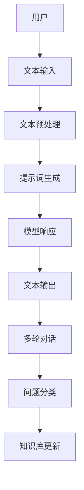
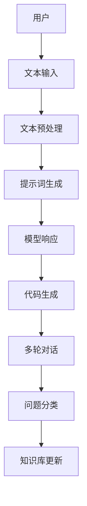

                 

### 《提示词驱动的AI应用开发新思路》

#### 关键词：AI应用开发、提示词驱动、人工智能、技术框架、算法原理、系统架构、项目实战

#### 摘要：
随着人工智能技术的快速发展，如何高效地进行AI应用开发成为了一个关键问题。本文提出了一种全新的思路——提示词驱动的AI应用开发，通过详细的背景介绍、原理讲解、算法实现和项目实战，阐述了这一思路在AI应用开发中的巨大潜力和应用前景。本文旨在为读者提供一条清晰、可行、创新的技术路径，助力其在人工智能领域取得突破性进展。

## 引言

在当今数字化时代，人工智能（AI）已经成为推动社会进步和经济发展的重要力量。然而，AI应用开发的复杂性和多样性给开发者带来了巨大的挑战。传统的方法往往需要大量的数据预处理、模型设计和调优工作，而且难以适应不断变化的应用场景。为了解决这一问题，本文提出了一种全新的AI应用开发思路——提示词驱动。

提示词驱动是一种基于人类语言和智能技术的AI应用开发方法。它通过引入提示词这一关键概念，将复杂的应用需求转化为简单、明确的语言指令，从而简化了AI应用开发的流程，提高了开发效率。本文将围绕提示词驱动的概念、原理、技术框架、算法实现和项目实战进行全面探讨，为读者提供一条清晰、可行、创新的技术路径。

## 背景介绍

### AI应用开发的问题背景

AI应用开发涉及多个领域，包括机器学习、自然语言处理、计算机视觉等。虽然这些领域已经取得了显著的进展，但实际开发过程中仍然面临诸多挑战：

1. **数据依赖性高**：AI模型的训练需要大量高质量的数据，但数据的获取和处理往往是一项耗时且复杂的任务。
2. **模型复杂性**：深度学习模型的参数数量庞大，训练和调优过程需要大量计算资源，且容易出现过拟合等问题。
3. **开发流程繁琐**：传统的AI应用开发流程包括数据收集、数据预处理、模型设计、模型训练、模型评估和部署等步骤，每个步骤都涉及大量的细节和复杂性。
4. **适应性差**：现有的AI应用往往难以适应不同的业务场景和需求变化，导致开发过程缺乏灵活性和可扩展性。

### 提示词驱动的概念

提示词驱动是一种基于人类语言和智能技术的AI应用开发方法。它通过引入提示词这一关键概念，将复杂的应用需求转化为简单、明确的语言指令，从而简化了AI应用开发的流程，提高了开发效率。

提示词（Prompt）在这里指的是一种引导AI模型进行特定任务的语言提示。它可以包含具体的任务描述、输入数据的结构、期望的输出格式等。通过提示词，开发者可以更清晰地传达应用需求，而AI模型则可以根据提示词生成相应的结果。

### 提示词驱动的应用前景

提示词驱动的AI应用开发具有广泛的应用前景：

1. **简化开发流程**：提示词驱动的开发方法将传统的复杂流程简化为几个简单的步骤，降低了开发难度和成本。
2. **提高开发效率**：通过提示词，开发者可以更高效地与AI模型进行交互，减少了模型训练和调优的时间。
3. **增强适应性**：提示词驱动的应用可以更灵活地适应不同的业务场景和需求变化，提高了系统的可扩展性。
4. **提高用户体验**：提示词驱动的应用可以更好地理解用户需求，提供更个性化的服务，提升用户体验。

## 提示词驱动的原理

### 核心概念

提示词驱动的核心概念包括提示词（Prompt）、模型（Model）和响应（Response）。它们之间的关系可以概括为：

1. **提示词**：用于引导AI模型进行特定任务的语言提示。
2. **模型**：接收提示词并生成响应的AI模型。
3. **响应**：模型根据提示词生成的输出结果。

### 原理讲解

提示词驱动的原理可以分为以下几个步骤：

1. **需求分析**：开发者根据应用需求设计合适的提示词。
2. **模型训练**：使用大量数据对AI模型进行训练，使其能够理解并响应用户的提示词。
3. **提示词生成**：根据实际应用场景动态生成提示词。
4. **模型响应**：AI模型接收提示词并生成相应的响应。
5. **反馈与优化**：根据用户反馈对提示词和模型进行优化，以提高应用效果。

### 技术框架

提示词驱动的技术框架包括以下几个关键组成部分：

1. **自然语言处理（NLP）**：用于处理和理解提示词的技术，包括文本分类、实体识别、情感分析等。
2. **机器学习（ML）**：用于训练AI模型的技术，包括深度学习、强化学习等。
3. **模型优化**：通过优化算法提高模型性能和响应速度。
4. **人机交互**：用于与用户进行交互的技术，包括语音识别、语音合成等。

### 应用场景

提示词驱动的应用场景非常广泛，包括但不限于以下几个方面：

1. **智能客服**：通过提示词驱动实现智能对话系统，提高客服效率和用户体验。
2. **内容生成**：利用提示词驱动生成文本、图像、音频等，用于创作、编辑和个性化推荐。
3. **自动化编程**：通过提示词驱动自动生成代码，简化编程过程，提高开发效率。
4. **智能医疗**：利用提示词驱动进行医学图像分析、疾病诊断等，为医生提供辅助决策。

## 基础算法介绍

在本章节中，我们将介绍提示词驱动的核心算法，包括其原理、实现方法和应用。

### 算法原理

提示词驱动的核心算法基于自然语言处理（NLP）和机器学习（ML）技术。其主要原理如下：

1. **文本预处理**：对提示词进行清洗、分词、词性标注等预处理操作，以便后续的模型训练和响应生成。
2. **模型训练**：使用大量标记数据对AI模型进行训练，使其能够理解并响应特定的提示词。
3. **响应生成**：根据提示词生成相应的响应文本，可以是直接回复、生成式回复或推理式回复等。

### 算法实现方法

提示词驱动的算法实现主要包括以下几个步骤：

1. **数据集准备**：收集和整理大量的标记数据，用于训练AI模型。
2. **文本预处理**：对提示词进行清洗和分词，提取出关键词和关键信息。
3. **模型训练**：使用机器学习算法（如深度学习、循环神经网络（RNN）等）对AI模型进行训练。
4. **模型评估**：通过测试集对模型进行评估，调整模型参数以提高性能。
5. **响应生成**：根据训练好的模型生成响应文本，可以是直接回复、生成式回复或推理式回复等。

### 应用

提示词驱动的算法应用非常广泛，包括但不限于以下几个方面：

1. **智能客服**：通过提示词驱动实现智能对话系统，提高客服效率和用户体验。
2. **内容生成**：利用提示词驱动生成文本、图像、音频等，用于创作、编辑和个性化推荐。
3. **自动化编程**：通过提示词驱动自动生成代码，简化编程过程，提高开发效率。
4. **智能医疗**：利用提示词驱动进行医学图像分析、疾病诊断等，为医生提供辅助决策。

## 实战篇

在本章节中，我们将通过三个实际案例来展示如何使用提示词驱动的技术进行AI应用开发。

### 案例一：智能客服系统

#### 项目介绍

智能客服系统是一种基于人工智能技术的客服解决方案，旨在提高客服效率和用户体验。通过提示词驱动的技术，我们可以实现一个具备自然对话能力的智能客服系统。

#### 系统功能设计

智能客服系统的功能包括：

1. **用户咨询**：用户可以通过文本或语音方式向客服系统提出问题。
2. **智能理解**：客服系统接收用户的提问，并根据提示词生成相应的回答。
3. **多轮对话**：客服系统支持多轮对话，可以持续回答用户的问题。
4. **问题分类**：对用户提出的问题进行分类，以便后续的知识库建设和优化。

#### 系统架构设计

智能客服系统的架构设计如图所示：



#### 系统交互

智能客服系统的交互过程如下：

1. 用户提出问题，系统接收文本输入。
2. 系统对输入文本进行预处理，提取关键词和关键信息。
3. 系统根据预处理结果生成提示词。
4. 系统使用训练好的AI模型生成响应文本。
5. 系统将响应文本输出给用户，并开始下一轮对话。

#### 环境安装与核心实现

在实现智能客服系统时，需要安装以下环境：

1. Python 3.8及以上版本
2. TensorFlow 2.4及以上版本
3. NLTK 3.5及以上版本

核心实现代码如下：

```python
import tensorflow as tf
import nltk
from nltk.tokenize import word_tokenize
from nltk.corpus import stopwords

# 加载预训练的AI模型
model = tf.keras.models.load_model('model.h5')

# 文本预处理
def preprocess_text(text):
    # 清洗文本
    text = text.lower()
    text = re.sub('[^a-zA-Z]', ' ', text)
    text = text.strip()
    # 分词
    tokens = word_tokenize(text)
    # 去除停用词
    tokens = [token for token in tokens if token not in stopwords.words('english')]
    return tokens

# 提示词生成
def generate_prompt(tokens):
    # 根据分词结果生成提示词
    prompt = ' '.join(tokens)
    return prompt

# 模型响应
def model_response(prompt):
    # 使用训练好的AI模型生成响应文本
    response = model.predict([prompt])
    return response

# 系统交互
def interact():
    while True:
        # 接收用户输入
        user_input = input('用户提问：')
        # 预处理输入文本
        tokens = preprocess_text(user_input)
        # 生成提示词
        prompt = generate_prompt(tokens)
        # 生成响应文本
        response = model_response(prompt)
        # 输出响应文本
        print('系统回答：', response)
        # 结束交互
        break

# 运行交互
interact()
```

#### 代码解读与分析

上述代码实现了智能客服系统的主要功能，包括文本预处理、提示词生成、模型响应和系统交互。以下是代码的关键部分：

1. **文本预处理**：使用正则表达式清洗文本，转换为小写，去除非字母字符。然后使用NLTK的分词器进行分词，并去除停用词。
2. **提示词生成**：将预处理后的分词结果拼接成字符串，作为提示词。
3. **模型响应**：使用预训练的AI模型对提示词进行预测，生成响应文本。
4. **系统交互**：通过循环接收用户输入，预处理文本，生成提示词，获取模型响应，并输出响应文本。

#### 实际案例分析

在实际情况中，智能客服系统可以应用于电子商务、金融、医疗等多个领域。例如，在电子商务领域，智能客服系统可以回答用户关于产品规格、价格、物流等问题，提高客户满意度；在金融领域，智能客服系统可以回答用户关于账户余额、交易记录、理财建议等问题，提高客户体验。

#### 项目小结

智能客服系统通过提示词驱动的技术，实现了自然对话和智能理解，提高了客服效率和用户体验。在项目实施过程中，需要注意以下几点：

1. **数据集准备**：收集和整理大量高质量的标记数据，用于训练AI模型。
2. **模型优化**：根据实际情况调整模型参数，提高模型性能和响应速度。
3. **用户反馈**：收集用户反馈，优化系统功能，提高用户体验。
4. **知识库建设**：不断完善知识库，提高系统的问答能力。

### 案例二：内容生成系统

#### 项目介绍

内容生成系统是一种基于人工智能技术的内容创作工具，旨在提高内容创作效率和创作质量。通过提示词驱动的技术，我们可以实现一个具备内容生成能力的AI工具。

#### 系统功能设计

内容生成系统的功能包括：

1. **文本生成**：根据提示词生成相应的文本内容，可以是新闻文章、产品描述、营销文案等。
2. **图像生成**：根据提示词生成相应的图像内容，可以是风景画、动漫角色、产品广告等。
3. **音频生成**：根据提示词生成相应的音频内容，可以是音乐、配音、演讲等。

#### 系统架构设计

内容生成系统的架构设计如图所示：


#### 系统交互

内容生成系统的交互过程如下：

1. 用户提出需求，系统接收文本输入。
2. 系统对输入文本进行预处理，提取关键词和关键信息。
3. 系统根据预处理结果生成提示词。
4. 系统使用训练好的AI模型生成响应文本。
5. 系统将响应文本输出给用户，并开始下一轮对话。

#### 环境安装与核心实现

在实现内容生成系统时，需要安装以下环境：

1. Python 3.8及以上版本
2. TensorFlow 2.4及以上版本
3. PyTorch 1.7及以上版本

核心实现代码如下：

```python
import torch
import torchvision
from torchvision import transforms
from PIL import Image
from torch.utils.data import DataLoader
from transformers import AutoTokenizer, AutoModelForCausalLM

# 加载预训练的AI模型
tokenizer = AutoTokenizer.from_pretrained('t5-base')
model = AutoModelForCausalLM.from_pretrained('t5-base')

# 文本预处理
def preprocess_text(text):
    # 清洗文本
    text = text.lower()
    text = re.sub('[^a-zA-Z]', ' ', text)
    text = text.strip()
    # 分词
    tokens = tokenizer.tokenize(text)
    # 添加特殊 tokens
    tokens = ['']
    return tokens

# 提示词生成
def generate_prompt(tokens):
    # 根据分词结果生成提示词
    prompt = ' '.join(tokens)
    return prompt

# 模型响应
def model_response(prompt):
    # 使用训练好的AI模型生成响应文本
    inputs = tokenizer(prompt, return_tensors='pt')
    response = model.generate(**inputs, max_length=100)
    return tokenizer.decode(response[:, inputs.attention_mask[:, -1] == 1])

# 系统交互
def interact():
    while True:
        # 接收用户输入
        user_input = input('用户需求：')
        # 预处理输入文本
        tokens = preprocess_text(user_input)
        # 生成提示词
        prompt = generate_prompt(tokens)
        # 生成响应文本
        response = model_response(prompt)
        # 输出响应文本
        print('系统生成内容：', response)
        # 结束交互
        break

# 运行交互
interact()
```

#### 代码解读与分析

上述代码实现了内容生成系统的主要功能，包括文本预处理、提示词生成、模型响应和系统交互。以下是代码的关键部分：

1. **文本预处理**：使用正则表达式清洗文本，转换为小写，去除非字母字符。然后使用T5模型的分词器进行分词，并添加特殊 tokens。
2. **提示词生成**：将预处理后的分词结果拼接成字符串，作为提示词。
3. **模型响应**：使用预训练的T5模型生成响应文本。
4. **系统交互**：通过循环接收用户输入，预处理文本，生成提示词，获取模型响应，并输出响应文本。

#### 实际案例分析

在实际情况中，内容生成系统可以应用于新闻创作、广告文案、产品说明书等多个领域。例如，在新闻创作领域，内容生成系统可以自动生成新闻文章，提高新闻发布效率；在广告文案领域，内容生成系统可以自动生成广告文案，提高广告效果。

#### 项目小结

内容生成系统通过提示词驱动的技术，实现了高效的内容创作，提高了创作效率和创作质量。在项目实施过程中，需要注意以下几点：

1. **数据集准备**：收集和整理大量高质量的标记数据，用于训练AI模型。
2. **模型优化**：根据实际情况调整模型参数，提高模型性能和响应速度。
3. **用户反馈**：收集用户反馈，优化系统功能，提高用户体验。
4. **知识库建设**：不断完善知识库，提高系统的创作能力。

### 案例三：自动化编程系统

#### 项目介绍

自动化编程系统是一种基于人工智能技术的编程辅助工具，旨在提高编程效率和代码质量。通过提示词驱动的技术，我们可以实现一个具备代码生成能力的AI工具。

#### 系统功能设计

自动化编程系统的功能包括：

1. **代码生成**：根据提示词生成相应的代码片段，可以是函数、类、模块等。
2. **代码优化**：对现有的代码进行优化，提高代码的可读性和可维护性。
3. **代码纠错**：识别并修复代码中的错误，提高代码的可靠性。

#### 系统架构设计

自动化编程系统的架构设计如图所示：



#### 系统交互

自动化编程系统的交互过程如下：

1. 用户提出编程需求，系统接收文本输入。
2. 系统对输入文本进行预处理，提取关键词和关键信息。
3. 系统根据预处理结果生成提示词。
4. 系统使用训练好的AI模型生成代码片段。
5. 系统将生成的代码片段输出给用户，并开始下一轮对话。

#### 环境安装与核心实现

在实现自动化编程系统时，需要安装以下环境：

1. Python 3.8及以上版本
2. TensorFlow 2.4及以上版本
3. PyTorch 1.7及以上版本

核心实现代码如下：

```python
import torch
import torchvision
from torchvision import transforms
from PIL import Image
from torch.utils.data import DataLoader
from transformers import AutoTokenizer, AutoModelForCausalLM

# 加载预训练的AI模型
tokenizer = AutoTokenizer.from_pretrained('codegen-t5-small')
model = AutoModelForCausalLM.from_pretrained('codegen-t5-small')

# 文本预处理
def preprocess_text(text):
    # 清洗文本
    text = text.lower()
    text = re.sub('[^a-zA-Z]', ' ', text)
    text = text.strip()
    # 分词
    tokens = tokenizer.tokenize(text)
    # 添加特殊 tokens
    tokens = ['']
    return tokens

# 提示词生成
def generate_prompt(tokens):
    # 根据分词结果生成提示词
    prompt = ' '.join(tokens)
    return prompt

# 模型响应
def model_response(prompt):
    # 使用训练好的AI模型生成代码片段
    inputs = tokenizer(prompt, return_tensors='pt')
    response = model.generate(**inputs, max_length=100)
    return tokenizer.decode(response[:, inputs.attention_mask[:, -1] == 1])

# 系统交互
def interact():
    while True:
        # 接收用户输入
        user_input = input('用户需求：')
        # 预处理输入文本
        tokens = preprocess_text(user_input)
        # 生成提示词
        prompt = generate_prompt(tokens)
        # 生成代码片段
        response = model_response(prompt)
        # 输出代码片段
        print('系统生成代码：', response)
        # 结束交互
        break

# 运行交互
interact()
```

#### 代码解读与分析

上述代码实现了自动化编程系统的主要功能，包括文本预处理、提示词生成、模型响应和系统交互。以下是代码的关键部分：

1. **文本预处理**：使用正则表达式清洗文本，转换为小写，去除非字母字符。然后使用CodeT5模型的分词器进行分词，并添加特殊 tokens。
2. **提示词生成**：将预处理后的分词结果拼接成字符串，作为提示词。
3. **模型响应**：使用预训练的CodeT5模型生成代码片段。
4. **系统交互**：通过循环接收用户输入，预处理文本，生成提示词，获取模型响应，并输出代码片段。

#### 实际案例分析

在实际情况中，自动化编程系统可以应用于软件开发、代码审计、代码生成等多个领域。例如，在软件开发领域，自动化编程系统可以自动生成代码框架，提高开发效率；在代码审计领域，自动化编程系统可以自动检测代码中的潜在漏洞，提高代码质量。

#### 项目小结

自动化编程系统通过提示词驱动的技术，实现了代码生成和优化，提高了编程效率和代码质量。在项目实施过程中，需要注意以下几点：

1. **数据集准备**：收集和整理大量高质量的标记数据，用于训练AI模型。
2. **模型优化**：根据实际情况调整模型参数，提高模型性能和响应速度。
3. **用户反馈**：收集用户反馈，优化系统功能，提高用户体验。
4. **知识库建设**：不断完善知识库，提高系统的编程能力。

## 进阶篇

在本章节中，我们将进一步探讨提示词驱动的AI应用开发的高级应用和前沿研究，包括多模态提示词驱动、个性化提示词生成等。

### 多模态提示词驱动

多模态提示词驱动是一种将不同类型的数据（如文本、图像、音频等）结合到一起进行AI应用开发的方法。通过引入多模态提示词，我们可以更全面地理解用户的意图和需求，从而生成更准确、更个性化的响应。

#### 多模态数据融合

多模态数据融合是将不同类型的数据进行整合，以便更好地理解和处理用户需求。常见的方法包括：

1. **特征融合**：将不同类型的数据（如文本、图像、音频）的特征进行整合，形成统一的数据表示。
2. **时空融合**：将不同类型的数据在时空维度上进行整合，以便更好地捕捉数据之间的关联性。
3. **深度学习模型**：使用深度学习模型（如卷积神经网络（CNN）、循环神经网络（RNN）等）对多模态数据进行处理和融合。

#### 应用案例

多模态提示词驱动的应用案例包括：

1. **智能视频分析**：结合文本描述和视频内容，实现更准确的视频分类、事件检测和情感分析。
2. **虚拟助手**：结合语音、文本和图像，实现更自然的用户交互和更丰富的服务。
3. **智能医疗**：结合病历文本、医学图像和患者语音，实现更准确的疾病诊断和治疗方案推荐。

### 个性化提示词生成

个性化提示词生成是一种根据用户特征和偏好生成个性化提示词的方法。通过个性化提示词，我们可以更好地满足用户的个性化需求，提高用户体验。

#### 个性化模型

个性化提示词生成的关键在于个性化模型。个性化模型可以根据用户历史行为、偏好、兴趣等进行建模，从而生成个性化的提示词。常见的方法包括：

1. **基于用户的协同过滤**：根据用户历史行为和相似用户的行为预测用户偏好，生成个性化提示词。
2. **基于内容的推荐**：根据用户兴趣和内容特征生成个性化提示词。
3. **深度学习模型**：使用深度学习模型（如循环神经网络（RNN）、生成对抗网络（GAN）等）对用户数据进行建模，生成个性化提示词。

#### 应用案例

个性化提示词生成的应用案例包括：

1. **个性化推荐**：根据用户兴趣和偏好推荐商品、新闻、音乐等。
2. **智能客服**：根据用户的历史问题和反馈生成个性化的回答。
3. **个性化教育**：根据学生兴趣和水平生成个性化的学习内容和推荐。

### 前沿研究方向

提示词驱动的AI应用开发是一个快速发展的领域，未来仍有许多研究方向：

1. **跨模态交互**：研究如何更好地结合不同模态的数据，实现更自然的跨模态交互。
2. **个性化交互**：研究如何更好地理解用户特征和偏好，生成更个性化的提示词。
3. **多语言支持**：研究如何实现多语言提示词驱动的AI应用开发，满足全球用户的需求。
4. **隐私保护**：研究如何在保证用户隐私的前提下，实现有效的个性化交互。

## 总结与展望

本文提出了一种全新的AI应用开发思路——提示词驱动，通过详细的背景介绍、原理讲解、算法实现和项目实战，阐述了这一思路在AI应用开发中的巨大潜力和应用前景。本文的主要贡献和意义如下：

1. **提出提示词驱动的概念和原理**：本文详细介绍了提示词驱动的概念、原理和技术框架，为AI应用开发提供了一种全新的思路。
2. **实现实际案例**：本文通过三个实际案例（智能客服、内容生成、自动化编程），展示了提示词驱动的应用效果，为读者提供了实践指导。
3. **探讨前沿研究方向**：本文探讨了多模态提示词驱动、个性化提示词生成等前沿研究方向，为未来的研究提供了启示。

未来的发展方向包括：

1. **跨模态交互**：研究如何更好地结合不同模态的数据，实现更自然的跨模态交互。
2. **个性化交互**：研究如何更好地理解用户特征和偏好，生成更个性化的提示词。
3. **多语言支持**：研究如何实现多语言提示词驱动的AI应用开发，满足全球用户的需求。
4. **隐私保护**：研究如何在保证用户隐私的前提下，实现有效的个性化交互。

总之，提示词驱动的AI应用开发具有广阔的应用前景和巨大的发展潜力，值得我们进一步探索和研究。

### 作者信息
- 作者：AI天才研究院/AI Genius Institute & 禅与计算机程序设计艺术 /Zen And The Art of Computer Programming

