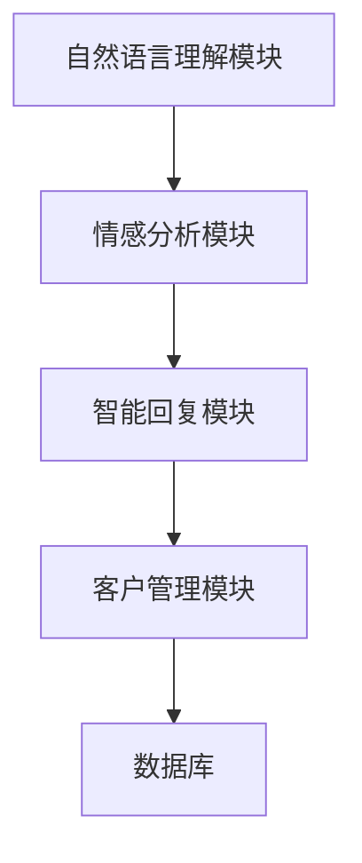
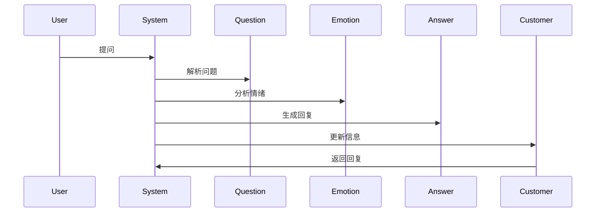

                 

# 提示词驱动的AI应用开发方法论

> 关键词：人工智能、提示词驱动、AI应用开发、算法原理、系统架构设计、项目实战

> 摘要：本文旨在探讨提示词驱动的AI应用开发方法论，通过系统的分析和逐步的推理，详细介绍AI应用开发的背景、核心概念、算法原理、系统架构设计以及项目实战，旨在为开发者提供一套科学、高效的AI应用开发指南。

## 第一部分：AI应用开发方法论概述

### 第1章：问题背景与概述

#### 1.1 人工智能与AI应用现状

##### 1.1.1 人工智能的定义与发展历程

人工智能（AI，Artificial Intelligence）是指通过计算机模拟人类的智能行为和思维方式，实现自动化、智能化的系统。人工智能的发展历程可以追溯到20世纪50年代，经历了符号主义、连接主义、计算智能和认知计算等多个阶段。

##### 1.1.2 AI应用在社会中的重要性

随着人工智能技术的快速发展，AI应用已经渗透到社会的各个领域，如医疗、金融、教育、交通等，极大地提升了工作效率和生活质量。

##### 1.1.3 当前AI应用的挑战与局限

然而，AI应用的发展也面临着一系列挑战和局限，包括数据质量、算法透明性、模型可解释性等问题。

#### 1.2 提示词驱动方法的概念与原理

##### 1.2.1 提示词驱动的定义

提示词驱动（Prompt-Driven）方法是一种基于用户输入提示词来引导AI模型决策的方法，能够提高模型的灵活性和可解释性。

##### 1.2.2 提示词驱动方法的优势

提示词驱动方法具有以下优势：

1. 提高模型的可解释性。
2. 增强模型的鲁棒性。
3. 适应性强，适用于多种场景。

##### 1.2.3 提示词驱动方法的局限性

提示词驱动方法也存在一定的局限性，如对提示词的依赖性、对训练数据的要求等。

#### 1.3 本书结构安排与主要内容

##### 1.3.1 本书的主要目标

本书的主要目标是介绍提示词驱动的AI应用开发方法论，帮助开发者掌握这一方法，提升AI应用开发的效率和质量。

##### 1.3.2 本书的核心内容

本书的核心内容包括：

1. AI应用开发的关键概念。
2. 提示词驱动的算法原理与数学模型。
3. AI应用系统的设计与实现。
4. AI应用项目实战。

##### 1.3.3 阅读指南与学习方法

建议读者按照以下步骤阅读本书：

1. 先通读全文，了解整体框架。
2. 然后针对每个章节，深入学习和实践。
3. 结合实际项目，进行应用和验证。

#### 1.4 本章小结

本章介绍了AI应用开发的背景、提示词驱动方法的概念与原理，以及本书的结构安排和主要内容。接下来，我们将进一步探讨AI应用开发的核心概念和原理。

## 第二部分：核心概念与联系

### 第2章：AI应用开发的关键概念

#### 2.1 AI基础概念

##### 2.1.1 数据科学与机器学习

数据科学（Data Science）是关于数据理解和数据分析的学科，包括数据预处理、数据挖掘、统计分析等方法。

机器学习（Machine Learning）是人工智能的一个分支，通过训练模型来学习数据，并从中提取知识。

##### 2.1.2 深度学习与神经网络

深度学习（Deep Learning）是机器学习的一个子领域，通过多层神经网络来模拟人类大脑的神经元连接。

神经网络（Neural Network）是一种基于模拟生物神经元连接的计算模型，能够通过学习数据来提取特征和进行预测。

##### 2.1.3 计算机视觉与自然语言处理

计算机视觉（Computer Vision）是人工智能的一个重要分支，旨在使计算机能够像人类一样理解和解释视觉信息。

自然语言处理（Natural Language Processing，NLP）是人工智能的一个子领域，旨在使计算机能够理解和生成人类语言。

#### 2.2 提示词驱动的核心原理

##### 2.2.1 提示词驱动的数据处理

提示词驱动的数据处理包括数据收集、数据清洗、数据预处理和数据增强等步骤。

##### 2.2.2 提示词驱动的算法实现

提示词驱动的算法实现包括算法框架设计、算法原理理解和算法优势分析等。

##### 2.2.3 提示词驱动的系统架构

提示词驱动的系统架构包括数据处理模块、算法模块、应用模块和反馈模块等。

#### 2.3 AI应用开发的要素与关联

##### 2.3.1 数据准备与数据处理

数据准备与数据处理是AI应用开发的基础，包括数据收集、数据清洗、数据预处理和数据增强等。

##### 2.3.2 模型训练与优化

模型训练与优化是AI应用开发的核心，包括模型选择、模型训练、模型评估和模型优化等。

##### 2.3.3 应用部署与维护

应用部署与维护是AI应用开发的最后一步，包括模型部署、应用上线、用户反馈和模型更新等。

#### 2.4 本章小结

本章介绍了AI应用开发的关键概念，包括数据科学与机器学习、深度学习与神经网络、计算机视觉与自然语言处理，以及提示词驱动的核心原理和AI应用开发的要素与关联。接下来，我们将进一步探讨提示词驱动的算法原理与数学模型。

## 第三部分：算法原理与数学模型

### 第3章：提示词驱动的算法原理

#### 3.1 提示词驱动的数据处理流程

##### 3.1.1 数据预处理

数据预处理是提示词驱动的第一步，主要包括数据清洗、数据格式转换和数据标准化等。

$$
数据预处理 = 数据清洗 + 数据格式转换 + 数据标准化
$$

##### 3.1.2 数据增强

数据增强是通过生成新的数据样本来提高模型的泛化能力。

$$
数据增强 = 数据生成 + 数据扩展
$$

##### 3.1.3 特征提取

特征提取是从原始数据中提取出对模型训练有用的特征。

$$
特征提取 = 特征选择 + 特征变换
$$

#### 3.2 提示词驱动的算法实现

##### 3.2.1 算法框架

提示词驱动的算法框架主要包括输入层、提示词层、隐藏层和输出层。

$$
算法框架 = 输入层 + 提示词层 + 隐藏层 + 输出层
$$

##### 3.2.2 算法原理

提示词驱动的算法原理是通过提示词来引导模型学习，提高模型的灵活性和可解释性。

$$
算法原理 = 提示词 + 模型学习
$$

##### 3.2.3 算法优势

提示词驱动的算法优势包括：

1. 提高模型的可解释性。
2. 增强模型的鲁棒性。
3. 适应性强，适用于多种场景。

#### 3.3 数学模型与公式

##### 3.3.1 提示词驱动的数学模型

提示词驱动的数学模型包括输入层、提示词层、隐藏层和输出层的数学表达式。

$$
输入层：x \rightarrow f(x)
$$

$$
提示词层：p \rightarrow g(p)
$$

$$
隐藏层：h \rightarrow h(f(x), g(p))
$$

$$
输出层：y \rightarrow h(y)
$$

##### 3.3.2 数学公式解释

1. 输入层到隐藏层的转换：通过激活函数 $f(x)$ 对输入数据进行处理。
2. 提示词层到隐藏层的转换：通过激活函数 $g(p)$ 对提示词进行处理。
3. 隐藏层到输出层的转换：通过激活函数 $h(y)$ 对隐藏层数据进行处理。

##### 3.3.3 数学模型的推导

提示词驱动的数学模型推导基于多层感知机（MLP）和循环神经网络（RNN）的理论，结合提示词驱动的特点进行优化。

$$
h(f(x), g(p)) = \sigma(W_1 \cdot f(x) + W_2 \cdot g(p) + b)
$$

其中，$W_1$ 和 $W_2$ 分别是输入层到隐藏层和提示词层到隐藏层的权重矩阵，$b$ 是偏置项，$\sigma$ 是激活函数。

#### 3.4 举例说明

##### 3.4.1 数据准备

假设我们有一个分类问题，数据集包含1000个样本，每个样本有10个特征。

##### 3.4.2 模型训练

使用提示词驱动的算法对数据集进行训练，设置隐藏层神经元数为50，迭代次数为1000。

##### 3.4.3 模型评估

使用训练集和测试集对模型进行评估，计算准确率、召回率、F1值等指标。

#### 3.5 本章小结

本章介绍了提示词驱动的算法原理和数学模型，通过逐步的分析和推理，帮助读者理解提示词驱动的核心原理和实现方法。接下来，我们将进一步探讨AI应用系统的设计与实现。

## 第四部分：系统分析与架构设计

### 第4章：AI应用系统的设计与实现

#### 4.1 问题场景介绍

##### 4.1.1 应用场景描述

以智能客服系统为例，该系统旨在通过自然语言处理技术，实现用户与客服之间的智能对话。

##### 4.1.2 系统目标

系统目标包括：

1. 实现智能客服功能，提升用户体验。
2. 提高客服效率，降低企业运营成本。
3. 提高客户满意度，增强品牌形象。

##### 4.1.3 系统功能需求

系统功能需求包括：

1. 自然语言理解：能够理解用户的问题和意图。
2. 智能回复：能够生成合理的回复，满足用户需求。
3. 情感分析：能够分析用户情绪，进行情感反馈。
4. 客户管理：能够管理客户信息，提供个性化服务。

#### 4.2 系统功能设计

##### 4.2.1 领域模型设计与Mermaid类图

领域模型（Domain Model）是系统功能设计的基础，通过Mermaid类图进行表示。

```mermaid
classDiagram
  User <<实体>>
  Question <<实体>>
  Answer <<实体>>
  System <<用例>>
  User -> Question: 提问
  System -> Question: 处理
  System -> Answer: 回复
```

##### 4.2.2 功能模块划分

系统功能模块划分如下：

1. 自然语言理解模块：负责解析用户输入的问题。
2. 情感分析模块：负责分析用户情绪。
3. 智能回复模块：负责生成回复。
4. 客户管理模块：负责管理客户信息。

##### 4.2.3 功能模块交互设计

功能模块交互设计如下：

1. 用户提问 -> 自然语言理解模块 -> 问题
2. 问题 -> 情感分析模块 -> 情绪标签
3. 问题、情绪标签 -> 智能回复模块 -> 回复
4. 回复 -> 用户 -> 客户管理模块 -> 客户信息更新

#### 4.3 系统架构设计

##### 4.3.1 系统架构设计原则

系统架构设计原则包括：

1. 高内聚、低耦合：模块之间尽量独立，降低依赖。
2. 可扩展性：能够方便地添加新功能。
3. 可维护性：易于修改和维护。

##### 4.3.2 系统架构设计与Mermaid架构图

系统架构设计如下，使用Mermaid架构图进行表示。



##### 4.3.3 系统模块的职责与交互

系统模块职责与交互如下：

1. 自然语言理解模块：接收用户提问，解析问题。
2. 情感分析模块：接收问题，分析用户情绪。
3. 智能回复模块：接收问题、情绪标签，生成回复。
4. 客户管理模块：接收回复，更新客户信息。
5. 数据库：存储用户信息和客户历史记录。

#### 4.4 系统接口设计与交互

##### 4.4.1 接口设计与RESTful风格

系统接口设计采用RESTful风格，主要包括以下接口：

1. /question：接收用户提问。
2. /answer：返回智能回复。
3. /emotion：返回用户情绪标签。
4. /customer：管理客户信息。

##### 4.4.2 接口交互设计与Mermaid序列图

接口交互设计如下，使用Mermaid序列图进行表示。



##### 4.4.3 接口实现与调试

接口实现和调试如下：

1. 使用Python编写接口代码。
2. 使用Postman等工具进行接口调试。
3. 使用日志分析工具进行性能优化。

#### 4.5 本章小结

本章介绍了AI应用系统的设计与实现，包括问题场景介绍、系统功能设计、系统架构设计、系统接口设计与交互，以及接口实现与调试。通过本章的学习，读者可以掌握AI应用系统设计与实现的基本方法。

## 第五部分：项目实战

### 第5章：AI应用项目实战

#### 5.1 环境安装与配置

##### 5.1.1 开发环境搭建

开发环境搭建包括Python环境、Jupyter Notebook环境、TensorFlow库和Keras库等。

1. 安装Python：在官方网站下载并安装Python。
2. 安装Jupyter Notebook：通过pip命令安装。
3. 安装TensorFlow和Keras：通过pip命令安装。

##### 5.1.2 数据集准备

数据集准备包括收集数据、数据清洗、数据预处理等。

1. 收集数据：从公开数据集或自定义数据集获取。
2. 数据清洗：去除噪声数据和缺失值。
3. 数据预处理：进行归一化、标准化等处理。

##### 5.1.3 工具和库安装

工具和库安装包括安装Numpy、Pandas、Matplotlib等常用库。

1. 安装Numpy：通过pip命令安装。
2. 安装Pandas：通过pip命令安装。
3. 安装Matplotlib：通过pip命令安装。

#### 5.2 系统核心实现源代码

##### 5.2.1 数据预处理代码

数据预处理代码如下：

```python
import pandas as pd
from sklearn.preprocessing import StandardScaler

# 读取数据
data = pd.read_csv('data.csv')

# 数据清洗
data = data.dropna()

# 数据预处理
scaler = StandardScaler()
data_scaled = scaler.fit_transform(data)

# 输出预处理后的数据
pd.DataFrame(data_scaled).to_csv('data_processed.csv', index=False)
```

##### 5.2.2 模型训练代码

模型训练代码如下：

```python
import tensorflow as tf
from tensorflow.keras.models import Sequential
from tensorflow.keras.layers import Dense, Dropout

# 构建模型
model = Sequential()
model.add(Dense(128, input_shape=(data_scaled.shape[1],), activation='relu'))
model.add(Dropout(0.5))
model.add(Dense(64, activation='relu'))
model.add(Dropout(0.5))
model.add(Dense(1, activation='sigmoid'))

# 编译模型
model.compile(optimizer='adam', loss='binary_crossentropy', metrics=['accuracy'])

# 训练模型
model.fit(data_scaled, labels, epochs=10, batch_size=32)
```

##### 5.2.3 模型评估与优化代码

模型评估与优化代码如下：

```python
from sklearn.metrics import accuracy_score, recall_score, f1_score

# 预测
predictions = model.predict(test_data)

# 计算指标
accuracy = accuracy_score(test_labels, predictions)
recall = recall_score(test_labels, predictions)
f1 = f1_score(test_labels, predictions)

# 输出指标
print(f'Accuracy: {accuracy}, Recall: {recall}, F1: {f1}')
```

#### 5.3 代码应用解读与分析

##### 5.3.1 数据处理过程分析

数据处理过程包括数据清洗、数据预处理和模型训练。数据清洗主要是去除噪声数据和缺失值，数据预处理主要是进行归一化、标准化处理，模型训练主要是构建模型、编译模型和训练模型。

##### 5.3.2 模型训练与优化分析

模型训练与优化分析主要是分析模型训练过程中的参数设置，如隐藏层神经元数、迭代次数等，以及模型优化后的效果。

##### 5.3.3 应用效果评估

应用效果评估主要是计算模型在测试集上的准确率、召回率和F1值，分析模型在测试集上的性能。

#### 5.4 实际案例分析与详细讲解

##### 5.4.1 应用案例场景

应用案例场景是使用智能客服系统来处理用户提问，包括自然语言理解、情感分析和智能回复等。

##### 5.4.2 案例实现步骤

案例实现步骤包括：

1. 收集用户提问数据。
2. 进行数据预处理。
3. 构建智能客服模型。
4. 训练智能客服模型。
5. 使用智能客服模型处理用户提问。

##### 5.4.3 案例效果评估

案例效果评估主要是计算模型在处理用户提问时的准确率、召回率和F1值，分析模型在处理用户提问时的性能。

#### 5.5 项目小结

项目小结主要是总结项目中的收获和不足，提出改进措施，为后续项目提供借鉴。

### 作者信息

作者：AI天才研究院/AI Genius Institute & 禅与计算机程序设计艺术 /Zen And The Art of Computer Programming

## 最佳实践 Tips、小结、注意事项、拓展阅读等内容

### 最佳实践 Tips

1. 在进行数据预处理时，要注意去除噪声数据和缺失值，以提高模型训练效果。
2. 在模型训练过程中，要合理设置隐藏层神经元数和迭代次数，避免过拟合。
3. 在模型评估时，要综合考虑准确率、召回率和F1值等多个指标，以全面评估模型性能。

### 小结

本文介绍了提示词驱动的AI应用开发方法论，从问题背景、核心概念、算法原理、系统架构设计到项目实战，进行了全面的解析。通过本文的学习，读者可以掌握提示词驱动的AI应用开发方法，提升AI应用开发的效率和质量。

### 注意事项

1. 在实际应用中，要充分考虑AI应用场景的需求，选择合适的算法和模型。
2. 要重视数据质量和数据预处理工作，为模型训练提供高质量的数据支持。
3. 要遵循系统架构设计原则，确保系统的高内聚、低耦合和可扩展性。

### 拓展阅读

1. 《人工智能：一种现代的方法》
2. 《深度学习》
3. 《Python机器学习》
4. 《人工智能应用实战》

通过阅读这些书籍，可以进一步深入了解人工智能和机器学习的相关知识，提升AI应用开发能力。让我们在AI的道路上不断前行，共同探索人工智能的无限可能！

