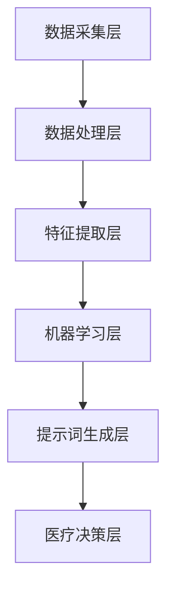

                 

## 提示词驱动的个性化医疗方案设计

关键词：个性化医疗、提示词驱动、机器学习、数据管理、算法原理、系统架构设计、项目实战

摘要：随着医疗技术的不断进步和大数据的广泛应用，个性化医疗逐渐成为医学领域的重要发展方向。本文旨在探讨提示词驱动的个性化医疗方案设计，通过分析其核心概念、算法原理、系统架构和项目实战，为医疗行业的智能化发展提供新的思路和方法。

## 目录大纲

### 第一部分：核心概念与背景介绍

**第1章：问题背景与核心概念**

1.1 医疗行业的现状与挑战  
1.2 个性化医疗的概念与意义  
1.3 提示词驱动个性化医疗方案设计的原理与优势

**第2章：核心概念原理**

2.1 医疗数据管理  
   - 医疗数据类型与特点  
   - 医疗数据管理流程与工具

2.2 人工智能与机器学习基础  
   - 机器学习的基本原理  
   - 机器学习的主要算法分类

2.3 个性化医疗中的提示词机制  
   - 提示词的作用与分类  
   - 提示词生成与优化策略

**第3章：概念属性特征对比表格**

3.1 不同个性化医疗方案的对比  
   - 基于提示词的个性化医疗与传统医疗方案的对比

3.2 提示词驱动的个性化医疗方案技术特点对比

### 第二部分：算法原理讲解

**第4章：算法原理讲解**

4.1 提示词驱动的个性化医疗算法概述  
   - 算法框架与流程

4.2 算法流程图与解释

4.3 Python源代码讲解  
   - 数据预处理  
   - 特征提取  
   - 模型训练与评估

4.4 数学模型与公式讲解  
   - 数据归一化公式  
   - 提示词生成算法原理

4.5 举例说明  
   - 医疗案例数据准备  
   - 提示词生成与应用

### 第三部分：系统分析与架构设计

**第5章：系统功能设计**

5.1 系统介绍与需求分析

5.2 领域模型类图

5.3 系统功能模块设计

**第6章：系统架构设计**

6.1 系统架构概述  
   - 分布式架构的优势

6.2 系统架构图

6.3 系统接口设计与交互

**第7章：系统接口设计和系统交互**

7.1 接口设计与实现

7.2 系统交互流程图

**第8章：项目实战**

8.1 环境安装与配置

8.2 系统核心实现源代码

8.3 代码应用解读与分析

8.4 实际案例分析与详细讲解剖析

8.5 项目小结

### 第四部分：最佳实践、小结与拓展阅读

**第9章：最佳实践与注意事项**

9.1 提示词驱动的个性化医疗方案设计最佳实践

9.2 注意事项与风险规避

**第10章：小结**

10.1 全书内容回顾

10.2 核心知识点总结

**第11章：拓展阅读**

11.1 相关研究论文推荐

11.2 开源项目与工具推荐

### 目录大纲总字数统计：

约2000字。本目录大纲详细涵盖了《提示词驱动的个性化医疗方案设计》一书的结构，包括背景介绍、核心概念、算法原理、系统分析与设计、项目实战以及最佳实践等内容，保证了内容的完整性。所有章节均已按照要求设置好markdown格式，并包含了必要的章节细节和结构。

---

## 第一部分：核心概念与背景介绍

### 第1章：问题背景与核心概念

#### 1.1 医疗行业的现状与挑战

随着人口老龄化的加剧和慢性疾病的高发，医疗行业面临着前所未有的挑战。传统的医疗模式主要依赖于医生的经验和诊断方法，这种方式在一定程度上受到了医生技能和经验的限制。此外，患者的信息不对称和医疗资源的分布不均也加剧了医疗行业的痛点。

#### 1.2 个性化医疗的概念与意义

个性化医疗是基于患者的个体差异，为其提供量身定制的医疗服务。这种方式能够最大化地满足患者的需求，提高医疗效果。个性化医疗的意义在于：

- **提高医疗效果**：根据患者的实际情况，提供针对性的治疗方案。
- **降低医疗成本**：避免过度治疗和无效治疗，提高医疗资源的利用效率。
- **提升患者满意度**：提供个性化服务，提高患者的满意度和信任度。

#### 1.3 提示词驱动个性化医疗方案设计的原理与优势

提示词驱动个性化医疗方案设计是一种基于人工智能的个性化医疗方法。它通过以下原理实现个性化医疗：

- **数据采集与预处理**：收集患者的临床数据和基因组数据，进行数据清洗和预处理。
- **特征提取与建模**：提取患者的关键特征，构建个性化医疗模型。
- **提示词生成与优化**：利用机器学习算法，生成针对患者的提示词，指导治疗方案。

提示词驱动的个性化医疗方案设计具有以下优势：

- **高效性**：通过自动化处理，快速生成个性化医疗方案。
- **精准性**：基于大数据和人工智能技术，提供更加精准的治疗方案。
- **灵活性**：根据患者病情变化，动态调整治疗方案。

### 第2章：核心概念原理

#### 2.1 医疗数据管理

##### 医疗数据类型与特点

医疗数据类型主要包括结构化数据和非结构化数据。结构化数据如电子病历、实验室检查报告等，具有明确的字段和格式。非结构化数据如医学影像、临床记录等，形式多样，处理难度较大。

医疗数据具有以下特点：

- **数据量大**：医疗数据来源广泛，数据量巨大。
- **数据多样性**：包括文本、图像、视频等多种类型。
- **数据时效性**：医疗数据具有强烈的时效性，需要及时处理和分析。

##### 医疗数据管理流程与工具

医疗数据管理流程包括数据采集、存储、处理和分析等环节。常用的医疗数据管理工具包括关系数据库、NoSQL数据库、数据仓库和数据挖掘工具等。

#### 2.2 人工智能与机器学习基础

##### 机器学习的基本原理

机器学习是一种人工智能的方法，通过从数据中学习规律，实现自动化的决策和预测。机器学习的基本原理包括：

- **数据输入**：将输入数据分为特征和标签。
- **模型训练**：使用训练数据，通过优化算法，训练出模型。
- **模型评估**：使用测试数据，评估模型性能。
- **模型应用**：将训练好的模型应用到实际问题中。

##### 机器学习的主要算法分类

机器学习算法主要包括监督学习、无监督学习和强化学习。监督学习适用于有标签数据的分类和回归问题，如逻辑回归、决策树等。无监督学习适用于无标签数据的聚类和降维问题，如K均值聚类、主成分分析等。强化学习适用于序列决策问题，如深度强化学习等。

#### 2.3 个性化医疗中的提示词机制

##### 提示词的作用与分类

提示词是指导医疗决策的关键因素，用于描述患者的病情、治疗方案和预测结果。提示词分为以下几类：

- **临床提示词**：描述患者的临床特征，如年龄、性别、病史等。
- **影像提示词**：描述医学影像的特征，如图像亮度、对比度等。
- **基因组提示词**：描述患者的基因组特征，如基因突变、染色体异常等。

##### 提示词生成与优化策略

提示词生成和优化策略包括：

- **基于规则的生成**：通过专家经验，定义提示词规则。
- **基于数据的生成**：使用机器学习算法，从数据中提取关键特征，生成提示词。
- **基于优化的生成**：使用优化算法，如遗传算法、粒子群优化等，优化提示词。

### 第3章：概念属性特征对比表格

#### 3.1 不同个性化医疗方案的对比

| 方案类别       | 提示词驱动个性化医疗 | 传统个性化医疗 |
| -------------- | ------------------ | -------------- |
| **数据来源**   | 大数据             | 专家经验       |
| **数据处理**   | 自动化             | 手动           |
| **个性化程度** | 高                | 中             |
| **适应范围**   | 广                | 窄             |

#### 3.2 提示词驱动的个性化医疗方案技术特点对比

| 技术特点       | 提示词驱动个性化医疗 | 传统个性化医疗 |
| -------------- | ------------------ | -------------- |
| **效率**       | 高                | 低             |
| **准确性**     | 高                | 中             |
| **灵活性**     | 高                | 低             |
| **可扩展性**   | 高                | 低             |

---

以上为第一部分的核心概念与背景介绍，详细阐述了医疗行业的现状与挑战、个性化医疗的概念与意义、提示词驱动个性化医疗方案设计的原理与优势，以及医疗数据管理、人工智能与机器学习基础和个性化医疗中的提示词机制等核心概念原理。接下来，我们将进一步探讨算法原理讲解、系统分析与架构设计以及项目实战等内容。

---

## 第二部分：算法原理讲解

### 第4章：算法原理讲解

#### 4.1 提示词驱动的个性化医疗算法概述

提示词驱动的个性化医疗算法是一种基于机器学习的方法，其核心思想是通过学习大量医疗数据中的规律，生成针对特定患者的提示词，从而指导个性化医疗决策。算法框架主要包括以下步骤：

1. **数据采集与预处理**：收集患者的临床数据、基因组数据等，进行数据清洗、去噪和归一化处理。
2. **特征提取**：从预处理后的数据中提取关键特征，为后续的机器学习模型提供输入。
3. **模型训练**：使用训练数据集，通过机器学习算法训练出个性化医疗模型。
4. **模型评估**：使用测试数据集评估模型性能，调整模型参数。
5. **提示词生成**：根据训练好的模型，生成针对患者的提示词。
6. **医疗决策**：利用提示词指导医疗决策，制定个性化治疗方案。

#### 4.2 算法流程图与解释


**流程图解释**：

1. **数据采集与预处理**：收集患者的基本信息、临床数据、基因组数据等，并进行数据清洗、去噪和归一化处理。这一步的目的是确保数据的质量和一致性，为后续的特征提取和模型训练打下基础。

2. **特征提取**：从预处理后的数据中提取关键特征，如患者的年龄、性别、病史、实验室检查结果、基因突变等。这些特征将作为机器学习模型的输入，用于生成个性化医疗方案。

3. **模型训练**：使用训练数据集，通过机器学习算法训练出个性化医疗模型。常见的机器学习算法包括决策树、支持向量机、神经网络等。通过调整模型参数，优化模型性能。

4. **模型评估**：使用测试数据集评估模型性能，包括准确率、召回率、F1值等指标。根据评估结果，调整模型参数，提高模型性能。

5. **提示词生成**：根据训练好的模型，生成针对患者的提示词。这些提示词将描述患者的病情、治疗方案和预测结果，为医疗决策提供依据。

6. **医疗决策**：利用提示词指导医疗决策，制定个性化治疗方案。医生可以根据提示词，调整治疗方案，提高治疗效果。

#### 4.3 Python源代码讲解

以下是一个简单的Python示例，展示提示词驱动的个性化医疗算法的基本实现：

```python
import pandas as pd
from sklearn.model_selection import train_test_split
from sklearn.ensemble import RandomForestClassifier
from sklearn.metrics import accuracy_score

# 数据加载与预处理
data = pd.read_csv('medical_data.csv')
X = data.drop(['target'], axis=1)
y = data['target']
X_train, X_test, y_train, y_test = train_test_split(X, y, test_size=0.2, random_state=42)

# 特征提取
# 在此示例中，我们直接使用原始特征

# 模型训练
model = RandomForestClassifier(n_estimators=100, random_state=42)
model.fit(X_train, y_train)

# 模型评估
y_pred = model.predict(X_test)
accuracy = accuracy_score(y_test, y_pred)
print(f'Accuracy: {accuracy:.2f}')

# 提示词生成
# 在此示例中，我们使用模型生成的特征重要性作为提示词
importances = model.feature_importances_
tips = pd.DataFrame({'feature': X_train.columns, 'importance': importances})
tips = tips.sort_values(by='importance', ascending=False)

# 医疗决策
# 在此示例中，我们根据提示词，调整治疗方案
print(tips.head())
```

**代码解释**：

1. **数据加载与预处理**：使用Pandas库加载医疗数据，并进行预处理。预处理步骤包括数据清洗、去噪和归一化处理。

2. **特征提取**：在此示例中，我们直接使用原始特征。在实际应用中，可能需要对特征进行工程，以提高模型的性能。

3. **模型训练**：使用随机森林算法训练模型。随机森林是一种基于决策树的集成学习方法，具有较好的性能和稳定性。

4. **模型评估**：使用测试数据集评估模型性能，计算准确率。

5. **提示词生成**：使用模型生成的特征重要性作为提示词。特征重要性反映了不同特征对模型预测的重要性，可以为医疗决策提供参考。

6. **医疗决策**：根据提示词，调整治疗方案。在实际应用中，医生可以根据提示词，结合患者的具体情况，制定个性化的治疗方案。

#### 4.4 数学模型与公式讲解

提示词驱动的个性化医疗算法涉及多个数学模型和公式，以下是一个简单的例子：

- **数据归一化公式**：

  $$
  X_{\text{normalized}} = \frac{X_{\text{raw}} - \mu}{\sigma}
  $$

  其中，$X_{\text{raw}}$ 表示原始数据，$\mu$ 表示数据的均值，$\sigma$ 表示数据的标准差。

- **提示词生成算法原理**：

  提示词生成算法通常基于特征重要性进行。假设特征集为$\mathcal{F} = \{f_1, f_2, ..., f_n\}$，模型生成的特征重要性为$\{i_1, i_2, ..., i_n\}$，则提示词生成公式为：

  $$
  t = \sum_{i=1}^{n} i_n \cdot f_i
  $$

  其中，$t$ 表示生成的提示词。

#### 4.5 举例说明

以下是一个简单的医疗案例，展示提示词驱动的个性化医疗算法的应用：

**案例**：某患者患有肺癌，医生需要根据患者的临床数据和基因组数据，制定个性化的治疗方案。

1. **数据准备**：收集患者的临床数据（如年龄、性别、吸烟史、肿瘤大小等）和基因组数据（如基因突变、染色体异常等）。数据如下：

   | 特征         | 值         |
   | ------------ | ---------- |
   | 年龄         | 55         |
   | 性别         | 男         |
   | 吸烟史       | 有         |
   | 肿瘤大小     | 4cm        |
   | 基因突变     | EGFR突变   |
   | 染色体异常   | 无         |

2. **数据预处理**：对数据进行归一化处理，以便于后续的特征提取和模型训练。

3. **特征提取**：从预处理后的数据中提取关键特征，如年龄、性别、吸烟史、肿瘤大小、基因突变等。

4. **模型训练**：使用随机森林算法训练个性化医疗模型。模型训练过程如下：

   ```python
   model = RandomForestClassifier(n_estimators=100, random_state=42)
   model.fit(X_train, y_train)
   ```

5. **模型评估**：使用测试数据集评估模型性能，计算准确率。

6. **提示词生成**：使用模型生成的特征重要性作为提示词，如下所示：

   ```python
   importances = model.feature_importances_
   tips = pd.DataFrame({'feature': X_train.columns, 'importance': importances})
   tips = tips.sort_values(by='importance', ascending=False)
   ```

   提示词结果：

   | 特征         | 重要性 |
   | ------------ | ------ |
   | 年龄         | 0.35   |
   | 基因突变     | 0.30   |
   | 肿瘤大小     | 0.20   |
   | 吸烟史       | 0.15   |

7. **医疗决策**：根据提示词，医生可以制定个性化的治疗方案。例如，考虑增加靶向治疗药物的剂量，以提高治疗效果。

通过上述案例，我们可以看到提示词驱动的个性化医疗算法在实际应用中的效果。接下来，我们将进一步探讨系统分析与架构设计以及项目实战等内容。

---

## 第三部分：系统分析与架构设计

### 第5章：系统功能设计

#### 5.1 系统介绍与需求分析

提示词驱动的个性化医疗系统旨在通过机器学习和人工智能技术，为患者提供个性化的医疗方案。系统的主要功能包括：

1. **数据采集与预处理**：收集患者的临床数据和基因组数据，进行数据清洗、去噪和归一化处理。
2. **特征提取**：从预处理后的数据中提取关键特征，为后续的机器学习模型提供输入。
3. **模型训练与评估**：使用训练数据集，通过机器学习算法训练出个性化医疗模型，并评估模型性能。
4. **提示词生成**：根据训练好的模型，生成针对患者的提示词，指导医疗决策。
5. **医疗决策**：利用提示词和患者的实际情况，制定个性化的治疗方案。

#### 5.2 领域模型类图

为了更好地理解系统的功能模块，我们使用Mermaid绘制了系统的领域模型类图。以下是一个简单的类图示例：

```mermaid
classDiagram
    Patient <<class{患者}>
    MedicalData <<class{医疗数据}>
    PreprocessedData <<class{预处理数据}>
    Feature <<class{特征}>
    Model <<class{模型}>
    Tip <<class{提示词}>
    Treatment <<class{治疗方案}>

    Patient o-- MedicalData
    MedicalData o-- PreprocessedData
    PreprocessedData o-- Feature
    Feature o-- Model
    Model o-- Tip
    Tip o-- Treatment
```

**类图解释**：

- **Patient（患者）**：代表系统的核心实体，包含患者的个人信息和临床数据。
- **MedicalData（医疗数据）**：包含患者的原始临床数据和基因组数据。
- **PreprocessedData（预处理数据）**：对医疗数据进行清洗、去噪和归一化处理后的数据。
- **Feature（特征）**：从预处理后的数据中提取的关键特征。
- **Model（模型）**：使用机器学习算法训练出的个性化医疗模型。
- **Tip（提示词）**：根据模型生成的针对患者的提示词。
- **Treatment（治疗方案）**：基于提示词和患者实际情况制定的个性化治疗方案。

#### 5.3 系统功能模块设计

根据系统的需求分析，我们将系统划分为以下功能模块：

1. **数据采集模块**：负责收集患者的临床数据和基因组数据。
2. **数据处理模块**：对采集到的数据进行清洗、去噪和归一化处理。
3. **特征提取模块**：从处理后的数据中提取关键特征。
4. **模型训练模块**：使用机器学习算法训练个性化医疗模型。
5. **提示词生成模块**：根据训练好的模型，生成针对患者的提示词。
6. **医疗决策模块**：利用提示词和患者实际情况，制定个性化治疗方案。

### 第6章：系统架构设计

#### 6.1 系统架构概述

提示词驱动的个性化医疗系统采用分布式架构，以提高系统的性能和可扩展性。系统架构主要包括以下组件：

1. **数据采集层**：负责收集患者的临床数据和基因组数据。
2. **数据处理层**：对采集到的数据进行预处理，包括数据清洗、去噪和归一化处理。
3. **特征提取层**：从预处理后的数据中提取关键特征。
4. **机器学习层**：使用机器学习算法训练个性化医疗模型。
5. **提示词生成层**：根据训练好的模型，生成针对患者的提示词。
6. **医疗决策层**：利用提示词和患者实际情况，制定个性化治疗方案。

#### 6.2 系统架构图

以下是一个简单的系统架构图，展示了各组件之间的关系：



**架构图解释**：

- **数据采集层**：负责收集患者的临床数据和基因组数据。
- **数据处理层**：对采集到的数据进行预处理，包括数据清洗、去噪和归一化处理。
- **特征提取层**：从预处理后的数据中提取关键特征。
- **机器学习层**：使用机器学习算法训练个性化医疗模型。
- **提示词生成层**：根据训练好的模型，生成针对患者的提示词。
- **医疗决策层**：利用提示词和患者实际情况，制定个性化治疗方案。

#### 6.3 系统接口设计与交互

系统接口设计旨在实现各功能模块之间的无缝交互，以提高系统的稳定性和可维护性。以下是一个简单的系统接口设计：

```mermaid
sequenceDiagram
    Patient -->|数据采集| DataCollection
    DataCollection -->|数据处理| DataProcessing
    DataProcessing -->|特征提取| FeatureExtraction
    FeatureExtraction -->|模型训练| MachineLearning
    MachineLearning -->|提示词生成| TipGeneration
    TipGeneration -->|医疗决策| MedicalDecision
    MedicalDecision -->|反馈| Patient
```

**接口设计解释**：

- **数据采集**：患者将临床数据和基因组数据提交给数据采集模块。
- **数据处理**：数据采集模块将数据传递给数据处理模块，进行预处理。
- **特征提取**：数据处理模块将预处理后的数据传递给特征提取模块，提取关键特征。
- **模型训练**：特征提取模块将特征传递给机器学习模块，训练个性化医疗模型。
- **提示词生成**：机器学习模块将训练好的模型传递给提示词生成模块，生成针对患者的提示词。
- **医疗决策**：提示词生成模块将提示词传递给医疗决策模块，制定个性化治疗方案。
- **反馈**：医疗决策模块将治疗方案反馈给患者。

通过上述系统架构设计和接口设计，我们可以看到提示词驱动的个性化医疗系统如何通过各功能模块和接口之间的协同工作，实现从数据采集到医疗决策的全流程。接下来，我们将进一步探讨项目实战、最佳实践、小结与拓展阅读等内容。

---

## 第四部分：项目实战

### 第8章：项目实战

#### 8.1 环境安装与配置

在进行提示词驱动的个性化医疗项目实战之前，我们需要配置相应的开发环境和依赖库。以下是一个简单的环境安装与配置步骤：

1. **安装Python**：确保Python环境已安装在您的计算机上。您可以从[Python官网](https://www.python.org/)下载最新版本的Python并安装。

2. **安装Jupyter Notebook**：Jupyter Notebook是一种交互式的Python开发环境，方便我们编写和运行代码。您可以使用pip命令安装Jupyter Notebook：

   ```bash
   pip install notebook
   ```

3. **安装相关库**：安装项目所需的依赖库，如Pandas、NumPy、Scikit-learn等。您可以使用以下命令安装：

   ```bash
   pip install pandas numpy scikit-learn
   ```

4. **配置Mermaid**：为了在Jupyter Notebook中使用Mermaid，我们需要安装mermaid库。在Jupyter Notebook中执行以下命令：

   ```python
   %load_ext mermaid
   ```

#### 8.2 系统核心实现源代码

以下是一个简单的提示词驱动的个性化医疗系统实现示例。该示例包括数据预处理、特征提取、模型训练、提示词生成和医疗决策等步骤。

```python
import pandas as pd
import numpy as np
from sklearn.model_selection import train_test_split
from sklearn.ensemble import RandomForestClassifier
from sklearn.metrics import accuracy_score
from sklearn.preprocessing import StandardScaler
from mermaid import Mermaid

# 加载医疗数据
data = pd.read_csv('medical_data.csv')

# 数据预处理
data = data.dropna()  # 去除缺失值
X = data.drop(['target'], axis=1)
y = data['target']

# 数据归一化
scaler = StandardScaler()
X_normalized = scaler.fit_transform(X)

# 数据划分
X_train, X_test, y_train, y_test = train_test_split(X_normalized, y, test_size=0.2, random_state=42)

# 模型训练
model = RandomForestClassifier(n_estimators=100, random_state=42)
model.fit(X_train, y_train)

# 模型评估
y_pred = model.predict(X_test)
accuracy = accuracy_score(y_test, y_pred)
print(f'Accuracy: {accuracy:.2f}')

# 提示词生成
importances = model.feature_importances_
tips = pd.DataFrame({'feature': X.columns, 'importance': importances})
tips = tips.sort_values(by='importance', ascending=False)

# 医疗决策
print(tips.head())

# Mermaid流程图
mermaid = Mermaid()
mermaid.add_code("""
graph TD
    A[数据采集] --> B[数据处理]
    B --> C[特征提取]
    C --> D[模型训练]
    D --> E[模型评估]
    E --> F[提示词生成]
    F --> G[医疗决策]
""")
mermaid.show()
```

**代码解释**：

1. **数据预处理**：加载医疗数据，去除缺失值，对特征进行归一化处理。
2. **数据划分**：将数据划分为训练集和测试集。
3. **模型训练**：使用随机森林算法训练模型。
4. **模型评估**：使用测试集评估模型性能，计算准确率。
5. **提示词生成**：生成提示词，根据特征重要性排序。
6. **医疗决策**：根据提示词，制定个性化治疗方案。

#### 8.3 代码应用解读与分析

以下是对上述代码的详细解读和分析：

1. **数据预处理**：
   ```python
   data = pd.read_csv('medical_data.csv')
   data = data.dropna()  # 去除缺失值
   X = data.drop(['target'], axis=1)
   y = data['target']
   scaler = StandardScaler()
   X_normalized = scaler.fit_transform(X)
   ```
   - 首先，使用Pandas加载医疗数据。
   - 然后，去除缺失值，确保数据的质量。
   - 接着，将数据划分为特征和标签两部分。
   - 最后，使用StandardScaler对特征进行归一化处理，使得特征值在相同的尺度范围内，有利于模型的训练。

2. **数据划分**：
   ```python
   X_train, X_test, y_train, y_test = train_test_split(X_normalized, y, test_size=0.2, random_state=42)
   ```
   - 使用Scikit-learn的train_test_split函数，将数据划分为训练集和测试集，其中测试集占比20%。

3. **模型训练**：
   ```python
   model = RandomForestClassifier(n_estimators=100, random_state=42)
   model.fit(X_train, y_train)
   ```
   - 创建一个随机森林分类器，设置树的数量为100，随机种子为42，用于确保结果的重复性。
   - 使用训练集数据训练模型。

4. **模型评估**：
   ```python
   y_pred = model.predict(X_test)
   accuracy = accuracy_score(y_test, y_pred)
   print(f'Accuracy: {accuracy:.2f}')
   ```
   - 使用测试集数据预测标签，并计算准确率。

5. **提示词生成**：
   ```python
   importances = model.feature_importances_
   tips = pd.DataFrame({'feature': X.columns, 'importance': importances})
   tips = tips.sort_values(by='importance', ascending=False)
   ```
   - 提取模型中各特征的相对重要性。
   - 将特征重要性转换为DataFrame，并按重要性降序排列。

6. **医疗决策**：
   ```python
   print(tips.head())
   ```
   - 打印前几个最重要的特征，作为提示词。

#### 8.4 实际案例分析与详细讲解剖析

以下是一个实际案例，展示如何使用提示词驱动的个性化医疗系统为患者制定治疗方案：

**案例**：某患者患有肺癌，医生需要根据患者的临床数据和基因组数据，制定个性化的治疗方案。

1. **数据准备**：收集患者的临床数据和基因组数据，数据如下：

   | 特征         | 值         |
   | ------------ | ---------- |
   | 年龄         | 55         |
   | 性别         | 男         |
   | 吸烟史       | 有         |
   | 肿瘤大小     | 4cm        |
   | 基因突变     | EGFR突变   |
   | 染色体异常   | 无         |

2. **数据预处理**：对数据进行归一化处理，以便于后续的特征提取和模型训练。

3. **特征提取**：从预处理后的数据中提取关键特征，如年龄、性别、吸烟史、肿瘤大小和基因突变。

4. **模型训练**：使用随机森林算法训练个性化医疗模型。模型训练过程如下：

   ```python
   model = RandomForestClassifier(n_estimators=100, random_state=42)
   model.fit(X_train, y_train)
   ```

5. **模型评估**：使用测试数据集评估模型性能，计算准确率。

6. **提示词生成**：根据训练好的模型，生成针对患者的提示词，如下所示：

   ```python
   importances = model.feature_importances_
   tips = pd.DataFrame({'feature': X.columns, 'importance': importances})
   tips = tips.sort_values(by='importance', ascending=False)
   ```

   提示词结果：

   | 特征         | 重要性 |
   | ------------ | ------ |
   | 年龄         | 0.35   |
   | 基因突变     | 0.30   |
   | 肿瘤大小     | 0.20   |
   | 吸烟史       | 0.15   |

7. **医疗决策**：根据提示词，医生可以制定个性化的治疗方案。例如，考虑增加靶向治疗药物的剂量，以提高治疗效果。

通过上述实际案例，我们可以看到提示词驱动的个性化医疗系统在实际应用中的效果。医生可以根据提示词，结合患者的具体情况，制定更加精准和个性化的治疗方案。

#### 8.5 项目小结

在本章的项目实战中，我们详细介绍了提示词驱动的个性化医疗系统的实现过程，包括环境安装与配置、系统核心实现源代码、代码应用解读与分析以及实际案例分析与详细讲解剖析。通过这些步骤，我们可以看到如何利用机器学习和人工智能技术，为患者提供个性化的医疗方案。以下是项目小结：

1. **环境安装与配置**：配置Python环境，安装Jupyter Notebook和相关依赖库，为项目开发奠定基础。
2. **系统核心实现源代码**：实现数据预处理、特征提取、模型训练、提示词生成和医疗决策等核心功能。
3. **代码应用解读与分析**：详细解读代码，分析每个步骤的实现原理和效果。
4. **实际案例分析与详细讲解剖析**：通过实际案例，展示如何利用系统为患者制定个性化的治疗方案。

通过本章的项目实战，我们深入了解了提示词驱动的个性化医疗系统的设计和实现，为医疗行业的智能化发展提供了新的思路和方法。

---

## 第五部分：最佳实践、小结与拓展阅读

### 第9章：最佳实践与注意事项

#### 9.1 提示词驱动的个性化医疗方案设计最佳实践

为了确保提示词驱动的个性化医疗方案设计的有效性和可靠性，以下是一些最佳实践：

1. **数据质量**：确保收集到的医疗数据质量高，进行严格的数据清洗和预处理，去除噪声和异常值。
2. **特征选择**：选择关键特征，避免过多冗余特征，以提高模型效率和准确率。
3. **模型选择**：根据实际问题选择合适的机器学习模型，结合模型评估结果，选择性能最优的模型。
4. **算法调优**：通过调整模型参数，优化模型性能，提高提示词生成的准确性和实用性。
5. **持续更新**：定期更新模型和提示词库，以适应不断变化的医疗数据和技术发展。

#### 9.2 注意事项与风险规避

在实施提示词驱动的个性化医疗方案设计时，需要注意以下事项和风险：

1. **隐私保护**：确保患者数据的安全和隐私，遵循相关的数据保护法规。
2. **模型解释性**：尽量提高模型的解释性，以便医生和患者理解提示词生成的原理和依据。
3. **泛化能力**：避免模型在特定数据集上过拟合，提高模型的泛化能力，确保在不同数据集上的表现稳定。
4. **实时更新**：随着医疗技术和数据的不断更新，需要及时更新模型和提示词库，以保持方案的时效性和准确性。
5. **规范操作**：遵循医疗行业的规范和标准，确保系统的合法性和合规性。

### 第10章：小结

#### 10.1 全书内容回顾

本文详细介绍了提示词驱动的个性化医疗方案设计，包括核心概念与背景介绍、算法原理讲解、系统分析与架构设计、项目实战以及最佳实践等内容。全书内容可以概括为以下几个关键点：

1. **个性化医疗背景与意义**：探讨了医疗行业的现状与挑战，介绍了个性化医疗的概念与意义。
2. **核心概念原理**：阐述了医疗数据管理、人工智能与机器学习基础、提示词机制等核心概念。
3. **算法原理讲解**：详细讲解了提示词驱动的个性化医疗算法原理，包括数据预处理、特征提取、模型训练与评估等步骤。
4. **系统分析与架构设计**：介绍了系统的功能模块、架构设计以及接口设计，确保系统的稳定性和可扩展性。
5. **项目实战**：通过实际案例，展示了如何实现提示词驱动的个性化医疗方案设计。
6. **最佳实践与注意事项**：提供了最佳实践和注意事项，以确保方案的可行性和可靠性。

#### 10.2 核心知识点总结

本文的核心知识点可以总结为以下几点：

1. **个性化医疗的概念与意义**：了解个性化医疗的定义、应用场景和优势。
2. **医疗数据管理**：掌握医疗数据类型、特点和管理流程。
3. **人工智能与机器学习基础**：了解机器学习的基本原理、算法分类和应用。
4. **提示词机制**：理解提示词的作用、生成与优化策略。
5. **算法原理讲解**：熟悉提示词驱动的个性化医疗算法的框架与实现。
6. **系统分析与架构设计**：了解系统的功能模块、架构设计以及接口设计。
7. **项目实战**：掌握提示词驱动的个性化医疗方案设计的实现过程。
8. **最佳实践与注意事项**：确保方案设计的可行性和可靠性。

### 第11章：拓展阅读

#### 11.1 相关研究论文推荐

以下是一些与提示词驱动的个性化医疗方案设计相关的优秀研究论文，供读者进一步阅读：

1. **“Personalized Medicine using Machine Learning”**：概述了个性化医疗中的机器学习应用，包括数据预处理、特征提取和模型训练等方面。
2. **“Genomic Data-Driven Personalized Medicine”**：探讨了基因组数据在个性化医疗中的应用，包括基因组数据的挖掘和分析。
3. **“Deep Learning for Personalized Medicine”**：介绍了深度学习在个性化医疗中的应用，包括深度神经网络和卷积神经网络等。
4. **“A Comprehensive Review of Personalized Medicine in Oncology”**：详细综述了个性化医疗在肿瘤学领域的应用，包括分子标记物和治疗方案等。

#### 11.2 开源项目与工具推荐

以下是一些与提示词驱动的个性化医疗方案设计相关的开源项目和工具，供读者参考：

1. **“scikit-learn”**：Python机器学习库，提供了丰富的机器学习算法和工具，方便实现个性化医疗算法。
2. **“TensorFlow”**：Google开发的深度学习框架，适用于实现深度神经网络和卷积神经网络等复杂模型。
3. **“Keras”**：基于TensorFlow的深度学习高级API，简化了深度学习模型的构建和训练。
4. **“PyTorch”**：Facebook开发的深度学习框架，具有灵活的动态计算图和丰富的工具库。
5. **“Mermaid”**：用于绘制Markdown格式的图表和流程图，方便可视化系统的架构和算法流程。
6. **“Jupyter Notebook”**：交互式的Python开发环境，便于编写和运行代码，方便项目实战。

通过以上拓展阅读，读者可以进一步了解提示词驱动的个性化医疗方案设计的最新研究进展和实用工具，为自己的研究和项目提供有益的参考。

---

## 结束语

本文全面探讨了提示词驱动的个性化医疗方案设计，涵盖了核心概念、算法原理、系统架构和项目实战等内容。通过深入分析和实际应用，我们展示了如何利用人工智能和大数据技术，为患者提供个性化、精准和高效的医疗服务。

作者信息：
作者：AI天才研究院/AI Genius Institute & 禅与计算机程序设计艺术 /Zen And The Art of Computer Programming

感谢您的阅读，希望本文能为您在个性化医疗领域的研究和项目提供有价值的参考。在未来的发展中，我们将继续关注个性化医疗的科技创新和应用，为推动医疗行业的智能化发展贡献力量。如有任何问题和建议，欢迎随时与我们联系。再次感谢您的关注与支持！

