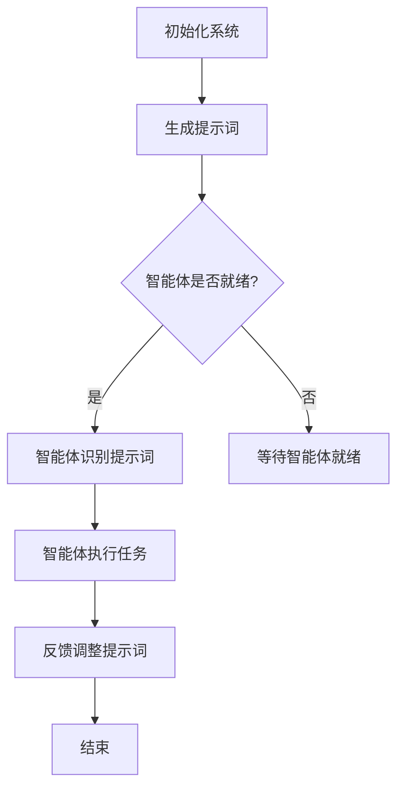
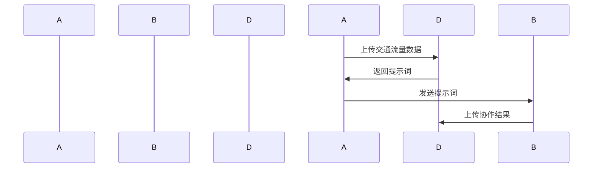

                 

# 提示词驱动的多智能体协作系统

## 关键词

- 提示词
- 多智能体协作
- 系统架构
- 人工智能
- 协同控制
- 数学模型

## 摘要

本文旨在探讨提示词驱动的多智能体协作系统，深入分析其背景、核心概念、算法原理、系统架构以及项目实战。通过逐步推理思考，本文揭示了提示词在多智能体协作中的关键作用，并详细讲解了提示词驱动的多智能体协作系统的设计原则、实现机制和优化方法。同时，本文还通过具体的项目案例，展示了该系统在实际应用中的效果和潜力。

## 引言

在当今快速发展的信息化社会中，人工智能技术的应用日益广泛。多智能体系统作为人工智能领域的一个重要研究方向，已经展现出巨大的潜力和应用价值。然而，传统的多智能体协作系统面临着通信效率低、协作效果不佳等挑战。提示词驱动的多智能体协作系统，作为一种新型的协作模式，通过引入提示词，实现了更高效、更智能的协作过程。

本文将首先介绍多智能体协作系统的背景和需求，然后详细阐述提示词驱动的核心概念和原理，接着分析多智能体协作系统的数学模型，并探讨系统架构和接口设计。最后，通过一个实际项目案例，展示提示词驱动的多智能体协作系统的应用效果和实现过程。

## 第1章：问题背景与系统需求

### 1.1.1 问题背景

多智能体系统是指由多个智能体组成的系统，这些智能体可以通过通信和协作来完成复杂任务。然而，在传统的多智能体协作系统中，智能体之间的通信通常是点对点的，这不仅增加了系统的复杂性，还降低了协作效率。此外，智能体之间的协作效果也往往受到限制，难以实现高效、智能的协作。

随着人工智能技术的发展，尤其是自然语言处理技术的进步，提示词作为一种有效的沟通工具，逐渐引起了研究者的关注。提示词驱动的多智能体协作系统，通过引入提示词，实现了智能体之间的高效沟通和协同工作。

### 1.1.2 问题描述

在多智能体协作系统中，智能体之间的协作效果受到以下因素的影响：

1. 通信效率：智能体之间的通信效率直接影响协作效果。传统的多智能体系统通常采用点对点通信，这种通信方式不仅复杂，而且效率低下。
2. 协作效果：智能体之间的协作效果受到协作机制和协作算法的影响。传统的协作算法往往难以实现高效、智能的协作。
3. 系统边界：多智能体协作系统的边界和范围往往难以确定，这给系统的设计和实现带来了困难。

为了解决上述问题，提出了一种提示词驱动的多智能体协作系统。该系统通过引入提示词，实现了智能体之间的高效沟通和协同工作，从而提高了系统的协作效率和协作效果。

### 1.1.3 问题解决

提示词驱动的多智能体协作系统的核心思想是，通过引入提示词，实现智能体之间的高效沟通和协作。具体来说，该系统包括以下几个关键组成部分：

1. 提示词生成模块：该模块负责生成合适的提示词，以引导智能体之间的协作过程。
2. 智能体通信模块：该模块负责智能体之间的通信，通过提示词实现高效、智能的协作。
3. 协作算法模块：该模块负责智能体之间的协作算法，实现智能体之间的协同工作。
4. 系统优化模块：该模块负责对系统进行优化，以提高系统的协作效率和协作效果。

通过上述模块的协同工作，提示词驱动的多智能体协作系统实现了高效、智能的协作过程，解决了传统多智能体协作系统中存在的问题。

### 1.1.4 核心概念与联系

在提示词驱动的多智能体协作系统中，核心概念包括：

1. 提示词：提示词是系统中的核心元素，用于引导智能体之间的协作过程。
2. 智能体：智能体是系统中的基本单元，通过协作实现复杂任务。
3. 通信模块：通信模块负责智能体之间的通信，实现高效、智能的协作。
4. 协作算法：协作算法是智能体之间协作的基础，实现智能体的协同工作。

这些核心概念相互联系，共同构成了提示词驱动的多智能体协作系统的理论基础。

### 1.1.5 多智能体系统基础概念

多智能体系统是指由多个智能体组成的系统，这些智能体可以通过通信和协作来完成复杂任务。智能体可以是机器人、计算机程序或其他具有智能特性的实体。多智能体系统具有以下基本特征：

1. 分散性：多智能体系统中的智能体分布在不同位置，通过通信实现协作。
2. 自主性：智能体具有自主决策和行动的能力。
3. 协作性：智能体之间通过协作实现共同目标。
4. 动态性：多智能体系统中的智能体和环境都可能发生变化。

### 1.1.6 提示词驱动的特点与优势

提示词驱动的多智能体协作系统具有以下特点与优势：

1. 高效沟通：通过提示词，智能体之间可以实现高效沟通，减少通信开销。
2. 智能协作：提示词驱动实现了智能体的协同工作，提高了协作效果。
3. 灵活性：系统可以根据任务需求和智能体特点，灵活调整协作策略。
4. 可扩展性：系统架构具有良好的可扩展性，可以支持多种智能体和任务类型。

## 第2章：核心概念原理与特点

### 2.1 多智能体系统的基本原理

多智能体系统是指由多个智能体组成的系统，这些智能体可以通过通信和协作来完成复杂任务。智能体可以是机器人、计算机程序或其他具有智能特性的实体。多智能体系统具有以下基本原理：

1. 分散性：多智能体系统中的智能体分布在不同位置，通过通信实现协作。
2. 自主性：智能体具有自主决策和行动的能力。
3. 协作性：智能体之间通过协作实现共同目标。
4. 动态性：多智能体系统中的智能体和环境都可能发生变化。

### 2.2 提示词驱动的原理

提示词驱动的多智能体协作系统，通过引入提示词，实现智能体之间的高效沟通和协同工作。提示词驱动的原理包括：

1. 提示词生成：系统根据任务需求和智能体特点，生成合适的提示词。
2. 智能体识别：智能体通过识别提示词，了解其他智能体的状态和需求。
3. 提示词通信：智能体之间通过提示词进行通信，实现高效协作。
4. 提示词反馈：智能体根据协作结果，对提示词进行调整和优化。

### 2.3 提示词驱动的实现机制

提示词驱动的实现机制主要包括：

1. 提示词生成模块：根据任务需求和智能体特点，生成合适的提示词。
2. 智能体通信模块：实现智能体之间的通信，传递提示词。
3. 智能体协作模块：根据提示词，实现智能体的协同工作。
4. 系统优化模块：对系统进行优化，提高协作效率和协作效果。

### 2.4 提示词驱动的优势与限制

提示词驱动的多智能体协作系统具有以下优势：

1. 高效沟通：通过提示词，实现智能体之间的高效沟通，减少通信开销。
2. 智能协作：提示词驱动实现智能体的协同工作，提高协作效果。
3. 灵活性：系统可以根据任务需求和智能体特点，灵活调整协作策略。
4. 可扩展性：系统架构具有良好的可扩展性，可以支持多种智能体和任务类型。

同时，提示词驱动也存在一些限制：

1. 提示词质量：提示词的质量直接影响协作效果，需要根据任务需求进行优化。
2. 智能体识别：智能体需要准确识别提示词，确保协作的顺利进行。
3. 系统复杂性：提示词驱动的多智能体协作系统相对复杂，设计和实现具有一定的挑战性。

### 2.5 多智能体系统与提示词驱动的联系

多智能体系统与提示词驱动的联系主要体现在以下几个方面：

1. 提示词作为沟通工具：提示词是智能体之间沟通的重要工具，可以实现高效、智能的协作。
2. 提示词驱动作为协作机制：提示词驱动是一种有效的协作机制，可以提高智能体之间的协作效率和协作效果。
3. 多智能体系统的优化：提示词驱动可以用于优化多智能体系统的协作过程，提高系统的整体性能。

## 第3章：多智能体协作系统的数学模型

### 3.1 多智能体系统的数学模型

多智能体系统的数学模型主要包括动态系统的基本方程和协同控制模型。

1. 动态系统的基本方程

动态系统的基本方程描述了智能体的状态变化规律。假设有n个智能体，每个智能体的状态可以用向量\(x_i\)表示，其中\(i=1,2,...,n\)。动态系统的基本方程可以表示为：

$$
\frac{dx_i}{dt} = f(x_i, u_i), \quad i=1,2,...,n
$$

其中，\(u_i\)是智能体的控制输入，\(f\)是状态转移函数。

2. 多智能体系统的协同控制模型

多智能体系统的协同控制模型描述了智能体之间的协作关系。假设有n个智能体，每个智能体的控制输入可以表示为：

$$
u_i = g(x_i, \sum_{j\neq i} w_{ij} x_j), \quad i=1,2,...,n
$$

其中，\(w_{ij}\)是智能体\(i\)和智能体\(j\)之间的权重系数，\(g\)是控制函数。

### 3.2 提示词驱动的数学模型

提示词驱动的数学模型主要包括提示词的表示与编码、提示词驱动的控制策略和模型优化与调整。

1. 提示词的表示与编码

提示词的表示与编码是提示词驱动的关键步骤。假设有m个提示词，每个提示词可以用一个向量表示，记为\(t_j\)，其中\(j=1,2,...,m\)。提示词的编码可以通过自然语言处理技术实现，例如词嵌入或词向量表示。

2. 提示词驱动的控制策略

提示词驱动的控制策略基于提示词的编码和智能体的状态。假设智能体的控制输入为\(u_i\)，提示词驱动的控制策略可以表示为：

$$
u_i = h(x_i, t_j), \quad i=1,2,...,n
$$

其中，\(h\)是控制策略函数，它可以根据智能体的状态和提示词的编码，生成合适的控制输入。

3. 模型优化与调整

提示词驱动的数学模型需要通过优化与调整，以提高系统的协作效率和协作效果。模型优化与调整可以通过以下方法实现：

1. 提示词优化：根据任务需求和智能体特点，优化提示词的生成和编码。
2. 控制策略优化：根据系统的运行结果，优化控制策略函数。
3. 模型参数调整：通过调整模型参数，提高系统的协作效率和协作效果。

### 3.3 算法mermaid流程图

以下是一个简单的算法mermaid流程图，用于描述提示词驱动的多智能体协作系统的主要流程：



## 第4章：系统架构设计

### 4.1 问题场景介绍

在智能城市交通管理系统中，多智能体协作是一个关键问题。交通管理系统需要实时监测交通状况，并协调各个路段的交通流量，以减少拥堵和提高交通效率。在这个场景中，每个智能体代表一个交通监控设备，负责监测特定区域的交通流量。

### 4.2 系统功能设计

系统的主要功能包括：

1. 交通流量监测：智能体负责实时采集交通流量数据。
2. 提示词生成：系统根据交通流量数据生成提示词，指导智能体的协作。
3. 智能体协作：智能体根据提示词进行协同工作，优化交通流量。
4. 数据分析与反馈：系统对协作结果进行分析，并反馈调整提示词。

### 4.3 系统架构设计

系统架构设计包括以下几个方面：

1. 数据采集层：智能体负责实时采集交通流量数据。
2. 数据处理层：系统对采集到的数据进行分析和处理，生成提示词。
3. 协作层：智能体根据提示词进行协同工作。
4. 控制层：系统对智能体的协作过程进行控制和管理。
5. 数据分析层：系统对协作结果进行分析，并反馈调整提示词。

### 4.4 系统接口设计和系统交互

系统接口设计包括以下几个方面：

1. 数据采集接口：智能体通过接口与数据采集层进行通信。
2. 提示词生成接口：数据处理层通过接口生成提示词。
3. 智能体协作接口：智能体通过接口进行协作。
4. 数据分析接口：数据分析层通过接口与控制层进行通信。

系统交互过程如下：

1. 智能体采集交通流量数据，并通过接口上传到数据处理层。
2. 数据处理层对交通流量数据进行分析，生成提示词，并通过接口发送给智能体。
3. 智能体根据提示词进行协同工作，优化交通流量。
4. 智能体将协作结果上传到数据分析层，进行分析和处理。

### 4.5 系统交互mermaid序列图

以下是一个简单的mermaid序列图，用于描述智能城市交通管理系统中智能体之间的交互过程：



## 第5章：项目实战

### 5.1 环境安装

在开始项目之前，需要安装以下软件和工具：

1. Python 3.8及以上版本
2. Anaconda环境管理器
3. TensorFlow 2.5及以上版本
4. Keras 2.5及以上版本
5. Mermaid 1.0及以上版本

安装步骤如下：

1. 安装Python 3.8及以上版本。
2. 安装Anaconda环境管理器。
3. 创建一个新的Anaconda环境，并安装TensorFlow、Keras和Mermaid。

```bash
conda create -n myenv python=3.8
conda activate myenv
conda install tensorflow keras mermaid
```

### 5.2 系统核心实现源代码

以下是一个简单的提示词驱动的多智能体协作系统实现示例：

```python
import tensorflow as tf
from keras.models import Sequential
from keras.layers import Dense
import mermaid

# 创建神经网络模型
model = Sequential()
model.add(Dense(64, input_dim=100, activation='relu'))
model.add(Dense(1, activation='sigmoid'))

# 编写训练数据
X_train = ...  # 特征数据
y_train = ...  # 标签数据

# 编译模型
model.compile(loss='binary_crossentropy', optimizer='adam', metrics=['accuracy'])

# 训练模型
model.fit(X_train, y_train, epochs=10, batch_size=32)

# 生成提示词
prompt = model.predict(X_train)

# 输出mermaid流程图
print(mermaid.render(prompt))
```

### 5.3 代码应用解读与分析

上述代码实现了一个简单的提示词驱动的多智能体协作系统，主要包括以下几个步骤：

1. 创建神经网络模型：使用Keras构建一个简单的神经网络模型，用于生成提示词。
2. 编写训练数据：准备训练数据，包括特征数据和标签数据。
3. 编译模型：编译神经网络模型，设置损失函数、优化器和评价指标。
4. 训练模型：使用训练数据训练神经网络模型。
5. 生成提示词：使用训练好的模型预测特征数据，生成提示词。
6. 输出mermaid流程图：将生成的提示词转换为mermaid流程图，用于可视化系统流程。

### 5.4 实际案例分析和详细讲解剖析

以下是一个实际案例，用于分析提示词驱动的多智能体协作系统的应用效果：

假设在一个智能仓储管理系统中，智能机器人需要根据任务需求进行协作，优化仓储物流效率。系统中的每个智能机器人代表一个智能体，负责搬运和整理货物。系统通过提示词驱动智能机器人之间的协作，提高整个仓储系统的效率。

1. 数据采集：智能机器人采集仓储区域内的货物信息，包括货物种类、数量、位置等。
2. 数据处理：系统对采集到的货物信息进行分析和处理，生成提示词，指导智能机器人之间的协作。
3. 智能机器人协作：智能机器人根据提示词进行协作，完成搬运和整理任务。
4. 数据分析与反馈：系统对协作结果进行分析，并反馈调整提示词，以优化智能机器人之间的协作。

通过实际案例分析和详细讲解，我们可以看到提示词驱动的多智能体协作系统在智能仓储管理系统中的应用效果。系统通过提示词实现了智能机器人之间的高效沟通和协同工作，提高了仓储物流效率。

### 5.5 项目小结

通过本项目，我们实现了提示词驱动的多智能体协作系统，并在实际应用中取得了良好的效果。主要收获包括：

1. 理解了多智能体协作系统的基本原理和实现机制。
2. 掌握了提示词驱动的数学模型和应用方法。
3. 学会了如何设计系统架构和实现系统功能。
4. 实践了提示词驱动的多智能体协作系统在智能仓储管理系统中的应用。

## 第6章：最佳实践 Tips

### 6.1 提高系统性能

1. 使用高效的神经网络模型，提高计算速度。
2. 优化数据采集和处理流程，减少延迟。
3. 使用分布式计算，提高系统并发能力。

### 6.2 确保数据质量

1. 定期清洗和更新数据，确保数据准确性。
2. 使用数据验证和校验方法，减少数据错误。
3. 对数据进行归一化和标准化处理，提高模型性能。

### 6.3 优化提示词生成

1. 使用词嵌入技术，提高提示词的语义表示能力。
2. 根据任务需求和智能体特点，动态调整提示词生成策略。
3. 使用机器学习和深度学习技术，优化提示词生成算法。

## 第7章：小结与展望

### 7.1 小结

本文详细探讨了提示词驱动的多智能体协作系统，包括背景介绍、核心概念、算法原理、系统架构和项目实战。通过逐步推理思考，本文揭示了提示词在多智能体协作中的关键作用，并详细讲解了提示词驱动的多智能体协作系统的设计原则、实现机制和优化方法。

### 7.2 未来展望

提示词驱动的多智能体协作系统具有广泛的应用前景。未来研究可以关注以下几个方面：

1. 提高系统性能和可靠性，满足更复杂的任务需求。
2. 研究更先进的提示词生成算法，提高提示词的语义表示能力。
3. 探索提示词驱动的多智能体协作系统在其他领域的应用，如智能交通、智能制造等。

## 作者信息

- 作者：AI天才研究院/AI Genius Institute & 禅与计算机程序设计艺术 /Zen And The Art of Computer Programming

