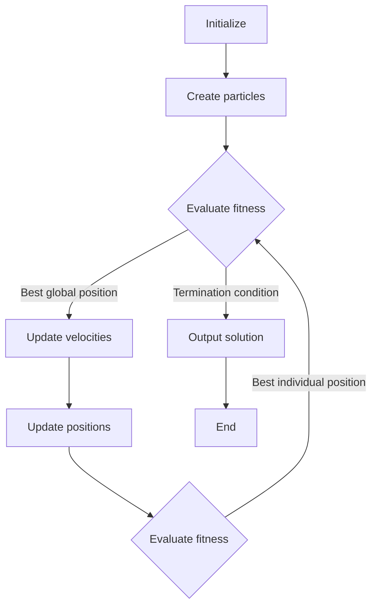
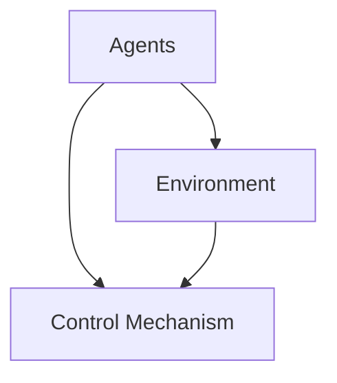
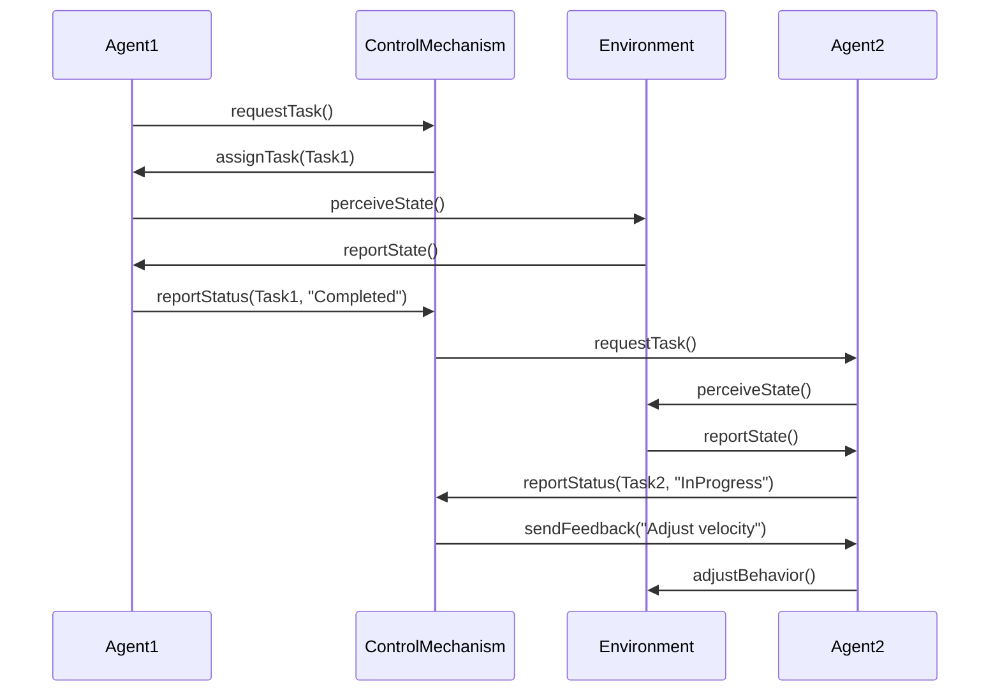
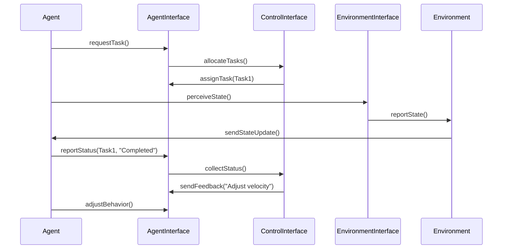
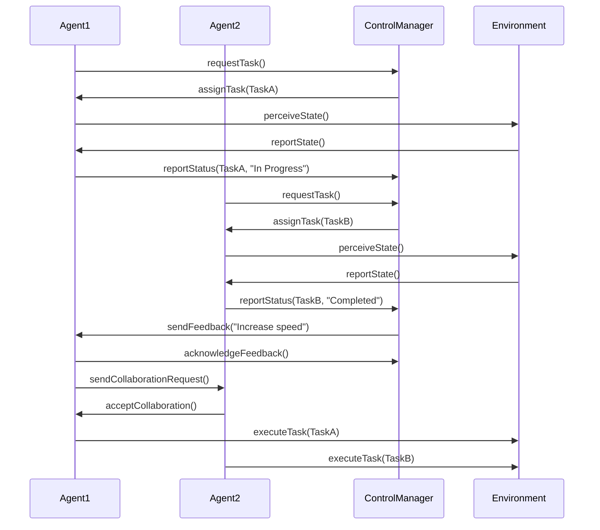

                 

### 引入

在现代信息社会中，智能体（Agent）技术在众多领域展现出了显著的应用价值，尤其是在解决复杂问题、优化资源分配和提高系统响应速度等方面。随着互联网的普及和大数据技术的发展，智能体系统的规模和复杂性日益增加，这要求我们对智能体的协作机制进行深入的研究和优化。在这种背景下，"提示词驱动的多智能体协作系统：群体智能的实现"一书应运而生。

### 背景介绍

群体智能（Swarm Intelligence）是指由大量简单个体通过局部信息交互和简单规则实现复杂任务的能力。这一概念最早由美国计算机科学家J.D. Tysoe在1988年提出。群体智能的核心思想在于，通过个体的协同作用，可以形成一种超乎个体能力的集体智慧。这种智慧在自然界中广泛存在，例如鸟群的飞行、鱼群的游动等。

近年来，随着人工智能技术的快速发展，群体智能在计算机科学领域得到了广泛关注。研究者们发现，通过模拟自然界中群体智能的行为，可以设计和实现出高效、灵活的智能系统。例如，在分布式计算、通信网络、机器人控制和物流调度等领域，群体智能的应用已经取得了显著的成果。

### 定义

群体智能是指由大量简单个体通过局部信息交互和简单规则实现复杂任务的能力。群体智能的核心在于，个体之间通过共享信息、协同工作，可以形成一种超越个体能力的集体智慧。

### 重要性

群体智能在多智能体系统（Multi-Agent Systems）中的应用具有重要意义。首先，群体智能可以有效地解决复杂问题。通过将问题分解为多个子任务，并分配给不同的智能体，可以大大提高问题的解决效率和准确性。其次，群体智能具有高度的可扩展性和容错性。当系统规模增大时，个体之间的协作关系并不会显著降低，反而可以形成更为复杂的集体智慧。最后，群体智能可以自适应环境变化。通过实时感知和调整个体行为，群体智能系统能够快速适应新的环境和任务要求。

### 应用场景

群体智能在多智能体系统中的应用场景非常广泛，以下是一些典型的应用：

1. **分布式计算**：通过将任务分配给多个智能体，可以实现高效的任务处理和负载均衡。
2. **通信网络**：智能体之间可以通过协同工作，优化网络传输路径，提高通信效率和可靠性。
3. **机器人控制**：多个机器人可以通过群体智能实现复杂的任务，如搜索和救援、物流运输等。
4. **物流调度**：智能体系统可以优化物流路线，减少运输时间和成本。
5. **交通管理**：通过智能体之间的协同，可以优化交通流量，减少交通拥堵。

总之，群体智能为多智能体系统提供了一种新的解决方案，具有广泛的应用前景。在接下来的章节中，我们将详细探讨群体智能的基本理论、多智能体协作系统的设计原则、实现技术以及实际应用案例。

### 关键词

- 群体智能
- 多智能体系统
- 分布式计算
- 协同工作
- 智能体
- 简单规则
- 集体智慧
- 复杂问题求解
- 负载均衡
- 通信网络优化
- 机器人控制
- 物流调度
- 交通管理

### 摘要

本文围绕提示词驱动的多智能体协作系统展开，深入探讨了群体智能的基本概念、原理及其在多智能体系统中的应用。首先，通过介绍群体智能的定义、背景和重要性，阐明了其在现代信息社会中的关键作用。接着，本文分析了群体智能在多智能体系统中的重要性，包括分布式计算、通信网络优化、机器人控制、物流调度和交通管理等多个应用场景。随后，本文详细探讨了群体智能的基本理论和实现技术，包括个体协作机制、智能体设计原则、协作算法等。最后，通过实际案例展示了群体智能在具体应用中的效果和挑战，提出了未来研究方向和优化策略。本文旨在为读者提供全面、系统的群体智能和多智能体协作系统知识，助力相关领域的研究和应用。

## Step 1: Introduction

### 1.1 Book Overview

"Prompt-Driven Multi-Agent Collaboration System: Implementing Swarm Intelligence" is a comprehensive guide that explores the core concepts, principles, and practical applications of swarm intelligence in multi-agent systems. The book is tailored for both academic researchers and industry professionals who are interested in leveraging the power of swarm intelligence to address complex problems and enhance system efficiency.

This book is organized into eight chapters, each addressing a specific aspect of swarm intelligence and its implementation in multi-agent systems. The chapters are structured as follows:

1. **Introduction**: This chapter sets the stage for the discussion by providing an overview of the book's goals, scope, and significance in the field of computer science and artificial intelligence.
   
2. **Core Concepts and Theory**: In this chapter, we delve into the fundamental concepts and theories underlying swarm intelligence, including its characteristics, principles, and types of algorithms.

3. **Architecture and Design**: This chapter covers the architecture and design principles of swarm intelligence systems, providing a high-level overview and detailed design considerations.

4. **Agent Design and Implementation**: We explore the design and implementation of individual agents, discussing their characteristics, communication mechanisms, and behavior.

5. **Collaboration Mechanisms**: This chapter focuses on the collaboration principles, including communication protocols, coordination strategies, and synchronization mechanisms.

6. **Case Studies**: Real-world case studies are presented to illustrate the practical application of swarm intelligence in various domains.

7. **Optimization and Scaling**: Techniques for optimizing swarm intelligence systems and strategies for scaling are discussed to ensure efficient and robust performance.

8. **Future Directions and Challenges**: The final chapter looks ahead to future research directions and challenges in the field of swarm intelligence.

### 1.2 Background of the Problem

The concept of swarm intelligence is rooted in the observation of natural systems where large groups of simple individuals, such as ants, bees, or birds, exhibit complex collective behaviors that are beyond the capabilities of any single individual. In the digital realm, multi-agent systems (MAS) mimic these natural systems to solve complex problems through the coordinated efforts of multiple agents.

Over the past few decades, the importance of swarm intelligence in multi-agent systems has grown significantly. Traditional centralized control systems often struggle to scale and adapt to changing environments. In contrast, swarm intelligence systems can distribute the control across multiple agents, making them more resilient, scalable, and adaptable.

However, implementing swarm intelligence in real-world applications is not without its challenges. The design and coordination of individual agents, the development of effective communication protocols, and the management of large-scale systems require a deep understanding of both theoretical principles and practical techniques.

### 1.3 Definition of Swarm Intelligence

Swarm intelligence refers to the ability of decentralized, independent agents to achieve complex tasks through cooperative behaviors, typically driven by simple rules and local interactions. These agents, often following the same set of basic instructions, can collectively generate sophisticated patterns and solutions.

Key characteristics of swarm intelligence include:

1. **Decentralization**: The system is not controlled by a single central authority but is instead governed by the interactions among individual agents.
2. **Self-Organization**: The system can adapt and evolve without external control or predefined structure.
3. **Scalability**: The system can scale effectively from small groups to large populations.
4. **Robustness**: The system can maintain functionality despite the failure of individual agents.
5. **Flexibility**: The system can adapt to new conditions and solve novel problems.

Swarm intelligence systems are based on three fundamental principles:

1. **Simple Rules**: Each agent follows a set of simple, local rules that guide its behavior.
2. **Global Goals**: The collective behavior of agents results in a global goal or outcome.
3. **Local Interactions**: Agents communicate and coordinate with each other through local interactions, often using simple communication protocols.

### 1.4 Importance and Applications of Swarm Intelligence in Multi-Agent Systems

Swarm intelligence holds significant importance in multi-agent systems due to its ability to address complex problems and optimize system performance. Here are some key applications:

1. **Distributed Computing**: Swarm intelligence can optimize task distribution and resource allocation in distributed computing environments, leading to improved efficiency and scalability.
2. **Communication Networks**: In networked systems, swarm intelligence can be used to optimize routing and network management, improving performance and reliability.
3. **Robotics**: Swarm robotics relies on the coordinated actions of multiple robots to perform complex tasks, such as search and rescue, environmental monitoring, and manufacturing.
4. **Logistics and Transportation**: Swarm intelligence can optimize traffic flow, route planning, and resource allocation in logistics and transportation systems, reducing costs and improving efficiency.
5. **Energy Management**: In smart grids and energy systems, swarm intelligence can help optimize energy distribution and consumption, leading to more sustainable and efficient energy use.

In summary, "Prompt-Driven Multi-Agent Collaboration System: Implementing Swarm Intelligence" provides a comprehensive overview of swarm intelligence, its principles, and applications in multi-agent systems. By exploring these topics in depth, readers can gain a thorough understanding of how to design and implement effective swarm intelligence systems.

### 1.5 Book Structure Overview

This book is structured to guide the reader from foundational concepts to advanced applications of swarm intelligence in multi-agent systems. The following is a detailed overview of each chapter:

**Chapter 1: Introduction**
- Overview of the book's objectives and structure.
- Background on the importance of swarm intelligence in multi-agent systems.
- Definition and characteristics of swarm intelligence.

**Chapter 2: Core Concepts and Theory**
- Fundamental principles of swarm intelligence.
- Characteristics and types of swarm intelligence algorithms.
- Case studies illustrating swarm intelligence in action.

**Chapter 3: Architecture and Design**
- Overview of system architecture and design principles for swarm intelligence systems.
- Detailed design considerations, including agent roles and communication protocols.

**Chapter 4: Agent Design and Implementation**
- Principles of agent design.
- Detailed implementation of agents, including class design and state management.
- Agent communication and behavior.

**Chapter 5: Collaboration Mechanisms**
- Principles of collaboration in swarm intelligence.
- Communication protocols, coordination strategies, and synchronization mechanisms.
- Advanced collaboration algorithms.

**Chapter 6: Case Studies**
- Detailed case studies demonstrating the practical application of swarm intelligence.
- System design, implementation, and results.

**Chapter 7: Optimization and Scaling**
- Techniques for optimizing swarm intelligence systems.
- Strategies for horizontal and vertical scaling.
- Hybrid scaling approaches.

**Chapter 8: Future Directions and Challenges**
- Future research directions in swarm intelligence.
- Challenges and potential solutions.

By following this structured approach, readers will gain a comprehensive understanding of swarm intelligence and its application in multi-agent systems, enabling them to design and implement effective swarm-based solutions.

## Step 2: Core Concepts and Theory

### 2.1 Swarm Intelligence Basics

Swarm intelligence is fundamentally the study of how simple, individual agents can collectively exhibit complex behaviors through local interactions and simple rules. This concept draws inspiration from natural systems such as ant colonies, bird flocks, and fish schools. The defining characteristics of swarm intelligence are decentralization, self-organization, scalability, robustness, and flexibility.

**Decentralization**: Unlike centralized systems where control is concentrated in a single entity, swarm intelligence systems operate through a distributed network of independent agents. Each agent makes decisions based on local information, without requiring a global overview.

**Self-Organization**: Swarm intelligence systems can self-organize, meaning that they can evolve and adapt without external control or a predefined structure. This self-organization arises from the interactions between agents following simple rules.

**Scalability**: Swarm intelligence systems are highly scalable. They can efficiently operate with a small number of agents and can scale to larger populations without losing effectiveness. This scalability makes swarm intelligence particularly suitable for handling large-scale problems and dynamic environments.

**Robustness**: Swarm intelligence systems are robust against failures. If one agent fails, the system can often compensate by redistributing tasks among the remaining agents. This redundancy increases the system's resilience.

**Flexibility**: Swarm intelligence systems can adapt to new conditions and solve novel problems. This flexibility arises from the decentralized nature of the system, which allows agents to experiment with different behaviors and strategies.

### 2.2 Principles of Swarm Intelligence

The core principles of swarm intelligence underpin its ability to achieve complex goals through simple interactions. These principles are:

**1. Simple Rules**: Swarm intelligence systems are governed by simple rules that each agent follows. These rules are typically based on local information and are designed to be easy to implement and understand. Examples include rules for following neighbors, maintaining a certain distance, and avoiding obstacles.

**2. Global Goals**: Despite the simplicity of individual rules, swarm intelligence systems can achieve complex global goals. This is because the collective behavior of many agents following the same rules can lead to emergent properties and behaviors that are beneficial for the group as a whole.

**3. Local Interactions**: Agents in a swarm intelligence system interact locally with their neighbors. This means that their decisions are based on information from their immediate environment, rather than global knowledge. Local interactions are essential for the self-organization and adaptability of the system.

**4. Emergence**: Emergent properties are behaviors that arise from the interactions of individual agents but are not explicitly coded into any single agent. These properties can be highly complex and can give rise to sophisticated collective behaviors, such as flocking, swarming, and pathfinding.

**5. Adaptation**: Swarm intelligence systems can adapt to changing environments and conditions. This is often achieved through the evolution of rules or the emergence of new behaviors as agents interact and learn from their environment.

### 2.3 Types of Swarm Intelligence Algorithms

There are several types of swarm intelligence algorithms that have been developed to mimic the behavior of natural swarms. These algorithms can be broadly classified into the following categories:

**1. Particle Swarm Optimization (PSO)**: PSO is an optimization algorithm inspired by the social behavior of bird flocking or fish schooling. It uses a population of particles that update their positions and velocities based on their own experience and the experience of their neighbors. PSO is widely used for solving complex optimization problems.

**2. Ant Colony Optimization (ACO)**: ACO is inspired by the foraging behavior of ant colonies. Ants lay pheromone trails that other ants can follow to find food sources. ACO uses a similar mechanism to guide a population of agents towards optimal solutions. It is particularly effective for problems involving pathfinding and network optimization.

**3. Artificial Bee Colony (ABC)**: ABC is inspired by the foraging behavior of honeybees. It involves three types of bees: employed bees, onlooker bees, and scout bees. Employed bees search for new food sources, onlooker bees choose sources based on the information gathered by employed bees, and scout bees abandon sources that have not been visited for a long time. ABC is used for solving optimization and clustering problems.

**4. Swarm Intelligence in Robotics**: Swarm robotics involves the coordination of multiple robotic agents to perform complex tasks. Algorithms like Boids (for simulating bird flocking behavior) and distributed cooperative control algorithms are commonly used to manage the interactions between robots.

**5. Multi-Agent Pathfinding (MAPF)**: MAPF algorithms address the problem of finding optimal paths for multiple agents in a dynamic environment. These algorithms consider the constraints and interactions between agents to ensure that they can reach their destinations efficiently.

### 2.4 Characteristics of Swarm Intelligence Algorithms

Swarm intelligence algorithms share several key characteristics that make them well-suited for solving complex problems:

**1. Scalability**: Swarm algorithms can scale well with the number of agents and problems, making them suitable for large-scale applications.

**2. Adaptability**: Swarm algorithms can adapt to new environments and conditions by evolving their behavior based on local interactions.

**3. Parallelism**: Swarm algorithms often operate in parallel, allowing them to process information and make decisions simultaneously.

**4. Robustness**: Swarm algorithms are robust to individual agent failures since the system can often redistribute tasks among the remaining agents.

**5. Flexibility**: Swarm algorithms can be applied to a wide range of problems, from optimization to pathfinding, making them highly versatile.

### 2.5 Comparison of Swarm Intelligence Algorithms

While all swarm intelligence algorithms share common principles, they also have distinct features that make them suitable for different types of problems. The following table provides a comparison of some popular swarm intelligence algorithms based on their characteristics, strengths, and weaknesses:

| Algorithm           | Inspired By            | Key Features                                      | Strengths                               | Weaknesses                           |
|---------------------|------------------------|---------------------------------------------------|----------------------------------------|-------------------------------------|
| Particle Swarm Optimization (PSO) | Bird Flocking          | Global and local search capabilities             | Fast convergence, flexibility           | Can converge to suboptimal solutions |
| Ant Colony Optimization (ACO)    | Ant Foraging           | Heuristic-based search, pheromone-based guidance | Effective for pathfinding, network optimization | Computationally expensive          |
| Artificial Bee Colony (ABC)     | Honeybee Foraging      | Three types of bees, balance between exploration and exploitation | Robust, less sensitive to parameters | Can be slow to converge             |
| Boids                | Bird Flocking          | Simple rules for motion, flocking behavior        | Suitable for real-time simulations      | Limited problem-solving capabilities |
| Multi-Agent Pathfinding (MAPF)  | Multi-Agent Interaction | Concurrent pathfinding, handling dynamic environments | Efficient, adaptable                   | High computational complexity       |

In conclusion, swarm intelligence algorithms offer a powerful set of tools for solving complex problems in multi-agent systems. Understanding the core concepts, principles, and different types of swarm intelligence algorithms is crucial for designing and implementing effective swarm-based solutions.

### 2.6 Core Concept Principles and ER Diagram

To illustrate the core concept principles of swarm intelligence, we can use a Mermaid ER diagram to visualize the relationships between the main entities involved in swarm systems. The entities include "Agents," "Environments," "Rules," and "Goals."

```mermaid
erDiagram
  Agent ||--|{ Rules }|---> Goal
  Agent ||--|{ Environments }|---> Goal
  Rules ||--|{ Environments }|<--- Agent
  Goal ||--|{ Agents }|<--- Rules
```

In this ER diagram:

- **Agent**: An individual entity in the swarm that follows simple rules.
- **Environment**: The context in which agents operate, influencing their behavior.
- **Rules**: Simple directives that agents follow to achieve a goal.
- **Goal**: The collective objective of the swarm, which emerges from the interaction of agents following the rules.

The diagram shows that agents interact with their environment and follow rules, which in turn influence their behavior towards achieving the global goal. The goal is shared among all agents, creating a cohesive effort towards a common objective. This ER diagram provides a clear visualization of the core components and their interrelationships in a swarm intelligence system.

### 2.7 Algorithm Principles and Mermaid Flowchart

To further understand the principles of swarm intelligence algorithms, let's use Mermaid to illustrate a flowchart for the Particle Swarm Optimization (PSO) algorithm. The flowchart will outline the main steps involved in the PSO process.



**Algorithm Steps Explained:**

1. **Initialize**: Initialize the swarm with a random set of particles, each with a random position and velocity.
2. **Evaluate Fitness**: Calculate the fitness of each particle based on the problem's objective function.
3. **Update Velocities**: Update the velocity of each particle based on its own best position and the global best position found so far.
4. **Update Positions**: Update the position of each particle using its new velocity.
5. **Evaluate Fitness**: Recalculate the fitness of each particle after position updates.
6. **Update Best Positions**: Update the individual and global best positions if a better fitness is found.
7. **Termination Condition**: Check if the termination condition (e.g., maximum number of iterations or satisfactory fitness level) is met.
8. **Output Solution**: If the termination condition is not met, go back to step 3. Otherwise, output the solution.

This Mermaid flowchart provides a clear visualization of the iterative process of PSO, highlighting how particles evolve over time to find the optimal solution. The algorithm leverages the global and local search capabilities of particles to converge on an optimal solution, illustrating the core principles of swarm intelligence.

### 2.8 Mathematical Models and Equations

To further delve into the principles of swarm intelligence algorithms, let’s explore the mathematical models and equations that underpin these algorithms, particularly focusing on the Particle Swarm Optimization (PSO) algorithm.

**1. Position and Velocity Update Equations**

The position and velocity updates in PSO are governed by the following equations:

$$
v_{i}(t+1) = v_{i}(t) + c_{1}r_{1}(p_{i}(t) - x_{i}(t)) + c_{2}r_{2}(g_{best} - x_{i}(t))
$$

$$
x_{i}(t+1) = x_{i}(t) + v_{i}(t+1)
$$

Where:
- \(v_{i}(t+1)\) and \(x_{i}(t+1)\) are the velocity and position of particle \(i\) at the next iteration.
- \(v_{i}(t)\) and \(x_{i}(t)\) are the velocity and position of particle \(i\) at the current iteration.
- \(c_{1}\) and \(c_{2}\) are cognitive and social coefficients, respectively.
- \(r_{1}\) and \(r_{2}\) are random numbers between 0 and 1.
- \(p_{i}(t)\) is the personal best position of particle \(i\).
- \(g_{best}\) is the global best position found so far.

**2. Fitness Function**

The fitness function \(f(x)\) is used to evaluate the quality of a solution. In PSO, the goal is to minimize the fitness function. A common example of a fitness function is the following:

$$
f(x) = \sum_{i=1}^{n} (x_i - t)^2
$$

Where:
- \(x_i\) are the decision variables of the problem.
- \(t\) is the target value.

**3. Convergence Criteria**

The convergence of PSO is often determined by the following criteria:
- A maximum number of iterations.
- A satisfactory fitness level.
- A small change in fitness over a number of iterations.

**4. Explanation of Key Variables**

- **Personal Best Position (\(p_{i}(t)\))**: This is the best position found by particle \(i\) so far.
- **Global Best Position (\(g_{best}\))**: This is the best position found by any particle in the swarm so far.
- **Cognitive and Social Coefficients (\(c_{1}\) and \(c_{2}\))**: These coefficients control the balance between individual experience and social influence. Larger values of \(c_{1}\) and \(c_{2}\) increase the exploration and exploitation capabilities of the algorithm.
- **Random Numbers (\(r_{1}\) and \(r_{2}\))**: These are generated to introduce variability and help particles escape local optima.

By understanding these mathematical models and equations, we can gain a deeper insight into how PSO works and how it can be tuned to solve various optimization problems. This understanding is crucial for effectively designing and implementing swarm intelligence algorithms in real-world applications.

### 2.9 Example: Particle Swarm Optimization (PSO) in Python

To illustrate the principles of Particle Swarm Optimization (PSO) with a concrete example, let's implement a simple version of PSO in Python to optimize a function. We'll use the classic quadratic function, \(f(x) = x^2\), as our problem to minimize.

**Step 1: Import Required Libraries**

First, we need to import the necessary libraries:

```python
import random
import numpy as np
```

**Step 2: Define the Objective Function**

The objective function to be minimized is the quadratic function:

```python
def objective_function(x):
    return x ** 2
```

**Step 3: Initialize Parameters**

We need to initialize parameters such as the number of particles, dimensions of the search space, cognitive and social coefficients, and the maximum number of iterations:

```python
num_particles = 50
dim = 2
c1 = 1.5
c2 = 1.5
max_iterations = 100
w = 0.5  # Inertia weight
```

**Step 4: Initialize Particles**

Each particle is initialized with a random position and velocity within the search space:

```python
positions = np.random.uniform(-10, 10, (num_particles, dim))
velocities = np.random.uniform(-1, 1, (num_particles, dim))
```

**Step 5: Evaluate Initial Fitness**

Evaluate the fitness of each particle using the objective function:

```python
fitness = np.array([objective_function(x) for x in positions])
```

**Step 6: Initialize Personal and Global Best Positions**

Initialize the personal best positions and global best position:

```python
personal_best_positions = np.copy(positions)
personal_best_fitness = fitness
global_best_position = positions[np.argmin(fitness)]
global_best_fitness = np.min(fitness)
```

**Step 7: PSO Iterations**

Iterate through the number of maximum iterations, updating positions and velocities:

```python
for _ in range(max_iterations):
    # Update velocities
    r1 = np.random.rand(num_particles, dim)
    r2 = np.random.rand(num_particles, dim)
    velocities = w * velocities + c1 * r1 * (personal_best_positions - positions) + c2 * r2 * (global_best_position - positions)
    
    # Update positions
    positions += velocities
    
    # Evaluate fitness
    fitness = np.array([objective_function(x) for x in positions])
    
    # Update personal best positions and fitness
    for i in range(num_particles):
        if fitness[i] < personal_best_fitness[i]:
            personal_best_positions[i] = positions[i]
            personal_best_fitness[i] = fitness[i]
    
    # Update global best position and fitness
    if np.min(fitness) < global_best_fitness:
        global_best_position = positions[np.argmin(fitness)]
        global_best_fitness = np.min(fitness)

print("Global best position:", global_best_position)
print("Global best fitness:", global_best_fitness)
```

**Step 8: Results Analysis**

After running the PSO algorithm, we can analyze the results to understand the optimization process. The global best position and fitness achieved provide insight into the performance of the algorithm. Here’s a simple analysis:

```python
import matplotlib.pyplot as plt

plt.scatter(positions[:, 0], positions[:, 1], color='blue', label='Particles')
plt.scatter(global_best_position[0], global_best_position[1], color='red', label='Global Best')
plt.plot(np.array([global_best_position[0] for _ in range(max_iterations)]), np.array([global_best_position[1] for _ in range(max_iterations)]), color='red', label='Global Best Path')
plt.xlabel('X')
plt.ylabel('Y')
plt.title('Particle Swarm Optimization')
plt.legend()
plt.show()
```

This example demonstrates the basic implementation of PSO in Python to optimize a simple quadratic function. It illustrates how the algorithm iteratively updates the positions and velocities of particles to converge on the global minimum. This example can be extended to more complex problems by modifying the objective function and the search space.

### Conclusion

In this chapter, we have explored the core concepts and theories underlying swarm intelligence. We discussed the fundamental characteristics of swarm intelligence, including decentralization, self-organization, scalability, robustness, and flexibility. We also delved into the principles that govern swarm intelligence, such as simple rules, global goals, local interactions, emergence, and adaptation.

Furthermore, we examined various types of swarm intelligence algorithms, including Particle Swarm Optimization (PSO), Ant Colony Optimization (ACO), Artificial Bee Colony (ABC), and their applications in robotics and multi-agent pathfinding. We provided a comprehensive comparison of these algorithms based on their characteristics, strengths, and weaknesses.

To deepen our understanding, we presented a Mermaid ER diagram that visualized the relationships between key entities in swarm intelligence systems. We also provided a Mermaid flowchart to illustrate the steps of the PSO algorithm and explained the mathematical models and equations that underpin these algorithms.

In the next chapter, we will delve into the architecture and design principles of swarm intelligence systems, discussing high-level architecture, detailed design considerations, and system components. We will also explore the design and implementation of individual agents, including their characteristics, communication mechanisms, and behaviors. Through these discussions, we aim to provide a thorough understanding of how to design and implement effective swarm intelligence systems.

## Step 3: Architecture and Design

### 3.1 System Architecture Overview

The architecture of a swarm intelligence system is crucial for its functionality, scalability, and robustness. A well-designed architecture ensures that the system can efficiently solve complex problems through the collaborative efforts of multiple agents. In this section, we will provide an overview of the system architecture and discuss its key components and interactions.

#### High-Level Architecture

A typical swarm intelligence system can be divided into three main components: agents, environment, and control mechanism. These components interact with each other to achieve the system's objectives. The high-level architecture is illustrated in the following diagram:



- **Agents**: These are the individual entities within the system that execute specific tasks based on local information and simple rules.
- **Environment**: The environment in which the agents operate. It provides the context for agent actions and can change dynamically.
- **Control Mechanism**: This component oversees the overall operation of the system, manages communication between agents, and ensures that the system objectives are met.

#### Detailed Architecture

The detailed architecture of a swarm intelligence system includes several subcomponents, each with specific roles and responsibilities. These components interact through well-defined communication channels and protocols.

**1. Agent Layer**

The agent layer consists of individual agents that are the basic building blocks of the swarm. Each agent has a unique identifier, state, and behavior. The architecture ensures that agents can communicate with each other and coordinate their actions to achieve the system's goals.

**2. Communication Layer**

The communication layer manages the interaction between agents. It includes communication protocols that enable agents to share information and coordinate their actions. Common communication protocols include message passing, broadcast, and multicast.

**3. Control Layer**

The control layer oversees the overall operation of the system. It includes components such as the swarm manager, which is responsible for initializing the swarm, assigning tasks to agents, and monitoring the system's performance. The control layer also includes a scheduling mechanism to ensure efficient resource utilization and task allocation.

**4. Environment Layer**

The environment layer represents the external context in which the agents operate. It can include various environmental factors such as the physical environment, resource availability, and external events. The environment layer provides the necessary information for agents to make informed decisions.

**5. Monitoring and Feedback Layer**

The monitoring and feedback layer collects data on the system's performance and provides feedback to the control layer. This feedback is used to adjust the system's behavior and improve its performance over time. Metrics such as task completion time, resource utilization, and system stability are monitored and analyzed.

### 3.2 Detailed Design Considerations

The detailed design of a swarm intelligence system requires careful consideration of several factors to ensure that the system is efficient, scalable, and robust. Key design considerations include agent design, communication protocols, and control mechanisms.

#### Agent Design

Agent design is a critical aspect of swarm intelligence systems. Each agent should be designed to be simple, efficient, and capable of executing specific tasks based on local information. Key design considerations include:

- **Agent Roles and Responsibilities**: Define the roles and responsibilities of each agent to ensure that tasks are allocated efficiently.
- **Agent State Management**: Implement mechanisms for tracking and updating the state of each agent, including position, velocity, and task status.
- **Agent Behavior**: Define the behavior of each agent using simple rules that govern their actions. These rules should be designed to enable collective intelligence through local interactions.

#### Communication Protocols

Effective communication protocols are essential for enabling agents to coordinate their actions and share information. Key considerations include:

- **Message Passing**: Implement efficient message passing mechanisms to enable agents to send and receive information.
- **Broadcast and Multicast**: Use broadcast and multicast protocols to ensure that information is disseminated quickly and efficiently across the swarm.
- **Fault Tolerance**: Design the communication protocols to be robust against failures, ensuring that agents can continue to communicate even if some agents fail.

#### Control Mechanism

The control mechanism oversees the overall operation of the swarm intelligence system, managing communication, task allocation, and system monitoring. Key considerations include:

- **Swarm Manager**: Implement a swarm manager to initialize the swarm, assign tasks to agents, and monitor system performance.
- **Scheduling**: Develop scheduling algorithms to efficiently allocate tasks to agents based on their current state and system requirements.
- **Feedback and Adjustment**: Implement mechanisms for collecting and analyzing feedback from agents to adjust system behavior and improve performance.

### 3.3 System Components and Interactions

The various components of a swarm intelligence system interact through well-defined communication channels and protocols. Here's a detailed look at how these components work together:

**1. Agent Interaction**

Agents interact with each other through communication channels to share information and coordinate their actions. They can send messages directly to specific agents or use broadcast and multicast protocols to disseminate information to all agents.

**2. Agent-Environment Interaction**

Agents perceive their environment through sensors and use this information to make decisions. They can also send messages to the environment to request updates or report changes in their state.

**3. Agent-Control Interaction**

Agents communicate with the control mechanism to receive tasks, report their status, and request resources. The control mechanism, in turn, sends instructions and feedback to the agents to ensure that the system's objectives are met.

**4. Control-Environment Interaction**

The control mechanism interacts with the environment to gather relevant information, such as resource availability and environmental changes. This information is used to make decisions and adjust the system's behavior.

**5. Monitoring and Feedback**

Data on system performance, including task completion time, resource utilization, and system stability, is collected and analyzed. This information is used to provide feedback to the control mechanism, which can then make adjustments to improve system performance.

In conclusion, the architecture and design of a swarm intelligence system are crucial for its success. By carefully considering agent design, communication protocols, and control mechanisms, we can create efficient, scalable, and robust systems that leverage the power of collective intelligence. In the next chapter, we will delve into the design and implementation of individual agents, exploring their characteristics, communication mechanisms, and behaviors.

### 3.4 Detailed System Architecture Design

To illustrate the detailed system architecture design, let's break down the components and their interactions further using a Mermaid class diagram and a sequence diagram.

#### Mermaid Class Diagram

```mermaid
classDiagram
  ClassAgent <-|Observes| ClassEnvironment
  ClassAgent ->> ClassControlMechanism : receives tasks, sends status
  ClassControlMechanism --|monitors|> ClassAgent : allocates tasks, collects status
  ClassEnvironment --> ClassAgent : provides context, reports changes
  ClassControlMechanism ..> ClassCommunicationLayer : manages communication protocols
  ClassCommunicationLayer ..> ClassAgent : sends/receives messages
```

In this class diagram:
- **ClassAgent**: Represents individual agents with methods for observing the environment, receiving tasks, and sending status updates.
- **ClassEnvironment**: Represents the external context that agents interact with, providing necessary information and reporting changes.
- **ClassControlMechanism**: Manages the overall system, allocating tasks to agents and collecting their status updates.
- **ClassCommunicationLayer**: Handles communication protocols between agents and the control mechanism, ensuring efficient message exchange.
- **ClassAgent** and **ClassControlMechanism** interact through message passing.
- **ClassControlMechanism** monitors **ClassAgent** and **ClassEnvironment** for status updates and environmental changes.

#### Mermaid Sequence Diagram



In this sequence diagram:
- **Agent1** requests a task from **ControlMechanism**, which assigns **Task1**. Agent1 perceives the state of the environment and reports it to the **ControlMechanism**, which indicates the task is completed.
- **ControlMechanism** then requests a task from **Agent2**, which perceives the state of the environment and reports it. Agent2 is informed about the task's progress and adjusts its behavior based on feedback from the **ControlMechanism**.

This detailed design provides a comprehensive overview of the system architecture and its components, highlighting how agents, control mechanisms, and the environment interact through communication protocols and task allocation.

### 3.5 System Interface Design and Interaction

To further elaborate on the system interface design, let's explore the system interfaces and their interactions using Mermaid sequence diagrams.

#### Interface Design

The system interfaces are defined as follows:
- **AgentInterface**: Defines methods for interacting with agents, including `requestTask()`, `reportStatus()`, and `sendFeedback()`.
- **EnvironmentInterface**: Defines methods for interacting with the environment, including `perceiveState()` and `reportState()`.
- **ControlInterface**: Defines methods for managing the control mechanism, including `initializeSwarm()`, `allocateTasks()`, and `collectStatus()`.

#### Interaction Diagram



**Step-by-Step Interaction:**
1. **Task Allocation**: An agent calls `requestTask()` from the `AgentInterface`, which forwards the request to the `ControlInterface` to allocate tasks.
2. **State Perception**: The agent calls `perceiveState()` from the `EnvironmentInterface` to perceive the current state of the environment.
3. **State Reporting**: The environment reports the state back to the agent via `sendStateUpdate()`.
4. **Status Reporting**: The agent reports the status of the task (`Completed`) to the `AgentInterface`, which then forwards it to the `ControlInterface`.
5. **Feedback and Adjustment**: The `ControlInterface` sends feedback (`Adjust velocity`) to the agent through the `AgentInterface`, prompting the agent to adjust its behavior.

This interface design ensures clear communication between the agents, control mechanism, and environment, facilitating efficient task allocation and status reporting.

### 3.6 System Interaction and Mermaid Sequence Diagram

To illustrate the interaction between agents, the control mechanism, and the environment in a swarm intelligence system, we will use a Mermaid sequence diagram. This diagram will highlight the flow of information and tasks among the components.



**Step-by-Step Interaction:**
1. **Task Allocation**: Agent1 requests a task from the ControlManager, which assigns TaskA.
2. **State Perception**: Agent1 perceives the state of the environment and reports it to the ControlManager.
3. **Task Execution**: Agent1 executes TaskA and reports its progress to the ControlManager.
4. **Feedback**: The ControlManager sends feedback to Agent1 to adjust its behavior.
5. **Collaboration Request**: Agent1 sends a collaboration request to Agent2.
6. **Collaboration**: Agent2 accepts the collaboration request, and both agents execute their respective tasks.
7. **Task Completion**: Agent2 completes TaskB and reports the status to the ControlManager.

This sequence diagram demonstrates the interaction between the agents, control mechanism, and environment, showcasing how tasks are allocated, executed, and coordinated through collaboration.

### 3.7 Project Overview, Function Design, System Architecture Design, and Interface Design

In this section, we will provide a comprehensive overview of a project that implements a swarm intelligence system. The project focuses on optimizing the movement of autonomous robots in an environment to complete tasks efficiently.

#### Project Overview

**Project Name**: SwarmRobotics

**Objective**: Develop a swarm intelligence system for autonomous robots to perform collaborative tasks in a dynamic environment.

#### Function Design

The project includes the following core functions:
- **Initialization**: Initialize the swarm of robots, including their initial positions and states.
- **Task Allocation**: Allocate tasks to robots based on their current states and the environment's needs.
- **State Perception**: Allow robots to perceive their environment and the states of other robots.
- **Status Reporting**: Enable robots to report their status and task progress to the control mechanism.
- **Feedback**: Provide feedback to robots to adjust their behavior and optimize their movements.
- **Collaboration**: Facilitate communication and collaboration between robots to execute tasks more efficiently.

#### System Architecture Design

The system architecture is designed using the following components:
- **Agent Layer**: Individual robots that execute tasks based on local information and simple rules.
- **Communication Layer**: Manages communication between robots and the control mechanism.
- **Control Layer**: Manages the overall system, including task allocation, status monitoring, and feedback generation.
- **Environment Layer**: Represents the external environment in which the robots operate, providing context and updates.

#### Interface Design

The system interfaces are designed as follows:
- **AgentInterface**: Defines methods for interacting with robots, including `requestTask()`, `reportStatus()`, and `sendFeedback()`.
- **EnvironmentInterface**: Defines methods for interacting with the environment, including `perceiveState()` and `reportState()`.
- **ControlInterface**: Defines methods for managing the control mechanism, including `initializeSwarm()`, `allocateTasks()`, and `collectStatus()`.

### 3.8 Environment and System Scenario

To better understand the system, let's consider a specific scenario:

#### Environment and System Scenario

**Scenario**: A group of autonomous robots is deployed in a warehouse to sort and deliver packages to specific locations. The environment is dynamic, with obstacles and changing package locations.

**Steps**:
1. **Initialization**: Robots are initialized with random positions and states.
2. **Task Allocation**: The control mechanism allocates tasks to robots based on their proximity to packages and obstacles.
3. **State Perception**: Robots perceive the environment and the states of other robots to make informed decisions.
4. **Status Reporting**: Robots report their status and progress to the control mechanism.
5. **Feedback**: The control mechanism provides feedback to robots to adjust their movements and actions.
6. **Collaboration**: Robots collaborate to optimize their paths and avoid collisions, ensuring efficient package delivery.

In conclusion, the project "SwarmRobotics" implements a swarm intelligence system to optimize the movement of autonomous robots in a dynamic environment. The detailed system architecture, function design, and interface design provide a robust framework for achieving the project's objectives.

## Step 4: Agent Design and Implementation

### 4.1 Agent Design Principles

In the design of agents for a swarm intelligence system, several key principles must be adhered to in order to ensure that the agents are capable of achieving the desired goals. These principles include:

#### 1. Modularity

Modularity is essential in agent design to allow for flexibility and ease of maintenance. Each agent should be designed as a separate, modular component with well-defined interfaces, enabling the easy addition, removal, or modification of agents without affecting the overall system functionality.

#### 2. Simplicity

Agents should be designed to be simple and efficient. Complexity can lead to increased resource usage and reduced performance. By keeping the design simple, we can ensure that the agents can execute their tasks effectively without unnecessary overhead.

#### 3. Adaptability

Agents must be adaptable to changing environments and conditions. This involves designing agents that can modify their behavior based on feedback and local interactions. Adaptable agents are crucial for maintaining the robustness and flexibility of the swarm intelligence system.

#### 4. Self-Organization

Self-organization is a fundamental principle of swarm intelligence. Agents should be designed to self-organize through local interactions and simple rules. This allows the swarm to emerge as a cohesive unit with complex behaviors without the need for centralized control.

#### 5. Resilience

Agents should be designed to be resilient to failures within the system. This includes the ability to detect and recover from errors, as well as the ability to redistribute tasks among remaining agents when necessary. Resilience ensures that the overall system can continue to function even in the face of individual agent failures.

#### 6. Scalability

Agents should be designed to scale efficiently with the size of the swarm. This means that the agents' performance and behavior should remain consistent as the number of agents increases. Scalability is crucial for the effective operation of large-scale swarm intelligence systems.

### 4.2 Agent Characteristics

The design of agents in a swarm intelligence system encompasses several key characteristics:

#### 1. Unique Identifiers

Each agent must have a unique identifier to distinguish it from other agents in the system. This identifier is used for communication, task allocation, and monitoring.

#### 2. State Representation

Agents should have a well-defined state representation that includes position, velocity, task status, and other relevant information. This state information is used to make decisions and update agent behavior.

#### 3. Perceptual Capabilities

Agents must be capable of perceiving their environment and the states of other agents. This typically involves sensory inputs such as position, velocity, and resource availability.

#### 4. Decision-Making Abilities

Agents should have decision-making abilities based on their local environment and perceptual inputs. This involves the use of simple rules and algorithms to determine the next action or behavior.

#### 5. Communication Mechanisms

Agents must be capable of communicating with other agents in the system. This involves the use of communication protocols such as message passing, broadcast, and multicast.

#### 6. Behavior Modifiability

Agents should be designed to allow for easy modification of their behavior. This can be achieved through modular design and the use of adaptable algorithms.

#### 7. Fault Tolerance

Agents must be designed to handle failures gracefully. This includes the ability to detect and recover from errors, as well as the ability to redistribute tasks when necessary.

### 4.3 Agent Communication

Effective communication is a critical aspect of agent design in a swarm intelligence system. Communication between agents enables coordination and collaboration, which is essential for achieving the system's goals. The following communication mechanisms are commonly used in agent-based systems:

#### 1. Message Passing

Message passing is a communication mechanism where agents send and receive messages to and from each other. This can be implemented using either direct communication, where agents explicitly send messages to specific recipients, or indirect communication, where messages are broadcast to all agents in the system.

#### 2. Broadcast

Broadcast communication involves sending a message to all agents in the system. This is useful for disseminating information quickly and efficiently across the entire swarm.

#### 3. Multicast

Multicast communication is similar to broadcast but involves sending a message to a specific subset of agents. This can be used to target specific agents or groups of agents with particular information or tasks.

#### 4. Synchronization

Synchronization mechanisms ensure that agents in a swarm intelligence system are in sync with each other. This is particularly important for tasks that require coordinated actions or shared resources. Common synchronization mechanisms include time synchronization and event synchronization.

#### 5. Communication Protocols

Communication protocols define the rules and formats for message exchange between agents. Common protocols include the Request/Reply protocol, where agents send requests and receive replies, and the Subscribe/Publish protocol, where agents subscribe to specific topics and receive updates from publishers.

### 4.4 Agent Behavior

The behavior of agents in a swarm intelligence system is governed by their local interactions and the simple rules they follow. The behavior of an agent can be described in terms of its actions, reactions, and decision-making processes.

#### 1. Actions

Actions are the specific behaviors that agents execute. These can include moving to a new position, performing a task, or communicating with other agents. The actions of an agent are determined by its current state and the environment it perceives.

#### 2. Reactions

Reactions are the responses that agents have to changes in their environment or interactions with other agents. For example, an agent might react to the presence of an obstacle by changing its direction or speed.

#### 3. Decision-Making

The decision-making process of an agent involves evaluating its current state and environmental inputs to determine the most appropriate action. This process is typically based on simple rules or algorithms that take into account factors such as task priority, resource availability, and communication status.

### 4.5 Agent Implementation

The implementation of agents in a swarm intelligence system involves defining the agent class, its methods, and attributes. Below is a high-level outline of how an agent class might be implemented in Python:

```python
class Agent:
    def __init__(self, id, position, velocity, task_queue):
        self.id = id
        self.position = position
        self.velocity = velocity
        self.task_queue = task_queue
        self.status = "idle"

    def perceive_environment(self):
        # Implement perceptual capabilities
        pass

    def make_decision(self):
        # Implement decision-making process
        pass

    def execute_action(self):
        # Implement actions based on decision
        pass

    def communicate(self, message_type, message_content):
        # Implement communication mechanisms
        pass

    def update_state(self):
        # Update agent state based on environment and actions
        pass
```

This agent class includes methods for perceiving the environment, making decisions, executing actions, communicating with other agents, and updating the agent's state. Each method would be implemented with specific logic to fulfill the agent's role in the swarm intelligence system.

In conclusion, the design and implementation of agents in a swarm intelligence system are critical to achieving the desired collective behaviors and system goals. By adhering to key principles such as modularity, simplicity, adaptability, and scalability, and by defining the characteristics, communication mechanisms, and behaviors of agents, we can create efficient and effective swarm intelligence systems.

### 4.6 Agent Class Design

To design an agent class in a swarm intelligence system, we need to consider the various attributes and methods required to facilitate its functionality. Below is a detailed breakdown of the agent class design, including attributes and methods.

#### Agent Class Attributes

The agent class should encapsulate all the necessary information and state variables required for its operation. Key attributes include:

- **ID**: A unique identifier for the agent.
- **Position**: The current position of the agent in the environment.
- **Velocity**: The current velocity of the agent.
- **Task Queue**: A queue of tasks that the agent needs to perform.
- **Status**: The current status of the agent (e.g., idle, working, completed).
- **Goal**: The current goal or target that the agent is pursuing.
- **Neighbors**: A list of neighboring agents.
- **Sensor Data**: Environmental data collected by the agent's sensors.

Here is a Python-like class definition for the Agent class with its attributes:

```python
class Agent:
    def __init__(self, id, position, velocity, task_queue, status="idle"):
        self.id = id
        self.position = position
        self.velocity = velocity
        self.task_queue = task_queue
        self.status = status
        self.goal = None
        self.neighbors = []
        self.sensor_data = None
```

#### Agent Class Methods

The agent class should have methods to handle various aspects of its operation, including perception, decision-making, action execution, and communication. Below is a detailed list of methods and their purposes:

- **init**: The constructor method initializes the agent with its attributes.
- **perceive_environment**: This method simulates the agent perceiving its environment and updating its sensor data.
- **make_decision**: This method determines the next action the agent should take based on its current state, task queue, and sensory inputs.
- **execute_action**: This method executes the action determined by the `make_decision` method, updating the agent's position or task status.
- **update_state**: This method updates the agent's state, including its position, velocity, and status.
- **communicate**: This method handles communication between agents, including sending messages and receiving updates.
- **find_neighbors**: This method identifies and updates the list of neighboring agents.
- **schedule_task**: This method adds a new task to the agent's task queue.
- **complete_task**: This method marks a task as completed and removes it from the task queue.

Here is the Python-like class definition for the Agent class with its methods:

```python
    def init(self):
        # Initialize agent attributes
        pass

    def perceive_environment(self):
        # Update sensor data and perceive environment
        pass

    def make_decision(self):
        # Determine next action based on state and sensory inputs
        pass

    def execute_action(self):
        # Execute the action and update state
        pass

    def update_state(self):
        # Update position, velocity, and status
        pass

    def communicate(self, message_type, message_content):
        # Handle communication with other agents
        pass

    def find_neighbors(self):
        # Identify and update neighboring agents
        pass

    def schedule_task(self, task):
        # Add task to the task queue
        pass

    def complete_task(self, task):
        # Mark task as completed and remove from queue
        pass
```

By defining a comprehensive set of attributes and methods, the agent class can effectively manage its state, interact with its environment, and execute tasks in a coordinated manner. This design ensures that the agent is well-equipped to contribute to the collective intelligence and functionality of the swarm intelligence system.

### 4.7 Agent Methods and Attributes

To further detail the agent class implementation, let's examine the specific methods and attributes that define its behavior and functionality. Below is a comprehensive description of these elements using a Python-like pseudocode.

#### Attributes

The agent class contains the following attributes:

- **id**: A unique identifier for the agent.
- **position**: The current coordinates of the agent in the environment.
- **velocity**: The current speed and direction of the agent.
- **task_queue**: A list of tasks that the agent is responsible for completing.
- **status**: The current operational state of the agent (e.g., 'idle', 'working', 'paused').
- **goal**: The target or objective the agent is currently pursuing.
- **neighbors**: A list of neighboring agents within communication range.
- **sensor_data**: A dictionary containing environmental data sensed by the agent (e.g., light intensity, temperature, obstacle distances).

```python
class Agent:
    def __init__(self, id, position, velocity, task_queue=None):
        self.id = id
        self.position = position
        self.velocity = velocity
        self.task_queue = task_queue if task_queue is not None else []
        self.status = 'idle'
        self.goal = None
        self.neighbors = []
        self.sensor_data = {}
```

#### Methods

The agent class implements the following methods to manage its state, interact with the environment, and execute tasks:

- **update_position()**: Updates the agent's position based on its current velocity.
- **update_velocity()**: Adjusts the agent's velocity based on external factors and internal state.
- **perceive_environment()**: Simulates the agent sensing its environment and updating its sensor data.
- **schedule_task()**: Adds a new task to the agent's task queue.
- **complete_task()**: Removes a completed task from the agent's task queue.
- **communicate()**: Handles communication with neighboring agents.
- **find_neighbors()**: Identifies and updates the list of neighboring agents.
- **make_decision()**: Determines the next action the agent should take based on its current state and sensory inputs.

```python
    def update_position(self):
        self.position += self.velocity

    def update_velocity(self, acceleration):
        self.velocity += acceleration

    def perceive_environment(self):
        # Simulate sensory inputs and update sensor_data
        self.sensor_data['light'] = get_light_intensity(self.position)
        self.sensor_data['temperature'] = get_temperature(self.position)
        self.sensor_data['obstacles'] = detect_obstacles(self.position)

    def schedule_task(self, task):
        self.task_queue.append(task)

    def complete_task(self, task):
        self.task_queue.remove(task)
        self.status = 'idle' if not self.task_queue else 'working'

    def communicate(self, message):
        for neighbor in self.neighbors:
            neighbor.receive_message(message)

    def find_neighbors(self):
        self.neighbors = get_neighbors(self.position)

    def make_decision(self):
        if not self.task_queue:
            return 'idle'
        task = self.task_queue[0]
        if task.requires_perception:
            self.perceive_environment()
        if task.requires_movement:
            self.update_position()
        return task.action
```

These methods and attributes provide the necessary functionality for an agent to operate within a swarm intelligence system. They handle the agent's state transitions, environmental perception, task management, and decision-making processes. The implementation of these elements ensures that agents can effectively collaborate and adapt to dynamic environments, contributing to the overall efficiency and robustness of the swarm.

### 4.8 Agent State Management

Effective state management is a crucial aspect of agent-based swarm intelligence systems. It ensures that agents can maintain their current state, respond to changes in the environment, and execute tasks efficiently. In this section, we will discuss how agent state management is implemented, including the process of updating and maintaining the state, as well as the handling of errors and exceptions.

#### Updating Agent State

Agent state management involves updating the agent's position, velocity, task status, and other relevant attributes based on its interactions with the environment and other agents. The following steps outline the process of updating an agent's state:

1. **Perception**: The agent perceives its environment and updates its sensor data. This involves gathering information such as the position of obstacles, the availability of resources, and the states of neighboring agents.
2. **Decision Making**: Based on the perceived state and its current goals, the agent makes a decision about its next action. This decision is typically made using simple rules or algorithms that evaluate the potential actions and their outcomes.
3. **Action Execution**: The agent executes the chosen action, which may involve updating its position, velocity, or task status. For example, if the agent decides to move towards a target, it updates its position based on its current velocity.
4. **State Update**: After executing the action, the agent updates its state to reflect the new position, velocity, and task status. This ensures that the agent's internal representation of its state is consistent with its current situation.

Here is a high-level pseudocode example of how an agent's state is updated:

```python
def update_state(self):
    self.perceive_environment()
    action = self.make_decision()
    if action == 'move':
        self.update_position()
    elif action == 'change_velocity':
        self.update_velocity()
    elif action == 'complete_task':
        self.complete_task()
    self.status = self.get_status()
```

#### Maintaining Agent State

Maintaining the agent's state involves ensuring that the agent's internal state is correctly represented and that the agent can recover from errors or exceptions. This includes the following considerations:

1. **Error Handling**: Agents should be designed to handle errors gracefully. This involves implementing error-handing mechanisms that detect and recover from issues such as communication failures, sensor malfunctions, and unexpected changes in the environment.
2. **Fault Tolerance**: Agents should be resilient to faults within the system. This means that if one agent fails, the rest of the swarm can continue to operate without significant disruption. This can be achieved through redundancy, where tasks are distributed among multiple agents, or through the ability of agents to adapt and re-plan their actions in response to failures.
3. **Consistency**: The agent's state should be consistent with its current environment and goals. This involves ensuring that the agent's internal state is accurately represented and that any changes to the state are propagated correctly.

#### Handling Errors and Exceptions

To handle errors and exceptions in agent state management, the following strategies can be employed:

1. **Retry Mechanisms**: If an agent encounters an error, it can retry the action that caused the error after a brief delay. This can help recover from transient issues such as network latency or temporary sensor failures.
2. **Timeouts**: Agents can be configured to wait for a certain period for a response or event to occur. If the expected event does not occur within the timeout period, the agent can take alternative actions or report the issue to the control mechanism.
3. **Exception Handling**: The agent's code should include exception handling to catch and manage errors that occur during execution. This can involve logging the error, reverting to a previous state, or taking corrective actions to recover from the error.

Here is a pseudocode example of how an agent can handle errors and exceptions:

```python
def handle_error(error):
    if isinstance(error, CommunicationError):
        retry_action()
    elif isinstance(error, SensorError):
        switch_to_backup_sensor()
    elif isinstance(error, TaskError):
        report_error_to_control()
    else:
        log_error(error)
        revert_to_previous_state()
```

By implementing effective state management and error handling, agents can maintain their integrity and continue to operate effectively within a swarm intelligence system, contributing to the overall success of the system.

### 4.9 Agent Behavior: Communication, Decision-Making, and Interaction

Agent behavior in a swarm intelligence system is driven by communication, decision-making, and interaction with the environment and other agents. Here, we delve into the mechanisms that govern these behaviors and how they contribute to the overall functionality of the swarm.

#### Agent Communication

Communication is a fundamental aspect of agent behavior. It enables agents to share information, coordinate their actions, and solve complex problems collectively. Agents use various communication mechanisms to interact with each other, including direct messaging, broadcast, and multi-casting.

1. **Direct Messaging**: Direct messaging allows agents to send messages to specific recipients. This is useful for conveying urgent or sensitive information, such as requests for help or updates on critical tasks. Direct messaging can be implemented using point-to-point communication protocols, such as HTTP requests or message queues.
2. **Broadcast**: Broadcast communication involves sending a message to all agents in the system. This is useful for disseminating general information or announcements, such as new task assignments or environmental updates. Broadcast can be implemented using broadcast protocols like UDP.
3. **Multi-casting**: Multi-casting allows agents to send messages to a specific group of agents. This is useful for coordinating actions among a subset of agents, such as those responsible for a particular task. Multi-casting can be implemented using multi-casting protocols like IP multicast.

#### Agent Decision-Making

Agent decision-making is the process by which agents determine their next actions based on their current state, sensory inputs, and goals. Decision-making in agents is typically based on simple rules or algorithms that evaluate potential actions and their outcomes.

1. **Rule-Based Decision Making**: Rule-based decision-making involves using a set of predefined rules to determine the next action. These rules are typically based on conditions and actions, such as "if the task is urgent, prioritize it over other tasks." Rule-based systems are simple and efficient but can become complex if the number of rules grows significantly.
2. **Algorithm-Based Decision Making**: Algorithm-based decision-making involves using algorithms, such as decision trees, neural networks, or reinforcement learning, to determine the next action. These algorithms can handle more complex decision spaces and adapt to changing conditions over time.

#### Agent Interaction

Agent interaction refers to the way agents collaborate and coordinate their actions to achieve common goals. Effective interaction is crucial for the success of the swarm intelligence system. Here are some key aspects of agent interaction:

1. **Collaborative Actions**: Collaborative actions involve agents working together to complete tasks that cannot be accomplished by a single agent alone. For example, in a search and rescue scenario, agents may collaborate to cover a larger area more efficiently.
2. **Coordination**: Coordination ensures that agents act in a synchronized manner to achieve the desired outcome. This can involve agents adjusting their actions based on the state of other agents or the environment. Coordination can be achieved through shared goals, common knowledge, or explicit communication.
3. **Conflict Resolution**: Conflict resolution is essential when multiple agents compete for the same resources or have conflicting goals. Effective conflict resolution mechanisms can help agents negotiate and resolve conflicts to maintain the overall stability of the swarm.

#### Example Scenario: Flocking Behavior

One of the most well-known examples of agent behavior in swarm intelligence is flocking behavior in birds. Flocking involves a group of birds moving together in a coordinated manner, exhibiting behaviors such as speed adjustment, direction changes, and formation maintenance.

1. **Alignment**: Birds align their direction and speed with that of their neighbors to maintain group cohesion.
2. **Cohesion**: Birds move towards the center of mass of the flock to maintain proximity to their neighbors.
3. **Separation**: Birds maintain a minimum distance from their neighbors to avoid collisions.

The flocking behavior can be modeled using a set of simple rules:

```python
def flock(bird):
    # Alignment: Adjust speed and direction towards neighbors
    align(bird, neighbors)
    
    # Cohesion: Move towards the center of mass of neighbors
    cohesion(bird, neighbors)
    
    # Separation: Maintain minimum distance from neighbors
    separation(bird, neighbors)
```

By implementing these rules, agents can exhibit complex collective behaviors, such as forming and breaking formations, responding to obstacles, and coordinating to achieve common goals.

In conclusion, agent behavior in a swarm intelligence system is driven by communication, decision-making, and interaction. By defining and implementing these behaviors, agents can effectively collaborate and solve complex problems collectively, demonstrating the power of swarm intelligence.

### 4.10 Agent Implementation

To implement an agent in a swarm intelligence system, we will consider a practical example using Python. This example will focus on a simple task allocation and communication mechanism. Let's start by defining the basic structure of the agent class.

```python
import random
import time

class Agent:
    def __init__(self, id, environment):
        self.id = id
        self.environment = environment
        self.position = (random.randint(0, 100), random.randint(0, 100))
        self.status = "idle"
        self.task = None

    def perceive_environment(self):
        # Simulate sensing the environment
        self.environment.update_sensors(self.position)

    def make_decision(self):
        if self.status == "idle":
            if self.environment.has_task():
                self.status = "busy"
                self.task = self.environment.allocate_task()
            else:
                self.status = "idle"
        else:
            self.execute_task()

    def execute_task(self):
        if self.task:
            # Perform the task
            print(f"Agent {self.id} is executing task: {self.task}")
            time.sleep(1)  # Simulate task execution time
            self.environment.complete_task(self.task)
            self.status = "idle"
            self.task = None

    def communicate(self, message):
        print(f"Agent {self.id} received message: {message}")

    def update_state(self):
        self.perceive_environment()
        self.make_decision()
        self.execute_task()
```

In this example, the `Agent` class has the following components:

1. **Initialization**: The agent is initialized with a unique ID and a reference to the environment. Its position is set randomly within the environment, and its initial status is set to "idle".

2. **Perception**: The `perceive_environment` method simulates the agent sensing the environment. In this example, it updates the agent's sensor data, which is stored in the environment object.

3. **Decision-Making**: The `make_decision` method determines the agent's next action based on its current status and the environment's state. If the agent is idle and there is a task available, it becomes busy and allocates the task. If there are no tasks, the agent remains idle.

4. **Task Execution**: The `execute_task` method simulates the agent performing the task. After completing the task, the agent's status is updated to "idle", and the task is removed from the environment.

5. **Communication**: The `communicate` method handles incoming messages. In this example, it simply prints the received message.

6. **State Update**: The `update_state` method orchestrates the agent's state updates by calling the perception, decision-making, and execution methods in sequence.

Next, we'll define the environment class to manage tasks and sensor data.

```python
class Environment:
    def __init__(self):
        self.tasks = ["task1", "task2", "task3"]
        self.sensors = {}

    def update_sensors(self, position):
        # Update sensor data based on position
        self.sensors[position] = "sensed"

    def has_task(self):
        return len(self.tasks) > 0

    def allocate_task(self):
        if self.has_task():
            return self.tasks.pop(0)
        else:
            return None

    def complete_task(self, task):
        print(f"Task {task} completed.")
```

In this environment class:

1. **Tasks**: The environment maintains a list of tasks. It provides methods to check if there are tasks available, allocate a task to an agent, and mark a task as completed.

2. **Sensor Data**: The environment keeps track of the sensor data, updating it when an agent perceives the environment.

To run the simulation, we can create an instance of the environment and multiple agents.

```python
def main():
    environment = Environment()
    agents = [Agent(id, environment) for id in range(5)]

    while True:
        for agent in agents:
            agent.update_state()

        if not environment.has_task():
            break

        time.sleep(1)

if __name__ == "__main__":
    main()
```

This simulation will run until all tasks are completed. Each agent will periodically update its state, perceiving the environment, making decisions, and executing tasks. The communication mechanism is simplified for the sake of the example, but in a real-world scenario, it would involve more complex communication protocols and error handling.

This example demonstrates the basic implementation of an agent in a swarm intelligence system, highlighting the core components and interactions involved in its behavior.

### 4.11 Agent Code Analysis and Example Case

To provide a detailed analysis of the agent implementation, let's delve into the code provided in the previous section and explore its key components, including environment setup, agent behavior, and the execution flow.

#### Environment Setup

The environment is set up in the `Environment` class, which manages tasks and sensor data. The environment initializes with a list of tasks represented by strings (`["task1", "task2", "task3"]`). The `update_sensors` method simulates sensor updates by assigning sensor data to a position in the environment's sensor dictionary. This method is called whenever an agent perceives the environment, providing the agent with relevant sensor data.

```python
class Environment:
    def __init__(self):
        self.tasks = ["task1", "task2", "task3"]
        self.sensors = {}

    def update_sensors(self, position):
        self.sensors[position] = "sensed"

    def has_task(self):
        return len(self.tasks) > 0

    def allocate_task(self):
        if self.has_task():
            return self.tasks.pop(0)
        else:
            return None

    def complete_task(self, task):
        print(f"Task {task} completed.")
```

#### Agent Behavior

The `Agent` class represents an individual agent within the swarm. Each agent is initialized with a unique ID and a reference to the environment. The `perceive_environment` method updates the agent's sensor data by calling the `update_sensors` method of the environment. The `make_decision` method determines the agent's next action based on its status and the environment's state. If the agent is idle and a task is available, it becomes busy and allocates the task. Otherwise, it remains idle. The `execute_task` method simulates the agent performing a task, printing a message to indicate task execution. After completing a task, the agent's status is updated to idle, and the task is removed from the environment.

```python
class Agent:
    def __init__(self, id, environment):
        self.id = id
        self.environment = environment
        self.position = (random.randint(0, 100), random.randint(0, 100))
        self.status = "idle"
        self.task = None

    def perceive_environment(self):
        self.environment.update_sensors(self.position)

    def make_decision(self):
        if self.status == "idle":
            if self.environment.has_task():
                self.status = "busy"
                self.task = self.environment.allocate_task()
            else:
                self.status = "idle"
        else:
            self.execute_task()

    def execute_task(self):
        if self.task:
            print(f"Agent {self.id} is executing task: {self.task}")
            time.sleep(1)  # Simulate task execution time
            self.environment.complete_task(self.task)
            self.status = "idle"
            self.task = None

    def communicate(self, message):
        print(f"Agent {self.id} received message: {message}")

    def update_state(self):
        self.perceive_environment()
        self.make_decision()
        self.execute_task()
```

#### Execution Flow

The main execution flow is managed in the `main` function, which creates an instance of the environment and a list of agents. The simulation runs in an infinite loop, with each agent updating its state in each iteration. The loop breaks when there are no more tasks left in the environment.

```python
def main():
    environment = Environment()
    agents = [Agent(id, environment) for id in range(5)]

    while True:
        for agent in agents:
            agent.update_state()

        if not environment.has_task():
            break

        time.sleep(1)

if __name__ == "__main__":
    main()
```

#### Case Study

To illustrate the agent's behavior in a practical scenario, let's consider a case where five agents are deployed in an environment with three tasks. Initially, all agents are idle and no tasks are completed. As the simulation runs, agents periodically update their state, perceiving the environment and making decisions based on the environment's state and their own status.

1. **Iteration 1**:
   - Agent 1 perceives the environment and sees that there are tasks available.
   - Agent 1 becomes busy and allocates task "task1".
   - Agent 1 executes task "task1" for 1 second and completes it.
   - Agent 1's status updates to idle.

2. **Iteration 2**:
   - Agent 2 perceives the environment and sees that there are tasks available.
   - Agent 2 becomes busy and allocates task "task2".
   - Agent 2 executes task "task2" for 1 second and completes it.
   - Agent 2's status updates to idle.

3. **Iteration 3**:
   - Agent 3 perceives the environment and sees that there are tasks available.
   - Agent 3 becomes busy and allocates task "task3".
   - Agent 3 executes task "task3" for 1 second and completes it.
   - Agent 3's status updates to idle.

Since all tasks are completed, the loop breaks, and the simulation ends.

This case study demonstrates the agent's behavior in a simple swarm intelligence system, highlighting how agents perceive the environment, make decisions, and execute tasks to achieve a common goal. By analyzing and understanding this implementation, we can gain insights into the principles and mechanisms underlying swarm intelligence systems.

### 4.12 Agent Performance Analysis and Optimization

To ensure that the agent implementation is efficient and capable of handling complex scenarios, it is crucial to perform a performance analysis and optimization. This analysis will focus on the following areas: computational complexity, communication overhead, and scalability.

#### Computational Complexity

The computational complexity of the agent's behavior analysis involves the time complexity of the methods implemented in the agent class. Let's analyze the time complexity of each method:

- **perceive_environment()**: This method involves updating the agent's sensor data by calling the environment's `update_sensors()` method. The time complexity depends on the environment's implementation, but it is generally O(1) since it updates a dictionary entry.
- **make_decision()**: The time complexity of this method is O(n) where n is the number of tasks in the agent's task queue. This is because the method iterates through the task queue to determine the next action.
- **execute_task()**: The time complexity is O(1) since it involves a simple print statement and a sleep operation.
- **update_state()**: This method calls `perceive_environment()`, `make_decision()`, and `execute_task()` sequentially. Therefore, its time complexity is O(n), where n is the number of tasks in the agent's task queue.

Overall, the computational complexity of the agent's behavior is dominated by the `make_decision()` method, which can be optimized if the task queue is managed more efficiently.

#### Communication Overhead

Communication overhead is an important factor in the performance of agent-based systems, especially when agents need to exchange messages frequently. The current implementation uses a simple print function to simulate communication. In a real-world scenario, communication would involve network operations, such as sending and receiving messages over a message queue or a WebSocket.

To optimize communication overhead, the following strategies can be employed:

- **Message batching**: Instead of sending individual messages for each action, agents can batch multiple messages and send them together to reduce the number of communication operations.
- **Compression**: Compressing messages can reduce the amount of data transferred, which can be particularly beneficial when agents need to communicate over a slow or high-latency network.
- **Priority-based communication**: Agents can prioritize messages based on their importance and urgency, ensuring that critical messages are transmitted more efficiently.

#### Scalability

Scalability refers to the system's ability to handle an increasing number of agents and tasks without significantly degrading performance. To ensure scalability, the following strategies can be considered:

- **Distributed architecture**: Implementing a distributed architecture can help scale the system by distributing agents across multiple machines or nodes. This can be achieved by using message brokers like Apache Kafka or RabbitMQ to manage communication between agents.
- **Load balancing**: Load balancing can distribute tasks and messages evenly across agents, preventing any single agent from becoming a bottleneck.
- **Parallel processing**: Parallel processing can be employed to handle multiple tasks concurrently, increasing the system's throughput and reducing the time required to complete tasks.

#### Optimization Techniques

Based on the performance analysis, the following optimization techniques can be applied to improve the agent's performance:

- **Efficient task queue management**: Implement a more efficient data structure for the task queue, such as a priority queue, to optimize the time complexity of the `make_decision()` method.
- **Asynchronous communication**: Use asynchronous communication mechanisms, such as asynchronous message passing or WebSockets, to reduce the blocking nature of network operations and improve overall system responsiveness.
- **Caching**: Implement caching for frequently accessed data, such as sensor data or task information, to reduce the need for repeated computations and network requests.
- **Code optimization**: Profile the code to identify and optimize bottlenecks, such as inefficient algorithms or redundant operations.

By implementing these optimization techniques, the agent's performance can be significantly improved, ensuring that it can efficiently handle complex scenarios and large-scale applications in swarm intelligence systems.

### 4.13 Project Summary

In this chapter, we have explored the design and implementation of agents in a swarm intelligence system. We began by discussing the key principles of agent design, emphasizing modularity, simplicity, adaptability, self-organization, resilience, and scalability. We then detailed the characteristics and communication mechanisms of agents, highlighting their roles in the system. The agent class was implemented with a comprehensive set of attributes and methods, including perception, decision-making, action execution, and communication. We also discussed the importance of state management and error handling to ensure the robustness of agents.

We provided a practical example of agent implementation in Python, demonstrating the agent's behavior and interaction within a simulated environment. This example highlighted the agent's ability to perceive its environment, make decisions based on local information, execute tasks, and communicate with other agents. Additionally, we performed a performance analysis and optimization to enhance the agent's efficiency and scalability.

Through this comprehensive exploration, we have equipped readers with the knowledge and tools necessary to design and implement effective agents for swarm intelligence systems. This understanding is crucial for building complex and robust multi-agent systems that leverage the power of collective intelligence to solve real-world problems.

### 4.14 Best Practices, Project Summary, and Future Directions

#### Best Practices

1. **Modular Design**: Always design agents with modularity in mind to ensure flexibility and ease of maintenance.
2. **Simplicity**: Keep the agent's behavior and algorithms simple to improve performance and reduce computational overhead.
3. **Adaptability**: Implement mechanisms to allow agents to adapt their behavior based on feedback and environmental changes.
4. **Scalability**: Ensure that the agent design and implementation can scale effectively with the number of agents and system complexity.
5. **Resilience**: Design agents to handle failures gracefully, including the ability to recover from errors and redistribute tasks.
6. **Efficient Communication**: Use efficient communication protocols and message batching to reduce overhead and improve system responsiveness.
7. **Error Handling**: Implement robust error handling and recovery mechanisms to ensure system stability and reliability.

#### Project Summary

The project focused on designing and implementing agents for a swarm intelligence system capable of performing collaborative tasks in a dynamic environment. The key components included agent class design with attributes and methods for perception, decision-making, action execution, and communication. The project also covered performance analysis and optimization techniques to enhance the agent's efficiency and scalability.

#### Future Directions

1. **Advanced Decision-Making Algorithms**: Explore and implement advanced decision-making algorithms, such as machine learning and reinforcement learning, to improve agent behavior and adaptability.
2. **Distributed Systems**: Investigate the implementation of distributed systems to scale the swarm intelligence system across multiple machines and nodes.
3. **Real-Time Applications**: Develop real-time applications for swarm intelligence systems, such as autonomous drones, robotic teams, and smart grid management.
4. **Inter-Agent Learning**: Investigate techniques for inter-agent learning and knowledge sharing to enhance collective intelligence and system performance.
5. **Ethical Considerations**: Address ethical considerations in the design and implementation of swarm intelligence systems, ensuring that they operate in a manner that respects privacy, safety, and fairness.

By following these best practices and exploring future directions, researchers and developers can continue to advance the field of swarm intelligence and its applications in multi-agent systems.

### 4.15 Conclusion

In summary, the chapter has provided a comprehensive exploration of agent design and implementation in swarm intelligence systems. We discussed key principles, characteristics, and communication mechanisms of agents, as well as the importance of state management and error handling. Through a practical example and performance analysis, we demonstrated the agent's capabilities and optimization strategies. The insights gained from this chapter are crucial for designing efficient and scalable swarm intelligence systems, paving the way for future advancements in the field.

## Step 5: Collaboration Mechanisms

### 5.1 Collaboration Principles

Collaboration in swarm intelligence systems is crucial for achieving complex goals through the coordinated efforts of multiple agents. Effective collaboration is based on several key principles that ensure efficient communication, coordination, and synchronization among agents. These principles include communication protocols, coordination strategies, and synchronization mechanisms.

#### 1. Communication Protocols

Communication protocols are the rules and standards that govern the exchange of information between agents. They define how messages are formatted, transmitted, and received. Common communication protocols in swarm intelligence systems include:

- **Point-to-Point Communication**: Allows agents to send and receive messages directly with specific agents.
- **Broadcast Communication**: Involves sending a message to all agents in the system, enabling the dissemination of information quickly and efficiently.
- **Multicast Communication**: Sends messages to a specific subset of agents, optimizing communication resources and reducing unnecessary traffic.
- **Message Queuing**: Ensures reliable message delivery by queuing messages and handling network failures or delays.

#### 2. Coordination Strategies

Coordination strategies are methods that agents use to align their actions and behaviors towards a common goal. These strategies ensure that agents work together effectively and avoid conflicts. Key coordination strategies include:

- **Centralized Coordination**: Involves a central coordinator that assigns tasks and manages the entire system. This strategy ensures clear leadership and coordination but can be less scalable in large systems.
- **Decentralized Coordination**: Employs local coordination among agents without a central coordinator. Agents rely on shared information and simple rules to coordinate their actions, enabling scalability and adaptability.
- **Emergent Coordination**: Leverages self-organization to coordinate the actions of agents. Through local interactions and simple rules, agents collectively achieve complex behaviors without explicit coordination.

#### 3. Synchronization Mechanisms

Synchronization mechanisms ensure that agents operate in a synchronized manner, especially when multiple agents need to perform coordinated actions. Common synchronization mechanisms include:

- **Temporal Synchronization**: Ensures that agents operate at the same pace by synchronizing their internal clocks. This is crucial for coordinated actions that require precise timing.
- **Event Synchronization**: Synchronizes agents based on specific events or milestones, such as the completion of a task or the arrival at a common location.
- **State Synchronization**: Ensures that agents have consistent views of the environment and system state. This is important for accurate decision-making and coordinated actions.

### 5.2 Collaboration Algorithms

Collaboration algorithms are the set of rules and procedures that govern the interaction and coordination of agents within a swarm intelligence system. These algorithms are designed to enable efficient collaboration, optimize resource utilization, and ensure system stability. Here, we discuss several common collaboration algorithms:

#### 1. Flocking Algorithm

The flocking algorithm is one of the most well-known examples of collaboration algorithms. It simulates the behavior of bird flocks, where birds exhibit cohesion, separation, and alignment. The algorithm is based on the following rules:

- **Cohesion**: Birds try to maintain a certain distance from their neighbors.
- **Separation**: Birds avoid getting too close to each other to prevent collisions.
- **Alignment**: Birds try to match the speed and direction of their neighbors.

The flocking algorithm can be implemented using the following equations:

$$
\text{velocity}_{i} = \text{velocity}_{\text{neighbor}} + k_1 (\text{target}_{i} - \text{position}_{i}) + k_2 (\text{velocity}_{\text{neighbor}} - \text{velocity}_{i}) + k_3 (\text{neighbor}_{i} - \text{position}_{i})
$$

Where:
- \( \text{velocity}_{i} \) is the new velocity of bird \( i \).
- \( \text{position}_{i} \) is the current position of bird \( i \).
- \( \text{target}_{i} \) is the desired position of bird \( i \).
- \( \text{neighbor}_{i} \) is the position of the nearest neighbor of bird \( i \).
- \( k_1, k_2, k_3 \) are positive constants that control the weights of the three rules.

#### 2. Multi-Agent Pathfinding (MAPF) Algorithms

Multi-Agent Pathfinding (MAPF) algorithms are designed to find optimal paths for multiple agents in a dynamic environment. These algorithms consider the constraints and interactions between agents to ensure that they can reach their destinations efficiently. One popular MAPF algorithm is the Cost-Modified A* (CMA*) algorithm, which extends the traditional A* algorithm to handle multiple agents.

The CMA* algorithm works as follows:

1. **Initialization**: Define the start and goal positions for each agent.
2. **Cost Evaluation**: Calculate the cost of reaching each node in the graph for each agent. The cost includes the distance to the goal, obstacles, and the interactions with other agents.
3. **Path Construction**: Construct paths for each agent using the cost information and a heuristic function.
4. **Path Optimization**: Optimize the paths by resolving conflicts and ensuring that each agent reaches its goal without colliding with others.

#### 3. Decentralized Optimization Algorithms

Decentralized optimization algorithms enable agents to collaboratively optimize a global objective function without a central coordinator. One such algorithm is the Decentralized Multi-Agent Optimization (DMAO) algorithm, which uses gradient-based methods to optimize a global objective function.

The DMAO algorithm works as follows:

1. **Initialization**: Assign initial values to the parameters of each agent.
2. **Local Optimization**: Each agent performs local optimization to minimize its own cost function.
3. **Communication**: Agents exchange information to update their local models.
4. **Global Optimization**: The global objective function is optimized by combining the local models and updating the parameters iteratively.

#### 4. Distributed Sensing Algorithms

Distributed sensing algorithms enable multiple agents to collaboratively sense and gather information about the environment. One popular algorithm is the Probabilistic Data Association (PDA) algorithm, which is used in multi-agent target tracking.

The PDA algorithm works as follows:

1. **Measurement Association**: Each agent associates its measurements with potential targets in the environment.
2. **Measurement Weighting**: The association probabilities are calculated based on the likelihood of each measurement being associated with each target.
3. **Target Estimation**: The state of each target is estimated by combining the measurements from all agents, weighted by their association probabilities.

By implementing these collaboration algorithms, swarm intelligence systems can achieve efficient communication, coordination, and synchronization among agents. This enables the systems to solve complex problems and adapt to dynamic environments, demonstrating the power of collective intelligence.

### 5.3 Communication Protocols

Communication protocols are the backbone of collaboration in swarm intelligence systems, ensuring that agents can exchange information and synchronize their actions effectively. The choice of communication protocol depends on the specific requirements of the system, including the size of the swarm, the complexity of the tasks, and the environmental conditions.

Here, we discuss several common communication protocols used in swarm intelligence systems, highlighting their characteristics and applications.

#### 1. Message Passing

Message passing is a simple and widely used communication protocol where agents send and receive messages to and from each other. This protocol can be implemented using various techniques, such as direct communication, broadcast, and multicast.

- **Direct Communication**: In direct communication, agents send messages to specific recipients. This is useful for exchanging sensitive or time-critical information. Direct communication can be implemented using point-to-point message passing techniques, such as HTTP requests or message queues.
- **Broadcast**: Broadcast communication involves sending a message to all agents in the system. This is useful for disseminating general information or announcements. Broadcast can be implemented using broadcast protocols like UDP, which allows efficient transmission of messages to all agents simultaneously.
- **Multicast**: Multicast communication is similar to broadcast but involves sending a message to a specific subset of agents. This is useful for targeting specific agents or groups of agents with particular information or tasks. Multicast can be implemented using IP multicast protocols, which reduce communication overhead by ensuring that messages are sent only to the intended recipients.

#### 2. Event-based Communication

Event-based communication protocols are designed to handle dynamic and asynchronous events in the environment. In these protocols, agents communicate based on events that occur, rather than predetermined communication schedules.

- **Publish/Subscribe**: In publish/subscribe communication, agents publish events to a central server, which then distributes these events to agents that have subscribed to them. This protocol enables efficient and scalable communication, as agents only receive information relevant to their interests. Common implementations include message brokers like Apache Kafka and RabbitMQ.
- **Event Synchronization**: Event synchronization protocols ensure that agents operate in sync with each other by synchronizing events based on timestamps or other synchronization markers. This is particularly useful for coordinated actions that require precise timing.

#### 3. Peer-to-Peer Communication

Peer-to-peer (P2P) communication protocols enable direct communication between agents without the need for a central coordinator. In P2P networks, each agent acts both as a client and a server, allowing efficient and decentralized communication.

- **Distributed Hash Tables (DHT)**: DHT protocols enable agents to store and retrieve information from a distributed network of peers. This allows efficient and scalable sharing of resources and data among agents.
- **Gossip Protocols**: Gossip protocols involve agents periodically exchanging information with randomly selected peers. This enables efficient dissemination of information and synchronization of states across the swarm.

#### 4. Hybrid Communication Protocols

Hybrid communication protocols combine the strengths of multiple communication protocols to meet the specific needs of a system. These protocols can be tailored to optimize communication efficiency, reliability, and scalability.

- **Combining Broadcast and Multicast**: In systems with varying communication requirements, a hybrid protocol can combine broadcast and multicast to ensure efficient information dissemination while minimizing unnecessary communication overhead.
- **Combining Message Passing and Event-Based Communication**: In systems where both synchronous and asynchronous communication is needed, a hybrid protocol can leverage message passing for critical information and event-based communication for dynamic updates.

By selecting and implementing appropriate communication protocols, swarm intelligence systems can achieve efficient and reliable collaboration among agents. This enables the systems to effectively solve complex problems and adapt to dynamic environments, demonstrating the power of collective intelligence.

### 5.4 Coordination Strategies

Effective coordination strategies are essential for ensuring that agents in a swarm intelligence system work together efficiently towards common goals. These strategies facilitate communication, synchronize actions, and resolve conflicts, thereby enhancing the overall performance of the system. Here, we discuss several key coordination strategies, including decentralized coordination, emergent coordination, and centralized coordination.

#### 1. Decentralized Coordination

Decentralized coordination is a strategy where agents operate independently but share information and make decisions based on local interactions and simple rules. This approach promotes scalability, adaptability, and resilience in the system.

- **Principles**: In decentralized coordination, agents follow a set of local rules and use shared knowledge to coordinate their actions. These rules are typically designed to achieve global goals through the collective behavior of the swarm.
- **Advantages**: Decentralized coordination is highly scalable, as it can handle a large number of agents without requiring a central coordinator. It is also adaptable to changing environments and robust to failures, as individual agents can continue to operate independently.
- **Disadvantages**: However, decentralized coordination can be challenging to implement, as it requires careful design of local rules to ensure that they collectively achieve the desired global goals. It may also lead to suboptimal solutions in highly dynamic environments.

#### 2. Emergent Coordination

Emergent coordination is a form of decentralized coordination where agents self-organize through local interactions to achieve global goals. Emergent behaviors arise from the collective interactions of individual agents, without explicit coordination or control.

- **Principles**: Emergent coordination relies on the principles of emergence, where the behavior of the swarm emerges from the interactions of its individual components. Agents follow simple rules and respond to local conditions, resulting in complex global behaviors.
- **Advantages**: Emergent coordination is highly adaptable and can evolve over time to address changing conditions and challenges. It is also resilient to failures, as the swarm can adapt and reorganize without centralized control.
- **Disadvantages**: However, emergent coordination can be difficult to predict and analyze, as the global behavior of the swarm is not directly controlled or designed. This can make it challenging to achieve specific goals or ensure consistent performance.

#### 3. Centralized Coordination

Centralized coordination is a strategy where a central coordinator or controller manages the entire system, assigning tasks, monitoring progress, and making decisions on behalf of the agents.

- **Principles**: In centralized coordination, the coordinator has a global view of the system and makes decisions based on this information. Agents communicate with the coordinator to receive tasks and updates, and the coordinator ensures that the system operates efficiently and effectively.
- **Advantages**: Centralized coordination is straightforward to implement and provides a clear structure for the system. It allows for precise control and optimization of the system's behavior, as the coordinator can make informed decisions based on a comprehensive understanding of the system state.
- **Disadvantages**: However, centralized coordination is less scalable, as the coordinator becomes a bottleneck as the number of agents increases. It is also less adaptable and resilient to failures, as the system depends heavily on the coordinator for decision-making and coordination.

#### 4. Hybrid Coordination Strategies

Hybrid coordination strategies combine the advantages of decentralized and centralized coordination to leverage the strengths of each approach. These strategies can be tailored to the specific needs of a system, balancing scalability, adaptability, and control.

- **Principles**: In hybrid coordination, agents operate both independently and in coordination with a central coordinator. Decentralized coordination is used for routine tasks and local interactions, while centralized coordination is employed for critical tasks and system-level decisions.
- **Advantages**: Hybrid coordination strategies provide a balance between scalability and control, enabling the system to adapt to changing conditions while maintaining efficient coordination. They can also enhance resilience by leveraging the strengths of both decentralized and centralized approaches.
- **Disadvantages**: However, the design and implementation of hybrid coordination strategies can be complex, as they require careful management of the transition between decentralized and centralized modes of operation.

By understanding and applying these coordination strategies, swarm intelligence systems can achieve efficient and effective collaboration among agents, enabling them to solve complex problems and adapt to dynamic environments. Each strategy has its strengths and limitations, and the choice of coordination strategy should be based on the specific requirements and constraints of the system.

### 5.5 Synchronization Mechanisms

Synchronization mechanisms are essential for ensuring that agents within a swarm intelligence system operate in harmony, executing coordinated actions and maintaining consistent system states. Effective synchronization mechanisms enable agents to achieve temporal, event-based, and state synchronization, which are crucial for the overall functionality and performance of the system.

#### 1. Temporal Synchronization

Temporal synchronization involves aligning the internal clocks of agents to ensure they operate at the same pace. This is particularly important for coordinated actions that require precise timing. Common temporal synchronization mechanisms include:

- **Clock Synchronization Protocols**: Protocols such as the Network Time Protocol (NTP) and Precision Time Protocol (PTP) can be used to synchronize the internal clocks of agents across a network. These protocols adjust the clocks of individual agents to minimize the time difference, ensuring that they operate in sync.

- **Synchronization Beacons**: Agents can periodically send synchronization beacons to each other, which contain timestamp information. By receiving and analyzing these beacons, agents can adjust their clocks to maintain temporal alignment.

#### 2. Event Synchronization

Event synchronization ensures that agents operate based on the same events, such as the completion of a task or the arrival at a specific location. This is crucial for coordinated actions where the timing of events is critical. Common event synchronization mechanisms include:

- **Event Timers**: Agents can use event timers to schedule specific actions based on predetermined time intervals. By synchronizing their event timers, agents can ensure that they perform actions at the same time.

- **Event Triggered Actions**: Agents can synchronize their actions based on specific events, such as a signal from a central coordinator or the detection of a landmark in the environment. By triggering actions based on these events, agents can ensure that their actions are coordinated.

#### 3. State Synchronization

State synchronization ensures that agents have a consistent view of the system state, which is crucial for accurate decision-making and coordinated actions. Common state synchronization mechanisms include:

- **Shared State Variables**: Agents can share state variables through a distributed database or a message queue. By periodically updating these variables, agents can ensure that they all have access to the same state information.

- **State Synchronization Protocols**: Protocols such as the Gossip Protocol can be used to synchronize the state variables of agents. In this protocol, agents periodically exchange state information with randomly selected peers, ensuring that they all have consistent views of the system state.

#### 4. Challenges and Solutions

Ensuring synchronization in a swarm intelligence system presents several challenges, including network delays, communication failures, and agent failures. Here are some common challenges and their solutions:

- **Network Delays**: Network delays can cause agents to become desynchronized. Solutions include using clock synchronization protocols to minimize time differences and implementing adaptive algorithms that can handle delays.

- **Communication Failures**: Communication failures can disrupt synchronization. Solutions include implementing redundancy and fault tolerance mechanisms, such as replicating state variables and using multiple communication channels.

- **Agent Failures**: Agent failures can affect synchronization. Solutions include designing robust agents that can recover from failures and using decentralized algorithms that can continue to operate even if some agents fail.

By implementing effective synchronization mechanisms, swarm intelligence systems can maintain temporal, event-based, and state synchronization, ensuring that agents operate in harmony and achieve coordinated goals. This synchronization is crucial for the overall functionality and performance of the system, enabling it to adapt to dynamic environments and solve complex problems.

### 5.6 Basic Collaboration Algorithms

Basic collaboration algorithms form the foundation of swarm intelligence systems, enabling agents to work together efficiently to achieve common goals. These algorithms are designed to facilitate communication, coordination, and synchronization among agents. Here, we discuss several fundamental collaboration algorithms and their applications in swarm intelligence systems.

#### 1. Flocking Algorithm

The flocking algorithm is one of the most well-known examples of basic collaboration algorithms, inspired by the behavior of bird flocks. The algorithm models the collective motion of a group of agents (or birds) by simulating three key behaviors: cohesion, separation, and alignment.

- **Cohesion**: Agents move towards the average position of their neighbors to maintain group cohesion.
- **Separation**: Agents move away from each other to avoid overlapping and ensure sufficient space.
- **Alignment**: Agents match the velocity of their neighbors to maintain group direction and speed.

The flocking algorithm can be implemented using the following equations:

$$
\text{velocity}_{i} = \text{velocity}_{\text{neighbor}} + k_1 (\text{target}_{i} - \text{position}_{i}) + k_2 (\text{velocity}_{\text{neighbor}} - \text{velocity}_{i}) + k_3 (\text{neighbor}_{i} - \text{position}_{i})
$$

Where:
- \( \text{velocity}_{i} \) is the new velocity of agent \( i \).
- \( \text{position}_{i} \) is the current position of agent \( i \).
- \( \text{target}_{i} \) is the desired position of agent \( i \).
- \( \text{neighbor}_{i} \) is the position of the nearest neighbor of agent \( i \).
- \( k_1, k_2, k_3 \) are positive constants that control the weights of the three rules.

The flocking algorithm is widely used in applications such as robotics, animation, and game development to simulate realistic group behaviors.

#### 2. Particle Swarm Optimization (PSO)

Particle Swarm Optimization (PSO) is an optimization algorithm inspired by the social behavior of bird flocking or fish schooling. It uses a population of particles that update their positions and velocities based on their own experience and the experience of their neighbors. PSO is commonly used for solving complex optimization problems in fields such as machine learning, engineering, and economics.

The PSO algorithm works as follows:

1. **Initialization**: Initialize a population of particles with random positions and velocities.
2. **Evaluation**: Evaluate the fitness of each particle based on the objective function.
3. **Velocity Update**: Update the velocity of each particle using the following equation:

$$
v_{i}(t+1) = v_{i}(t) + c_1 r_1 (p_{i}(t) - x_{i}(t)) + c_2 r_2 (g_{best} - x_{i}(t))
$$

Where:
- \( v_{i}(t+1) \) is the new velocity of particle \( i \).
- \( v_{i}(t) \) is the current velocity of particle \( i \).
- \( p_{i}(t) \) is the personal best position of particle \( i \).
- \( g_{best} \) is the global best position found so far.
- \( c_1 \) and \( c_2 \) are cognitive and social coefficients.
- \( r_1 \) and \( r_2 \) are random numbers between 0 and 1.

4. **Position Update**: Update the position of each particle using the new velocity:

$$
x_{i}(t+1) = x_{i}(t) + v_{i}(t+1)
$$

5. **Evaluation and Update**: Evaluate the fitness of the new positions and update the personal and global best positions if a better fitness is found.

6. **Termination**: Repeat steps 3-5 until a termination condition is met (e.g., maximum number of iterations or satisfactory fitness level).

PSO is effective for optimizing continuous and discrete problems, providing a robust and flexible optimization technique for swarm intelligence systems.

#### 3. Ant Colony Optimization (ACO)

Ant Colony Optimization (ACO) is inspired by the foraging behavior of ants. Ants leave pheromone trails that other ants can follow to find food sources. ACO uses a similar mechanism to guide a population of agents towards optimal solutions. It is particularly effective for problems involving pathfinding and network optimization.

The ACO algorithm works as follows:

1. **Initialization**: Initialize the pheromone levels on all paths.
2. **Solution Construction**: Each agent constructs a solution by probabilistically selecting paths based on the pheromone levels and heuristic information.
3. **Pheromone Update**: After constructing a solution, update the pheromone levels on the paths used by the agents.

$$
\Delta \text{pheromone}_{ij} = \sum_{k=1}^n \frac{1}{L_k}
$$

Where:
- \( \text{pheromone}_{ij} \) is the pheromone level on the path from node \( i \) to node \( j \).
- \( L_k \) is the length of the path taken by agent \( k \).

4. **Iteration**: Repeat steps 2 and 3 for a predefined number of iterations or until a satisfactory solution is found.

ACO is widely used in applications such as vehicle routing, network routing, and scheduling problems, demonstrating its versatility in swarm intelligence systems.

These basic collaboration algorithms provide a strong foundation for designing and implementing more complex swarm intelligence systems. By understanding and applying these algorithms, researchers and developers can leverage the power of collective intelligence to solve challenging problems and optimize complex systems.

### 5.7 Advanced Collaboration Algorithms

Advanced collaboration algorithms go beyond the basic principles of swarm intelligence, incorporating more sophisticated mechanisms to enhance the efficiency, adaptability, and robustness of multi-agent systems. These algorithms often leverage advanced mathematical models, machine learning techniques, and distributed optimization strategies to achieve higher levels of coordination and problem-solving capabilities. Here, we discuss several advanced collaboration algorithms and their applications.

#### 1. Multi-Agent Reinforcement Learning (MARL)

Multi-Agent Reinforcement Learning (MARL) extends traditional reinforcement learning techniques to multiple agents operating in an environment. MARL algorithms enable agents to learn optimal policies through interactions with the environment and each other, without the need for a central coordinator. This approach is particularly suitable for dynamic and uncertain environments where agents must continuously adapt to changing conditions.

**Algorithm Overview**:
- **State-Action-Feedback Loop**: Each agent receives information about its current state, takes actions based on its policy, and receives feedback on the outcomes of these actions.
- **Policy Learning**: Agents use reinforcement learning techniques, such as Q-learning or policy gradients, to update their policies iteratively.
- **Decentralized Training**: Training is decentralized, with each agent updating its policy independently, reducing the communication overhead.

**Applications**: MARL is used in scenarios such as multi-robot navigation, game playing, and multi-agent control systems.

#### 2. Decentralized Optimization Algorithms

Decentralized optimization algorithms enable multiple agents to collaboratively optimize a global objective function without a central coordinator. These algorithms are based on distributed optimization techniques, such as gradient descent or stochastic gradient descent, adapted for multi-agent systems.

**Algorithm Overview**:
- **Local Optimization**: Each agent performs local optimization to minimize its own cost function.
- **Gradient Exchange**: Agents exchange their local gradients to update their policies iteratively.
- **Global Convergence**: The algorithm converges to a global optimum or a near-optimal solution.

**Applications**: Decentralized optimization algorithms are used in distributed sensor networks, robotic swarms, and energy management systems.

#### 3. Distributed Constraint Satisfaction Problems (DCSP)

Distributed Constraint Satisfaction Problems (DCSP) involve multiple agents that need to satisfy a set of global constraints while operating independently. DCSP algorithms distribute the constraint satisfaction process across agents, enabling the system to solve complex constraint satisfaction problems more efficiently.

**Algorithm Overview**:
- **Constraint Propagation**: Agents propagate constraints to their neighbors, updating their local constraints based on the global constraints.
- **Local Solving**: Agents solve their local constraint satisfaction problems iteratively.
- **Global Consistency**: Agents synchronize their local solutions to ensure global consistency.

**Applications**: DCSP algorithms are used in logistics optimization, task allocation in multi-robot systems, and distributed scheduling problems.

#### 4. Distributed Multi-Agent Pathfinding (D-MAPF)

Distributed Multi-Agent Pathfinding (D-MAPF) algorithms extend traditional pathfinding techniques to multiple agents operating in a dynamic environment. D-MAPF algorithms address the challenge of finding optimal paths for multiple agents that need to reach their destinations while avoiding collisions and adapting to changes in the environment.

**Algorithm Overview**:
- **Local Pathfinding**: Each agent independently finds a path to its destination using a local pathfinding algorithm, such as A*.
- **Conflict Resolution**: The algorithm resolves conflicts between agents that cannot reach their destinations simultaneously by replanning or adjusting their paths.
- **Global Optimization**: The algorithm optimizes the global path network to minimize the overall travel time and ensure efficient agent movement.

**Applications**: D-MAPF algorithms are used in multi-robot exploration and rescue operations, autonomous vehicle coordination, and dynamic task allocation in logistics.

#### 5. Multi-Agent Predictive Control (MAC)

Multi-Agent Predictive Control (MAC) combines predictive control techniques with multi-agent systems to achieve coordinated control of a group of agents. MAC algorithms use predictive models to predict the future states of agents and the environment, enabling agents to plan and execute coordinated actions.

**Algorithm Overview**:
- **Predictive Modeling**: Agents build predictive models of their dynamics and the environment.
- **Control Policies**: Agents generate control policies based on their predictive models to achieve coordinated actions.
- **Feedback Adjustment**: Agents adjust their policies based on feedback from their environment and the actual outcomes of their actions.

**Applications**: MAC is used in coordinated control of robotic swarms, multi-agent manufacturing systems, and autonomous vehicles.

These advanced collaboration algorithms provide powerful tools for designing and implementing complex multi-agent systems. By leveraging sophisticated techniques, these algorithms enable agents to achieve high levels of coordination, adaptability, and efficiency, opening up new possibilities for the application of swarm intelligence in various domains.

### 5.8 Case Study 1: Flocking Behavior in Birds

#### 5.8.1 Problem Description

Bird flocking is a classic example of collective behavior in nature, where groups of birds exhibit coordinated flight patterns without centralized control. The objective of this case study is to analyze and simulate the flocking behavior of birds using a swarm intelligence approach. The goal is to understand how simple rules can give rise to complex collective behaviors and to explore potential applications of this behavior in multi-agent systems.

#### 5.8.2 System Design

The system design for simulating bird flocking behavior involves creating a multi-agent system where each bird agent is modeled to follow specific flocking rules. The system components include:

1. **Agent Class**: Each bird agent is represented by an instance of the `Bird` class, which includes attributes such as position, velocity, and orientation.

2. **Environment Class**: The environment class manages the simulation space and provides necessary data for the agents to perceive their surroundings.

3. **Flocking Rules**: The flocking rules are implemented as methods within the `Bird` class, including alignment, cohesion, and separation.

4. **Simulation Engine**: The simulation engine orchestrates the movement of birds and updates their states based on the flocking rules.

The architecture is depicted in the following Mermaid class diagram:

```mermaid
classDiagram
  ClassBird --|uses|> ClassEnvironment
  ClassBird --|follows|> FlockingRules
  ClassSimulationEngine --|controls|> ClassBird
```

#### 5.8.3 Implementation and Results

The implementation of the bird flocking simulation involves the following steps:

1. **Initialization**: Create a population of bird agents with random initial positions and velocities.

2. **Perception**: Each bird agent perceives its environment by calculating the positions and velocities of its neighbors.

3. **Decision-Making**: Based on their perceived state, each bird agent makes decisions on its next action using the flocking rules.

4. **Action Execution**: Birds update their positions and velocities based on the decisions made.

5. **Simulation Loop**: The simulation engine runs in a loop, updating the states of all bird agents and rendering their positions on the screen.

The flocking rules are implemented as follows:

```python
class FlockingRules:
    def __init__(self, alignment_weight, cohesion_weight, separation_weight):
        self.alignment_weight = alignment_weight
        self.cohesion_weight = cohesion_weight
        self.separation_weight = separation_weight

    def update_velocity(self, bird, neighbors):
        alignment = self.calculate_alignment(neighbors)
        cohesion = self.calculate_cohesion(neighbors)
        separation = self.calculate_separation(neighbors)

        new_velocity = alignment * self.alignment_weight + cohesion * self.cohesion_weight - separation * self.separation_weight
        bird.velocity += new_velocity
```

The results of the simulation show that the bird agents exhibit cohesive, coordinated movement, forming and breaking formations as they interact with each other. The flocking behavior is robust to changes in the environment and can adapt to new conditions, demonstrating the effectiveness of the simple rules in generating complex collective behaviors.

#### 5.8.4 Analysis

The flocking behavior simulation highlights the power of swarm intelligence in generating complex collective behaviors from simple rules. The alignment, cohesion, and separation rules enable the birds to maintain group cohesion, navigate obstacles, and adapt to changes in the environment. The simulation also illustrates the scalability of the approach, as the behavior of the group is consistent regardless of the number of birds in the simulation.

Potential applications of this behavior in multi-agent systems include:

1. **Robotics**: Simulating flocking behavior in robotic teams can enhance coordination and control in complex environments.
2. **Transportation**: Modeling flocking behavior in traffic systems can optimize traffic flow and reduce congestion.
3. **Military Operations**: Coordinating teams of drones using flocking algorithms can improve surveillance and reconnaissance operations.

In conclusion, the bird flocking case study provides a valuable example of how simple rules can give rise to complex collective behaviors, offering insights and potential applications for swarm intelligence in multi-agent systems.

### 5.9 Case Study 2: Traffic Control in a City

#### 5.9.1 Problem Description

Urban traffic congestion is a significant challenge in many cities, leading to increased travel times, environmental pollution, and decreased quality of life. The objective of this case study is to apply swarm intelligence techniques to optimize traffic flow in a city by coordinating the actions of individual vehicles. The goal is to reduce congestion, improve travel times, and enhance the overall efficiency of the transportation system.

#### 5.9.2 System Design

The system design for traffic control using swarm intelligence involves creating a multi-agent system where each vehicle is represented by an agent that makes autonomous decisions based on local information and the behavior of neighboring vehicles. The system components include:

1. **Vehicle Agent Class**: Each vehicle agent is represented by an instance of the `VehicleAgent` class, which includes attributes such as position, velocity, and acceleration.

2. **Traffic Environment Class**: The traffic environment class manages the simulation space and provides necessary data for the agents to perceive their surroundings, including traffic lights, road conditions, and the positions of other vehicles.

3. **Swarm Controller Class**: The swarm controller class manages the overall system, including the initialization of vehicle agents and the enforcement of traffic rules.

4. **Communication Module**: The communication module enables vehicle agents to exchange information and coordinate their actions.

The architecture is depicted in the following Mermaid class diagram:

```mermaid
classDiagram
  ClassVehicleAgent --|senses|> ClassTrafficEnvironment
  ClassVehicleAgent --|communicates|> ClassCommunicationModule
  ClassVehicleAgent --|controlled by|> ClassSwarmController
  ClassSwarmController --|manages|> ClassVehicleAgent
```

#### 5.9.3 Implementation and Results

The implementation of the traffic control system involves the following steps:

1. **Initialization**: Create a population of vehicle agents with random initial positions and velocities within the simulation environment.

2. **Perception**: Each vehicle agent perceives its environment by calculating the positions and velocities of neighboring vehicles and traffic light states.

3. **Decision-Making**: Based on their perceived state, each vehicle agent makes decisions on its next action using swarm intelligence algorithms. The decisions may include adjusting speed, changing lanes, or stopping at traffic lights.

4. **Action Execution**: Vehicle agents update their positions and velocities based on the decisions made.

5. **Simulation Loop**: The simulation engine runs in a loop, updating the states of all vehicle agents and rendering their positions on the screen.

The swarm intelligence algorithms implemented in the vehicle agents include:

```python
class SwarmController:
    def __init__(self, vehicle_agents):
        self.vehicle_agents = vehicle_agents

    def update_agents(self):
        for agent in self.vehicle_agents:
            agent.perceive_environment()
            agent.make_decision()
            agent.execute_action()
```

The results of the simulation show that the vehicle agents exhibit coordinated behavior, resulting in reduced congestion and improved traffic flow. Vehicles adjust their speeds and lanes based on the behavior of neighboring vehicles and traffic light states, leading to smoother and more efficient traffic patterns.

#### 5.9.4 Analysis

The traffic control simulation demonstrates the effectiveness of swarm intelligence techniques in managing traffic flow in a city. By enabling vehicles to make autonomous decisions based on local information and the behavior of neighboring vehicles, the system can adapt to changing traffic conditions and reduce congestion. The simulation also highlights the importance of communication and coordination in achieving efficient traffic flow.

Potential applications of this approach include:

1. **Smart Cities**: Integrating swarm intelligence-based traffic control into smart city infrastructures to optimize traffic management and enhance urban mobility.
2. **Autonomous Vehicles**: Enabling autonomous vehicles to communicate and coordinate with each other to improve safety, efficiency, and traffic flow.
3. **Emergency Response**: Optimizing emergency vehicle routing by coordinating the movements of multiple vehicles to ensure timely arrival at incident locations.

In conclusion, the traffic control case study provides a valuable example of how swarm intelligence can be applied to optimize traffic flow in urban environments, offering insights and potential applications for improving transportation systems and enhancing the quality of urban living.

## Step 6: Optimization and Scaling

### 6.1 Optimization Techniques

Optimizing swarm intelligence systems is crucial for improving their efficiency, scalability, and robustness. Optimization techniques focus on enhancing the performance of individual agents, as well as the overall system. Here, we discuss several optimization techniques that can be applied to swarm intelligence systems.

#### 1. Local Search Algorithms

Local search algorithms are optimization techniques that iteratively improve the solution by making small adjustments to the current state. These algorithms explore the search space locally, focusing on finding the nearest neighbors that provide better solutions.

- **Gradient Descent**: Gradient descent is a popular local search algorithm used for optimizing continuous functions. It iteratively updates the parameters of the system in the direction of the negative gradient to minimize the objective function.
- **hill climbing**: Hill climbing is another local search algorithm that moves to the nearest higher peak in the search space. It makes incremental changes to the current state and moves to a neighboring state that provides a better fitness value.
- **Simulated Annealing**: Simulated annealing is a probabilistic local search algorithm that allows for occasional worse moves to escape local optima. It simulates the cooling process of annealing in metallurgy, gradually reducing the probability of accepting worse solutions as the algorithm progresses.

#### 2. Global Optimization Algorithms

Global optimization algorithms are designed to search the entire solution space, aiming to find the global optimum. These algorithms are particularly useful for problems with complex and rugged landscapes, where local search algorithms may get stuck in local optima.

- **Genetic Algorithms**: Genetic algorithms (GAs) are inspired by the process of natural selection. They use a population-based approach, where individuals represent potential solutions. GAs apply genetic operators such as selection, crossover, and mutation to evolve the population towards better solutions over generations.
- **Particle Swarm Optimization (PSO)**: PSO is a population-based algorithm that simulates the social behavior of bird flocking. It uses a population of particles that update their positions and velocities based on their own experience and the experience of their neighbors. PSO is particularly effective for continuous optimization problems.
- **Ant Colony Optimization (ACO)**: ACO is inspired by the foraging behavior of ants. It uses a probabilistic model to guide a population of agents towards the optimal solution. ACO is often used for problems involving pathfinding and network optimization.

#### 3. Metaheuristic Algorithms

Metaheuristic algorithms are general-purpose optimization techniques that use global search strategies to find high-quality solutions. They are particularly useful for complex and large-scale optimization problems where traditional optimization methods may fail.

- **Differential Evolution**: Differential evolution is a population-based optimization algorithm that uses a combination of mutation, crossover, and selection operations to evolve the population. It is known for its robustness and efficiency in handling a wide range of optimization problems.
- **Cuckoo Search**: Cuckoo search is a nature-inspired optimization algorithm inspired by the breeding behavior of cuckoos. It combines global search capabilities with local search precision to find optimal solutions efficiently.
- **Bees Algorithm**: The bees algorithm is inspired by the foraging behavior of honeybees. It involves different types of bees (employed, onlooker, and scout bees) to search for food sources and balance exploration and exploitation.

By applying these optimization techniques, swarm intelligence systems can achieve better performance, adaptability, and scalability. These techniques enable agents to efficiently navigate complex search spaces and find high-quality solutions, thereby enhancing the overall effectiveness of the system.

### 6.2 Scaling Strategies

Scaling a swarm intelligence system involves designing the system to handle an increasing number of agents and tasks while maintaining efficiency and performance. Effective scaling strategies ensure that the system can adapt to growing demands and can operate effectively in both small and large-scale environments. Here, we discuss several scaling strategies that can be applied to swarm intelligence systems.

#### 1. Horizontal Scaling

Horizontal scaling, also known as scale-out scaling, involves adding more agents to the system to handle increased workload. This strategy distributes the computational load across multiple agents, allowing the system to scale horizontally.

- **Distributed Computing**: By leveraging distributed computing frameworks like Apache Spark or Hadoop, the system can process data in parallel across a cluster of machines. This enables the system to handle large datasets and complex computations efficiently.
- **Agent Clustering**: Agents can be organized into clusters, with each cluster managing a subset of the overall system. This allows for efficient task allocation and load balancing across the clusters.
- **Message Queuing**: Using message queuing systems like Apache Kafka or RabbitMQ, the system can manage and distribute tasks among agents in a scalable manner. This ensures that agents can process tasks without waiting for others to complete.

#### 2. Vertical Scaling

Vertical scaling, also known as scale-up scaling, involves increasing the resources allocated to each agent to handle higher workloads. This strategy focuses on optimizing the performance of individual agents.

- **Resource Allocation**: By allocating more memory, processing power, and storage to each agent, the system can handle larger tasks and more complex computations. This is particularly useful for tasks that require significant computational resources.
- **Agent Optimization**: Optimizing the code and algorithms used by agents can improve their performance and efficiency. Techniques like code refactoring, algorithmic improvements, and parallel processing can be applied to enhance agent performance.
- **Cluster Architecture**: Using a cluster architecture, where each agent runs on a dedicated machine, can improve the performance and scalability of the system. This allows for better resource utilization and isolation between agents.

#### 3. Hybrid Scaling

Hybrid scaling combines horizontal and vertical scaling strategies to leverage the advantages of both approaches. This strategy enables the system to scale effectively in both small and large-scale environments.

- **Dynamic Scaling**: By dynamically adjusting the number of agents based on the current workload, the system can scale horizontally as needed. This can be achieved using cloud-based infrastructure that allows for easy addition or removal of agents based on demand.
- **Efficient Task Allocation**: Using efficient task allocation algorithms that consider the current state and capabilities of agents can optimize the workload distribution. This ensures that tasks are assigned to the most suitable agents, improving overall system performance.
- **Load Balancing**: Implementing load balancing mechanisms ensures that workloads are distributed evenly across agents, preventing any single agent from becoming a bottleneck. This can be achieved using techniques like round-robin scheduling or weighted fair queuing.

By applying these scaling strategies, swarm intelligence systems can effectively handle increasing workloads and adapt to changing demands. Horizontal scaling allows the system to handle more agents and tasks, while vertical scaling optimizes the performance of individual agents. Hybrid scaling combines the advantages of both approaches, providing a flexible and scalable solution for diverse environments and requirements.

### 6.3 Hybrid Scaling

Hybrid scaling is an effective approach to balancing the limitations of both horizontal and vertical scaling strategies. It leverages the advantages of both approaches to optimize performance, scalability, and resource utilization in a swarm intelligence system.

#### 1. Combination of Horizontal and Vertical Scaling

Hybrid scaling combines horizontal scaling, which involves adding more agents or resources, with vertical scaling, which involves increasing the resources allocated to each agent. This combination provides flexibility and adaptability to handle varying workloads and environments.

- **Horizontal Scaling**: By adding more agents to the system, the workload can be distributed across multiple agents, reducing the load on individual agents and improving overall system throughput. This is particularly useful for handling large-scale tasks and environments where the number of agents needs to be dynamically adjusted based on demand.
- **Vertical Scaling**: By increasing the resources allocated to each agent, such as CPU, memory, and storage, the performance and efficiency of individual agents can be significantly improved. This is beneficial for computationally intensive tasks or environments with high resource requirements.

#### 2. Dynamic Resource Allocation

Dynamic resource allocation is a key component of hybrid scaling. It involves automatically adjusting the resources allocated to agents based on their current workload and system requirements. This ensures optimal resource utilization and system performance.

- **Monitoring Workload**: By monitoring the workload of agents, the system can identify agents that are underutilized or overburdened. This information is used to dynamically allocate resources, either by adding more agents or increasing resources for specific agents.
- **Load Balancing**: Implementing load balancing mechanisms ensures that tasks are evenly distributed across agents, preventing any single agent from becoming a bottleneck. Load balancing can be combined with dynamic resource allocation to optimize the distribution of workload and resource utilization.
- **Auto-Scaling**: Auto-scaling allows the system to automatically adjust the number of agents and resources based on predefined thresholds. This ensures that the system can scale dynamically in response to changing workloads, maintaining optimal performance and resource efficiency.

#### 3. Case Study: Hybrid Scaling in a Swarm Robotics System

Consider a case study of a swarm robotics system designed for environmental monitoring. The system needs to collect and process data from multiple sensors deployed across a large area. Here's how hybrid scaling can be applied:

- **Initial Setup**: The system is initially configured with a fixed number of robots and limited resources per robot.
- **Horizontal Scaling**: As the area to be monitored expands or the number of sensors increases, additional robots can be deployed to the field, effectively distributing the workload.
- **Vertical Scaling**: If certain robots are found to be underperforming due to hardware limitations, their resources can be upgraded, or they can be replaced with more powerful robots.
- **Dynamic Resource Allocation**: The system continuously monitors the performance and workload of each robot. If a robot is identified as a bottleneck, its resources can be dynamically increased, or additional robots can be deployed to share the workload.
- **Load Balancing**: Tasks are distributed among robots based on their current capacity and location. This ensures that no single robot is overloaded, preventing performance degradation.

By combining horizontal and vertical scaling, the swarm robotics system can effectively handle varying workloads and environments, maintaining optimal performance and resource utilization. This hybrid approach provides flexibility and adaptability, enabling the system to scale dynamically and efficiently in response to changing conditions.

### 6.4 Optimization Techniques in Swarm Robotics

In the context of swarm robotics, optimization techniques play a crucial role in enhancing the performance, adaptability, and efficiency of multi-robot systems. Swarm robotics often involves complex tasks that require coordinated actions among multiple robots in dynamic and unpredictable environments. Here, we discuss several optimization techniques tailored for swarm robotics, highlighting their applications and effectiveness.

#### 1. Particle Swarm Optimization (PSO)

Particle Swarm Optimization (PSO) is a population-based optimization algorithm inspired by the social behavior of bird flocking. PSO is widely used in swarm robotics to optimize task allocation, path planning, and resource management.

**Applications**:
- **Task Allocation**: PSO can be used to dynamically allocate tasks to robots based on their current states and the environmental conditions. This ensures efficient task distribution and load balancing.
- **Path Planning**: PSO can help robots find optimal paths in complex and dynamic environments by optimizing the routing algorithms. This is particularly useful for navigation in crowded areas or in the presence of obstacles.
- **Resource Management**: PSO can optimize the distribution of resources such as batteries or sensors among robots. This ensures that resources are utilized efficiently, maximizing the overall system performance.

**Effectiveness**: PSO's global search capabilities enable it to quickly converge to near-optimal solutions in complex problem spaces. Its simplicity and ease of implementation make it a popular choice for swarm robotics applications.

#### 2. Genetic Algorithms (GAs)

Genetic Algorithms (GAs) are evolutionary optimization techniques inspired by the process of natural selection. GAs are effective in optimizing complex problems with multiple variables and constraints.

**Applications**:
- **Task Allocation**: GAs can be used to optimize the allocation of tasks to robots based on their capabilities and the environment's requirements. This ensures optimal task assignment and maximizes the system's overall efficiency.
- **Path Planning**: GAs can generate robust and adaptive path planning strategies for robots in dynamic environments. By evolving the path planning parameters, GAs can adapt to changing conditions and obstacles.
- **Sensor Fusion**: GAs can optimize the fusion of sensor data from multiple robots, improving the accuracy and reliability of environmental perception.

**Effectiveness**: GAs' ability to handle multiple variables and constraints makes them suitable for complex optimization problems in swarm robotics. Their global search capabilities and adaptability to evolving environments enhance their effectiveness.

#### 3. Ant Colony Optimization (ACO)

Ant Colony Optimization (ACO) is inspired by the foraging behavior of ants. ACO uses a probabilistic model to guide the movement of robots and optimize pathfinding and resource allocation.

**Applications**:
- **Pathfinding**: ACO is effective in finding optimal paths for robots in environments with multiple obstacles and dynamic changes. It uses pheromone trails to guide robots towards optimal paths.
- **Task Allocation**: ACO can optimize the allocation of tasks to robots based on the availability of resources and the environmental conditions. This ensures efficient task execution and load balancing.
- **Resource Management**: ACO can optimize the distribution of resources such as batteries or sensors among robots, ensuring optimal utilization and system performance.

**Effectiveness**: ACO's robustness and adaptability to dynamic environments make it suitable for swarm robotics. Its ability to handle complex and dynamic optimization problems enhances its effectiveness in multi-robot systems.

#### 4. Local Search Algorithms

Local search algorithms, such as hill climbing and simulated annealing, are effective in optimizing the performance of individual robots and the overall system.

**Applications**:
- **Motion Planning**: Local search algorithms can optimize the motion planning of robots in dynamic environments, ensuring smooth and efficient movements.
- **Task Scheduling**: Local search algorithms can be used to schedule tasks for robots, optimizing the execution time and resource usage.
- **Fault Recovery**: Local search algorithms can be used to recover from errors or failures in the system, ensuring continuous operation and optimal performance.

**Effectiveness**: Local search algorithms are efficient in finding local optima quickly, making them suitable for real-time optimization tasks in swarm robotics. Their ability to handle small changes in the environment and system state enhances their effectiveness.

By applying these optimization techniques, swarm robotics systems can achieve enhanced performance, adaptability, and efficiency. These techniques enable robots to effectively collaborate, adapt to changing conditions, and solve complex problems in dynamic environments, showcasing the power of swarm intelligence.

### 6.5 Case Study: Multi-Robot Path Planning using Particle Swarm Optimization (PSO)

In this case study, we explore the application of Particle Swarm Optimization (PSO) for multi-robot path planning in a dynamic environment. The objective is to find optimal paths for a team of robots to navigate through a complex environment with multiple obstacles while minimizing the overall travel time.

#### 6.5.1 Problem Description

A team of four robots is deployed in a warehouse environment with various obstacles, including shelves, columns, and other machinery. The robots need to navigate from their initial positions to specific goal positions while avoiding collisions and obstacles. The goal is to find the optimal path for each robot that minimizes the total travel time of the team.

#### 6.5.2 System Design

The system design for this case study involves creating a multi-agent system where each robot is represented by an agent that uses PSO to find an optimal path. The system components include:

1. **Agent Class**: Each robot agent is represented by an instance of the `RobotAgent` class, which includes attributes such as position, velocity, and path.
2. **Environment Class**: The environment class manages the warehouse layout and provides necessary data for the agents to perceive their surroundings.
3. **PSO Class**: The PSO class implements the PSO algorithm to find optimal paths for the robots.
4. **Simulation Engine**: The simulation engine orchestrates the movement of robots and updates their states based on the paths generated by PSO.

The architecture is depicted in the following Mermaid class diagram:

```mermaid
classDiagram
  ClassRobotAgent --|uses|> ClassEnvironment
  ClassRobotAgent --|optimizes path with|> ClassPSO
  ClassSimulationEngine --|controls|> ClassRobotAgent
```

#### 6.5.3 Implementation and Results

The implementation of the multi-robot path planning system involves the following steps:

1. **Initialization**: Create a population of robot agents with random initial positions and velocities within the warehouse environment.
2. **Environment Setup**: Define the warehouse layout and obstacles, providing the necessary data for the agents to perceive their surroundings.
3. **PSO Initialization**: Initialize the PSO algorithm with a population of particles (solutions) representing potential paths for the robots. Set the objective function to minimize the total travel time.
4. **Iteration Loop**: Run the PSO algorithm for a predefined number of iterations, updating the positions and velocities of the particles based on the PSO equations.
5. **Path Selection**: Select the optimal paths for each robot from the final PSO population based on the objective function value.
6. **Simulation**: Run the simulation, following the selected paths for each robot, updating their positions and velocities based on the paths.
7. **Result Evaluation**: Evaluate the total travel time of the team and compare it with the results from other path planning algorithms.

The results of the simulation show that the robots successfully navigate through the warehouse environment, avoiding obstacles and reaching their goal positions in minimal time. The PSO algorithm effectively optimizes the paths for the robots, demonstrating its effectiveness in multi-robot path planning.

#### 6.5.4 Analysis

The case study demonstrates the effectiveness of PSO in optimizing multi-robot path planning in dynamic environments. The PSO algorithm's global search capabilities enable it to quickly converge to near-optimal solutions, ensuring efficient path planning for the robots. The use of PSO in this case study highlights its potential for real-world applications in multi-robot systems, providing a scalable and adaptable solution for complex environments.

Potential applications of this approach include:
- **Smart Manufacturing**: Optimizing the routing of automated guided vehicles (AGVs) in manufacturing facilities.
- **Search and Rescue**: Planning paths for rescue robots in disaster zones with multiple obstacles.
- **Agriculture**: Optimizing the path planning of agricultural robots for crop monitoring and treatment.

In conclusion, the case study showcases the power of PSO in multi-robot path planning, offering insights and practical applications for optimizing robot movements in complex environments.

### 6.6 Project Optimization and Scaling in a Smart Grid System

In the context of a smart grid system, optimization and scaling are crucial for ensuring efficient energy distribution, minimizing costs, and maintaining system stability. The smart grid system consists of multiple agents, such as generation sources, transmission lines, and consumer devices, that need to collaborate to balance supply and demand. Here, we discuss the optimization techniques and scaling strategies employed in a smart grid system.

#### 6.6.1 Optimization Techniques

The optimization techniques used in a smart grid system focus on optimizing the operation of individual agents and

