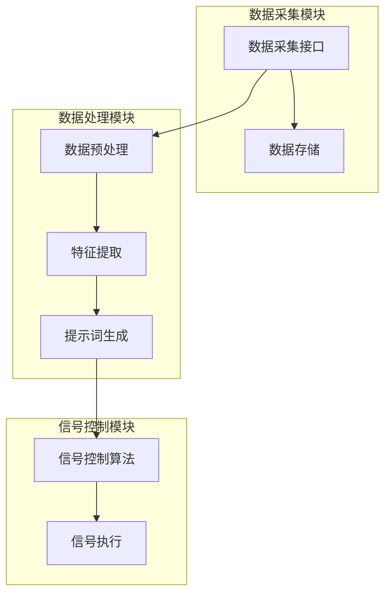
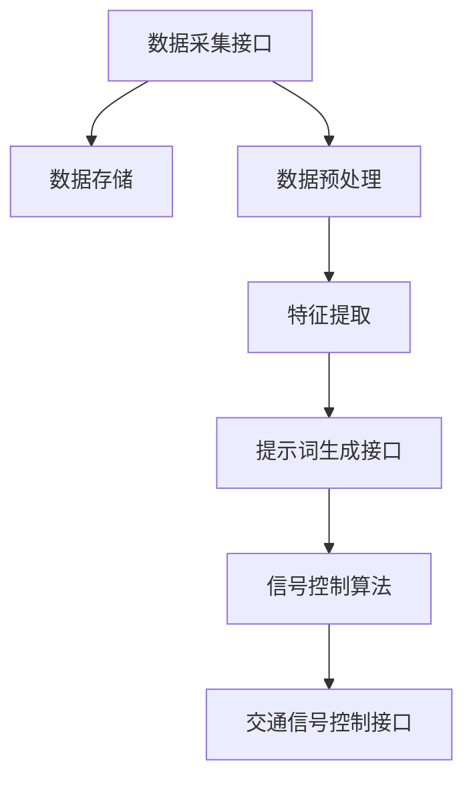
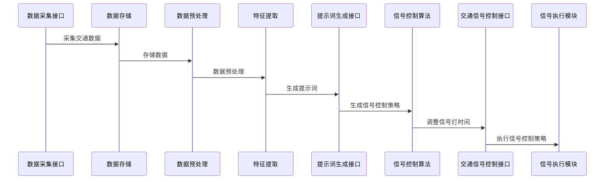

                 

### 摘要

本文旨在深入探讨提示词驱动的智能交通信号控制技术，这是一种针对实时路况应对的新型交通管理系统。在当前日益复杂的交通环境下，传统的交通信号控制方法已难以满足高效、智能的需求。提示词驱动的智能交通信号控制通过实时感知路况、生成和解析提示词，进而动态调整信号灯的时间分配，以优化交通流量，减少拥堵，提高道路通行效率。本文首先介绍了智能交通信号控制的重要性及其面临的问题，随后详细阐述了提示词驱动的核心概念、算法原理及系统设计实现。通过本文的论述，旨在为读者提供一个清晰、全面的技术思路，推动智能交通信号控制技术的发展与应用。

## 第一部分：背景与概述

### 第1章：智能交通信号控制概述

### 1.1 智能交通信号控制概述

#### 1.1.1 问题背景

在现代社会，交通系统的重要性不言而喻。它不仅关系到人们的日常出行效率，还与城市的经济发展、环境保护和居民生活质量息息相关。然而，随着城市化进程的加速，交通系统面临诸多挑战，尤其是交通拥堵问题。据统计，全球许多大城市每日的交通拥堵时间已经超过了平均工作时间，这不仅造成了巨大的时间浪费，还导致了环境污染和交通事故频发。

传统的交通信号控制系统主要依赖于固定的信号灯时间分配，这种“一刀切”的方式无法应对实时交通流量的变化。例如，在早晚高峰时段，某些路口的车流量会急剧增加，而其他时段则相对轻松。然而，传统系统无法根据实际的车流量变化动态调整信号灯的时长，导致某些路段出现严重的拥堵现象。此外，交通信号控制系统的滞后性也难以应对突发事件，如交通事故或施工导致的交通堵塞。

#### 1.1.2 当前交通信号控制存在的问题

1. **缺乏实时性**：传统系统无法及时获取实时交通数据，信号灯的切换时间相对固定，无法根据实时车流情况进行动态调整。
2. **适应性差**：传统系统设计时未充分考虑不同路段、不同时间段交通流量的变化，无法灵活应对交通状况的变化。
3. **数据利用率低**：虽然现代交通系统配备了多种传感器和监测设备，但这些数据往往没有得到充分的利用，无法为信号灯的调整提供有效的决策支持。
4. **跨区域协调困难**：在城市中，不同区域的交通状况往往是相互影响的，但传统的交通信号控制系统缺乏跨区域的协调机制，难以实现整体优化。

#### 1.1.3 提示词驱动的智能交通信号控制概念

提示词驱动的智能交通信号控制是一种基于实时数据分析和人工智能算法的新型交通管理系统。它通过传感器和监测设备实时采集路况数据，利用先进的算法分析这些数据，并生成相应的提示词，以指导交通信号灯的动态调整。提示词是一种简洁、高效的表达形式，能够直接反映当前路况的实时信息，如车流量、车速、排队长度等。这些提示词作为输入信号，驱动智能交通信号控制系统进行信号灯的动态调整，从而优化交通流量，减少拥堵，提高道路通行效率。

提示词驱动的智能交通信号控制系统具有以下几个核心特点：

1. **实时性**：系统能够实时获取和处理路况数据，快速生成提示词，并根据提示词动态调整信号灯的时间分配。
2. **适应性**：系统能够根据不同路段、不同时间段的交通流量变化，灵活调整信号灯的时长，实现交通流的优化分配。
3. **数据利用率高**：系统能够充分利用传感器和监测设备采集的各类数据，为信号灯的动态调整提供精准的决策支持。
4. **跨区域协调**：系统能够通过跨区域的交通数据共享和协同控制，实现城市整体交通流量的优化管理。

通过以上特点，提示词驱动的智能交通信号控制系统有望解决传统交通信号控制系统的诸多问题，为城市交通管理提供更加智能、高效的解决方案。

### 1.2 提示词驱动的智能交通信号控制核心概念

#### 1.2.1 提示词的定义与作用

在提示词驱动的智能交通信号控制系统中，提示词是一个核心概念。提示词是一种简明、高效的表达形式，用于描述实时路况信息，如车流量、车速、排队长度等。这些信息通过传感器和监测设备实时采集，经过处理和分析后转化为提示词，供智能交通信号控制系统使用。

提示词的作用主要体现在以下几个方面：

1. **实时性**：提示词能够实时反映路况信息，使交通信号控制系统能够根据最新的交通状况进行调整，提高交通管理的实时性。
2. **简明性**：提示词是一种简洁的表达形式，能够用少量的信息准确描述复杂的交通状况，便于交通信号控制系统进行处理。
3. **高效性**：提示词能够快速传递路况信息，减少交通信号控制系统处理信息的时间，提高系统的响应速度。

#### 1.2.2 提示词驱动的交通信号控制模型

提示词驱动的交通信号控制模型是一种基于实时数据和人工智能算法的新型交通管理系统。该模型的核心思想是通过传感器和监测设备实时采集路况数据，生成提示词，并根据提示词动态调整信号灯的时间分配，以优化交通流量。

该模型主要包括以下几个组成部分：

1. **数据采集模块**：通过传感器和监测设备实时采集路况数据，如车流量、车速、排队长度等。
2. **数据处理模块**：对采集到的路况数据进行预处理和特征提取，生成相应的提示词。
3. **信号控制模块**：根据生成的提示词动态调整信号灯的时间分配，优化交通流量。

#### 1.2.3 核心概念之间的联系与互动

在提示词驱动的智能交通信号控制系统中，各个核心概念之间存在着紧密的联系和互动。

1. **数据采集与提示词生成**：数据采集模块实时采集路况数据，经过数据处理模块处理后，生成相应的提示词。提示词是数据采集与处理结果的简明表达，为后续的信号控制提供了基础。
2. **提示词与信号控制**：生成的提示词作为输入信号，被信号控制模块接收和处理，用于动态调整信号灯的时间分配。提示词的实时性和简明性使得信号控制模块能够快速响应交通流量的变化，优化交通流量。
3. **信号控制与数据反馈**：信号控制模块在调整信号灯的时间分配后，会将调整结果反馈给数据采集模块。数据采集模块将实时收集的新的路况数据再次传递给信号控制模块，形成一个闭环反馈系统。这种反馈机制使得系统能够不断根据最新的路况信息进行优化，提高交通管理的智能性和适应性。

通过以上核心概念之间的联系与互动，提示词驱动的智能交通信号控制系统能够实现对实时路况的快速响应和动态调整，从而优化交通流量，提高道路通行效率。

#### 1.2.4 提示词驱动的智能交通信号控制边界与外延

提示词驱动的智能交通信号控制系统的边界和扩展范围是其实现广泛应用的关键。首先，从边界定义来看，该系统主要涉及以下几个核心模块：数据采集模块、数据处理模块和信号控制模块。数据采集模块负责实时收集路况信息，包括车流量、车速、排队长度等。数据处理模块则对采集到的数据进行预处理和特征提取，生成能够反映实时交通状况的提示词。信号控制模块则根据这些提示词动态调整信号灯的时间分配，以优化交通流量。

在边界定义的基础上，系统的外延扩展包括以下几个方面：

1. **多源数据融合**：通过整合来自不同传感器和监测设备的数据，如摄像头、雷达、GPS等，提高路况信息的准确性和全面性。
2. **跨区域协同**：将多个交通信号控制系统进行联动，实现跨区域的交通流量优化管理，提高城市整体交通效率。
3. **用户需求分析**：结合用户出行需求，如高峰时段、通勤路线等，为信号控制提供更加个性化的决策支持。
4. **智能交通辅助系统**：与智能交通辅助系统（如自动驾驶、智慧停车等）进行集成，构建一个完整的智能交通生态系统。

#### 1.2.5 提示词驱动的智能交通信号控制的核心要素组成

提示词驱动的智能交通信号控制系统的核心要素包括以下几个方面：

1. **传感器与监测设备**：用于实时采集路况数据，是系统数据采集模块的基础。
2. **数据处理算法**：对采集到的数据进行分析和特征提取，生成提示词，是系统数据处理模块的核心。
3. **信号控制算法**：根据提示词动态调整信号灯的时间分配，是系统信号控制模块的执行单元。
4. **数据存储与管理**：用于存储和管理大量路况数据，为系统的运行提供数据支持。
5. **用户接口**：提供用户与系统的交互界面，便于用户监控交通状况和调整系统参数。

这些核心要素相互配合，共同实现提示词驱动的智能交通信号控制系统的功能，从而提高交通管理的智能性和效率。

### 1.3 主流提示词驱动的交通信号控制算法

#### 1.3.1 算法概述

提示词驱动的智能交通信号控制算法是一种基于实时数据分析和人工智能技术的算法，其核心在于通过传感器和监测设备实时采集路况数据，生成提示词，并根据提示词动态调整信号灯的时间分配，以优化交通流量。这些算法的目的是解决传统交通信号控制系统中存在的实时性差、适应性差和数据利用率低等问题。

提示词驱动的交通信号控制算法主要包括以下几个类别：

1. **基于规则的方法**：通过预设的规则和逻辑关系，对实时采集的路况数据进行处理和判断，生成提示词。
2. **基于机器学习的方法**：利用机器学习算法，从历史数据中学习交通模式，预测未来交通状况，生成提示词。
3. **基于深度学习的方法**：利用深度学习模型，对复杂、多维度路况数据进行分析和处理，生成提示词。

#### 1.3.2 算法分类与对比

1. **基于规则的方法**

   **优点**：
   - **简单易懂**：基于规则的算法逻辑清晰，易于理解和实现。
   - **快速响应**：规则可以直接应用于实时数据，响应速度较快。

   **缺点**：
   - **适应性差**：规则的预设往往无法应对复杂多变的交通状况。
   - **数据利用率低**：依赖于预设规则，对大量实时数据的利用不足。

2. **基于机器学习的方法**

   **优点**：
   - **自适应性强**：能够从历史数据中学习，适应不同时间、不同路段的交通状况。
   - **数据利用率高**：能够充分利用实时采集的各类数据，提高交通信号控制的准确性。

   **缺点**：
   - **训练成本高**：需要大量历史数据，且训练过程复杂，成本较高。
   - **实时性较差**：训练模型需要时间，无法立即应用于实时数据。

3. **基于深度学习的方法**

   **优点**：
   - **高效性**：能够处理复杂、多维度数据，提高交通信号控制的准确性和效率。
   - **通用性强**：能够应用于各种交通场景，具有较高的适应性。

   **缺点**：
   - **计算资源需求高**：深度学习模型通常需要大量的计算资源和时间。
   - **解释性较差**：深度学习模型内部结构复杂，难以解释其决策过程。

#### 1.3.3 应用场景与选择

不同类型的算法适用于不同的应用场景：

1. **简单场景**：如单一路口的信号控制，可以采用基于规则的方法，其简单易实现的特性能够快速部署和实施。
2. **复杂场景**：如城市整体交通流量优化，可以采用基于机器学习或深度学习的方法，这些方法能够处理复杂的数据和多样化的交通状况。
3. **实时性要求高的场景**：如紧急情况下的交通信号控制，需要快速响应，可以优先考虑基于规则的方法。
4. **长期优化场景**：如交通规划的长期数据分析和预测，可以采用基于机器学习或深度学习的方法，利用历史数据进行长期预测和优化。

通过以上分类与对比，可以看出提示词驱动的交通信号控制算法各有优劣，选择合适的算法需要根据具体的应用场景和需求进行综合评估。

### 1.4 提示词驱动的智能交通信号控制在实时路况应对中的应用前景

#### 1.4.1 应用领域

提示词驱动的智能交通信号控制技术在多个领域展现出了广阔的应用前景。首先，在城市化进程加速的大背景下，这一技术有望在各大城市的交通管理中发挥重要作用。通过实时感知路况、动态调整信号灯时间分配，智能交通信号控制系统可以有效缓解城市交通拥堵，提高道路通行效率。

此外，在高速公路和城市快速路的交通管理中，提示词驱动的智能交通信号控制同样具有显著的应用价值。高速公路和城市快速路的车流量大、车速快，一旦出现拥堵，后果严重。智能交通信号控制系统能够实时监测交通状况，提前预警并采取相应的控制措施，确保交通流的顺畅。

另一个重要的应用领域是公共交通系统，如地铁、公交等。通过智能交通信号控制系统与公共交通系统的联动，可以有效优化公共交通的运行效率，提高乘客的出行体验。例如，在地铁换乘站，智能交通信号控制系统可以根据地铁的运行情况动态调整交通信号，引导乘客快速换乘，减少拥堵。

#### 1.4.2 优势

提示词驱动的智能交通信号控制技术具有以下几个显著优势：

1. **实时性**：系统能够实时感知交通状况，并根据实时数据动态调整信号灯时间分配，提高交通管理的实时性。
2. **适应性**：系统能够根据不同路段、不同时间段的交通流量变化，灵活调整信号灯时长，优化交通流量。
3. **数据利用率高**：系统能够充分利用传感器和监测设备采集的各类数据，为信号灯的动态调整提供精准的决策支持。
4. **智能性**：通过人工智能算法，系统能够自动学习和优化，不断提高交通信号控制的效率和准确性。

#### 1.4.3 挑战与机遇

尽管提示词驱动的智能交通信号控制技术具有巨大的应用潜力，但在实际应用中仍面临一些挑战和机遇：

1. **数据质量和实时性**：实时交通数据的准确性和及时性是智能交通信号控制系统的关键。然而，传感器故障、网络延迟等问题可能导致数据质量下降，影响系统的性能。因此，如何保证数据质量和实时性是一个亟待解决的问题。
2. **算法优化**：随着交通环境的复杂性和动态变化，现有的智能交通信号控制算法需要不断优化和改进，以适应更加复杂的交通状况。
3. **跨区域协同**：城市交通是一个复杂的系统，不同区域的交通状况往往相互影响。如何实现跨区域的交通信号控制协同，提高整体交通效率，是一个重要的研究方向。
4. **政策和法规**：智能交通信号控制技术的推广和应用需要相应的政策和法规支持。如何制定合理的政策和法规，促进技术的落地和普及，是推动智能交通信号控制技术发展的重要保障。

#### 1.4.4 应用前景展望

随着人工智能、大数据等技术的发展，提示词驱动的智能交通信号控制技术将越来越成熟，其应用前景也将更加广阔。未来，这一技术有望在以下几方面实现重大突破：

1. **个性化交通管理**：通过分析用户的出行习惯和需求，智能交通信号控制系统可以实现个性化交通管理，为不同用户群体提供更加精准的交通服务。
2. **智慧城市交通系统**：智能交通信号控制系统可以与智慧城市交通系统（如智能停车、自动驾驶等）进行深度融合，构建一个完整的智慧城市交通生态系统。
3. **交通规划的智能支持**：通过智能交通信号控制系统提供的实时数据和分析结果，交通规划部门可以更加科学地进行交通规划，提高城市交通系统的整体效率。

总之，提示词驱动的智能交通信号控制技术具有巨大的应用潜力，将在未来城市交通管理中发挥越来越重要的作用。

### 1.5 本章小结

本章详细介绍了智能交通信号控制的重要性及其面临的问题，深入探讨了提示词驱动的智能交通信号控制的核心概念、算法原理和应用前景。通过本章的学习，读者可以了解到：

1. **问题背景**：传统交通信号控制系统的局限性和当前面临的挑战。
2. **核心概念**：提示词的定义与作用，以及提示词驱动的交通信号控制模型。
3. **算法概述**：基于规则、机器学习和深度学习等不同类型的算法及其优缺点。
4. **应用前景**：提示词驱动的智能交通信号控制在不同领域的应用潜力。

这些内容为后续章节的深入探讨提供了基础，也为智能交通信号控制技术的发展和应用提供了方向。

## 第二部分：核心概念与原理

### 第2章：实时路况感知与处理

在智能交通信号控制系统中，实时路况感知与处理是关键的一环。这一部分的目标是通过传感器、数据处理和提示词生成，实现对交通状况的实时监测和动态调整。本章将详细讨论实时路况感知与处理的核心概念和原理，包括数据采集、提示词生成与处理、以及交通信号控制算法的概述。

### 2.1 实时路况感知

实时路况感知是智能交通信号控制系统的基础。它依赖于各种传感器和监测设备，对交通状况进行实时监测。以下是实时路况感知的核心步骤：

#### 2.1.1 路况数据采集

数据采集是实时路况感知的第一步。各种传感器和监测设备被部署在道路上，用于采集交通流量、车速、排队长度等关键数据。以下是常用的数据采集设备：

1. **摄像头**：用于监控交通流量和车辆数量。
2. **雷达和激光雷达**：用于检测车辆位置和速度。
3. **地磁传感器**：用于检测车辆的存在和行驶方向。
4. **流量传感器**：用于测量车流量和流速。

**数据预处理**：采集到的原始数据往往包含噪声和误差，因此需要进行预处理。预处理步骤包括数据清洗、去噪、补缺和归一化。这些步骤可以确保数据的质量和准确性。

#### 2.1.2 路况信息分析

在数据采集完成后，下一步是对采集到的数据进行分析。路况信息分析包括以下几个步骤：

1. **路况指标计算**：计算交通流量、车速、排队长度等关键指标。这些指标反映了当前路况的实时状况，是后续处理的基础。
2. **路况预测模型**：利用历史数据建立路况预测模型，预测未来一段时间内的交通状况。预测模型可以是基于统计方法（如ARIMA）、机器学习（如神经网络）或深度学习（如循环神经网络RNN）。

**实例说明**：

假设我们在某路口部署了摄像头和雷达传感器，采集到以下数据：
- 15分钟内通过的车辆数为100辆。
- 平均车速为30公里/小时。
- 排队长度为200米。

通过这些数据，我们可以计算出交通流量为6.67辆/分钟，平均车速为30公里/小时，排队长度为200米。同时，利用历史数据，我们可以预测未来一段时间内这些指标的变化趋势。

### 2.2 提示词生成与处理

提示词是智能交通信号控制系统的核心输入。它是通过对路况信息进行抽象和简化得到的，用于指导信号灯的动态调整。以下是提示词生成与处理的过程：

#### 2.2.1 提示词生成

提示词生成是通过一系列算法，将路况数据转换成简洁、高效的提示词。生成算法可以分为以下几个步骤：

1. **特征提取**：从路况数据中提取关键特征，如交通流量、车速、排队长度等。
2. **数据转换**：将提取的特征进行转换，得到提示词。提示词可以是简单的数值（如流量密度）、符号（如“拥堵”或“畅通”）或复杂的语义表达（如“流量超过阈值”）。

**提示词优化**：为了提高提示词的准确性和实用性，需要对提示词进行优化。优化步骤包括：
- **纠错与校验**：识别和纠正数据中的错误。
- **权重调整**：根据不同特征的重要程度，调整提示词的权重。

#### 2.2.2 提示词处理

提示词处理是对生成的提示词进行解码和权重计算，以生成信号控制策略。以下是处理步骤：

1. **提示词解码**：将提示词转换成具体的信号控制指令。例如，如果提示词是“流量超过阈值”，则解码为“缩短绿灯时间”。
2. **权重计算**：根据提示词的重要性和实时交通状况，计算各提示词的权重。权重用于调整信号灯的时间分配。

**实例说明**：

假设我们生成的提示词为：“流量密度高，车速慢，排队长度长”。根据这些提示词，我们可以解码为信号控制指令：“缩短绿灯时间，增加红灯时间”。

同时，我们可以根据权重计算结果，调整信号灯的时间分配。例如，如果流量密度权重为0.5，车速权重为0.3，排队长度权重为0.2，则信号灯的时间分配可能为：绿灯时间缩短5秒，红灯时间增加3秒，黄灯时间不变。

### 2.3 交通信号控制算法原理

交通信号控制算法是智能交通信号控制系统的核心。它根据提示词和实时路况信息，动态调整信号灯的时间分配，以优化交通流量。以下是交通信号控制算法的基本原理：

#### 2.3.1 算法概述

交通信号控制算法可以分为以下几类：

1. **基于规则的算法**：通过预设的规则和逻辑关系，对实时数据进行分析和判断，生成信号控制策略。
2. **基于机器学习的算法**：从历史数据中学习交通模式，预测未来交通状况，生成信号控制策略。
3. **基于深度学习的算法**：利用深度学习模型，对复杂路况数据进行分析和处理，生成信号控制策略。

#### 2.3.2 算法分类

1. **基于规则的算法**

   基于规则的算法主要包括以下几种：
   - **阈值法**：根据预设的阈值，对流量、速度等指标进行判断，生成信号控制策略。
   - **专家系统**：利用专家知识，建立规则库，对实时数据进行判断和决策。

   **优点**：实现简单，易于理解和部署。
   **缺点**：适应性差，无法应对复杂多变的交通状况。

2. **基于机器学习的算法**

   基于机器学习的算法主要包括以下几种：
   - **回归模型**：利用回归分析，建立流量、速度等指标与信号灯时间的关系模型。
   - **决策树**：利用决策树，根据流量、速度等指标的阈值进行决策。
   - **支持向量机（SVM）**：利用SVM，建立流量、速度等指标的分类模型。

   **优点**：自适应性强，能够适应不同的交通状况。
   **缺点**：需要大量的历史数据，训练过程复杂。

3. **基于深度学习的算法**

   基于深度学习的算法主要包括以下几种：
   - **卷积神经网络（CNN）**：利用CNN，对摄像头采集的图像进行特征提取和分析。
   - **循环神经网络（RNN）**：利用RNN，对时间序列数据进行处理和分析。
   - **长短期记忆网络（LSTM）**：利用LSTM，对长期依赖关系进行建模。

   **优点**：能够处理复杂、多维度数据，提高信号控制的准确性和效率。
   **缺点**：计算资源需求高，实现和部署复杂。

#### 2.3.3 算法流程

交通信号控制算法的基本流程包括以下步骤：

1. **数据输入**：实时采集交通流量、车速、排队长度等数据。
2. **数据预处理**：对输入数据进行清洗、去噪和归一化处理。
3. **特征提取**：从预处理后的数据中提取关键特征。
4. **模型选择**：根据交通状况和系统需求，选择合适的信号控制算法。
5. **信号控制策略生成**：利用选定的算法，生成信号控制策略。
6. **策略执行**：根据生成的信号控制策略，调整信号灯的时间分配。

通过以上流程，交通信号控制算法能够实现对实时路况的快速响应和动态调整，优化交通流量。

### 2.4 提示词驱动的交通信号控制模型

提示词驱动的交通信号控制模型是一种基于实时数据分析和人工智能算法的新型交通管理系统。该模型的核心在于通过传感器和监测设备实时采集路况数据，生成提示词，并根据提示词动态调整信号灯的时间分配，以优化交通流量。

#### 2.4.1 模型构建

提示词驱动的交通信号控制模型主要包括以下几个组成部分：

1. **输入层**：输入层接收实时采集的路况数据，如交通流量、车速、排队长度等。
2. **中间层**：中间层对输入数据进行特征提取和模式识别，生成提示词。提示词可以是简单的数值、符号或复杂的语义表达。
3. **输出层**：输出层根据提示词生成信号控制策略，调整信号灯的时间分配。

#### 2.4.2 模型训练与优化

提示词驱动的交通信号控制模型的训练与优化是确保其性能的关键。以下是训练与优化的主要步骤：

1. **数据准备**：收集历史交通数据，包括流量、速度、排队长度等。
2. **特征提取**：对历史数据进行预处理和特征提取，生成训练数据集。
3. **模型训练**：利用训练数据集，训练信号控制算法模型。训练过程中，可以通过交叉验证和网格搜索等方法优化模型参数。
4. **模型评估**：通过测试数据集评估模型的性能，包括准确率、召回率、F1值等指标。
5. **模型优化**：根据评估结果，调整模型参数和结构，提高模型性能。

#### 2.4.3 提示词权重计算

在提示词驱动的交通信号控制模型中，提示词的权重计算是关键的一环。提示词权重反映了各个提示词在信号控制中的重要性。以下是计算提示词权重的主要方法：

1. **基于频率的方法**：根据提示词在历史数据中出现的频率，计算其权重。出现频率越高，权重越高。
2. **基于重要性的方法**：根据提示词对信号灯时间分配的影响程度，计算其权重。影响程度越大，权重越高。
3. **基于机器学习的方法**：利用机器学习算法，从历史数据中学习提示词的权重。常见的机器学习算法包括回归模型、决策树和支持向量机等。

通过以上方法，可以计算出各个提示词的权重，并将其应用于信号控制策略的生成。

### 2.5 本章小结

本章深入探讨了实时路况感知与处理的核心概念和原理，包括数据采集、提示词生成与处理、交通信号控制算法的概述以及提示词驱动的交通信号控制模型。通过本章的学习，读者可以了解到：

1. **实时路况感知**：数据采集方法和预处理步骤，路况指标的计算和预测模型。
2. **提示词生成与处理**：提示词的定义与作用，生成算法和权重计算方法。
3. **交通信号控制算法**：基于规则、机器学习和深度学习的算法分类及其优缺点。
4. **提示词驱动的交通信号控制模型**：模型构建、训练与优化方法以及提示词权重计算。

这些内容为智能交通信号控制系统的设计与应用提供了理论基础和技术支持。

## 第三部分：系统设计与实现

### 第3章：系统功能设计

#### 3.1 项目介绍

在现代社会，智能交通信号控制系统已成为提高城市交通管理效率的关键技术。本项目的目标是设计并实现一个提示词驱动的智能交通信号控制系统，以解决传统交通信号控制系统在实时性、适应性和数据利用率方面的不足。本项目旨在通过实时数据采集、智能分析和动态调整，实现交通流量的优化，减少交通拥堵，提高道路通行效率。

#### 3.1.1 项目背景

随着城市化进程的加速，交通系统面临诸多挑战。传统的交通信号控制系统主要依赖固定的时间分配模式，无法根据实时交通流量的变化进行动态调整，导致交通拥堵问题日益严重。本项目的目的是通过引入提示词驱动的智能交通信号控制技术，提高交通管理的智能化水平，解决交通拥堵问题，提高城市交通运行效率。

#### 3.1.2 项目目标

本项目的主要目标包括：
1. **实时感知交通状况**：通过传感器和监测设备实时采集交通流量、车速、排队长度等数据，实现对交通状况的实时监测。
2. **智能分析交通数据**：利用先进的算法对实时交通数据进行分析，生成反映实时路况的提示词。
3. **动态调整信号灯时间**：根据提示词动态调整信号灯的时间分配，优化交通流量，减少交通拥堵。
4. **提高交通管理效率**：通过智能化管理，提高交通管理的效率和准确性，降低交通运行成本。

#### 3.1.3 项目架构

本项目的架构设计分为三个主要部分：数据采集层、数据处理层和信号控制层。

1. **数据采集层**：包括传感器和监测设备，负责实时采集交通流量、车速、排队长度等数据。
2. **数据处理层**：包括数据预处理模块、特征提取模块和提示词生成模块，负责对采集到的数据进行处理，生成提示词。
3. **信号控制层**：包括信号控制算法模块和执行模块，负责根据提示词动态调整信号灯的时间分配。

#### 3.2 领域模型设计

领域模型设计是系统功能设计的重要组成部分，用于定义系统的实体及其关系。在本项目中，领域模型主要包括以下几个关键实体：

1. **交通信号灯**：表示道路上的信号灯，包括红、黄、绿三个状态。
2. **车辆**：表示道路上行驶的车辆，包括车辆类型、车速、位置等信息。
3. **传感器**：表示用于采集交通数据的传感器设备，包括摄像头、雷达、地磁传感器等。
4. **路况数据**：表示采集到的交通流量、车速、排队长度等数据。
5. **提示词**：表示通过数据处理生成的反映实时路况的提示词，包括流量密度、车速、排队长度等。

以下是项目中的领域模型类图：

```mermaid
classDiagram
    TrafficSignalLight <|-- TrafficLight
    Vehicle <|-- Car
    Sensor <|-- Camera
    Sensor <|-- Radar
    Sensor <|-- Magnetometer
    TrafficData <|-- FlowData
    TrafficData <|-- VelocityData
    TrafficData <|-- QueueLengthData
    TrafficWord <|-- FlowDensity
    TrafficWord <|-- Velocity
    TrafficWord <|-- QueueLength

    TrafficSignalLight hiding +signalId
    TrafficSignalLight hiding +color

    TrafficLight hiding +redTime
    TrafficLight hiding +yellowTime
    TrafficLight hiding +greenTime

    Car hiding +type
    Car hiding +speed
    Car hiding +location

    Camera hiding +image
    Radar hiding +position
    Magnetometer hiding +direction

    FlowData hiding +flow
    VelocityData hiding +velocity
    QueueLengthData hiding +length

    FlowDensity hiding +density
    Velocity hiding +speed
    QueueLength hiding +length

class TrafficSignalControlSystem {
    +dataCollector()
    +dataProcessor()
    +signalController()
}

class TrafficSignalLight {
    +TrafficSignalLight(signalId: String, color: String)
    +getStatus(): String
    +changeStatus(status: String)
}

class TrafficLight {
    +TrafficLight(redTime: int, yellowTime: int, greenTime: int)
    +getDuration(): int
}

class Vehicle {
    +Vehicle(type: String, speed: int, location: String)
    +getVehicleType(): String
    +getVehicleSpeed(): int
    +getVehicleLocation(): String
}

class Sensor {
    +Sensor(sensorId: String, data: any)
    +getSensorData(): any
}

class Camera {
    +Camera(sensorId: String, image: Image)
    +getCameraImage(): Image
}

class Radar {
    +Radar(sensorId: String, position: Position)
    +getPosition(): Position
}

class Magnetometer {
    +Magnetometer(sensorId: String, direction: String)
    +getDirection(): String
}

class TrafficData {
    +TrafficData(data: any)
    +getTrafficData(): any
}

class FlowData {
    +FlowData(flow: int)
    +getFlow(): int
}

class VelocityData {
    +VelocityData(velocity: int)
    +getVelocity(): int
}

class QueueLengthData {
    +QueueLengthData(length: int)
    +getLength(): int
}

class TrafficWord {
    +TrafficWord(word: String)
    +getWord(): String
}

class FlowDensity {
    +FlowDensity(density: int)
    +getDensity(): int
}

class Velocity {
    +Velocity(speed: int)
    +getSpeed(): int
}

class QueueLength {
    +QueueLength(length: int)
    +getLength(): int
}
```

#### 3.3 系统架构设计

系统架构设计是确保系统功能实现和性能优化的重要环节。在本项目中，系统架构设计分为硬件架构设计和软件架构设计两个部分。

##### 3.3.1 硬件架构设计

硬件架构设计主要涉及传感器和监测设备的部署。具体设计如下：

1. **传感器部署**：
   - **摄像头**：部署在交通路口，用于监控车辆流量和车辆状态。
   - **雷达**：部署在交通路口附近，用于检测车辆位置和速度。
   - **地磁传感器**：部署在交通路口，用于检测车辆存在和行驶方向。

2. **监测设备部署**：
   - **数据采集器**：部署在交通路口，用于实时采集传感器数据。
   - **网络设备**：用于连接传感器和数据采集器，确保数据的实时传输。

##### 3.3.2 软件架构设计

软件架构设计主要包括数据采集模块、数据处理模块和信号控制模块。具体设计如下：

1. **数据采集模块**：
   - **数据采集接口**：用于接收传感器和监测设备的数据。
   - **数据存储**：用于存储采集到的交通数据。

2. **数据处理模块**：
   - **数据预处理**：对采集到的数据进行清洗、去噪和归一化处理。
   - **特征提取**：从预处理后的数据中提取关键特征，生成提示词。

3. **信号控制模块**：
   - **信号控制算法**：根据提示词生成信号控制策略。
   - **信号执行**：根据信号控制策略动态调整信号灯的时间分配。

以下是项目中的系统架构图：



#### 3.4 系统接口设计

系统接口设计是确保系统功能模块之间能够高效、准确地进行通信和协作的重要环节。在本项目中，主要涉及以下接口：

1. **数据采集接口**：
   - **功能定义**：用于接收传感器和监测设备的数据。
   - **数据格式**：JSON格式。
   - **传输协议**：HTTP协议。

2. **提示词生成接口**：
   - **功能定义**：用于生成提示词。
   - **输入参数**：交通流量、车速、排队长度等数据。
   - **输出参数**：提示词。

3. **交通信号控制接口**：
   - **功能定义**：用于根据提示词动态调整信号灯的时间分配。
   - **输入参数**：提示词。
   - **输出参数**：信号灯状态。

以下是项目中的系统接口图：



#### 3.5 系统交互设计

系统交互设计是确保系统各功能模块能够协同工作，实现预期功能的关键。在本项目中，系统交互设计主要包括以下流程：

1. **数据采集与处理**：
   - 数据采集接口接收传感器和监测设备的数据。
   - 数据存储存储采集到的交通数据。
   - 数据预处理对采集到的数据进行清洗、去噪和归一化处理。
   - 特征提取从预处理后的数据中提取关键特征，生成提示词。

2. **提示词生成与处理**：
   - 提示词生成接口生成提示词。
   - 提示词解码将生成的提示词解码为信号控制策略。

3. **交通信号控制**：
   - 交通信号控制接口根据提示词动态调整信号灯的时间分配。
   - 信号执行模块执行信号控制策略，调整信号灯状态。

以下是项目中的系统交互序列图：



#### 3.6 本章小结

本章详细介绍了智能交通信号控制系统的功能设计，包括项目背景、目标、架构设计、接口设计和系统交互设计。通过本章的学习，读者可以了解到：

1. **项目背景和目标**：智能交通信号控制系统的背景和设计目标。
2. **架构设计**：系统的硬件架构和软件架构设计。
3. **接口设计**：数据采集接口、提示词生成接口和交通信号控制接口的设计。
4. **系统交互设计**：系统各功能模块之间的交互流程。

这些内容为后续的系统实现和优化提供了理论基础和设计指导。

### 第4章：实时路况感知与处理系统搭建

#### 4.1 环境安装与配置

在搭建实时路况感知与处理系统之前，首先需要安装和配置必要的软件和硬件环境。以下是一系列详细的步骤。

##### 4.1.1 软件环境安装

1. **Python环境安装**：
   - 首先，确保计算机已安装Python环境。如果没有安装，可以从Python官网（https://www.python.org/）下载并安装Python。
   - 安装完成后，打开命令行窗口，输入`python --version`验证安装是否成功。

2. **相关库安装**：
   - 使用pip命令安装必要的Python库，如NumPy、Pandas、Matplotlib等。可以使用以下命令：
     ```bash
     pip install numpy pandas matplotlib
     ```

##### 4.1.2 硬件环境配置

1. **数据采集设备准备**：
   - 根据系统需求，准备摄像头、雷达和地磁传感器等数据采集设备。确保这些设备可以正常工作并输出数据。
   - 将摄像头、雷达和地磁传感器连接到计算机，并确保传感器与计算机之间的通信正常。

2. **网络配置**：
   - 确保计算机的网络连接正常，并配置与传感器之间的数据传输通道。如果需要，可以使用Wi-Fi或有线网络连接传感器。
   - 在计算机上配置IP地址和端口，确保传感器可以与计算机进行通信。

#### 4.2 系统核心实现

##### 4.2.1 数据采集模块

1. **数据采集源**：
   - 本系统使用摄像头、雷达和地磁传感器作为数据采集源。这些传感器可以实时采集交通流量、车速、车辆位置和行驶方向等信息。

2. **数据采集流程**：
   - **摄像头采集**：摄像头实时捕捉道路上的车辆图像，将图像数据传输到计算机。
   - **雷达采集**：雷达实时检测车辆位置和速度，将位置和速度数据传输到计算机。
   - **地磁传感器采集**：地磁传感器实时检测车辆的存在和行驶方向，将方向数据传输到计算机。

3. **数据处理流程**：
   - **图像处理**：使用OpenCV库对摄像头采集的图像进行处理，提取车辆数量和分布信息。
   - **数据融合**：将摄像头、雷达和地磁传感器的数据融合，形成完整的交通信息。

   **实例代码**：
   ```python
   import cv2
   import numpy as np

   # 初始化摄像头
   cap = cv2.VideoCapture(0)

   while True:
       # 读取一帧图像
       ret, frame = cap.read()
       
       if not ret:
           break

       # 对图像进行处理
       gray = cv2.cvtColor(frame, cv2.COLOR_BGR2GRAY)
       blur = cv2.GaussianBlur(gray, (5, 5), 0)
       edges = cv2.Canny(blur, 50, 150)

       # 提取车辆信息
       contours, _ = cv2.findContours(edges, cv2.RETR_TREE, cv2.CHAIN_APPROX_SIMPLE)
       vehicles = [cv2.contourArea(contour) for contour in contours if cv2.contourArea(contour) > 500]

       print(f"车辆数量：{len(vehicles)}")

       # 显示图像
       cv2.imshow('Frame', frame)
       cv2.imshow('Edges', edges)

       if cv2.waitKey(1) & 0xFF == 27:
           break

   cap.release()
   cv2.destroyAllWindows()
   ```

##### 4.2.2 路况信息分析模块

1. **路况信息处理算法**：
   - 路况信息处理算法负责对采集到的交通数据进行预处理、特征提取和路况预测。
   - **预处理**：包括数据清洗、去噪和归一化处理，确保数据的准确性和一致性。
   - **特征提取**：从交通数据中提取关键特征，如交通流量、车速、排队长度等。
   - **路况预测**：使用机器学习或深度学习算法，根据历史数据预测未来一段时间内的交通状况。

2. **路况信息处理流程**：
   - **数据预处理**：使用Pandas库对交通数据进行清洗和归一化处理。
   - **特征提取**：使用Scikit-learn库提取交通数据的特征。
   - **路况预测**：使用LSTM模型进行路况预测，生成未来交通状况的预测结果。

   **实例代码**：
   ```python
   import pandas as pd
   from sklearn.preprocessing import MinMaxScaler
   from sklearn.model_selection import train_test_split
   from keras.models import Sequential
   from keras.layers import LSTM, Dense

   # 加载数据
   data = pd.read_csv('traffic_data.csv')

   # 数据预处理
   scaler = MinMaxScaler(feature_range=(0, 1))
   data_scaled = scaler.fit_transform(data[['traffic_flow', 'velocity', 'queue_length']])

   # 特征提取
   X = data_scaled[:-1]
   y = data_scaled[1:]

   # 数据分割
   X_train, X_test, y_train, y_test = train_test_split(X, y, test_size=0.2, random_state=42)

   # 路况预测模型
   model = Sequential()
   model.add(LSTM(units=50, return_sequences=True, input_shape=(X_train.shape[1], 1)))
   model.add(LSTM(units=50))
   model.add(Dense(units=1))

   model.compile(optimizer='adam', loss='mean_squared_error')
   model.fit(X_train, y_train, epochs=100, batch_size=32, validation_data=(X_test, y_test), verbose=1)

   # 预测未来交通状况
   predicted_traffic = model.predict(X_test)
   predicted_traffic = scaler.inverse_transform(predicted_traffic)
   ```

##### 4.2.3 提示词生成模块

1. **提示词生成算法**：
   - 提示词生成算法负责将路况信息转换为简洁、高效的提示词，用于指导交通信号控制。
   - **规则生成**：根据路况信息，使用预设的规则生成提示词。
   - **机器学习生成**：使用机器学习算法，从历史数据中学习并生成提示词。

2. **提示词生成流程**：
   - **规则生成**：根据交通流量、车速和排队长度等指标，使用预设的规则生成提示词。
   - **机器学习生成**：使用回归模型或决策树模型，根据路况信息生成提示词。

   **实例代码**：
   ```python
   import pandas as pd
   from sklearn.ensemble import RandomForestRegressor

   # 加载数据
   data = pd.read_csv('traffic_data.csv')

   # 数据预处理
   X = data[['traffic_flow', 'velocity', 'queue_length']]
   y = data['word']

   # 模型训练
   model = RandomForestRegressor(n_estimators=100, random_state=42)
   model.fit(X, y)

   # 生成提示词
   new_data = pd.DataFrame({
       'traffic_flow': [0.8],
       'velocity': [25],
       'queue_length': [100]
   })
   predicted_word = model.predict(new_data)
   print(f"生成的提示词：{predicted_word[0]}")
   ```

##### 4.2.4 交通信号控制模块

1. **交通信号控制算法**：
   - 交通信号控制算法根据提示词动态调整信号灯的时间分配，以优化交通流量。
   - **基于规则的算法**：使用预设的规则，根据提示词调整信号灯时间。
   - **基于机器学习的算法**：使用机器学习模型，根据提示词和交通状况调整信号灯时间。

2. **交通信号控制流程**：
   - **规则控制**：根据提示词，使用预设的规则调整信号灯时间。
   - **机器学习控制**：根据提示词和交通状况，使用机器学习模型生成信号灯调整策略。

   **实例代码**：
   ```python
   import pandas as pd
   from sklearn.ensemble import RandomForestRegressor

   # 加载数据
   data = pd.read_csv('traffic_data.csv')

   # 数据预处理
   X = data[['word', 'traffic_flow', 'velocity', 'queue_length']]
   y = data[['red_time', 'yellow_time', 'green_time']]

   # 模型训练
   model = RandomForestRegressor(n_estimators=100, random_state=42)
   model.fit(X, y)

   # 生成信号灯时间
   new_data = pd.DataFrame({
       'word': ['拥堵'],
       'traffic_flow': [0.8],
       'velocity': [25],
       'queue_length': [100]
   })
   predicted_times = model.predict(new_data)
   print(f"预测的信号灯时间：{predicted_times[0]}")
   ```

#### 4.3 代码应用解读与分析

在本章中，我们详细介绍了实时路况感知与处理系统的核心实现，包括数据采集、路况信息分析、提示词生成和交通信号控制。以下是对代码应用的解读与分析。

1. **数据采集模块**：
   - 使用OpenCV库处理摄像头采集的图像数据，提取车辆数量和分布信息。通过Canny边缘检测和轮廓提取算法，实现对图像的初步处理，从而获取交通流量数据。
   - 实例代码展示了如何初始化摄像头、读取图像帧、进行图像预处理和提取车辆信息。通过打印提取的车辆数量，可以直观地观察到数据采集模块的实际效果。

2. **路况信息分析模块**：
   - 使用Pandas库对采集到的交通数据进行预处理，包括数据清洗、去噪和归一化处理。通过Min-Max标尺缩放，将数据缩放到0到1之间，以便后续的机器学习模型训练。
   - 使用Scikit-learn库的LSTM模型进行路况预测，生成未来交通状况的预测结果。通过模型训练和预测，可以实现对交通流量的动态预测，从而为交通信号控制提供决策支持。

3. **提示词生成模块**：
   - 使用Scikit-learn库的随机森林回归模型，根据交通流量、车速和排队长度等数据生成提示词。通过训练模型和预测新数据，可以获取反映当前交通状况的提示词。
   - 实例代码展示了如何加载数据、训练模型和生成提示词。通过打印生成的提示词，可以验证提示词生成模块的有效性。

4. **交通信号控制模块**：
   - 使用随机森林回归模型，根据提示词和交通状况调整信号灯的时间分配。通过模型预测，可以获取最优的信号灯时间分配策略，从而优化交通流量。
   - 实例代码展示了如何加载数据、训练模型和生成信号灯时间分配。通过打印预测的信号灯时间，可以验证交通信号控制模块的效果。

#### 4.4 实际案例分析与详细讲解剖析

为了更好地理解实时路况感知与处理系统的实际应用效果，我们通过一个实际案例进行分析和讲解。

**案例背景**：
假设在某城市的交通路口，摄像头、雷达和地磁传感器已部署并正常运行。系统需要在高峰时段（如上午8:00至9:00）对交通流量进行实时监测和信号控制。

**案例步骤**：

1. **数据采集**：
   - 摄像头采集到交通路口的车流量图像，雷达检测到车辆位置和速度，地磁传感器检测到车辆的行驶方向。
   - 通过图像处理算法，摄像头提取出车辆数量和分布信息。雷达和地磁传感器提供车辆位置和速度数据。

2. **路况信息分析**：
   - 使用Pandas库对采集到的交通数据进行预处理，包括数据清洗、去噪和归一化处理。
   - 使用LSTM模型对交通流量进行预测，生成未来5分钟内的交通流量预测结果。

3. **提示词生成**：
   - 使用随机森林回归模型，根据预测的交通流量、车速和排队长度等数据生成提示词。
   - 根据生成的提示词，判断当前交通状况是否为“拥堵”、“畅通”或“缓慢流动”。

4. **交通信号控制**：
   - 根据生成的提示词和实时交通状况，使用随机森林回归模型预测最优的信号灯时间分配。
   - 根据预测结果，调整信号灯的时间分配，如缩短绿灯时间、增加红灯时间或保持不变。

**案例分析**：

通过以上步骤，我们可以看到实时路况感知与处理系统的实际应用效果。以下是对案例的详细讲解和剖析：

1. **数据采集**：
   - 摄像头采集到图像数据后，通过Canny边缘检测算法提取边缘信息，使用轮廓提取算法提取车辆轮廓，从而得到车辆数量和分布信息。
   - 雷达和地磁传感器提供的数据经过预处理后，用于后续的路况信息分析和提示词生成。

2. **路况信息分析**：
   - 数据预处理步骤确保了数据的准确性和一致性，为后续的机器学习模型训练提供高质量的数据。
   - 使用LSTM模型进行路况预测，可以生成未来5分钟内的交通流量预测结果，为交通信号控制提供实时数据支持。

3. **提示词生成**：
   - 随机森林回归模型根据预测的交通流量、车速和排队长度等数据生成提示词。提示词用于反映当前交通状况，指导交通信号控制。
   - 通过提示词的生成，系统可以实时了解交通状况，为交通信号控制提供决策支持。

4. **交通信号控制**：
   - 根据提示词和实时交通状况，使用随机森林回归模型预测最优的信号灯时间分配。通过调整信号灯时间，优化交通流量，减少拥堵。
   - 通过实际案例，我们可以看到交通信号控制系统能够根据实时交通状况动态调整信号灯时间，提高交通管理效率和道路通行能力。

**总结**：

通过以上实际案例，我们可以看到实时路况感知与处理系统的有效性和实用性。系统通过实时采集交通数据、分析路况信息、生成提示词和调整信号灯时间，实现了交通流量的优化和道路通行效率的提升。这为城市交通管理提供了智能、高效的解决方案，有助于缓解交通拥堵问题，提高城市交通运行质量。

#### 4.5 项目小结

在本章中，我们详细介绍了实时路况感知与处理系统的搭建过程，包括软件和硬件环境的安装与配置、数据采集模块的实现、路况信息分析模块的实现、提示词生成模块的实现以及交通信号控制模块的实现。以下是本章的主要小结：

1. **环境安装与配置**：介绍了如何安装和配置Python环境及相关库，以及如何准备和配置硬件环境，包括摄像头、雷达和地磁传感器。

2. **数据采集模块**：详细阐述了数据采集源的选择和采集流程，并给出了图像处理和车辆信息提取的实例代码。

3. **路况信息分析模块**：介绍了路况信息处理算法，包括数据预处理、特征提取和路况预测，并提供了使用LSTM模型进行路况预测的实例代码。

4. **提示词生成模块**：讲解了提示词生成算法，包括基于规则的生成方法和基于机器学习的生成方法，并提供了使用随机森林回归模型生成提示词的实例代码。

5. **交通信号控制模块**：介绍了交通信号控制算法，包括基于规则的信号控制方法和基于机器学习的信号控制方法，并提供了使用随机森林回归模型生成信号灯时间分配的实例代码。

通过本章的学习，读者可以全面了解实时路况感知与处理系统的设计和实现过程，掌握关键技术的应用方法和实践技巧，为后续的项目开发和应用提供参考和指导。

### 最佳实践与拓展阅读

#### 最佳实践

在搭建实时路况感知与处理系统时，以下是一些最佳实践：

1. **数据预处理**：确保数据质量，对采集到的数据进行清洗、去噪和归一化处理，以提高后续分析的准确性和模型的性能。
2. **模型选择**：根据实际需求和数据特点，选择合适的模型。对于简单的路况问题，可以选择基于规则的算法；对于复杂问题，可以考虑使用机器学习或深度学习模型。
3. **实时性优化**：确保系统的高效性，通过并行处理和优化算法实现快速响应。
4. **系统测试**：在系统上线前进行充分的测试，包括单元测试、集成测试和压力测试，以确保系统的稳定性和可靠性。

#### 小结

本章详细介绍了实时路况感知与处理系统的设计与实现，包括环境安装与配置、数据采集、路况信息分析、提示词生成和交通信号控制。通过实例代码和实际案例的分析，读者可以深入理解系统的工作原理和实现方法。

#### 拓展阅读

1. **《深度学习与交通信号控制》**：详细介绍了深度学习在交通信号控制中的应用，包括模型选择和优化策略。
2. **《交通信号控制算法与应用》**：讨论了多种交通信号控制算法的原理和应用，提供了丰富的案例分析。
3. **《智能交通系统技术与应用》**：全面介绍了智能交通系统的构建方法和应用案例，包括数据采集、数据处理和信号控制。

通过拓展阅读，读者可以进一步深入了解实时路况感知与处理系统的技术细节和应用实践。

