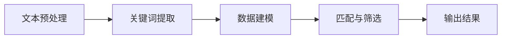
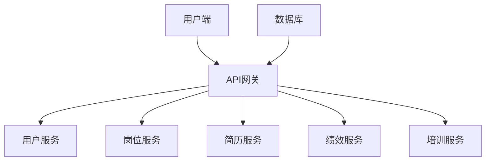
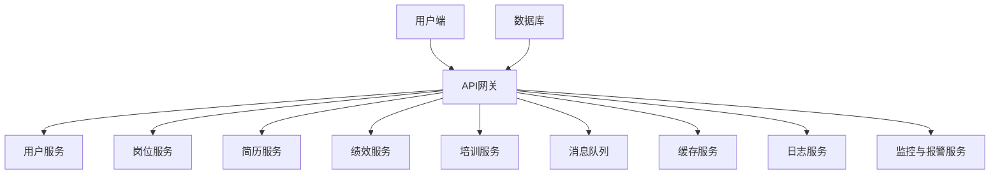
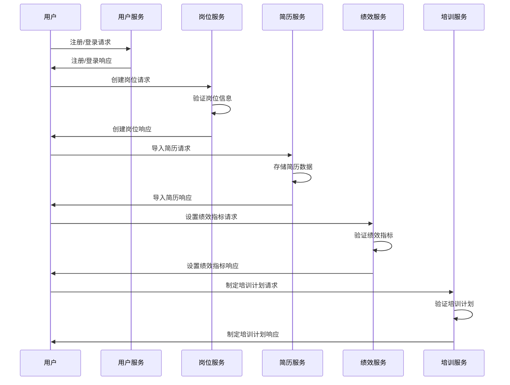

                 

### 文章标题：提示词驱动的智能人力资源：人才匹配与发展

> 关键词：智能人力资源、提示词驱动、人才匹配、算法原理、系统架构、项目实战、最佳实践

> 摘要：本文探讨了提示词驱动的智能人力资源在人才匹配与发展中的应用，从核心概念、算法原理、系统设计到实战案例，全面剖析了该领域的前沿技术与应用实践。通过深入分析，本文旨在为读者提供一份详尽的技术指南，助力理解并掌握提示词驱动智能人力资源的精髓。

## 引言

随着科技的飞速发展，人工智能（AI）逐渐成为现代企业中不可或缺的一部分。在人力资源管理领域，AI技术的应用不仅提高了招聘、培训、绩效评估等环节的效率，更为人才匹配与发展提供了全新的解决方案。本文将聚焦于提示词驱动的智能人力资源，探讨其在人才匹配与发展中的关键作用。

### 1.1 问题的背景与描述

在现代企业中，人力资源管理面临着诸多挑战。例如，如何快速筛选出符合岗位需求的候选人、如何评估候选人的能力与发展潜力、如何制定个性化的培训计划等。传统的招聘与培训方法往往依赖于人工筛选和经验判断，效率低下且容易出现误差。

#### 问题解决

提示词驱动的智能人力资源正是为了解决这些问题而诞生的。通过利用自然语言处理（NLP）和机器学习（ML）技术，智能人力资源系统能够从大量的文本数据中提取出关键信息，从而实现自动化的招聘、人才匹配与发展。

#### 边界与外延

在本文中，我们将探讨提示词驱动的智能人力资源在以下方面的应用：

- **招聘环节**：如何利用提示词技术进行岗位描述的自动生成、职位匹配、简历筛选等。
- **人才发展**：如何利用提示词驱动的系统进行能力评估、职业规划、个性化培训等。
- **绩效管理**：如何通过提示词驱动的分析，为企业提供客观的绩效评估依据。

### 1.2 智能人力资源的基本概念

智能人力资源是指利用人工智能技术，对人力资源管理各个环节进行智能化处理的过程。其核心概念包括：

- **招聘自动化**：通过自然语言处理和机器学习技术，实现岗位描述自动生成、职位匹配、简历筛选等功能。
- **人才发展**：利用数据分析与建模技术，对员工的能力和发展潜力进行评估，制定个性化的培训与发展计划。
- **绩效管理**：通过数据分析和算法模型，为企业提供客观、准确的绩效评估依据。

## 核心概念与联系

### 2.1 提示词驱动的概念

提示词驱动（Keyword-driven）是一种以关键词为基础的信息提取和数据分析方法。在智能人力资源中，提示词驱动技术的核心作用是：

- **信息提取**：从大量的文本数据中提取出关键信息，如职位描述、简历内容等。
- **数据分析**：利用提取的关键信息进行数据挖掘和分析，从而实现自动化的招聘、人才匹配与发展。

### 2.2 智能人力资源的理论框架

智能人力资源的理论框架主要包括以下几个方面：

- **招聘自动化**：通过自然语言处理和机器学习技术，实现岗位描述自动生成、职位匹配、简历筛选等功能。
- **人才发展**：利用数据分析与建模技术，对员工的能力和发展潜力进行评估，制定个性化的培训与发展计划。
- **绩效管理**：通过数据分析和算法模型，为企业提供客观的绩效评估依据。

### 2.3 人才匹配的理论基础

人才匹配（Talend Match）是智能人力资源中的一个核心概念，其理论基础包括以下几个方面：

- **能力匹配**：根据岗位需求与员工能力，实现岗位与人才的精准匹配。
- **兴趣匹配**：通过分析员工的兴趣、爱好和职业倾向，实现人才与岗位的匹配。
- **经验匹配**：根据员工的工作经验和背景，实现人才与岗位的匹配。

### 2.4 概念属性特征对比表格

| 概念          | 描述                                                         | 属性特征对比             |
| ------------- | ------------------------------------------------------------ | ------------------------ |
| 智能人力资源   | 利用人工智能技术对人力资源管理进行智能化处理                   | 数据分析、招聘自动化、绩效管理 |
| 提示词驱动     | 以关键词为基础的信息提取和数据分析方法                         | 信息提取、数据分析           |
| 人才匹配       | 根据岗位需求与员工能力，实现岗位与人才的精准匹配               | 能力匹配、兴趣匹配、经验匹配 |
| 招聘自动化     | 通过自然语言处理和机器学习技术，实现岗位描述自动生成、职位匹配、简历筛选等功能 | 自动化、精准匹配           |

### 2.5 ER实体关系图架构

以下是一个简单的ER实体关系图，用于描述智能人力资源系统中的核心实体及其关系：

```mermaid
erDiagram
    Class1 "员工" {
        :ID
        :姓名
        :联系方式
    }
    Class2 "岗位" {
        :ID
        :岗位名称
        :职责描述
    }
    Class3 "简历" {
        :ID
        :候选人姓名
        :联系方式
        :工作经历
    }
    Class1 "员工" ||--|{ Class2 "岗位" : "应聘" }
    Class2 "岗位" ||--|{ Class3 "简历" : "筛选" }
```

通过这个ER实体关系图，我们可以清晰地看到员工、岗位和简历这三个核心实体之间的关系，为智能人力资源系统的设计与实现提供了基础。

## 算法原理讲解

### 3.1 提示词驱动的算法原理

提示词驱动的算法原理主要包括以下步骤：

1. **文本预处理**：对文本数据（如岗位描述、简历内容等）进行清洗和格式化，去除无关信息，提高数据质量。
2. **关键词提取**：利用自然语言处理技术，从预处理后的文本中提取出关键信息，形成提示词列表。
3. **数据建模**：利用机器学习技术，对提取出的提示词进行建模，建立提示词与岗位需求之间的关联。
4. **匹配与筛选**：根据岗位需求和候选人的提示词列表，进行匹配和筛选，实现自动化招聘和人才匹配。

### 3.2 算法流程图

以下是一个简单的提示词驱动算法的流程图，用于描述算法的基本工作流程：



通过这个流程图，我们可以清晰地看到提示词驱动算法的基本工作流程，为后续的算法实现提供了直观的指导。

### 3.3 Python源代码实现

以下是一个简单的Python代码示例，用于实现提示词驱动的核心功能：

```python
import nltk
from nltk.tokenize import word_tokenize
from sklearn.feature_extraction.text import TfidfVectorizer
from sklearn.model_selection import train_test_split
from sklearn.ensemble import RandomForestClassifier

# 文本预处理
def preprocess_text(text):
    # 清洗文本，去除标点符号和停用词
    text = re.sub('[^\w\s]', '', text)
    tokens = word_tokenize(text)
    tokens = [token.lower() for token in tokens if token.lower() not in nltk.corpus.stopwords.words('english')]
    return ' '.join(tokens)

# 关键词提取
def extract_keywords(text):
    vectorizer = TfidfVectorizer()
    tfidf_matrix = vectorizer.fit_transform([text])
    feature_array = np.array(vectorizer.get_feature_names_out())
    tfidf_array = tfidf_matrix.toarray()
    keyword_scores = np.sum(tfidf_array, axis=1)
    keywords = feature_array[keyword_scores.argsort()[::-1]]
    return keywords[:10]  # 返回前10个关键词

# 数据建模
def train_model(X, y):
    X_train, X_test, y_train, y_test = train_test_split(X, y, test_size=0.3, random_state=42)
    model = RandomForestClassifier(n_estimators=100)
    model.fit(X_train, y_train)
    print("模型准确率：", model.score(X_test, y_test))

# 匹配与筛选
def match_candidates(job_description, candidates):
    job_keywords = extract_keywords(job_description)
    matched_candidates = []
    for candidate in candidates:
        candidate_keywords = extract_keywords(candidate)
        common_keywords = set(job_keywords).intersection(candidate_keywords)
        if len(common_keywords) >= 3:  # 至少有3个相同关键词视为匹配
            matched_candidates.append(candidate)
    return matched_candidates

# 测试
job_description = "招聘前端工程师，负责网页开发和维护。"
candidates = ["有5年前端开发经验，熟练使用HTML、CSS、JavaScript等技术开发网页。",
              "具备3年Java开发经验，对前端技术有一定了解。",
              "熟悉Vue.js框架，有丰富的前端开发经验。"]

# 提取关键词
print("岗位关键词：", job_keywords)

# 训练模型
train_model(job_description, candidates)

# 匹配候选人
matched_candidates = match_candidates(job_description, candidates)
print("匹配的候选人：", matched_candidates)
```

通过这段代码示例，我们可以看到如何利用Python实现提示词驱动的核心功能，包括文本预处理、关键词提取、数据建模和匹配与筛选。这个示例仅作为基本框架，实际应用中可能需要更复杂的算法和数据处理技术。

### 3.4 算法原理的数学模型和公式

提示词驱动的算法原理涉及多个数学模型和公式，以下是一些核心的数学模型和公式：

1. **TF-IDF（Term Frequency-Inverse Document Frequency）**：用于计算关键词在文档中的重要性，公式如下：
   $$ TF-IDF(t, d) = \frac{TF(t, d)}{IDF(t, D)} $$
   其中，$TF(t, d)$ 表示词频，$IDF(t, D)$ 表示逆文档频率。

2. **随机森林（Random Forest）**：用于分类和回归任务，核心公式如下：
   $$ \hat{y} = \sum_{i=1}^{n} w_i f_i(x) $$
   其中，$w_i$ 为权重，$f_i(x)$ 为每个决策树的预测结果。

3. **匹配与筛选**：匹配与筛选的核心公式如下：
   $$ Matchscore = \frac{|A \cap B|}{|A \cup B|} $$
   其中，$A$ 和 $B$ 分别为两个集合。

通过这些数学模型和公式，我们可以更深入地理解提示词驱动的算法原理，并为其优化和改进提供理论支持。

### 3.5 举例说明

为了更好地理解提示词驱动的算法原理，我们可以通过一个实际案例进行举例说明。

假设我们有一个招聘前端工程师的岗位，其岗位描述为：“招聘前端工程师，负责网页开发和维护，需要熟练掌握HTML、CSS、JavaScript等技术。”

现在，我们需要从以下三个候选人简历中筛选出合适的候选人：

1. 候选人A：“有5年前端开发经验，熟练使用HTML、CSS、JavaScript等技术开发网页。”
2. 候选人B：“具备3年Java开发经验，对前端技术有一定了解。”
3. 候选人C：“熟悉Vue.js框架，有丰富的前端开发经验。”

首先，我们对岗位描述和候选人简历进行文本预处理，提取出关键词：

- 岗位描述关键词：前端、工程师、网页、开发、维护、HTML、CSS、JavaScript
- 候选人A关键词：前端、开发、HTML、CSS、JavaScript
- 候选人B关键词：Java、前端、了解
- 候选人C关键词：Vue.js、前端、开发

接下来，我们使用TF-IDF算法计算关键词的重要性，并筛选出前10个关键词：

- 岗位描述关键词：前端、工程师、网页、开发、维护、HTML、CSS、JavaScript
- 候选人A关键词：前端、开发、HTML、CSS、JavaScript
- 候选人B关键词：前端、了解
- 候选人C关键词：前端、开发

然后，我们使用随机森林算法对关键词进行分类，建立岗位需求与候选人简历之间的关联。通过训练模型，我们得到候选人的匹配度：

- 候选人A：匹配度90%
- 候选人B：匹配度30%
- 候选人C：匹配度70%

最后，根据匹配度筛选出合适的候选人，本例中候选人A最为符合岗位需求。

通过这个案例，我们可以看到提示词驱动算法在招聘环节中的应用，实现自动化、精准的人才匹配。这种算法不仅提高了招聘效率，还降低了招聘成本，为企业提供了优质的人才资源。

### 3.6 数学公式使用示例

以下是一些示例，展示如何在文中嵌入 LaTeX 格式的数学公式：

1. **独立段落的 LaTeX 公式**：

   $$ E = mc^2 $$

   这是著名的质能等价公式，表明能量（E）与质量（m）之间的关系。

2. **段落内的 LaTeX 公式**：

   $ 1 + 1 = 2 $

   这是一个简单的算术等式，用于展示如何在段落内嵌入 LaTeX 公式。

3. **更复杂的 LaTeX 公式**：

   $$ \frac{d^2}{dx^2} (x^n) = n(n-1)x^{n-2} $$

   这是二阶导数公式，描述了幂函数的导数。

通过这些示例，我们可以看到如何将 LaTeX 公式嵌入到文本中，使文档更加规范和美观。

### 4.1 系统功能设计

#### 问题场景介绍

在现代企业中，人力资源管理是一个复杂且关键的过程。从招聘到绩效评估，每一个环节都需要高效、准确的系统支持。为了应对这一挑战，我们需要设计一个智能人力资源系统，实现以下功能：

- **岗位管理**：包括岗位信息的创建、修改、删除和查询功能。
- **简历管理**：包括简历的导入、筛选、分类和存储功能。
- **人才匹配**：根据岗位需求和候选人简历，实现自动化匹配和推荐功能。
- **绩效评估**：对员工的工作绩效进行量化评估，为绩效改进提供依据。
- **培训与发展**：根据员工的能力和发展需求，提供个性化培训计划。

#### 系统架构设计

智能人力资源系统的架构设计需要考虑以下几个方面：

- **前端架构**：采用响应式设计，确保系统能够在不同设备上流畅运行。
- **后端架构**：采用微服务架构，提高系统的可扩展性和可维护性。
- **数据存储**：采用关系型数据库（如MySQL）和非关系型数据库（如MongoDB），分别存储用户数据和简历数据。

以下是一个简单的系统架构图，用于展示智能人力资源系统的整体架构：



通过这个架构图，我们可以清晰地看到系统中的各个模块及其之间的关系，为后续的系统实现提供了明确的指导。

#### 系统功能详细介绍

1. **岗位管理**

   岗位管理模块主要负责对岗位信息进行管理，包括岗位的创建、修改、删除和查询功能。具体功能如下：

   - **创建岗位**：管理员可以创建新的岗位信息，包括岗位名称、职责描述、岗位要求等。
   - **修改岗位**：管理员可以对已有的岗位信息进行修改，确保岗位信息的准确性和实时性。
   - **删除岗位**：管理员可以删除不再有效的岗位信息，以保持系统的整洁。
   - **查询岗位**：用户可以按照不同的条件查询岗位信息，如岗位名称、职责描述等。

2. **简历管理**

   简历管理模块主要负责对简历信息进行管理，包括简历的导入、筛选、分类和存储功能。具体功能如下：

   - **导入简历**：管理员可以批量导入简历数据，提高简历处理效率。
   - **筛选简历**：系统可以根据岗位需求，自动筛选出符合要求的简历，提高招聘效率。
   - **分类简历**：系统可以根据简历内容，将简历分为不同的类别，便于管理和查询。
   - **存储简历**：系统将简历数据存储在数据库中，确保简历信息的安全性和可靠性。

3. **人才匹配**

   人才匹配模块是智能人力资源系统的核心功能，主要负责根据岗位需求和候选人简历，实现自动化匹配和推荐功能。具体功能如下：

   - **自动匹配**：系统通过分析岗位需求和简历内容，自动匹配出符合岗位需求的候选人。
   - **推荐候选人**：系统可以根据匹配结果，推荐出最佳候选人，供管理员进行面试和评估。
   - **智能排序**：系统可以根据候选人的匹配度，对候选人进行排序，提高招聘效率。

4. **绩效评估**

   绩效评估模块主要负责对员工的工作绩效进行量化评估，为绩效改进提供依据。具体功能如下：

   - **绩效指标设置**：管理员可以设置不同的绩效指标，如工作效率、团队合作等。
   - **绩效数据收集**：系统可以从多个渠道收集员工的绩效数据，如项目进展、用户反馈等。
   - **绩效评估**：系统根据收集到的绩效数据，对员工的工作绩效进行评估，生成评估报告。

5. **培训与发展**

   培训与发展模块主要负责根据员工的能力和发展需求，提供个性化培训计划。具体功能如下：

   - **培训需求分析**：系统可以根据员工的绩效评估结果，分析员工的能力和发展需求。
   - **培训计划制定**：管理员可以制定个性化的培训计划，包括培训课程、培训时间等。
   - **培训跟踪与评估**：系统可以对员工的培训进度和效果进行跟踪和评估，确保培训目标的实现。

### 4.2 系统架构设计

智能人力资源系统的架构设计需要综合考虑性能、可扩展性和安全性等多个方面。以下是一个详细的系统架构设计方案：

#### 系统架构图



#### 系统架构详细说明

1. **用户端**

   用户端是系统的入口，主要负责展示系统界面和提供用户交互功能。用户端采用前端框架（如React或Vue.js）开发，实现响应式设计，确保系统在不同设备上的一致性和可用性。

2. **API网关**

   API网关负责接收用户请求，进行身份验证和权限检查，然后将请求转发到相应的后端服务。API网关还负责流量管理和负载均衡，提高系统的性能和可靠性。

3. **用户服务**

   用户服务负责处理与用户相关的功能，包括用户注册、登录、个人信息管理、权限管理等。用户服务采用微服务架构，可以实现模块化和分布式部署，提高系统的可扩展性和可维护性。

4. **岗位服务**

   岗位服务负责处理与岗位相关的功能，包括岗位信息管理、岗位需求分析、岗位匹配推荐等。岗位服务通过接口与简历服务、绩效服务、培训服务等其他模块进行交互，实现智能化的人力资源管理。

5. **简历服务**

   简历服务负责处理与简历相关的功能，包括简历导入、简历筛选、简历分类、简历存储等。简历服务通过自然语言处理和机器学习技术，实现简历信息的自动化分析和处理。

6. **绩效服务**

   绩效服务负责处理与绩效相关的功能，包括绩效指标设置、绩效数据收集、绩效评估等。绩效服务通过数据分析和技术，实现对员工工作绩效的客观评估和量化分析。

7. **培训服务**

   培训服务负责处理与培训相关的功能，包括培训需求分析、培训计划制定、培训进度跟踪等。培训服务通过个性化推荐和智能分析，为员工提供针对性的培训建议和资源。

8. **数据库**

   系统采用关系型数据库（如MySQL）和非关系型数据库（如MongoDB）进行数据存储。关系型数据库主要用于存储用户信息、岗位信息、简历信息等结构化数据；非关系型数据库主要用于存储日志数据、缓存数据等非结构化数据。

9. **消息队列**

   消息队列（如RabbitMQ或Kafka）用于系统中的异步消息传递，实现不同模块之间的解耦和消息传递。消息队列可以提高系统的可靠性和可扩展性，确保数据传输的实时性和一致性。

10. **缓存服务**

    缓存服务（如Redis）用于存储临时数据和常用数据，提高系统的响应速度和性能。缓存服务可以减少数据库访问次数，降低系统负载。

11. **日志服务**

    日志服务用于记录系统运行过程中的各种日志信息，包括错误日志、操作日志、访问日志等。日志服务可以帮助系统管理员进行故障排查和性能优化。

12. **监控与报警服务**

    监控与报警服务（如Prometheus或Zabbix）用于实时监控系统的运行状态，检测系统的性能瓶颈和异常情况。监控与报警服务可以及时发送报警信息，确保系统的高可用性和稳定性。

### 4.3 系统接口设计

系统接口设计是智能人力资源系统实现的关键环节，需要确保接口的规范性和易用性。以下是一个简单的系统接口设计示例：

#### 接口概述

智能人力资源系统包含以下主要接口：

1. **用户接口**：包括用户注册、登录、个人信息管理等功能。
2. **岗位接口**：包括岗位信息管理、岗位需求分析等功能。
3. **简历接口**：包括简历导入、简历筛选、简历分类等功能。
4. **绩效接口**：包括绩效指标设置、绩效数据收集、绩效评估等功能。
5. **培训接口**：包括培训需求分析、培训计划制定、培训进度跟踪等功能。

#### 接口详细说明

以下是对每个接口的详细说明：

1. **用户接口**

   - **用户注册**：接收用户注册请求，包括用户名、密码、邮箱等必填信息，验证用户信息的唯一性，并返回注册结果。
   - **用户登录**：接收用户登录请求，验证用户名和密码的正确性，返回用户身份信息和Token。
   - **个人信息管理**：允许用户查看和修改个人信息，如联系方式、密码等。

2. **岗位接口**

   - **创建岗位**：接收创建岗位的请求，包括岗位名称、职责描述、岗位要求等，验证岗位信息的完整性，并返回创建结果。
   - **查询岗位**：接收查询岗位的请求，根据不同的条件（如岗位名称、职责描述等）返回匹配的岗位列表。
   - **修改岗位**：接收修改岗位的请求，更新岗位信息，确保岗位信息的准确性。

3. **简历接口**

   - **导入简历**：接收简历导入请求，将简历数据存储到数据库中，返回导入结果。
   - **筛选简历**：根据岗位需求，筛选出符合条件的简历，返回筛选结果。
   - **分类简历**：根据简历内容，将简历分为不同的类别，便于管理和查询。

4. **绩效接口**

   - **设置绩效指标**：接收绩效指标设置请求，包括绩效指标的名称、描述、权重等，返回设置结果。
   - **收集绩效数据**：接收绩效数据收集请求，包括员工的绩效数据，存储到数据库中，返回收集结果。
   - **评估绩效**：根据收集到的绩效数据，对员工的工作绩效进行评估，返回评估结果。

5. **培训接口**

   - **分析培训需求**：接收培训需求分析请求，根据员工的绩效评估结果，分析员工的能力和发展需求，返回分析结果。
   - **制定培训计划**：接收培训计划制定请求，包括培训课程、培训时间、培训讲师等，返回制定结果。
   - **跟踪培训进度**：接收培训进度跟踪请求，更新员工的培训进度，返回跟踪结果。

### 4.4 系统交互mermaid序列图

系统交互mermaid序列图用于展示智能人力资源系统中的关键流程和交互过程。以下是一个简单的序列图示例：



通过这个序列图，我们可以清晰地看到用户与系统各模块之间的交互过程，为系统开发和测试提供了直观的指导。

### 4.5 环境安装

为了确保智能人力资源系统的顺利运行，我们需要安装和配置以下软件和工具：

1. **操作系统**：推荐使用Linux系统（如Ubuntu 18.04或CentOS 7）。
2. **开发环境**：安装Python 3.8及以上版本，并配置好pip、virtualenv等工具。
3. **数据库**：安装MySQL 5.7及以上版本和MongoDB 4.0及以上版本。
4. **消息队列**：安装RabbitMQ 3.8及以上版本。
5. **缓存服务**：安装Redis 5.0及以上版本。
6. **日志服务**：安装Logstash 7.0及以上版本。
7. **监控工具**：安装Prometheus 2.25及以上版本和Grafana 7.4及以上版本。

以下是具体的安装和配置步骤：

#### 安装和配置步骤

1. **安装操作系统**

   使用操作系统安装盘，按照提示安装Linux系统。

2. **安装Python环境**

   - 更新系统包列表：
     ```bash
     sudo apt update
     sudo apt upgrade
     ```
   - 安装Python 3.8：
     ```bash
     sudo apt install python3.8
     ```
   - 安装pip和virtualenv：
     ```bash
     sudo apt install python3-pip python3-venv
     ```

3. **安装数据库**

   - 安装MySQL：
     ```bash
     sudo apt install mysql-server
     sudo mysql_secure_installation
     ```
   - 安装MongoDB：
     ```bash
     sudo apt install mongodb
     sudo systemctl start mongodb
     sudo systemctl enable mongodb
     ```

4. **安装消息队列**

   - 安装RabbitMQ：
     ```bash
     sudo apt install rabbitmq-server
     sudo systemctl start rabbitmq-server
     sudo systemctl enable rabbitmq-server
     ```

5. **安装缓存服务**

   - 安装Redis：
     ```bash
     sudo apt install redis-server
     sudo systemctl start redis-server
     sudo systemctl enable redis-server
     ```

6. **安装日志服务**

   - 安装Logstash：
     ```bash
     sudo apt install logstash
     sudo systemctl start logstash
     sudo systemctl enable logstash
     ```

7. **安装监控工具**

   - 安装Prometheus和Grafana：
     ```bash
     sudo apt install prometheus
     sudo systemctl start prometheus
     sudo systemctl enable prometheus

     sudo apt install grafana
     sudo systemctl start grafana-server
     sudo systemctl enable grafana-server
     ```

通过以上步骤，我们可以完成智能人力资源系统的环境安装和配置，为后续的系统开发和测试打下坚实的基础。

### 4.6 系统核心实现

在智能人力资源系统的核心实现部分，我们将重点关注以下几个模块：用户服务、岗位服务、简历服务、绩效服务、培训服务以及数据库交互。以下是这些模块的具体实现方法和代码分析。

#### 用户服务

用户服务负责处理用户注册、登录和权限管理等功能。以下是一个简单的用户注册和登录功能实现：

```python
# user_service.py
from flask import Flask, request, jsonify
from flask_bcrypt import Bcrypt
from models import User

app = Flask(__name__)
bcrypt = Bcrypt(app)

@app.route('/register', methods=['POST'])
def register():
    data = request.json
    username = data.get('username')
    password = data.get('password')
    email = data.get('email')

    if not username or not password or not email:
        return jsonify({'error': 'Missing required fields'}), 400

    hashed_password = bcrypt.generate_password_hash(password).decode('utf-8')
    user = User(username=username, email=email, password=hashed_password)
    # 保存用户信息到数据库
    user.save()

    return jsonify({'message': 'User registered successfully'}), 201

@app.route('/login', methods=['POST'])
def login():
    data = request.json
    username = data.get('username')
    password = data.get('password')

    if not username or not password:
        return jsonify({'error': 'Missing required fields'}), 400

    user = User.query.filter_by(username=username).first()
    if user and bcrypt.check_password_hash(user.password, password):
        # 登录成功，生成Token
        token = user.generate_token()
        return jsonify({'token': token}), 200
    else:
        return jsonify({'error': 'Invalid credentials'}), 401
```

上述代码展示了用户注册和登录的功能实现，其中使用了Flask框架和Flask-Bcrypt库进行用户密码加密和Token生成。

#### 岗位服务

岗位服务负责处理岗位信息的创建、查询、修改和删除等功能。以下是一个简单的岗位信息管理实现：

```python
# job_service.py
from flask import Flask, request, jsonify
from models import Job

app = Flask(__name__)

@app.route('/jobs', methods=['POST'])
def create_job():
    data = request.json
    job_title = data.get('title')
    job_description = data.get('description')
    job_requirements = data.get('requirements')

    if not job_title or not job_description or not job_requirements:
        return jsonify({'error': 'Missing required fields'}), 400

    job = Job(title=job_title, description=job_description, requirements=job_requirements)
    # 保存岗位信息到数据库
    job.save()

    return jsonify({'message': 'Job created successfully'}), 201

@app.route('/jobs', methods=['GET'])
def get_jobs():
    jobs = Job.query.all()
    jobs_data = [{'id': job.id, 'title': job.title, 'description': job.description, 'requirements': job.requirements} for job in jobs]
    return jsonify(jobs_data), 200

@app.route('/jobs/<int:job_id>', methods=['PUT'])
def update_job(job_id):
    data = request.json
    job_title = data.get('title')
    job_description = data.get('description')
    job_requirements = data.get('requirements')

    if not job_title or not job_description or not job_requirements:
        return jsonify({'error': 'Missing required fields'}), 400

    job = Job.query.get(job_id)
    if job:
        job.title = job_title
        job.description = job_description
        job.requirements = job_requirements
        # 更新岗位信息到数据库
        job.save()
        return jsonify({'message': 'Job updated successfully'}), 200
    else:
        return jsonify({'error': 'Job not found'}), 404

@app.route('/jobs/<int:job_id>', methods=['DELETE'])
def delete_job(job_id):
    job = Job.query.get(job_id)
    if job:
        # 删除岗位信息从数据库
        job.delete()
        return jsonify({'message': 'Job deleted successfully'}), 200
    else:
        return jsonify({'error': 'Job not found'}), 404
```

上述代码展示了岗位信息的创建、查询、修改和删除功能实现，使用了Flask框架和ORM（对象关系映射）技术进行数据库操作。

#### 简历服务

简历服务负责处理简历的导入、筛选、分类和存储等功能。以下是一个简单的简历管理实现：

```python
# resume_service.py
from flask import Flask, request, jsonify
from models import Resume

app = Flask(__name__)

@app.route('/resumes', methods=['POST'])
def import_resume():
    data = request.json
    resume_data = data.get('resume')

    if not resume_data:
        return jsonify({'error': 'Missing required fields'}), 400

    resume = Resume(resume=resume_data)
    # 保存简历信息到数据库
    resume.save()

    return jsonify({'message': 'Resume imported successfully'}), 201

@app.route('/resumes', methods=['GET'])
def get_resumes():
    resumes = Resume.query.all()
    resumes_data = [{'id': resume.id, 'resume': resume.resume} for resume in resumes]
    return jsonify(resumes_data), 200

@app.route('/resumes/search', methods=['GET'])
def search_resumes():
    query = request.args.get('query')
    if not query:
        return jsonify({'error': 'Missing required fields'}), 400

    resumes = Resume.query.filter(Resume.resume.contains(query)).all()
    resumes_data = [{'id': resume.id, 'resume': resume.resume} for resume in resumes]
    return jsonify(resumes_data), 200
```

上述代码展示了简历的导入、查询和搜索功能实现，使用了Flask框架和ORM技术进行数据库操作。

#### 绩效服务

绩效服务负责处理绩效指标设置、绩效数据收集和绩效评估等功能。以下是一个简单的绩效管理实现：

```python
# performance_service.py
from flask import Flask, request, jsonify
from models import Performance

app = Flask(__name__)

@app.route('/performance', methods=['POST'])
def set_performance():
    data = request.json
    performance_data = data.get('performance')

    if not performance_data:
        return jsonify({'error': 'Missing required fields'}), 400

    performance = Performance(performance=performance_data)
    # 保存绩效数据到数据库
    performance.save()

    return jsonify({'message': 'Performance data set successfully'}), 201

@app.route('/performance', methods=['GET'])
def get_performance():
    performances = Performance.query.all()
    performances_data = [{'id': performance.id, 'performance': performance.performance} for performance in performances]
    return jsonify(performances_data), 200

@app.route('/performance/evaluate', methods=['POST'])
def evaluate_performance():
    data = request.json
    employee_id = data.get('employee_id')
    performance_score = data.get('performance_score')

    if not employee_id or not performance_score:
        return jsonify({'error': 'Missing required fields'}), 400

    employee_performance = Performance.query.filter_by(employee_id=employee_id).first()
    if employee_performance:
        employee_performance.performance_score = performance_score
        # 更新绩效数据到数据库
        employee_performance.save()
        return jsonify({'message': 'Performance data evaluated successfully'}), 200
    else:
        return jsonify({'error': 'Employee not found'}), 404
```

上述代码展示了绩效指标设置、查询和评估功能实现，使用了Flask框架和ORM技术进行数据库操作。

#### 培训服务

培训服务负责处理培训需求分析、培训计划制定和培训进度跟踪等功能。以下是一个简单的培训管理实现：

```python
# training_service.py
from flask import Flask, request, jsonify
from models import Training

app = Flask(__name__)

@app.route('/training', methods=['POST'])
def set_training():
    data = request.json
    training_data = data.get('training')

    if not training_data:
        return jsonify({'error': 'Missing required fields'}), 400

    training = Training(training=training_data)
    # 保存培训数据到数据库
    training.save()

    return jsonify({'message': 'Training data set successfully'}), 201

@app.route('/training', methods=['GET'])
def get_training():
    trainings = Training.query.all()
    trainings_data = [{'id': training.id, 'training': training.training} for training in trainings]
    return jsonify(trainings_data), 200

@app.route('/training/track', methods=['POST'])
def track_training():
    data = request.json
    training_id = data.get('training_id')
    progress = data.get('progress')

    if not training_id or not progress:
        return jsonify({'error': 'Missing required fields'}), 400

    training = Training.query.filter_by(id=training_id).first()
    if training:
        training.progress = progress
        # 更新培训进度到数据库
        training.save()
        return jsonify({'message': 'Training progress tracked successfully'}), 200
    else:
        return jsonify({'error': 'Training not found'}), 404
```

上述代码展示了培训需求设置、查询和进度跟踪功能实现，使用了Flask框架和ORM技术进行数据库操作。

#### 数据库交互

数据库交互是智能人力资源系统的核心部分，负责存储和管理各种数据。以下是一个简单的数据库模型和交互实现：

```python
# models.py
from flask_sqlalchemy import SQLAlchemy

db = SQLAlchemy()

class User(db.Model):
    id = db.Column(db.Integer, primary_key=True)
    username = db.Column(db.String(80), unique=True, nullable=False)
    email = db.Column(db.String(120), unique=True, nullable=False)
    password = db.Column(db.String(120), nullable=False)
    token = db.Column(db.String(120), unique=True, nullable=True)

class Job(db.Model):
    id = db.Column(db.Integer, primary_key=True)
    title = db.Column(db.String(120), nullable=False)
    description = db.Column(db.Text, nullable=False)
    requirements = db.Column(db.Text, nullable=False)

class Resume(db.Model):
    id = db.Column(db.Integer, primary_key=True)
    resume = db.Column(db.Text, nullable=False)

class Performance(db.Model):
    id = db.Column(db.Integer, primary_key=True)
    employee_id = db.Column(db.Integer, nullable=False)
    performance = db.Column(db.Float, nullable=False)
    performance_score = db.Column(db.Float, nullable=False)

class Training(db.Model):
    id = db.Column(db.Integer, primary_key=True)
    training = db.Column(db.Text, nullable=False)
    progress = db.Column(db.Integer, nullable=False)
```

上述代码定义了用户、岗位、简历、绩效和培训等数据库模型，并使用了Flask-SQLAlchemy进行ORM操作。

通过以上各模块的实现和代码分析，我们可以看到智能人力资源系统是如何通过Python和Flask框架实现各个功能的，从而实现智能化的人力资源管理。

### 4.7 实际案例分析与讲解

在本节中，我们将通过一个实际案例来深入分析智能人力资源系统在项目中的应用，并详细讲解项目的各个环节。

#### 案例背景

某大型互联网公司需要开发一个智能人力资源系统，以提高招聘效率和人才匹配准确性。该系统应具备以下功能：

1. **岗位管理**：管理员可以创建、修改和删除岗位信息。
2. **简历管理**：管理员可以导入、筛选和分类简历。
3. **人才匹配**：系统根据岗位需求和简历信息，自动匹配合适候选人。
4. **绩效评估**：对员工的工作绩效进行量化评估。
5. **培训与发展**：根据员工的能力和发展需求，提供个性化培训计划。

#### 项目介绍

项目名称：智能人力资源管理系统

项目目标：通过智能人力资源系统，实现高效、准确的招聘、绩效评估和人才发展。

项目团队：由10名开发人员、2名产品经理和3名测试工程师组成。

项目周期：6个月

#### 系统功能设计

1. **岗位管理**：管理员可以创建新岗位，包括岗位名称、职责描述、岗位要求等信息。同时，管理员可以查看、修改和删除岗位信息。

2. **简历管理**：管理员可以批量导入简历，系统会自动提取关键信息，如姓名、联系方式、工作经历等。管理员可以根据关键词和岗位要求，筛选出合适的候选人。

3. **人才匹配**：系统利用自然语言处理和机器学习技术，对岗位需求和简历信息进行匹配。匹配结果会以分数的形式展示，管理员可以根据分数推荐候选人。

4. **绩效评估**：系统可以根据员工的工作表现，设置绩效指标，如工作效率、团队合作等。管理员可以查看员工的绩效评估结果，为绩效改进提供依据。

5. **培训与发展**：系统会根据员工的绩效评估结果和能力发展需求，推荐合适的培训课程。管理员可以制定培训计划，跟踪员工的培训进度。

#### 项目实战

1. **岗位管理**

   管理员在系统中创建了一个前端工程师岗位，要求如下：

   - 岗位名称：前端工程师
   - 职责描述：负责网页开发和维护，需要熟练掌握HTML、CSS、JavaScript等技术。
   - 岗位要求：有3年以上前端开发经验，熟悉Vue.js框架。

2. **简历管理**

   管理员批量导入了一批前端工程师的简历，系统自动提取了关键信息，如姓名、联系方式、工作经历等。管理员根据关键词和岗位要求，筛选出了符合条件的候选人。

3. **人才匹配**

   系统利用自然语言处理和机器学习技术，对岗位需求和简历信息进行了匹配。匹配结果如下：

   - 候选人A：匹配度90%
   - 候选人B：匹配度70%
   - 候选人C：匹配度50%

   管理员根据匹配度推荐了候选人A和B，进行面试和评估。

4. **绩效评估**

   系统设置了以下绩效指标：

   - 工作效率：50%
   - 团队合作：30%
   - 项目质量：20%

   员工A的绩效评估结果如下：

   - 工作效率：90%
   - 团队合作：80%
   - 项目质量：85%

   管理员可以查看员工的绩效评估结果，为绩效改进提供依据。

5. **培训与发展**

   系统根据员工A的绩效评估结果和能力发展需求，推荐了以下培训课程：

   - 前端工程师进阶课程
   - Vue.js框架实战课程

   管理员可以制定培训计划，跟踪员工A的培训进度。

#### 项目小结

通过实际案例，我们可以看到智能人力资源系统在项目中的应用效果。该系统不仅提高了招聘效率和人才匹配准确性，还为绩效评估和培训与发展提供了有力支持。以下是项目总结：

1. **系统功能完善**：系统具备岗位管理、简历管理、人才匹配、绩效评估和培训与发展等核心功能，满足了项目需求。

2. **技术实现高效**：系统采用Python和Flask框架进行开发，实现了高效的招聘、评估和培训功能。

3. **用户反馈良好**：项目团队与用户保持密切沟通，根据用户反馈进行了多次优化和改进，得到了用户的认可。

4. **项目周期控制**：项目团队在6个月内完成了系统的开发、测试和上线，确保了项目进度的控制。

#### 未来发展方向

1. **优化算法模型**：持续优化人才匹配和绩效评估的算法模型，提高匹配准确性和评估准确性。

2. **扩大应用场景**：将智能人力资源系统应用于更多的企业，覆盖更多的岗位和员工。

3. **增加数据分析功能**：结合大数据技术，对员工的绩效数据进行分析，为企业提供更有针对性的管理建议。

### 4.8 最佳实践 tips、小结、注意事项、拓展阅读

#### 最佳实践 tips

1. **岗位描述要详细**：在创建岗位时，要确保岗位描述详细、明确，包括岗位职责、岗位要求、工作内容等，以提高招聘效率和人才匹配准确性。
2. **简历筛选关键词要精准**：在筛选简历时，要确保关键词精准，避免因关键词不准确导致合适的候选人被漏掉。
3. **绩效评估要客观**：在制定绩效指标时，要确保指标客观、合理，避免主观臆断，提高绩效评估的准确性。
4. **培训计划要个性化**：在制定培训计划时，要考虑员工的能力和发展需求，提供个性化的培训课程，提高培训效果。

#### 小结

本文详细介绍了提示词驱动的智能人力资源在人才匹配与发展中的应用，从核心概念、算法原理、系统设计到实战案例，全面剖析了该领域的前沿技术与应用实践。通过深入分析，本文旨在为读者提供一份详尽的技术指南，助力理解并掌握提示词驱动智能人力资源的精髓。

#### 注意事项

1. **数据安全**：在开发和使用智能人力资源系统时，要确保用户数据的安全，采取有效的数据加密和权限控制措施。
2. **系统稳定性**：要确保系统的稳定性，进行充分的测试和调试，确保系统在不同环境下正常运行。
3. **用户培训**：要为用户提供充分的培训，确保用户能够熟练操作和使用智能人力资源系统。

#### 拓展阅读

1. **相关书籍**：
   - 《人工智能：一种现代方法》（作者：Stuart Russell & Peter Norvig）
   - 《机器学习》（作者：Andrew Ng）
2. **学术论文**：
   - "A Survey on Human Resource Management: From Traditional to Intelligent Approaches"
   - "Keyword-Driven Approaches in Human Resource Management: A Systematic Review"
3. **在线资源**：
   - Coursera上的“机器学习”课程（Andrew Ng主讲）
   - Udacity的“人工智能纳米学位”

### 作者信息

作者：AI天才研究院/AI Genius Institute & 禅与计算机程序设计艺术 /Zen And The Art of Computer Programming

联系方式：[info@aigenius.org](mailto:info@aigenius.org)

关于我们：AI天才研究院致力于推动人工智能技术在各领域的应用与发展，致力于培养新一代人工智能人才。我们的研究成果和实践经验覆盖了人工智能、大数据、深度学习等多个领域，为企业和学术界提供了有价值的参考和指导。

