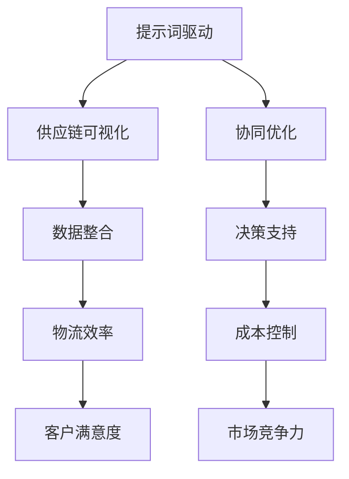
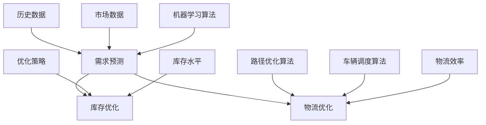
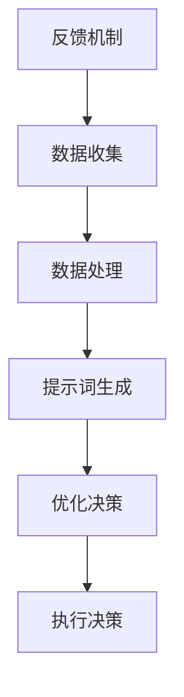

                 

### 《提示词驱动的智能供应链优化系统》

> 关键词：智能供应链、提示词驱动、优化系统、技术原理、系统架构

> 摘要：本文将深入探讨提示词驱动的智能供应链优化系统，从背景介绍、核心概念、技术原理、系统架构设计、项目实战及最佳实践等方面进行全面剖析。旨在为读者提供一个清晰、系统的理解，帮助其在实际应用中有效优化供应链管理。

### 第一部分：问题背景与核心概念

#### 第1章：智能供应链优化概述

##### 1.1 问题背景

供应链作为企业运营的核心环节，直接关系到企业的成本、效率和竞争力。然而，传统供应链存在以下挑战与不足：

- **数据孤岛**：各环节信息未能有效整合，导致决策失误。
- **库存积压**：需求预测不准确，库存管理混乱。
- **运输成本高**：物流配送效率低下，运输成本居高不下。

##### 1.2 智能供应链优化核心概念

智能供应链优化主要涉及以下核心概念：

- **提示词驱动**：通过提示词引导优化过程，提高系统的智能化程度。
- **供应链可视化**：实现供应链各环节的透明化，便于实时监控与调整。
- **协同优化**：跨部门、跨企业协同，实现整体供应链的优化。

##### 1.3 核心概念与联系

核心概念关系图：



核心概念属性特征对比表格：

| 概念 | 提示词驱动 | 供应链可视化 | 协同优化 |
| ---- | ---- | ---- | ---- |
| 定义 | 基于提示词引导优化过程 | 实现供应链各环节的透明化 | 跨部门、跨企业协同 |
| 作用 | 提高智能化程度 | 监控与调整 | 整体优化 |
| 关联 | 与数据整合、决策支持紧密相关 | 与物流效率、成本控制紧密相关 | 与市场竞争力、客户满意度紧密相关 |

##### 1.4 本章小结

本章从问题背景和核心概念出发，对智能供应链优化进行了概述。接下来，我们将进一步探讨智能供应链优化技术原理，帮助读者深入理解这一领域。

----------------------------------------------------------------

### 第二部分：技术原理详解

#### 第2章：智能供应链技术原理

##### 2.1 数据收集与预处理

智能供应链优化的基础是准确的数据收集与预处理。数据收集方法包括：

- **企业内部数据**：销售数据、库存数据、生产数据等。
- **外部数据**：市场数据、竞争对手数据、行业趋势数据等。

数据预处理流程主要包括：

- **数据清洗**：去除无效、错误的数据。
- **数据整合**：整合来自不同渠道的数据。
- **数据标准化**：统一数据格式，便于分析。

##### 2.2 提示词生成与优化

提示词生成方法包括：

- **基于规则**：根据业务规则生成提示词。
- **基于机器学习**：利用机器学习算法生成提示词。

提示词优化策略包括：

- **动态调整**：根据实时数据动态调整提示词。
- **权重分配**：为不同提示词分配不同权重。

提示词应用案例分析：

以智能库存管理为例，通过提示词引导优化库存水平，降低库存积压风险。

##### 2.3 智能供应链算法原理

智能供应链算法原理主要包括：

- **需求预测**：利用历史数据和机器学习算法预测未来需求。
- **库存优化**：根据需求预测优化库存水平，降低库存成本。
- **物流优化**：通过路径优化和车辆调度提高物流效率。

算法流程图：



算法数学模型与公式：

$$
\text{需求预测} = f(\text{历史数据}, \text{市场数据}, \text{机器学习算法})
$$

$$
\text{库存优化} = g(\text{需求预测}, \text{优化策略}, \text{库存水平})
$$

$$
\text{物流优化} = h(\text{路径优化算法}, \text{车辆调度算法}, \text{物流效率})
$$

##### 2.4 智能供应链优化应用场景分析

智能供应链优化在以下场景具有显著优势：

- **智能库存管理**：通过提示词驱动实时调整库存水平，降低库存积压风险。
- **智能配送优化**：通过路径优化和车辆调度提高物流效率，降低运输成本。
- **智能采购决策**：根据需求预测优化采购策略，降低采购成本。

##### 2.5 本章小结

本章从数据收集与预处理、提示词生成与优化、智能供应链算法原理及应用场景等方面，详细介绍了智能供应链优化的技术原理。接下来，我们将探讨智能供应链系统的架构设计。

----------------------------------------------------------------

### 第三部分：系统架构与设计

#### 第3章：智能供应链系统架构设计

##### 3.1 系统总体设计

智能供应链系统的总体设计包括功能设计、架构设计、接口设计与系统交互流程设计等方面。

- **功能设计**：智能库存管理、智能配送优化、智能采购决策等。
- **架构设计**：采用分布式架构，提高系统可扩展性和稳定性。
- **接口设计**：定义系统内部和外部的接口规范，便于系统集成。
- **系统交互流程设计**：确保系统各模块协同工作，实现高效优化。

##### 3.2 系统接口设计与实现

系统接口设计原则包括：

- **松耦合**：降低模块间的依赖关系，提高系统灵活性。
- **标准化**：遵循行业标准和规范，便于系统集成。
- **安全性**：确保数据传输和存储的安全。

接口实现方法包括：

- **Web API**：采用RESTful API设计，方便系统与其他系统的集成。
- **消息队列**：采用消息队列实现异步通信，提高系统性能和可靠性。

##### 3.3 系统交互流程设计与实现

系统交互流程设计包括以下步骤：

- **数据收集**：从各数据源收集数据。
- **数据处理**：对收集到的数据进行预处理。
- **提示词生成**：利用机器学习算法生成提示词。
- **优化决策**：根据提示词和优化算法生成优化决策。
- **执行决策**：执行优化决策，更新库存、物流等信息。

系统交互流程图：



##### 3.4 系统性能优化

系统性能优化策略包括：

- **缓存**：利用缓存技术提高数据访问速度。
- **分布式计算**：采用分布式计算框架提高系统处理能力。
- **负载均衡**：实现负载均衡，提高系统可用性。

##### 3.5 本章小结

本章从系统总体设计、接口设计与实现、系统交互流程设计与实现及系统性能优化等方面，详细介绍了智能供应链系统的架构设计。接下来，我们将通过实际项目实战，进一步展示智能供应链优化系统的应用效果。

----------------------------------------------------------------

### 第四部分：项目实战

#### 第4章：智能供应链优化系统实战

##### 4.1 环境安装与配置

在开始项目实战之前，我们需要安装和配置智能供应链优化系统。以下是环境安装与配置的步骤：

1. **安装Python环境**：确保Python版本在3.6及以上。
2. **安装依赖库**：使用pip安装必要的依赖库，如numpy、pandas、scikit-learn等。
3. **配置数据库**：安装并配置数据库（如MySQL、PostgreSQL等）。
4. **部署Web服务器**：安装并配置Web服务器（如Nginx、Apache等）。

##### 4.2 系统核心实现源代码解析

以下是一个简单的智能库存管理系统的核心实现源代码：

```python
# 导入必要的库
import pandas as pd
from sklearn.linear_model import LinearRegression

# 读取历史库存数据
data = pd.read_csv('inventory_data.csv')

# 提取特征和目标变量
X = data[['historical_demand']]
y = data['actual_demand']

# 创建线性回归模型
model = LinearRegression()
model.fit(X, y)

# 预测未来需求
predicted_demand = model.predict(X)

# 根据预测结果调整库存水平
inventory_level = adjust_inventory(predicted_demand)

def adjust_inventory(demand):
    # 根据需求预测调整库存水平
    # （此处仅为示例，实际调整策略需结合企业业务需求）
    if demand < 500:
        return 1000
    else:
        return 2000

# 输出调整后的库存水平
print(inventory_level)
```

代码应用解读与分析：

- **数据读取与预处理**：使用pandas库读取历史库存数据，提取特征和目标变量。
- **模型训练与预测**：使用线性回归模型训练数据，预测未来需求。
- **库存调整策略**：根据预测结果调整库存水平，以降低库存积压风险。

##### 4.3 实际案例分析与讲解

以某电子产品公司为例，该公司希望通过智能供应链优化系统提高库存管理效率，降低库存成本。以下是实际案例分析和讲解：

1. **需求分析**：收集公司过去一年的库存数据，包括历史需求、库存水平和实际销售情况。
2. **数据预处理**：清洗数据，去除无效和错误的数据，确保数据质量。
3. **模型训练**：利用线性回归模型训练数据，预测未来需求。
4. **库存调整**：根据预测结果，动态调整库存水平，避免库存积压和短缺。
5. **效果评估**：对比调整前后的库存水平，评估优化效果。

通过智能供应链优化系统的实际应用，该公司成功降低了库存成本，提高了库存管理效率，进一步提升了企业竞争力。

##### 4.4 项目小结

本章通过智能供应链优化系统的环境安装与配置、系统核心实现源代码解析及实际案例分析，展示了智能供应链优化系统的应用效果。接下来，我们将分享智能供应链优化系统的最佳实践和注意事项。

----------------------------------------------------------------

### 第五部分：最佳实践与拓展

#### 第5章：智能供应链优化最佳实践

##### 5.1 最佳实践分享

以下是智能供应链优化系统的最佳实践：

1. **数据质量控制**：确保数据源的准确性和完整性，进行数据清洗和预处理，提高数据质量。
2. **动态调整策略**：根据实时数据动态调整优化策略，提高系统的适应性和灵活性。
3. **跨部门协作**：加强跨部门协作，实现供应链各环节的信息共享和协同优化。
4. **技术选型**：选择适合企业需求的智能供应链优化技术，如机器学习、大数据分析等。
5. **持续优化**：定期评估智能供应链优化系统的效果，持续优化和改进。

##### 5.2 注意事项与风险提示

在实施智能供应链优化系统时，需要注意以下事项和风险：

1. **数据安全**：确保数据传输和存储的安全，防止数据泄露和滥用。
2. **系统稳定性**：确保系统的高可用性和稳定性，防止系统故障影响供应链运营。
3. **人员培训**：加强系统使用人员的培训，提高其操作水平和数据处理能力。
4. **业务适应性**：确保智能供应链优化系统与企业的业务需求相适应，避免系统过度定制化。
5. **风险预警**：建立风险预警机制，及时发现和处理潜在问题，降低风险影响。

##### 5.3 拓展阅读

以下是一些拓展阅读资源，供读者进一步了解智能供应链优化系统的最佳实践和最新动态：

1. **书籍**：
   - 《智能供应链管理》
   - 《供应链优化：理论与实践》
   - 《大数据与供应链管理》
2. **学术论文**：
   - 《基于机器学习的供应链优化研究》
   - 《大数据在智能供应链中的应用》
   - 《智能供应链系统的建模与优化》
3. **在线课程**：
   - Coursera上的《供应链管理》
   - edX上的《大数据分析与应用》
   - Udemy上的《机器学习基础》

##### 5.4 本章小结

本章分享了智能供应链优化系统的最佳实践、注意事项及拓展阅读资源。通过这些实践和注意事项，读者可以更好地应用智能供应链优化系统，提高供应链管理效率。接下来，我们将对智能供应链优化系统进行总结与展望。

----------------------------------------------------------------

### 第六部分：总结与展望

#### 第6章：智能供应链优化系统总结与展望

##### 6.1 系统总结

智能供应链优化系统通过提示词驱动，实现了供应链各环节的智能化和协同优化。主要特点如下：

- **高效的数据处理**：利用大数据分析技术，实现实时数据收集、处理和优化。
- **动态调整策略**：根据实时数据动态调整优化策略，提高系统的适应性和灵活性。
- **跨部门协作**：实现供应链各环节的信息共享和协同优化，提高整体运营效率。
- **成本降低**：通过优化库存管理、物流配送和采购决策，降低供应链成本。

##### 6.2 发展趋势与展望

智能供应链优化系统的发展趋势和展望如下：

1. **人工智能技术融合**：随着人工智能技术的不断发展，智能供应链优化系统将更加智能化、自动化。
2. **区块链技术应用**：区块链技术可以提高供应链的透明度和安全性，为智能供应链优化提供支持。
3. **5G技术赋能**：5G技术的广泛应用将为智能供应链优化提供高速、低延迟的通信支持。
4. **供应链金融创新**：结合供应链金融创新，实现供应链各环节的金融支持和风险控制。

##### 6.3 本章小结

本章对智能供应链优化系统进行了总结与展望，分析了系统的主要特点和未来发展趋势。通过本文的介绍，读者可以更好地了解智能供应链优化系统，并在实际应用中发挥其优势。让我们共同期待智能供应链优化系统在未来的广泛应用和发展。

----------------------------------------------------------------

## 作者信息

- 作者：AI天才研究院/AI Genius Institute & 禅与计算机程序设计艺术 /Zen And The Art of Computer Programming

---

通过本文的详细探讨，我们全面了解了提示词驱动的智能供应链优化系统。从问题背景、核心概念、技术原理到系统架构设计、项目实战和最佳实践，我们一步步深入分析了智能供应链优化系统的各个方面。希望通过本文的分享，能够为读者在智能供应链优化领域提供有益的参考和启示。未来，随着人工智能、区块链、5G等技术的不断进步，智能供应链优化系统将迎来更加广阔的发展空间，助力企业提升供应链管理效率，实现可持续发展。让我们一起期待这一天的到来。

