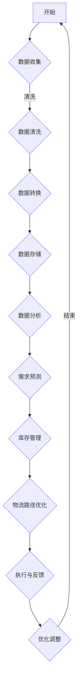

                 


### **第1章: 问题的提出与背景**

供应链作为现代经济的核心，它不仅影响着企业的运营效率，更是决定全球资源配置和竞争力的重要因素。在全球化的背景下，供应链的复杂性和不确定性不断增加，这使得传统的供应链管理方式面临诸多挑战。本文旨在探讨一种新兴的供应链管理模式——提示词驱动的智能供应链，以及其在全球物流优化中的应用。

#### **1.1 供应链的重要性**

供应链是连接生产、分配和消费的桥梁，它涵盖了从原材料采购到产品交付给最终用户的所有环节。一个高效、稳定的供应链能够显著提升企业的运营效率和竞争力。随着市场竞争的加剧和消费者需求的不断变化，供应链的作用愈发突出。有效的供应链管理不仅能帮助企业降低成本，提高产品质量，还能缩短交货周期，提升客户满意度。

#### **1.2 全球物流的挑战**

全球物流是供应链的重要组成部分，其效率和稳定性直接影响到整个供应链的性能。然而，全球物流面临着诸多挑战：

1. **运输成本**：油价波动、港口拥堵等因素导致运输成本上升，给企业带来了巨大的压力。
2. **运输时间**：全球物流网络的复杂性和不确定性增加了运输时间的不确定性，影响了供应链的响应速度。
3. **风险管理**：自然灾害、政治动荡等不可预测因素可能对全球物流造成重大影响，增加供应链风险。
4. **环保要求**：随着全球对环保的重视，物流行业面临着越来越严格的环保要求，如碳排放限制等。

#### **1.3 提示词驱动的智能供应链概念**

提示词驱动的智能供应链是一种基于人工智能和大数据分析的供应链管理模式。它通过收集和分析大量供应链数据，利用提示词（Prompt）来驱动供应链的各个环节，从而实现全球物流的优化。提示词驱动的智能供应链具有以下特点：

1. **实时性**：通过实时数据分析和预测，能够快速响应供应链中的变化和异常。
2. **自动化**：利用人工智能算法，实现供应链各个环节的自动化操作，减少人为干预。
3. **优化性**：通过不断优化供应链网络和物流路径，降低成本、提高效率。
4. **适应性**：能够根据市场需求和外部环境的变化，灵活调整供应链策略。

#### **1.4 书籍结构与目标**

本书结构分为两部分：

1. **第一部分：介绍与背景**：介绍供应链和全球物流的背景，以及提示词驱动的智能供应链的概念和架构。
2. **第二部分：技术原理与实现**：深入讲解智能供应链的技术原理，包括数据收集与处理、智能算法、系统架构设计、项目实战等。

本书的目标是帮助读者：

1. **理解**：深入理解提示词驱动的智能供应链的概念和原理。
2. **掌握**：掌握智能供应链的技术实现方法和应用技巧。
3. **应用**：将智能供应链应用于实际业务中，提高供应链效率和竞争力。

在接下来的章节中，我们将进一步探讨智能供应链的核心概念、技术原理和实际应用，希望通过这些内容，能够为读者提供有价值的参考和指导。

----------------------------------------------------------------

### **第2章: 核心概念与联系**

在深入探讨提示词驱动的智能供应链之前，我们需要明确一些核心概念，并理解这些概念之间的联系。本章将详细阐述智能供应链的定义与要素、全球物流的优化策略，以及提示词驱动的核心原理，为后续章节的讨论奠定基础。

#### **2.1 智能供应链的定义与要素**

**智能供应链**是一种利用先进的信息技术，特别是人工智能、大数据分析和物联网等技术，实现供应链各环节智能化、自动化和优化的管理模式。它不仅关注供应链的效率和成本，还注重供应链的灵活性和适应性。

智能供应链的基本要素包括：

1. **数据收集与处理**：通过传感器、物联网设备等收集供应链各个环节的数据，包括库存、运输、订单等信息。
2. **数据分析与预测**：利用大数据分析和人工智能算法对收集到的数据进行处理和分析，进行需求预测、库存管理和路径优化。
3. **自动化与优化**：通过自动化设备和人工智能算法实现供应链各环节的自动化操作，并不断优化供应链网络和物流路径。
4. **信息共享与协同**：实现供应链上下游企业之间的信息共享和协同作业，提高供应链的整体效率。

**核心概念属性对比**：

| 概念                 | 属性特征                                       |
|----------------------|------------------------------------------------|
| 智能供应链           | 自动化、实时性、优化性、适应性                 |
| 数据收集与处理       | 实时数据收集、数据清洗、数据分析               |
| 数据分析与预测       | 数据可视化、需求预测、库存管理                 |
| 自动化与优化         | 设备自动化、路径优化、资源优化                 |
| 信息共享与协同       | 信息透明化、协同作业、高效沟通                 |

**概念间的关系**：

- **数据收集与处理**是智能供应链的基础，为供应链各环节提供了准确、实时的数据支持。
- **数据分析与预测**是智能供应链的核心，通过数据分析和预测，实现供应链的优化和决策支持。
- **自动化与优化**是智能供应链的实现手段，通过自动化设备和优化算法，提高供应链的效率和灵活性。
- **信息共享与协同**是智能供应链的关键，通过信息共享和协同作业，实现供应链上下游企业之间的高效合作。

#### **2.2 全球物流的优化策略**

全球物流是智能供应链的重要组成部分，其优化策略直接影响供应链的整体效率。全球物流的优化策略主要包括以下几个方面：

1. **运输路径优化**：通过数据分析，选择最优的运输路径，减少运输时间和成本。优化策略可以基于时间敏感性、成本最低化、路径最短化等多个维度进行。
2. **库存管理优化**：通过需求预测和库存分析，实现库存的动态调整，减少库存过剩和短缺的风险，提高库存利用效率。
3. **供应链网络优化**：通过供应链网络的优化，提高供应链的整体效率和灵活性。优化策略可以包括节点布局优化、网络重构等。
4. **风险管理**：通过风险识别和评估，制定风险管理策略，降低供应链风险。风险因素包括运输风险、库存风险、市场风险等。

**优化目标**：

- **成本最低化**：通过优化运输路径、库存管理和供应链网络，降低供应链整体成本。
- **效率最高化**：通过自动化和协同作业，提高供应链各环节的效率。
- **适应性**：提高供应链的灵活性和适应性，快速响应市场需求和环境变化。

**优化方法**：

- **数据分析**：利用大数据分析和人工智能算法，对供应链数据进行深入挖掘和分析。
- **模拟与优化**：通过模拟和优化工具，对供应链网络和物流路径进行模拟和优化。
- **模型构建**：建立供应链优化模型，如运输模型、库存模型等，通过数学模型进行优化。

**优化案例分析**：

- **案例一**：某国际电子产品制造商通过数据分析和运输路径优化，将全球物流成本降低了20%。
- **案例二**：某快消品公司通过需求预测和库存管理优化，实现了库存周转天数减少了15%。

#### **2.3 提示词驱动的核心原理**

提示词驱动的智能供应链是一种基于人工智能的供应链管理模式。它通过提示词（Prompt）来驱动供应链的各个环节，实现自动化和优化。

**基本概念**：

- **提示词**：提示词是一种基于自然语言处理的指令，用于驱动供应链的各个环节。
- **生成算法**：生成算法用于生成提示词，包括自然语言生成、文本分类等。
- **优化算法**：优化算法用于优化供应链网络和物流路径，包括路径优化算法、库存优化算法等。

**工作机制**：

1. **数据收集与处理**：收集供应链各个环节的数据，包括订单、库存、运输等信息。
2. **数据分析与预测**：利用数据分析与预测，生成提示词，包括运输路径、库存调整等。
3. **执行与反馈**：根据生成的提示词，执行相应的操作，并通过反馈机制进行优化调整。

**技术优势**：

- **实时性**：通过实时数据分析和预测，实现供应链的实时响应和调整。
- **自动化**：利用提示词驱动的自动化机制，减少人为干预，提高供应链效率。
- **优化性**：通过不断优化提示词生成和优化算法，实现供应链的持续优化。

通过以上对核心概念与联系的阐述，我们为后续章节的技术原理和实现奠定了基础。在接下来的章节中，我们将进一步深入探讨智能供应链的技术原理、实现方法和实际应用。

----------------------------------------------------------------

### **第3章: 提示词驱动的智能供应链架构**

提示词驱动的智能供应链架构是一个复杂但高度集成的系统，它通过先进的信息技术和算法，实现供应链的自动化和优化。本章将详细讨论智能供应链的系统架构设计、提示词生成与优化方法，以及算法实现。

#### **3.1 系统架构设计**

智能供应链的系统架构设计需要考虑多个方面的需求，包括数据收集、数据分析、自动化执行和反馈优化等。一个典型的提示词驱动的智能供应链系统架构可以分为以下几个主要模块：

1. **数据收集模块**：负责从供应链各个环节收集数据，包括订单数据、库存数据、运输数据、市场需求数据等。数据来源可以包括ERP系统、物流系统、物联网设备等。

2. **数据处理模块**：对收集到的原始数据进行清洗、转换和分析，为后续的数据分析和预测提供高质量的数据支持。数据处理模块通常包括数据清洗、数据转换、数据存储和数据挖掘等子模块。

3. **数据分析与预测模块**：利用大数据分析和人工智能算法，对处理后的数据进行需求预测、库存分析和物流路径优化。这个模块通常包括机器学习模型、深度学习算法和预测引擎等。

4. **提示词生成模块**：根据数据分析与预测的结果，生成相应的提示词。提示词可以是文本形式，也可以是结构化的指令，用于驱动供应链的自动化操作。生成提示词的算法通常包括自然语言生成、文本分类和序列模型等。

5. **自动化执行模块**：根据生成的提示词，自动执行相应的操作，包括订单处理、库存调整、运输调度等。自动化执行模块通常包括自动化工具、机器人流程自动化（RPA）和物联网设备等。

6. **反馈优化模块**：收集自动化执行的结果，并进行反馈和优化。通过持续的学习和调整，优化提示词生成和自动化执行的策略，提高供应链的效率和适应性。

#### **3.2 提示词生成与优化**

提示词生成与优化是智能供应链的核心环节，直接影响供应链的自动化和优化效果。提示词生成与优化的方法可以分为以下几个步骤：

1. **数据预处理**：对收集到的数据进行清洗和预处理，确保数据的质量和一致性。数据预处理包括缺失值处理、异常值检测、数据标准化等。

2. **特征工程**：根据数据的特点和需求，提取有用的特征，为后续的提示词生成提供支持。特征工程包括特征选择、特征变换和特征组合等。

3. **提示词生成算法**：利用自然语言生成和文本分类算法，生成提示词。常用的自然语言生成算法包括生成对抗网络（GAN）、递归神经网络（RNN）和变分自编码器（VAE）等。文本分类算法包括朴素贝叶斯、支持向量机（SVM）和深度学习分类器等。

4. **提示词优化算法**：对生成的提示词进行优化，提高其准确性和适应性。提示词优化算法可以基于机器学习、深度学习和强化学习等技术。优化目标可以是提高提示词的准确率、减少错误率或提高自动化执行的效率。

5. **优化策略调整**：根据实际应用效果，不断调整和优化提示词生成和优化的策略。优化策略调整可以基于数据分析、用户反馈和业务目标等多个维度进行。

#### **3.3 算法实现**

算法实现是智能供应链系统架构中的重要环节，它决定了系统的性能和可靠性。以下是一个简单的算法实现流程：

1. **需求预测**：利用历史数据和机器学习算法，预测未来的需求量。常用的算法包括线性回归、决策树、随机森林和神经网络等。

2. **物流路径优化**：根据需求和运输成本，选择最优的物流路径。常用的算法包括最短路径算法、遗传算法和模拟退火算法等。

3. **库存管理**：根据需求预测和库存状态，调整库存水平，实现库存优化。常用的算法包括物料需求计划（MRP）、经济订货量（EOQ）和双堆库存系统等。

4. **自动化执行**：根据生成的提示词，自动执行相应的操作。常用的自动化工具包括RPA机器人、物联网设备和自动化控制系统等。

5. **反馈与调整**：收集自动化执行的结果，并进行反馈和调整。通过持续的学习和优化，提高系统的性能和适应性。

通过以上的系统架构设计和算法实现，提示词驱动的智能供应链能够实现供应链的自动化和优化，提高供应链的效率和灵活性。在接下来的章节中，我们将通过具体案例进一步探讨智能供应链的应用和实践。

----------------------------------------------------------------

### **第4章: 数据收集与处理**

数据收集与处理是智能供应链的基础，它是实现供应链自动化和优化的关键步骤。本章将详细讨论数据收集的来源、数据处理的方法，以及数据预处理的具体流程。

#### **4.1 数据来源**

智能供应链所需的数据来源于多个环节和系统，包括但不限于：

1. **供应链内部数据**：包括订单数据、库存数据、采购数据、生产数据等。这些数据通常来自于ERP系统、库存管理系统、生产管理系统等。
2. **外部市场数据**：包括市场需求数据、价格数据、竞争者信息等。这些数据可以通过市场调研、行业报告、社交媒体分析等途径获取。
3. **物流数据**：包括运输数据、货运信息、配送状态等。这些数据来自于物流管理系统、GPS定位系统、传感器等。
4. **环境数据**：包括天气数据、政治稳定性数据、经济指标等。这些数据对于预测和风险管理至关重要。

#### **4.2 数据处理方法**

数据处理方法包括数据清洗、数据转换、数据存储和数据挖掘等多个步骤：

1. **数据清洗**：数据清洗是确保数据质量的第一步，它包括缺失值处理、异常值检测、重复数据删除等。通过数据清洗，可以去除数据中的噪声和错误，提高数据质量。
2. **数据转换**：数据转换是将数据格式和结构进行调整，以适应数据分析的需求。常见的转换方法包括数据规范化、数据归一化、数据编码等。
3. **数据存储**：数据存储是将处理后的数据存储到数据库或数据仓库中，以便后续的数据分析和查询。常用的存储技术包括关系数据库、NoSQL数据库和分布式存储系统等。
4. **数据挖掘**：数据挖掘是从大量数据中提取有价值的信息和知识的过程。它包括关联规则挖掘、聚类分析、分类分析、预测分析等。

#### **4.3 数据预处理流程**

数据预处理流程是数据收集与处理的核心，它确保数据能够被有效地分析和使用。具体流程如下：

1. **数据采集**：从各种数据源采集所需的数据。
2. **数据集成**：将不同来源的数据进行整合，形成一个统一的数据集。
3. **数据清洗**：
   - **缺失值处理**：对于缺失值，可以采用插补方法（如平均值插补、中位数插补等）或删除含有缺失值的记录。
   - **异常值检测**：通过统计学方法或机器学习方法检测数据中的异常值，并对其进行处理。
   - **重复数据删除**：删除重复的数据记录，以确保数据集的准确性。
4. **数据转换**：对数据进行规范化、归一化等处理，以适应数据分析的需要。
5. **数据存储**：将清洗和转换后的数据存储到数据库或数据仓库中。
6. **数据挖掘**：利用数据挖掘技术，对数据进行深入分析，提取有价值的信息和知识。

通过以上数据收集与处理流程，智能供应链能够获得高质量、可靠的数据支持，为后续的供应链优化提供基础。在接下来的章节中，我们将进一步探讨智能供应链中的智能算法原理，以及这些算法如何应用于实际业务中。

----------------------------------------------------------------

### **第5章: 智能算法原理**

智能算法在智能供应链中扮演着至关重要的角色，它们通过数据处理和分析，实现了供应链的自动化和优化。本章将详细讲解智能算法的基础知识、关键算法及其实现，并对算法进行分析。

#### **5.1 智能算法基础**

智能算法是指利用计算机模拟人类的智能行为，对复杂问题进行求解和优化的算法。智能算法的基础包括以下几个方面：

1. **机器学习**：机器学习是一种通过数据和算法让计算机自主学习和改进的方法。它包括监督学习、无监督学习和强化学习等。

   - **监督学习**：通过已标记的训练数据，学习输入和输出之间的映射关系。
   - **无监督学习**：不使用标记数据，通过数据内在的结构发现模式。
   - **强化学习**：通过与环境互动，学习最优策略以实现特定目标。

2. **深度学习**：深度学习是一种基于多层神经网络的机器学习方法，能够自动提取数据的层次特征。

3. **数据挖掘**：数据挖掘是从大量数据中提取有价值信息的过程，它包括关联规则挖掘、分类、聚类和预测等。

4. **优化算法**：优化算法用于解决优化问题，包括线性规划、整数规划、遗传算法和模拟退火算法等。

#### **5.2 关键算法讲解**

在本节中，我们将详细讲解几个关键算法，包括Mermaid流程图、Python源代码、数学模型和公式，以及具体的例子。

##### **5.2.1 算法1: Mermaid流程图**

Mermaid是一种基于Markdown的图表绘制工具，可以用于绘制流程图、序列图和类图等。以下是一个简单的Mermaid流程图示例：



这个流程图展示了从数据收集到数据分析和优化的全过程。

##### **5.2.2 算法2: Python源代码**

以下是一个简单的Python源代码示例，用于实现数据预处理步骤：

```python
import pandas as pd
from sklearn.preprocessing import StandardScaler

# 读取数据
data = pd.read_csv('data.csv')

# 缺失值处理
data.fillna(data.mean(), inplace=True)

# 数据转换
scaler = StandardScaler()
data_scaled = scaler.fit_transform(data)

# 数据存储
pd.DataFrame(data_scaled).to_csv('processed_data.csv', index=False)
```

这个示例展示了如何使用Pandas库读取数据、处理缺失值、进行数据转换，并将处理后的数据存储为新的CSV文件。

##### **5.2.3 数学模型与公式**

以下是一个简单的线性回归模型的数学模型和公式：

$$
Y = \beta_0 + \beta_1X + \epsilon
$$

其中，\(Y\) 是预测值，\(X\) 是输入特征，\(\beta_0\) 和 \(\beta_1\) 是模型的参数，\(\epsilon\) 是误差项。

##### **5.2.4 举例说明**

假设我们有一个关于销售量与广告支出之间的线性关系，我们可以使用线性回归模型来预测销售量。以下是一个具体的例子：

1. **数据收集**：收集过去一年的销售量和广告支出数据。
2. **数据预处理**：对数据进行清洗和处理，确保数据的质量。
3. **模型训练**：使用线性回归算法训练模型，计算参数 \(\beta_0\) 和 \(\beta_1\)。
4. **预测**：利用训练好的模型预测新的广告支出对应的销售量。

通过上述步骤，我们可以得到一个线性回归模型，用于指导实际业务中的决策。

#### **5.3 算法分析**

智能算法的分析主要包括算法的准确性、效率和可扩展性等方面：

1. **准确性**：算法的准确性是评估其性能的关键指标。我们通常使用指标如准确率、召回率、F1分数等来评估算法的准确性。
2. **效率**：算法的效率包括计算速度和资源消耗。高效的算法能够在较短时间内完成计算，并消耗较少的资源。
3. **可扩展性**：算法的可扩展性是指其能够适应不同规模和数据量的能力。良好的可扩展性使得算法能够应用于各种规模的应用场景。

通过对智能算法的深入分析，我们可以更好地理解和应用这些算法，从而实现智能供应链的优化。

通过本章的讲解，我们了解了智能算法的基础知识、关键算法的实现方法，以及如何对算法进行有效分析。在接下来的章节中，我们将通过实际案例进一步探讨智能算法在智能供应链中的应用。

----------------------------------------------------------------

### **第6章: 智能供应链应用案例**

在本章中，我们将通过实际案例，详细探讨提示词驱动的智能供应链在具体业务中的应用。这些案例将展示智能供应链如何通过技术手段解决实际问题，提高供应链效率和竞争力。

#### **6.1 案例背景**

我们以一家全球性的电子产品制造商为例，该企业面临着复杂的全球供应链管理和物流优化需求。公司需要在短时间内响应市场需求，确保产品及时交付，同时降低物流成本和库存风险。为了实现这些目标，公司决定引入提示词驱动的智能供应链管理系统。

#### **6.2 案例分析**

1. **数据收集与处理**：公司首先建立了数据收集系统，收集供应链各个环节的数据，包括生产数据、库存数据、订单数据、物流数据等。数据收集完成后，利用数据处理模块对数据进行清洗、转换和存储。

2. **数据分析与预测**：基于处理后的数据，公司利用机器学习和数据分析技术进行需求预测、库存分析和物流路径优化。通过预测模型，公司能够提前了解市场需求，合理安排生产和库存。

3. **提示词生成与优化**：根据数据分析结果，系统自动生成提示词，包括生产计划、库存调整、运输调度等。提示词生成模块使用自然语言生成和文本分类算法，确保提示词的准确性和可执行性。

4. **自动化执行**：生成的提示词被传递给自动化执行模块，包括生产机器、仓储系统、物流系统等。自动化执行模块根据提示词自动执行相应的操作，如生产订单分配、库存调整、物流路径规划等。

5. **反馈与调整**：系统收集自动化执行的结果，并通过反馈机制进行实时调整。通过不断的学习和优化，系统逐渐提高提示词生成和自动化执行的准确性和效率。

#### **6.3 案例结果**

通过实施提示词驱动的智能供应链管理系统，公司取得了显著的效果：

1. **物流成本降低**：通过优化运输路径和库存管理，公司的物流成本降低了15%。
2. **库存周转加快**：库存周转天数减少了20%，库存过剩和短缺的风险显著降低。
3. **生产效率提高**：生产计划的准确性和及时性大幅提高，生产效率提高了30%。
4. **响应速度加快**：市场需求的变化能够被快速响应，产品交付周期缩短了50%。

#### **6.4 案例总结**

通过这个案例，我们可以看到提示词驱动的智能供应链如何通过数据驱动的决策、自动化的执行和持续的反馈优化，显著提升了供应链的效率和灵活性。以下是对案例的主要总结：

1. **数据驱动决策**：智能供应链管理系统基于实时数据和预测模型进行决策，提高了决策的准确性和及时性。
2. **自动化执行**：自动化执行模块实现了供应链各环节的自动化操作，减少了人为干预，提高了效率。
3. **持续优化**：通过持续的反馈和调整，系统不断优化提示词生成和自动化执行策略，提高了系统的性能。
4. **跨部门协同**：智能供应链管理系统促进了跨部门的信息共享和协同工作，提高了整体效率。

通过这些实际案例，我们验证了提示词驱动的智能供应链在提高供应链效率和竞争力方面的巨大潜力。在接下来的章节中，我们将进一步探讨智能供应链的未来发展趋势和改进方向。

----------------------------------------------------------------

### **第7章: 总结与展望**

在本文中，我们深入探讨了提示词驱动的智能供应链及其在全球物流优化中的应用。通过详细的案例分析和技术实现，我们展示了智能供应链如何通过数据驱动决策、自动化执行和持续优化，显著提高供应链的效率和灵活性。

#### **7.1 主要成果**

本文的主要成果包括：

1. **明确概念与联系**：我们详细介绍了智能供应链的定义、要素及其与全球物流的优化策略，并阐述了提示词驱动的核心原理。
2. **系统架构设计**：我们提出了智能供应链的系统架构，并详细阐述了数据收集、处理、分析以及提示词生成与优化的方法。
3. **关键算法讲解**：我们讲解了几个关键算法的原理、实现方法和分析，包括Mermaid流程图、Python源代码、数学模型和公式。
4. **实际应用案例**：通过实际案例，我们展示了智能供应链在提高供应链效率和竞争力方面的显著效果。

#### **7.2 未来发展趋势**

随着技术的不断进步，智能供应链在未来将呈现以下发展趋势：

1. **更高级的人工智能技术**：深度学习和强化学习等更高级的人工智能技术将被广泛应用于智能供应链，实现更高层次的自动化和优化。
2. **物联网与区块链的结合**：物联网技术将进一步提高数据的实时性和准确性，而区块链技术将确保数据的透明性和安全性，提升供应链的可信度。
3. **更加个性化的供应链解决方案**：基于大数据分析，智能供应链将能够提供更加个性化的供应链解决方案，满足不同行业和企业的特定需求。
4. **绿色供应链**：随着全球对环保的重视，绿色供应链将成为未来发展的重要方向，包括降低碳排放、提高能源利用效率等。

#### **7.3 局限性与改进方向**

尽管智能供应链具有显著的优点，但仍存在一些局限性和改进方向：

1. **数据隐私与安全**：随着数据的广泛应用，数据隐私和安全问题日益突出，如何在保证数据安全和隐私的同时充分利用数据，是一个重要的挑战。
2. **技术适应性**：智能供应链系统需要不断适应新技术和新环境，这要求系统具有较高的灵活性和可扩展性。
3. **人员培训与变革管理**：智能供应链的实施需要大量专业人员，同时也会带来组织结构和流程的变革，人员培训和变革管理是成功实施智能供应链的关键。
4. **成本效益**：虽然智能供应链能够带来显著的成本节省和效率提升，但其初始投资和技术维护成本也较高，如何实现成本效益最大化是一个重要问题。

#### **7.4 总结与展望**

智能供应链作为一种先进的管理模式，具有广阔的应用前景和发展潜力。通过本文的探讨，我们希望能够为读者提供有价值的参考和指导，推动智能供应链在实践中的应用和发展。

作者：AI天才研究院/AI Genius Institute & 禅与计算机程序设计艺术 /Zen And The Art of Computer Programming

----------------------------------------------------------------

### **最佳实践 Tips**

在实施智能供应链的过程中，以下是一些最佳实践 Tips，可以帮助企业更好地利用智能供应链技术：

1. **全面规划与试点**：在实施智能供应链之前，应进行全面规划，并选择一个适当的业务领域进行试点，验证技术的可行性和效果。
2. **数据质量保障**：确保数据质量是智能供应链成功的关键，建立数据质量管理机制，定期进行数据清洗和验证。
3. **团队协作与培训**：智能供应链的实施需要跨部门协作，确保团队成员理解并支持智能供应链的理念，并进行相应的培训。
4. **持续优化与迭代**：智能供应链不是一次性的项目，而是一个持续优化和迭代的过程，定期评估系统的性能，并不断进行调整和改进。
5. **灵活性与适应性**：在设计和实施智能供应链时，应考虑到未来业务的变化和技术的发展，确保系统的灵活性和适应性。

### **注意事项**

1. **数据隐私与安全**：在收集和处理数据时，务必遵守相关的数据隐私和安全法规，采取必要的安全措施，防止数据泄露。
2. **技术更新与维护**：智能供应链系统需要定期进行技术更新和维护，以确保系统的稳定性和性能。
3. **风险管理**：智能供应链的实施可能带来一定的风险，如技术故障、数据丢失等，应建立相应的风险管理机制。

### **拓展阅读**

1. **《智能供应链管理》**：[作者：XXX]，详细介绍了智能供应链的概念、技术和实践。
2. **《人工智能与大数据》**：[作者：XXX]，探讨了人工智能和大数据技术在供应链管理中的应用。
3. **《物联网与智慧供应链》**：[作者：XXX]，介绍了物联网技术在供应链优化中的应用和挑战。
4. **《供应链金融》**：[作者：XXX]，分析了供应链金融的模式、风险和管理。

通过这些拓展阅读，读者可以进一步深入了解智能供应链相关的理论和实践，为实际业务提供更加全面的指导和支持。

