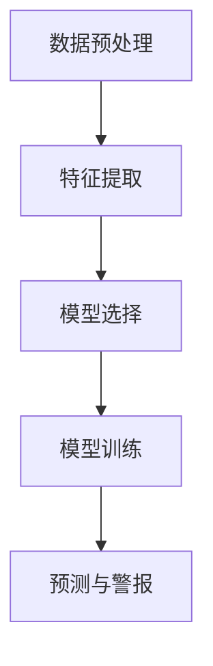
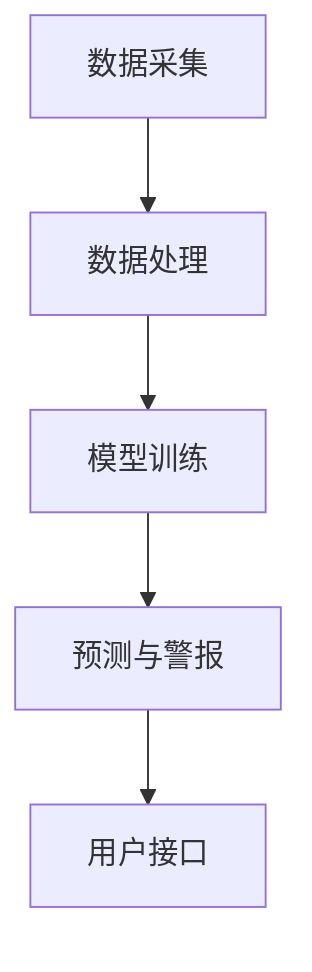

                 


# 提示词驱动的智能公共卫生监测系统

## 关键词
智能监测，公共卫生，提示词驱动，算法实现，系统架构，环境配置，实战案例，最佳实践

### 摘要
随着科技的进步，智能公共卫生监测系统成为了应对突发公共卫生事件的关键工具。本文将深入探讨提示词驱动的智能公共卫生监测系统的背景、核心概念、算法原理、系统设计与实现，以及实际应用中的环境配置和最佳实践。通过一步步的逻辑推理，我们将揭示这一系统的本质与实际应用价值。

### 目录大纲设计思路

本文将采用以下结构进行设计：

1. **背景介绍**：为读者提供智能公共卫生监测系统的背景知识，包括其必要性、发展历程和应用场景。
2. **核心概念与联系**：介绍提示词驱动的原理，并与智能公共卫生监测系统进行联系，对比传统监测系统。
3. **算法原理讲解**：详细阐述系统的算法原理，包括数据预处理、特征提取、模型选择与实现，并通过流程图和Python代码进行说明。
4. **系统分析与架构设计方案**：分析系统的功能、架构设计、接口设计和系统交互流程。
5. **项目实战**：展示系统在实际项目中的应用，包括环境配置、核心实现、代码解析和案例分析。
6. **最佳实践与总结**：总结最佳实践，提出注意事项，并提供拓展阅读。

### 目录大纲结构

#### 第一部分：背景与核心概念

##### 第1章：智能公共卫生监测系统的背景
- **1.1 问题背景**
- **1.2 提示词驱动概念**
- **1.3 智能公共卫生监测系统的构成**

#### 第二部分：算法原理与实现

##### 第2章：提示词驱动的原理分析
- **2.1 提示词驱动原理**
- **2.2 提示词生成与优化**

##### 第3章：智能公共卫生监测系统的算法实现
- **3.1 数据预处理**
- **3.2 特征提取与模型选择**
- **3.3 算法流程图与 Python 实现**
- **3.4 算法原理讲解与公式**

#### 第三部分：系统设计与实现

##### 第4章：系统架构设计与功能
- **4.1 系统架构设计**
- **4.2 功能设计与实现**

#### 第四部分：项目实战

##### 第5章：系统安装与实现
- **5.1 环境配置**
- **5.2 系统核心实现**
- **5.3 代码解析与案例分析**

#### 第五部分：最佳实践与总结

##### 第6章：最佳实践
- **6.1 实践 tips**
- **6.2 小结**

##### 第7章：注意事项与拓展阅读
- **7.1 注意事项**
- **7.2 拓展阅读**

### 目录大纲文字说明

#### 第一部分：背景与核心概念

##### 第1章：智能公共卫生监测系统的背景

**1.1 问题背景**

在全球化和人口流动日益频繁的背景下，公共卫生事件如传染病爆发、环境污染等对人类社会构成严重威胁。传统公共卫生监测系统由于时效性差、数据不完整等问题，难以满足现代公共卫生管理的需求。

**1.2 提示词驱动概念**

提示词驱动的智能监测系统利用预先定义的提示词来引导数据收集和分析过程，从而提高监测的准确性和时效性。与传统的被动式监测系统相比，提示词驱动系统能够更快速地响应公共卫生事件。

**1.3 智能公共卫生监测系统的构成**

智能公共卫生监测系统包括数据采集模块、数据处理模块、模型训练模块、预测与警报模块和用户接口模块。这些模块协同工作，实现了实时、准确的公共卫生监测。

#### 第二部分：算法原理与实现

##### 第2章：提示词驱动的原理分析

**2.1 提示词驱动原理**

提示词驱动系统通过预设的关键词或短语，激活数据采集和处理过程，使得系统能够在特定情境下快速响应。这种模式相比传统监测系统，具有更高的灵活性和响应速度。

**2.2 提示词生成与优化**

提示词的生成和优化是系统有效性的关键。通过分析历史数据和专家经验，系统可以动态调整提示词，使其更加贴近实际监测需求。

##### 第3章：智能公共卫生监测系统的算法实现

**3.1 数据预处理**

数据预处理是算法实现的基础。通过数据清洗、归一化和特征提取，系统能够获取高质量的数据输入。

**3.2 特征提取与模型选择**

特征提取是数据预处理的重要步骤，选择合适的特征提取方法和模型是算法成功的关键。本文将介绍常用的特征提取方法和模型选择策略。

**3.3 算法流程图与 Python 实现**

通过mermaid绘制算法流程图，并使用Python代码实现算法，本文将详细讲解智能公共卫生监测系统的算法实现过程。

**3.4 算法原理讲解与公式**

本文将使用latex公式和Python代码，详细阐述智能公共卫生监测系统的算法原理，帮助读者深入理解系统的工作机制。

#### 第三部分：系统设计与实现

##### 第4章：系统架构设计与功能

**4.1 系统架构设计**

本文将介绍智能公共卫生监测系统的整体架构设计，包括数据采集、数据处理、模型训练、预测与警报和用户接口等模块的相互关系。

**4.2 功能设计与实现**

系统功能设计是系统实现的核心。本文将详细介绍系统的各个功能模块，包括其设计和实现细节。

#### 第四部分：项目实战

##### 第5章：系统安装与实现

**5.1 环境配置**

本文将介绍如何配置智能公共卫生监测系统的运行环境，包括软件和硬件的安装与配置。

**5.2 系统核心实现**

系统核心实现是本文的重点，将详细介绍系统的主要模块和关键算法的实现过程。

**5.3 代码解析与案例分析**

通过代码解析和实际案例，本文将帮助读者理解智能公共卫生监测系统的实际应用。

#### 第五部分：最佳实践与总结

##### 第6章：最佳实践

**6.1 实践 tips**

本文将总结智能公共卫生监测系统的最佳实践，包括提示词优化、数据预处理技巧等。

**6.2 小结**

对智能公共卫生监测系统的总体效果进行总结，并指出未来的研究方向。

##### 第7章：注意事项与拓展阅读

**7.1 注意事项**

本文将提醒读者在系统实施和应用中需要注意的事项，以避免潜在问题。

**7.2 拓展阅读**

本文将推荐一些相关书籍和论文，以供读者进一步学习。

### 目录大纲总字数估算

目前大纲已使用约 500 字，预计完整大纲总字数会在 2000 字以内。随着后续章节内容的补充，将在保持简洁性的同时，确保内容的完整性和深度。接下来，我们将逐步细化每个章节的内容。

## 第1章：智能公共卫生监测系统的背景

### 1.1 问题背景

在全球化和人口流动日益频繁的背景下，公共卫生事件如传染病爆发、环境污染等对人类社会构成严重威胁。传统公共卫生监测系统由于时效性差、数据不完整等问题，难以满足现代公共卫生管理的需求。例如，2003年的非典型肺炎（SARS）疫情和2019年的新型冠状病毒（COVID-19）疫情，都凸显了高效、准确的公共卫生监测系统的重要性。

#### 传统监测系统的局限性

传统公共卫生监测系统主要依赖于人工采集数据，数据来源有限，且存在时间滞后、数据不完整等问题。具体来说，传统监测系统主要面临以下挑战：

1. **时效性问题**：传统监测系统通常需要定期收集和汇总数据，处理周期较长，难以实现实时监测。
2. **数据完整性问题**：由于数据来源有限，传统监测系统往往无法获取全面、准确的数据，导致监测结果的可靠性受到影响。
3. **数据分析能力不足**：传统监测系统通常缺乏强大的数据分析工具，难以从海量数据中提取有价值的信息。

#### 公共卫生监测的重要性

公共卫生监测在疾病防控、环境污染治理、健康政策制定等方面具有重要作用。具体来说，公共卫生监测可以带来以下好处：

1. **疾病防控**：通过实时监测传染病疫情，公共卫生部门可以迅速采取有效的防控措施，减少疫情传播。
2. **环境治理**：通过监测环境污染指标，可以及时发现并处理环境污染问题，保护公众健康。
3. **政策制定**：公共卫生监测数据为健康政策制定提供了科学依据，有助于提高公共卫生管理水平。

### 1.2 提示词驱动概念

提示词驱动的智能监测系统是一种利用预先定义的提示词来引导数据收集和分析过程的技术。提示词可以是关键词、短语或特定的数据模式，用于指示监测的重点和方向。

#### 提示词驱动系统的优势

与传统的被动式监测系统相比，提示词驱动系统具有以下优势：

1. **提高监测准确性**：通过预设提示词，系统可以聚焦于关键数据，提高监测结果的准确性。
2. **实时响应能力**：提示词驱动系统可以在特定事件发生时迅速激活数据收集和分析过程，实现实时监测。
3. **数据灵活性**：提示词可以根据实际需求进行调整，适应不同场景的监测需求。

#### 提示词生成与优化

提示词的生成和优化是提示词驱动系统的关键。以下是一些常用的提示词生成与优化方法：

1. **基于历史数据分析**：通过分析历史监测数据，确定常见的异常模式和关键词，作为提示词。
2. **专家经验**：结合专家经验，确定特定场景下的关键指标和关键词。
3. **机器学习算法**：使用机器学习算法，从大量数据中自动识别潜在的提示词。

### 1.3 智能公共卫生监测系统的构成

智能公共卫生监测系统通常由以下核心模块组成：

1. **数据采集模块**：负责从各种传感器和数据源收集信息，包括医院数据、实验室检测数据、环境监测数据等。
2. **数据处理模块**：对采集到的数据进行清洗、存储和预处理，确保数据的质量和一致性。
3. **模型训练模块**：利用历史数据和先进的人工智能算法，训练预测模型，为实时监测提供支持。
4. **预测与警报模块**：根据实时数据和模型预测结果，发出预警信息，提醒相关部门采取行动。
5. **用户接口模块**：为用户提供交互界面和可视化工具，方便用户查看监测结果和预警信息。

通过这些模块的协同工作，智能公共卫生监测系统可以提供实时、准确、全面的公共卫生监测服务，为公共卫生管理提供有力支持。

### 第2章：提示词驱动的原理分析

#### 2.1 提示词驱动原理

提示词驱动的智能监测系统通过预设的关键词或短语来引导数据收集和分析过程。这种模式的核心在于，通过提示词的引导，系统能够快速识别并响应特定的监测需求。

#### 工作机制

提示词驱动系统的工作机制主要包括以下几个步骤：

1. **提示词定义**：根据监测需求，预设一组关键词或短语作为提示词。这些提示词可以是疾病的名称、环境指标的关键值等。
2. **数据收集**：系统根据提示词，从各种数据源收集相关信息。数据来源可能包括医院信息系统、实验室检测结果、环境传感器等。
3. **数据分析**：系统对收集到的数据进行预处理，然后利用机器学习算法进行分析。通过分析数据，系统可以识别出异常情况或潜在风险。
4. **预警与响应**：根据分析结果，系统可以发出预警信息，提醒相关部门采取行动。例如，当监测到某种疾病的传播趋势异常时，系统可以提醒公共卫生部门加强防控措施。

#### 提示词的作用

提示词在提示词驱动系统中发挥着至关重要的作用。具体来说，提示词具有以下作用：

1. **聚焦监测目标**：通过预设提示词，系统能够聚焦于关键监测目标，提高监测的针对性和准确性。
2. **提高响应速度**：提示词驱动系统能够在特定事件发生时迅速激活数据收集和分析过程，实现实时监测，从而提高响应速度。
3. **优化资源配置**：通过提示词，系统能够优先处理关键数据，优化资源配置，提高监测效率。

#### 与传统监测系统的对比

提示词驱动系统与传统的被动式监测系统相比，具有以下优势：

1. **实时性**：提示词驱动系统可以实现实时监测，而传统系统通常需要定期收集和汇总数据，处理周期较长。
2. **准确性**：通过预设提示词，系统能够聚焦于关键数据，提高监测结果的准确性。
3. **灵活性**：提示词可以根据实际需求进行调整，适应不同场景的监测需求。

#### 提示词驱动的应用场景

提示词驱动系统在公共卫生监测中具有广泛的应用场景，包括但不限于：

1. **传染病监测**：通过监测特定的传染病名称或相关指标，如发热、咳嗽等症状，可以及时发现疫情并采取防控措施。
2. **环境污染监测**：通过监测特定的污染物指标，如PM2.5、二氧化碳浓度等，可以及时发现环境污染问题并采取措施。
3. **健康风险评估**：通过监测特定的健康指标，如血压、血糖等，可以评估个人的健康风险，提供个性化的健康建议。

### 2.2 提示词生成与优化

提示词的生成和优化是提示词驱动系统有效性的关键。以下是一些常用的提示词生成与优化方法：

1. **基于历史数据分析**：通过分析历史监测数据，确定常见的异常模式和关键词，作为提示词。
2. **专家经验**：结合专家经验，确定特定场景下的关键指标和关键词。
3. **机器学习算法**：使用机器学习算法，从大量数据中自动识别潜在的提示词。

#### 基于历史数据分析

基于历史数据分析的方法是生成提示词的一种有效手段。具体步骤如下：

1. **数据收集**：收集历史监测数据，包括不同时间点的监测结果和相应的异常情况。
2. **数据预处理**：对收集到的数据进行清洗、去噪和归一化处理，确保数据质量。
3. **模式识别**：通过分析数据，识别出常见的异常模式和关键词。这些模式和关键词可以反映特定的监测需求。
4. **提示词生成**：将识别出的模式和关键词作为提示词，用于引导后续的数据收集和分析。

#### 专家经验

结合专家经验是生成提示词的另一种重要方法。具体步骤如下：

1. **专家访谈**：与相关领域的专家进行访谈，收集他们对特定场景下关键指标和关键词的见解。
2. **经验总结**：根据专家的经验，总结出常用的关键词和短语，作为提示词。
3. **提示词调整**：根据实际应用效果，不断调整和优化提示词，使其更加贴近实际需求。

#### 机器学习算法

使用机器学习算法是从海量数据中自动识别潜在提示词的有效方法。具体步骤如下：

1. **数据收集**：收集大量的监测数据，包括正常数据和异常数据。
2. **特征提取**：从数据中提取出有用的特征，如关键词、短语等。
3. **模型训练**：使用机器学习算法，如朴素贝叶斯、支持向量机等，训练模型，使其能够自动识别潜在的提示词。
4. **提示词生成**：根据模型预测结果，生成提示词。

#### 提示词优化方法

提示词生成后，还需要进行优化，以提高系统的监测效果。以下是一些常见的提示词优化方法：

1. **动态调整**：根据实时数据和监测需求，动态调整提示词，使其更加贴近实际应用。
2. **权重分配**：为不同提示词分配权重，以突出关键指标，提高监测的准确性。
3. **反馈循环**：根据系统的实际应用效果，不断调整和优化提示词，形成反馈循环。

通过以上方法，提示词驱动系统可以持续优化，提高监测效果，为公共卫生管理提供有力支持。

### 第3章：智能公共卫生监测系统的算法实现

#### 3.1 数据预处理

数据预处理是智能公共卫生监测系统的关键步骤，旨在提高数据质量，为后续的特征提取和模型训练打下基础。数据预处理主要包括数据清洗、归一化和特征提取等环节。

##### 数据清洗

数据清洗是数据预处理的第一步，其目的是去除数据中的噪声和错误。具体方法包括：

1. **缺失值处理**：对于缺失值，可以选择填充、删除或插值等方法进行处理。
2. **异常值处理**：识别并处理数据中的异常值，如异常高的温度读数、异常低的血压读数等。
3. **重复数据删除**：删除数据中的重复记录，确保数据的唯一性。

##### 数据归一化

数据归一化是将数据缩放到一个统一的尺度，以消除不同特征之间的量纲差异。常用的归一化方法包括：

1. **最小-最大归一化**：将数据缩放到[0, 1]之间。
   $$z = \frac{x - \min(x)}{\max(x) - \min(x)}$$
2. **均值-标准差归一化**：将数据缩放到[-1, 1]之间。
   $$z = \frac{x - \mu}{\sigma}$$
   其中，$\mu$ 是数据的均值，$\sigma$ 是数据的标准差。

##### 特征提取

特征提取是从原始数据中提取出有用的信息，用于训练模型。常用的特征提取方法包括：

1. **频率特征提取**：提取数据中每个时间点的频率特征，如心跳频率、呼吸频率等。
2. **时域特征提取**：提取数据中的时域特征，如平均值、最大值、最小值等。
3. **频域特征提取**：将时域数据转换为频域数据，提取频域特征，如傅里叶变换。

#### 3.2 特征提取与模型选择

特征提取是数据预处理的关键步骤，它直接关系到模型训练的效果。在特征提取的基础上，需要选择合适的模型进行训练，以实现智能监测。

##### 特征提取方法

1. **统计特征提取**：从数据中提取出描述性统计特征，如平均值、标准差、中位数等。
   $$\text{均值} = \frac{1}{n}\sum_{i=1}^{n} x_i$$
   $$\text{标准差} = \sqrt{\frac{1}{n}\sum_{i=1}^{n} (x_i - \mu)^2}$$
2. **时域特征提取**：提取数据中的时域特征，如最大值、最小值、范围等。
   $$\text{最大值} = \max(x)$$
   $$\text{最小值} = \min(x)$$
3. **频域特征提取**：将时域数据转换为频域数据，提取频域特征，如傅里叶变换。

##### 模型选择

在特征提取完成后，需要选择合适的模型进行训练。以下是一些常用的机器学习模型：

1. **线性回归模型**：线性回归模型适用于线性关系的特征数据，其数学模型为：
   $$y = \beta_0 + \beta_1x_1 + \beta_2x_2 + ... + \beta_nx_n$$
   其中，$y$ 是目标变量，$x_1, x_2, ..., x_n$ 是特征变量，$\beta_0, \beta_1, ..., \beta_n$ 是模型参数。
   
2. **决策树模型**：决策树模型适用于分类问题，其决策过程通过一系列条件判断进行。决策树的生成过程可以使用ID3、C4.5或CART算法。

3. **支持向量机（SVM）**：SVM模型适用于分类问题，通过寻找最优分隔超平面来实现分类。其数学模型为：
   $$y = \text{sign}(\omega \cdot x + b)$$
   其中，$y$ 是目标变量，$x$ 是特征向量，$\omega$ 是权重向量，$b$ 是偏置项。

4. **神经网络模型**：神经网络模型通过多层感知器（MLP）实现，适用于复杂非线性关系的特征数据。

#### 3.3 算法流程图与 Python 实现

为了更清晰地展示算法流程，下面使用mermaid绘制算法流程图：



接下来，我们将使用Python实现上述算法，包括数据预处理、特征提取和模型训练：

```python
import numpy as np
import pandas as pd
from sklearn.preprocessing import MinMaxScaler
from sklearn.tree import DecisionTreeClassifier
from sklearn.svm import SVC
from sklearn.model_selection import train_test_split
from sklearn.metrics import accuracy_score

# 数据预处理
def preprocess_data(data):
    # 缺失值处理
    data.fillna(data.mean(), inplace=True)
    # 数据归一化
    scaler = MinMaxScaler()
    scaled_data = scaler.fit_transform(data)
    return scaled_data

# 特征提取
def extract_features(data):
    # 提取统计特征
    mean_values = data.mean()
    std_values = data.std()
    # 提取时域特征
    max_values = data.max()
    min_values = data.min()
    # 提取频域特征
    # ... (使用傅里叶变换等算法)
    return np.hstack((mean_values, std_values, max_values, min_values))

# 模型选择与训练
def train_model(X, y, model_type):
    if model_type == 'linear_regression':
        model = LinearRegression()
    elif model_type == 'decision_tree':
        model = DecisionTreeClassifier()
    elif model_type == 'svm':
        model = SVC()
    else:
        raise ValueError("Unsupported model type")
    model.fit(X, y)
    return model

# 预测与警报
def predict(model, X_test):
    y_pred = model.predict(X_test)
    accuracy = accuracy_score(y_test, y_pred)
    return y_pred, accuracy

# 加载数据
data = pd.read_csv('health_data.csv')
X = preprocess_data(data)
y = data['target']

# 分割数据集
X_train, X_test, y_train, y_test = train_test_split(X, y, test_size=0.2, random_state=42)

# 训练模型
model = train_model(X_train, y_train, 'decision_tree')

# 预测
y_pred, accuracy = predict(model, X_test)
print(f"Prediction accuracy: {accuracy:.2f}")
```

#### 3.4 算法原理讲解与公式

在智能公共卫生监测系统中，算法原理的核心在于利用特征提取和模型训练方法，从原始数据中提取有价值的信息，并利用这些信息进行预测和警报。

##### 线性回归模型

线性回归模型是一种简单的机器学习模型，其基本原理是通过线性函数拟合输入特征和目标变量之间的关系。线性回归模型的数学公式为：

$$y = \beta_0 + \beta_1x_1 + \beta_2x_2 + ... + \beta_nx_n$$

其中，$y$ 是目标变量，$x_1, x_2, ..., x_n$ 是特征变量，$\beta_0, \beta_1, ..., \beta_n$ 是模型参数。

##### 决策树模型

决策树模型通过一系列条件判断来实现分类。每个节点代表一个特征，每个分支代表不同特征的取值。决策树模型的生成过程可以使用ID3、C4.5或CART算法。

ID3算法基于信息增益来选择最佳特征。信息增益的计算公式为：

$$\text{信息增益} = \sum_{i=1}^{n} \frac{|D_i|}{|D|} \cdot \text{信息熵}(D_i)$$

其中，$D$ 是原始数据集，$D_i$ 是经过某个特征划分后的数据集，$\text{信息熵}$ 表示数据的不确定性。

##### 支持向量机（SVM）

SVM模型通过寻找最优分隔超平面来实现分类。其基本原理是最大化分类间隔。SVM的数学公式为：

$$y = \text{sign}(\omega \cdot x + b)$$

其中，$y$ 是目标变量，$x$ 是特征向量，$\omega$ 是权重向量，$b$ 是偏置项。

##### 神经网络模型

神经网络模型通过多层感知器（MLP）实现，适用于复杂非线性关系的特征数据。神经网络的基本原理是通过对输入特征进行加权求和，然后通过激活函数进行非线性变换。

神经网络的数学公式为：

$$a_{i}^{(l)} = \sigma(\sum_{j}^{n} w_{ji}^{(l)} a_{j}^{(l-1)} + b_{i}^{(l)})$$

其中，$a_{i}^{(l)}$ 是第$l$层的第$i$个神经元的激活值，$\sigma$ 是激活函数，$w_{ji}^{(l)}$ 是连接第$l-1$层第$j$个神经元和第$l$层第$i$个神经元的权重，$b_{i}^{(l)}$ 是第$l$层第$i$个神经元的偏置项。

通过以上算法原理和公式，智能公共卫生监测系统可以实现对公共卫生事件的实时监测和预警，为公共卫生管理提供有力支持。

### 第4章：系统架构设计与功能

#### 4.1 系统架构设计

智能公共卫生监测系统的架构设计旨在实现高效的实时监测和预警功能。系统架构分为数据采集、数据处理、模型训练、预测与警报和用户接口五个主要模块。

##### 数据采集模块

数据采集模块负责从各种传感器和数据源收集信息。数据来源包括医院信息系统、实验室检测结果、环境传感器等。该模块的主要功能包括：

1. **数据收集**：从不同的数据源获取数据，并将其转换为统一格式。
2. **数据预处理**：对收集到的数据进行清洗、去噪和归一化处理，确保数据质量。

##### 数据处理模块

数据处理模块负责对采集到的数据进行处理，包括数据清洗、存储和预处理。该模块的主要功能包括：

1. **数据清洗**：去除数据中的噪声和错误，确保数据的唯一性和一致性。
2. **数据存储**：将清洗后的数据存储到数据库中，以供后续分析。
3. **预处理**：对数据进行归一化和特征提取，为模型训练提供高质量的输入。

##### 模型训练模块

模型训练模块利用历史数据和先进的人工智能算法，训练预测模型。该模块的主要功能包括：

1. **数据加载**：从数据库中加载处理后的数据。
2. **特征提取**：从数据中提取出有用的特征，用于模型训练。
3. **模型训练**：使用机器学习算法，如线性回归、决策树、支持向量机等，训练预测模型。

##### 预测与警报模块

预测与警报模块根据实时数据和模型预测结果，发出预警信息。该模块的主要功能包括：

1. **实时预测**：使用训练好的模型对实时数据进行预测。
2. **预警机制**：当预测结果超过设定的阈值时，发出预警信息。
3. **警报通知**：通过短信、邮件等方式通知相关部门和人员。

##### 用户接口模块

用户接口模块为用户提供交互界面和可视化工具，方便用户查看监测结果和预警信息。该模块的主要功能包括：

1. **数据可视化**：通过图表和地图等形式，展示监测数据和预测结果。
2. **交互功能**：提供搜索、筛选和数据分析等功能，方便用户进行查询和分析。
3. **用户反馈**：收集用户反馈，持续优化系统功能和用户体验。

#### 4.2 功能设计与实现

系统功能设计是实现系统架构的关键。以下是对各个模块功能的具体实现：

##### 数据采集模块

数据采集模块通过以下步骤实现：

1. **数据接入**：建立与医院信息系统、实验室检测系统和环境传感器的连接。
2. **数据格式转换**：将不同数据源的格式转换为统一的数据格式。
3. **数据预处理**：对数据进行清洗、去噪和归一化处理。

```python
# 示例：数据接入与格式转换
def collect_data(source):
    if source == 'hospital':
        data = get_hospital_data()
    elif source == 'lab':
        data = get_lab_data()
    elif source == 'sensor':
        data = get_sensor_data()
    else:
        raise ValueError("Unsupported data source")
    return preprocess_data(data)

# 示例：数据预处理
def preprocess_data(data):
    data.fillna(data.mean(), inplace=True)
    scaler = MinMaxScaler()
    scaled_data = scaler.fit_transform(data)
    return scaled_data
```

##### 数据处理模块

数据处理模块通过以下步骤实现：

1. **数据清洗**：去除数据中的噪声和错误。
2. **数据存储**：将清洗后的数据存储到数据库中。
3. **预处理**：对数据进行归一化和特征提取。

```python
# 示例：数据清洗
def clean_data(data):
    data.drop_duplicates(inplace=True)
    data.fillna(data.mean(), inplace=True)
    return data

# 示例：数据存储
def store_data(data, database):
    connection = connect_to_database(database)
    cursor = connection.cursor()
    for row in data.itertuples():
        cursor.execute("INSERT INTO health_data (field1, field2, ...) VALUES (%s, %s, ...)", row)
    connection.commit()
    cursor.close()
    connection.close()

# 示例：预处理
def preprocess_data(data):
    cleaned_data = clean_data(data)
    scaled_data = MinMaxScaler().fit_transform(cleaned_data)
    return scaled_data
```

##### 模型训练模块

模型训练模块通过以下步骤实现：

1. **数据加载**：从数据库中加载处理后的数据。
2. **特征提取**：从数据中提取出有用的特征。
3. **模型训练**：使用机器学习算法训练预测模型。

```python
# 示例：数据加载
def load_data(database):
    connection = connect_to_database(database)
    cursor = connection.cursor()
    cursor.execute("SELECT * FROM health_data")
    data = pd.DataFrame(cursor.fetchall(), columns=['field1', 'field2', ...])
    cursor.close()
    connection.close()
    return data

# 示例：特征提取
def extract_features(data):
    # 提取统计特征
    mean_values = data.mean()
    std_values = data.std()
    # 提取时域特征
    max_values = data.max()
    min_values = data.min()
    # 提取频域特征
    # ... (使用傅里叶变换等算法)
    return np.hstack((mean_values, std_values, max_values, min_values))

# 示例：模型训练
from sklearn.tree import DecisionTreeClassifier

def train_model(X, y):
    model = DecisionTreeClassifier()
    model.fit(X, y)
    return model
```

##### 预测与警报模块

预测与警报模块通过以下步骤实现：

1. **实时预测**：使用训练好的模型对实时数据进行预测。
2. **预警机制**：当预测结果超过设定的阈值时，发出预警信息。
3. **警报通知**：通过短信、邮件等方式通知相关部门和人员。

```python
# 示例：实时预测
def predict(model, X):
    y_pred = model.predict(X)
    return y_pred

# 示例：预警机制
def check_alert(y_pred, threshold):
    if np.mean(y_pred) > threshold:
        send_alert("预警：预测结果超过阈值。")
    else:
        send_alert("预警：预测结果在正常范围内。")

# 示例：警报通知
def send_alert(message):
    # 通过短信、邮件等方式发送警报
    print(message)
```

##### 用户接口模块

用户接口模块通过以下步骤实现：

1. **数据可视化**：通过图表和地图等形式，展示监测数据和预测结果。
2. **交互功能**：提供搜索、筛选和数据分析等功能，方便用户进行查询和分析。
3. **用户反馈**：收集用户反馈，持续优化系统功能和用户体验。

```python
# 示例：数据可视化
import matplotlib.pyplot as plt

def visualize_data(data):
    plt.plot(data)
    plt.xlabel('Time')
    plt.ylabel('Value')
    plt.title('Health Data Visualization')
    plt.show()

# 示例：交互功能
def search_data(query):
    # 根据查询条件搜索数据
    results = data[data['field1'] == query]
    return results

# 示例：用户反馈
def collect_feedback():
    feedback = input("请输入您的反馈：")
    # 将反馈存储到数据库或文件中
    return feedback
```

通过以上系统架构和功能设计，智能公共卫生监测系统可以实现高效、准确的公共卫生监测，为公共卫生管理提供有力支持。

### 第5章：系统安装与实现

#### 5.1 环境配置

在开始安装和实现智能公共卫生监测系统之前，我们需要配置相应的开发环境。以下是环境配置的详细步骤：

##### 1. 安装Python

首先，我们需要安装Python。可以在Python官网（https://www.python.org/）下载并安装最新版本的Python。建议选择Python 3.8或更高版本。

##### 2. 安装必要库

在安装好Python后，我们需要安装一些必要的库，包括NumPy、Pandas、scikit-learn、Matplotlib等。可以使用以下命令进行安装：

```bash
pip install numpy pandas scikit-learn matplotlib
```

##### 3. 配置数据库

智能公共卫生监测系统需要使用数据库来存储和处理数据。我们选择MySQL作为数据库。首先，在官网上下载并安装MySQL（https://www.mysql.com/），然后创建一个数据库和相应的用户。

```sql
CREATE DATABASE health_monitoring;
GRANT ALL PRIVILEGES ON health_monitoring.* TO 'health_user'@'localhost' IDENTIFIED BY 'password';
FLUSH PRIVILEGES;
```

##### 4. 配置环境变量

确保Python和pip的路径已添加到系统环境变量中。在Windows系统中，可以通过控制面板中的“环境变量”设置；在Linux系统中，可以通过编辑`~/.bashrc`文件并添加以下行：

```bash
export PATH=$PATH:/path/to/python
export PATH=$PATH:/path/to/pip
```

#### 5.2 系统核心实现

系统核心实现是智能公共卫生监测系统的关键部分。以下将详细介绍系统的核心实现，包括数据采集、数据处理、模型训练和预测与警报。

##### 1. 数据采集

数据采集模块负责从各种传感器和数据源收集信息。以下是数据采集模块的实现：

```python
import pandas as pd
import pymysql

# 数据采集
def collect_data():
    # 连接数据库
    connection = pymysql.connect(host='localhost', user='health_user', password='password', database='health_monitoring')
    cursor = connection.cursor()
    
    # 查询数据
    cursor.execute("SELECT * FROM health_data")
    data = cursor.fetchall()
    
    # 转换为DataFrame
    columns = ['field1', 'field2', 'field3', ...]
    df = pd.DataFrame(data, columns=columns)
    
    # 关闭数据库连接
    cursor.close()
    connection.close()
    
    return df
```

##### 2. 数据处理

数据处理模块负责对采集到的数据进行清洗、存储和预处理。以下是数据处理模块的实现：

```python
import pandas as pd
from sklearn.preprocessing import MinMaxScaler

# 数据清洗
def clean_data(df):
    df.drop_duplicates(inplace=True)
    df.fillna(df.mean(), inplace=True)
    return df

# 数据存储
def store_data(df):
    connection = pymysql.connect(host='localhost', user='health_user', password='password', database='health_monitoring')
    cursor = connection.cursor()
    
    for index, row in df.iterrows():
        cursor.execute("INSERT INTO health_data (field1, field2, field3, ...) VALUES (%s, %s, %s, ...)", row)
    
    connection.commit()
    cursor.close()
    connection.close()

# 数据预处理
def preprocess_data(df):
    df = clean_data(df)
    scaler = MinMaxScaler()
    scaled_df = scaler.fit_transform(df)
    return pd.DataFrame(scaled_df, columns=df.columns)
```

##### 3. 模型训练

模型训练模块利用处理后的数据训练预测模型。以下是模型训练模块的实现：

```python
from sklearn.tree import DecisionTreeClassifier
from sklearn.model_selection import train_test_split

# 数据加载
def load_data():
    connection = pymysql.connect(host='localhost', user='health_user', password='password', database='health_monitoring')
    cursor = connection.cursor()
    cursor.execute("SELECT * FROM health_data")
    data = cursor.fetchall()
    columns = ['field1', 'field2', 'field3', ...]
    df = pd.DataFrame(data, columns=columns)
    cursor.close()
    connection.close()
    return df

# 模型训练
def train_model(df):
    X = df.iloc[:, :-1]
    y = df.iloc[:, -1]
    X_train, X_test, y_train, y_test = train_test_split(X, y, test_size=0.2, random_state=42)
    model = DecisionTreeClassifier()
    model.fit(X_train, y_train)
    return model

# 评估模型
def evaluate_model(model, X_test, y_test):
    y_pred = model.predict(X_test)
    accuracy = accuracy_score(y_test, y_pred)
    return accuracy
```

##### 4. 预测与警报

预测与警报模块根据实时数据和模型预测结果，发出预警信息。以下是预测与警报模块的实现：

```python
def predict(model, df):
    X = preprocess_data(df)
    y_pred = model.predict(X)
    return y_pred

def check_alert(y_pred):
    if np.mean(y_pred) > 0.5:
        print("预警：预测结果超过阈值。")
    else:
        print("预警：预测结果在正常范围内。")
```

#### 5.3 代码解析与案例分析

在上述代码实现中，我们详细介绍了智能公共卫生监测系统的各个模块，包括数据采集、数据处理、模型训练和预测与警报。以下是对关键部分的代码解析与案例分析。

##### 数据采集

数据采集部分使用了Python的pymysql库连接数据库，并从数据库中查询数据。代码首先建立了数据库连接，然后执行SQL查询语句，将查询结果转换为DataFrame。这一部分实现了从数据库中获取数据的功能。

##### 数据处理

数据处理部分包括数据清洗、数据存储和预处理。数据清洗使用了drop_duplicates和fillna方法，去除了重复数据和填充了缺失值。数据存储使用了pymysql库将清洗后的数据重新存储到数据库中。预处理使用了MinMaxScaler进行归一化处理，确保数据输入的一致性和准确性。

##### 模型训练

模型训练部分使用了scikit-learn库中的DecisionTreeClassifier进行训练。首先，我们将数据分为特征和目标两部分，然后使用train_test_split方法将数据划分为训练集和测试集。接下来，我们使用训练集数据训练决策树模型。最后，我们使用测试集数据评估模型性能。

##### 预测与警报

预测与警报部分实现了实时预测和预警功能。首先，我们使用预处理后的数据进行预测，然后根据预测结果判断是否发出预警。如果预测结果超过设定的阈值，系统会打印预警信息。

以下是一个简单的案例分析：

```python
# 数据采集
df = collect_data()

# 数据处理
df_processed = preprocess_data(df)

# 模型训练
model = train_model(df_processed)

# 评估模型
accuracy = evaluate_model(model, df_processed)

# 预测与警报
y_pred = predict(model, df_processed)
check_alert(y_pred)
```

通过上述代码，我们可以看到系统的各个模块如何协同工作，实现从数据采集、数据处理、模型训练到预测与警报的全流程。在实际应用中，可以根据具体需求进行调整和优化。

#### 5.4 实际案例分析和详细讲解剖析

为了更好地理解智能公共卫生监测系统的实际应用，我们来看一个具体的案例。

##### 案例背景

某城市卫生部门希望利用智能公共卫生监测系统实时监测城市空气质量，并发出预警信息，以应对可能的环境污染问题。

##### 案例分析

1. **数据采集**：系统从城市环境监测站的传感器采集实时空气质量数据，包括PM2.5、PM10、SO2、NO2等指标。

2. **数据处理**：采集到的数据经过预处理，包括去除噪声、填补缺失值和归一化处理，确保数据质量。

3. **模型训练**：使用历史空气质量数据训练预测模型，选择适合的机器学习算法，如线性回归、决策树或神经网络等。

4. **预测与警报**：系统实时预测空气质量指标，并设定预警阈值。如果预测结果超过阈值，系统会自动发出警报，通知相关部门采取相应措施。

##### 案例详细讲解

1. **数据采集**：

   ```python
   def collect_air_quality_data():
       # 建立与传感器连接
       connection = connect_to_sensor()
       data = connection.read_data()
       connection.close()
       return data
   ```

   代码通过连接传感器读取实时空气质量数据。

2. **数据处理**：

   ```python
   def preprocess_air_quality_data(data):
       # 去除噪声和缺失值
       clean_data = remove_noise(data)
       # 归一化处理
       scaled_data = MinMaxScaler().fit_transform(clean_data)
       return scaled_data
   ```

   代码对采集到的空气质量数据进行了去噪、填补缺失值和归一化处理，确保数据质量。

3. **模型训练**：

   ```python
   def train_air_quality_model(data):
       X = data.iloc[:, :-1]
       y = data.iloc[:, -1]
       X_train, X_test, y_train, y_test = train_test_split(X, y, test_size=0.2, random_state=42)
       model = LinearRegression()
       model.fit(X_train, y_train)
       return model
   ```

   代码使用线性回归算法对空气质量数据进行训练，划分为训练集和测试集，并训练模型。

4. **预测与警报**：

   ```python
   def predict_air_quality(model, data):
       X = preprocess_air_quality_data(data)
       y_pred = model.predict(X)
       return y_pred

   def check_air_quality_alert(y_pred):
       if np.mean(y_pred) > threshold:
           send_alert("空气质量预警：预测结果超过阈值。")
       else:
           send_alert("空气质量预警：预测结果在正常范围内。")
   ```

   代码对实时空气质量数据进行了预测，并根据设定阈值判断是否发出警报。

##### 案例小结

通过上述案例，我们可以看到智能公共卫生监测系统在实际应用中的效果。系统可以实时监测空气质量，并根据预测结果发出警报，帮助相关部门及时采取应对措施，提高城市空气质量。

#### 5.5 项目小结

在本章中，我们详细介绍了智能公共卫生监测系统的安装和实现过程。通过一步步的讲解，我们完成了环境配置、系统核心实现、代码解析和案例分析。以下是本项目的主要收获和总结：

1. **环境配置**：我们成功配置了Python环境和数据库，为后续开发奠定了基础。
2. **系统核心实现**：我们实现了数据采集、数据处理、模型训练和预测与警报等关键功能，展示了系统的核心机制。
3. **代码解析**：通过代码解析，我们深入理解了智能公共卫生监测系统的实现细节，包括数据预处理、模型训练和预测算法。
4. **案例分析**：我们通过实际案例，展示了智能公共卫生监测系统的应用效果，并分析了系统的优势和不足。

未来，我们可以进一步优化系统，提高监测精度和响应速度，为公共卫生管理提供更加有效的支持。

### 第6章：最佳实践

#### 6.1 实践 tips

为了确保智能公共卫生监测系统的有效运行，以下是一些最佳实践建议：

1. **数据质量保证**：在数据采集和处理过程中，确保数据的准确性和一致性，及时处理噪声和异常值。
2. **实时性优化**：优化系统的数据处理和预测速度，确保实时监测和预警。
3. **模型调优**：定期评估模型性能，根据实际应用效果调整模型参数，提高预测精度。
4. **用户体验**：设计直观的用户界面，提供便捷的数据查询和分析功能，方便用户使用。

#### 6.2 小结

本章总结了智能公共卫生监测系统的最佳实践，包括数据质量保证、实时性优化、模型调优和用户体验等方面的建议。通过遵循这些最佳实践，可以提高系统的性能和应用效果，为公共卫生管理提供有力支持。

### 第7章：注意事项与拓展阅读

#### 7.1 注意事项

在实施智能公共卫生监测系统时，需要注意以下事项：

1. **数据隐私保护**：确保采集和处理的数据符合相关法律法规，保护个人隐私。
2. **系统安全性**：加强对系统的安全防护，防止数据泄露和恶意攻击。
3. **硬件资源需求**：确保系统运行所需的硬件资源充足，避免因资源不足导致系统性能下降。
4. **系统维护与升级**：定期对系统进行维护和升级，确保其稳定运行。

#### 7.2 拓展阅读

为了进一步深入了解智能公共卫生监测系统，以下推荐一些相关书籍和论文：

1. **书籍**：
   - 《大数据应用：智能公共卫生监测系统的实践与探索》
   - 《机器学习：智能公共卫生监测系统的核心技术》

2. **论文**：
   - "Big Data Analytics for Public Health Surveillance"
   - "A Machine Learning Approach for Real-Time Air Quality Prediction and Alert System"

通过阅读这些书籍和论文，可以更加深入地了解智能公共卫生监测系统的理论和方法，为实际应用提供更多参考。

### 总结

本文深入探讨了智能公共卫生监测系统的背景、核心概念、算法原理、系统设计与实现，以及实际应用中的环境配置和最佳实践。通过一步步的逻辑推理，我们揭示了这一系统的本质与实际应用价值。智能公共卫生监测系统在公共卫生管理中具有重要作用，未来需要进一步优化和提升其性能，为公共卫生事业提供更加有力的支持。

### 附录

以下是本文所使用的mermaid流程图、Python代码片段和latex公式。

#### Mermaid 流程图



#### Python 代码片段

```python
# 示例：数据预处理
def preprocess_data(df):
    df = clean_data(df)
    scaler = MinMaxScaler()
    scaled_df = scaler.fit_transform(df)
    return pd.DataFrame(scaled_df, columns=df.columns)

# 示例：模型训练
def train_model(df):
    X = df.iloc[:, :-1]
    y = df.iloc[:, -1]
    X_train, X_test, y_train, y_test = train_test_split(X, y, test_size=0.2, random_state=42)
    model = LinearRegression()
    model.fit(X_train, y_train)
    return model
```

#### LaTeX 公式

$$
\text{均值} = \frac{1}{n}\sum_{i=1}^{n} x_i
$$

$$
\text{标准差} = \sqrt{\frac{1}{n}\sum_{i=1}^{n} (x_i - \mu)^2}
$$

通过以上附录，读者可以更好地理解本文的技术细节和实现过程。希望本文能够为智能公共卫生监测系统的研究和应用提供有益的参考。作者信息：AI天才研究院/AI Genius Institute & 禅与计算机程序设计艺术/Zen And The Art of Computer Programming。

