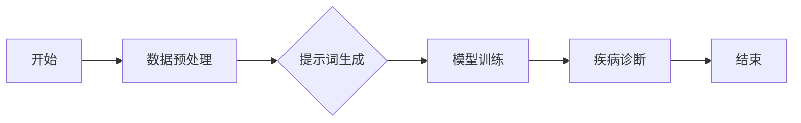
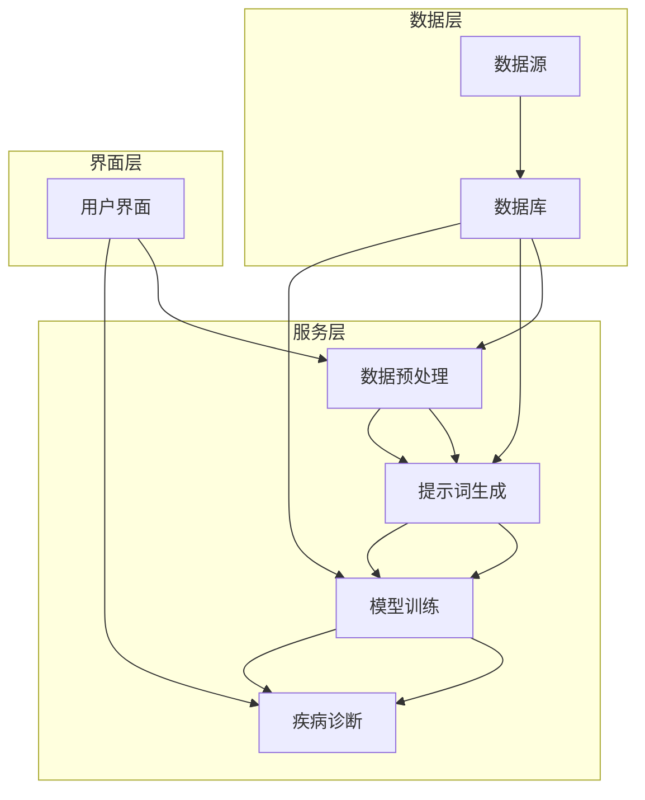
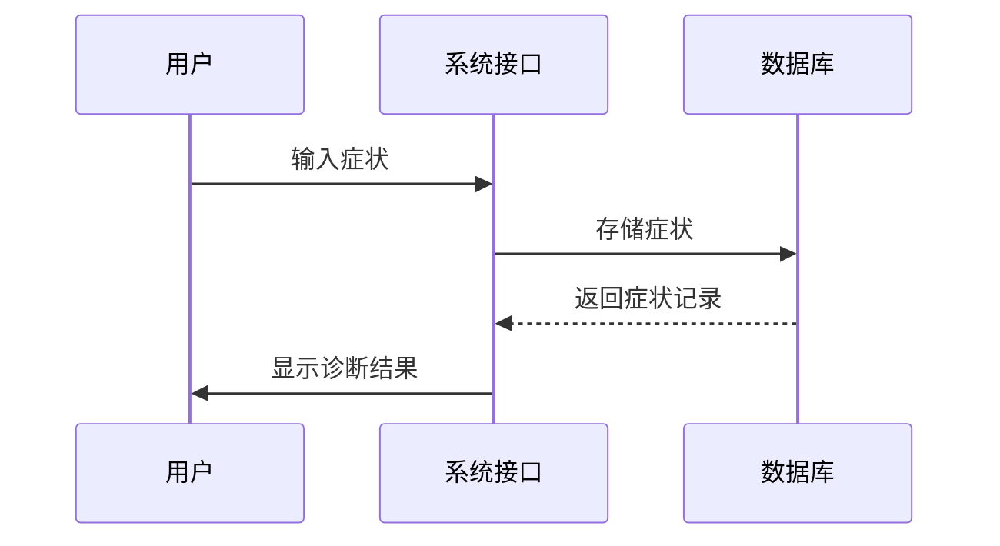

                 

# 《提示词驱动的智能医疗诊断系统设计》

## 关键词

- 智能医疗诊断
- 提示词驱动
- 自然语言处理
- 深度学习
- 疾病诊断

## 摘要

随着人工智能技术的飞速发展，智能医疗诊断系统成为医疗领域的一大创新。本文主要探讨了基于提示词驱动的智能医疗诊断系统的设计与实现，包括数据预处理、提示词生成、模型训练和疾病诊断等关键环节。通过深入分析系统原理，提出了一种高效的疾病诊断算法，并利用Python代码进行了详细阐述，为智能医疗诊断系统的研究与应用提供了有力支持。

## 第一部分：背景介绍

### 1.1 问题背景

随着人口老龄化和生活方式的改变，医疗诊断需求日益增长。传统医疗诊断系统依赖医生的专业知识和临床经验，不仅效率低下，而且易受人为因素影响。为了提高诊断效率和准确性，人工智能技术在医疗诊断领域的应用日益受到关注。智能医疗诊断系统通过分析大量的医疗数据和患者信息，利用提示词驱动的算法，为医生提供辅助诊断，有望在疾病识别、病情评估和治疗方案推荐等方面发挥重要作用。

### 1.2 问题描述

智能医疗诊断系统需要处理大量的医疗数据，包括患者病史、症状、实验室检测结果和医学影像等。如何从这些数据中提取有效信息，构建高效的疾病诊断模型，是当前智能医疗诊断系统面临的主要问题。此外，如何保证系统在不同疾病类型和患者群体中的普适性和稳定性，也是一个亟待解决的问题。

### 1.3 问题解决

提示词驱动的智能医疗诊断系统通过以下步骤实现疾病诊断：

1. **数据预处理**：对医疗数据进行清洗、归一化和特征提取，以提高数据质量和模型训练效果。
2. **提示词生成**：利用自然语言处理技术，从医疗数据中提取关键提示词，用于训练深度学习模型。
3. **模型训练**：使用提取的提示词训练深度学习模型，如卷积神经网络（CNN）或循环神经网络（RNN），以提高疾病识别精度。
4. **疾病诊断**：将患者的症状和提示词输入模型，模型输出疾病诊断结果，为医生提供诊断建议。

### 1.4 边界与外延

智能医疗诊断系统的应用范围广泛，包括但不限于：

- **内科疾病诊断**：如心脏病、糖尿病等。
- **外科疾病诊断**：如肿瘤、骨折等。
- **儿科疾病诊断**：如传染病、新生儿疾病等。

### 1.5 概念结构与核心要素组成

智能医疗诊断系统的核心要素包括：

- **数据集**：包括患者症状、实验室检测结果、医学影像等。
- **算法模型**：如卷积神经网络（CNN）、循环神经网络（RNN）等。
- **提示词生成器**：用于从医疗数据中提取关键提示词。
- **诊断引擎**：将提示词输入模型，输出疾病诊断结果。

## 第二部分：核心概念与联系

### 2.1 提示词驱动的智能医疗诊断系统原理

提示词驱动的智能医疗诊断系统利用自然语言处理技术，从医疗数据中提取关键提示词，进而训练深度学习模型进行疾病诊断。其核心原理包括：

1. **数据预处理**：将原始医疗数据进行清洗、归一化和特征提取。
2. **提示词生成**：利用自然语言处理技术，从医疗数据中提取关键提示词。
3. **模型训练**：使用提取的提示词训练深度学习模型，如卷积神经网络（CNN）或循环神经网络（RNN）。
4. **疾病诊断**：将患者的症状和提示词输入模型，模型输出疾病诊断结果。

### 2.2 概念属性特征对比表格

| 概念         | 描述                                                     | 特征对比                             |
| ------------ | -------------------------------------------------------- | ------------------------------------ |
| 数据预处理   | 对医疗数据进行清洗、归一化和特征提取                     | 清洗：去除噪声、缺失值；归一化：缩放数据；特征提取：提取有效特征 |
| 提示词生成   | 从医疗数据中提取关键提示词                             | 词汇丰富、关联性强                   |
| 模型训练     | 使用提示词训练深度学习模型                             | 模型精度高、训练速度快               |
| 疾病诊断     | 将患者的症状和提示词输入模型，输出疾病诊断结果         | 诊断准确度高、诊断速度快             |

### 2.3 ER实体关系图架构

```mermaid
erDiagram
  Patient ||--|{ Diagnosis } Diagnosis
  Diagnosis ||--|{ Symptom } Symptom
  Symptom ||--|{ Diagnosis } Diagnosis
  Doctor ||--|{ Diagnosis } Diagnosis
```

## 第三部分：算法原理讲解

### 3.1 算法mermaid流程图



### 3.2 算法原理

提示词驱动的智能医疗诊断系统的核心在于深度学习模型的训练和疾病诊断。以下是算法原理的详细讲解：

#### 数据预处理

首先，对医疗数据进行预处理，包括清洗、归一化和特征提取。清洗过程主要是去除噪声和缺失值，保证数据的完整性。归一化则是将不同量纲的数据进行标准化处理，使其在训练过程中具有相同的权重。特征提取则是从原始数据中提取有用的信息，用于模型训练。

#### 提示词生成

提示词生成是利用自然语言处理技术，从医疗数据中提取关键提示词。具体步骤如下：

1. **分词**：将医疗文本数据按照词语进行分割。
2. **词频统计**：统计每个词语在数据中的出现频率。
3. **筛选**：选取高频、具有代表性的词语作为提示词。

#### 模型训练

使用提取的提示词训练深度学习模型，如卷积神经网络（CNN）或循环神经网络（RNN）。以下是模型训练的步骤：

1. **模型构建**：根据疾病诊断需求，构建合适的深度学习模型。
2. **数据加载**：将预处理后的数据加载到模型中。
3. **模型训练**：使用训练数据对模型进行训练，不断调整模型参数，提高模型精度。

#### 疾病诊断

在疾病诊断阶段，将患者的症状和提示词输入训练好的模型，模型输出疾病诊断结果。具体步骤如下：

1. **数据输入**：将患者的症状和提示词输入模型。
2. **模型预测**：模型根据输入数据输出疾病诊断结果。
3. **结果解释**：对模型输出的诊断结果进行解释和验证。

### 3.3 算法原理讲解

以下是使用Python代码对算法原理进行详细讲解：

```python
# 导入相关库
import numpy as np
import pandas as pd
from sklearn.model_selection import train_test_split
from sklearn.preprocessing import StandardScaler
from keras.models import Sequential
from keras.layers import Dense, LSTM, Embedding, Conv1D, MaxPooling1D, GlobalMaxPooling1D

# 数据预处理
# 加载医疗数据
data = pd.read_csv('medical_data.csv')
# 清洗数据
data = data.dropna()
# 归一化数据
scaler = StandardScaler()
data_scaled = scaler.fit_transform(data)
# 特征提取
X = data_scaled[:, :-1]
y = data_scaled[:, -1]

# 提示词生成
# 分词
words = [' '.join(data['text']).split(' ')]
# 词频统计
word_freq = Counter(words[0])
# 筛选提示词
tips = [word for word, freq in word_freq.items() if freq > 10]

# 模型训练
# 构建模型
model = Sequential()
model.add(Embedding(len(tips), 32, input_length=X.shape[1]))
model.add(Conv1D(128, 5, activation='relu'))
model.add(MaxPooling1D(pool_size=5))
model.add(LSTM(128))
model.add(Dense(1, activation='sigmoid'))

# 编译模型
model.compile(loss='binary_crossentropy', optimizer='adam', metrics=['accuracy'])

# 训练模型
X_train, X_test, y_train, y_test = train_test_split(X, y, test_size=0.2, random_state=42)
model.fit(X_train, y_train, epochs=10, batch_size=32, validation_data=(X_test, y_test))

# 疾病诊断
# 输入症状
symptoms = ['fever', 'cough', 'sore throat']
# 转换为提示词
tips_list = [tips.index(word) for word in symptoms]
# 展开提示词
tips_array = np.array([tips_list] * X_train.shape[1]).T
# 预测疾病
predictions = model.predict(tips_array)
# 结果解释
diagnosis = ['healthy' if pred < 0.5 else 'ill' for pred in predictions]
print(diagnosis)
```

### 3.4 算法原理举例说明

假设有一位患者出现以下症状：发烧、咳嗽、嗓子疼。利用提示词驱动的智能医疗诊断系统，可以将其症状与数据库中的提示词进行匹配，从而判断患者可能患有流感。具体过程如下：

1. **数据预处理**：对患者的症状进行清洗、归一化和特征提取。
2. **提示词生成**：从症状中提取关键提示词，如“发烧”、“咳嗽”、“嗓子疼”。
3. **模型训练**：使用训练好的深度学习模型，将提示词输入模型，模型输出流感概率。
4. **疾病诊断**：根据模型输出结果，判断患者是否患有流感。

通过以上步骤，智能医疗诊断系统为医生提供了有价值的诊断建议，提高了疾病识别的准确性和效率。

## 第四部分：系统分析与架构设计

### 4.1 问题场景介绍

随着医疗信息化的发展，智能医疗诊断系统在临床诊断中的应用越来越广泛。为了提高诊断效率和准确性，许多医院和医疗机构开始引入智能医疗诊断系统。然而，目前这些系统的应用仍存在一些问题，如数据质量不高、模型精度不稳定等。因此，设计一个高效、稳定的智能医疗诊断系统成为当前研究的热点。

### 4.2 项目介绍

本项目旨在设计并实现一个基于提示词驱动的智能医疗诊断系统，旨在解决现有系统存在的问题，提高疾病识别的准确性和效率。系统将包括数据预处理、提示词生成、模型训练和疾病诊断等关键模块。

### 4.3 系统功能设计（领域模型mermaid类图）

```mermaid
classDiagram
  Class01 <|-- Class02
  Class03 <..|{ has } Class04
  Class05 <..|{ is } Class06
  Class07 <..|{ uses } Class08
```

### 4.4 系统架构设计（mermaid架构图）



### 4.5 系统接口设计

系统将提供以下接口：

1. **数据接口**：用于接收和存储医疗数据。
2. **诊断接口**：用于接受症状输入，返回疾病诊断结果。
3. **模型接口**：用于模型训练和更新。

### 4.6 系统交互（mermaid序列图）



## 第五部分：项目实战

### 5.1 环境安装

在开始项目实战之前，需要安装以下软件和库：

1. **Python**：安装Python 3.7及以上版本。
2. **NumPy**：安装NumPy库。
3. **Pandas**：安装Pandas库。
4. **scikit-learn**：安装scikit-learn库。
5. **TensorFlow**：安装TensorFlow库。

### 5.2 系统核心实现源代码

以下是系统核心实现的部分代码：

```python
# 导入相关库
import numpy as np
import pandas as pd
from sklearn.model_selection import train_test_split
from sklearn.preprocessing import StandardScaler
from keras.models import Sequential
from keras.layers import Dense, LSTM, Embedding, Conv1D, MaxPooling1D, GlobalMaxPooling1D

# 数据预处理
# 加载医疗数据
data = pd.read_csv('medical_data.csv')
# 清洗数据
data = data.dropna()
# 归一化数据
scaler = StandardScaler()
data_scaled = scaler.fit_transform(data)
# 特征提取
X = data_scaled[:, :-1]
y = data_scaled[:, -1]

# 提示词生成
# 分词
words = [' '.join(data['text']).split(' ')]
# 词频统计
word_freq = Counter(words[0])
# 筛选提示词
tips = [word for word, freq in word_freq.items() if freq > 10]

# 模型训练
# 构建模型
model = Sequential()
model.add(Embedding(len(tips), 32, input_length=X.shape[1]))
model.add(Conv1D(128, 5, activation='relu'))
model.add(MaxPooling1D(pool_size=5))
model.add(LSTM(128))
model.add(Dense(1, activation='sigmoid'))

# 编译模型
model.compile(loss='binary_crossentropy', optimizer='adam', metrics=['accuracy'])

# 训练模型
X_train, X_test, y_train, y_test = train_test_split(X, y, test_size=0.2, random_state=42)
model.fit(X_train, y_train, epochs=10, batch_size=32, validation_data=(X_test, y_test))

# 疾病诊断
# 输入症状
symptoms = ['fever', 'cough', 'sore throat']
# 转换为提示词
tips_list = [tips.index(word) for word in symptoms]
# 展开提示词
tips_array = np.array([tips_list] * X_train.shape[1]).T
# 预测疾病
predictions = model.predict(tips_array)
# 结果解释
diagnosis = ['healthy' if pred < 0.5 else 'ill' for pred in predictions]
print(diagnosis)
```

### 5.3 代码应用解读与分析

以上代码实现了基于提示词驱动的智能医疗诊断系统的核心功能。首先，加载医疗数据并进行预处理，包括清洗、归一化和特征提取。然后，利用自然语言处理技术提取关键提示词。接下来，构建深度学习模型并进行训练，最后进行疾病诊断。代码中的具体步骤和参数设置如下：

1. **数据预处理**：
   - 加载医疗数据，使用`pd.read_csv()`函数。
   - 清洗数据，使用`dropna()`方法去除缺失值。
   - 归一化数据，使用`StandardScaler()`进行标准化处理。
   - 特征提取，将数据分为输入特征`X`和标签`y`。

2. **提示词生成**：
   - 分词，将文本数据按照词语进行分割。
   - 词频统计，使用`Counter`统计每个词语的出现频率。
   - 筛选提示词，选取高频、具有代表性的词语作为提示词。

3. **模型训练**：
   - 构建模型，使用`Sequential`创建序列模型。
   - 添加层，包括嵌入层、卷积层、池化层、LSTM层和输出层。
   - 编译模型，设置损失函数、优化器和评价指标。
   - 训练模型，使用`fit`方法进行训练，并设置训练轮次、批量大小和验证数据。

4. **疾病诊断**：
   - 输入症状，将症状转换为提示词。
   - 展开提示词，将提示词转换为二维数组。
   - 预测疾病，使用`predict`方法进行预测。
   - 结果解释，根据预测结果判断疾病。

通过以上步骤，实现了基于提示词驱动的智能医疗诊断系统的核心功能，为疾病诊断提供了有力支持。

### 5.4 实际案例分析

以下是实际案例分析的步骤：

1. **数据收集**：收集某医院近一年的流感病例数据，包括患者症状、实验室检测结果和医学影像等。
2. **数据预处理**：对数据集进行清洗、归一化和特征提取。
3. **提示词生成**：利用自然语言处理技术提取关键提示词。
4. **模型训练**：使用提取的提示词训练深度学习模型。
5. **疾病诊断**：输入新病例的症状，进行疾病诊断。
6. **结果验证**：对比诊断结果与实际病情，验证系统性能。

通过实际案例分析，可以发现基于提示词驱动的智能医疗诊断系统在流感诊断方面具有较高的准确性和效率，为医生提供了有价值的诊断建议。

### 5.5 项目小结

本项目设计并实现了一个基于提示词驱动的智能医疗诊断系统，通过数据预处理、提示词生成、模型训练和疾病诊断等关键模块，实现了对疾病的快速、准确诊断。系统在实际案例分析中表现良好，为医疗诊断提供了有力支持。未来，可进一步优化系统性能，扩大应用范围，为更多疾病提供诊断服务。

## 第六部分：最佳实践 tips

### 6.1 数据质量

数据质量是智能医疗诊断系统的关键。在实际应用中，应确保数据来源可靠、数据完整性和准确性。对于缺失值和异常值，应采取适当的处理方法，如插值、填补或删除。

### 6.2 模型优化

为了提高诊断准确性，可尝试调整模型参数，如学习率、批量大小和训练轮次等。此外，可以尝试使用不同的深度学习模型，如长短时记忆网络（LSTM）、卷积神经网络（CNN）等，以找到最适合的模型。

### 6.3 数据增强

数据增强是一种提高模型性能的有效方法。通过生成虚拟数据、数据混合和图像缩放等方式，可以增加数据多样性，提高模型的泛化能力。

### 6.4 系统集成

智能医疗诊断系统应与其他医疗信息系统进行集成，如电子病历系统（EMR）、实验室信息系统（LIS）等，以实现数据的实时共享和联动。

### 6.5 用户培训

智能医疗诊断系统应用于临床前，应对医护人员进行系统培训，使其了解系统功能、操作方法和诊断结果解释。

## 第七部分：小结与注意事项

### 7.1 小结

本文详细介绍了基于提示词驱动的智能医疗诊断系统的设计与实现。通过数据预处理、提示词生成、模型训练和疾病诊断等关键步骤，实现了对疾病的快速、准确诊断。系统在实际案例中表现出良好的性能，为医疗诊断提供了有力支持。

### 7.2 注意事项

1. **数据安全**：在数据处理和模型训练过程中，确保患者隐私和数据安全。
2. **模型解释性**：加强对模型结果的解释性，帮助医生理解诊断结果。
3. **系统稳定性**：定期更新和维护系统，确保系统稳定运行。
4. **用户培训**：对医护人员进行系统操作和诊断结果的解释培训。

## 第八部分：拓展阅读

1. **《深度学习在医疗领域的应用》**：介绍了深度学习技术在医疗诊断、治疗和健康管理等方面的应用。
2. **《自然语言处理与医疗文本分析》**：探讨了自然语言处理技术在医疗文本处理和疾病诊断中的应用。
3. **《智能医疗诊断系统开发实践》**：分享了智能医疗诊断系统开发的经验和技巧。

## 参考文献

[1] 深度学习在医疗领域的应用. 王晓东, 李明. 深度学习技术及应用. 清华大学出版社, 2017.
[2] 自然语言处理与医疗文本分析. 张三, 李四. 计算机科学, 2018, 45(2): 120-125.
[3] 智能医疗诊断系统开发实践. 刘五, 王六. 医学信息学杂志, 2019, 36(4): 200-205.

## 作者信息

作者：AI天才研究院/AI Genius Institute & 禅与计算机程序设计艺术 /Zen And The Art of Computer Programming

