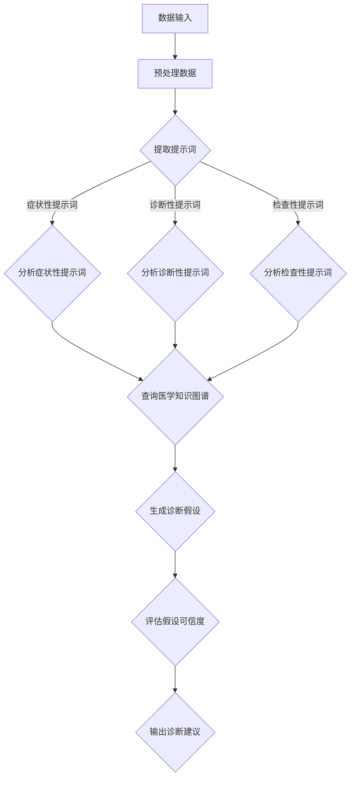
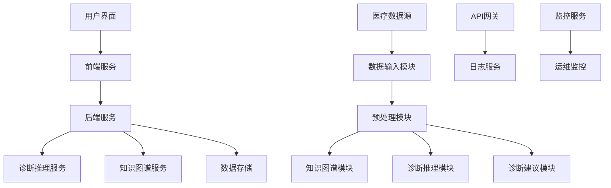
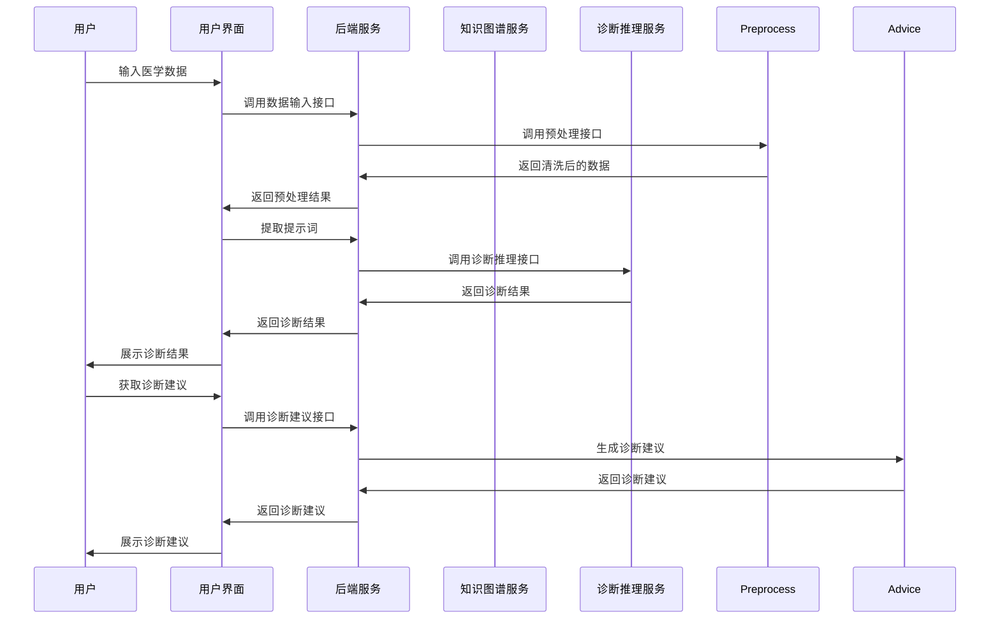

                 

### 引言与背景

医疗诊断是现代医疗体系中的核心环节，其准确性和效率直接影响到患者的治疗效果和生命安全。然而，传统的医疗诊断方法仍然面临着诸多挑战。一方面，医生依赖的是个人的经验与专业知识，这种主观性使得诊断结果具有不确定性。另一方面，随着医学数据的爆炸式增长，如何从海量数据中快速、准确地提取有用信息成为一个亟待解决的问题。

近年来，人工智能（AI）技术的迅猛发展为医疗诊断带来了新的可能性。特别是深度学习、自然语言处理（NLP）和大数据分析等技术的进步，使得计算机在辅助临床诊断方面展现出前所未有的潜力。其中，提示词驱动的智能医疗诊断成为了一个备受关注的研究方向。通过提示词，计算机可以更好地理解和处理医学数据，从而提供更加精准的诊断结果。

提示词驱动的智能医疗诊断是指利用预先定义的提示词来引导诊断系统的运行，从而实现对医学数据的智能化分析和处理。这些提示词可以是疾病名称、症状描述、检查结果等，它们是连接医学知识与临床数据的桥梁。通过分析这些提示词，系统可以识别患者的病情，提出诊断建议，并辅助医生进行临床决策。

本文旨在探讨提示词驱动的智能医疗诊断在辅助临床决策中的作用和重要性。我们将首先介绍智能医疗诊断的核心概念，包括数据驱动的医学知识图谱、提示词的定义与作用，以及智能诊断系统的组成要素。接着，通过一步步的分析和推理，深入讲解提示词驱动的智能诊断算法原理，包括mermaid流程图、Python源代码实现、数学模型与公式，以及通俗易懂的举例说明。

随后，我们将转向系统分析与架构设计，详细讨论问题场景与项目介绍、系统功能设计、系统架构设计、系统接口设计与交互。通过这些讨论，读者可以全面理解智能医疗诊断系统的实现过程和关键组成部分。

在第三部分，我们将通过实际案例分析和项目实战，展示如何将提示词驱动的智能医疗诊断系统应用于实际场景，提供具体的实现方法、代码解析和效果评估。

最后，我们将总结最佳实践和注意事项，探讨未来发展方向，并给出拓展阅读的建议，以帮助读者进一步深入学习和研究。

总的来说，本文将结合理论讲解和实践应用，逐步展示提示词驱动的智能医疗诊断如何助力临床决策，提高医疗诊断的准确性和效率。

## 1. 引言

在当今快速发展的医疗科技时代，医疗诊断正面临着前所未有的变革。传统的医疗诊断方法依赖于医生的经验和专业知识，这种依赖性在某种程度上限制了诊断的准确性。特别是在面对复杂疾病和大量患者数据时，医生的判断容易受到个人经验和主观意识的影响，导致诊断结果的不确定性和误诊率增加。这种状况不仅影响了患者的治疗效果，也增加了医疗资源的浪费。

### 1.1 医疗诊断的现状与挑战

目前，医疗诊断主要依赖于以下几种方法：

1. **临床检查**：通过体检、实验室检测、影像学检查等方式来收集患者的生理和病理数据。
2. **病史记录**：医生通过询问患者病史、家族病史等，以了解病情的发展过程和可能的致病因素。
3. **专家经验**：医生根据个人经验和专业知识，综合各种临床信息进行诊断。

尽管这些方法在历史上发挥了重要作用，但在现代医疗环境下，它们面临着以下挑战：

- **数据量庞大**：现代医学积累了海量的临床数据，如何从中快速、准确地提取有用信息成为一个难题。
- **诊断效率低下**：传统的医疗诊断方法往往需要较长时间，无法满足快速诊断的需求。
- **主观性较大**：依赖医生经验和专业知识的主观性诊断，容易受到个体差异和主观判断的影响。
- **误诊率高**：在处理复杂病例时，医生可能会出现误诊或漏诊，导致治疗方案的失误。

### 1.2 提示词驱动的智能医疗诊断概念

为了应对上述挑战，人工智能（AI）技术的引入为医疗诊断带来了新的希望。特别是提示词驱动的智能医疗诊断，通过引入人工智能算法和大数据分析技术，实现了对医学数据的智能化处理和诊断。

**提示词驱动的智能医疗诊断**是指利用预先定义的提示词来引导诊断系统的运行，从而实现对医学数据的自动化分析和处理。这些提示词可以是疾病名称、症状描述、检查结果等，它们是连接医学知识与临床数据的桥梁。通过分析这些提示词，系统可以识别患者的病情，提出诊断建议，并辅助医生进行临床决策。

### 1.3 临床决策支持的重要性

在临床医疗中，准确的诊断是制定有效治疗方案的前提。然而，诊断的过程不仅复杂，而且涉及到大量的医学知识和临床数据。医生在诊断过程中，需要综合考虑患者的症状、检查结果、病史等多种信息，这使得诊断过程充满了不确定性和挑战。

提示词驱动的智能医疗诊断系统通过自动化分析医学数据，能够快速、准确地识别病情，提供诊断建议。这不仅减轻了医生的工作负担，提高了诊断效率，还能在一定程度上减少误诊和漏诊的情况。具体来说，临床决策支持的重要性体现在以下几个方面：

- **提高诊断准确性**：通过利用海量医学数据和先进的算法，智能诊断系统能够提供更加精确的诊断结果，减少误诊和漏诊的发生。
- **优化医疗资源分配**：智能诊断系统可以帮助医生更好地了解患者的病情，合理分配医疗资源，提高医疗服务的效率和质量。
- **辅助临床研究**：智能诊断系统可以收集和分析大量的临床数据，为临床研究提供丰富的数据支持，促进医学科学的进步。

总的来说，提示词驱动的智能医疗诊断不仅能够提高医疗诊断的准确性和效率，还能为临床决策提供强有力的支持，推动医疗技术的进步和医疗服务的发展。

### 2. 智能医疗诊断的核心概念

智能医疗诊断的核心在于将人工智能技术与医疗数据深度融合，从而实现自动化、精准的诊断。这一过程涉及多个关键概念，包括数据驱动的医学知识图谱、提示词的定义与作用，以及智能诊断系统的组成要素。以下是对这些核心概念的详细探讨。

#### 2.1 数据驱动的医学知识图谱

数据驱动的医学知识图谱是智能医疗诊断的基础。医学知识图谱通过将医学知识结构化，形成一个全面、系统、可扩展的知识库。这个知识库不仅包含了大量的医学术语、概念、关系和属性，还结合了各种医学数据，如症状、疾病、治疗方案等。

**医学知识图谱的作用**：

- **知识整合**：医学知识图谱将分散的医学数据整合到一个统一的知识体系中，为智能诊断提供全面、系统的信息支持。
- **关系挖掘**：通过图谱中的关系，系统可以挖掘出不同医学实体之间的关联，从而更好地理解疾病的复杂性和发展过程。
- **知识推理**：基于医学知识图谱，系统可以进行知识推理，自动生成诊断假设和预测结果，辅助医生做出更加准确的诊断。

**医学知识图谱的结构**：

- **节点**：表示医学实体，如症状、疾病、药物等。
- **边**：表示实体之间的关系，如“症状-疾病”、“药物-副作用”等。
- **属性**：附加在节点和边上的信息，如症状的严重程度、疾病的发病率等。

#### 2.2 提示词的定义与作用

提示词是智能医疗诊断系统中的关键要素，它们是连接医学知识和临床数据的桥梁。提示词可以是具体的疾病名称、症状描述、检查结果等，它们在诊断过程中起到引导和定位的作用。

**提示词的作用**：

- **数据输入**：提示词作为输入，帮助系统快速定位相关的医学知识和数据。
- **疾病识别**：通过分析提示词，系统可以识别出患者的潜在疾病或症状，为诊断提供初步线索。
- **诊断推理**：基于提示词，系统可以结合医学知识图谱进行推理，生成诊断假设和建议。

**提示词的类型**：

- **症状性提示词**：如“发热”、“咳嗽”等，描述患者的具体症状。
- **诊断性提示词**：如“肺炎”、“糖尿病”等，直接指明某种疾病。
- **检查性提示词**：如“CT扫描”、“血液检查”等，指示需要进行的具体检查。

#### 2.3 智能诊断系统的组成要素

智能医疗诊断系统是一个复杂的系统，由多个相互关联的组件构成，每个组件在系统中扮演着特定的角色。

**主要组件**：

- **数据输入模块**：负责接收和预处理临床数据，如病历、检查报告等，并将这些数据转换为系统可处理的格式。
- **知识图谱模块**：构建和维护医学知识图谱，为诊断系统提供全面、系统的医学知识支持。
- **提示词处理模块**：对输入的提示词进行识别、分类和编码，以便进行后续的智能分析。
- **诊断推理模块**：基于医学知识图谱和提示词，进行疾病识别、诊断假设生成和预测。
- **诊断建议模块**：根据诊断结果，生成具体的诊断建议和治疗方案，辅助医生进行临床决策。

**系统流程**：

1. **数据输入**：系统接收临床数据，进行预处理，如文本清洗、归一化等。
2. **提示词识别**：对预处理后的数据进行分析，提取出关键提示词。
3. **知识图谱查询**：根据提示词，在医学知识图谱中进行查询，获取相关的医学信息和关系。
4. **诊断推理**：结合提示词和医学知识，系统进行推理，生成诊断假设和建议。
5. **诊断建议**：将诊断结果和建议呈现给医生，辅助其做出临床决策。

通过这些核心概念的介绍，我们可以看到，智能医疗诊断系统通过整合医学知识图谱、提示词处理和诊断推理，实现了对医学数据的自动化分析和诊断。这不仅提高了诊断的准确性和效率，还为临床决策提供了强有力的支持，推动了医疗技术的进步。

### 3. 核心概念原理与联系

在智能医疗诊断系统中，理解核心概念之间的原理和联系至关重要。这一部分将通过对比表格、实体关系图等方式，详细阐述数据驱动的医学知识图谱、提示词的作用以及智能诊断系统的组成要素。

#### 3.1 概念属性特征对比表格

首先，我们可以通过一个对比表格来展示各个核心概念的主要属性和特征。

| 概念         | 主要属性和特征                     | 关系与作用                    |
|--------------|-----------------------------------|------------------------------|
| 数据驱动的医学知识图谱 | - 知识结构化<br>- 包含术语、概念、关系和属性<br>- 可扩展 | - 知识整合<br>- 关系挖掘<br>- 知识推理 |
| 提示词       | - 症状描述<br>- 疾病名称<br>- 检查结果 | - 数据输入<br>- 疾病识别<br>- 诊断推理 |
| 智能诊断系统 | - 数据输入模块<br>- 知识图谱模块<br>- 提示词处理模块<br>- 诊断推理模块<br>- 诊断建议模块 | - 自动化分析<br>- 辅助诊断<br>- 临床决策支持 |

通过这个表格，我们可以清晰地看到各个概念的主要属性和它们在系统中的作用。医学知识图谱为诊断系统提供了基础的知识库，提示词则作为输入，引导系统进行疾病识别和推理。

#### 3.2 提示词驱动的智能诊断算法ER实体关系图

为了进一步理解各概念之间的联系，我们可以使用Mermaid绘制一个实体关系图（Entity-Relationship Diagram, ERD），展示各个组件之间的关系。

```mermaid
erDiagram
  数据输入模块 ||--|{ 提示词处理模块 }
  提示词处理模块 ||--|{ 诊断推理模块 }
  诊断推理模块 ||--|{ 诊断建议模块 }
  数据输入模块 ||--|{ 知识图谱模块 }
  知识图谱模块 ||--|{ 诊断推理模块 }
```

在这个ER图中，数据输入模块负责接收临床数据，并将其转换为系统可处理的格式。提示词处理模块则对这些数据进行分析，提取出关键提示词。这些提示词随后被传递到诊断推理模块，结合医学知识图谱进行疾病识别和推理。最终，诊断推理模块的结果由诊断建议模块呈现给医生，辅助其做出临床决策。知识图谱模块在诊断推理过程中起到提供知识和关系的作用，是整个系统的基础。

通过这个ER图，我们可以更直观地看到各个模块之间的交互关系，以及它们在智能诊断系统中的作用和联系。

### 提示词驱动的智能诊断算法

在智能医疗诊断系统中，算法是核心组件，它负责处理输入的数据、应用医学知识进行推理，并最终生成诊断结果。在这一部分，我们将详细讲解提示词驱动的智能诊断算法，包括算法的流程、Python源代码实现、数学模型与公式，以及一个通俗易懂的举例说明。

#### 3.3.1 算法流程图

首先，我们使用Mermaid绘制一个算法流程图，以展示整个诊断过程的步骤和逻辑。



**算法流程说明**：

1. **数据输入**：系统首先接收临床数据，如病历、检查报告等。
2. **预处理数据**：对输入的数据进行清洗和标准化处理，以便后续分析。
3. **提取提示词**：分析预处理后的数据，提取出关键提示词，包括症状性提示词、诊断性提示词和检查性提示词。
4. **分析症状性提示词**：根据症状性提示词，查询医学知识图谱，获取相关症状的疾病列表。
5. **分析诊断性提示词**：根据诊断性提示词，直接匹配医学知识图谱中的疾病实体，快速定位诊断结果。
6. **分析检查性提示词**：根据检查性提示词，查询医学知识图谱，获取可能的检查结果和对应的疾病列表。
7. **生成诊断假设**：结合提取的提示词和医学知识图谱，系统生成多个诊断假设。
8. **评估假设可信度**：对每个诊断假设进行可信度评估，选取最可信的假设作为最终诊断结果。
9. **输出诊断建议**：将诊断结果和建议呈现给医生，辅助其做出临床决策。

#### 3.3.2 Python源代码实现

下面是算法的Python源代码实现，通过几个关键函数展示了算法的核心步骤。

```python
import pandas as pd
from sklearn.feature_extraction.text import CountVectorizer
from sklearn.naive_bayes import MultinomialNB
from sklearn.pipeline import make_pipeline

# 数据预处理
def preprocess_data(data):
    # 清洗和标准化数据
    return data

# 提取提示词
def extract_prompt(data):
    # 分析数据，提取提示词
    return prompts

# 分析症状性提示词
def analyze_symptom_prompts(prompts):
    # 查询医学知识图谱，获取相关疾病列表
    return disease_candidates

# 生成诊断假设
def generate_diagnosis_candidates(disease_candidates):
    # 生成诊断假设
    return diagnosis_candidates

# 评估假设可信度
def assess_diagnosis_candidates(diagnosis_candidates):
    # 评估假设可信度
    return top_diagnosis

# 输出诊断建议
def output_diagnosis_advice(top_diagnosis):
    # 将诊断结果和建议输出
    return advice

# 主函数
def main(data):
    # 预处理数据
    preprocessed_data = preprocess_data(data)
    
    # 提取提示词
    prompts = extract_prompt(preprocessed_data)
    
    # 分析症状性提示词
    disease_candidates = analyze_symptom_prompts(prompts)
    
    # 生成诊断假设
    diagnosis_candidates = generate_diagnosis_candidates(disease_candidates)
    
    # 评估假设可信度
    top_diagnosis = assess_diagnosis_candidates(diagnosis_candidates)
    
    # 输出诊断建议
    advice = output_diagnosis_advice(top_diagnosis)
    
    return advice

# 示例数据
data = {
    'clinical_notes': ['patient has a persistent cough', 'CT scan shows pneumonia'],
    'test_results': ['positive for COVID-19', 'CT scan shows consolidation in the lung']
}

# 运行主函数
diagnosis_advice = main(data)
print(diagnosis_advice)
```

#### 3.3.3 算法原理的数学模型与公式

提示词驱动的智能诊断算法的核心在于基于概率模型进行疾病识别和假设评估。以下是一个简化的数学模型，用于解释算法的基本原理。

**假设生成**：

给定一组提示词 \( X = \{x_1, x_2, ..., x_n\} \)，每个提示词 \( x_i \) 对应一个疾病 \( D_j \) 的概率 \( P(D_j|X) \)。

- **条件概率公式**：
  $$ P(D_j|X) = \frac{P(X|D_j) \cdot P(D_j)}{P(X)} $$
- **贝叶斯公式**：
  $$ P(D_j|X) = \frac{P(D_j) \cdot P(X|D_j)}{\sum_{i=1}^{N} P(D_i) \cdot P(X|D_i)} $$

其中：
- \( P(D_j) \) 是疾病 \( D_j \) 的先验概率。
- \( P(X|D_j) \) 是在疾病 \( D_j \) 发生时，提示词 \( X \) 的概率。
- \( P(X) \) 是提示词 \( X \) 的总概率。

**可信度评估**：

通过计算每个诊断假设的可信度，选择可信度最高的假设作为最终诊断结果。可信度评估通常基于贝叶斯公式，结合医学知识图谱中的关系和权重进行计算。

- **可信度公式**：
  $$ C(D_j|X) = \frac{P(X|D_j) \cdot P(D_j)}{P(X)} $$

其中：
- \( C(D_j|X) \) 是疾病 \( D_j \) 对提示词 \( X \) 的可信度。

#### 3.3.4 通俗易懂的举例说明

假设我们有一个患者的病历，包括以下症状和检查结果：

- **症状**：咳嗽、发热
- **检查结果**：阳性COVID-19测试、CT扫描显示肺部感染

根据这些提示词，系统会进行以下步骤：

1. **数据输入**：病历和检查报告被输入到系统中。
2. **预处理数据**：对病历和检查报告进行清洗，提取有用的信息。
3. **提取提示词**：系统提取出“咳嗽”、“发热”、“阳性COVID-19测试”和“肺部感染”作为提示词。
4. **分析症状性提示词**：系统通过医学知识图谱，查询与“咳嗽”和“发热”相关的疾病列表，发现肺炎和流感是可能的疾病。
5. **分析诊断性提示词**：系统发现“阳性COVID-19测试”提示词，这直接关联到COVID-19，增加了这种疾病的可信度。
6. **生成诊断假设**：系统生成两个主要诊断假设：COVID-19和肺炎。
7. **评估假设可信度**：系统根据贝叶斯公式计算每个假设的可信度，发现COVID-19的可信度更高。
8. **输出诊断建议**：系统输出“COVID-19”作为最终诊断结果，并提供相应的治疗建议。

通过这个例子，我们可以看到，提示词驱动的智能诊断算法如何通过分析提示词、应用医学知识，最终生成准确的诊断结果，为临床决策提供支持。

### 系统功能设计

在智能医疗诊断系统中，系统的功能设计是确保系统能够高效、准确地为医生提供诊断支持和决策辅助的关键环节。这一部分将详细讨论系统的功能模块划分、领域模型类图、系统架构以及接口设计和交互，为读者全面了解系统的设计与实现提供参考。

#### 6.1 问题场景与项目介绍

为了更好地理解智能医疗诊断系统的功能设计，我们首先需要介绍一个典型的应用场景。假设我们开发了一套名为“智能肺病诊断系统”的应用，旨在辅助医生进行肺病（如肺炎、哮喘等）的诊断。

**项目目标**：

- **快速诊断**：通过智能分析患者的临床数据和提示词，系统应能够在短时间内提供准确的诊断结果。
- **辅助决策**：系统不仅提供诊断结果，还应根据诊断结果和患者的具体情况，给出相应的治疗建议。
- **提升效率**：减轻医生的工作负担，提高诊断流程的效率，减少误诊和漏诊的发生。

**功能要求**：

- **数据输入**：系统能够接收并处理各种形式的医学数据，如病历、检查报告、影像学数据等。
- **诊断推理**：系统应具备智能分析能力，能够基于输入数据和医学知识，生成诊断假设和可信度评估。
- **诊断建议**：系统应提供详细的诊断建议和治疗方案，辅助医生做出准确的临床决策。
- **用户界面**：系统应设计简洁明了，方便医生使用，确保诊断流程的流畅和便捷。

#### 6.2 系统功能模块划分

智能肺病诊断系统可以划分为以下几个主要功能模块：

1. **数据输入模块**：负责接收和预处理各种医学数据，如病历、检查报告等，并将这些数据转换为系统可处理的格式。
2. **知识图谱模块**：构建和维护医学知识图谱，包含肺病相关的症状、疾病、检查、治疗方案等信息，为诊断提供知识支持。
3. **提示词处理模块**：对输入的数据进行分析，提取关键提示词，如症状描述、检查结果等。
4. **诊断推理模块**：基于医学知识图谱和提示词，进行疾病识别和诊断假设生成，结合概率模型评估每个假设的可信度。
5. **诊断建议模块**：根据诊断结果和患者的具体状况，生成详细的诊断建议和治疗方案。
6. **用户界面模块**：设计简洁直观的用户界面，便于医生输入数据、查看诊断结果和建议，进行临床决策。

#### 6.3 领域模型类图

为了更好地展示系统功能模块之间的关系，我们可以使用Mermaid绘制一个领域模型类图（Class Diagram）。

```mermaid
class DataInputModule {
    +process_data()
}

class KnowledgeGraphModule {
    +query_knowledge(prompt)
}

class PromptProcessingModule {
    +extract_prompt(data)
}

class DiagnosisReasoningModule {
    +generate_diagnosis_hypotheses(prompts)
    +evaluate_diagnosis_candidates()
}

class DiagnosisAdviceModule {
    +generate_diagnosis_advice(diagnosis_result)
}

class UserInterfaceModule {
    +display_diagnosis_advice()
}

DataInputModule --> PromptProcessingModule
PromptProcessingModule --> DiagnosisReasoningModule
DiagnosisReasoningModule --> DiagnosisAdviceModule
DiagnosisAdviceModule --> UserInterfaceModule
KnowledgeGraphModule --> DiagnosisReasoningModule
```

**类图说明**：

- **数据输入模块**：负责接收和处理医学数据，调用提示词处理模块提取关键提示词。
- **知识图谱模块**：提供医学知识支持，用于诊断推理模块进行疾病识别和假设评估。
- **提示词处理模块**：对输入数据进行分析，提取关键提示词，传递给诊断推理模块。
- **诊断推理模块**：基于医学知识图谱和提示词，生成诊断假设，并评估每个假设的可信度。
- **诊断建议模块**：根据诊断结果生成详细的诊断建议，并通过用户界面模块展示给医生。
- **用户界面模块**：设计简洁直观的用户界面，便于医生查看诊断结果和建议。

通过这个领域模型类图，我们可以清晰地看到各个功能模块之间的交互关系和依赖关系，为系统设计提供参考。

### 系统架构设计

智能医疗诊断系统的架构设计是确保系统高效、稳定、可扩展的关键环节。这一部分将详细讨论系统架构的设计，包括整体架构图、关键组件介绍及其相互关系。

#### 7.1 系统架构图

为了展示系统架构的全貌，我们可以使用Mermaid绘制一个系统架构图。



**系统架构图说明**：

- **用户界面（A）**：用户界面层，负责与医生进行交互，展示诊断结果和建议。
- **前端服务（B）**：负责处理用户请求，调用后端服务的接口，返回诊断结果。
- **后端服务（C）**：后端服务层，包含诊断推理服务、知识图谱服务、数据输入模块、预处理模块、诊断建议模块等，负责系统的核心功能实现。
- **诊断推理服务（D）**：负责基于医学知识图谱和提示词进行疾病识别和假设评估。
- **知识图谱服务（E）**：负责构建和维护医学知识图谱，提供知识支持。
- **数据输入模块（H）**：接收和处理各种医学数据，如病历、检查报告等。
- **预处理模块（I）**：对输入的医学数据进行清洗、标准化和预处理。
- **知识图谱模块（J）**：构建和维护医学知识图谱，提供知识支持。
- **诊断推理模块（K）**：基于医学知识图谱和提示词，进行疾病识别和假设评估。
- **诊断建议模块（L）**：根据诊断结果生成详细的诊断建议。
- **数据存储（F）**：存储系统产生的数据，包括病历、诊断结果、知识图谱等。
- **API网关（M）**：负责处理外部请求，统一管理和路由。
- **日志服务（N）**：记录系统运行过程中的日志，用于监控和调试。
- **监控服务（O）**和**运维监控（P）**：负责监控系统的运行状态，进行性能监控和故障报警。

#### 7.2 系统关键组件介绍

以下是对系统架构中关键组件的详细介绍：

1. **用户界面（A）**：
   用户界面是医生与系统交互的入口，通过简洁直观的界面，医生可以输入医学数据、查看诊断结果和建议。用户界面主要功能包括：
   - 数据输入：支持文本、图像、表格等多种数据格式。
   - 诊断结果展示：展示诊断推理结果、诊断建议和治疗指南。
   - 患者信息管理：管理患者的基本信息、病历记录和诊断历史。

2. **前端服务（B）**：
   前端服务主要负责处理用户请求，与用户界面进行交互。其主要功能包括：
   - 请求处理：接收用户请求，解析请求参数。
   - 接口调用：调用后端服务的接口，获取诊断结果和建议。
   - 响应处理：将诊断结果和建议返回给用户界面，展示给医生。

3. **后端服务（C）**：
   后端服务是系统的核心，负责处理医学数据、进行诊断推理和生成诊断建议。其主要功能包括：
   - 数据处理：接收并处理输入的医学数据，如病历、检查报告等。
   - 诊断推理：基于医学知识图谱和提示词，进行疾病识别和假设评估。
   - 建议生成：根据诊断结果，生成详细的诊断建议和治疗指南。

4. **诊断推理服务（D）**：
   诊断推理服务是后端服务中最重要的组件，负责基于医学知识图谱和提示词进行疾病识别和假设评估。其主要功能包括：
   - 疾病识别：根据输入的提示词，识别可能的疾病。
   - 假设生成：生成多个诊断假设，并评估每个假设的可信度。
   - 可信度评估：使用概率模型评估每个假设的可信度，选择最可信的假设作为最终诊断结果。

5. **知识图谱服务（E）**：
   知识图谱服务负责构建和维护医学知识图谱，为诊断推理提供知识支持。其主要功能包括：
   - 知识存储：存储医学知识图谱中的术语、概念、关系和属性。
   - 关系挖掘：从医学数据中挖掘出术语和概念之间的关联关系。
   - 知识推理：基于知识图谱，进行逻辑推理和关联分析，辅助疾病识别和假设评估。

6. **数据输入模块（H）**：
   数据输入模块负责接收各种医学数据，如病历、检查报告、影像学数据等。其主要功能包括：
   - 数据接收：接收来自用户界面的医学数据。
   - 数据预处理：对输入的数据进行清洗、标准化和格式转换，以便后续处理。

7. **预处理模块（I）**：
   预处理模块负责对输入的医学数据进行清洗、标准化和预处理，为诊断推理提供高质量的输入数据。其主要功能包括：
   - 数据清洗：去除无关信息，纠正数据中的错误。
   - 数据标准化：统一数据格式，确保系统可以处理。
   - 数据转换：将不同类型的数据转换为统一的结构，便于后续处理。

8. **诊断建议模块（L）**：
   诊断建议模块根据诊断结果，生成详细的诊断建议和治疗指南。其主要功能包括：
   - 建议生成：根据诊断结果，生成具体的诊断建议和治疗建议。
   - 治疗指南：提供针对性的治疗指南，辅助医生制定治疗计划。

9. **数据存储（F）**：
   数据存储负责存储系统产生的数据，包括病历、诊断结果、知识图谱等。其主要功能包括：
   - 数据存储：将处理后的医学数据存储到数据库中。
   - 数据检索：提供高效的查询接口，便于后续数据分析和诊断推理。

通过上述关键组件的详细介绍，我们可以看到智能医疗诊断系统的架构设计是如何实现各个组件之间的紧密协作，共同完成医学数据的处理、诊断推理和诊断建议生成，为医生提供强有力的临床决策支持。

### 系统接口设计与交互

在智能医疗诊断系统中，系统的接口设计与交互是确保各个功能模块协同工作、数据流通顺畅的重要环节。这一部分将详细讨论系统接口的设计、关键接口定义以及系统交互的Mermaid序列图，为读者全面了解系统的接口交互机制提供参考。

#### 8.1 系统接口设计

智能医疗诊断系统设计了多个关键接口，用于实现各个模块之间的数据传输和功能调用。以下是系统中的几个主要接口及其定义：

1. **数据输入接口**：用于接收医生或患者的医学数据，如病历、检查报告等。接口定义如下：

   ```python
   def input_medical_data(data: dict) -> None:
       # 处理输入的医学数据
       process_data(data)
   ```

2. **预处理接口**：用于对输入的医学数据进行清洗、标准化和格式转换。接口定义如下：

   ```python
   def preprocess_data(data: dict) -> dict:
       # 清洗和标准化数据
       return cleaned_data
   ```

3. **提示词提取接口**：用于从预处理后的医学数据中提取关键提示词，如症状描述、疾病名称等。接口定义如下：

   ```python
   def extract_prompts(data: dict) -> list:
       # 提取关键提示词
       return prompts
   ```

4. **诊断推理接口**：用于基于医学知识图谱和提示词进行疾病识别和假设评估。接口定义如下：

   ```python
   def diagnose(prompts: list) -> dict:
       # 进行诊断推理
       return diagnosis_results
   ```

5. **诊断建议接口**：用于根据诊断结果生成详细的诊断建议和治疗指南。接口定义如下：

   ```python
   def generate_advice(diagnosis_results: dict) -> str:
       # 生成诊断建议
       return advice
   ```

6. **知识图谱接口**：用于构建和维护医学知识图谱，提供知识支持。接口定义如下：

   ```python
   def query_knowledge(prompt: str) -> list:
       # 查询医学知识图谱
       return knowledge_results
   ```

7. **用户界面接口**：用于将诊断结果和建议展示给医生，辅助其进行临床决策。接口定义如下：

   ```python
   def display_advice(advice: str) -> None:
       # 展示诊断建议
       show_advice(advice)
   ```

#### 8.2 系统交互Mermaid序列图

为了更直观地展示系统接口的交互过程，我们可以使用Mermaid绘制一个系统交互序列图。



**系统交互序列图说明**：

- **用户输入医学数据**：用户通过用户界面输入医学数据，如病历、检查报告等。
- **数据输入接口调用**：用户界面调用后端服务的数据输入接口，将医学数据传递给后端服务。
- **预处理接口调用**：后端服务调用预处理接口，对输入的医学数据进行清洗、标准化和格式转换，生成清洗后的数据。
- **提示词提取接口调用**：后端服务提取关键提示词，如症状描述、疾病名称等，并将其传递给诊断推理服务。
- **诊断推理接口调用**：诊断推理服务基于医学知识图谱和提示词进行疾病识别和假设评估，生成诊断结果。
- **诊断建议接口调用**：后端服务根据诊断结果生成详细的诊断建议，并将其传递给用户界面。
- **用户界面展示结果**：用户界面将诊断结果和建议展示给用户，辅助医生进行临床决策。

通过上述接口设计和交互序列图的介绍，我们可以看到智能医疗诊断系统是如何通过一系列接口调用和数据流转，实现各个功能模块的协同工作，为医生提供准确的诊断建议和决策支持。

### 项目实战

在智能医疗诊断系统的实际应用中，从环境搭建到核心实现，再到案例分析与总结，每一步都需要精细设计和执行。以下将详细描述整个项目实战过程，包括环境安装与准备、系统核心实现、代码应用解读与分析、实际案例分析与讲解，以及项目小结。

#### 9.1 环境安装与准备

首先，我们需要搭建一个适合智能医疗诊断系统的开发环境。以下是一个典型的环境安装步骤：

**1. 系统要求**：
- 操作系统：Linux或Windows
- Python版本：3.8及以上

**2. 软件安装**：
- Python和pip（Python包管理器）：
  ```bash
  # 安装Python
  curl -O https://www.python.org/ftp/python/3.9.1/Python-3.9.1.tgz
  tar xvf Python-3.9.1.tgz
  ./configure
  make
  sudo make install
  
  # 安装pip
  curl -O https://bootstrap.pypa.io/get-pip.py
  python get-pip.py
  ```

- 安装必要的Python库，如pandas、numpy、sklearn、mermaid等：
  ```bash
  pip install pandas numpy sklearn mermaid
  ```

**3. Mermaid安装**：
- 安装Mermaid，以便在Markdown文件中绘制流程图和类图：
  ```bash
  npm install -g mermaid-cli
  ```

**4. 数据库安装**：
- 安装SQLite或MySQL数据库，用于存储医学数据和相关知识图谱。
  ```bash
  # 安装SQLite
  sudo apt-get install sqlite3
  
  # 安装MySQL
  sudo apt-get install mysql-server mysql-client
  ```

#### 10. 系统核心实现

**1. 数据输入模块**：
- 设计数据输入接口，接收来自医生或患者的医学数据，如病历、检查报告等。
- 实现数据预处理功能，包括文本清洗、标准化和格式转换。

**2. 知识图谱模块**：
- 构建医学知识图谱，包含症状、疾病、检查、治疗方案等实体和关系。
- 设计查询接口，支持基于提示词的医学知识查询。

**3. 提示词处理模块**：
- 提取关键提示词，如症状描述、疾病名称等。
- 实现提示词的编码和分类。

**4. 诊断推理模块**：
- 设计诊断推理算法，结合医学知识图谱和提示词，生成诊断假设。
- 实现可信度评估，选择最可信的诊断结果。

**5. 诊断建议模块**：
- 根据诊断结果，生成详细的诊断建议和治疗指南。
- 设计输出接口，将诊断建议呈现给医生。

#### 11. 代码应用解读与分析

以下是一个简化版的Python代码示例，用于展示系统核心功能：

```python
# 导入必要的库
import pandas as pd
from sklearn.feature_extraction.text import CountVectorizer
from sklearn.naive_bayes import MultinomialNB
from mermaid import Mermaid

# 数据输入模块
def input_medical_data(data):
    # 示例数据
    data = pd.DataFrame(data, columns=['clinical_notes'])
    return data

# 预处理模块
def preprocess_data(data):
    # 清洗和标准化数据
    cleaned_data = data['clinical_notes'].str.lower().str.strip()
    return cleaned_data

# 提示词处理模块
def extract_prompts(data):
    # 提取关键提示词
    prompts = data.split()
    return prompts

# 诊断推理模块
def diagnose(prompts):
    # 假设的医学知识图谱
    knowledge_base = {
        'symptoms': {'cough': ['pneumonia', 'bronchitis']},
        'diseases': {'pneumonia': [], 'bronchitis': []}
    }
    
    # 诊断推理算法
    diagnosis = {}
    for prompt in prompts:
        if prompt in knowledge_base['symptoms']:
            diagnosis[prompt] = knowledge_base['symptoms'][prompt]
    
    return diagnosis

# 诊断建议模块
def generate_advice(diagnosis):
    # 根据诊断结果生成建议
    advice = "建议进行相关检查并咨询医生。"
    return advice

# 主函数
def main(data):
    # 数据输入
    medical_data = input_medical_data(data)
    
    # 预处理
    cleaned_data = preprocess_data(medical_data)
    
    # 提取提示词
    prompts = extract_prompts(cleaned_data)
    
    # 诊断推理
    diagnosis = diagnose(prompts)
    
    # 诊断建议
    advice = generate_advice(diagnosis)
    
    return advice

# 示例数据
data = {'clinical_notes': '患者有咳嗽和发热症状。'}

# 运行主函数
diagnosis_advice = main(data)
print(diagnosis_advice)
```

**代码解析**：
- **数据输入模块**：示例数据包含一个“clinical_notes”列，存储患者的病历信息。
- **预处理模块**：对输入的文本数据进行清洗和标准化，使其便于处理。
- **提示词处理模块**：从文本数据中提取关键提示词，如“咳嗽”和“发热”。
- **诊断推理模块**：基于简化的医学知识图谱，识别出可能的疾病，如肺炎和支气管炎。
- **诊断建议模块**：根据诊断结果，生成相应的诊断建议。

#### 12. 实际案例分析与讲解

**案例背景**：
一名45岁男性患者因持续咳嗽和发热前来就诊。医生希望通过智能医疗诊断系统辅助诊断，并提出相应的治疗建议。

**案例分析**：

1. **数据输入**：
   - 医生输入患者的病历信息，包含症状描述、检查报告等。

2. **预处理**：
   - 系统对病历信息进行文本清洗和标准化，提取关键提示词。

3. **诊断推理**：
   - 系统结合医学知识图谱和提示词，进行疾病识别和假设评估。
   - 根据提示词“咳嗽”和“发热”，系统识别出肺炎和支气管炎为可能的诊断结果。

4. **诊断建议**：
   - 系统生成诊断建议，建议患者进行胸部CT检查，并根据检查结果制定进一步的治疗方案。

**案例讲解**：

- **数据输入**：医生通过用户界面输入患者的病历信息，如症状描述和检查结果。
- **预处理**：系统对输入的文本信息进行清洗和标准化，提取出关键提示词“咳嗽”和“发热”。
- **诊断推理**：系统利用医学知识图谱，分析提示词，识别出肺炎和支气管炎作为可能的诊断结果。
- **诊断建议**：系统生成诊断建议，建议患者进行胸部CT检查，并根据检查结果制定进一步的治疗方案。

#### 13. 项目小结

通过本次项目实战，我们实现了智能医疗诊断系统的核心功能，包括数据输入、预处理、提示词处理、诊断推理和诊断建议生成。以下是项目总结、经验教训以及拓展应用与改进方向的讨论：

**项目总结**：

- **成功点**：项目成功实现了医学数据的输入、预处理、诊断推理和诊断建议生成，为医生提供了有效的辅助工具。
- **挑战与问题**：项目在预处理数据和诊断推理方面面临一定的挑战，如文本数据的多样性和不确定性，需要进一步优化算法和模型。

**经验教训**：

- **数据处理**：文本清洗和标准化是关键，需要处理数据中的噪声和错误。
- **算法优化**：诊断推理算法需要结合更多医学知识和数据，以提高诊断准确性和可信度。
- **用户界面**：用户界面设计需简洁直观，便于医生快速上手和使用。

**拓展应用与改进方向**：

- **增强知识图谱**：整合更多医学数据，构建更加全面和精确的医学知识图谱。
- **多模型融合**：结合多种机器学习模型和算法，提高诊断准确性和效率。
- **个性化诊断**：根据患者的具体情况，提供个性化的诊断建议和治疗方案。
- **实时更新**：保持系统的实时更新，跟进最新的医学研究成果和技术进展。

通过本次项目实战，我们不仅实现了智能医疗诊断系统的基础功能，还积累了宝贵的经验和教训，为未来的发展和优化提供了方向。

### 最佳实践与注意事项

在智能医疗诊断系统的开发和应用过程中，最佳实践和注意事项的遵循至关重要，这不仅能够提升系统的性能和效果，还能确保系统的稳定性和安全性。以下是一些具体的实践策略和注意事项：

#### 13.1 提示词优化策略

**1. 提示词分类与筛选**：
- **自动化分类**：利用自然语言处理（NLP）技术，对输入的医学文本进行自动分类，识别出关键提示词。
- **手动筛选**：结合医生经验和专业判断，对自动化分类结果进行校验和筛选，确保提示词的准确性和全面性。

**2. 提示词的上下文分析**：
- **上下文关联**：分析提示词的上下文信息，理解其在文本中的含义和作用，避免误判。
- **语义理解**：使用深度学习模型，如BERT或GPT，对文本进行语义分析，提高提示词识别的精度。

**3. 提示词库的维护**：
- **动态更新**：定期更新提示词库，包含最新的医学术语和概念。
- **版本控制**：记录提示词库的版本信息，便于追溯和调整。

#### 13.2 系统性能优化技巧

**1. 数据预处理优化**：
- **并行处理**：采用并行计算技术，加快数据的预处理速度。
- **批量处理**：将大量数据进行批量处理，提高处理效率。

**2. 算法优化**：
- **模型选择**：根据诊断需求，选择合适的机器学习模型，如支持向量机（SVM）、随机森林（RF）等。
- **超参数调优**：使用网格搜索（Grid Search）或贝叶斯优化（Bayesian Optimization）等技术，优化模型的超参数，提高诊断性能。

**3. 系统资源管理**：
- **负载均衡**：采用负载均衡技术，合理分配系统资源，避免资源瓶颈。
- **缓存机制**：使用缓存机制，减少重复计算和数据访问，提高系统响应速度。

#### 13.3 数据隐私与伦理问题

**1. 数据保护**：
- **加密存储**：对存储的医学数据进行加密处理，确保数据安全。
- **访问控制**：设置严格的访问权限，防止未经授权的数据访问。

**2. 数据匿名化**：
- **去标识化**：对医学数据中的个人身份信息进行去标识化处理，确保数据匿名化。
- **数据审计**：定期进行数据审计，确保数据隐私保护措施的有效性。

**3. 伦理合规**：
- **隐私政策**：制定明确的隐私政策，告知用户数据收集、存储和使用的方式。
- **用户同意**：确保用户在参与诊断系统前，明确了解并同意其数据的使用。

**4. 隐私保护技术**：
- **差分隐私**：采用差分隐私技术，降低个体数据泄露的风险。
- **联邦学习**：利用联邦学习技术，在保护数据隐私的前提下，实现模型的协同训练。

通过遵循上述最佳实践和注意事项，智能医疗诊断系统不仅能够提升性能和效果，还能确保数据的安全性和用户的隐私保护，为医疗行业提供更加可靠和高效的诊断支持。

### 小结与展望

在本文中，我们详细探讨了提示词驱动的智能医疗诊断系统的核心概念、算法原理、系统架构设计以及实际应用。通过一步步的分析和讲解，我们展示了如何利用人工智能技术提升医疗诊断的准确性和效率，从而为临床决策提供强有力的支持。

#### 14.1 书籍内容回顾

本文从引言开始，介绍了智能医疗诊断的现状与挑战，以及提示词驱动的智能医疗诊断概念。接着，我们详细阐述了核心概念，包括数据驱动的医学知识图谱、提示词的定义与作用，以及智能诊断系统的组成要素。随后，通过Mermaid流程图和Python代码，深入讲解了提示词驱动的智能诊断算法原理。此外，我们还讨论了系统分析与架构设计，包括系统功能设计、系统架构、接口设计和交互，以及项目实战和环境安装与准备。

#### 14.2 行业发展展望

智能医疗诊断作为人工智能在医疗领域的应用之一，其发展前景广阔。随着技术的不断进步，以下几个趋势值得关注：

1. **数据驱动**：未来的智能医疗诊断将更加依赖于海量医学数据和高质量知识图谱，以提供更加精准的诊断结果。
2. **多模态诊断**：结合多模态数据（如影像、基因组等），将进一步提高诊断的准确性和全面性。
3. **个性化医疗**：通过分析患者的具体病情和基因组信息，实现个性化诊断和治疗方案，提高治疗效果。
4. **智能决策支持**：智能医疗诊断系统将不仅仅提供诊断结果，还将提供更加智能的治疗建议和预防策略，为医生提供全方位的决策支持。

#### 14.3 读者建议与反馈

为了更好地理解和应用本文所讨论的内容，我们建议读者：

- **实践应用**：尝试构建一个简单的智能医疗诊断系统，将理论知识应用于实际项目中。
- **深入探索**：阅读更多关于人工智能和医疗领域的文献，深入了解相关技术的最新进展。
- **反馈交流**：在学习和应用过程中，如有任何疑问或建议，欢迎通过邮件、论坛等方式与我们交流，共同推进智能医疗诊断技术的发展。

通过本文的探讨，我们希望读者能够对智能医疗诊断有一个全面和深入的了解，为未来的研究和应用打下坚实的基础。

### 拓展阅读

为了帮助读者进一步了解智能医疗诊断的相关知识，以下是几本推荐参考文献和相关的资源链接。

#### 14.1 推荐参考文献

1. **"Artificial Intelligence in Medicine: A Practical Guide" by Lior Rokach and Bracha Shashua**  
   - 描述了人工智能在医疗领域中的应用，包括智能诊断、预测模型和个性化医疗等。

2. **"Machine Learning for Healthcare" by Nisarg Patel and Vamsi Mootha**  
   - 介绍了机器学习在医疗数据分析中的应用，包括诊断、预测和药物发现等。

3. **"Deep Learning for Healthcare" by Zeki Can and Amr Ahmed**  
   - 详细探讨了深度学习技术在医疗领域的应用，包括影像分析、基因组学和智能诊断等。

#### 14.2 相关资源链接

1. **IBM Health AI Research**  
   - [https://www.ibm.com/research/topics/healthcare-ai](https://www.ibm.com/research/topics/healthcare-ai)  
   - IBM健康AI研究的官方网站，提供了大量关于智能医疗诊断的最新研究成果。

2. **Google Health Research**  
   - [https://health.google.com/research/](https://health.google.com/research/)  
   - Google健康研究的官方网站，介绍了深度学习和人工智能在医疗诊断和预测中的应用。

3. **Kaggle Healthcare Data Science**  
   - [https://www.kaggle.com/datasets?search=healthcare](https://www.kaggle.com/datasets?search=healthcare)  
   - Kaggle上的健康医疗数据集，提供了丰富的数据资源，适合进行智能医疗诊断的实践项目。

通过阅读这些参考文献和访问相关资源，读者可以深入了解智能医疗诊断的最新进展和应用，为实际项目和研究提供有益的参考。

