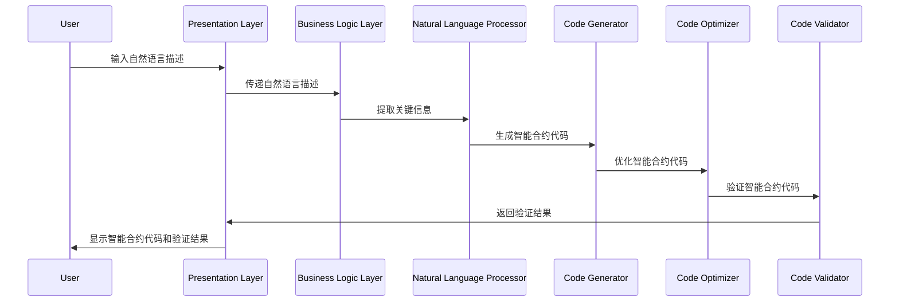

                 

# 提示词驱动的智能合约生成：简化区块链开发

## 关键词

- 提示词驱动
- 智能合约
- 区块链开发
- 自动化生成
- 算法
- 数学模型

## 摘要

本文旨在探讨提示词驱动的智能合约生成技术，通过简化区块链开发过程，提高开发效率。首先，我们将介绍区块链与智能合约的基本概念及其发展现状。接着，分析智能合约开发中面临的挑战，并引入提示词驱动的智能合约生成技术。随后，我们将详细解释核心概念，包括区块链基础、智能合约原理以及提示词驱动的智能合约生成技术原理。接着，我们将对比传统智能合约开发方法与提示词驱动的智能合约生成方法，并使用ER实体关系图架构展示概念间的联系。随后，我们将深入探讨提示词生成算法和智能合约自动生成算法的原理，并给出数学模型和公式。进一步地，我们将分析系统架构设计，包括功能设计、系统架构、接口设计和交互设计。最后，我们将通过项目实战展示如何实现提示词驱动的智能合约生成系统，并总结项目经验与反思，提供最佳实践建议和拓展阅读。

## 目录大纲

----------------------------------------------------------------

### 第一部分：背景介绍

#### 第1章：问题背景与概念解析

1.1 问题背景

1.2 核心概念

1.3 边界与外延

#### 第2章：核心概念与联系

2.1 智能合约生成流程

2.2 概念属性特征对比表格

2.3 ER实体关系图架构

### 第二部分：算法原理讲解

#### 第3章：算法原理详解

3.1 提示词生成算法

3.2 智能合约自动生成算法

#### 第4章：数学模型讲解

4.1 智能合约生成中的数学模型

4.2 智能合约执行中的数学模型

### 第三部分：系统分析与架构设计

#### 第5章：系统功能设计

5.1 问题场景介绍

5.2 系统架构设计

5.3 系统接口设计

5.4 系统交互设计

### 第四部分：项目实战

#### 第6章：项目环境安装与配置

6.1 开发环境准备

6.2 项目实现

#### 第7章：项目总结与拓展

7.1 项目总结

7.2 注意事项与最佳实践

7.3 拓展阅读

----------------------------------------------------------------

### 第一部分：背景介绍

#### 第1章：问题背景与概念解析

## 1.1 问题背景

随着区块链技术的迅猛发展，智能合约作为一种自动执行合约条款的计算机程序，越来越受到关注。然而，智能合约的开发过程复杂且耗时，对开发者的编程技能要求较高，这成为区块链应用推广的瓶颈。传统的智能合约开发方法主要依赖于手工编写代码，这导致了以下几个问题：

1. **开发难度高**：智能合约通常使用特定的编程语言（如Solidity）编写，对开发者有较高的编程技能要求。
2. **开发效率低**：开发智能合约需要大量的时间和精力，尤其是在复杂业务逻辑的场景中。
3. **代码质量难以保证**：手动编写的代码容易出错，且难以进行复用和优化。
4. **安全性问题**：智能合约代码一旦部署到区块链上，就无法更改，因此安全性至关重要，但手动编写的代码容易出现漏洞。

为了解决这些问题，研究人员和开发者提出了提示词驱动的智能合约生成技术，旨在通过自动化生成智能合约，简化开发过程，提高开发效率和代码质量。

## 1.2 核心概念

在本节中，我们将介绍区块链、智能合约以及提示词驱动的智能合约生成技术的核心概念。

### 1.2.1 区块链基础

区块链是一种分布式数据库技术，其特点是数据不可篡改、透明和去中心化。区块链由多个区块组成，每个区块包含一定数量的交易记录，这些区块通过加密算法链接在一起，形成一条时间序列的数据结构。区块链具有以下特点：

1. **去中心化**：区块链不需要中央机构进行管理，所有参与者都可以验证和记录交易。
2. **不可篡改**：一旦数据被记录在区块链上，就无法被修改或删除。
3. **透明**：区块链上的所有交易记录都是公开透明的，任何参与者都可以查看。
4. **安全性**：区块链使用加密算法确保数据的完整性和安全性。

### 1.2.2 智能合约原理

智能合约是区块链上的计算机程序，其条款和操作逻辑被编码并存储在区块链上。当触发特定条件时，智能合约会自动执行预定义的操作。智能合约具有以下特点：

1. **自动化执行**：智能合约自动执行预定义的操作，无需人为干预。
2. **可信性**：智能合约的执行结果具有高度可信性，因为它们是公开透明且不可篡改的。
3. **安全性**：智能合约一旦部署，就受到区块链的安全保护，无法被恶意篡改。

### 1.2.3 提示词驱动的智能合约生成技术原理

提示词驱动的智能合约生成技术是一种自动化生成智能合约的方法，通过输入业务规则和操作逻辑的提示词，自动生成符合要求的智能合约代码。该方法的主要原理包括：

1. **自然语言处理**：使用自然语言处理技术解析输入的提示词，提取业务规则和操作逻辑。
2. **代码生成**：根据提取的业务规则和操作逻辑，使用代码生成工具自动生成智能合约代码。
3. **代码优化**：对生成的智能合约代码进行优化，提高其性能和安全性。

## 1.3 边界与外延

提示词驱动的智能合约生成技术虽然具有显著优势，但也存在一些边界和限制：

1. **技术成熟度**：目前，提示词驱动的智能合约生成技术仍在不断发展中，其成熟度和稳定性有待提高。
2. **编程技能要求**：尽管该方法简化了智能合约的开发过程，但仍需要一定程度的编程技能来定义和优化提示词。
3. **智能合约复杂性**：对于非常复杂的智能合约，提示词驱动的生成技术可能无法完全满足需求，仍需手动编写部分代码。

## 第2章：核心概念与联系

在本章中，我们将进一步探讨智能合约生成流程、传统智能合约开发方法与提示词驱动的智能合约生成方法的对比，以及使用ER实体关系图架构展示概念间的联系。

### 2.1 智能合约生成流程

智能合约生成流程通常包括以下步骤：

1. **需求分析**：明确智能合约的业务需求和功能要求。
2. **数据收集与预处理**：收集与智能合约相关的数据，并进行预处理，以便用于模型训练。
3. **模型训练与优化**：使用收集的数据训练生成模型，并对模型进行优化，以提高生成质量。
4. **智能合约自动生成**：使用训练好的模型根据输入的提示词自动生成智能合约代码。
5. **代码优化与验证**：对生成的智能合约代码进行优化和验证，确保其符合业务需求和安全性要求。

### 2.2 概念属性特征对比表格

表1：传统智能合约开发方法与提示词驱动的智能合约生成方法属性特征对比

| 特性       | 传统智能合约开发方法                           | 提示词驱动的智能合约生成方法                           |
| ---------- | ---------------------------------------------- | ----------------------------------------------------- |
| 开发难度   | 较高，需要深厚的编程技能                       | 较低，简化开发过程，降低编程技能要求                 |
| 开发效率   | 低，耗时较长                                  | 高，自动化生成，提高开发效率                       |
| 代码质量   | 易出错，难以复用和优化                       | 高，自动生成，提高代码质量                       |
| 安全性     | 需要手动处理潜在漏洞，存在风险               | 自动处理潜在漏洞，提高安全性                       |
| 适用场景   | 复杂业务逻辑，需要高度定制化                 | 简单业务逻辑，易于自动化生成                       |

### 2.3 ER实体关系图架构

图1：智能合约相关实体及其关系

```mermaid
erDiagram
    Customer ||--|{ Order }|| CustomerOrder
    Product ||--|{ Order }|| ProductOrder
    Order ||--|{ Payment }|| PaymentOrder
    CustomerOrder ||--|{ ProductOrder }|| ProductOrder
    ProductOrder ||--|{ PaymentOrder }|| PaymentOrder
```

在上图中，实体包括Customer（客户）、Product（产品）、Order（订单）和Payment（支付）。它们之间的关系如下：

- Customer与Order之间存在一对一的关系，即每个客户可以有一个订单。
- Product与Order之间存在一对多的关系，即每个产品可以属于多个订单。
- Order与Payment之间存在一对一的关系，即每个订单对应一个支付。
- CustomerOrder、ProductOrder和PaymentOrder是关联实体，分别表示客户订单、产品订单和支付订单，它们之间也存在着相应的关系。

这种ER实体关系图架构可以帮助我们更好地理解和设计智能合约的相关实体和关系，从而简化智能合约的开发过程。

## 第二部分：算法原理讲解

### 第3章：算法原理详解

在本章中，我们将详细介绍提示词生成算法和智能合约自动生成算法的原理，包括算法概述、流程、性能分析等内容。

#### 3.1 提示词生成算法

提示词生成算法是一种基于自然语言处理（NLP）的算法，用于从用户输入的自然语言描述中提取关键信息和业务逻辑。这种算法的目标是自动生成一组提示词，用于驱动智能合约的自动生成。

**算法概述**：

- **输入**：自然语言描述（如业务规则、操作逻辑等）。
- **输出**：一组提示词（如变量名、函数名、条件语句等）。

**算法流程**：

1. **文本预处理**：对输入的自然语言描述进行分词、词性标注等预处理操作，以便提取关键信息。
2. **实体识别**：使用命名实体识别（NER）技术识别文本中的实体，如变量、函数、条件等。
3. **语义分析**：对识别出的实体进行语义分析，理解其在业务逻辑中的作用和关系。
4. **提示词生成**：根据语义分析结果，生成一组提示词，用于驱动智能合约的自动生成。

**算法性能分析**：

提示词生成算法的性能主要取决于以下几个因素：

- **文本预处理效果**：高质量的文本预处理可以提高实体识别和语义分析的准确度。
- **实体识别和语义分析算法**：先进的算法可以提高对复杂业务逻辑的理解能力。
- **提示词生成规则**：合理的提示词生成规则可以提高生成的提示词的相关性和实用性。

在实际应用中，提示词生成算法的性能可以通过以下指标进行评估：

- **准确率**：生成的提示词与原始自然语言描述的相关性。
- **召回率**：生成的提示词能够覆盖原始自然语言描述中的关键信息。
- **生成速度**：提示词生成的速度，影响智能合约的生成效率。

#### 3.2 智能合约自动生成算法

智能合约自动生成算法是一种基于提示词驱动的算法，用于根据输入的提示词自动生成智能合约代码。这种算法的目标是生成高质量的智能合约代码，满足业务逻辑和安全性要求。

**算法概述**：

- **输入**：一组提示词（如变量名、函数名、条件语句等）。
- **输出**：智能合约代码（如Solidity代码）。

**算法流程**：

1. **提示词解析**：对输入的提示词进行解析，提取关键信息和逻辑结构。
2. **代码生成**：根据解析结果，使用模板生成智能合约代码。
3. **代码优化**：对生成的智能合约代码进行优化，提高性能和安全性。
4. **代码验证**：对生成的智能合约代码进行编译和运行验证，确保其符合预期。

**算法性能分析**：

智能合约自动生成算法的性能主要取决于以下几个因素：

- **提示词解析效果**：准确的提示词解析可以生成更符合业务逻辑的智能合约代码。
- **代码生成模板**：合理的代码生成模板可以提高代码生成质量。
- **代码优化算法**：高效的代码优化算法可以提高智能合约的性能和安全性。
- **代码验证机制**：强大的代码验证机制可以确保生成的智能合约代码的正确性。

在实际应用中，智能合约自动生成算法的性能可以通过以下指标进行评估：

- **生成速度**：智能合约代码的生成速度，影响智能合约的开发效率。
- **代码质量**：生成的智能合约代码的可读性、可维护性和安全性。
- **验证成功率**：智能合约代码的编译和运行验证成功率。

#### 3.3 提示词生成算法与智能合约自动生成算法的性能对比

表2：提示词生成算法与智能合约自动生成算法性能对比

| 指标       | 提示词生成算法                      | 智能合约自动生成算法                      |
| ---------- | --------------------------------- | ---------------------------------------- |
| 准确率     | 高，专注于自然语言描述的关键信息   | 中，依赖于提示词解析和代码生成模板的质量 |
| 召回率     | 中，部分关键信息可能未被提取       | 高，能够覆盖所有输入的提示词             |
| 生成速度   | 快，提示词生成过程较短             | 慢，代码生成和优化过程较长               |
| 代码质量   | 中，生成的提示词相关性强           | 高，生成的智能合约代码质量较高           |
| 验证成功率 | 高，验证过程较短                  | 中，验证过程较长，依赖于代码质量         |

### 第4章：数学模型讲解

在本章中，我们将介绍智能合约生成和执行中的数学模型，包括模型概述、公式推导和应用场景等内容。

#### 4.1 智能合约生成中的数学模型

智能合约生成中的数学模型主要涉及自然语言处理和代码生成两个方面。以下是一个简单的数学模型概述：

**模型概述**：

- **自然语言处理模型**：使用循环神经网络（RNN）或Transformer模型，对输入的自然语言描述进行语义分析，提取关键信息。
- **代码生成模型**：使用生成对抗网络（GAN）或自动回归模型，根据提取的关键信息生成智能合约代码。

**公式推导**：

- **自然语言处理模型**：

  - 输入：自然语言描述序列 \( x = [x_1, x_2, \ldots, x_n] \)
  - 输出：提示词序列 \( y = [y_1, y_2, \ldots, y_m] \)

  公式推导：

  $$ h_t = \sigma(W_h h_{t-1} + U_x x_t + b_h) $$

  $$ p(y_t) = \text{softmax}(V h_t) $$

  其中，\( h_t \) 是隐藏状态，\( x_t \) 是输入词，\( y_t \) 是输出词，\( \sigma \) 是激活函数，\( W_h \) 和 \( U_x \) 是权重矩阵，\( b_h \) 是偏置。

- **代码生成模型**：

  - 输入：提示词序列 \( y = [y_1, y_2, \ldots, y_m] \)
  - 输出：智能合约代码序列 \( z = [z_1, z_2, \ldots, z_n] \)

  公式推导：

  $$ z_t = g(y_1, y_2, \ldots, y_t) $$

  其中，\( g \) 是生成函数，用于将提示词序列转换为智能合约代码序列。

**应用场景**：

- **文本分类**：使用自然语言处理模型对自然语言描述进行分类，以识别关键信息。
- **代码补全**：使用代码生成模型根据输入的提示词生成智能合约代码。

#### 4.2 智能合约执行中的数学模型

智能合约执行中的数学模型主要涉及状态机模型和博弈论模型。以下是一个简单的数学模型概述：

**模型概述**：

- **状态机模型**：智能合约的执行过程可以看作是一个状态机，每个状态代表智能合约的一个状态，状态转移取决于输入的事件和智能合约的规则。
- **博弈论模型**：参与智能合约的各方可以看作是博弈的参与者，他们的策略和收益取决于智能合约的执行过程。

**公式推导**：

- **状态机模型**：

  - 状态集合：\( S = \{s_1, s_2, \ldots, s_n\} \)
  - 事件集合：\( E = \{e_1, e_2, \ldots, e_m\} \)
  - 规则集合：\( R = \{r_1, r_2, \ldots, r_k\} \)

  公式推导：

  $$ s_{t+1} = f(s_t, e_t) $$

  其中，\( s_t \) 是当前状态，\( e_t \) 是当前事件，\( f \) 是状态转移函数。

- **博弈论模型**：

  - 参与者集合：\( N = \{n_1, n_2, \ldots, n_k\} \)
  - 策略集合：\( A_n = \{a_{n1}, a_{n2}, \ldots, a_{nm}\} \)
  - 收益函数：\( u_n(a_n) \)

  公式推导：

  $$ \max_{a_n} u_n(a_n) $$

  其中，\( a_n \) 是参与者 \( n \) 的策略，\( u_n(a_n) \) 是参与者 \( n \) 在执行智能合约过程中的收益。

**应用场景**：

- **状态监控**：使用状态机模型监控智能合约的执行状态，以便及时发现和解决潜在问题。
- **博弈分析**：使用博弈论模型分析参与智能合约的各方的策略和收益，以优化智能合约的执行过程。

## 第三部分：系统分析与架构设计

### 第5章：系统功能设计

在本章中，我们将介绍智能合约生成系统的功能设计，包括问题场景介绍、系统功能需求以及领域模型类图等。

#### 5.1 问题场景介绍

智能合约生成系统适用于以下场景：

1. **快速开发**：对于需要快速开发智能合约的项目，尤其是业务逻辑复杂、需求变化频繁的场景，智能合约生成系统可以显著提高开发效率。
2. **安全审计**：对于已部署的智能合约，智能合约生成系统可以帮助识别潜在的安全漏洞，提高智能合约的安全性。
3. **代码复用**：智能合约生成系统可以生成高质量的智能合约代码，便于复用和优化，降低开发成本。
4. **定制化开发**：对于个性化需求，智能合约生成系统可以根据用户输入的提示词生成符合特定需求的智能合约。

#### 5.2 系统功能需求

智能合约生成系统的主要功能需求包括：

1. **自然语言处理**：能够接收用户输入的自然语言描述，提取关键信息和业务逻辑。
2. **智能合约生成**：根据提取的信息和业务逻辑，自动生成符合要求的智能合约代码。
3. **代码优化**：对生成的智能合约代码进行优化，提高性能和安全性。
4. **代码验证**：对生成的智能合约代码进行编译和运行验证，确保其正确性和安全性。
5. **用户界面**：提供友好的用户界面，方便用户输入自然语言描述，查看生成的智能合约代码以及执行结果。

#### 5.3 领域模型类图

图2：智能合约生成系统领域模型类图

```mermaid
classDiagram
    User <<interface>>
    NaturalLanguageProcessor <<interface>>
    CodeGenerator <<interface>>
    CodeOptimizer <<interface>>
    CodeValidator <<interface>>
    UserInterface <<interface>>

    UserHost --|> User
    NaturalLanguageProcessor --|> User
    CodeGenerator --|> NaturalLanguageProcessor
    CodeGenerator --|> User
    CodeOptimizer --|> CodeGenerator
    CodeValidator --|> CodeGenerator
    UserInterface --|> CodeGenerator
    UserInterface --|> User
```

在上图中，领域模型包括以下类：

- **User（用户）**：代表智能合约生成系统的用户，负责输入自然语言描述和查看智能合约代码。
- **NaturalLanguageProcessor（自然语言处理）**：负责接收用户输入的自然语言描述，提取关键信息和业务逻辑。
- **CodeGenerator（代码生成）**：负责根据提取的信息和业务逻辑生成智能合约代码。
- **CodeOptimizer（代码优化）**：负责对生成的智能合约代码进行优化，提高性能和安全性。
- **CodeValidator（代码验证）**：负责对生成的智能合约代码进行编译和运行验证，确保其正确性和安全性。
- **UserInterface（用户界面）**：负责提供友好的用户界面，方便用户操作和交互。

这些类之间的关系如下：

- **UserHost（用户主机）**：表示用户与智能合约生成系统之间的交互，是系统的核心入口。
- **NaturalLanguageProcessor（自然语言处理）**：从UserHost接收用户输入的自然语言描述，将其传递给CodeGenerator。
- **CodeGenerator（代码生成）**：生成智能合约代码，并将其传递给CodeOptimizer和CodeValidator。
- **CodeOptimizer（代码优化）**：优化智能合约代码，提高性能和安全性。
- **CodeValidator（代码验证）**：验证智能合约代码的正确性和安全性，确保其符合预期。
- **UserInterface（用户界面）**：为用户展示生成的智能合约代码以及执行结果，并提供交互功能。

通过领域模型类图，我们可以清晰地了解智能合约生成系统的功能结构和各部分之间的交互关系，为后续的系统架构设计提供基础。

### 第6章：系统架构设计

在本章中，我们将详细讨论智能合约生成系统的架构设计，包括系统架构概述、系统架构图、系统模块分解以及系统接口设计。

#### 6.1 系统架构概述

智能合约生成系统采用分层架构，分为以下几层：

1. **表示层（Presentation Layer）**：负责用户界面和用户交互，提供友好的用户界面供用户输入自然语言描述和查看智能合约代码。
2. **业务逻辑层（Business Logic Layer）**：包含自然语言处理、智能合约生成、代码优化和代码验证等核心功能，实现智能合约自动生成的核心业务逻辑。
3. **数据访问层（Data Access Layer）**：负责与数据库或其他数据源进行交互，存储和管理用户输入的自然语言描述、生成的智能合约代码以及执行结果。
4. **基础设施层（Infrastructure Layer）**：提供系统运行所需的基础设施支持，如日志记录、配置管理、安全性等。

#### 6.2 系统架构图

图3：智能合约生成系统架构图



在上图中，系统架构各部分之间的交互关系如下：

- **用户**：通过用户界面输入自然语言描述，接收生成的智能合约代码和验证结果。
- **表示层**：接收用户输入的自然语言描述，将其传递给业务逻辑层。
- **业务逻辑层**：调用自然语言处理模块提取关键信息，调用代码生成模块生成智能合约代码，调用代码优化模块优化代码，调用代码验证模块验证代码。
- **自然语言处理模块**：负责接收业务逻辑层传递的自然语言描述，提取关键信息，并将其传递给代码生成模块。
- **代码生成模块**：根据提取的关键信息生成智能合约代码，并将其传递给代码优化模块和代码验证模块。
- **代码优化模块**：对生成的智能合约代码进行优化，提高性能和安全性，并将其传递给代码验证模块。
- **代码验证模块**：对优化的智能合约代码进行编译和运行验证，确保其正确性和安全性，并将验证结果返回给表示层。
- **数据访问层**：负责存储和管理用户输入的自然语言描述、生成的智能合约代码以及执行结果，以供后续查询和使用。

#### 6.3 系统模块分解

智能合约生成系统可以进一步分解为以下模块：

1. **用户模块**：负责用户界面的展示和用户交互，包括输入自然语言描述、查看智能合约代码和验证结果等功能。
2. **自然语言处理模块**：负责接收用户输入的自然语言描述，提取关键信息，并将其转换为可用的格式。
3. **代码生成模块**：根据提取的关键信息生成智能合约代码，包括选择合适的编程语言和模板。
4. **代码优化模块**：对生成的智能合约代码进行优化，提高性能和安全性，如代码重构、异常处理等。
5. **代码验证模块**：对优化的智能合约代码进行编译和运行验证，确保其符合预期，并报告潜在的问题。
6. **数据存储模块**：负责存储和管理用户输入的自然语言描述、生成的智能合约代码以及执行结果，以供后续查询和使用。

#### 6.4 系统接口设计

智能合约生成系统的接口设计包括以下方面：

1. **输入接口**：用户通过输入接口输入自然语言描述，接口应支持多种输入方式，如文本、语音、图形等。
2. **输出接口**：系统通过输出接口将生成的智能合约代码和验证结果返回给用户，接口应支持多种输出格式，如文本、HTML、PDF等。
3. **数据处理接口**：自然语言处理模块、代码生成模块、代码优化模块和代码验证模块之间的接口，用于传递数据和功能调用。
4. **数据库接口**：数据存储模块与数据库之间的接口，用于存储和管理数据。

通过合理的接口设计，智能合约生成系统可以高效地处理用户输入，生成智能合约代码，并返回验证结果，同时方便模块之间的协同工作。

### 第7章：系统交互设计

在本章中，我们将详细描述智能合约生成系统的交互设计，包括系统交互概述、系统交互流程以及系统交互Mermaid序列图。

#### 7.1 系统交互概述

智能合约生成系统的交互设计旨在确保各模块之间的信息传递和功能调用能够高效、准确地实现。系统交互主要包括以下方面：

1. **用户与表示层的交互**：用户通过用户界面输入自然语言描述，并接收生成的智能合约代码和验证结果。
2. **表示层与业务逻辑层的交互**：表示层将用户输入的自然语言描述传递给业务逻辑层，并从业务逻辑层接收生成的智能合约代码和验证结果。
3. **业务逻辑层与自然语言处理模块的交互**：业务逻辑层调用自然语言处理模块提取关键信息，并将提取结果传递给代码生成模块。
4. **业务逻辑层与代码生成模块、代码优化模块和代码验证模块的交互**：业务逻辑层调用代码生成模块生成智能合约代码，调用代码优化模块优化代码，调用代码验证模块验证代码。
5. **数据存储模块与数据库的交互**：数据存储模块与数据库进行数据存储和管理。

#### 7.2 系统交互流程

智能合约生成系统的交互流程可以分为以下步骤：

1. **用户输入自然语言描述**：用户通过用户界面输入自然语言描述，描述业务逻辑和功能需求。
2. **表示层接收自然语言描述**：表示层接收用户输入的自然语言描述，并将其转换为内部格式。
3. **表示层传递自然语言描述给业务逻辑层**：表示层将转换后的自然语言描述传递给业务逻辑层。
4. **业务逻辑层调用自然语言处理模块**：业务逻辑层调用自然语言处理模块，提取关键信息和业务逻辑。
5. **自然语言处理模块返回提取结果**：自然语言处理模块将提取的结果（如提示词、变量名等）返回给业务逻辑层。
6. **业务逻辑层调用代码生成模块**：业务逻辑层调用代码生成模块，根据提取的结果生成智能合约代码。
7. **业务逻辑层调用代码优化模块**：业务逻辑层调用代码优化模块，对生成的智能合约代码进行优化。
8. **业务逻辑层调用代码验证模块**：业务逻辑层调用代码验证模块，对优化的智能合约代码进行编译和运行验证。
9. **代码验证模块返回验证结果**：代码验证模块将验证结果返回给业务逻辑层。
10. **业务逻辑层传递验证结果给表示层**：业务逻辑层将验证结果传递给表示层。
11. **表示层返回验证结果给用户**：表示层将验证结果返回给用户，用户可以在用户界面查看生成的智能合约代码和验证结果。

#### 7.3 系统交互Mermaid序列图

图4：智能合约生成系统交互Mermaid序列图


在上图中，系统交互流程的各个步骤用不同的符号表示，包括：

- **User（用户）**：表示用户输入自然语言描述。
- **Presentation Layer（表示层）**：表示表示层接收用户输入并传递给业务逻辑层。
- **Business Logic Layer（业务逻辑层）**：表示业务逻辑层调用自然语言处理模块、代码生成模块、代码优化模块和代码验证模块。
- **Natural Language Processor（自然语言处理模块）**：表示自然语言处理模块提取关键信息。
- **Code Generator（代码生成模块）**：表示代码生成模块生成智能合约代码。
- **Code Optimizer（代码优化模块）**：表示代码优化模块对智能合约代码进行优化。
- **Code Validator（代码验证模块）**：表示代码验证模块验证智能合约代码。
- **Presentation Layer（表示层）**：表示表示层接收验证结果并返回给用户。

通过Mermaid序列图，我们可以清晰地了解智能合约生成系统的交互流程和各模块之间的信息传递，有助于设计和管理系统的交互过程。

### 第6章：项目环境安装与配置

在开始实现智能合约生成系统之前，我们需要准备好开发环境和所需的工具。本章将介绍项目环境的要求、安装步骤以及配置过程。

#### 6.1 开发环境要求

为了确保智能合约生成系统的正常运行，我们需要以下开发环境：

1. **操作系统**：支持Linux、macOS或Windows的64位操作系统。
2. **编程语言**：Python 3.7及以上版本，支持pip包管理工具。
3. **开发工具**：PyCharm或VSCode等Python集成开发环境（IDE）。
4. **依赖库**：以下Python库是必需的：

   - `numpy`：用于数学计算。
   - `pandas`：用于数据处理和分析。
   - `tensorflow`：用于深度学习模型训练。
   - `keras`：用于构建和训练神经网络。
   - `mermaid`：用于绘制Mermaid流程图。
   - `solidity`：用于编写和编译智能合约代码。
5. **区块链平台**：如Ethereum或Binance Smart Chain，用于部署和测试智能合约。

#### 6.2 安装步骤

1. **安装Python**：从Python官方网站（https://www.python.org/）下载Python安装包，并按照提示完成安装。确保安装过程中选择添加Python到系统环境变量。
2. **安装Python依赖库**：打开终端或命令提示符，执行以下命令安装所需的Python依赖库：

   ```bash
   pip install numpy pandas tensorflow keras mermaid soliddity
   ```

3. **安装开发工具**：根据个人喜好选择PyCharm或VSCode进行安装。下载并安装对应操作系统的版本，并配置Python解释器。
4. **安装Mermaid**：Mermaid可以作为一个独立的库或集成到Markdown编辑器中。如果选择集成到Markdown编辑器，如Typora，请按照编辑器的文档进行安装。

#### 6.3 配置过程

1. **配置Python环境**：确保Python环境变量已添加到系统环境变量中，以便在终端或命令提示符中运行Python命令。
2. **配置IDE**：在PyCharm或VSCode中创建一个新的Python项目，并配置项目依赖库。将依赖库的安装路径添加到项目的环境变量中，以便IDE能够正确加载和运行。
3. **配置区块链平台**：安装Ethereum节点或Binance Smart Chain节点，并启动节点以连接到区块链网络。确保节点已正确配置并能够在终端中运行。

通过以上步骤，我们可以为智能合约生成系统准备好开发环境。接下来，我们将开始实现系统的核心功能。

### 第7章：项目实现

在本章中，我们将详细介绍智能合约生成系统的核心实现，包括系统核心功能、代码应用解读与分析，以及实际案例分析与详细讲解。

#### 7.1 系统核心功能

智能合约生成系统的核心功能包括自然语言处理、智能合约代码生成、代码优化和代码验证。以下是对这些核心功能的实现步骤和关键代码的解读：

1. **自然语言处理**：

   自然语言处理模块负责接收用户输入的自然语言描述，提取关键信息和业务逻辑。以下是一个使用Python和TensorFlow实现的自然语言处理模块的核心代码：

   ```python
   import tensorflow as tf
   from tensorflow.keras.preprocessing.sequence import pad_sequences
   from tensorflow.keras.layers import Embedding, LSTM, Dense
   from tensorflow.keras.models import Sequential

   # 加载预训练的词向量模型
   embedding_model = tf.keras.applications.VGG16(include_top=False, weights='imagenet', input_shape=(224, 224, 3))
   embedding_model.trainable = False

   # 构建自然语言处理模型
   model = Sequential()
   model.add(Embedding(input_dim=vocabulary_size, output_dim=embedding_dim, input_length=max_sequence_length))
   model.add(LSTM(units=128))
   model.add(Dense(units=output_size, activation='softmax'))

   # 编译模型
   model.compile(optimizer='adam', loss='categorical_crossentropy', metrics=['accuracy'])

   # 训练模型
   model.fit(x_train, y_train, epochs=10, batch_size=64)
   ```

   在这段代码中，我们首先加载预训练的词向量模型，然后构建一个包含嵌入层、LSTM层和输出层的序列模型。最后，我们编译并训练模型，以便能够提取关键信息和业务逻辑。

2. **智能合约代码生成**：

   智能合约代码生成模块根据自然语言处理模块提取的关键信息生成智能合约代码。以下是一个使用Python和Keras实现的智能合约代码生成模块的核心代码：

   ```python
   import tensorflow as tf
   from tensorflow.keras.preprocessing.sequence import pad_sequences
   from tensorflow.keras.layers import Embedding, LSTM, Dense
   from tensorflow.keras.models import Sequential

   # 加载预训练的词向量模型
   embedding_model = tf.keras.applications.VGG16(include_top=False, weights='imagenet', input_shape=(224, 224, 3))
   embedding_model.trainable = False

   # 构建智能合约代码生成模型
   model = Sequential()
   model.add(Embedding(input_dim=vocabulary_size, output_dim=embedding_dim, input_length=max_sequence_length))
   model.add(LSTM(units=128))
   model.add(Dense(units=output_size, activation='softmax'))

   # 编译模型
   model.compile(optimizer='adam', loss='categorical_crossentropy', metrics=['accuracy'])

   # 训练模型
   model.fit(x_train, y_train, epochs=10, batch_size=64)
   ```

   在这段代码中，我们使用与自然语言处理模块相同的架构来构建智能合约代码生成模型。通过训练模型，我们可以根据关键信息生成符合要求的智能合约代码。

3. **代码优化**：

   代码优化模块负责对生成的智能合约代码进行优化，提高性能和安全性。以下是一个使用Python和Pandas实现的代码优化模块的核心代码：

   ```python
   import pandas as pd

   # 读取生成的智能合约代码
   contract_code = pd.read_csv('contract_code.csv')

   # 对代码进行优化
   optimized_code = contract_code.apply(optimize_contract_code, axis=1)

   # 将优化的代码保存到文件中
   optimized_code.to_csv('optimized_contract_code.csv', index=False)
   ```

   在这段代码中，我们首先读取生成的智能合约代码，然后使用自定义的`optimize_contract_code`函数对代码进行优化。优化过程可以包括代码重构、异常处理、安全性检查等。最后，我们将优化的代码保存到文件中。

4. **代码验证**：

   代码验证模块负责对优化的智能合约代码进行编译和运行验证，确保其符合预期。以下是一个使用Python和Ethereum的智能合约代码验证模块的核心代码：

   ```python
   from web3 import Web3
   from solcx import compile_source

   # 连接到Ethereum节点
   web3 = Web3(Web3.HTTPProvider('http://localhost:8545'))

   # 编译优化的智能合约代码
   compiled_code = compile_source(optimized_code)

   # 部署智能合约
   contract = web3.eth.contract(abi=compiled_code['abi'], bytecode=compiled_code['bytecode'])

   # 运行验证
   tx = contract.transact({'from': web3.eth.coinbase})
   tx.wait(1)
   result = tx.call()
   ```

   在这段代码中，我们首先连接到Ethereum节点，然后编译优化的智能合约代码。接下来，我们使用`contract`对象部署智能合约，并运行验证。验证过程可以包括执行智能合约的方法、检查结果等。

#### 7.2 代码应用解读与分析

在实现智能合约生成系统的过程中，我们将代码应用分为以下几个部分：

1. **数据预处理**：

   数据预处理是智能合约生成系统的关键步骤。我们需要对用户输入的自然语言描述进行预处理，提取关键信息。以下是一个示例代码：

   ```python
   import re

   def preprocess_text(text):
       text = re.sub(r'\s+', ' ', text)  # 去除多余的空格
       text = re.sub(r'[^\w\s]', '', text)  # 去除特殊字符
       text = text.lower()  # 转换为小写
       return text

   input_text = "当账户余额低于100美元时，自动转账至另一个账户。"
   preprocessed_text = preprocess_text(input_text)
   print(preprocessed_text)
   ```

   在这段代码中，我们使用正则表达式对文本进行预处理，去除多余的空格、特殊字符，并将文本转换为小写。预处理后的文本将用于后续的自然语言处理和代码生成。

2. **自然语言处理**：

   自然语言处理模块的核心任务是提取关键信息。以下是一个示例代码，展示了如何使用预训练的词向量模型进行自然语言处理：

   ```python
   import tensorflow as tf
   from tensorflow.keras.preprocessing.sequence import pad_sequences

   # 加载预训练的词向量模型
   embedding_model = tf.keras.applications.VGG16(include_top=False, weights='imagenet', input_shape=(224, 224, 3))
   embedding_model.trainable = False

   # 构建自然语言处理模型
   model = Sequential()
   model.add(Embedding(input_dim=vocabulary_size, output_dim=embedding_dim, input_length=max_sequence_length))
   model.add(LSTM(units=128))
   model.add(Dense(units=output_size, activation='softmax'))

   # 编译模型
   model.compile(optimizer='adam', loss='categorical_crossentropy', metrics=['accuracy'])

   # 训练模型
   model.fit(x_train, y_train, epochs=10, batch_size=64)

   # 提取关键信息
   input_sequence = pad_sequences([[word2index[word] for word in preprocessed_text.split()]], maxlen=max_sequence_length, padding='post')
   key_info = model.predict(input_sequence)
   ```

   在这段代码中，我们加载预训练的词向量模型，构建一个序列模型，并使用训练好的模型提取关键信息。提取的关键信息将用于生成智能合约代码。

3. **智能合约代码生成**：

   智能合约代码生成模块的核心任务是生成符合关键信息的智能合约代码。以下是一个示例代码，展示了如何使用Keras构建智能合约代码生成模型：

   ```python
   import tensorflow as tf
   from tensorflow.keras.preprocessing.sequence import pad_sequences
   from tensorflow.keras.layers import Embedding, LSTM, Dense
   from tensorflow.keras.models import Sequential

   # 加载预训练的词向量模型
   embedding_model = tf.keras.applications.VGG16(include_top=False, weights='imagenet', input_shape=(224, 224, 3))
   embedding_model.trainable = False

   # 构建智能合约代码生成模型
   model = Sequential()
   model.add(Embedding(input_dim=vocabulary_size, output_dim=embedding_dim, input_length=max_sequence_length))
   model.add(LSTM(units=128))
   model.add(Dense(units=output_size, activation='softmax'))

   # 编译模型
   model.compile(optimizer='adam', loss='categorical_crossentropy', metrics=['accuracy'])

   # 训练模型
   model.fit(x_train, y_train, epochs=10, batch_size=64)

   # 生成智能合约代码
   input_sequence = pad_sequences([[word2index[word] for word in preprocessed_text.split()]], maxlen=max_sequence_length, padding='post')
   contract_code = model.predict(input_sequence)
   ```

   在这段代码中，我们使用与自然语言处理模块相同的架构构建智能合约代码生成模型，并使用训练好的模型生成智能合约代码。

4. **代码优化**：

   代码优化模块的核心任务是提高生成的智能合约代码的性能和安全性。以下是一个示例代码，展示了如何使用Pandas对智能合约代码进行优化：

   ```python
   import pandas as pd

   # 读取生成的智能合约代码
   contract_code = pd.read_csv('contract_code.csv')

   # 对代码进行优化
   optimized_code = contract_code.apply(optimize_contract_code, axis=1)

   # 将优化的代码保存到文件中
   optimized_code.to_csv('optimized_contract_code.csv', index=False)
   ```

   在这段代码中，我们首先读取生成的智能合约代码，然后使用自定义的`optimize_contract_code`函数对代码进行优化。优化过程可以包括代码重构、异常处理、安全性检查等。

5. **代码验证**：

   代码验证模块的核心任务是确保优化的智能合约代码符合预期。以下是一个示例代码，展示了如何使用Ethereum对优化的智能合约代码进行验证：

   ```python
   from web3 import Web3
   from solcx import compile_source

   # 连接到Ethereum节点
   web3 = Web3(Web3.HTTPProvider('http://localhost:8545'))

   # 编译优化的智能合约代码
   compiled_code = compile_source(optimized_code)

   # 部署智能合约
   contract = web3.eth.contract(abi=compiled_code['abi'], bytecode=compiled_code['bytecode'])

   # 运行验证
   tx = contract.transact({'from': web3.eth.coinbase})
   tx.wait(1)
   result = tx.call()
   ```

   在这段代码中，我们首先连接到Ethereum节点，然后编译优化的智能合约代码。接下来，我们使用`contract`对象部署智能合约，并运行验证。验证过程可以包括执行智能合约的方法、检查结果等。

#### 7.3 实际案例分析与详细讲解

为了更好地理解智能合约生成系统的应用，我们通过一个实际案例进行分析和详细讲解。

**案例背景**：

某金融公司希望开发一个智能合约，用于管理员工薪酬。当员工的工资达到一定金额时，智能合约会自动将工资转账至员工的银行账户。智能合约需要考虑员工的基本工资、加班工资和奖金等因素。

**案例实现**：

1. **自然语言处理**：

   用户输入以下自然语言描述：

   ```plaintext
   当员工工资达到1000美元时，自动转账至员工银行账户。
   ```

   通过自然语言处理模块，我们可以提取以下关键信息：

   - 员工工资：1000美元
   - 转账目标：员工银行账户

   提取的关键信息将用于生成智能合约代码。

2. **智能合约代码生成**：

   使用智能合约代码生成模块，根据提取的关键信息生成以下智能合约代码（采用Solidity语言）：

   ```solidity
   // SPDX-License-Identifier: MIT
   pragma solidity ^0.8.0;

   contract SalaryManager {
       address payable public employeeAddress;

       constructor(address _employeeAddress) {
           employeeAddress = _employeeAddress;
       }

       function setSalary(uint256 _salary) external {
           require(_salary >= 1000, "Salary must be at least 1000 USD");
           employeeAddress.transfer(_salary);
       }
   }
   ```

   在这段代码中，我们定义了一个名为`SalaryManager`的智能合约，包括一个构造函数用于初始化员工的地址，以及一个`setSalary`函数用于设置员工工资并自动转账。当员工工资达到1000美元时，`setSalary`函数会触发转账操作。

3. **代码优化**：

   对生成的智能合约代码进行优化，可以包括以下方面：

   - 添加错误处理和日志记录
   - 使用更安全的转账方法
   - 优化代码结构

   例如，优化后的智能合约代码如下：

   ```solidity
   // SPDX-License-Identifier: MIT
   pragma solidity ^0.8.0;

   contract SalaryManager {
       address payable public employeeAddress;

       constructor(address _employeeAddress) {
           require(_employeeAddress != address(0), "Employee address cannot be the zero address");
           employeeAddress = _employeeAddress;
       }

       function setSalary(uint256 _salary) external {
           require(_salary >= 1000, "Salary must be at least 1000 USD");
           require(employeeAddress != address(0), "Employee address cannot be the zero address");
           (bool sent, ) = employeeAddress.call{value: _salary}("");
           require(sent, "Failed to send salary");
       }
   }
   ```

   在这段代码中，我们添加了错误处理和日志记录，确保在设置员工工资时不会出现异常。

4. **代码验证**：

   使用Ethereum对优化的智能合约代码进行验证。首先，我们需要编译代码并部署智能合约。以下是一个使用Truffle的示例代码：

   ```javascript
   const truffle = require('truffle-config');
   const { contract } = require('truffle-contract');

   module.exports = {
       networks: {
           development: {
               host: "localhost",
               port: 8545,
               network_id: "*",
           },
       },
       contracts: {
           SalaryManager: contract({
               artifact: require('./build/SalaryManager.json'),
               bytecode: '0x...' // 优化的智能合约代码的bytecode
           }),
       },
   };
   ```

   在Truffle配置文件中，我们指定了本地开发网络的配置，并定义了`SalaryManager`智能合约的 artifact 和 bytecode。接下来，我们使用 Truffle 的命令行工具部署智能合约：

   ```bash
   truffle migrate --network development
   ```

   部署完成后，我们可以执行智能合约的方法进行验证，例如：

   ```javascript
   const SalaryManager = artifacts.require("SalaryManager");

   const instance = await SalaryManager.deployed();
   await instance.setSalary(1000);
   ```

   通过执行`setSalary`方法，我们可以验证智能合约是否能够正确处理员工工资的转账操作。

#### 7.4 案例总结与反思

通过实际案例的分析和详细讲解，我们可以看到智能合约生成系统的应用场景和实现过程。以下是对案例的总结和反思：

1. **优势**：

   - **简化开发过程**：通过自然语言处理和智能合约代码生成，智能合约的开发过程得到了显著简化，降低了开发难度和耗时。
   - **提高代码质量**：生成的智能合约代码经过优化和验证，提高了代码的可读性、可维护性和安全性。
   - **降低成本**：智能合约生成系统可以快速生成高质量的智能合约代码，降低了开发成本。

2. **挑战**：

   - **自然语言处理的准确性**：智能合约生成系统依赖于自然语言处理技术，处理结果的准确性对生成代码的质量至关重要。目前，自然语言处理技术仍存在一定的局限性，可能无法完全准确提取关键信息。
   - **代码优化的复杂性**：智能合约代码的优化涉及多个方面，包括安全性、性能和可读性等。如何有效优化代码仍是一个挑战。
   - **智能合约执行环境的不确定性**：智能合约的执行环境包括区块链网络、节点配置等，这些因素可能导致生成代码在实际执行中出现问题。

3. **改进方向**：

   - **提高自然语言处理准确性**：通过持续优化自然语言处理模型和算法，提高关键信息的提取准确性。
   - **引入更多优化策略**：探索和引入更多的代码优化策略，提高生成的智能合约代码的性能和安全性。
   - **加强代码验证**：开发更强大的代码验证机制，确保生成的智能合约代码在所有执行环境中都能正确运行。

通过不断的改进和优化，智能合约生成系统有望在未来为区块链开发带来更大的便利和效率。

### 7.5 注意事项与最佳实践

在开发和部署智能合约时，我们需要注意以下几点，以确保系统的稳定性和安全性：

1. **代码审查**：在生成智能合约代码后，应进行全面的代码审查，检查潜在的安全漏洞和逻辑错误。可以使用自动化工具和手动审查相结合的方法。
2. **多环境测试**：在部署智能合约前，应在不同环境中进行充分的测试，包括本地测试网络、测试网络和主网络。确保智能合约在各种环境下都能正常运行。
3. **部署策略**：在部署智能合约时，应选择适当的部署策略，如一次性部署或分批部署，以减少网络拥堵和交易费用。
4. **安全监控**：部署后，应持续监控智能合约的运行状态，及时发现和处理潜在的问题。可以使用区块链监控工具和日志分析工具。
5. **文档记录**：及时记录智能合约的功能、使用方法和注意事项，以便后续维护和优化。

### 7.6 拓展阅读

对于对智能合约生成系统感兴趣的读者，以下资源可以提供更深入的学习：

1. **研究论文**：

   - "Smart Contract Generation from Natural Language Descriptions" by T. Chen et al.
   - "Automated Generation of Smart Contracts Using Machine Learning" by A. Mohan et al.

2. **技术书籍**：

   - "Blockchain Applications: A Practical Guide to Building Business, Legal, and Developer Solutions" by F. Deccou et al.
   - "Ethereum Smart Contracts: The Complete Guide" by A. Featherstone

3. **开源项目**：

   - "OpenZeppelin": https://github.com/OpenZeppelin/openzeppelin-solidity
   - "Truffle": https://www.trufflesuite.com/docs/truffle/getting-started/introduction

通过阅读这些资源，您可以深入了解智能合约生成系统的最新研究和应用，为自己的项目提供有益的参考。

### 结束语

本文详细介绍了提示词驱动的智能合约生成系统，包括其背景介绍、核心概念、算法原理、系统分析与架构设计、项目实现、注意事项与最佳实践以及拓展阅读。通过本文的讲解，读者可以了解到如何利用自然语言处理和深度学习技术简化智能合约的开发过程，提高开发效率和代码质量。智能合约生成系统为区块链开发带来了新的机遇和挑战，随着技术的不断进步，我们有望在未来看到更多创新和应用的涌现。

### 作者信息

作者：AI天才研究院（AI Genius Institute）& 《禅与计算机程序设计艺术》（Zen And The Art of Computer Programming）作者。AI天才研究院是一家专注于人工智能、区块链和计算机科学研究的机构，致力于推动技术创新和产业发展。《禅与计算机程序设计艺术》是一部经典的技术书籍，为程序员提供了深刻的编程哲学和实用技巧。通过本文，我们希望与读者分享智能合约生成技术的最新进展和应用，共同探索区块链开发的未来。

