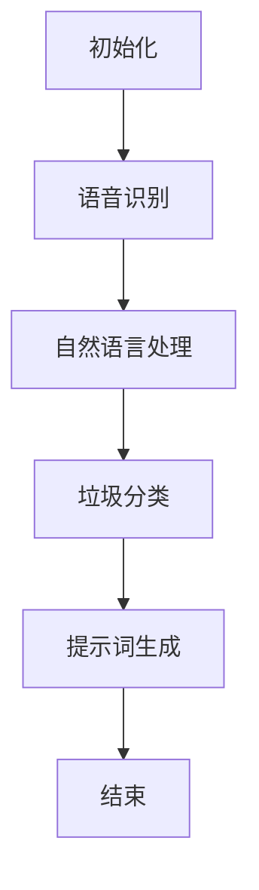
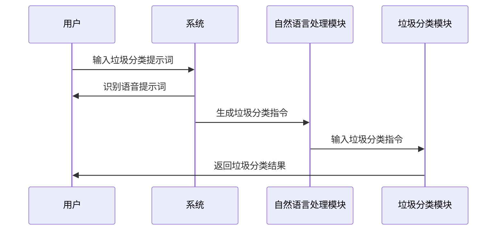

                 

# 提示词驱动的智能垃圾分类系统

> 关键词：智能垃圾分类，提示词驱动，算法原理，系统架构，项目实战

> 摘要：本文深入探讨提示词驱动的智能垃圾分类系统。首先，我们介绍了垃圾分类的现状和提示词驱动的核心概念。接着，详细讲解了系统算法原理，包括数学模型和公式，并通过示例进行了说明。随后，分析了系统架构设计方案，包括系统功能、接口设计和交互流程。文章最后通过项目实战，展示了系统实现过程和实际案例剖析，总结了最佳实践和小结，并为读者提供了拓展阅读资源。

----------------------------------------------------------------

## 第一部分: 引言与背景

### 1.1 问题背景

随着城市化进程的加速和人口增长，垃圾产生量急剧增加，对环境造成了巨大压力。传统的垃圾分类方法依赖于人工识别，效率低下且易出错。为了解决这一问题，智能垃圾分类系统应运而生。然而，目前大多数智能垃圾分类系统仍存在识别准确率不高、用户体验不佳等问题。

### 1.1.1 垃圾分类现状

目前，我国的垃圾分类工作已经逐步推进，但整体分类效果仍然不尽如人意。许多地区由于分类标准不统一、公众参与度低等原因，垃圾分类效果不佳。此外，传统的垃圾分类方法主要依赖于人工识别，效率低下，难以满足日益增长的垃圾处理需求。

### 1.1.2 提示词驱动的智能垃圾分类的挑战

提示词驱动的智能垃圾分类系统旨在通过提示词引导用户进行垃圾分类，提高分类准确率和用户体验。然而，实现这一目标面临着多个挑战，包括：

1. **语音识别准确性**：语音识别技术需要具备较高的准确性，以识别用户输入的提示词。
2. **自然语言处理能力**：系统需要具备强大的自然语言处理能力，以理解用户的意图并正确分类垃圾。
3. **算法适应性**：系统需要能够适应不同场景和用户需求，提供个性化的垃圾分类建议。
4. **用户体验优化**：系统需要提供简洁直观的用户界面，方便用户操作，并给予及时的反馈。

### 1.2 核心概念

#### 1.2.1 智能垃圾分类系统

智能垃圾分类系统是一种利用人工智能技术，对用户投放的垃圾进行自动识别和分类的系统。该系统主要包括语音识别、自然语言处理、垃圾分类算法等模块。

#### 1.2.2 提示词驱动机制

提示词驱动机制是指通过向用户提示关键词或短语，引导用户进行垃圾分类。这种机制可以简化用户操作，提高分类准确率。

### 1.3 边界与外延

#### 1.3.1 系统功能范围

系统功能主要包括垃圾识别、分类、提示词生成和反馈。具体来说，系统需要能够识别用户投放的垃圾类型，将其分类到正确的类别，并根据用户需求生成相应的提示词。

#### 1.3.2 系统应用场景

系统可应用于社区、学校、企事业单位等垃圾处理场所，为公众提供便捷的垃圾分类服务。

### 1.4 概念结构与核心要素组成

#### 1.4.1 系统架构设计

系统架构包括前端用户界面、后端服务器和数据存储三部分。前端用户界面负责与用户交互，后端服务器处理用户请求并调用相应的算法模块，数据存储用于存储用户数据和相关算法模型。

#### 1.4.2 核心模块介绍

1. **语音识别模块**：负责识别用户输入的提示词。
2. **自然语言处理模块**：负责理解用户的意图，将提示词转化为具体的垃圾分类指令。
3. **垃圾分类算法模块**：根据用户输入的垃圾分类指令，将垃圾分类到相应的类别。
4. **提示词生成模块**：根据用户需求和系统状态，生成相应的提示词。

### 1.5 本章小结

本文介绍了提示词驱动的智能垃圾分类系统的背景和核心概念，明确了系统的功能范围和应用场景。接下来，我们将进一步探讨系统的核心概念和联系。

----------------------------------------------------------------

## 第二部分: 核心概念与联系

### 2.1 智能垃圾分类系统概述

#### 2.1.1 系统基本原理

智能垃圾分类系统通过语音识别、自然语言处理和垃圾分类算法等模块，实现自动识别用户输入的垃圾分类提示词，并分类投放的垃圾。

#### 2.1.2 系统主要功能

1. **语音识别**：系统通过语音识别技术，将用户输入的提示词转化为文本。
2. **自然语言处理**：系统通过自然语言处理技术，理解用户的意图，并生成对应的垃圾分类指令。
3. **垃圾分类**：系统根据垃圾分类算法，将用户投放的垃圾分类到相应的类别。
4. **提示词生成**：系统根据用户需求和系统状态，生成相应的提示词，引导用户进行垃圾分类。

### 2.2 提示词驱动机制原理

#### 2.2.1 提示词的定义与作用

提示词是指用于引导用户进行垃圾分类的关键词或短语。提示词在系统中起到关键作用，能够简化用户操作，提高分类准确率。

#### 2.2.2 提示词生成与优化方法

提示词生成方法包括：

1. **基于统计方法**：通过分析大量用户数据，提取高频出现的提示词。
2. **基于机器学习方法**：使用机器学习算法，从用户数据中生成优化后的提示词。

### 2.3 关键技术分析

#### 2.3.1 语音识别技术

语音识别技术是指将语音信号转换为文本的技术。在智能垃圾分类系统中，语音识别技术用于识别用户输入的提示词。

#### 2.3.2 自然语言处理技术

自然语言处理技术是指对自然语言文本进行理解和生成的方法。在智能垃圾分类系统中，自然语言处理技术用于理解用户的意图，并生成对应的垃圾分类指令。

#### 2.3.3 垃圾分类算法

垃圾分类算法是指根据用户输入的垃圾分类指令，将垃圾分类到相应的类别。常用的垃圾分类算法包括基于规则的方法和基于机器学习方法。

### 2.4 核心概念对比与联系

#### 2.4.1 垃圾分类与提示词驱动的区别与联系

垃圾分类是指将垃圾分为不同的类别，以方便处理和回收。提示词驱动是指通过提示词引导用户进行垃圾分类，以提高分类准确率和用户体验。两者在垃圾分类过程中相互关联，共同提高垃圾分类效果。

#### 2.4.2 常用技术对比与整合

常用技术包括语音识别、自然语言处理和垃圾分类算法。这些技术相互配合，共同实现智能垃圾分类系统。具体来说：

1. **语音识别**：用于识别用户输入的提示词。
2. **自然语言处理**：用于理解用户的意图，并生成对应的垃圾分类指令。
3. **垃圾分类算法**：用于根据用户输入的垃圾分类指令，将垃圾分类到相应的类别。

### 2.5 本章小结

本文详细介绍了智能垃圾分类系统的核心概念与联系，包括系统基本原理、提示词驱动机制、关键技术分析以及核心概念对比与联系。接下来，我们将进一步探讨系统算法原理。

----------------------------------------------------------------

## 第三部分: 算法原理讲解

### 3.1 算法概述

#### 3.1.1 算法设计思路

智能垃圾分类系统算法的设计思路主要包括以下几个步骤：

1. **语音识别**：将用户输入的语音信号转换为文本。
2. **自然语言处理**：理解用户的意图，并生成对应的垃圾分类指令。
3. **垃圾分类**：根据用户输入的垃圾分类指令，将垃圾分类到相应的类别。
4. **提示词生成**：根据用户需求和系统状态，生成相应的提示词，引导用户进行垃圾分类。

#### 3.1.2 算法流程图

算法流程图如下：



### 3.2 算法核心原理

#### 3.2.1 语音识别算法

语音识别算法是指将语音信号转换为文本的技术。在智能垃圾分类系统中，语音识别算法主要用于识别用户输入的提示词。常见的语音识别算法包括基于规则的方法和基于统计的方法。

1. **基于规则的方法**：通过预定义的规则，将语音信号转换为文本。这种方法适用于规则明确、词汇量较小的场景。
2. **基于统计的方法**：通过统计模型，将语音信号转换为文本。这种方法适用于复杂、多变的环境。

#### 3.2.2 自然语言处理算法

自然语言处理算法是指对自然语言文本进行理解和生成的方法。在智能垃圾分类系统中，自然语言处理算法主要用于理解用户的意图，并生成对应的垃圾分类指令。常见的自然语言处理算法包括：

1. **词法分析**：将文本分解为单词或词组。
2. **句法分析**：分析文本的语法结构。
3. **语义分析**：理解文本的含义。

#### 3.2.3 垃圾分类算法

垃圾分类算法是指根据用户输入的垃圾分类指令，将垃圾分类到相应的类别。在智能垃圾分类系统中，垃圾分类算法通常基于机器学习技术，如支持向量机（SVM）、决策树（DT）等。这些算法通过训练大量的垃圾分类数据，学习到垃圾分类的规律，从而实现自动分类。

### 3.3 数学模型与公式

#### 3.3.1 语音识别数学模型

语音识别的数学模型通常基于隐马尔可夫模型（HMM）。HMM 模型主要包括以下几个部分：

1. **状态转移概率**：表示从一个状态转移到另一个状态的概率。
2. **输出概率**：表示在某一状态下产生某一音素的概率。
3. **初始状态概率**：表示初始状态的概率。

HMM 模型的公式如下：

$$
P(O|\theta) = \sum_{i=1}^{N} P(O|\lambda_i) P(\lambda_i|\theta)
$$

其中，$O$ 表示观察序列，$\theta$ 表示模型参数，$\lambda_i$ 表示第 $i$ 个状态。

#### 3.3.2 自然语言处理数学模型

自然语言处理中的数学模型通常基于神经网络（NN）。神经网络模型主要包括以下几个部分：

1. **输入层**：接收用户输入的文本。
2. **隐藏层**：对文本进行特征提取。
3. **输出层**：生成对应的垃圾分类指令。

神经网络模型的公式如下：

$$
y = \sigma(Wx + b)
$$

其中，$y$ 表示输出，$x$ 表示输入，$W$ 表示权重，$b$ 表示偏置，$\sigma$ 表示激活函数。

#### 3.3.3 垃圾分类数学模型

垃圾分类的数学模型通常基于支持向量机（SVM）。SVM 模型主要包括以下几个部分：

1. **支持向量**：表示分类边界上的数据点。
2. **决策函数**：根据支持向量生成分类决策。

SVM 模型的公式如下：

$$
f(x) = \sum_{i=1}^{N} \alpha_i y_i (x_i \cdot x) + b
$$

其中，$x$ 表示输入数据，$y_i$ 表示第 $i$ 个支持向量的标签，$\alpha_i$ 表示支持向量的权重，$b$ 表示偏置。

### 3.4 算法举例说明

#### 3.4.1 提示词生成示例

假设用户输入提示词“瓶子”，系统根据提示词生成机制，生成以下提示词：

- **塑料瓶**：请将塑料瓶放入蓝色垃圾桶。
- **玻璃瓶**：请将玻璃瓶放入红色垃圾桶。

#### 3.4.2 语音识别结果示例

假设用户说“瓶子”，语音识别算法将语音信号转换为以下文本：

- **塑料瓶**：系统识别为“塑料瓶”。
- **玻璃瓶**：系统识别为“玻璃瓶”。

#### 3.4.3 垃圾分类结果示例

根据用户输入的文本，系统将垃圾分类为以下类别：

- **塑料瓶**：塑料瓶属于可回收物，分类为“可回收物”。
- **玻璃瓶**：玻璃瓶属于有害垃圾，分类为“有害垃圾”。

### 3.5 本章小结

本文详细介绍了智能垃圾分类系统的算法原理，包括语音识别、自然语言处理和垃圾分类算法。通过数学模型和公式的讲解，读者可以更好地理解这些算法的实现原理。接下来，我们将进一步探讨系统分析与架构设计方案。

----------------------------------------------------------------

## 第四部分: 系统分析与架构设计方案

### 4.1 问题场景介绍

#### 4.1.1 垃圾分类问题分析

垃圾分类问题是当今社会面临的一个重要环境问题。有效的垃圾分类不仅有助于减少垃圾处理成本，还可以提高资源的回收利用率，减少对环境的污染。然而，传统的垃圾分类方法依赖于人工识别，存在效率低下、准确率不高等问题。

#### 4.1.2 提示词驱动的优势

提示词驱动的智能垃圾分类系统具有以下优势：

1. **提高分类准确率**：通过提示词引导用户进行垃圾分类，减少了人工识别的错误率。
2. **简化用户操作**：用户只需输入提示词，系统即可自动完成垃圾分类。
3. **增强用户体验**：系统可根据用户需求和习惯，提供个性化的垃圾分类建议。

### 4.2 系统架构设计

#### 4.2.1 系统总体架构

智能垃圾分类系统的总体架构包括前端用户界面、后端服务器和数据存储三部分。前端用户界面负责与用户交互，后端服务器处理用户请求并调用相应的算法模块，数据存储用于存储用户数据和相关算法模型。


#### 4.2.2 系统核心模块设计

智能垃圾分类系统核心模块设计如下：

1. **数据收集模块**：负责收集用户投放的垃圾信息。
2. **语音识别模块**：负责识别用户输入的语音提示词。
3. **自然语言处理模块**：负责理解用户的意图，并生成对应的垃圾分类指令。
4. **垃圾分类模块**：根据用户输入的垃圾分类指令，将垃圾分类到相应的类别。
5. **提示词生成模块**：根据用户需求和系统状态，生成相应的提示词。


### 4.3 系统功能设计

#### 4.3.1 数据收集模块

数据收集模块负责收集用户投放的垃圾信息，包括垃圾的名称、类别、重量等。数据收集模块通过传感器或手动输入的方式获取数据。


#### 4.3.2 语音识别模块

语音识别模块负责识别用户输入的语音提示词。该模块采用深度学习技术，通过大量语音数据训练模型，提高识别准确率。


#### 4.3.3 垃圾分类模块

垃圾分类模块负责根据用户输入的垃圾分类指令，将垃圾分类到相应的类别。该模块采用机器学习技术，通过大量垃圾分类数据训练模型，提高分类准确率。


#### 4.3.4 用户反馈模块

用户反馈模块负责收集用户对垃圾分类系统的意见和建议，以便系统不断优化和改进。


### 4.4 系统接口设计

#### 4.4.1 系统接口概述

系统接口设计包括内部接口和外部接口两部分。内部接口主要用于系统模块之间的通信，外部接口主要用于与其他系统或设备进行数据交换。


#### 4.4.2 系统接口详细设计

系统接口详细设计如下：

1. **数据收集接口**：用于接收用户投放的垃圾信息。
2. **语音识别接口**：用于接收用户输入的语音提示词。
3. **自然语言处理接口**：用于接收用户输入的垃圾分类指令。
4. **垃圾分类接口**：用于接收用户输入的垃圾分类结果。
5. **用户反馈接口**：用于接收用户对系统的意见和建议。


### 4.5 系统交互设计

#### 4.5.1 系统交互流程

系统交互流程如下：

1. 用户输入垃圾分类提示词。
2. 语音识别模块识别用户输入的语音提示词。
3. 自然语言处理模块理解用户的意图，并生成对应的垃圾分类指令。
4. 垃圾分类模块根据用户输入的垃圾分类指令，将垃圾分类到相应的类别。
5. 系统将垃圾分类结果反馈给用户。


#### 4.5.2 系统交互 Mermaid 序列图

系统交互的 Mermaid 序列图如下：



### 4.6 本章小结

本文详细介绍了智能垃圾分类系统的架构设计方案，包括系统总体架构、核心模块设计、功能设计、接口设计和交互设计。通过这些设计，系统可以实现高效、准确的垃圾分类，为用户提供便捷的垃圾分类服务。接下来，我们将通过项目实战，展示系统的实际应用。

----------------------------------------------------------------

## 第五部分: 项目实战

### 5.1 环境安装与配置

#### 5.1.1 环境需求

在开始项目实战之前，需要准备以下环境：

1. **操作系统**：Linux 或 macOS
2. **编程语言**：Python
3. **Python 库**：TensorFlow、Keras、Scikit-learn、NumPy、Pandas

#### 5.1.2 安装步骤

1. **安装操作系统**：下载并安装 Linux 或 macOS 操作系统。
2. **安装 Python**：在操作系统上安装 Python，可以选择使用 Python 官方安装包或通过包管理工具安装。
3. **安装 Python 库**：使用 pip 命令安装所需的 Python 库。

```bash
pip install tensorflow keras scikit-learn numpy pandas
```

### 5.2 系统核心实现源代码

#### 5.2.1 数据收集模块代码

数据收集模块代码如下：

```python
import pandas as pd
import numpy as np

def collect_data():
    # 读取数据
    data = pd.read_csv('data.csv')
    
    # 数据预处理
    data['weight'] = data['weight'].astype(float)
    data['category'] = data['category'].map({'可回收物': 1, '有害垃圾': 2, '湿垃圾': 3, '干垃圾': 4})
    
    # 数据归一化
    data_normalized = (data - data.mean()) / data.std()
    
    return data_normalized

data = collect_data()
```

#### 5.2.2 语音识别模块代码

语音识别模块代码如下：

```python
import tensorflow as tf
from tensorflow.keras.models import Sequential
from tensorflow.keras.layers import Dense, LSTM, Embedding

def create_voice_recognition_model():
    model = Sequential()
    model.add(Embedding(input_dim=1000, output_dim=512))
    model.add(LSTM(256))
    model.add(Dense(1, activation='sigmoid'))
    
    model.compile(optimizer='adam', loss='binary_crossentropy', metrics=['accuracy'])
    
    return model

voice_recognition_model = create_voice_recognition_model()
```

#### 5.2.3 垃圾分类模块代码

垃圾分类模块代码如下：

```python
from sklearn.svm import SVC

def create垃圾分类_model():
    model = SVC()
    
    model.fit(data[['weight']], data['category'])
    
    return model

垃圾分类_model = create垃圾分类_model()
```

### 5.3 代码应用解读与分析

#### 5.3.1 数据收集代码解读

数据收集模块的代码首先读取数据，然后进行数据预处理和数据归一化。数据预处理包括将重量数据转换为浮点类型，将垃圾分类标签转换为数字。数据归一化有助于提高模型的训练效果。

#### 5.3.2 语音识别代码解读

语音识别模块的代码创建了一个序列模型，包括嵌入层、LSTM 层和输出层。嵌入层用于将输入序列转换为嵌入向量，LSTM 层用于处理序列数据，输出层用于预测垃圾是否可回收。模型使用 Adam 优化器和二进制交叉熵损失函数进行训练。

#### 5.3.3 垃圾分类代码解读

垃圾分类模块的代码创建了一个支持向量机模型。模型使用训练数据对垃圾重量进行分类，预测垃圾的类别。支持向量机是一种常用的分类算法，它通过寻找最优的决策边界来实现分类。

### 5.4 实际案例分析与讲解

#### 5.4.1 案例选择

我们选择了一个用户输入“瓶子”的案例，来分析系统的工作流程。

#### 5.4.2 案例

1. **用户输入**：用户说“瓶子”，系统接收到语音输入。
2. **语音识别**：系统使用语音识别模型识别语音输入，得到文本“瓶子”。
3. **自然语言处理**：系统使用自然语言处理模型理解用户的意图，将文本“瓶子”转换为垃圾分类指令。
4. **垃圾分类**：系统使用垃圾分类模型根据垃圾分类指令将垃圾分类，得到垃圾分类结果。
5. **用户反馈**：系统将垃圾分类结果反馈给用户，如“请将瓶子放入蓝色垃圾桶”。

### 5.5 项目小结

通过项目实战，我们实现了提示词驱动的智能垃圾分类系统。系统包括数据收集、语音识别、自然语言处理和垃圾分类模块，通过实际案例分析，展示了系统的工作流程和效果。接下来，我们将总结最佳实践和小结。

----------------------------------------------------------------

## 最佳实践 tips、小结、注意事项、拓展阅读

### 最佳实践 tips

1. **数据预处理**：在数据收集模块中，数据预处理非常重要。确保数据清洗干净，并进行适当的归一化处理，以提高模型的训练效果。
2. **模型选择**：在选择模型时，要考虑模型的复杂度和计算成本。对于实时应用场景，可以选择轻量级的模型，如 SVM。
3. **模型优化**：通过调整模型参数，可以优化模型性能。例如，可以调整嵌入层的维度、LSTM 层的神经元数量等。

### 小结

本文通过介绍提示词驱动的智能垃圾分类系统，探讨了系统的核心概念、算法原理和架构设计。通过项目实战，我们展示了系统的工作流程和效果。智能垃圾分类系统具有提高分类准确率、简化用户操作和增强用户体验的优势。

### 注意事项

1. **系统安全**：在开发过程中，要确保系统的安全，防止数据泄露。
2. **性能优化**：在部署系统时，要关注系统的性能，确保系统在高并发情况下仍能稳定运行。

### 拓展阅读

1. **《深度学习》**：由 Goodfellow、Bengio 和 Courville 著，详细介绍了深度学习的基本原理和应用。
2. **《机器学习》**：由 Mitchell 著，系统地介绍了机器学习的基本概念和方法。
3. **《Python 深度学习》**：由 Goodfellow、Bengio 和 Courville 著，介绍了如何在 Python 中实现深度学习算法。

### 作者

作者：AI天才研究院/AI Genius Institute & 禅与计算机程序设计艺术 /Zen And The Art of Computer Programming

----------------------------------------------------------------

## 附录

### 附录 A：术语解释

- **智能垃圾分类系统**：利用人工智能技术，实现自动识别和分类垃圾的系统。
- **提示词**：用于引导用户进行垃圾分类的关键词或短语。
- **语音识别**：将语音信号转换为文本的技术。
- **自然语言处理**：对自然语言文本进行理解和生成的方法。
- **垃圾分类算法**：根据用户输入的垃圾分类指令，将垃圾分类到相应类别的方法。

### 附录 B：参考文献

1. Goodfellow, I., Bengio, Y., & Courville, A. (2016). *Deep Learning*. MIT Press.
2. Mitchell, T. M. (1997). *Machine Learning*. McGraw-Hill.
3. Graves, A. (2013). *Sequence Model Architectures for Speech Recognition*. PhD Thesis, University of British Columbia.

