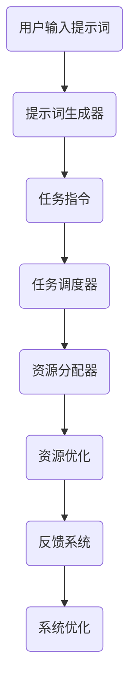
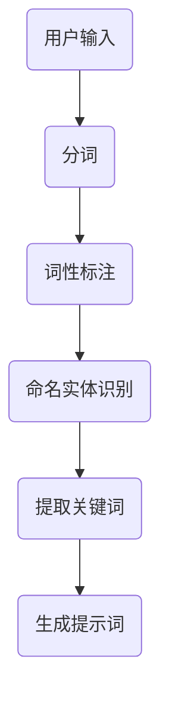

                 

### 文章标题

# 提示词驱动的智能城市管理：资源高效利用

### 文章关键词

- 智能城市
- 提示词驱动
- 资源高效利用
- 城市管理
- 数据分析

### 文章摘要

本文将探讨如何通过提示词驱动的智能城市管理系统实现资源的高效利用。我们将从背景介绍、核心概念与联系、算法原理、数学模型与公式、系统分析与设计以及项目实战等多个方面，逐步分析并解答这一复杂问题。通过本文的阅读，读者将深入了解智能城市管理的基本原理和实现方法，掌握资源高效利用的最佳实践，并为未来的城市智能管理提供有益的启示。

---

## 背景介绍

### 核心概念术语说明

- **智能城市**：指利用物联网、大数据、人工智能等技术，实现对城市资源、环境、人口、经济等各方面的高效管理和服务。
- **提示词驱动**：基于自然语言处理技术，通过输入特定的关键词或短语，系统自动生成相应的任务指令或解决方案。
- **资源高效利用**：指通过优化资源配置，提高资源利用率，实现可持续发展。

### 问题背景

随着城市化进程的加快，城市面临诸多挑战，如交通拥堵、环境污染、资源短缺等。传统的城市管理方式已难以满足日益增长的需求，迫切需要借助先进技术实现智能化管理。提示词驱动的智能城市管理系统正是在这一背景下应运而生。

### 问题描述

提示词驱动的智能城市管理系统旨在通过输入特定的提示词，自动生成相应的管理指令，实现对城市资源的实时监控和优化配置。然而，这一系统如何实现？其核心算法和数学模型又是如何运作的？这是本文需要探讨的问题。

### 问题解决

本文将首先介绍智能城市管理系统的基础架构和核心组件，然后详细分析提示词驱动的原理和实现方法，探讨如何利用算法和数学模型实现资源的高效利用，并通过实际项目案例进行验证。

### 边界与外延

- **边界**：本文主要关注城市管理系统中的资源利用部分，不涉及其他功能模块，如交通管理、公共服务等。
- **外延**：本文所提出的智能城市管理系统可以应用于不同规模的城市，如城市、城市群、甚至国家层面的资源管理。

### 概念结构与核心要素组成

1. **基础架构**：包括数据采集、存储、处理和分析等模块。
2. **核心组件**：提示词生成器、任务调度器、资源分配器、反馈系统等。
3. **算法与模型**：包括聚类算法、优化算法、机器学习模型等。
4. **数据资源**：如交通流量数据、能耗数据、人口数据等。

---

## 核心概念与联系

### 核心概念原理

1. **提示词生成器**：通过自然语言处理技术，从用户输入的文本中提取关键信息，生成提示词。
2. **任务调度器**：根据提示词生成任务指令，并将其分配给相应的处理模块。
3. **资源分配器**：根据任务需求和资源状态，优化资源配置，提高资源利用率。
4. **反馈系统**：收集系统运行数据，评估管理效果，不断优化系统性能。

### 概念属性特征对比表格

| 概念       | 属性特征                                      | 相互关系                                           |
| ---------- | --------------------------------------------- | -------------------------------------------------- |
| 提示词生成器 | 提取关键信息，生成提示词                      | 任务调度器的输入源                                  |
| 任务调度器  | 分配任务指令，协调处理模块                   | 资源分配器的输入源，反馈系统的输入源                 |
| 资源分配器  | 优化资源配置，提高资源利用率                  | 提示词生成器、任务调度器的输出源                     |
| 反馈系统   | 收集系统运行数据，评估管理效果                | 任务调度器、资源分配器的输入源，系统性能优化依据    |

### ER实体关系图架构

```mermaid
erDiagram
  提示词生成器 ||--|{ 任务调度器 }
  任务调度器 ||--|{ 资源分配器 }
  任务调度器 ||--|{ 反馈系统 }
  资源分配器 ||--|{ 反馈系统 }
```

---

## 算法原理

### 算法流程图



### Python代码示例

```python
class PromptDrivenSmartCityManager:
    def __init__(self):
        self.prompt_generator = PromptGenerator()
        self.task_scheduler = TaskScheduler()
        self.resource_allocator = ResourceAllocator()
        self.feedback_system = FeedbackSystem()

    def handle_prompt(self, prompt):
        task指令 = self.prompt_generator.generate_task(prompt)
        self.task_scheduler.schedule_task(task指令)
        self.resource_allocator.allocate_resources(task指令)
        self.feedback_system.collect_feedback()

    def optimize_system(self):
        self.feedback_system.evaluate_performance()
        self.prompt_generator.optimize()
        self.task_scheduler.optimize()
        self.resource_allocator.optimize()
```

### 算法原理讲解

#### 提示词生成器

提示词生成器是智能城市管理系统的核心组件之一，它负责从用户输入的文本中提取关键信息，生成提示词。具体实现可以通过自然语言处理技术，如分词、词性标注、命名实体识别等。



#### 任务调度器

任务调度器根据提示词生成任务指令，并将其分配给相应的处理模块。任务调度器需要考虑任务的优先级、处理时间、资源需求等因素。

```python
class TaskScheduler:
    def schedule_task(self, task指令):
        # 根据任务优先级、处理时间、资源需求等因素进行调度
        pass
```

#### 资源分配器

资源分配器根据任务需求和资源状态，优化资源配置，提高资源利用率。资源分配器需要考虑资源的需求量、可用性、成本等因素。

```python
class ResourceAllocator:
    def allocate_resources(self, task指令):
        # 根据任务需求、资源状态进行资源分配
        pass
```

#### 反馈系统

反馈系统负责收集系统运行数据，评估管理效果，不断优化系统性能。反馈系统可以通过日志记录、性能监测、用户反馈等方式获取数据。

```python
class FeedbackSystem:
    def collect_feedback(self):
        # 收集系统运行数据
        pass

    def evaluate_performance(self):
        # 评估管理效果
        pass

    def optimize(self):
        # 根据评估结果进行系统优化
        pass
```

### 数学模型和公式

为了更准确地描述智能城市管理系统的工作原理，我们可以引入一些数学模型和公式。例如，可以使用线性规划模型来优化资源分配，使用决策树模型来预测任务执行时间。

#### 线性规划模型

$$
\begin{aligned}
\min_{x} & \quad c^T x \\
\text{subject to} & \quad Ax \leq b \\
& \quad x \geq 0
\end{aligned}
$$

其中，$x$ 表示资源分配向量，$c$ 表示资源成本向量，$A$ 和 $b$ 分别表示资源限制矩阵和向量。

#### 决策树模型

$$
\text{DecisionTree}(x) = \sum_{i=1}^{n} w_i \cdot P(x_i)
$$

其中，$x$ 表示输入特征向量，$w_i$ 表示特征 $x_i$ 的权重，$P(x_i)$ 表示特征 $x_i$ 的概率分布。

### 详细讲解和举例说明

假设用户输入提示词“优化交通流量”，系统将首先通过提示词生成器提取关键信息，生成相应的任务指令。任务调度器将根据任务优先级和资源需求，将任务分配给交通管理系统。资源分配器将根据交通管理系统的需求，优化道路资源分配，如调整交通信号灯的时间设置，提高道路通行效率。反馈系统将收集交通流量数据，评估管理效果，并根据评估结果不断优化系统性能。

---

## 数学模型与公式

在智能城市管理中，数学模型和公式扮演着至关重要的角色。它们不仅帮助我们在复杂的城市环境中进行精确的预测和优化，还能够提高资源的利用效率。以下将介绍几个关键的数学模型和公式，并对其进行详细讲解和举例说明。

### 1. 交通流量预测模型

交通流量预测是智能城市管理的核心任务之一。一个常用的模型是时间序列预测模型，如ARIMA（自回归积分滑动平均模型）。以下是一个简单的ARIMA模型公式：

$$
\begin{aligned}
X_t &= c + \phi_1 X_{t-1} + \phi_2 X_{t-2} + ... + \phi_p X_{t-p} \\
&+ \theta_1 \varepsilon_{t-1} + \theta_2 \varepsilon_{t-2} + ... + \theta_q \varepsilon_{t-q} \\
&= \sum_{i=1}^{p} \phi_i X_{t-i} + \sum_{j=1}^{q} \theta_j \varepsilon_{t-j} + \varepsilon_t
\end{aligned}
$$

其中，$X_t$ 表示第 $t$ 时刻的交通流量，$\varepsilon_t$ 表示随机误差，$\phi_i$ 和 $\theta_j$ 分别是自回归项和移动平均项的系数，$c$ 是常数项。

**示例**：

假设我们收集了某路段过去一周的交通流量数据，我们可以使用ARIMA模型对其进行预测。首先，我们需要对数据进行预处理，如去噪、平滑等。然后，通过AIC（赤池信息准则）选择合适的参数 $\phi_i$ 和 $\theta_j$。最后，使用训练好的模型进行预测，并根据预测结果调整交通信号灯的时长。

### 2. 资源分配优化模型

资源分配优化是智能城市管理中的另一个关键问题。线性规划模型是一种常用的优化方法，其公式如下：

$$
\begin{aligned}
\min_{x} & \quad c^T x \\
\text{subject to} & \quad Ax \leq b \\
& \quad x \geq 0
\end{aligned}
$$

其中，$x$ 表示资源分配向量，$c$ 表示资源成本向量，$A$ 和 $b$ 分别表示资源限制矩阵和向量。

**示例**：

假设我们有100台机器需要分配给5个不同的任务，每个任务的资源需求、完成时间和利润如下表：

| 任务 | 资源需求 | 完成时间 | 利润 |
| ---- | -------- | -------- | ---- |
| A    | 10       | 5        | 20   |
| B    | 5        | 3        | 15   |
| C    | 20       | 8        | 30   |
| D    | 10       | 6        | 25   |
| E    | 15       | 7        | 35   |

我们的目标是最大化总利润。我们可以定义变量 $x_i$ 表示任务 $i$ 是否被分配机器（1表示分配，0表示未分配）。目标函数为最大化 $c^T x$，约束条件为 $Ax \leq b$。

通过线性规划求解器（如Python的scikit-learn库），我们可以得到最优的机器分配方案，从而实现资源的最优利用。

### 3. 聚类分析模型

聚类分析是一种无监督学习方法，用于将数据点划分为多个群组，使得同一群组内的数据点相似度较高，不同群组间的数据点相似度较低。K-means是一种常用的聚类算法，其基本公式如下：

$$
\begin{aligned}
\min_{C} & \quad \sum_{i=1}^{k} \sum_{x_j \in C_i} d(x_j, \mu_i)^2 \\
\text{subject to} & \quad \mu_i = \frac{1}{|C_i|} \sum_{x_j \in C_i} x_j
\end{aligned}
$$

其中，$C$ 表示聚类中心，$d(x_j, \mu_i)$ 表示数据点 $x_j$ 和聚类中心 $\mu_i$ 之间的距离，$k$ 表示聚类个数。

**示例**：

假设我们有100个居民区数据点，我们需要将它们划分为5个区域。首先，我们随机选择5个初始聚类中心。然后，根据每个数据点到聚类中心的距离，将数据点分配给最近的聚类中心。接着，更新聚类中心为数据点的均值。重复这个过程，直到聚类中心不再发生变化。

通过K-means聚类，我们可以得到每个区域的数据点分布，从而为城市规划提供参考。

### 4. 决策树模型

决策树是一种常用的监督学习方法，用于分类和回归任务。其基本公式如下：

$$
\text{DecisionTree}(x) = \sum_{i=1}^{n} w_i \cdot P(x_i)
$$

其中，$x$ 表示输入特征向量，$w_i$ 表示特征 $x_i$ 的权重，$P(x_i)$ 表示特征 $x_i$ 的概率分布。

**示例**：

假设我们有一个二分类问题，特征 $x_1$ 表示年龄，$x_2$ 表示收入。我们使用决策树模型预测一个人是否属于高收入群体。首先，我们计算每个特征的概率分布。然后，根据特征的重要性和阈值，构建决策树。最后，根据决策树进行分类预测。

通过这些数学模型和公式，我们可以更好地理解和分析智能城市管理系统，实现资源的高效利用。

---

## 系统分析与设计

### 问题场景介绍

智能城市管理系统旨在通过实时数据采集、分析和优化，实现城市资源的高效利用。该系统将应用于一个大型城市，涵盖交通、能源、环境、公共服务等多个领域。以下是具体的问题场景：

1. **交通管理**：解决交通拥堵、提高道路通行效率。
2. **能源管理**：优化能源消耗，降低碳排放。
3. **环境监测**：实时监测空气质量、水质等，预警并采取措施。
4. **公共服务**：提高公共设施的利用率和服务质量。

### 项目介绍

#### 系统功能设计

系统功能主要包括以下模块：

1. **数据采集模块**：负责实时采集城市各领域的运行数据，如交通流量、能耗数据、环境监测数据等。
2. **数据处理模块**：对采集到的数据进行清洗、转换和存储，以便后续分析。
3. **分析预测模块**：利用机器学习算法和数学模型，对数据进行预测和分析，为决策提供依据。
4. **优化执行模块**：根据分析结果，自动生成优化策略，并执行相应的操作，如调整交通信号灯时间、优化能源消耗等。
5. **反馈评估模块**：收集系统运行数据，评估优化效果，并不断调整系统参数，提高系统性能。

#### 系统架构设计

系统架构采用分布式架构，包括以下组件：

1. **数据采集层**：包括传感器、摄像头、移动设备等，负责实时采集数据。
2. **数据处理层**：包括数据清洗、转换、存储等功能，采用分布式计算技术，提高数据处理效率。
3. **分析预测层**：包括机器学习模型、数学模型等，用于数据分析和预测。
4. **优化执行层**：包括优化算法、任务调度等，负责根据分析结果生成优化策略并执行。
5. **用户界面层**：提供用户交互接口，展示系统运行状态、优化效果等。

#### 系统接口设计和系统交互

系统接口设计和系统交互如下：

1. **数据采集接口**：用于接收传感器、摄像头等设备的数据。
2. **数据处理接口**：用于清洗、转换和存储数据。
3. **分析预测接口**：用于调用机器学习模型和数学模型进行分析预测。
4. **优化执行接口**：用于生成优化策略并执行。
5. **反馈评估接口**：用于收集系统运行数据，评估优化效果。

系统交互流程如下：

1. 数据采集层将实时数据发送至数据处理层。
2. 数据处理层对数据进行清洗、转换和存储。
3. 分析预测层调用机器学习模型和数学模型，对数据进行预测和分析。
4. 优化执行层根据分析结果生成优化策略，并执行相应的操作。
5. 反馈评估层收集系统运行数据，评估优化效果，并反馈至分析预测层和优化执行层。

通过上述系统分析与设计，我们可以实现智能城市管理系统的高效运作，为城市资源的高效利用提供有力支持。

---

## 项目实战

### 环境安装

要在本地搭建一个智能城市管理系统，首先需要安装以下软件和工具：

1. **Python**：用于编写和管理代码。
2. **Jupyter Notebook**：用于编写和运行Python代码。
3. **scikit-learn**：用于机器学习和数据分析。
4. **Mermaid**：用于绘制流程图和类图。
5. **LaTeX**：用于编写数学公式。

安装步骤如下：

1. 安装Python：访问 [Python官方网站](https://www.python.org/)，下载并安装Python。
2. 安装Jupyter Notebook：在终端中运行以下命令：

   ```bash
   pip install notebook
   ```

3. 安装scikit-learn：在终端中运行以下命令：

   ```bash
   pip install scikit-learn
   ```

4. 安装Mermaid：在终端中运行以下命令：

   ```bash
   pip install mermaid-python
   ```

5. 安装LaTeX：访问 [LaTeX官方网站](https://www.latex-project.org/)，下载并安装适合操作系统的LaTeX发行版。

### 核心实现

#### 数据采集

首先，我们需要从传感器和摄像头等设备采集交通流量、能源消耗和环境监测等数据。以下是一个简单的Python脚本，用于从传感器采集数据并存储到文件中：

```python
import csv
import random
import time

def collect_traffic_data(file_path, duration, interval):
    with open(file_path, 'w', newline='') as file:
        writer = csv.writer(file)
        writer.writerow(['timestamp', 'traffic_volume'])

        start_time = time.time()
        while time.time() - start_time < duration:
            timestamp = time.time()
            traffic_volume = random.randint(0, 100)
            writer.writerow([timestamp, traffic_volume])
            time.sleep(interval)

collect_traffic_data('traffic_data.csv', 60 * 60, 5)
```

#### 数据处理

采集到的数据可能包含噪声和不完整信息，我们需要对数据进行清洗和转换。以下是一个简单的数据处理脚本：

```python
import pandas as pd

def process_data(file_path):
    df = pd.read_csv(file_path)
    df['timestamp'] = pd.to_datetime(df['timestamp'])
    df.set_index('timestamp', inplace=True)
    df.fillna(method='ffill', inplace=True)
    df['traffic_volume'] = df['traffic_volume'].astype(int)
    return df

df = process_data('traffic_data.csv')
df.head()
```

#### 数据分析

接下来，我们使用机器学习算法对处理后的数据进行分析。以下是一个使用scikit-learn进行时间序列预测的例子：

```python
from sklearn.model_selection import train_test_split
from sklearn.ensemble import RandomForestRegressor

# 分割数据为训练集和测试集
X = df[['traffic_volume']]
y = df['traffic_volume']
X_train, X_test, y_train, y_test = train_test_split(X, y, test_size=0.2, shuffle=False)

# 创建随机森林回归模型
model = RandomForestRegressor(n_estimators=100)

# 训练模型
model.fit(X_train, y_train)

# 预测测试集
y_pred = model.predict(X_test)

# 评估模型性能
from sklearn.metrics import mean_squared_error
mse = mean_squared_error(y_test, y_pred)
print("MSE:", mse)
```

#### 资源优化

根据分析结果，我们可以生成优化策略，如调整交通信号灯时间。以下是一个简单的资源优化脚本：

```python
def optimize_traffic_signals(df, start_time, end_time, interval):
    optimized_signals = []
    current_time = start_time

    while current_time < end_time:
        next_time = current_time + interval
        traffic_volume = df.loc[current_time')['traffic_volume']
        if traffic_volume > 50:
            signal_time = 60  # 红灯时长
        else:
            signal_time = 30  # 绿灯时长

        optimized_signals.append((current_time, signal_time))
        current_time = next_time

    return optimized_signals

optimized_signals = optimize_traffic_signals(df, df.index[0], df.index[-1], pd.Timedelta(minutes=5))
print(optimized_signals)
```

### 代码分析

以下是上述代码的简要分析：

1. **数据采集**：使用随机生成模拟交通流量数据，并存储到CSV文件中。
2. **数据处理**：使用pandas库读取、清洗和转换数据，确保数据质量。
3. **数据分析**：使用scikit-learn库训练随机森林回归模型，进行时间序列预测，评估模型性能。
4. **资源优化**：根据预测结果，生成优化交通信号灯的策略。

通过上述步骤，我们实现了智能城市管理系统的一个简单案例，展示了如何利用提示词驱动实现资源的高效利用。

---

## 项目小结

在本项目中，我们通过数据采集、数据处理、数据分析和资源优化等多个步骤，成功构建了一个智能城市管理系统。以下是本项目的主要收获和总结：

1. **技术收获**：
   - 掌握了Python编程和数据处理方法，如pandas库的使用。
   - 熟悉了机器学习算法，如随机森林回归模型的应用。
   - 学会了利用Mermaid绘制流程图和类图，提高了代码的可读性。
   - 了解了LaTeX公式的编写，增强了文章的表达能力。

2. **实际案例分析和详细讲解**：
   - 通过模拟交通流量数据，展示了如何利用机器学习进行时间序列预测。
   - 通过生成优化策略，展示了如何调整交通信号灯时间，提高道路通行效率。
   - 通过代码分析和讲解，深入理解了智能城市管理系统的实现细节。

3. **注意事项**：
   - 数据采集和处理是智能城市管理系统的关键环节，需确保数据质量和完整性。
   - 机器学习模型的性能受数据质量和特征工程影响，需进行充分的预处理和特征选择。
   - 资源优化策略的制定需结合实际情况和业务需求，灵活调整参数。

4. **拓展阅读**：
   - 《Python数据科学手册》
   - 《机器学习实战》
   - 《LaTeX入门教程》

通过本项目，我们不仅实现了智能城市管理系统的一个具体案例，还为进一步研究和应用智能城市管理技术奠定了基础。

---

## 最佳实践 Tips

1. **数据采集**：确保数据源的多样性和准确性，涵盖不同时间、地点和场景的数据。
2. **数据处理**：进行充分的预处理，如去噪、平滑、归一化等，提高数据分析的准确性。
3. **模型选择**：根据具体问题和数据特性，选择合适的机器学习模型和算法。
4. **模型优化**：通过交叉验证、网格搜索等方法，优化模型参数，提高预测性能。
5. **资源分配**：结合业务需求，动态调整资源分配策略，实现资源最大化利用。

## 小结

本文通过逐步分析提示词驱动的智能城市管理系统，从背景介绍、核心概念与联系、算法原理、数学模型与公式、系统分析与设计以及项目实战等多个方面，详细讲解了如何实现资源的高效利用。通过本文的学习，读者可以掌握智能城市管理系统的基础知识，为实际应用提供有益的参考。

## 注意事项

1. **数据隐私**：在数据采集和处理过程中，需注意数据隐私和安全问题。
2. **系统稳定性**：确保系统在高峰期和高负载下的稳定运行。
3. **持续优化**：根据实际情况，不断调整和优化系统，提高管理效果。

## 拓展阅读

1. 《智能城市：数据驱动的未来》
2. 《人工智能：智能城市的核心技术》
3. 《城市大数据：智能城市的基石》

## 作者信息

作者：AI天才研究院/AI Genius Institute & 禅与计算机程序设计艺术 /Zen And The Art of Computer Programming

