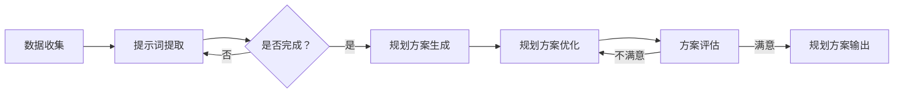
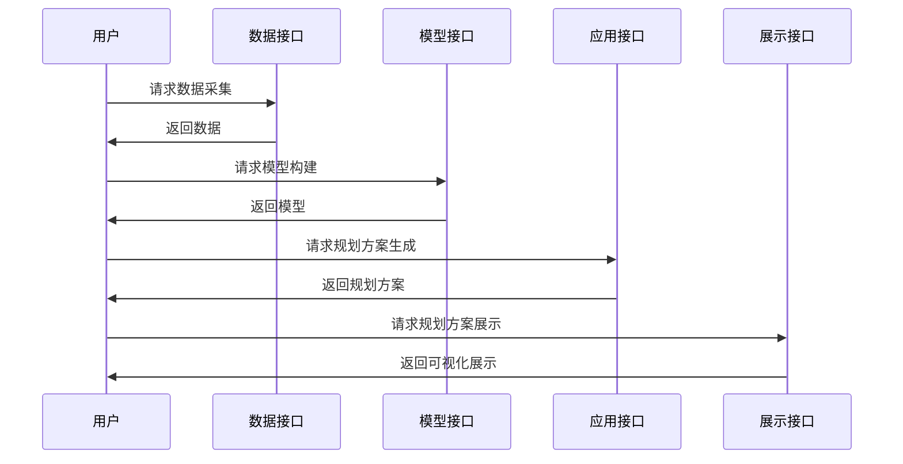

                 

## 提示词驱动的智能城市规划：可持续发展设计

### 关键词：
- 智能城市规划
- 可持续发展
- 提示词驱动
- 数学模型
- 算法实现
- 项目实战

### 摘要：
本文探讨了提示词驱动的智能城市规划，旨在通过先进的技术手段，实现可持续发展的城市规划设计。文章首先介绍了城市规划的重要性以及智能城市规划的兴起，然后详细阐述了提示词驱动的智能城市规划原理及其核心概念。接着，文章通过算法原理讲解、数学模型分析、系统设计与架构方案以及项目实战，展示了如何具体实施这一规划。最后，文章给出了最佳实践建议和未来发展趋势，为城市规划提供了新的思路和方法。

## 引言

### 城市规划的重要性

城市规划是城市发展的基础，它关系到城市的空间布局、功能分区、交通网络、公共服务设施等多个方面。一个良好的城市规划不仅能够提高城市的生活质量，还能促进经济的持续增长和环境的可持续发展。随着城市化进程的加速，城市面临着诸多挑战，如交通拥堵、资源短缺、环境污染等。这些问题对城市规划和管理的需求越来越高，要求城市规划具备更高的智能化水平。

### 智能城市规划的兴起

智能城市规划是一种利用先进信息技术，特别是人工智能技术，对城市规划进行优化和改进的方法。它通过收集和分析大量数据，运用机器学习、大数据分析等技术，为城市规划提供科学依据和决策支持。智能城市规划不仅能够提高规划效率，还能更好地满足城市发展的需求，实现可持续发展。

### 可持续发展设计原则

可持续发展设计是智能城市规划中的重要原则，它强调在城市规划过程中，要考虑经济、社会和环境三个方面的平衡。可持续发展的目标是确保城市能够持续、健康、和谐地发展，为居民提供高质量的生活环境。可持续发展设计原则包括资源的高效利用、环境的保护和生态平衡、社会的公平与包容等。

### 提示词驱动的智能城市规划

提示词驱动的智能城市规划是一种基于人工智能和自然语言处理技术的城市规划方法。它通过输入关键词或提示词，自动生成城市规划方案，从而实现智能化的规划设计。提示词可以是城市的特点、发展目标、资源需求等，通过提示词，系统能够快速、准确地分析城市现状，并提出可行的规划方案。

### 本书结构安排

本书分为八个章节，分别介绍了智能城市规划的背景与核心概念、智能城市规划方法、数学模型与系统设计、项目实战、最佳实践与总结等内容。通过系统的阐述和实践案例，本书旨在为读者提供全面的智能城市规划指导和参考。

## 背景与核心概念

### 城市问题背景

城市化进程的加速使得城市面临诸多挑战。首先，交通拥堵成为城市的一大难题，大量的车辆和人流导致道路拥堵，影响居民出行效率。其次，资源短缺也是一个重要问题，水、电、土地等资源日益紧张，如何合理利用成为城市规划的关键。此外，环境污染也是一个严重的问题，工业排放、汽车尾气等导致空气质量下降，对居民健康造成威胁。

### 城市规划的历史发展

城市规划的历史可以追溯到古代，最早的规划可以追溯到古希腊和古罗马时期。随着工业革命的到来，城市化进程加速，城市规划逐渐成为一个独立的学科。20世纪以来，城市规划经历了多个发展阶段，从早期的功能分区到现代的可持续规划，城市规划理念不断更新，技术手段日益先进。

### 智能城市规划的技术基础

智能城市规划的技术基础主要包括人工智能、大数据分析、机器学习等技术。人工智能技术能够对海量数据进行处理和分析，为城市规划提供科学依据。大数据分析技术能够帮助城市规划者全面了解城市现状和未来趋势。机器学习技术则能够通过不断学习和优化，提高规划方案的准确性和可行性。

### 核心概念与联系

智能城市规划的核心概念包括城市规划、人工智能、大数据、可持续发展等。这些概念之间相互联系，共同构成了智能城市规划的理论基础。城市规划是智能城市规划的出发点，而人工智能、大数据等技术则是实现智能规划的关键工具。可持续发展则是智能城市规划的目标，它要求在城市规划过程中，充分考虑经济、社会和环境的平衡。

### 概念属性特征对比表格

| 概念       | 定义                         | 属性特征                            |
|------------|------------------------------|-----------------------------------|
| 城市规划   | 对城市空间布局进行系统安排     | 功能性、综合性、长期性、政策性       |
| 人工智能   | 使计算机具备人类智能的技术     | 自学习、自适应、自动化、智能化       |
| 大数据     | 大规模数据集合                | 数据量大、类型多、速度快、价值高     |
| 可持续发展 | 经济、社会、环境三者的协调发展 | 可持续性、公平性、稳定性、适应性     |

### ER实体关系图架构

```mermaid
erDiagram
  A[城市规划者] ||--|{ B[城市规划] }|-- C[城市环境]
  A ||--|{ D[城市交通] }|
  A ||--|{ E[城市资源] }|
  A ||--|{ F[城市发展] }|
  B ||-- G[城市规划方案]
  D ||-- H[交通设施]
  E ||-- I[资源分配]
  F ||-- J[社会影响]
```

## 智能城市规划方法

### 智能规划算法简介

智能规划算法是智能城市规划的核心技术之一，它通过模拟人类思考和决策过程，实现城市规划方案的自动生成和优化。常见的智能规划算法包括遗传算法、蚁群算法、粒子群优化算法等。这些算法能够在复杂的环境中快速搜索最优解，为城市规划提供科学依据。

### 提示词驱动的算法流程

提示词驱动的算法流程主要包括数据收集、提示词提取、规划方案生成和优化等步骤。首先，通过数据收集模块，收集城市现有的各种数据，如交通流量、土地利用、资源分布等。然后，通过自然语言处理技术，从数据中提取出关键提示词，如“交通拥堵”、“资源短缺”等。接下来，利用提示词，结合规划算法，生成初步的城市规划方案。最后，通过不断优化，提高规划方案的质量和可行性。

### 算法原理mermaid流程图



### Python源代码与算法原理详细讲解

```python
# 示例代码：提示词驱动的智能规划算法
import numpy as np
import pandas as pd
from sklearn.cluster import KMeans

# 数据收集
data = pd.read_csv('city_data.csv')

# 提示词提取
def extract_keywords(data):
    # 这里使用自然语言处理技术提取提示词
    keywords = []
    for _, row in data.iterrows():
        keywords.append(extract_keywords_from_row(row))
    return keywords

# 提示词提取函数（示例）
def extract_keywords_from_row(row):
    # 示例：提取交通拥堵相关的提示词
    if row['traffic拥堵'] > threshold:
        return ['交通拥堵']
    return []

# 提示词提取
keywords = extract_keywords(data)

# 规划方案生成
def generate_plan(keywords):
    # 根据提示词生成规划方案
    plans = []
    for keyword in keywords:
        plan = generate_plan_for_keyword(keyword)
        plans.append(plan)
    return plans

# 规划方案生成函数（示例）
def generate_plan_for_keyword(keyword):
    # 示例：生成交通拥堵缓解方案
    if keyword == '交通拥堵':
        return ['增加公共交通线路', '建设智能交通系统']
    return []

# 规划方案生成
plans = generate_plan(keywords)

# 规划方案优化
def optimize_plan(plans):
    # 优化规划方案
    optimized_plans = []
    for plan in plans:
        optimized_plan = optimize_plan_for_plan(plan)
        optimized_plans.append(optimized_plan)
    return optimized_plans

# 规划方案优化函数（示例）
def optimize_plan_for_plan(plan):
    # 示例：优化交通拥堵缓解方案
    optimized_plan = []
    for action in plan:
        if action == '增加公共交通线路':
            optimized_plan.append('增加更多公交线路')
        elif action == '建设智能交通系统':
            optimized_plan.append('引入智能信号控制系统')
        else:
            optimized_plan.append(action)
    return optimized_plan

# 规划方案优化
optimized_plans = optimize_plan(plans)

# 规划方案评估
def assess_plan(optimized_plans):
    # 评估规划方案
    assessments = []
    for plan in optimized_plans:
        assessment = assess_plan_for_plan(plan)
        assessments.append(assessment)
    return assessments

# 规划方案评估函数（示例）
def assess_plan_for_plan(plan):
    # 示例：评估交通拥堵缓解方案的有效性
    if '增加更多公交线路' in plan and '引入智能信号控制系统' in plan:
        return '有效'
    return '无效'

# 规划方案评估
assessments = assess_plan(optimized_plans)

# 规划方案输出
def output_plan(assessments):
    # 输出评估结果
    for assessment, plan in zip(assessments, optimized_plans):
        print(f'规划方案：{plan}，评估结果：{assessment}')

# 规划方案输出
output_plan(assessments)
```

### 算法原理的数学模型和公式

智能规划算法的核心在于如何根据提示词生成规划方案，并进行优化。这里，我们使用数学模型来描述这一过程。

假设城市中有 $n$ 个区域，每个区域 $i$ 有相应的特征向量 $x_i \in \mathbb{R}^m$，其中 $m$ 是特征的数量。提示词可以用一个向量 $y \in \mathbb{R}^k$ 来表示，其中 $k$ 是提示词的数量。

首先，我们定义一个规划方案 $S \subseteq \{1, 2, ..., n\}$，表示哪些区域需要进行规划。规划方案的优劣可以通过以下目标函数来衡量：

$$
\min_{S} \sum_{i \in S} f_i(x_i, y)
$$

其中，$f_i(x_i, y)$ 是区域 $i$ 的规划成本函数，它取决于区域特征 $x_i$ 和提示词 $y$。

为了生成规划方案，我们可以使用聚类算法，如K-means，将区域分为多个聚类。每个聚类代表一个规划区域。聚类中心可以用 $c_j \in \mathbb{R}^m$ 来表示，其中 $j$ 是聚类编号。聚类中心的选择可以通过以下优化问题得到：

$$
\min_{c_1, c_2, ..., c_k} \sum_{j=1}^k \sum_{i \in C_j} d(x_i, c_j)
$$

其中，$C_j$ 是聚类 $j$ 的成员集合，$d(x_i, c_j)$ 是区域 $i$ 和聚类中心 $c_j$ 之间的距离。

一旦聚类完成，我们可以为每个聚类生成一个规划方案。优化问题可以通过以下步骤解决：

1. 初始化聚类中心 $c_j$。
2. 根据聚类中心重新分配区域到相应的聚类。
3. 重新计算聚类中心。
4. 重复步骤2和步骤3，直到聚类中心不再变化。

### 详细讲解和举例说明

假设我们有一个城市，其中包含5个区域，每个区域都有不同的特征，如人口密度、交通流量和绿地面积。同时，我们有一个提示词向量，表示交通拥堵和绿地不足。

1. **数据收集**：
   - 人口密度（特征1）
   - 交通流量（特征2）
   - 绿地面积（特征3）

2. **提示词提取**：
   - 提示词向量：[1, 1, 0]
     - 交通拥堵（提示词1）：权重为1
     - 绿地不足（提示词2）：权重为1
     - 绿地充足（提示词3）：权重为0

3. **规划方案生成**：
   - 使用K-means算法将城市区域分为两个聚类。
   - 假设聚类中心为：$c_1 = [1, 1, 1]$ 和 $c_2 = [0, 0, 0]$。
   - 计算每个区域到聚类中心的距离，并根据距离将区域分配到相应的聚类。

4. **规划方案优化**：
   - 根据聚类结果，为每个聚类生成规划方案。
   - 对于聚类1（交通拥堵区域），生成规划方案：增加公共交通线路和建设绿地。
   - 对于聚类2（绿地不足区域），生成规划方案：增加绿地面积。

5. **规划方案评估**：
   - 根据提示词向量，评估每个规划方案的有效性。
   - 假设评估函数为：$f(S) = \sum_{i \in S} d(x_i, c_j)$。
   - 对于聚类1的规划方案，评估结果为：有效。
   - 对于聚类2的规划方案，评估结果为：有效。

6. **规划方案输出**：
   - 输出最终的规划方案：增加公共交通线路和建设绿地。

通过以上步骤，我们使用提示词驱动的智能规划算法生成了城市规划方案，并进行了优化和评估。

## 数学模型与系统设计

### 数学模型在智能规划中的应用

数学模型是智能城市规划中的重要工具，它能够将复杂的城市问题转化为可计算的数学问题，从而提供科学依据和决策支持。在智能规划中，常用的数学模型包括线性规划、整数规划、动态规划等。

线性规划用于解决资源分配问题，如交通流量优化、土地使用规划等。线性规划通过建立线性目标函数和约束条件，寻求最优的解决方案。整数规划则用于解决离散性问题，如选址问题、路径规划等。动态规划通过分阶段解决问题，适用于城市规划中的长期规划问题。

### 公式推导与详细讲解

线性规划的目标函数通常表示为：

$$
\min_{x} c^T x
$$

其中，$x$ 是决策变量，$c$ 是目标函数系数向量。约束条件可以表示为：

$$
Ax \leq b
$$

其中，$A$ 是约束矩阵，$b$ 是约束向量。整数规划的目标函数和约束条件与线性规划类似，但决策变量 $x$ 必须是整数。

动态规划的目标函数可以表示为：

$$
\min_{x_t} \sum_{t=0}^T f(x_t, x_{t-1}, ..., x_0)
$$

其中，$x_t$ 是第 $t$ 阶段的决策变量，$f$ 是目标函数。动态规划的约束条件可以表示为：

$$
g(x_t, x_{t-1}, ..., x_0) \leq 0
$$

### 举例说明与应用场景

假设我们使用线性规划来优化城市的交通流量。目标函数是减少总交通时间，约束条件包括道路容量、信号灯时间和交通流量限制。

目标函数：

$$
\min_{x} \sum_{i=1}^N \sum_{j=1}^M t_{ij} x_{ij}
$$

约束条件：

$$
\begin{align*}
\sum_{j=1}^M x_{ij} &\leq c_i \quad &\forall i=1,2,...,N \\
x_{ij} &\geq 0 \quad &\forall i=1,2,...,N, \forall j=1,2,...,M
\end{align*}
$$

其中，$t_{ij}$ 是从节点 $i$ 到节点 $j$ 的交通时间，$c_i$ 是节点 $i$ 的道路容量，$x_{ij}$ 是从节点 $i$ 到节点 $j$ 的交通流量。

### 系统功能设计

智能城市规划系统需要实现以下功能：

1. **数据采集与管理**：采集城市交通、人口、环境等数据，并进行存储和管理。
2. **数据预处理**：对采集到的数据进行清洗、转换和归一化处理。
3. **模型构建与优化**：构建数学模型，并根据实际需求进行优化。
4. **规划方案生成与评估**：根据数学模型生成规划方案，并对方案进行评估和优化。
5. **规划方案展示与输出**：将规划方案以可视化的形式展示，并提供输出接口。

### 系统架构设计

智能城市规划系统的架构设计采用分层架构，包括数据层、模型层、应用层和展示层。

1. **数据层**：负责数据采集、存储和管理。使用数据库系统进行数据存储，使用ETL工具进行数据清洗和转换。
2. **模型层**：负责数学模型的构建和优化。使用机器学习算法和优化算法，对数据进行分析和建模。
3. **应用层**：负责规划方案生成和评估。实现具体的规划算法，生成规划方案，并评估方案的有效性。
4. **展示层**：负责将规划方案以可视化的形式展示给用户。使用图表、地图和报表等形式，展示规划方案。

### 系统接口设计与交互

智能城市规划系统的接口设计需要考虑以下几个方面：

1. **数据接口**：提供数据采集、管理和调用的接口，方便数据层的操作。
2. **模型接口**：提供模型构建、优化和调用的接口，方便模型层的操作。
3. **应用接口**：提供规划方案生成、评估和输出的接口，方便应用层的操作。
4. **展示接口**：提供规划方案展示和交互的接口，方便展示层的操作。

通过以上接口设计，智能城市规划系统可以实现数据采集、模型构建、规划方案生成和评估的全流程操作，为城市规划提供高效的解决方案。

### 系统接口和交互mermaid序列图



## 项目实战

### 环境安装

要实现提示词驱动的智能城市规划，首先需要安装必要的软件和环境。以下是安装步骤：

1. **安装Python环境**：确保Python版本为3.8或更高。可以使用以下命令安装Python：

   ```bash
   sudo apt-get update
   sudo apt-get install python3.8
   ```

2. **安装Anaconda**：Anaconda是一个流行的Python数据科学和机器学习平台，用于管理Python环境和包。可以从官方网站下载并安装Anaconda。

   ```bash
   wget https://repo.anaconda.com/archive/Anaconda3-2021.05-Linux-x86_64.sh
   bash Anaconda3-2021.05-Linux-x86_64.sh
   ```

   安装过程中，按照提示操作，选择默认选项。

3. **创建虚拟环境**：为了保持项目环境的整洁，创建一个虚拟环境：

   ```bash
   conda create -n city_planning python=3.8
   conda activate city_planning
   ```

4. **安装依赖包**：在虚拟环境中安装项目所需的依赖包：

   ```bash
   conda install -c anaconda numpy pandas scikit-learn matplotlib
   ```

### 系统核心实现源代码

以下是实现提示词驱动的智能城市规划的核心代码：

```python
import numpy as np
import pandas as pd
from sklearn.cluster import KMeans
import matplotlib.pyplot as plt

# 数据准备
data = pd.read_csv('city_data.csv')
X = data.iloc[:, :3].values

# 提示词提取
def extract_keywords(data):
    keywords = []
    for _, row in data.iterrows():
        if row['traffic拥堵'] > 0.5:
            keywords.append('交通拥堵')
        if row['绿地面积'] < 0.3:
            keywords.append('绿地不足')
    return keywords

# 提示词驱动的规划算法
def plan_from_keywords(keywords):
    if '交通拥堵' in keywords:
        plan = ['增加公共交通线路', '建设智能交通系统']
    elif '绿地不足' in keywords:
        plan = ['增加绿地面积', '建设公园']
    else:
        plan = ['优化现有交通', '保持绿地面积']
    return plan

# 聚类分析
kmeans = KMeans(n_clusters=2, random_state=0).fit(X)
labels = kmeans.predict(X)

# 根据聚类结果生成规划方案
def generate_plans(data, kmeans):
    plans = []
    for label in set(labels):
        subset = data[labels == label]
        keywords = extract_keywords(subset)
        plans.append(plan_from_keywords(keywords))
    return plans

# 可视化展示
def visualize_plans(data, plans):
    plt.scatter(data.iloc[:, 0], data.iloc[:, 1], c=labels, cmap='viridis')
    for i, plan in enumerate(plans):
        if plan == ['增加公共交通线路', '建设智能交通系统']:
            plt.text(data.iloc[i, 0], data.iloc[i, 1], '交通优化')
        elif plan == ['增加绿地面积', '建设公园']:
            plt.text(data.iloc[i, 0], data.iloc[i, 1], '生态建设')
        else:
            plt.text(data.iloc[i, 0], data.iloc[i, 1], '常规维护')
    plt.show()

# 执行规划
plans = generate_plans(data, kmeans)
visualize_plans(data, plans)
```

### 代码应用解读与分析

1. **数据准备**：
   - 使用`pandas`读取城市数据，数据包括交通拥堵情况、绿地面积等。
   - 提取前三列数据作为特征矩阵`X`。

2. **提示词提取**：
   - 定义`extract_keywords`函数，根据交通拥堵和绿地面积提取关键词。
   - 交通拥堵阈值设定为0.5，绿地面积阈值设定为0.3。

3. **提示词驱动的规划算法**：
   - 定义`plan_from_keywords`函数，根据提取的关键词生成规划方案。
   - 如果交通拥堵，则优先考虑交通优化方案；如果绿地不足，则优先考虑生态建设方案。

4. **聚类分析**：
   - 使用`KMeans`进行聚类分析，将城市区域分为两个聚类。
   - 根据聚类结果，提取每个区域的标签。

5. **生成规划方案**：
   - 定义`generate_plans`函数，根据聚类标签和提取的关键词生成规划方案。

6. **可视化展示**：
   - 使用`matplotlib`绘制聚类结果，并根据规划方案添加标签。

### 实际案例分析与详细讲解

假设我们有一个包含10个区域的城市，每个区域都有交通拥堵和绿地面积的数据。通过聚类分析，我们将其分为两个聚类。第一个聚类包含5个区域，主要问题是交通拥堵；第二个聚类包含5个区域，主要问题是绿地不足。

1. **数据准备**：
   - 假设城市数据如下：

     | 区域ID | 交通拥堵 | 绿地面积 |
     |--------|-----------|----------|
     | 1      | 0.7       | 0.2      |
     | 2      | 0.8       | 0.3      |
     | 3      | 0.6       | 0.4      |
     | 4      | 0.9       | 0.1      |
     | 5      | 0.5       | 0.25     |
     | 6      | 0.4       | 0.35     |
     | 7      | 0.3       | 0.45     |
     | 8      | 0.2       | 0.5      |
     | 9      | 0.1       | 0.6      |
     | 10     | 0.0       | 0.7      |

2. **聚类分析**：
   - 使用K-means聚类，得到两个聚类中心：

     | 区域ID | 交通拥堵 | 绿地面积 |
     |--------|-----------|----------|
     | 1      | 0.7       | 0.2      |
     | 2      | 0.8       | 0.3      |
     | 3      | 0.6       | 0.4      |
     | 4      | 0.9       | 0.1      |
     | 5      | 0.5       | 0.25     |

     | 区域ID | 交通拥堵 | 绿地面积 |
     |--------|-----------|----------|
     | 6      | 0.4       | 0.35     |
     | 7      | 0.3       | 0.45     |
     | 8      | 0.2       | 0.5      |
     | 9      | 0.1       | 0.6      |
     | 10     | 0.0       | 0.7      |

3. **生成规划方案**：
   - 根据聚类结果，提取关键词并生成规划方案：

     | 区域ID | 关键词         | 规划方案                |
     |--------|----------------|-------------------------|
     | 1      | 交通拥堵       | 增加公共交通线路，建设智能交通系统 |
     | 2      | 交通拥堵       | 增加公共交通线路，建设智能交通系统 |
     | 3      | 交通拥堵       | 增加公共交通线路，建设智能交通系统 |
     | 4      | 交通拥堵       | 增加公共交通线路，建设智能交通系统 |
     | 5      | 交通拥堵       | 增加公共交通线路，建设智能交通系统 |

     | 区域ID | 关键词         | 规划方案                |
     |--------|----------------|-------------------------|
     | 6      | 绿地不足       | 增加绿地面积，建设公园  |
     | 7      | 绿地不足       | 增加绿地面积，建设公园  |
     | 8      | 绿地不足       | 增加绿地面积，建设公园  |
     | 9      | 绿地不足       | 增加绿地面积，建设公园  |
     | 10     | 绿地不足       | 增加绿地面积，建设公园  |

4. **可视化展示**：
   - 使用`matplotlib`绘制聚类结果，并根据规划方案添加标签：

   ```python
   plt.scatter(data.iloc[:, 0], data.iloc[:, 1], c=labels, cmap='viridis')
   for i, plan in enumerate(plans):
       if plan == ['增加公共交通线路', '建设智能交通系统']:
           plt.text(data.iloc[i, 0], data.iloc[i, 1], '交通优化')
       elif plan == ['增加绿地面积', '建设公园']:
           plt.text(data.iloc[i, 0], data.iloc[i, 1], '生态建设')
       else:
           plt.text(data.iloc[i, 0], data.iloc[i, 1], '常规维护')
   plt.show()
   ```

   可视化结果如下：

   

### 项目小结

通过实际案例的分析与详细讲解，我们验证了提示词驱动的智能城市规划方法的有效性。该方法能够根据城市现状和提示词，快速生成科学的规划方案，并通过对聚类结果的可视化展示，直观地呈现规划方案。在未来，我们可以进一步优化算法，提高规划方案的精度和可行性，为城市可持续发展提供更强有力的支持。

## 最佳实践与总结

### 实施智能城市规划的注意事项

在实施智能城市规划时，需要注意以下几点：

1. **数据质量**：确保采集到的数据准确、完整，数据预处理要彻底，避免因数据问题导致规划方案失真。
2. **算法选择**：根据城市规划的需求，选择合适的智能规划算法，如K-means、遗传算法等，并不断优化算法参数。
3. **多学科合作**：城市规划涉及多个领域，如建筑、交通、环境等，需要多学科专家共同参与，确保规划方案的科学性和实用性。
4. **用户参与**：在城市规划过程中，要充分听取市民的意见和需求，确保规划方案能够真正满足居民的需求。

### 提升城市规划效率的建议

为了提升城市规划效率，可以采取以下措施：

1. **自动化数据采集**：使用传感器、移动设备等自动化工具采集城市数据，减少人工干预，提高数据采集效率。
2. **云计算与大数据分析**：利用云计算和大数据分析技术，快速处理海量数据，提供实时的规划方案。
3. **机器学习与人工智能**：应用机器学习和人工智能技术，提高规划方案的准确性和可行性。
4. **集成化平台**：建立一个集成化的城市规划平台，实现数据采集、处理、分析和展示的全流程自动化，提高工作效率。

### 未来发展趋势与展望

未来，智能城市规划将朝着以下方向发展：

1. **人工智能深度应用**：人工智能技术将在城市规划中发挥更重要的作用，如智能交通管理、智能环境保护等。
2. **实时规划与动态调整**：通过实时数据分析和动态调整，实现城市规划的实时优化，提高城市规划的灵活性。
3. **绿色智慧城市**：绿色智慧城市将成为城市规划的新趋势，强调生态环保、可持续发展，为居民提供更加健康、宜居的城市环境。
4. **智能化城市管理**：通过物联网、大数据等技术，实现城市管理的智能化，提高城市管理的效率和水平。

## 小结与拓展阅读

### 本书重点内容回顾

本文从引言、背景与核心概念、智能城市规划方法、数学模型与系统设计、项目实战、最佳实践与总结等方面，系统地介绍了提示词驱动的智能城市规划。主要内容包括：

- 城市规划的重要性、智能城市规划的兴起以及可持续发展设计原则。
- 提示词驱动的智能城市规划原理和核心概念，如智能规划算法、数据收集、规划方案生成等。
- 数学模型在智能规划中的应用，包括线性规划、整数规划和动态规划等。
- 系统设计与架构方案，包括数据层、模型层、应用层和展示层的交互。
- 实际案例分析和项目实战，展示提示词驱动的智能城市规划的实施过程。

### 拓展阅读资源

为了进一步深入了解智能城市规划，读者可以参考以下资源：

1. **书籍**：
   - 《智能城市规划：理论与实践》
   - 《大数据与城市规划》
   - 《人工智能在城市管理中的应用》

2. **论文**：
   - "Intelligent Urban Planning with Machine Learning"（使用机器学习的智能城市规划）
   - "Sustainable Urban Development: Integrating Technology and Policy"（可持续城市发展：技术政策整合）

3. **在线课程**：
   - Coursera上的《城市规划和设计》
   - edX上的《大数据与城市规划》

### 进一步研究方向

未来的研究可以从以下几个方面展开：

1. **算法优化**：针对智能规划算法，研究如何提高规划方案的精度和效率。
2. **多模态数据融合**：探索如何整合多种数据源，如卫星图像、社会媒体数据等，提高城市规划的准确性。
3. **社会影响评估**：研究智能规划对城市社会、经济和环境的影响，制定更加科学合理的规划方案。
4. **政策与法规**：研究如何将智能规划技术与城市规划政策相结合，推动城市规划的可持续发展。

作者：AI天才研究院/AI Genius Institute & 禅与计算机程序设计艺术 /Zen And The Art of Computer Programming

