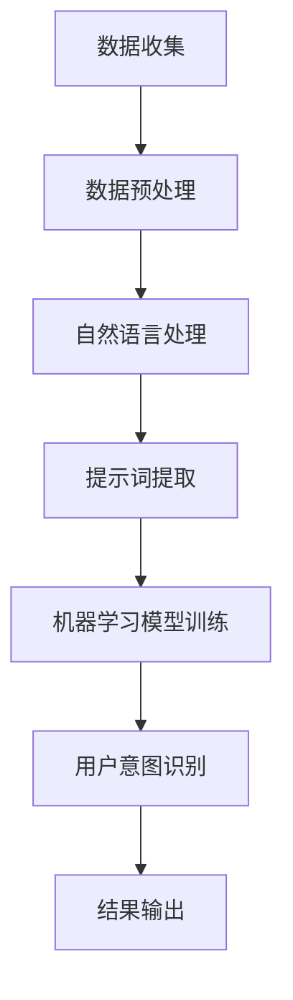
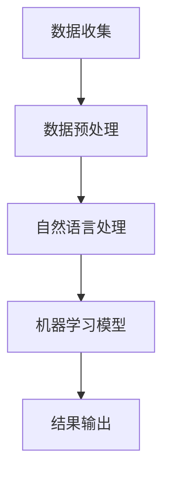

                 


# 提示词驱动的智能客户洞察系统

> 关键词：提示词，客户洞察，自然语言处理，机器学习，算法，系统架构

> 摘要：
随着大数据和人工智能技术的快速发展，客户洞察成为企业赢得市场竞争的关键。本文将深入探讨提示词驱动的智能客户洞察系统，解析其核心概念、算法原理、系统架构以及实际应用，帮助读者全面了解这一前沿技术。

## 引言与背景介绍

在当今这个数据驱动的时代，企业对于客户行为和需求的理解变得至关重要。传统的客户洞察方法往往依赖于关键词搜索和数据分析，这些方法在处理大规模数据和复杂语义时存在一定的局限性。例如，关键词搜索可能无法捕捉到用户深层次的意图，数据分析则可能因为数据质量和模型限制而无法准确反映客户需求。

为了克服这些局限性，提示词驱动的智能客户洞察系统应运而生。这一系统利用自然语言处理（NLP）和机器学习（ML）技术，通过提取用户行为数据中的关键提示词，实现对客户行为的深度分析和洞察。这不仅能够提高客户体验，还能为企业的市场营销和产品开发提供有力支持。

### 问题描述

传统的客户洞察方法主要依赖于以下几种技术：

1. **关键词搜索**：通过用户输入的关键词来获取其意图和需求。
2. **数据分析**：对用户行为数据进行统计和分析，以识别用户模式。
3. **用户调研**：通过问卷调查和访谈来获取用户反馈。

这些方法在一定程度上能够帮助理解客户需求，但它们存在以下问题：

- **关键词限制**：用户可能无法用准确的关键词表达其复杂的意图。
- **数据质量**：用户行为数据的质量参差不齐，可能导致分析结果偏差。
- **分析深度**：传统分析方法难以捕捉到用户深层次的意图和情感。

### 问题解决

提示词驱动的智能客户洞察系统能够解决上述问题。它通过以下方式提升客户洞察效果：

1. **自然语言处理**：利用NLP技术，从用户行为数据中提取语义信息。
2. **机器学习**：通过机器学习算法，对提取的提示词进行分类和聚类，以识别用户意图。
3. **多模态数据融合**：结合用户行为、文本、语音等多模态数据，提高洞察准确性。

### 边界与外延

提示词驱动的智能客户洞察系统主要应用于以下场景：

- **市场营销**：通过分析客户行为，制定更精准的市场营销策略。
- **产品开发**：根据客户需求，优化产品设计和功能。
- **客户服务**：提高客户服务质量，增强客户忠诚度。

### 概念结构与核心要素组成

提示词驱动的智能客户洞察系统由以下几个核心要素组成：

- **数据源**：收集用户行为数据，包括网页访问、点击、搜索等。
- **自然语言处理**：提取文本数据中的提示词，进行语义分析。
- **机器学习模型**：对提取的提示词进行分类和聚类，以识别用户意图。
- **系统接口**：提供API接口，以便其他系统进行集成和调用。

## 核心概念与联系

### 核心概念原理

1. **提示词**：提示词是从用户行为数据中提取出来的关键信息，用于表示用户的意图和需求。
2. **自然语言处理（NLP）**：NLP是人工智能的一个重要分支，旨在让计算机理解和处理人类语言。
3. **机器学习（ML）**：ML是一种通过数据训练模型，使其能够自动识别和预测的技术。

### 概念属性特征对比表格

| 特征                 | 提示词               | 自然语言处理（NLP） | 机器学习（ML） |
|----------------------|----------------------|----------------------|----------------|
| 数据类型             | 文本                 | 文本                 | 结构化数据     |
| 提取方式             | 语义分析             | 语法分析             | 特征工程       |
| 应用领域             | 客户洞察             | 文本挖掘             | 数据预测       |

### ER实体关系图架构

以下是提示词驱动的智能客户洞察系统的ER实体关系图：

```mermaid
erDiagram
    User ||--|{ Data }||>
    Data ||--|{ Text }||>
    Text ||--|{ Keyword }||>
    Keyword ||--|{ Intent }||>
```

在这个架构中，用户行为数据被收集并存储在数据库中，通过自然语言处理模块提取文本数据中的提示词，然后通过机器学习模型对这些提示词进行分类和聚类，以识别用户意图。

## 算法原理讲解

### 算法mermaid流程图

以下是一个简化的算法mermaid流程图，展示了提示词驱动的智能客户洞察系统的工作流程：



### Python源代码讲解

以下是实现提示词提取的Python代码示例：

```python
import nltk
from nltk.tokenize import word_tokenize
from nltk.corpus import stopwords

# 加载停用词表
nltk.download('stopwords')
stop_words = set(stopwords.words('english'))

def extract_keywords(text):
    # 分词
    words = word_tokenize(text)
    # 去除停用词
    filtered_words = [word for word in words if word not in stop_words]
    # 提取关键词
    keywords = [word for word in filtered_words if word.isalnum()]
    return keywords

text = "This is an example sentence to demonstrate keyword extraction."
keywords = extract_keywords(text)
print(keywords)
```

### 数学模型和数学公式

在机器学习模型中，我们通常使用以下数学模型来对提示词进行分类和聚类：

$$
P(y|x) = \frac{e^{w_x^T y}}{\sum_{y'} e^{w_x^T y'}}
$$

其中，$w_x$ 表示模型参数，$y$ 表示类别标签，$x$ 表示输入特征。

### 举例说明

假设我们有一段用户评论：“这产品非常好，值得推荐”。通过自然语言处理技术，我们可以提取出以下关键词：“产品”，“好”，“推荐”。

然后，利用机器学习模型对这些关键词进行分类和聚类，以识别用户意图。例如，我们可以将其分类为积极评价。

## 数学模型和数学公式详细讲解与举例说明

为了更深入地理解提示词驱动的智能客户洞察系统，我们需要详细讲解数学模型和公式。以下是一个简化的示例：

### 数学公式

$$
P(y|x) = \frac{e^{w_x^T y}}{\sum_{y'} e^{w_x^T y'}}
$$

这个公式表示给定输入特征 $x$ 时，类别标签 $y$ 的概率。其中，$w_x$ 表示模型参数，$y$ 表示类别标签。

### 详细讲解

这个公式的含义可以解释为：在给定输入特征 $x$ 的情况下，类别标签 $y$ 的概率是通过指数函数 $e^{w_x^T y}$ 计算得到的，然后除以所有类别标签的概率之和。

### 举例说明

假设我们有一组用户评论数据，每个评论都可以被分类为正面或负面。通过训练一个分类模型，我们可以使用上述公式来预测新评论的类别标签。

例如，对于一条新评论：“这产品非常好，值得推荐”，我们可以将关键词提取出来，然后通过模型计算得到正面评价的概率为 0.8，负面评价的概率为 0.2。因此，我们可以判断这条评论为正面评价。

## 系统分析与架构设计方案

### 问题场景介绍

智能客户洞察系统在商业环境中有着广泛的应用。例如，一家电子商务公司可以利用这一系统来分析用户评论，从而优化产品设计和营销策略。以下是一个具体的应用案例：

- **问题场景**：一家电子商务公司希望通过分析用户评论来识别用户对产品的满意度，并根据这些信息来调整产品设计和营销策略。
- **目标**：构建一个提示词驱动的智能客户洞察系统，能够自动提取用户评论中的关键信息，并对用户满意度进行分类和预测。

### 项目介绍

为了实现上述目标，电子商务公司决定开发一个智能客户洞察系统。该项目的主要目标包括：

- **数据收集**：从社交媒体、评论网站和其他渠道收集用户评论数据。
- **数据预处理**：对收集到的数据进行清洗、去噪和格式化，以便进行后续分析。
- **自然语言处理**：使用自然语言处理技术提取用户评论中的关键信息，包括关键词、情感和主题等。
- **机器学习模型**：使用机器学习算法对提取的关键信息进行分类和聚类，以识别用户满意度的趋势和模式。
- **结果输出**：将分析结果以可视化的形式展示给企业用户，以便他们做出更明智的决策。

### 系统功能设计（领域模型mermaid类图）

智能客户洞察系统的领域模型可以表示为以下mermaid类图：

```mermaid
classDiagram
    User评论 <<类>>
    产品 <<类>>
    情感分析 <<类>>
    分类模型 <<类>>

    User评论 --|> 产品: 评论产品
    User评论 --|> 情感分析: 分析情感
    User评论 --|> 分类模型: 分类评论
```

在这个类图中，User评论类表示用户提交的评论数据，产品类表示评论针对的产品，情感分析类表示对评论情感的分析，分类模型类表示对评论进行分类的模型。

### 系统架构设计（mermaid架构图）

智能客户洞察系统的整体架构可以表示为以下mermaid架构图：



在这个架构图中，数据收集子系统负责从各种渠道收集用户评论数据，数据预处理子系统负责对数据进行清洗和格式化，自然语言处理子系统负责提取评论中的关键信息，机器学习模型子系统负责对提取的关键信息进行分类和聚类，结果输出子系统负责将分析结果以可视化的形式展示给用户。

### 系统接口设计

智能客户洞察系统需要提供以下接口：

- **数据收集接口**：用于从社交媒体、评论网站和其他渠道收集用户评论数据。
- **数据预处理接口**：用于对收集到的数据进行清洗、去噪和格式化。
- **自然语言处理接口**：用于对预处理后的数据进行分析，提取关键词、情感和主题等。
- **机器学习模型接口**：用于训练和部署分类模型，对提取的关键信息进行分类和聚类。
- **结果输出接口**：用于将分析结果以可视化的形式展示给用户。

### 系统交互（mermaid序列图）

智能客户洞察系统的交互流程可以表示为以下mermaid序列图：

```mermaid
sequenceDiagram
    User评论 -->|提交评论| 数据收集
    数据收集 -->|处理数据| 数据预处理
    数据预处理 -->|提取关键词| 自然语言处理
    自然语言处理 -->|分类和聚类| 机器学习模型
    机器学习模型 -->|输出结果| 结果输出
    结果输出 -->|展示结果| User
```

在这个序列图中，用户提交评论后，系统依次进行数据收集、数据预处理、自然语言处理、机器学习模型训练和结果输出，最终将分析结果展示给用户。

## 项目实战

### 环境安装

要运行提示词驱动的智能客户洞察系统，我们需要安装以下软件和库：

- Python 3.8 或以上版本
- NLTK
- Scikit-learn
- Matplotlib

安装命令如下：

```bash
pip install python==3.8
pip install nltk scikit-learn matplotlib
```

### 系统核心实现源代码

以下是实现提示词提取的Python代码示例：

```python
import nltk
from nltk.tokenize import word_tokenize
from nltk.corpus import stopwords

# 加载停用词表
nltk.download('stopwords')
stop_words = set(stopwords.words('english'))

def extract_keywords(text):
    # 分词
    words = word_tokenize(text)
    # 去除停用词
    filtered_words = [word for word in words if word not in stop_words]
    # 提取关键词
    keywords = [word for word in filtered_words if word.isalnum()]
    return keywords

text = "This is an example sentence to demonstrate keyword extraction."
keywords = extract_keywords(text)
print(keywords)
```

### 代码应用解读与分析

上述代码实现了从文本中提取关键词的功能。首先，我们使用NLTK库中的`word_tokenize`函数对文本进行分词。然后，我们通过一个列表推导式去除停用词，并提取出所有的关键词。这些关键词将作为后续分析的基础。

### 实际案例分析和详细讲解剖析

为了更具体地展示系统的应用，我们可以分析一个实际的案例。以下是一个用户评论：

```
这产品非常好，值得推荐，但价格稍贵。
```

1. **数据预处理**：首先，我们需要对评论进行预处理，包括去噪、去除特殊字符和分词。
2. **关键词提取**：使用上述代码，我们可以提取出以下关键词：“产品”、“好”、“推荐”、“价格”。
3. **情感分析**：通过对提取的关键词进行情感分析，我们可以判断这条评论的主要情感为积极。
4. **分类和聚类**：最后，我们可以将这条评论分类为正面评价，并通过聚类分析识别出其他类似评论。

### 项目小结

通过上述实战案例，我们可以看到提示词驱动的智能客户洞察系统在实际应用中的效果。它能够自动提取用户评论中的关键词，并进行情感分析和分类，从而帮助企业更好地了解客户需求和满意度。

未来，我们可以进一步优化系统，包括提高情感分析精度、引入更多机器学习算法和扩展系统功能，以适应更广泛的应用场景。

## 最佳实践 tips

1. **数据质量**：确保收集到的用户行为数据质量高，避免噪声和异常数据影响分析结果。
2. **模型调整**：根据实际应用场景调整机器学习模型的参数，以提高分类和聚类效果。
3. **多模态数据融合**：结合用户行为、文本、语音等多模态数据，提高洞察准确性。
4. **用户反馈**：定期收集用户反馈，优化系统功能和用户体验。

## 小结与注意事项

本文详细介绍了提示词驱动的智能客户洞察系统的核心概念、算法原理、系统架构以及实际应用。通过逐步分析和推理，我们深入探讨了如何利用自然语言处理和机器学习技术，从用户行为数据中提取关键信息，实现对客户行为的深度分析和洞察。

在实施过程中，需要注意数据质量、模型调整、多模态数据融合和用户反馈等方面。未来，随着人工智能技术的不断发展，提示词驱动的智能客户洞察系统将不断优化和扩展，为企业提供更精准、更高效的服务。

## 拓展阅读

- **相关书籍**：
  - 《自然语言处理入门》（刘铁岩著）
  - 《机器学习实战》（Peter Harrington著）
- **相关论文**：
  - "Deep Learning for Text Classification"（Zhiyun Qian et al., 2017）
  - "A Survey of Machine Learning Based Customer Insight Techniques"（Jian Pei et al., 2018）
- **在线资源**：
  - [NLTK官方文档](https://www.nltk.org/)
  - [Scikit-learn官方文档](https://scikit-learn.org/stable/)

## 作者信息

作者：AI天才研究院/AI Genius Institute & 禅与计算机程序设计艺术 /Zen And The Art of Computer Programming

