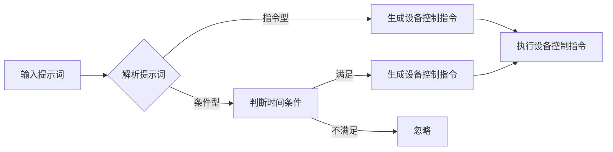
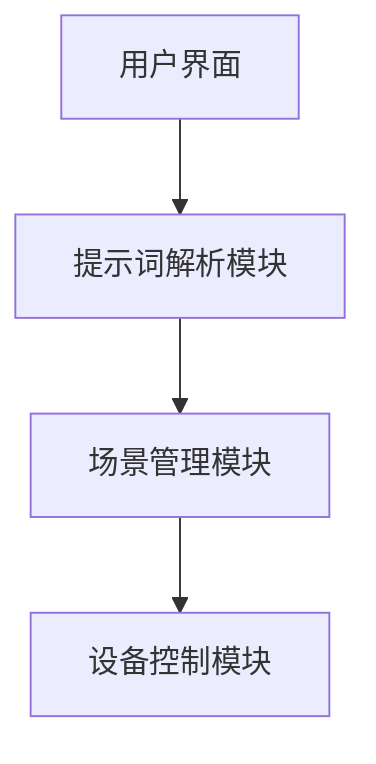

                 


## # 提示词驱动的智能家居场景编排系统

> 关键词：智能家居、场景编排、提示词驱动、系统设计、算法原理

> 摘要：本文将深入探讨提示词驱动的智能家居场景编排系统的概念、原理和实现方法。通过系统的设计和实现，提高用户的居住体验和自动化程度，为智能家居领域的发展提供新的思路。

### 1. 引言

随着物联网技术的发展，智能家居系统逐渐走进了千家万户。智能家居系统通过互联网连接家庭内的各种设备，实现设备间的互联互通，提供更加便捷、智能的居住体验。然而，现有的智能家居系统在场景编排方面存在一定的局限性，难以满足用户多样化的需求。

为了解决这一问题，本文提出了一种提示词驱动的智能家居场景编排系统。该系统利用提示词作为场景编排的驱动因素，通过智能算法将用户的指令转化为具体的设备控制指令，实现智能家居场景的自动编排和切换。

### 2. 背景与核心概念

#### 2.1 问题背景

智能家居系统的发展已经取得了一定的成果，然而在实际应用中，用户仍然面临以下问题：

- 场景编排复杂：用户需要手动设置场景，操作繁琐。
- 智能度不高：现有系统无法根据用户行为和需求自动调整场景。
- 设备兼容性问题：不同品牌的设备之间难以实现无缝连接和协同工作。

#### 2.2 核心概念

- 提示词（Prompt）：用于描述用户需求的关键词或短语。
- 场景（Scene）：由一组设备组成的自动化场景。
- 场景编排（Scene Composition）：根据用户需求自动调整场景的过程。

### 3. 提示词驱动的系统原理

#### 3.1 概念与工作原理

提示词驱动的智能家居场景编排系统通过以下步骤实现：

1. 用户输入提示词。
2. 系统分析提示词，理解用户需求。
3. 根据用户需求，系统自动编排场景。
4. 设备根据场景指令执行相应的操作。

#### 3.2 提示词类型

- 指令型提示词：如“打开空调”。
- 条件型提示词：如“晚上10点后，打开客厅灯”。
- 关联型提示词：如“天气冷，加热水器加热”。

#### 3.3 场景编排算法

场景编排算法根据用户输入的提示词，将用户需求转化为具体的设备控制指令。以下是一个简单的算法流程：



### 4. 系统设计与实现

#### 4.1 系统架构

提示词驱动的智能家居场景编排系统主要由以下几个模块组成：

- 提示词解析模块：负责解析用户输入的提示词。
- 场景管理模块：负责管理场景的创建、更新和删除。
- 设备控制模块：负责执行场景中的设备控制指令。
- 用户界面模块：提供用户输入提示词的界面。

以下是一个简单的系统架构图：



#### 4.2 系统实现

系统实现主要分为以下几个步骤：

1. 设计数据库模型，存储用户、设备、场景等信息。
2. 实现提示词解析模块，支持多种类型的提示词。
3. 实现场景管理模块，提供场景的创建、更新和删除功能。
4. 实现设备控制模块，支持与设备的通信和控制。
5. 实现用户界面模块，提供友好的用户交互界面。

以下是一个简单的Python实现示例：

```python
class SceneCompositionSystem:
    def __init__(self):
        self.devices = []
        self.scenes = []

    def add_device(self, device):
        self.devices.append(device)

    def create_scene(self, name, devices):
        scene = Scene(name, devices)
        self.scenes.append(scene)

    def execute_scene(self, name):
        for scene in self.scenes:
            if scene.name == name:
                for device in scene.devices:
                    device.execute()
```

### 5. 项目实战

在本节中，我们将通过一个实际项目来展示提示词驱动的智能家居场景编排系统的应用。

#### 5.1 环境安装

1. 安装Python环境（版本3.6及以上）。
2. 安装依赖库：`pip install flask pandas numpy`。

#### 5.2 系统核心实现

以下是系统的核心实现代码：

```python
from flask import Flask, request, jsonify
import pandas as pd

app = Flask(__name__)

class Device:
    def __init__(self, name, status):
        self.name = name
        self.status = status

    def execute(self):
        print(f"{self.name} is {self.status}")

class Scene:
    def __init__(self, name, devices):
        self.name = name
        self.devices = devices

@app.route('/add_device', methods=['POST'])
def add_device():
    device_data = request.get_json()
    device = Device(device_data['name'], device_data['status'])
    system.add_device(device)
    return jsonify({"status": "success"})

@app.route('/create_scene', methods=['POST'])
def create_scene():
    scene_data = request.get_json()
    scene = Scene(scene_data['name'], scene_data['devices'])
    system.create_scene(scene)
    return jsonify({"status": "success"})

@app.route('/execute_scene', methods=['POST'])
def execute_scene():
    scene_data = request.get_json()
    system.execute_scene(scene_data['name'])
    return jsonify({"status": "success"})

if __name__ == '__main__':
    system = SceneCompositionSystem()
    app.run(debug=True)
```

#### 5.3 代码应用解读与分析

以下是代码的解读与分析：

1. `Device` 类表示一个设备，包含名称和状态。
2. `Scene` 类表示一个场景，包含名称和设备列表。
3. `SceneCompositionSystem` 类表示整个系统，提供添加设备、创建场景和执行场景的方法。
4. `app` 是 Flask 应用程序实例。
5. `/add_device` 接口用于添加设备。
6. `/create_scene` 接口用于创建场景。
7. `/execute_scene` 接口用于执行场景。

#### 5.4 实际案例分析

假设用户想要创建一个“夜间模式”场景，包含空调、灯和窗帘。用户可以通过以下步骤实现：

1. 通过 `/add_device` 接口添加设备。
2. 通过 `/create_scene` 接口创建场景。
3. 通过 `/execute_scene` 接口执行场景。

具体操作如下：

1. 添加设备：
```json
POST /add_device
{
    "name": "空调",
    "status": "off"
}
```
2. 创建场景：
```json
POST /create_scene
{
    "name": "夜间模式",
    "devices": [
        {
            "name": "空调",
            "status": "on"
        },
        {
            "name": "灯",
            "status": "on"
        },
        {
            "name": "窗帘",
            "status": "close"
        }
    ]
}
```
3. 执行场景：
```json
POST /execute_scene
{
    "name": "夜间模式"
}
```

系统将根据用户输入的提示词，自动执行场景中的设备控制指令。

### 6. 最佳实践

1. 根据用户需求，合理设计提示词类型和场景编排算法。
2. 确保设备兼容性，支持多种设备接入。
3. 提供友好的用户界面，方便用户输入提示词和查看场景状态。

### 7. 小结

提示词驱动的智能家居场景编排系统通过智能算法和提示词驱动，实现了场景的自动编排和切换，提高了用户的居住体验。本文详细介绍了系统的设计原理、实现方法和实际案例，为智能家居领域的发展提供了新的思路。

### 8. 注意事项

1. 确保系统的安全性，防止设备被恶意控制。
2. 定期更新系统，修复漏洞和优化性能。

### 9. 拓展阅读

1. 《智能家居系统设计与实现》
2. 《物联网技术与应用》
3. 《人工智能与智能家居》

### 10. 作者信息

作者：AI天才研究院/AI Genius Institute & 禅与计算机程序设计艺术 /Zen And The Art of Computer Programming

