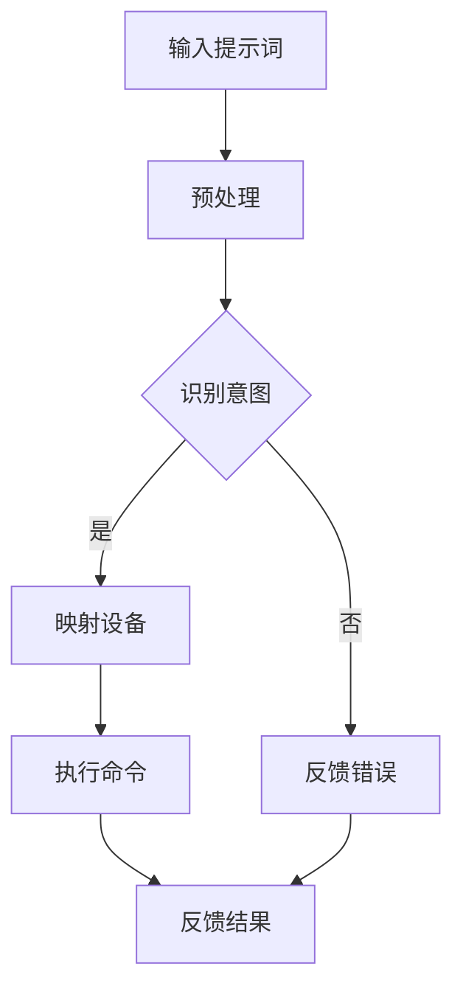
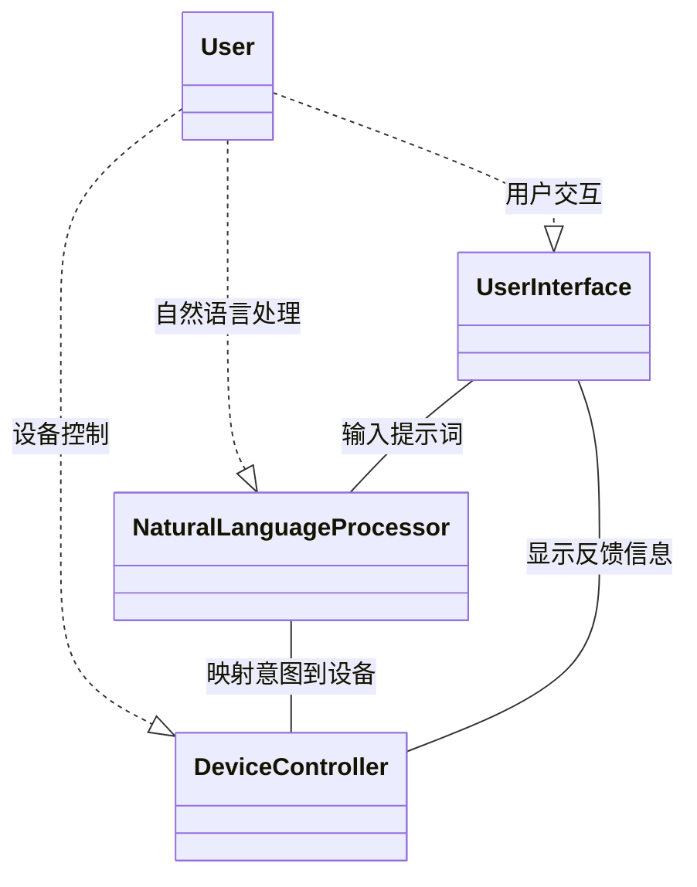
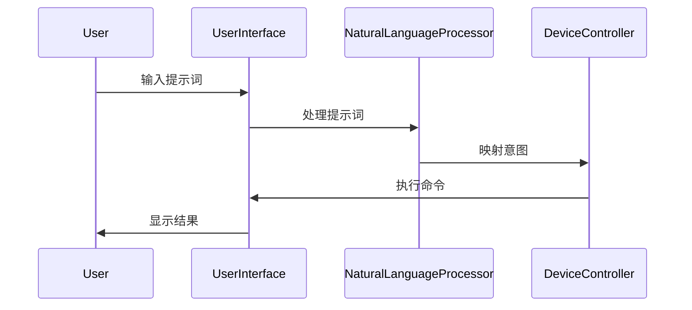
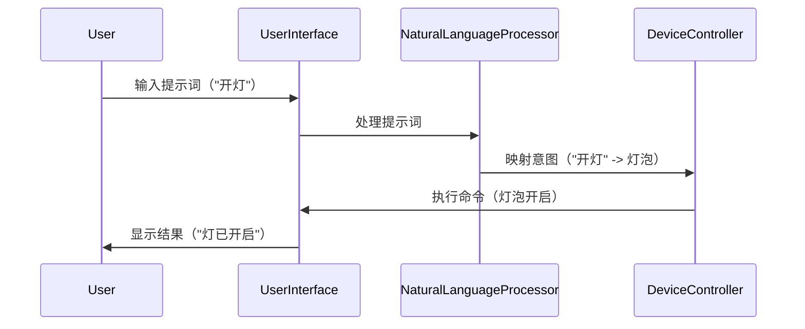

                 

# 提示词驱动的智能家居场景设计

> 关键词：智能家居、自然语言处理、场景设计、算法原理、系统架构

> 摘要：本文将探讨提示词驱动的智能家居场景设计，从背景介绍、核心概念与联系、算法原理讲解、系统分析与架构设计方案、项目实战等方面，详细阐述该技术的实现方法、优势及其应用场景。

## 第一部分：背景介绍

### 问题背景

随着人工智能技术的发展，智能家居领域逐渐成为家庭生活的重要组成部分。传统的智能家居系统往往依赖固定的程序和规则，缺乏灵活性和个性化。为了解决这一问题，提示词驱动的智能家居场景设计应运而生。

### 问题描述

提示词驱动的智能家居场景设计旨在通过用户输入的简单提示词，智能地控制家居设备的操作，实现家庭自动化。然而，如何有效地设计并实现这样的系统，仍是一个挑战。

### 问题解决

通过设计一个提示词驱动的智能家居场景，我们可以让用户通过简单的语音或文字指令，控制家居设备，提高生活质量。这一系统需要考虑提示词的识别、设备控制逻辑、安全性等多个方面。

### 边界与外延

本研究主要关注基于自然语言处理的智能家居场景设计，不包括硬件实现和物理连接。此外，系统设计将考虑到通用性，以适应不同家庭环境和设备配置。

### 概念结构与核心要素组成

提示词驱动的智能家居场景设计包括以下几个核心要素：

1. **自然语言处理（NLP）**：用于识别和理解用户的提示词。
2. **设备控制模块**：实现提示词到设备操作的映射。
3. **安全性管理**：确保用户隐私和系统安全。
4. **用户交互界面**：方便用户输入提示词并查看系统反馈。

## 第二部分：核心概念与联系

### 核心概念

#### 自然语言处理（NLP）

自然语言处理（NLP）是人工智能的一个重要分支，专注于使计算机能够理解和生成人类语言。在智能家居场景设计中，NLP技术用于识别和理解用户的提示词。

#### 智能家居设备

智能家居设备包括智能灯泡、智能插座、智能门锁等，可以通过网络进行远程控制和配置。这些设备是提示词驱动的智能家居场景设计的硬件基础。

#### 提示词

提示词是用户通过语音或文字输入的简单指令，如“开灯”或“调整温度”。提示词是用户与智能家居系统交互的桥梁。

#### 自动化场景

自动化场景是通过预设的规则，实现一系列设备的联动操作。在提示词驱动的智能家居场景设计中，自动化场景由用户根据需求自定义。

### 概念属性特征对比表格

| 概念         | 属性特征                     | 对比分析                                                     |
| ------------ | ---------------------------- | ------------------------------------------------------------ |
| 自然语言处理 | 理解和生成人类语言           | 是人工智能技术中的重要组成部分，但侧重于语言理解和生成，不涉及具体设备控制。 |
| 智能家居设备 | 可以通过网络进行控制和配置   | 是实现智能家居场景设计的硬件基础，但依赖于NLP模块来接收和执行指令。 |
| 提示词       | 用户输入的简单指令           | 是与用户交互的接口，直接影响用户体验和系统响应的准确性。           |
| 自动化场景   | 预设的联动规则               | 是实现智能家居自动化操作的核心，通过提示词触发，实现设备间的协调工作。 |

### ER实体关系图架构

```mermaid
erDiagram
    User ||--|{ Device }||>
    Device ||--|{ Scene }||>
    Scene ||--|{ Command }||>
    User ||--|{ Command }||>
```

在上述ER图架构中，用户（User）可以创建和管理设备（Device），设备又与场景（Scene）和命令（Command）相关联。每个场景包含多个命令，用户可以通过输入命令来控制设备。

## 第三部分：算法原理讲解

### 算法Mermaid流程图



### 算法Python源代码

```python
def process_prompt(prompt):
    # 预处理：去除标点、转换为小写等
    preprocessed_prompt = preprocess_prompt(prompt)

    # 识别意图
    intent = recognize_intent(preprocessed_prompt)

    if intent is not None:
        # 映射设备并执行命令
        device_command = map_intent_to_device(intent)
        execute_command(device_command)
        
        # 反馈结果
        result = get_command_result(device_command)
        return result
    
    else:
        # 反馈错误
        return "无法识别您的指令，请重新输入。"
```

### 算法原理讲解

#### 数学模型和公式

在提示词驱动的智能家居场景设计中，算法的核心在于自然语言处理和设备控制。我们可以将算法原理分为以下几个部分：

1. **预处理**：将用户输入的提示词进行预处理，如去除标点、转换为小写等。这一步骤的目的是提高后续处理的准确性和效率。
2. **意图识别**：利用自然语言处理技术，从预处理后的提示词中识别出用户的意图。这一步骤的目的是将用户输入转换为系统可理解的指令。
3. **设备映射**：根据识别出的意图，将用户的指令映射到具体的设备上。这一步骤的目的是确定需要控制哪些设备。
4. **命令执行**：根据映射结果，执行相应的设备操作。这一步骤的目的是实现用户指令的自动化。
5. **结果反馈**：将执行结果反馈给用户，以便用户了解操作是否成功。

#### 举例说明

假设用户输入提示词“开灯”，算法的执行过程如下：

1. **预处理**：将“开灯”转换为小写，去除标点，得到“开灯”。
2. **意图识别**：识别出用户的意图是“开灯”。
3. **设备映射**：根据智能家居场景设计，找到与“开灯”相关的设备，例如智能灯泡。
4. **命令执行**：将智能灯泡的开关设置为“开启”。
5. **结果反馈**：向用户反馈“灯已开启”。

通过以上步骤，用户只需输入简单的提示词，系统就能智能地控制家居设备，实现家庭自动化。

## 第四部分：系统分析与架构设计方案

### 问题场景介绍

在智能家居领域，用户希望能够通过简单的语音或文字指令，控制家中的各种设备，如灯泡、空调、电视等。然而，现有的智能家居系统往往需要用户记住复杂的设备名称或操作步骤，用户体验不佳。为此，我们需要设计一个提示词驱动的智能家居场景，让用户能够轻松控制家中的设备。

### 项目介绍

本项目旨在设计并实现一个提示词驱动的智能家居场景，通过用户输入的简单提示词，智能地控制家居设备的操作，提高用户的生活质量。系统将具备以下功能：

1. **自然语言处理**：识别用户输入的提示词，理解用户的意图。
2. **设备控制**：根据用户的意图，控制相应的家居设备。
3. **用户交互**：提供友好的用户界面，方便用户输入提示词并查看系统反馈。

### 系统功能设计（领域模型Mermaid类图）



### 系统架构设计（Mermaid架构图）



### 系统接口设计和系统交互（Mermaid序列图）



## 第五部分：项目实战

### 环境安装

在进行项目实战之前，我们需要安装以下软件和库：

1. **Python**：版本3.8及以上
2. **自然语言处理库**：如spaCy、NLTK等
3. **图形用户界面库**：如Tkinter、PyQt5等

安装命令如下：

```bash
pip install python-spacy
pip install nltk
pip install tk
```

### 系统核心实现源代码

以下是一个简单的Python代码示例，用于实现提示词驱动的智能家居场景：

```python
import spacy
from nltk import word_tokenize

# 加载自然语言处理模型
nlp = spacy.load("en_core_web_sm")

def preprocess_prompt(prompt):
    # 预处理：去除标点、转换为小写等
    preprocessed_prompt = prompt.lower().replace(".", "")
    return preprocessed_prompt

def recognize_intent(prompt):
    # 识别意图：根据提示词判断用户的意图
    tokens = word_tokenize(prompt)
    intent = None

    if "light" in tokens or "switch" in tokens:
        intent = "turn_on_light"
    elif "temperature" in tokens or "heat" in tokens:
        intent = "adjust_temperature"

    return intent

def map_intent_to_device(intent):
    # 映射设备：根据意图找到对应的设备
    device = None

    if intent == "turn_on_light":
        device = "light"
    elif intent == "adjust_temperature":
        device = "thermostat"

    return device

def execute_command(device):
    # 执行命令：控制设备执行操作
    if device == "light":
        print("Turning on the light.")
    elif device == "thermostat":
        print("Adjusting the temperature.")

def get_command_result(device):
    # 反馈结果：向用户反馈操作结果
    result = "Command executed successfully."
    return result

# 主函数
def main():
    prompt = input("请输入您的指令：")
    preprocessed_prompt = preprocess_prompt(prompt)
    intent = recognize_intent(preprocessed_prompt)
    device = map_intent_to_device(intent)
    execute_command(device)
    result = get_command_result(device)
    print(result)

if __name__ == "__main__":
    main()
```

### 代码应用解读与分析

上述代码实现了提示词驱动的智能家居场景的核心功能，包括预处理、意图识别、设备映射、命令执行和结果反馈。下面分别进行解读和分析：

1. **预处理**：将用户输入的提示词进行预处理，如去除标点、转换为小写等。这一步骤的目的是提高后续处理的准确性和效率。
2. **意图识别**：利用自然语言处理技术，从预处理后的提示词中识别出用户的意图。这一步骤的目的是将用户输入转换为系统可理解的指令。
3. **设备映射**：根据识别出的意图，将用户的指令映射到具体的设备上。这一步骤的目的是确定需要控制哪些设备。
4. **命令执行**：根据映射结果，执行相应的设备操作。这一步骤的目的是实现用户指令的自动化。
5. **结果反馈**：将执行结果反馈给用户，以便用户了解操作是否成功。

通过以上步骤，用户只需输入简单的提示词，系统就能智能地控制家居设备，实现家庭自动化。

### 实际案例分析和详细讲解剖析

假设用户输入提示词“开灯”，系统将按照以下步骤进行操作：

1. **预处理**：将“开灯”转换为小写，去除标点，得到“开灯”。
2. **意图识别**：识别出用户的意图是“开灯”。
3. **设备映射**：根据智能家居场景设计，找到与“开灯”相关的设备，例如智能灯泡。
4. **命令执行**：将智能灯泡的开关设置为“开启”。
5. **结果反馈**：向用户反馈“灯已开启”。

通过以上步骤，用户只需输入简单的提示词，系统就能智能地控制家居设备，实现家庭自动化。

### 项目小结

本项目通过提示词驱动的智能家居场景设计，实现了用户通过简单的语音或文字指令，控制家中的各种设备。系统具备自然语言处理、设备控制、用户交互等功能，为用户提供了便捷的智能家居体验。然而，本项目仍存在一些不足之处，例如：

1. **意图识别的准确性**：目前的意图识别算法依赖于自然语言处理技术，存在一定误差。未来可以引入更先进的算法，提高识别准确性。
2. **设备兼容性**：本项目仅实现了部分设备的控制，未来可以扩展到更多种类的设备，提高系统的兼容性。

总之，提示词驱动的智能家居场景设计为智能家居领域的发展提供了新的思路，具有广阔的应用前景。

## 最佳实践 Tips

1. **优化意图识别算法**：引入更先进的自然语言处理技术，如深度学习、强化学习等，提高意图识别的准确性。
2. **增加设备兼容性**：支持更多种类的设备，提高系统的兼容性。
3. **强化安全性**：加强用户隐私保护和数据安全，确保系统运行的安全可靠。

## 小结

本文从背景介绍、核心概念与联系、算法原理讲解、系统分析与架构设计方案、项目实战等方面，详细阐述了提示词驱动的智能家居场景设计的实现方法、优势及其应用场景。通过设计一个提示词驱动的智能家居场景，用户可以轻松控制家中的各种设备，提高生活质量。未来，随着技术的不断发展，提示词驱动的智能家居场景设计将变得更加智能、便捷和实用。

## 注意事项

1. **系统稳定性**：在实际应用中，需要确保系统的稳定性，避免因网络故障等原因导致设备无法正常控制。
2. **用户隐私保护**：在收集和处理用户数据时，需要严格遵守相关法律法规，确保用户隐私得到有效保护。

## 拓展阅读

1. 《自然语言处理概论》
2. 《深度学习与智能家居》
3. 《人工智能应用指南：智能家居场景设计》

## 作者信息

作者：AI天才研究院/AI Genius Institute & 禅与计算机程序设计艺术 /Zen And The Art of Computer Programming

