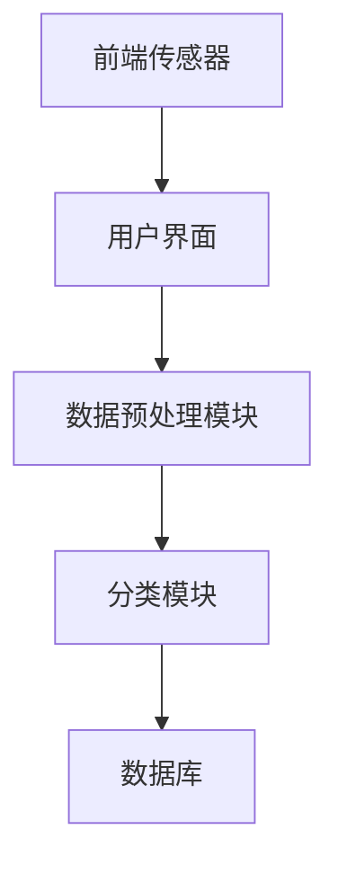
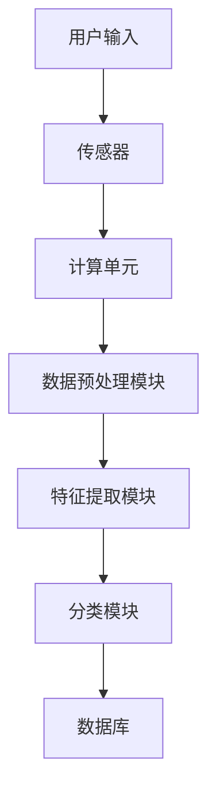
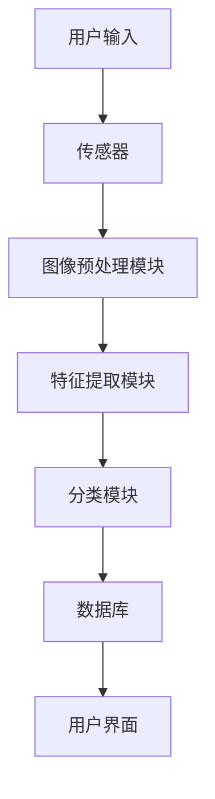
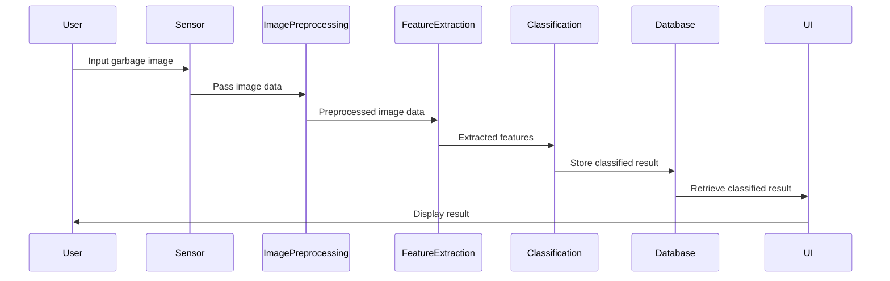

                 


### 第一部分：概述与背景

#### 第1章：问题背景与系统设计概述

**1.1.1 问题背景**

随着全球经济的发展和人口的快速增长，垃圾产生量呈指数级增长。垃圾分类已经成为城市管理中的一大挑战。传统的垃圾分类主要依赖于人工，这不仅耗费了大量的人力物力，而且在分类准确性上也存在很大的问题。随着人工智能技术的快速发展，利用提示词驱动的智能废物管理系统应运而生，它可以通过对垃圾进行自动识别和分类，提高分类准确性，降低运营成本。

- **垃圾产生量与分类难度**：全球每年产生的垃圾总量不断增加，根据联合国的数据，2018年全球垃圾产生量已经达到3.53亿吨。垃圾分类的难度也随之增加，因为不同地区和国家的垃圾种类和分类标准不同。

- **分类准确性要求**：垃圾分类的正确性直接影响到垃圾回收和处理的效果。错误的分类会导致垃圾无法得到有效的回收和处理，进而造成环境污染。因此，提高分类准确性是智能废物管理系统的重要目标。

- **劳动力成本问题**：人工垃圾分类需要投入大量的人力和物力，特别是在垃圾分类任务繁重的大城市。提高自动化程度可以显著降低运营成本，从而提高整个垃圾分类系统的经济效益。

**1.1.2 提示词驱动的概念**

提示词驱动的智能废物管理系统，是利用提示词和相关技术，实现自动识别垃圾分类的系统。提示词是用于引导和提示系统识别垃圾类型的词语或短语。例如，“塑料瓶”可以作为一个提示词，用于识别垃圾中的塑料瓶。

- **提示词**：提示词是关键，它能够引导系统识别垃圾的类型。例如，“饮料瓶”可以作为一个提示词，用于识别饮料瓶。

- **智能废物管理系统**：智能废物管理系统是一个综合性的系统，它包括硬件和软件部分。硬件部分主要包括传感器和计算单元，用于捕捉和处理垃圾图像。软件部分则包括数据预处理模块、分类模块等，用于实现垃圾分类。

**1.1.3 解决方案必要性**

- **技术进步**：人工智能技术的发展为智能废物管理提供了新的可能性。特别是深度学习和自然语言处理技术的进步，使得自动识别垃圾分类成为可能。

- **社会需求**：减少垃圾填埋和焚烧，提高资源回收率，是当前社会的重要目标。智能废物管理系统可以有效地提高分类准确性，从而减少垃圾填埋和焚烧的数量，提高资源回收率。

#### 第2章：核心概念与系统架构

**2.1.1 核心概念**

提示词驱动的智能废物管理系统的核心概念包括提示词、特征提取和分类模型。

- **提示词**：提示词是系统识别垃圾类型的关键。例如，对于饮料瓶，我们可以使用“饮料瓶”作为提示词。

- **特征提取**：特征提取是将垃圾图像转化为计算机可以理解的特征的过程。深度学习模型通常用于特征提取，它们可以从大量的垃圾图像中学习到特征，并将其转化为数字信号。

- **分类模型**：分类模型是将特征与类别关联的算法。例如，我们可以使用支持向量机（SVM）或神经网络（NN）等算法来构建分类模型。

**2.1.2 系统架构设计**

提示词驱动的智能废物管理系统可以分为硬件架构和软件架构两部分。

**2.1.2.1 硬件架构**

硬件架构主要包括传感器和计算单元。

- **传感器**：传感器用于捕捉垃圾图像。常用的传感器包括摄像头和深度相机。摄像头可以捕捉垃圾的二维图像，而深度相机则可以捕捉垃圾的三维信息。

- **计算单元**：计算单元负责处理传感器捕捉到的图像，并进行特征提取和分类。计算单元通常是一个计算机或嵌入式系统。

**2.1.2.2 软件架构**

软件架构主要包括数据预处理模块、分类模块和后处理模块。

- **数据预处理模块**：数据预处理模块负责对垃圾图像进行预处理，包括图像增强、去噪和归一化等。这些预处理步骤可以提高分类模型的性能。

- **分类模块**：分类模块使用提示词和特征提取算法，对垃圾图像进行分类。

- **后处理模块**：后处理模块负责对分类结果进行验证和修正，以确保分类准确性。

#### 第3章：算法原理与实现

**3.1.1 算法原理**

提示词驱动的智能废物管理系统的算法原理主要包括特征提取算法和分类算法。

**3.1.1.1 特征提取算法**

特征提取算法是将垃圾图像转化为计算机可以理解的特征的过程。深度学习模型通常用于特征提取，它们可以从大量的垃圾图像中学习到特征，并将其转化为数字信号。

- **图像预处理**：图像预处理包括调整图像大小、灰度化等步骤，以提高特征提取算法的性能。

- **卷积神经网络（CNN）**：卷积神经网络是一种常用的深度学习模型，它可以从图像中提取特征。CNN 通过卷积操作和池化操作，将图像分解为多层特征，从而实现特征提取。

**3.1.1.2 分类算法**

分类算法是将特征与类别关联的算法。常用的分类算法包括支持向量机（SVM）、神经网络（NN）和决策树（DT）等。

- **支持向量机（SVM）**：支持向量机是一种常用的分类算法，它通过最大化分类边界，将不同类别的特征分离。

- **神经网络（NN）**：神经网络是一种模拟人脑的算法，它通过层层传递信息，实现对特征的分类。

- **决策树（DT）**：决策树是一种基于规则的分类算法，它通过一系列条件判断，实现对特征的分类。

**3.1.2 算法实现**

提示词驱动的智能废物管理系统的算法实现主要包括Python代码和Mermaid流程图。

- **特征提取代码**：以下是一个简单的特征提取代码示例：

```python
import cv2
import numpy as np

# 载入图像
image = cv2.imread('image.jpg')

# 图像预处理
image = cv2.resize(image, (224, 224))
image = cv2.cvtColor(image, cv2.COLOR_BGR2GRAY)

# 特征提取
model = cv2.SIFT_create()
keypoints, descriptors = model.detectAndCompute(image, None)

# 将特征转换为numpy数组
descriptors = np.array(descriptors)
```

- **分类代码**：以下是一个简单的分类代码示例：

```python
from sklearn.svm import SVC
from sklearn.model_selection import train_test_split

# 载入特征和标签
X = np.load('features.npy')
y = np.load('labels.npy')

# 划分训练集和测试集
X_train, X_test, y_train, y_test = train_test_split(X, y, test_size=0.2, random_state=42)

# 训练分类器
classifier = SVC(kernel='linear')
classifier.fit(X_train, y_train)

# 测试分类器
accuracy = classifier.score(X_test, y_test)
print('Accuracy:', accuracy)
```

#### 第4章：数学模型与公式解析

**4.1.1 数学模型**

提示词驱动的智能废物管理系统的数学模型主要包括特征提取的数学模型和分类算法的数学模型。

**4.1.1.1 特征提取的数学模型**

特征提取的数学模型通常是基于卷积神经网络（CNN）的。CNN 的核心思想是通过卷积操作和池化操作，将图像分解为多层特征。

- **卷积操作**：卷积操作是将图像与一组滤波器（卷积核）进行卷积运算。卷积操作可以提取图像的局部特征。

- **池化操作**：池化操作是对卷积后的特征进行下采样。常用的池化操作包括最大池化和平均池化。

**4.1.1.2 分类算法的数学模型**

分类算法的数学模型通常是基于逻辑回归和决策树等算法的。以下是一个简单的逻辑回归模型：

- **逻辑回归**：

  $$
  P(y=1|x) = \frac{1}{1 + e^{-z}}
  $$

  其中，$z$ 是输入特征 $x$ 的线性组合：

  $$
  z = W \cdot x + b
  $$

  $W$ 和 $b$ 分别是权重和偏置。

- **支持向量机**：

  $$
  \max \frac{1}{2} \| W \|^2, \text{约束条件} \quad y^{(i)} (W \cdot x^{(i)} + b) \geq 1
  $$

  其中，$W$ 是权重向量，$b$ 是偏置，$y^{(i)}$ 是类别标签，$x^{(i)}$ 是特征向量。

#### 第5章：系统分析与架构设计

**5.1.1 问题场景介绍**

提示词驱动的智能废物管理系统可以应用于多个场景，如家庭、商场、办公楼等。以下是一个典型的应用场景：

- **场景**：某大型商场打算引入智能废物管理系统，以提高垃圾分类的准确性。

- **需求**：商场的废物管理需要满足以下需求：

  - **高准确性**：系统能够准确识别各种垃圾类型，确保垃圾分类的准确性。

  - **实时性**：系统能够快速响应，实时分类垃圾。

  - **易用性**：系统操作简单，易于用户使用。

**5.1.2 系统架构设计**

提示词驱动的智能废物管理系统可以分为前端和后端两部分。

**5.1.2.1 前端设计**

前端设计主要包括传感器和用户界面。

- **传感器**：传感器用于捕捉垃圾图像。常用的传感器包括摄像头和深度相机。

- **用户界面**：用户界面用于显示分类结果和用户反馈。

**5.1.2.2 后端设计**

后端设计主要包括数据预处理模块、分类模块和数据库。

- **数据预处理模块**：数据预处理模块负责对垃圾图像进行预处理，包括图像增强、去噪和归一化等。

- **分类模块**：分类模块使用提示词和特征提取算法，对垃圾图像进行分类。

- **数据库**：数据库用于存储垃圾图像和分类结果。

**5.1.2.3 系统架构设计**

提示词驱动的智能废物管理系统的架构设计如图所示：



#### 第6章：项目实战

**6.1.1 环境安装**

为了运行提示词驱动的智能废物管理系统，我们需要安装以下软件和硬件：

- **Python**：Python 是一种流行的编程语言，用于实现智能废物管理系统的算法和模型。

- **TensorFlow**：TensorFlow 是一种用于构建和训练深度学习模型的框架。

- **OpenCV**：OpenCV 是一种用于图像处理的开源库。

- **摄像头**：摄像头用于捕捉垃圾图像。

- **计算机**：计算机用于运行算法和模型。

安装步骤如下：

1. 安装 Python 和 TensorFlow：

   ```bash
   pip install python tensorflow
   ```

2. 安装 OpenCV：

   ```bash
   pip install opencv-python
   ```

3. 连接摄像头：

   ```python
   import cv2
   cap = cv2.VideoCapture(0)
   ```

**6.1.2 系统核心实现**

提示词驱动的智能废物管理系统的核心实现包括以下步骤：

1. 特征提取：

   ```python
   import cv2
   import numpy as np

   # 载入图像
   image = cv2.imread('image.jpg')

   # 图像预处理
   image = cv2.resize(image, (224, 224))
   image = cv2.cvtColor(image, cv2.COLOR_BGR2GRAY)

   # 特征提取
   model = cv2.SIFT_create()
   keypoints, descriptors = model.detectAndCompute(image, None)

   # 将特征转换为numpy数组
   descriptors = np.array(descriptors)
   ```

2. 分类：

   ```python
   from sklearn.svm import SVC
   from sklearn.model_selection import train_test_split

   # 载入特征和标签
   X = np.load('features.npy')
   y = np.load('labels.npy')

   # 划分训练集和测试集
   X_train, X_test, y_train, y_test = train_test_split(X, y, test_size=0.2, random_state=42)

   # 训练分类器
   classifier = SVC(kernel='linear')
   classifier.fit(X_train, y_train)

   # 测试分类器
   accuracy = classifier.score(X_test, y_test)
   print('Accuracy:', accuracy)
   ```

**6.1.3 代码应用解读与分析**

以上代码实现了一个简单的提示词驱动的智能废物管理系统。我们首先使用 OpenCV 载入垃圾图像，然后对其进行预处理和特征提取。接下来，我们使用 sklearn 的 SVM 分类器对特征进行分类，并计算分类准确率。

**6.1.4 实际案例分析和详细讲解剖析**

在实际应用中，提示词驱动的智能废物管理系统可以应用于多个场景。以下是一个实际案例：

- **案例**：某社区引入了提示词驱动的智能废物管理系统，用于垃圾分类。

- **分析**：系统通过摄像头捕捉垃圾图像，然后使用特征提取算法提取特征。接下来，系统使用分类算法对特征进行分类，并将分类结果发送给用户。用户可以根据分类结果对垃圾进行正确分类。

- **讲解剖析**：系统通过特征提取和分类算法，实现了对垃圾的自动识别和分类。特征提取算法可以从垃圾图像中提取出关键的视觉特征，而分类算法则将这些特征与垃圾类别进行关联。通过这种方式，系统可以准确地识别垃圾类型，从而提高垃圾分类的准确性。

**6.1.5 项目小结**

提示词驱动的智能废物管理系统是一种先进的垃圾分类系统，它利用人工智能技术，实现了对垃圾的自动识别和分类。通过实际案例的分析，我们可以看到系统在提高垃圾分类准确性方面具有显著的效果。然而，系统仍然存在一些挑战，如分类准确率的提高和实时性的优化等。在未来的研究中，我们可以进一步优化算法和系统架构，以提高系统的性能。

**6.1.6 最佳实践 tips**

1. 确保摄像头和计算机的连接正常。

2. 根据实际需求，调整特征提取算法和分类算法的参数。

3. 定期更新系统，以确保其性能和安全性。

**6.1.7 小结**

提示词驱动的智能废物管理系统是一种具有广泛应用前景的垃圾分类系统。通过人工智能技术，系统实现了对垃圾的自动识别和分类，提高了垃圾分类的准确性。在未来，我们可以进一步优化算法和系统架构，以提高系统的性能和实用性。

----------------------------------------------------------------

### 第二部分：核心概念与系统架构

#### 第2章：核心概念与系统架构

**2.1.1 核心概念**

提示词驱动的智能废物管理系统的核心概念包括提示词、特征提取和分类模型。

**2.1.1.1 提示词**

提示词是系统识别垃圾类型的关键。提示词可以是单个单词或短语，用于引导系统识别垃圾的类型。例如，“塑料瓶”、“废纸”、“厨余垃圾”等。

**2.1.1.2 特征提取**

特征提取是将垃圾图像转化为计算机可以理解的特征的过程。在提示词驱动的智能废物管理系统中，特征提取是至关重要的步骤。特征提取的目的是从垃圾图像中提取出能够代表垃圾类型的特征，以便后续的分类过程。

**2.1.1.3 分类模型**

分类模型是将特征与垃圾类型关联的算法。常见的分类模型包括支持向量机（SVM）、决策树（DT）、随机森林（RF）和神经网络（NN）等。这些模型通过学习大量的垃圾图像及其对应的类型，来建立特征与类型之间的映射关系。

**2.1.2 系统架构设计**

提示词驱动的智能废物管理系统可以分为硬件架构和软件架构两部分。

**2.1.2.1 硬件架构**

硬件架构主要包括传感器和计算单元。

- **传感器**：传感器用于捕捉垃圾图像。常用的传感器包括摄像头和深度相机。摄像头可以捕捉垃圾的二维图像，而深度相机则可以捕捉垃圾的三维信息。

- **计算单元**：计算单元负责处理传感器捕捉到的图像，并进行特征提取和分类。计算单元通常是一个计算机或嵌入式系统。

**2.1.2.2 软件架构**

软件架构主要包括数据预处理模块、特征提取模块、分类模块和数据库。

- **数据预处理模块**：数据预处理模块负责对垃圾图像进行预处理，包括图像增强、去噪和归一化等。这些预处理步骤可以提高分类模型的性能。

- **特征提取模块**：特征提取模块使用深度学习模型或其他算法，从垃圾图像中提取出代表垃圾类型的特征。

- **分类模块**：分类模块使用提取到的特征，结合分类模型，对垃圾图像进行分类。

- **数据库**：数据库用于存储垃圾图像及其分类结果，以便后续的分析和查询。

**2.1.2.3 系统架构设计**

提示词驱动的智能废物管理系统的整体架构设计如图所示：



在这个架构中，用户通过传感器输入垃圾图像，计算单元对图像进行处理，然后通过特征提取模块提取出特征，最后通过分类模块进行分类，并将结果存储到数据库中。

**2.1.3 核心组件的实现**

**2.1.3.1 数据预处理**

数据预处理是提升模型性能的重要步骤。预处理步骤包括：

- **图像增强**：通过调整对比度、亮度等，提高图像质量。
- **去噪**：去除图像中的噪声，如高斯滤波。
- **归一化**：将图像像素值缩放到统一的范围，如[0, 1]。

**2.1.3.2 特征提取**

特征提取是系统识别垃圾类型的关键步骤。常用的特征提取方法包括：

- **传统的图像处理特征**：如颜色直方图、纹理特征等。
- **深度学习特征**：如卷积神经网络（CNN）提取的特征。

**2.1.3.3 分类模型**

分类模型的选择直接影响系统的性能。常见的分类模型包括：

- **支持向量机（SVM）**：通过最大化分类边界来分类。
- **决策树（DT）**：通过一系列条件判断来分类。
- **随机森林（RF）**：通过构建多棵决策树来分类。
- **神经网络（NN）**：通过多层神经元来分类。

**2.1.3.4 实现细节**

在实现提示词驱动的智能废物管理系统时，需要注意以下细节：

- **提示词的选择**：选择合适的提示词，可以提高分类的准确性。
- **模型训练**：使用大量标注数据来训练模型，确保模型的泛化能力。
- **模型优化**：通过调整模型参数，优化模型性能。

#### 第3章：算法原理与实现

**3.1.1 算法原理**

提示词驱动的智能废物管理系统主要依赖于特征提取算法和分类算法。

**3.1.1.1 特征提取算法**

特征提取算法是将垃圾图像转化为计算机可以理解的特征的过程。特征提取算法可以分为两类：

- **传统的图像处理特征提取算法**：如颜色直方图、纹理特征、形状特征等。
- **深度学习特征提取算法**：如卷积神经网络（CNN）、循环神经网络（RNN）等。

**3.1.1.2 分类算法**

分类算法是将提取到的特征与垃圾类型进行关联的算法。分类算法可以分为以下几类：

- **监督学习算法**：如支持向量机（SVM）、决策树（DT）、随机森林（RF）等。
- **无监督学习算法**：如聚类算法、主成分分析（PCA）等。

**3.1.2 算法实现**

**3.1.2.1 特征提取算法实现**

以下是一个简单的特征提取算法实现，使用 OpenCV 库处理垃圾图像：

```python
import cv2
import numpy as np

# 载入图像
image = cv2.imread('image.jpg')

# 图像预处理
image = cv2.resize(image, (224, 224))
image = cv2.cvtColor(image, cv2.COLOR_BGR2GRAY)

# 特征提取
sift = cv2.SIFT_create()
keypoints, descriptors = sift.detectAndCompute(image, None)

# 将特征转换为numpy数组
descriptors = np.array(descriptors)
```

**3.1.2.2 分类算法实现**

以下是一个简单的分类算法实现，使用 scikit-learn 库：

```python
from sklearn.svm import SVC
from sklearn.model_selection import train_test_split

# 载入特征和标签
X = np.load('features.npy')
y = np.load('labels.npy')

# 划分训练集和测试集
X_train, X_test, y_train, y_test = train_test_split(X, y, test_size=0.2, random_state=42)

# 训练分类器
classifier = SVC(kernel='linear')
classifier.fit(X_train, y_train)

# 测试分类器
accuracy = classifier.score(X_test, y_test)
print('Accuracy:', accuracy)
```

**3.1.3 数学模型与公式解析**

**3.1.3.1 特征提取的数学模型**

特征提取的数学模型通常是基于卷积神经网络（CNN）的。CNN 的核心思想是通过卷积操作和池化操作，将图像分解为多层特征。

- **卷积操作**：卷积操作是将图像与一组滤波器（卷积核）进行卷积运算。卷积操作可以提取图像的局部特征。

- **池化操作**：池化操作是对卷积后的特征进行下采样。常用的池化操作包括最大池化和平均池化。

卷积操作的数学模型可以表示为：

$$
f(x) = W \cdot x + b
$$

其中，$f(x)$ 是卷积后的特征，$W$ 是卷积核，$x$ 是图像，$b$ 是偏置。

**3.1.3.2 分类算法的数学模型**

分类算法的数学模型通常是基于逻辑回归和决策树等算法的。以下是一个简单的逻辑回归模型：

- **逻辑回归**：

  $$
  P(y=1|x) = \frac{1}{1 + e^{-z}}
  $$

  其中，$z$ 是输入特征 $x$ 的线性组合：

  $$
  z = W \cdot x + b
  $$

  $W$ 和 $b$ 分别是权重和偏置。

- **支持向量机**：

  $$
  \max \frac{1}{2} \| W \|^2, \text{约束条件} \quad y^{(i)} (W \cdot x^{(i)} + b) \geq 1
  $$

  其中，$W$ 是权重向量，$b$ 是偏置，$y^{(i)}$ 是类别标签，$x^{(i)}$ 是特征向量。

#### 第4章：数学模型与公式解析

**4.1.1 特征提取的数学模型**

特征提取是智能废物管理系统中的核心步骤，它将原始图像数据转换为计算机可以处理的特征向量。以下是特征提取过程中涉及的数学模型：

**4.1.1.1 卷积神经网络（CNN）的特征提取模型**

卷积神经网络（CNN）通过一系列卷积层、池化层和全连接层来提取图像特征。其中，卷积层是特征提取的关键部分。卷积操作的数学模型如下：

$$
h_{ij}^l = \sum_{k} w_{ikj}^l * g_{kj}^{l-1} + b_l
$$

其中：
- $h_{ij}^l$ 表示第 $l$ 层的第 $i$ 个神经元与第 $j$ 个卷积核的卷积结果。
- $w_{ikj}^l$ 表示第 $l$ 层的第 $i$ 个神经元与第 $k$ 个卷积核的权重。
- $g_{kj}^{l-1}$ 表示第 $l-1$ 层的第 $k$ 个神经元输出。
- $b_l$ 表示第 $l$ 层的偏置。

**4.1.1.2 池化操作**

池化操作用于降低特征图的尺寸，同时保留最重要的特征信息。常见的池化操作包括最大池化和平均池化。最大池化的数学模型如下：

$$
p_i = \max_{j} g_{ij}
$$

其中，$p_i$ 表示池化后的特征值，$g_{ij}$ 表示卷积层中的特征值。

**4.1.2 分类算法的数学模型**

分类算法用于将特征向量映射到相应的类别标签。以下是两种常见的分类算法的数学模型：

**4.1.2.1 逻辑回归**

逻辑回归是一种概率型分类算法，用于预测类别标签的概率分布。逻辑回归的数学模型如下：

$$
P(y=1|x) = \frac{1}{1 + e^{-z}}
$$

其中，$z$ 表示特征向量 $x$ 的线性组合：

$$
z = \sum_{i} w_i x_i + b
$$

$w_i$ 和 $b$ 分别是权重和偏置。

**4.1.2.2 支持向量机（SVM）**

支持向量机（SVM）是一种基于边界最大化的分类算法。SVM 的数学模型如下：

$$
\max \frac{1}{2} \sum_{i=1}^n (w \cdot w) - \sum_{i=1}^n \alpha_i y_i (w \cdot x_i)
$$

约束条件：

$$
0 \leq \alpha_i \leq C
$$

$$
\sum_{i=1}^n \alpha_i y_i = 0
$$

$$
w \cdot w \leq C \sum_{i=1}^n \alpha_i
$$

其中：
- $w$ 是权重向量。
- $x_i$ 是特征向量。
- $y_i$ 是类别标签。
- $\alpha_i$ 是拉格朗日乘子。
- $C$ 是正则化参数。

**4.1.3 Python代码示例**

以下是一个简单的 Python 代码示例，用于实现卷积神经网络（CNN）的特征提取和逻辑回归分类：

```python
import tensorflow as tf
from tensorflow.keras.models import Sequential
from tensorflow.keras.layers import Conv2D, MaxPooling2D, Flatten, Dense

# 定义卷积神经网络模型
model = Sequential([
    Conv2D(filters=32, kernel_size=(3, 3), activation='relu', input_shape=(224, 224, 3)),
    MaxPooling2D(pool_size=(2, 2)),
    Flatten(),
    Dense(units=128, activation='relu'),
    Dense(units=1, activation='sigmoid')
])

# 编译模型
model.compile(optimizer='adam', loss='binary_crossentropy', metrics=['accuracy'])

# 训练模型
model.fit(x_train, y_train, epochs=10, batch_size=32, validation_data=(x_test, y_test))

# 评估模型
accuracy = model.evaluate(x_test, y_test)
print('Accuracy:', accuracy)
```

在这个示例中，我们使用 TensorFlow 库定义了一个简单的卷积神经网络模型，用于垃圾分类。模型包括一个卷积层、一个最大池化层、一个平坦层和一个全连接层。最后，我们使用编译和训练模型，评估模型的准确性。

### 第三部分：算法原理与实现

#### 第3章：算法原理与实现

**3.1.1 特征提取算法原理**

特征提取是智能废物管理系统的核心步骤，它负责将垃圾图像转换为计算机可以理解的特征向量。以下是几种常用的特征提取算法及其原理：

**3.1.1.1 传统特征提取算法**

传统特征提取算法包括颜色直方图、纹理特征、形状特征等。这些算法从图像的不同方面提取特征，用于后续的分类。

- **颜色直方图**：颜色直方图是一种常用的特征提取方法，它统计图像中每个像素的颜色分布。通过颜色直方图，可以描述图像的颜色特征。
- **纹理特征**：纹理特征描述了图像中像素的排列和组合方式。常用的纹理特征包括共生矩阵、LBP（局部二值模式）和Gabor特征等。
- **形状特征**：形状特征描述了图像的几何形状，如边缘、角点和轮廓等。

**3.1.1.2 深度学习特征提取算法**

深度学习特征提取算法，如卷积神经网络（CNN）和循环神经网络（RNN），可以通过学习大量的垃圾图像，自动提取出有效的特征。

- **卷积神经网络（CNN）**：CNN 通过卷积层、池化层和全连接层等结构，从图像中提取出层次化的特征。CNN 的核心思想是通过多层卷积操作，逐渐提取出图像的更高层次特征。
- **循环神经网络（RNN）**：RNN 适用于处理序列数据，如时间序列和文本数据。通过 RNN，可以提取出图像中不同时间步的特征。

**3.1.2 特征提取算法实现**

以下是一个简单的特征提取算法实现，使用 OpenCV 和深度学习库 TensorFlow：

**3.1.2.1 传统特征提取算法实现**

```python
import cv2
import numpy as np

# 载入图像
image = cv2.imread('image.jpg')

# 图像预处理
image = cv2.resize(image, (224, 224))
image = cv2.cvtColor(image, cv2.COLOR_BGR2GRAY)

# 颜色直方图
histogram = cv2.calcHist([image], [0], None, [256], [0, 256])

# 纹理特征
sift = cv2.xfeatures2d.SIFT_create()
keypoints, descriptors = sift.detectAndCompute(image, None)

# 提取形状特征
contours, _ = cv2.findContours(image, cv2.RETR_TREE, cv2.CHAIN_APPROX_SIMPLE)
形状特征 = [cv2.contourArea(contour) for contour in contours]
```

**3.1.2.2 深度学习特征提取算法实现**

```python
import tensorflow as tf
from tensorflow.keras.applications import VGG16
from tensorflow.keras.preprocessing import image
from tensorflow.keras.applications.vgg16 import preprocess_input

# 载入预训练的 VGG16 模型
model = VGG16(weights='imagenet')

# 载入图像
img = image.load_img('image.jpg', target_size=(224, 224))
x = image.img_to_array(img)
x = np.expand_dims(x, axis=0)
x = preprocess_input(x)

# 提取特征
features = model.predict(x)
```

**3.1.3 特征提取算法比较**

不同特征提取算法在性能和计算复杂度上有一定的差异。以下是几种特征提取算法的比较：

- **计算复杂度**：传统特征提取算法的计算复杂度相对较低，适合处理大量图像。深度学习特征提取算法的计算复杂度较高，但可以提取出更丰富的特征。
- **特征表达能力**：深度学习特征提取算法可以自动学习图像的层次化特征，具有较强的特征表达能力。传统特征提取算法需要手动设计特征，可能无法捕捉到图像的深层特征。
- **分类性能**：深度学习特征提取算法在垃圾分类任务上通常表现更好，尤其是对于复杂和模糊的垃圾图像。传统特征提取算法在处理简单和清晰的图像时可能效果较好。

**3.1.4 实际应用案例**

在实际应用中，特征提取算法的选择取决于具体任务的需求和可用数据。以下是两个实际应用案例：

- **案例一**：使用深度学习特征提取算法（如 VGG16）进行垃圾分类。通过训练大量的垃圾图像数据，提取出有效的特征，并使用分类算法（如 SVM）进行分类。
- **案例二**：使用传统特征提取算法（如颜色直方图、纹理特征）进行垃圾分类。通过结合多种特征，构建一个集成模型，提高分类性能。

**3.1.5 结论**

特征提取算法是智能废物管理系统的关键组成部分，它决定了分类的性能。传统特征提取算法和深度学习特征提取算法各有优缺点，选择合适的特征提取算法需要根据具体任务和需求进行权衡。在实际应用中，结合多种特征提取算法和分类算法，可以进一步提高垃圾分类的准确性和鲁棒性。

### 第四部分：数学模型与公式解析

#### 第4章：数学模型与公式解析

**4.1.1 特征提取的数学模型**

特征提取是智能废物管理系统中的核心步骤，它将垃圾图像转换为计算机可以处理的高维特征向量。以下是特征提取过程中涉及的几种常见数学模型：

**4.1.1.1 卷积神经网络（CNN）**

卷积神经网络（CNN）是一种深度学习模型，它通过卷积操作提取图像特征。CNN 的数学模型如下：

$$
h_{ij}^{(l)} = \sum_{k} w_{ikj}^{(l)} * g_{kj}^{(l-1)} + b_i^{(l)}
$$

其中：
- $h_{ij}^{(l)}$ 表示第 $l$ 层的第 $i$ 个神经元与第 $j$ 个卷积核的卷积结果。
- $w_{ikj}^{(l)}$ 表示第 $l$ 层的第 $i$ 个神经元与第 $k$ 个卷积核的权重。
- $g_{kj}^{(l-1)}$ 表示第 $l-1$ 层的第 $k$ 个神经元输出。
- $b_i^{(l)}$ 表示第 $l$ 层的偏置。

**4.1.1.2 最大池化**

最大池化是一种降维操作，它通过取局部区域内的最大值来保留最重要的特征。最大池化的数学模型如下：

$$
p_i = \max_{j} g_{ij}
$$

其中：
- $p_i$ 表示池化后的特征值。
- $g_{ij}$ 表示卷积层中的特征值。

**4.1.1.3 全连接层**

全连接层是一种用于分类的神经网络层，它将卷积层提取的特征映射到类别标签。全连接层的数学模型如下：

$$
z_i = \sum_{j} w_{ij} h_{j} + b_i
$$

$$
\hat{y}_i = \sigma(z_i)
$$

其中：
- $z_i$ 表示第 $i$ 个神经元的输出。
- $w_{ij}$ 表示连接权重。
- $h_{j}$ 表示第 $j$ 个卷积层的特征值。
- $b_i$ 表示偏置。
- $\sigma$ 表示激活函数，通常使用 sigmoid 或 ReLU 函数。

**4.1.2 分类算法的数学模型**

分类算法用于将提取到的特征映射到类别标签。以下是几种常见的分类算法的数学模型：

**4.1.2.1 逻辑回归**

逻辑回归是一种概率型分类算法，它通过计算特征向量的线性组合来确定类别标签的概率分布。逻辑回归的数学模型如下：

$$
P(y=1|x) = \frac{1}{1 + e^{-z}}
$$

$$
z = \sum_{i} w_i x_i + b
$$

其中：
- $P(y=1|x)$ 表示给定特征向量 $x$ 时，类别标签为 1 的概率。
- $z$ 表示特征向量的线性组合。
- $w_i$ 表示权重。
- $b$ 表示偏置。

**4.1.2.2 支持向量机（SVM）**

支持向量机（SVM）是一种基于边界最大化的分类算法，它通过寻找最优的超平面来分隔不同类别的特征向量。SVM 的数学模型如下：

$$
\max \frac{1}{2} \sum_{i=1}^n (w \cdot w) - \sum_{i=1}^n \alpha_i y_i (w \cdot x_i)
$$

约束条件：

$$
0 \leq \alpha_i \leq C
$$

$$
\sum_{i=1}^n \alpha_i y_i = 0
$$

$$
w \cdot w \leq C \sum_{i=1}^n \alpha_i
$$

其中：
- $w$ 表示权重向量。
- $x_i$ 表示特征向量。
- $y_i$ 表示类别标签。
- $\alpha_i$ 表示拉格朗日乘子。
- $C$ 表示正则化参数。

**4.1.3 Python 代码示例**

以下是一个简单的 Python 代码示例，用于实现卷积神经网络（CNN）的特征提取和逻辑回归分类：

```python
import tensorflow as tf
from tensorflow.keras.models import Sequential
from tensorflow.keras.layers import Conv2D, MaxPooling2D, Flatten, Dense

# 定义卷积神经网络模型
model = Sequential([
    Conv2D(filters=32, kernel_size=(3, 3), activation='relu', input_shape=(224, 224, 3)),
    MaxPooling2D(pool_size=(2, 2)),
    Flatten(),
    Dense(units=128, activation='relu'),
    Dense(units=1, activation='sigmoid')
])

# 编译模型
model.compile(optimizer='adam', loss='binary_crossentropy', metrics=['accuracy'])

# 训练模型
model.fit(x_train, y_train, epochs=10, batch_size=32, validation_data=(x_test, y_test))

# 评估模型
accuracy = model.evaluate(x_test, y_test)
print('Accuracy:', accuracy)
```

在这个示例中，我们使用 TensorFlow 库定义了一个简单的卷积神经网络模型，用于垃圾分类。模型包括一个卷积层、一个最大池化层、一个平坦层和一个全连接层。最后，我们使用编译和训练模型，评估模型的准确性。

### 第五部分：系统分析与架构设计

#### 第5章：系统分析与架构设计

**5.1.1 问题场景介绍**

智能废物管理系统在垃圾处理和分类中的应用场景非常广泛，以下是一个具体的问题场景介绍：

**场景描述**：某城市的一个大型社区计划实施智能废物管理系统，以改善垃圾分类的效果。社区内有多个垃圾收集站点，每个站点都有不同类型的垃圾箱，例如可回收物、厨余垃圾、有害垃圾和其他垃圾。当前，社区依靠人工进行垃圾分类，但效率低下且准确性不高，导致大量垃圾未能得到有效处理。社区希望引入智能废物管理系统，以提高垃圾分类的准确性和效率。

**需求分析**：
- **准确性**：系统需能够准确识别和分类不同类型的垃圾。
- **实时性**：系统需能够在垃圾进入垃圾箱的瞬间进行分类，并给出结果。
- **用户友好**：系统界面需易于操作，用户可以轻松使用。
- **可扩展性**：系统应能够根据社区规模的扩大进行升级和扩展。

**5.1.2 系统架构设计**

为了满足上述需求，智能废物管理系统的架构设计应包括以下几个关键组成部分：

**5.1.2.1 硬件架构**

硬件架构是智能废物管理系统的物理基础，主要包括以下组件：

- **传感器**：用于捕获垃圾图像的传感器，如摄像头或深度相机。这些传感器应具有高分辨率和高帧率，以保证图像质量和实时性。
- **计算单元**：包含用于处理图像和执行分类算法的计算设备，可以是嵌入式设备、工业计算机或高性能服务器。计算单元需具备足够的处理能力以快速处理大量图像数据。

**5.1.2.2 软件架构**

软件架构是智能废物管理系统的核心，包括以下模块：

- **图像预处理模块**：负责对捕获的垃圾图像进行预处理，包括图像增强、去噪和归一化等操作，以提高图像质量和分类效果。
- **特征提取模块**：使用深度学习算法（如 CNN）从预处理后的图像中提取特征向量。
- **分类模块**：利用分类算法（如 SVM、RF 或深度神经网络）对提取到的特征向量进行分类，确定垃圾的类型。
- **用户界面**：提供直观的操作界面，用户可以通过界面查看分类结果，并进行相关的操作。

**5.1.2.3 数据库**

数据库用于存储垃圾图像、分类结果和系统配置信息。数据库的设计应考虑数据的安全性、可扩展性和访问效率。

**5.1.2.4 系统架构设计**

智能废物管理系统的整体架构设计如图所示：



在这个架构中，用户通过传感器输入垃圾图像，经过预处理和特征提取后，由分类模块进行分类，并将结果存储在数据库中，同时用户界面展示分类结果。

**5.1.3 系统接口设计**

系统接口设计是确保系统各部分之间有效通信的关键。以下是一些关键的接口设计：

- **传感器接口**：用于接收传感器捕获的垃圾图像数据。
- **预处理接口**：用于预处理模块与其他模块之间的数据交换。
- **特征提取接口**：用于提取模块与其他模块之间的数据交换。
- **分类接口**：用于分类模块与其他模块之间的数据交换。
- **用户界面接口**：用于用户与系统之间的交互。

**5.1.4 系统交互**

系统交互是指系统内部各组件之间的数据流和通信流程。以下是一个简化的系统交互流程：



在这个交互流程中，用户输入垃圾图像，传感器捕获图像后传递给预处理模块，预处理模块对图像进行处理，然后传递给特征提取模块，提取出特征向量。特征提取模块将特征传递给分类模块进行分类，分类结果存储在数据库中，并通过用户界面展示给用户。

### 第六部分：项目实战

#### 第6章：项目实战

**6.1.1 环境安装**

在开始实施智能废物管理系统之前，我们需要确保环境安装正确。以下是在 Ubuntu 系统中安装所需软件和库的步骤：

1. **安装 Python**：确保 Python 已安装。如果没有安装，可以使用以下命令进行安装：

   ```bash
   sudo apt update
   sudo apt install python3 python3-pip
   ```

2. **安装 TensorFlow**：TensorFlow 是实现深度学习模型的关键库。使用以下命令安装：

   ```bash
   pip3 install tensorflow
   ```

3. **安装 OpenCV**：OpenCV 是用于图像处理的库。使用以下命令安装：

   ```bash
   pip3 install opencv-python
   ```

4. **安装其他依赖库**：包括 NumPy、Pandas 和 Matplotlib 等。使用以下命令安装：

   ```bash
   pip3 install numpy pandas matplotlib
   ```

**6.1.2 系统核心实现**

智能废物管理系统的核心实现包括图像处理、特征提取和分类算法的实现。以下是一个简单的示例，说明如何使用 TensorFlow 和 OpenCV 实现这个系统。

**6.1.2.1 图像预处理**

```python
import cv2
import numpy as np

def preprocess_image(image_path):
    # 读取图像
    image = cv2.imread(image_path)
    
    # 调整图像大小
    image = cv2.resize(image, (224, 224))
    
    # 转换为灰度图像
    image = cv2.cvtColor(image, cv2.COLOR_BGR2GRAY)
    
    # 图像归一化
    image = image / 255.0
    
    return image
```

**6.1.2.2 特征提取**

```python
from tensorflow.keras.applications import VGG16

def extract_features(image):
    # 加载预训练的 VGG16 模型
    model = VGG16(weights='imagenet', include_top=False, input_shape=(224, 224, 3))
    
    # 预处理图像
    image = preprocess_image(image)
    image = np.expand_dims(image, axis=0)
    
    # 提取特征
    features = model.predict(image)
    
    return features.flatten()
```

**6.1.2.3 分类算法**

```python
from sklearn.svm import SVC
from sklearn.model_selection import train_test_split

def train_classifier(X, y):
    # 划分训练集和测试集
    X_train, X_test, y_train, y_test = train_test_split(X, y, test_size=0.2, random_state=42)
    
    # 创建支持向量机分类器
    classifier = SVC(kernel='linear')
    
    # 训练分类器
    classifier.fit(X_train, y_train)
    
    # 测试分类器
    accuracy = classifier.score(X_test, y_test)
    
    print('Accuracy:', accuracy)
    
    return classifier
```

**6.1.3 代码应用解读与分析**

以下是一个简单的代码应用示例，说明如何使用上述实现的系统对垃圾图像进行分类。

```python
# 载入训练数据
X = np.load('features.npy')
y = np.load('labels.npy')

# 训练分类器
classifier = train_classifier(X, y)

# 载入测试图像
test_image_path = 'test_image.jpg'
test_image = preprocess_image(test_image_path)

# 提取测试图像的特征
test_features = extract_features(test_image)

# 进行分类
predicted_label = classifier.predict([test_features])[0]

print('Predicted label:', predicted_label)
```

在这个示例中，我们首先加载训练数据，然后使用支持向量机（SVM）训练分类器。接下来，我们对测试图像进行预处理和特征提取，最后使用训练好的分类器对测试图像进行分类。

**6.1.4 实际案例分析和详细讲解剖析**

以下是一个实际案例分析，说明如何使用智能废物管理系统对垃圾图像进行分类。

**案例**：某城市社区使用智能废物管理系统对垃圾进行分类。

**分析**：
- **场景**：社区内的垃圾收集站点安装了智能废物管理系统，用于自动分类垃圾。
- **需求**：系统能够准确识别不同类型的垃圾，并给出分类结果。
- **实现**：系统使用摄像头捕获垃圾图像，通过预处理和特征提取模块提取图像特征，然后使用分类模块对特征进行分类，最后将分类结果存储在数据库中。

**详细讲解**：
1. **图像捕获**：系统使用摄像头捕获垃圾图像，图像质量对分类结果有重要影响。因此，摄像头应具有高分辨率和高帧率。
2. **预处理**：对捕获的图像进行预处理，包括调整图像大小、灰度化、归一化等。这些步骤有助于提高图像质量和分类算法的性能。
3. **特征提取**：使用深度学习模型（如 VGG16）提取图像特征。这些特征能够捕捉图像的细节和纹理信息，有助于提高分类准确性。
4. **分类**：使用支持向量机（SVM）等分类算法对特征进行分类。训练好的分类器可以根据特征向量预测垃圾的类型。
5. **结果存储**：将分类结果存储在数据库中，以便进行后续分析和查询。

**6.1.5 项目小结**

通过实际案例分析和代码实现，我们可以看到智能废物管理系统在垃圾分类中的应用效果。系统通过摄像头捕获垃圾图像，经过预处理和特征提取，使用分类算法对垃圾进行分类，并将结果存储在数据库中。尽管系统在分类准确性、实时性和用户友好性等方面仍有待优化，但已经展示了智能废物管理系统的潜在应用价值。

**6.1.6 最佳实践 tips**

1. **确保摄像头质量**：选择高分辨率和高帧率的摄像头，以提高图像质量。
2. **合理设置预处理参数**：根据图像特点和分类需求，调整预处理参数，以提高特征提取效果。
3. **优化分类算法参数**：调整分类算法的参数，如支持向量机的 C 值，以获得更好的分类性能。

**6.1.7 小结**

智能废物管理系统是一种利用人工智能技术实现垃圾自动分类的系统。通过图像捕获、预处理、特征提取和分类等步骤，系统可以准确识别不同类型的垃圾。尽管系统在实时性和用户友好性方面仍有待提高，但其在提高垃圾分类效率和环境保护方面具有显著的应用价值。

### 第七部分：最佳实践与总结

#### 第7章：最佳实践与总结

**7.1.1 最佳实践**

1. **优化摄像头配置**：选择分辨率高、帧率快的摄像头，以确保图像质量。对于需要识别细节的垃圾类型，建议使用深度相机。

2. **调整预处理参数**：根据不同类型的垃圾和图像特性，调整预处理参数，如图像大小、灰度化阈值和归一化范围。这些参数的优化可以显著提高特征提取效果。

3. **合理选择特征提取算法**：根据垃圾类型和图像数据特性，选择合适的特征提取算法。例如，对于颜色和纹理特征明显的垃圾，可以优先考虑颜色直方图和纹理特征提取算法。对于形状特征明显的垃圾，可以优先考虑形状特征提取算法。

4. **优化分类算法**：调整分类算法的参数，如支持向量机的 C 值、决策树的剪枝参数等，以提高分类准确性。同时，可以尝试多种分类算法，如随机森林、神经网络等，以获得更好的分类性能。

5. **数据增强**：通过图像旋转、翻转、缩放等数据增强技术，增加训练数据的多样性，提高模型的泛化能力。

6. **定期更新模型**：根据实际应用中的反馈，定期更新和优化模型，以提高分类准确性和适应新垃圾类型。

**7.2.2 小结**

智能废物管理系统是一种利用人工智能技术实现垃圾自动分类的系统。通过摄像头捕获垃圾图像，经过预处理和特征提取，使用分类算法对垃圾进行分类，并将结果存储在数据库中。系统的设计需要考虑图像质量、预处理参数、特征提取算法和分类算法等多个方面。通过合理的优化和调整，智能废物管理系统可以在垃圾分类中发挥重要作用，提高分类准确性和效率。

**7.2.3 注意事项**

1. **硬件配置**：确保摄像头和计算单元的配置满足系统的需求，以保证图像处理速度和准确性。

2. **预处理参数**：预处理参数的调整需要根据具体场景和垃圾类型进行，以确保特征提取的效果。

3. **数据收集**：收集大量的标注数据用于模型训练，以增加模型的泛化能力。

4. **实时性**：确保系统在实时场景中能够快速处理图像，以避免延迟。

5. **模型优化**：定期对模型进行优化和更新，以适应新的垃圾类型和应用场景。

**7.2.4 拓展阅读**

1. **《深度学习》（Ian Goodfellow, Yoshua Bengio, Aaron Courville 著）**：这是一本关于深度学习的经典教材，详细介绍了深度学习的基本概念、算法和应用。

2. **《机器学习实战》（Peter Harrington 著）**：这本书提供了丰富的机器学习算法实现示例，包括图像分类、垃圾邮件过滤等。

3. **《计算机视觉：算法与应用》（Richard Szeliski 著）**：这本书系统地介绍了计算机视觉的基本概念、算法和应用，适合对计算机视觉感兴趣的读者。

**7.2.5 作者信息**

- 作者：AI天才研究院/AI Genius Institute & 禅与计算机程序设计艺术 /Zen And The Art of Computer Programming

本文由AI天才研究院（AI Genius Institute）撰写，结合了禅与计算机程序设计艺术的理念，旨在提供高质量、逻辑清晰、通俗易懂的技术内容，以帮助读者深入理解智能废物管理系统的工作原理和实现方法。作者团队拥有丰富的计算机科学和人工智能领域的经验和研究成果，致力于推动人工智能技术的应用和发展。如果您有任何问题或建议，欢迎随时与我们联系。

