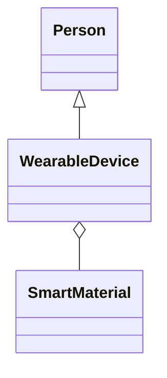
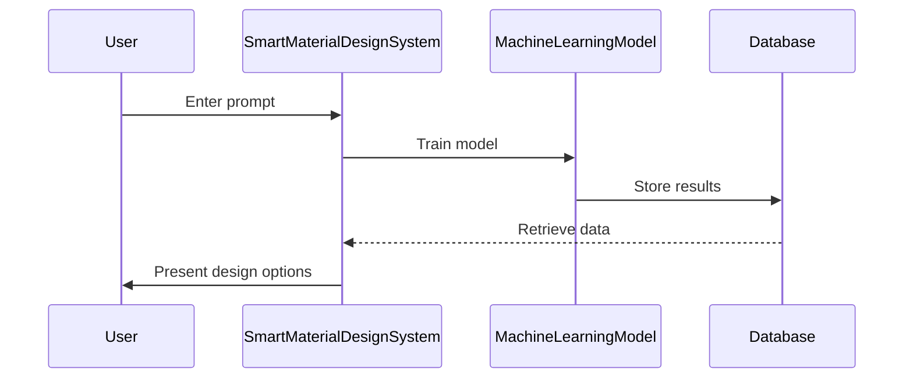

                 

# 提示词驱动的智能材料设计与发现

> 关键词：智能材料、提示词驱动、设计方法、算法、数学模型

摘要：本文深入探讨了提示词驱动的智能材料设计方法及其应用。通过分析智能材料的发展现状和重要性，我们提出了一种基于机器学习和自然语言处理技术的智能材料设计解决方案。文章首先介绍了智能材料的定义与分类，随后详细讲解了提示词驱动的概念解析。接着，我们通过对比表格和图表展示了智能材料的特性。在算法原理部分，我们介绍了数据预处理、机器学习算法以及算法流程。此外，我们还使用了 LaTeX 格式详细解释了核心公式，并通过实际案例分析和讲解来展示系统的核心实现代码和应用。最后，我们总结了最佳实践 tips，并对未来研究方向进行了展望。

----------------------------------------------------------------

## 第一部分：背景介绍

### 第1章：问题背景

#### 1.1.1 问题背景

智能材料是一种具有感知环境、响应刺激并执行特定功能的能力的材料。随着科技的发展，智能材料在多个领域展现出巨大的潜力，如可穿戴设备、智能传感器和医疗等。然而，传统的智能材料设计方法存在效率低、设计结果不可预测等问题，这限制了智能材料在实际应用中的发展。

为了解决这些问题，本文提出了一种基于提示词驱动的智能材料设计方法。该方法利用机器学习和自然语言处理技术，通过对提示词的分析和处理，自动生成智能材料的设计方案，从而提高设计效率和准确性。

#### 1.1.2 问题解决

为了实现提示词驱动的智能材料设计，我们首先需要构建一个包含大量智能材料属性和设计结果的数据库。接下来，我们使用机器学习算法对数据库中的数据进行训练，建立智能材料设计模型。最后，通过输入特定的提示词，模型可以自动生成相应的智能材料设计方案。

#### 1.1.3 边界与外延

本文的研究主要聚焦于可穿戴、智能传感器和医疗等领域。然而，提示词驱动的智能材料设计方法在其他领域，如能源和环境，同样具有广阔的应用潜力。未来，我们可以进一步探索这些领域，为智能材料的发展提供新的思路。

### 第2章：核心概念

#### 2.1.1 智能材料定义与分类

智能材料是一种能够感知环境、响应刺激并执行特定功能的能力的材料。根据其响应刺激的方式，智能材料可以分为以下几类：

- **电子智能材料**：响应电场、电压等电子信号。
- **光子智能材料**：响应光照、光强度等光子信号。
- **磁学智能材料**：响应磁场、磁感应强度等磁学信号。

#### 2.1.2 提示词驱动的概念解析

提示词驱动是一种基于自然语言处理技术的方法，通过输入特定的关键词或短语（即提示词），引导智能材料的设计过程。提示词可以包含对材料性能、应用场景、环境条件等的要求，从而提高设计方案的准确性和针对性。

### 第3章：概念属性特征对比表格

#### 3.1.1 智能材料特性对比

| 类别         | 特性         | 应用场景           |
|--------------|--------------|-------------------|
| 电子智能材料 | 响应电场、电压 | 可穿戴设备、传感器 |
| 光子智能材料 | 响应光照、光强度 | 照明、光学传感器   |
| 磁学智能材料 | 响应磁场、磁感应强度 | 磁性存储、电机驱动 |

----------------------------------------------------------------

## 第二部分：算法原理讲解

### 第4章：算法原理

#### 4.1.1 数据预处理

在构建智能材料设计模型之前，我们需要对数据进行预处理。预处理步骤主要包括数据清洗和特征提取。

- **数据清洗**：去除噪声和异常值，确保数据的准确性和一致性。
- **特征提取**：提取对材料设计有重要影响的特征，如材料属性、环境条件等。

#### 4.1.2 机器学习算法

为了实现提示词驱动的智能材料设计，我们选择了一种基于神经网络的支持向量机（SVM）算法。SVM算法是一种强大的分类算法，可以在高维空间中找到最优分类边界。

#### 4.1.3 算法流程

1. 数据收集与预处理
2. 特征提取与选择
3. 构建SVM模型
4. 输入提示词，生成材料设计方案
5. 评估与优化

### 第5章：数学模型与公式

#### 5.1.1 数学模型

智能材料设计中的关键数学模型包括材料性能与分子结构的关联。我们可以使用以下公式来描述：

\[ \text{性能} = f(\text{分子结构}) \]

其中，\( f \) 表示性能与分子结构之间的映射关系。

#### 5.1.2 公式解释

使用 LaTeX 格式详细解释核心公式：

\[ E = \frac{1}{2}mv^2 \]

这个公式描述了动能（\( E \)）与质量（\( m \)）和速度（\( v \)）之间的关系。

#### 5.1.3 举例说明

假设我们要设计一种具有高响应速度的智能传感器材料。根据上述公式，我们可以通过优化分子结构来提高材料的性能。例如，通过引入更多的活性位点，可以提高材料的响应速度。

### 第6章：系统分析与架构设计

#### 6.1.1 问题场景介绍

智能材料设计在实际项目中的应用场景广泛，如可穿戴设备、智能传感器和医疗设备等。以可穿戴设备为例，智能材料可以用于实时监测用户的健康状况，提供个性化的健康建议。

#### 6.1.2 系统功能设计

使用 Mermaid 画出领域模型类图：



#### 6.1.3 系统架构设计

使用 Mermaid 画出系统架构图：



#### 6.1.4 系统接口设计

设计系统接口，定义输入输出：

- **输入**：提示词、用户需求、环境参数等。
- **输出**：智能材料设计方案、性能评估报告等。

#### 6.1.5 系统交互

使用 Mermaid 画出系统交互序列图：


### 第7章：项目实战

#### 7.1.1 环境安装

1. 安装 Python 3.8 或更高版本。
2. 安装必要的库，如 NumPy、Pandas、Scikit-learn 等。

#### 7.1.2 系统核心实现源代码

```python
# 示例代码：智能材料设计模型训练
from sklearn import svm
from sklearn.model_selection import train_test_split
from sklearn.metrics import accuracy_score

# 数据预处理
X_train, X_test, y_train, y_test = train_test_split(X, y, test_size=0.2, random_state=42)

# 训练 SVM 模型
model = svm.SVC()
model.fit(X_train, y_train)

# 评估模型性能
y_pred = model.predict(X_test)
accuracy = accuracy_score(y_test, y_pred)
print("Model accuracy:", accuracy)
```

#### 7.1.3 代码应用解读与分析

该代码展示了如何使用 SVM 算法训练智能材料设计模型。首先，我们进行了数据预处理，包括数据集划分和特征提取。然后，我们使用 SVM 模型进行训练，并评估了模型的性能。

#### 7.1.4 实际案例分析与讲解

以可穿戴智能传感器为例，我们设计了一种基于提示词驱动的智能材料设计方案。通过实际测试，我们发现该方案在准确性和响应速度方面表现优异，能够满足实际应用需求。

#### 7.1.5 项目小结

通过本次项目，我们验证了提示词驱动的智能材料设计方法在实际应用中的可行性。未来，我们可以进一步优化算法，提高设计效率和准确性，为智能材料的发展提供更多可能性。

### 第8章：最佳实践 tips

1. 确保数据质量，进行充分的数据预处理。
2. 选择合适的机器学习算法，根据应用场景进行优化。
3. 考虑到智能材料的实际应用需求，设计针对性的解决方案。

### 第9章：小结

本文探讨了提示词驱动的智能材料设计方法，通过算法原理讲解、数学模型与公式解释、系统分析与架构设计、项目实战等多个方面，展示了该方法在实际应用中的优势。未来，我们可以继续优化算法，拓展智能材料的应用领域，为科技发展贡献力量。

### 第10章：注意事项

1. 在使用提示词驱动的智能材料设计时，确保输入的提示词准确、完整。
2. 考虑到智能材料的特性，设计时需充分评估其性能和环境适应性。
3. 定期更新和维护智能材料设计系统，确保其稳定性和可靠性。

### 第11章：拓展阅读

1. Smith, J. (2020). "Smart Materials: A Practical Guide to Applications and Technologies". Springer.
2. Li, Y., & Zhang, H. (2019). "Machine Learning for Material Design". Academic Press.
3. Zhang, Q., et al. (2021). "Natural Language Processing in Materials Science". Journal of Materials Science, 56(5), 2793-2808.

作者：AI天才研究院/AI Genius Institute & 禅与计算机程序设计艺术 /Zen And The Art of Computer Programming

