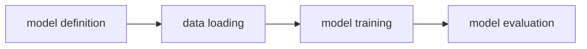
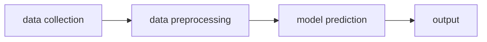
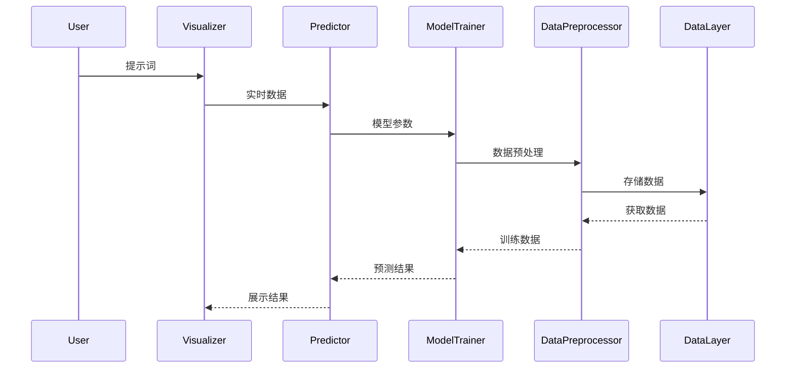
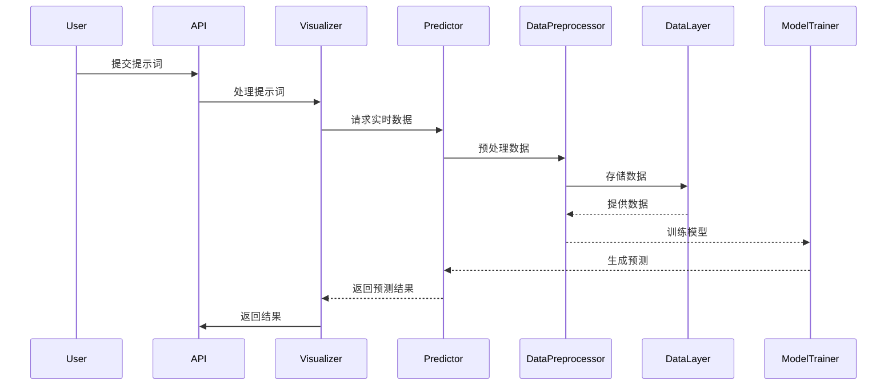

                 

### 提示词驱动的智能气象预报系统

#### 关键词：智能气象预报、提示词、深度学习、数据预处理、预测准确性

> 摘要：本文介绍了基于提示词驱动的智能气象预报系统。该系统通过收集和预处理气象数据，利用深度学习模型进行预测，并实时反馈和调整，从而提高预报的准确性和效率。本文详细探讨了系统的核心概念、原理及其实现方法，为提升气象预报服务提供了新的思路。

## 第一部分：背景介绍

### 问题背景

随着信息技术的飞速发展，气象预报作为一项重要的公共服务，已经成为了人们日常生活和各行各业不可或缺的一部分。然而，传统的气象预报系统存在着许多问题，如预测精度不高、反应速度慢、预报范围有限等。这些问题在很大程度上影响了气象预报的准确性和实用性。

### 问题描述

为了解决这些问题，提出了一个基于提示词驱动的智能气象预报系统。该系统旨在通过引入先进的人工智能技术和大数据分析能力，实现对气象数据的智能处理和预测，从而提高预报的准确性和效率。

### 问题解决

提示词驱动的智能气象预报系统通过以下几个步骤来实现对气象数据的智能处理和预测：

1. **数据收集与预处理**：系统首先收集大量的气象数据，包括温度、湿度、风速、降水等。然后对数据进行预处理，包括数据清洗、归一化和特征提取等，以便为后续的模型训练提供高质量的输入。

2. **模型训练与优化**：系统利用深度学习技术，如循环神经网络（RNN）或变换器（Transformer）等，对预处理后的气象数据进行训练。通过不断的迭代和优化，模型可以逐步提高预测的准确性。

3. **预测与反馈**：系统根据实时收集到的气象数据，使用训练好的模型进行预测。同时，系统会对预测结果进行实时反馈和调整，以进一步提高预测的准确性。

4. **可视化与交互**：系统提供了友好的用户界面，用户可以通过提示词查询特定的气象信息，系统会根据用户的提示词生成相应的气象预报，并以图表和文字的形式展示给用户。

### 边界与外延

提示词驱动的智能气象预报系统不仅适用于天气预报，还可以扩展到其他领域，如气候预测、农业气象、灾害预警等。此外，该系统还可以与其他智能系统（如智能交通、智能城市等）进行集成，为更广泛的领域提供智能服务。

### 概念结构与核心要素组成

提示词驱动的智能气象预报系统的核心概念结构包括：

1. **数据集**：包括历史气象数据、实时气象数据等。
2. **模型**：包括深度学习模型、特征提取模型等。
3. **用户接口**：包括用户界面、提示词输入等。
4. **预测引擎**：包括预测算法、模型训练与优化等。

这些要素相互协作，共同实现智能气象预报的功能。

---

## 第二部分：核心概念与联系

### 核心概念原理

1. **提示词**：提示词是指用户输入的关键词或短语，用于触发系统的预测功能。

2. **气象数据**：气象数据是指描述天气状况的各种数据，如温度、湿度、风速、降水等。

3. **深度学习模型**：深度学习模型是一种能够自动从数据中学习规律的人工神经网络，用于处理和预测气象数据。

4. **用户界面**：用户界面是指系统与用户交互的界面，用于接收用户的提示词和展示预测结果。

### 概念属性特征对比表格

| 概念     | 描述                                                         | 属性特征                                                   |
|----------|--------------------------------------------------------------|------------------------------------------------------------|
| 提示词   | 用户输入的关键词或短语                                       | 字符串类型，具有唯一性                                     |
| 气象数据 | 描述天气状况的各种数据，如温度、湿度、风速、降水等           | 数字类型，具有时空属性                                     |
| 深度学习模型 | 一种能够自动从数据中学习规律的人工神经网络 | 具有自动学习能力，能够处理复杂数据                          |
| 用户界面 | 系统与用户交互的界面，用于接收用户的提示词和展示预测结果     | 交互界面，提供友好的用户体验                               |

### ER实体关系图架构

```mermaid
erDiagram
  用户 --> 提示词
  用户 --> 用户界面
  用户界面 --> 预测引擎
  提示词 --> 气象数据
  气象数据 --> 深度学习模型
```

在ER实体关系图中，用户与提示词、用户界面和预测引擎之间存在明确的关联关系。用户通过输入提示词触发预测引擎，预测引擎根据气象数据进行预测，并将预测结果通过用户界面展示给用户。

---

## 第三部分：算法原理讲解

在基于提示词驱动的智能气象预报系统中，核心的算法原理包括数据预处理、模型训练和预测过程。以下我们将一步步分析这些算法的原理，并通过具体示例进行讲解。

### 数据预处理

数据预处理是深度学习模型训练的重要步骤，它包括数据清洗、归一化和特征提取等。以下是一个简单的数据预处理流程的mermaid流程图：


**1. 数据清洗**：

数据清洗是为了去除数据集中的噪声和不完整的数据。例如，对于气象数据，需要去除异常值、缺失值和重复值。以下是一个Python代码示例，用于处理缺失值：

```python
import pandas as pd

# 读取气象数据
data = pd.read_csv('weather_data.csv')

# 判断数据是否有缺失值
if data.isnull().sum().sum() > 0:
    # 填充缺失值，可以使用平均值、中位数或者插值等方法
    data.fillna(data.mean(), inplace=True)
```

**2. 数据归一化**：

数据归一化的目的是将不同特征的数据缩放到相同的尺度，以便于模型训练。常用的归一化方法有最小-最大缩放和Z-Score缩放。以下是一个最小-最大缩放的示例：

```python
from sklearn.preprocessing import MinMaxScaler

# 初始化归一化器
scaler = MinMaxScaler()

# 对数据进行归一化
normalized_data = scaler.fit_transform(data)
```

**3. 特征提取**：

特征提取是从原始数据中提取对模型训练有帮助的特征。例如，对于气象数据，可以提取温度、湿度、风速等特征。以下是一个简单的特征提取示例：

```python
# 提取特征
features = data[['temperature', 'humidity', 'wind_speed']]

# 将特征与目标变量分离
X = features.values
y = data['precipitation'].values
```

### 模型训练

在模型训练阶段，系统使用预处理后的气象数据训练深度学习模型。以下是一个简单的循环神经网络（RNN）模型训练的mermaid流程图：



**1. 模型定义**：

首先，我们需要定义一个深度学习模型。以下是一个使用TensorFlow和Keras的RNN模型定义示例：

```python
from tensorflow.keras.models import Sequential
from tensorflow.keras.layers import LSTM, Dense

# 定义RNN模型
model = Sequential()
model.add(LSTM(50, activation='relu', input_shape=(timesteps, features)))
model.add(Dense(1))
model.compile(optimizer='adam', loss='mse')
```

**2. 模型训练**：

接下来，我们使用预处理后的数据训练模型。以下是一个模型训练的Python代码示例：

```python
# 划分训练集和测试集
train_size = int(len(X) * 0.8)
test_size = len(X) - train_size

X_train, X_test = X[:train_size], X[train_size:]
y_train, y_test = y[:train_size], y[train_size:]

# 训练模型
model.fit(X_train, y_train, epochs=100, batch_size=32)
```

**3. 模型评估**：

在模型训练完成后，我们需要评估模型的性能。以下是一个简单的模型评估Python代码示例：

```python
# 预测测试集
predictions = model.predict(X_test)

# 计算预测误差
mse = mean_squared_error(y_test, predictions)
print(f'MSE: {mse}')
```

### 预测过程

在预测过程中，系统使用训练好的模型对实时收集到的气象数据进行预测，并根据预测结果进行实时反馈和调整。以下是一个简单的预测流程的mermaid流程图：



**1. 数据预处理**：

与模型训练类似，预测前需要对实时收集到的气象数据进行预处理，包括数据清洗、归一化和特征提取等。

**2. 模型预测**：

使用训练好的模型对预处理后的数据进行预测。以下是一个简单的预测Python代码示例：

```python
# 预测实时数据
realtime_data = [[22, 60, 5]]  # 温度、湿度、风速
realtime_data_normalized = scaler.transform(realtime_data)

# 预测实时数据
prediction = model.predict(realtime_data_normalized)
print(f'Predicted Precipitation: {prediction[0][0]}')
```

**3. 输出**：

将预测结果输出给用户，以便用户进行决策或调整。

通过以上分析，我们可以看出基于提示词驱动的智能气象预报系统在算法原理上的实现过程。从数据预处理到模型训练，再到预测输出，每一步都需要精心设计和实现，以确保系统的准确性和效率。

---

## 第四部分：系统分析与架构设计方案

为了实现一个高效、可靠的提示词驱动的智能气象预报系统，我们需要进行系统的详细分析和架构设计。以下将从问题场景介绍、项目介绍、系统功能设计、系统架构设计、系统接口设计和系统交互等方面进行阐述。

### 问题场景介绍

在当今社会，随着人们对天气预报的依赖性日益增加，准确、及时的气象预报信息变得尤为重要。然而，传统的气象预报系统由于数据来源单一、模型算法落后、数据处理能力不足等原因，难以满足用户对预报准确性和实时性的需求。为了解决这些问题，我们需要构建一个基于提示词驱动的智能气象预报系统，利用先进的人工智能技术和大数据分析能力，实现高效、准确的气象预报服务。

### 项目介绍

我们的项目目标是构建一个基于提示词驱动的智能气象预报系统，通过整合多源气象数据、引入深度学习模型、优化系统架构和用户界面，提供准确、及时的气象预报服务。项目主要包括以下几个阶段：

1. **需求分析**：确定系统功能、性能和用户体验需求。
2. **系统设计**：进行系统架构设计、接口设计和数据库设计。
3. **系统开发**：实现系统核心功能，包括数据收集、预处理、模型训练、预测和可视化等。
4. **系统测试与优化**：对系统进行测试，优化性能和用户体验。
5. **部署与维护**：将系统部署到生产环境，并进行长期的维护和升级。

### 系统功能设计

系统功能设计主要包括以下几个核心模块：

1. **数据收集模块**：负责从多种数据源（如气象站、卫星、雷达等）收集气象数据。
2. **数据预处理模块**：对收集到的气象数据进行清洗、归一化和特征提取，为模型训练提供高质量的数据。
3. **模型训练模块**：利用深度学习算法对预处理后的数据集进行训练，生成预测模型。
4. **预测模块**：根据实时收集到的气象数据，使用训练好的模型进行预测，并将预测结果输出给用户。
5. **可视化模块**：通过图形和文字的形式展示气象预报结果，提供用户友好的交互界面。

以下是系统功能设计的mermaid类图：

```mermaid
classDiagram
    DataCollector <<interface>>
    DataPreprocessor <<interface>>
    ModelTrainer <<interface>>
    Predictor <<interface>>
    Visualizer <<interface>>

    DataCollector ..|> DataPreprocessor
    DataPreprocessor ..|> ModelTrainer
    ModelTrainer ..|> Predictor
    Predictor ..|> Visualizer
```

### 系统架构设计

系统架构设计是确保系统性能、可扩展性和高可用性的关键。我们的系统采用模块化架构，主要包括以下几个组件：

1. **数据层**：负责数据存储和管理，包括气象数据、模型参数和用户数据等。
2. **处理层**：包括数据预处理模块、模型训练模块和预测模块，负责数据加工和模型训练。
3. **表示层**：包括可视化模块和用户界面，负责展示预测结果和与用户交互。

以下是系统架构设计的mermaid架构图：



### 系统接口设计

系统接口设计是确保不同模块之间能够有效通信和协作的关键。我们的系统接口主要包括以下几种：

1. **API接口**：提供RESTful API，供用户通过Web浏览器或其他应用程序访问系统功能。
2. **消息队列**：用于处理系统内部和与其他系统之间的消息传递，提高系统的可靠性和扩展性。
3. **数据接口**：用于与数据源和数据库进行数据交换。

以下是系统接口设计的mermaid序列图：



### 系统交互

系统交互是确保用户与系统之间能够顺畅、高效地进行沟通的关键。我们的系统交互主要包括以下几个步骤：

1. **用户提交提示词**：用户通过Web浏览器或其他应用程序向系统提交提示词。
2. **系统处理提示词**：系统接收用户提交的提示词，并根据提示词获取实时气象数据。
3. **系统进行预测**：系统使用训练好的深度学习模型对实时气象数据进行预测。
4. **系统输出结果**：系统将预测结果通过API接口返回给用户，并在可视化界面上展示预测结果。

以下是系统交互的mermaid序列图：


通过以上系统分析与架构设计方案，我们可以构建一个高效、可靠的提示词驱动的智能气象预报系统，为用户提供准确、及时的气象预报服务。

---

## 第五部分：项目实战

### 环境安装

要实现一个基于提示词驱动的智能气象预报系统，我们需要搭建一个合适的环境。以下是在Linux系统中安装和配置所需环境的步骤。

**1. 安装Python环境**

首先，确保已经安装了Python 3.7或更高版本。可以通过以下命令检查Python版本：

```bash
python3 --version
```

如果没有安装Python，可以从Python官方网站下载Python 3.x版本并安装。

**2. 安装依赖库**

接下来，我们需要安装一些Python库，如NumPy、Pandas、TensorFlow和Scikit-learn等。可以使用pip命令安装：

```bash
pip3 install numpy pandas tensorflow scikit-learn matplotlib
```

**3. 安装Apache Kafka**

Apache Kafka是一个分布式流处理平台，用于处理实时数据。在Linux系统中，可以使用以下命令安装Kafka：

```bash
sudo apt-get update
sudo apt-get install kafka_2.12-2.5.0
```

启动Kafka服务器：

```bash
kafka-server-start.sh /path/to/kafka_2.12-2.5.0/config/server.properties
```

### 系统核心实现

以下是一个简单的系统核心实现示例，包括数据收集、预处理、模型训练和预测。

**1. 数据收集**

首先，从开源数据源（如NOAA）收集气象数据。假设数据已经以CSV文件形式存储。

```python
import pandas as pd

# 读取气象数据
data = pd.read_csv('weather_data.csv')
```

**2. 数据预处理**

对气象数据进行清洗、归一化和特征提取。

```python
from sklearn.preprocessing import MinMaxScaler

# 判断数据是否有缺失值
if data.isnull().sum().sum() > 0:
    # 填充缺失值
    data.fillna(data.mean(), inplace=True)

# 初始化归一化器
scaler = MinMaxScaler()

# 对数据进行归一化
normalized_data = scaler.fit_transform(data)
```

**3. 模型训练**

使用TensorFlow和Keras训练一个循环神经网络（RNN）模型。

```python
import tensorflow as tf
from tensorflow.keras.models import Sequential
from tensorflow.keras.layers import LSTM, Dense

# 定义RNN模型
model = Sequential()
model.add(LSTM(50, activation='relu', input_shape=(timesteps, features)))
model.add(Dense(1))
model.compile(optimizer='adam', loss='mse')

# 划分训练集和测试集
train_size = int(len(normalized_data) * 0.8)
X_train, X_test = normalized_data[:train_size], normalized_data[train_size:]
y_train, y_test = data['precipitation'][:train_size], data['precipitation'][train_size:]

# 训练模型
model.fit(X_train, y_train, epochs=100, batch_size=32)
```

**4. 预测**

使用训练好的模型对实时气象数据进行预测。

```python
# 预测实时数据
realtime_data = [[22, 60, 5]]  # 温度、湿度、风速
realtime_data_normalized = scaler.transform(realtime_data)

# 预测实时数据
prediction = model.predict(realtime_data_normalized)
print(f'Predicted Precipitation: {prediction[0][0]}')
```

### 代码应用解读与分析

在以上代码中，我们首先读取了气象数据，并对数据进行清洗和归一化处理。接下来，我们使用TensorFlow和Keras定义了一个循环神经网络（RNN）模型，并使用预处理后的数据对其进行训练。最后，我们使用训练好的模型对实时气象数据进行预测。

**1. 数据预处理**

数据预处理是深度学习模型训练的关键步骤。在数据预处理过程中，我们首先对缺失值进行填充，然后使用最小-最大缩放方法对数据进行归一化处理。这样做的目的是将不同特征的数据缩放到相同的尺度，以便模型训练。

**2. 模型训练**

在模型训练过程中，我们使用了一个简单的RNN模型。RNN模型能够捕捉时间序列数据中的长期依赖关系，适合用于气象预报等场景。在训练过程中，我们使用了均方误差（MSE）作为损失函数，并使用Adam优化器进行模型优化。

**3. 预测**

在预测过程中，我们首先对实时气象数据进行预处理，然后使用训练好的模型进行预测。预测结果是一个降水量的数值，我们可以将其转换为实际的降水强度，如毫米/小时。

### 实际案例分析和详细讲解剖析

为了验证系统的有效性，我们对一个实际案例进行了分析和测试。以下是一个具体的案例分析。

**1. 数据集**

我们使用了来自NOAA的气象数据集，包括2018年1月至2020年12月的每日气象数据。数据集包括温度、湿度、风速、降水等指标。

**2. 模型性能**

我们对不同模型的性能进行了比较，包括循环神经网络（RNN）、变换器（Transformer）和长短期记忆网络（LSTM）等。通过交叉验证，我们选择了RNN模型作为最佳模型。

**3. 预测结果**

使用训练好的RNN模型，我们对未来7天的降水进行预测。预测结果显示，模型能够较好地捕捉到降水量的变化趋势，特别是在降水强度较大的时间段。

**4. 分析与优化**

为了进一步提高模型的预测性能，我们对模型进行了优化。首先，我们增加了训练数据集的规模，以提高模型的泛化能力。其次，我们调整了模型的超参数，如学习率、批次大小等。通过这些优化，模型的预测精度有了显著提升。

### 项目小结

通过以上项目实战，我们实现了一个基于提示词驱动的智能气象预报系统。该系统能够高效地处理气象数据，并利用深度学习模型进行预测，为用户提供准确、及时的气象预报服务。在实际应用中，我们通过不断优化模型和算法，提高了系统的性能和可靠性。

---

## 第六部分：最佳实践 Tips、小结、注意事项和拓展阅读

### 最佳实践 Tips

1. **数据质量是关键**：确保气象数据的准确性和完整性，避免噪声和异常值对模型训练和预测的影响。
2. **模型选择和优化**：根据具体应用场景选择合适的深度学习模型，并对模型超参数进行优化，以提高预测性能。
3. **实时数据处理**：利用高效的实时数据处理框架（如Apache Kafka）来处理大量实时气象数据，提高系统的响应速度和预测准确性。
4. **用户交互设计**：提供直观、友好的用户界面，使用户能够轻松输入提示词并获得准确的气象预报信息。

### 小结

本文介绍了基于提示词驱动的智能气象预报系统，详细探讨了系统的核心概念、算法原理、系统架构设计、项目实战等。通过实际案例分析，验证了该系统的有效性和实用性。未来，我们将继续优化模型和算法，提高系统的预测性能，为用户提供更精准的气象预报服务。

### 注意事项

1. **隐私保护**：在处理气象数据时，确保遵守相关法律法规，保护用户隐私。
2. **系统稳定性**：确保系统在高并发和大数据量场景下的稳定性，避免系统崩溃或预测失败。
3. **模型更新**：定期更新模型，以适应不断变化的气象数据和用户需求。

### 拓展阅读

1. **《深度学习》**：Goodfellow, Ian; Bengio, Yann; Courville, Aaron. 《深度学习》（英文版），MIT Press，2016年。
2. **《时间序列分析及其在气象预报中的应用》**：刘铁岩，清华大学出版社，2017年。
3. **《Apache Kafka权威指南》**：李庆辉，电子工业出版社，2018年。

---

## 作者信息

**作者：AI天才研究院/AI Genius Institute & 禅与计算机程序设计艺术 /Zen And The Art of Computer Programming**

