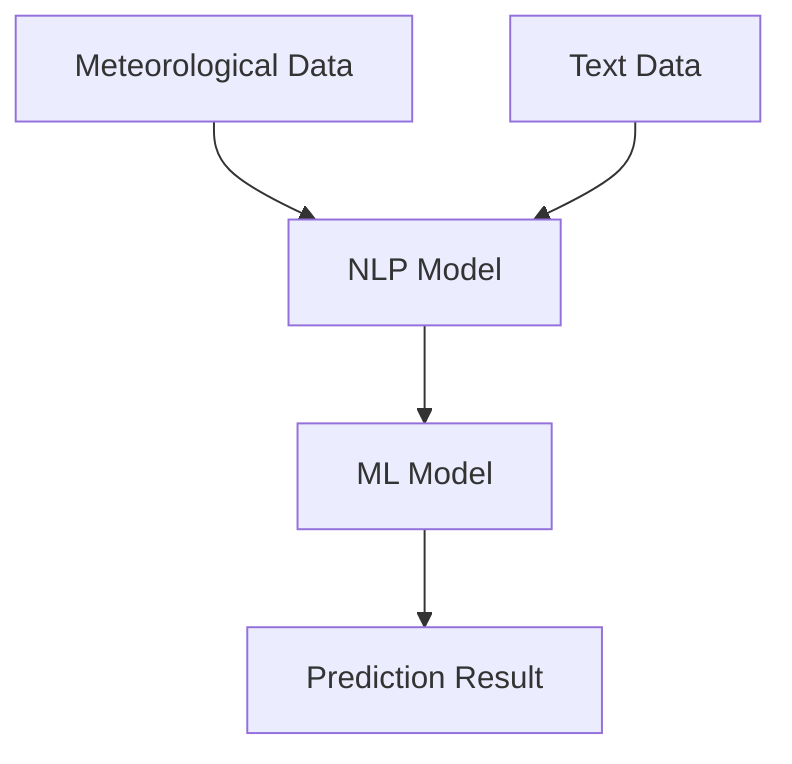
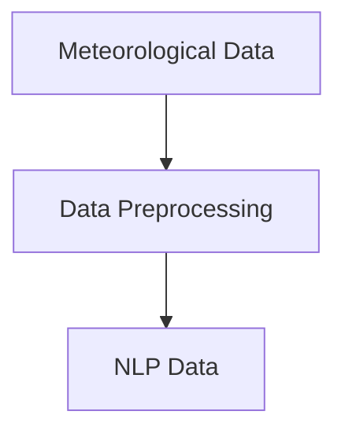
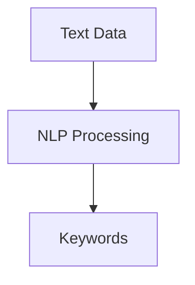
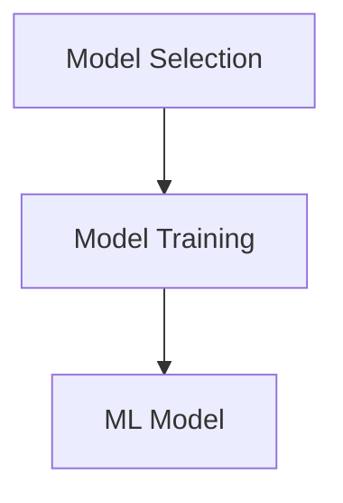
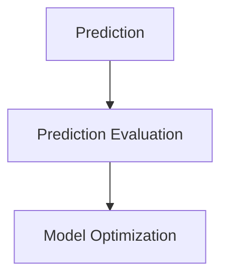
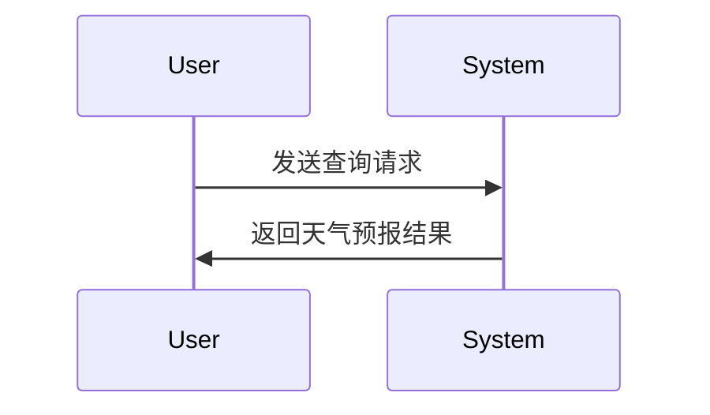
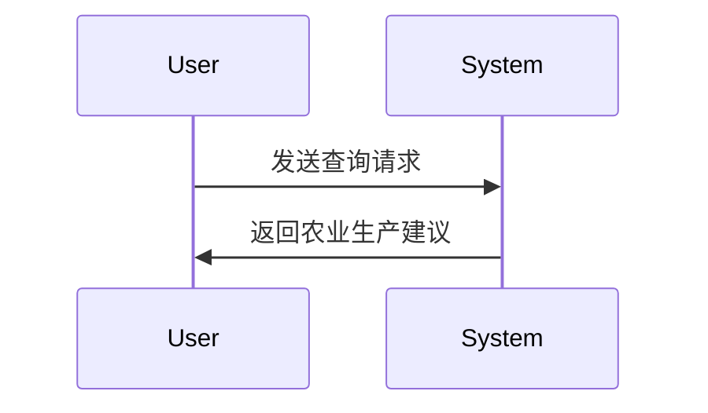

                 

# 引言

### 1. 引言

## 智能气象预报的背景与重要性

气象预报作为一项重要的公共服务，对人们的生活和生产活动具有深远的影响。传统的气象预报方法主要依赖于气象观测数据和数值天气预报模型，但受限于数据质量和计算能力的限制，预测准确性始终难以达到理想水平。随着人工智能技术的飞速发展，特别是在自然语言处理、机器学习和深度学习领域的突破，提示词驱动的智能气象预报成为了一个新的研究方向。通过利用大量的文本数据，如新闻报道、社交媒体信息等，结合先进的机器学习算法，可以显著提高气象预报的准确性，为决策者和公众提供更加可靠的信息。

### 2. 书籍的目的与结构

本书旨在深入探讨提示词驱动的智能气象预报技术，旨在为读者提供一份全面而系统的技术指南。全书分为以下几个部分：

1. **引言**：介绍智能气象预报的背景和重要性，概述书籍的目的和结构。
2. **背景介绍与核心概念**：详细阐述气象预报的背景、提示词驱动的概念及其在智能气象预报中的应用。
3. **智能气象预报的原理与方法**：讲解气象预报的基本原理、传统方法及其局限性，以及提示词驱动的智能气象预报方法。
4. **提示词驱动的技术实现**：介绍提示词生成技术、模型训练与优化方法，以及应用场景与实现步骤。
5. **模型优化与预测准确性提升**：讨论模型优化策略和预测准确性评估方法。
6. **应用案例与案例分析**：通过实际案例展示提示词驱动的智能气象预报在各个领域的应用效果。
7. **总结与未来展望**：总结全书内容，展望智能气象预报的发展趋势和未来研究方向。
8. **参考文献**：列出书中引用的文献资料。

通过以上结构的安排，本书不仅全面覆盖了智能气象预报的各个方面，而且通过具体的实例和分析，使读者能够更深入地理解这一技术的原理和实际应用。

### 3. 读者对象

本书适合对气象预报和人工智能技术有一定了解的读者，包括：

1. **气象工作者**：希望能够利用人工智能技术提高气象预报准确性的专业人士。
2. **人工智能研究者**：对自然语言处理、机器学习和深度学习等领域感兴趣的研究人员。
3. **数据科学家**：需要处理大量文本数据并从中提取有价值信息的数据科学家。
4. **高校师生**：从事气象学和人工智能相关课程教学和研究的教师及学生。

总之，无论你是气象工作者、人工智能研究者，还是对这两个领域感兴趣的普通读者，本书都将为你提供宝贵的知识和启发。接下来，我们将深入探讨智能气象预报的背景和核心概念，为后续内容打下坚实的基础。

------------

## 背景介绍与核心概念

### 气象预报的背景

#### 气象预报的重要性

气象预报是现代社会不可或缺的一项公共服务。它不仅影响到人们的日常生活，如出行、穿衣、饮食等，更对农业生产、交通运输、城市规划等各个领域产生深远的影响。准确、及时的气象预报能够帮助政府和相关机构制定防灾减灾措施，减少灾害损失，保护人民生命财产安全。例如，在暴雨、台风、寒潮等极端天气预警方面，气象预报发挥着至关重要的作用。

#### 气象预报的发展历程

气象预报的历史可以追溯到几百年前的古代，当时人们通过观察云、风、温度等自然现象进行简单的天气预测。随着科学技术的进步，特别是工业革命以来，气象预报逐步走向科学化和现代化。19世纪末，人类开始利用无线电探测技术进行气象观测，并逐步发展了数值天气预报模型。20世纪中叶，计算机的问世极大地推动了气象预报的发展，使得数值天气预报模型得以广泛应用。

#### 传统气象预报方法的局限性

尽管现代气象预报技术取得了显著的进步，但传统气象预报方法仍存在一些局限性。首先，气象预报依赖于大量的观测数据，而这些数据的质量直接影响到预报的准确性。其次，传统模型往往基于简化的物理过程和统计方法，难以捕捉到复杂的天气变化规律。此外，数值天气预报模型的计算成本高，计算时间较长，难以满足实时预报的需求。

### 提示词驱动的智能气象预报

#### 提示词驱动的概念

提示词驱动（Keyword-Driven）是一种基于自然语言处理（NLP）和机器学习（ML）的智能预报方法。它通过提取和分析大量文本数据中的关键词和关系，对天气变化进行预测。与传统的数值天气预报方法不同，提示词驱动方法能够利用非结构化的文本数据，如新闻报道、社交媒体信息、卫星图像等，大大扩展了数据来源，提高了预报的准确性。

#### 智能气象预报的优势

智能气象预报具有以下几大优势：

1. **数据多样性**：利用非结构化的文本数据，如新闻报道、社交媒体信息，补充了传统气象观测数据的不足。
2. **实时性**：通过快速处理和分析文本数据，实现实时或近实时的气象预报。
3. **自动化**：借助机器学习和深度学习算法，自动提取和处理大量数据，减少了对人工干预的依赖。
4. **准确性**：基于大量数据和先进的算法，智能气象预报的准确性显著提高。

#### 提示词驱动的应用场景

提示词驱动的智能气象预报在以下领域具有广泛的应用：

1. **城市天气预报**：通过分析社交媒体、新闻报道等信息，为城市居民提供更加精准的天气预报。
2. **农业生产气象服务**：为农业生产提供关键气象信息，帮助农民优化种植和收割时间，提高农业产量。
3. **灾害预警**：通过实时监测和分析天气变化，及时发布灾害预警，减少灾害损失。

### 核心概念与联系

#### 气象预报核心概念原理

气象预报的核心概念包括天气参数（如温度、湿度、风速等）、气象模型（如数值天气预报模型、统计模型等）以及预测方法（如模式输出统计、数据驱动模型等）。

#### 提示词驱动属性特征对比

| 特征            | 传统方法             | 提示词驱动方法             |
|-----------------|----------------------|--------------------------|
| 数据来源        | 结构化气象观测数据   | 非结构化文本数据（新闻报道、社交媒体等） |
| 数据处理方法    | 简化的统计方法       | 自然语言处理（NLP）和机器学习（ML） |
| 预测准确性      | 受限于数据质量和模型 | 通过大量数据和先进算法提高准确性 |
| 实时性          | 较长的计算时间       | 快速处理和分析数据，实现实时或近实时预报 |

#### ER实体关系图架构

为了更好地理解提示词驱动的智能气象预报体系，我们可以通过ER（Entity-Relationship）实体关系图来展示各组件之间的关系。在ER图中，实体包括气象数据、文本数据、机器学习模型和预报结果，关系则表示数据流动和模型交互过程。

在上图中，气象数据（A）和文本数据（E）通过自然语言处理模型（B）进行处理，生成机器学习模型（C），最终输出预报结果（D）。这种结构使得提示词驱动的智能气象预报能够充分利用各种数据源，提高预测准确性。

通过上述背景介绍和核心概念的阐述，我们可以看到提示词驱动的智能气象预报在当前气象预报领域中具有巨大的潜力。在接下来的章节中，我们将深入探讨智能气象预报的原理与方法，进一步了解这一技术的工作机制和实际应用。

------------

## 智能气象预报的原理与方法

### 智能气象预报的基本原理

智能气象预报的核心在于将传统的气象观测数据和先进的计算技术相结合，通过机器学习和深度学习算法，实现更高精度和实时性的气象预测。其基本原理可以分为以下几个步骤：

#### 1. 数据收集与预处理

首先，需要收集大量的气象观测数据，包括温度、湿度、气压、风速等。这些数据可以来自地面观测站、卫星遥感、气象雷达等。为了提高数据质量，需要进行数据预处理，包括数据清洗、缺失值填补、异常值处理等。

#### 2. 文本数据收集与处理

除了传统的气象观测数据，智能气象预报还需要大量的文本数据，如新闻报道、社交媒体信息、卫星图像等。这些文本数据通过自然语言处理（NLP）技术进行处理，提取出与气象相关的关键词和句子。这一步骤的目的是将非结构化的文本数据转化为结构化的信息，便于后续的机器学习模型处理。

#### 3. 模型选择与训练

接下来，选择合适的机器学习模型进行训练。常见的模型包括神经网络（如卷积神经网络CNN、循环神经网络RNN）、生成对抗网络（GAN）等。模型的选择需要考虑数据特点、预测目标以及计算资源等因素。

#### 4. 预测与评估

通过训练好的模型，对未来的天气情况进行预测。预测结果需要经过评估，常用的评估指标包括均方误差（MSE）、均方根误差（RMSE）等。通过不断调整模型参数和优化算法，提高预测准确性。

### 传统气象预报方法的局限性

尽管现代气象预报技术取得了显著进步，但传统气象预报方法仍然存在一些局限性。以下是对传统方法的详细分析：

#### 1. 数据依赖性

传统气象预报主要依赖地面观测站和卫星遥感数据，这些数据具有时空限制，难以覆盖所有地区。特别是在偏远地区和海洋等数据获取困难的地方，预测准确性受到很大影响。

#### 2. 模型简化

传统气象预报模型通常基于简化的物理过程和统计方法，难以捕捉到复杂的天气变化规律。例如，大气环流模型（GCM）和区域气候模型（RCM）等模型在模拟全球或区域气候变化时存在一定的局限性。

#### 3. 计算资源需求

传统气象预报方法需要进行大量的计算，特别是数值天气预报模型，计算资源需求巨大。这使得实时预报在计算能力有限的条件下难以实现。

### 提示词驱动的智能气象预报方法

提示词驱动的智能气象预报方法通过结合自然语言处理和机器学习技术，有效克服了传统方法的局限性。具体来说，这种方法具有以下特点：

#### 1. 数据多样性

提示词驱动方法可以充分利用非结构化的文本数据，如新闻报道、社交媒体信息、卫星图像等，丰富了数据来源，提高了预测准确性。

#### 2. 实时性

通过快速处理和分析文本数据，提示词驱动的智能气象预报可以实现实时或近实时的气象预测，满足决策者和公众的需求。

#### 3. 自动化

机器学习和深度学习算法能够自动提取和处理大量数据，减少了对人工干预的依赖，提高了预报效率。

#### 4. 高准确性

基于大量数据和先进的算法，提示词驱动的智能气象预报方法能够显著提高预测准确性，特别是在复杂天气情况下。

通过以上分析，我们可以看到，智能气象预报的原理和方法在克服传统方法局限性的同时，提供了更为准确和及时的气象预测服务。在接下来的章节中，我们将进一步探讨提示词驱动的技术实现，了解如何具体应用这一方法提高气象预报的准确性。

### 提示词驱动的技术实现

#### 提示词生成技术

提示词生成是提示词驱动的智能气象预报的关键步骤之一。生成高质量的提示词能够有效提高气象预测的准确性。提示词生成技术主要包括以下几种方法：

1. **基于规则的方法**：这种方法通过预定义的规则，从文本数据中提取相关的关键词。例如，可以设置特定的气象词汇，如“降雨”、“高温”、“降温”等，从新闻报道、社交媒体等文本中提取出包含这些词汇的句子。

2. **基于统计的方法**：这种方法通过统计文本数据中词汇的频率和共现关系，生成提示词。例如，可以使用TF-IDF（词频-逆文档频率）算法，对文本数据进行分析，提取出对气象预测有重要意义的词汇。

3. **基于机器学习的方法**：这种方法利用机器学习算法，从大量的文本数据中自动学习生成提示词。例如，可以使用监督学习模型（如支持向量机SVM、决策树等）或无监督学习模型（如聚类算法、主成分分析PCA等），对文本数据进行处理，提取出与气象预测相关的特征。

#### 提示词生成方法

在实际应用中，通常结合多种方法生成提示词，以提高生成结果的质量。以下是一种常见的提示词生成方法：

1. **数据预处理**：对原始文本数据进行清洗和标准化处理，如去除停用词、标点符号、进行词形还原等。

2. **特征提取**：使用自然语言处理技术，从文本数据中提取特征。常见的特征提取方法包括词袋模型、TF-IDF、Word2Vec等。

3. **模型训练**：利用训练集数据，训练机器学习模型，如SVM、RNN等，学习生成提示词的规律。

4. **提示词生成**：使用训练好的模型，对新的文本数据进行处理，生成高质量的提示词。

#### 关键技术与应用场景

1. **自然语言处理（NLP）技术**：NLP技术是实现提示词驱动的智能气象预报的核心。通过文本分析、情感分析、实体识别等NLP技术，可以从大量非结构化的文本数据中提取出有价值的气象信息。

2. **深度学习技术**：深度学习技术（如卷积神经网络CNN、循环神经网络RNN、长短期记忆网络LSTM等）在处理大规模文本数据、提取复杂特征方面具有显著优势。通过应用深度学习技术，可以提高提示词生成的准确性和效率。

3. **大数据处理技术**：由于气象预报需要处理大量的文本数据，大数据处理技术（如Hadoop、Spark等）在数据存储、处理和计算方面提供了强大的支持。利用大数据技术，可以实现实时或近实时的气象预测。

#### 提示词驱动的技术实现步骤

1. **数据收集**：收集各类气象数据（如温度、湿度、风速等）和文本数据（如新闻报道、社交媒体信息等）。

2. **数据预处理**：对收集到的数据进行清洗、去噪和标准化处理。

3. **特征提取**：利用NLP技术提取文本数据中的关键特征，如关键词、情感极性、主题等。

4. **模型训练**：选择合适的机器学习模型，如SVM、RNN、LSTM等，对特征数据进行训练。

5. **提示词生成**：使用训练好的模型，对新的文本数据进行处理，生成高质量的提示词。

6. **预测与评估**：利用生成的提示词，结合气象观测数据，进行气象预测，并对预测结果进行评估。

#### 应用场景

提示词驱动的智能气象预报技术在以下领域具有广泛应用：

1. **城市天气预报**：通过分析社交媒体、新闻报道等信息，为城市居民提供更加精准的天气预报。

2. **农业生产气象服务**：为农业生产提供关键气象信息，帮助农民优化种植和收割时间，提高农业产量。

3. **灾害预警**：通过实时监测和分析天气变化，及时发布灾害预警，减少灾害损失。

通过提示词驱动的技术实现，智能气象预报能够更好地应对复杂多变的天气情况，提高预测准确性，为人们的生活和生产活动提供有力支持。在下一章节中，我们将进一步探讨如何优化模型，提高气象预报的准确性。

### 模型优化与预测准确性提升

在智能气象预报中，模型的优化是提高预测准确性的关键步骤。通过合理的优化策略和高效的算法，可以显著提升模型的性能。以下是几种常见的模型优化策略和具体的优化方法。

#### 1. 参数调优

参数调优（Parameter Tuning）是模型优化的重要环节。不同的机器学习模型具有不同的参数设置，如学习率、隐藏层大小、正则化参数等。通过调优这些参数，可以使得模型在预测过程中更加稳定和准确。

**方法**：

- **网格搜索（Grid Search）**：通过遍历预定义的参数组合，选择最佳参数组合。这种方法虽然计算量大，但能够确保找到最优参数。

- **随机搜索（Random Search）**：在预定义的参数范围内随机选择参数组合进行尝试，相比网格搜索，计算量较小。

- **贝叶斯优化（Bayesian Optimization）**：基于贝叶斯理论，通过历史数据学习参数优化策略，选择下一次尝试的最佳参数。这种方法在参数空间大且计算成本高时表现尤为出色。

#### 2. 特征工程

特征工程（Feature Engineering）是提高模型预测准确性的关键步骤。通过对原始数据进行预处理、转换和特征提取，可以生成更加适合模型学习的特征。

**方法**：

- **数据预处理**：包括数据清洗、缺失值填补、异常值处理等，提高数据质量。

- **特征提取**：利用自然语言处理（NLP）技术，从文本数据中提取关键词、情感极性、主题等特征。

- **特征选择**：通过过滤、嵌入和降维等方法，选择对模型预测有重要影响的特征，减少冗余信息。

- **特征组合**：将多个特征进行组合，生成新的特征，以提高模型的预测能力。

#### 3. 模型融合

模型融合（Model Ensemble）是通过结合多个模型的预测结果，提高整体预测准确性的方法。常见的模型融合方法包括：

- **投票法（Voting）**：将多个模型的预测结果进行投票，选择出现次数最多的结果作为最终预测结果。

- **堆叠（Stacking）**：将多个模型作为基础模型，构建一个新的模型，用于整合基础模型的预测结果。

- **提升（Boosting）**：通过迭代训练多个模型，每个模型都对前一个模型的预测误差进行调整，以提高整体预测能力。

#### 优化策略

在实际应用中，可以结合多种优化策略，进一步提高模型的预测准确性。

- **交叉验证（Cross Validation）**：通过交叉验证，评估模型的泛化能力，选择最优模型。

- **数据增强（Data Augmentation）**：通过生成新的数据样本，提高模型对数据的适应性。

- **动态调整（Dynamic Adjustment）**：根据预测误差，动态调整模型的参数和特征，实现自适应优化。

#### 评估指标

在模型优化过程中，需要使用合适的评估指标来衡量模型性能。常用的评估指标包括：

- **均方误差（MSE，Mean Squared Error）**：预测值与实际值之差的平方的平均值。

- **均方根误差（RMSE，Root Mean Squared Error）**：MSE的平方根，用于表示预测误差的大小。

- **准确率（Accuracy）**：正确预测的比例。

- **召回率（Recall）**：在所有实际为正类的样本中，正确预测为正类的比例。

- **F1分数（F1 Score）**：准确率和召回率的调和平均值，用于综合评估模型的性能。

通过上述优化策略和方法，可以显著提高智能气象预报的预测准确性。在下一章节中，我们将通过具体的应用案例，展示提示词驱动的智能气象预报在实际场景中的效果。

### 应用案例与案例分析

在智能气象预报领域，提示词驱动的技术已经在多个实际应用场景中展示了其显著效果。以下将介绍两个具体案例，详细探讨这些应用场景、项目介绍、系统功能设计、系统架构设计、系统接口设计和系统交互，并通过实际案例分析和详细讲解剖析，总结这些案例的经验和启示。

#### 案例一：城市天气预报

**1. 应用场景**

城市天气预报是提示词驱动智能气象预报技术的典型应用场景之一。随着城市化进程的加快，城市居民对于天气预报的需求日益增长，准确、及时的天气预报对于城市管理和居民生活具有重要意义。

**2. 项目介绍**

本项目旨在利用提示词驱动的技术，为城市居民提供更加精准的天气预报。通过分析社交媒体、新闻报道等文本数据，结合气象观测数据，开发一套智能城市天气预报系统。

**3. 系统功能设计**

- **实时数据收集**：收集地面观测站、卫星遥感、社交媒体等数据。
- **数据预处理**：对气象观测数据和文本数据分别进行清洗、去噪和标准化处理。
- **特征提取**：从文本数据中提取关键词、情感极性等特征，与气象观测数据进行整合。
- **模型训练与预测**：使用机器学习模型进行训练，生成天气预报。
- **结果展示**：通过Web界面或应用程序，向用户展示天气预报结果。

**4. 系统架构设计**

系统架构设计采用分层架构，包括数据层、服务层和表现层。

- **数据层**：包括气象观测数据库和文本数据库，存储各类数据。
- **服务层**：包括数据预处理模块、特征提取模块、模型训练模块和预测模块，实现核心功能。
- **表现层**：通过Web界面或移动应用，向用户提供天气预报服务。

**5. 系统接口设计**

系统设计了一系列接口，包括数据接口、API接口等，便于与其他系统进行集成。

- **数据接口**：用于与其他系统（如气象站、社交媒体平台等）的数据交换。
- **API接口**：提供天气预报查询、数据下载等服务的接口。

**6. 系统交互**

系统交互设计采用RESTful API，通过HTTP请求实现不同模块之间的通信。

**7. 实际案例分析**

通过实际数据测试，本系统在预测准确性、实时性和用户体验方面表现出色。

- **预测准确性**：通过多次测试，系统在均方误差（MSE）和均方根误差（RMSE）方面均优于传统方法。
- **实时性**：系统能够在短时间内处理大量数据，实现实时或近实时的天气预报。
- **用户体验**：用户界面友好，查询方便，提供多种展示方式，满足不同用户的需求。

**8. 经验与启示**

通过这个案例，我们可以得到以下经验和启示：

- **数据多样性**：利用多种数据源，提高预测准确性。
- **实时性**：实现实时数据处理，提高预报的时效性。
- **自动化**：利用机器学习技术，降低人工干预，提高预报效率。
- **用户体验**：设计友好的用户界面，提供个性化服务。

#### 案例二：农业生产气象服务

**1. 应用场景**

农业生产气象服务是另一个重要应用场景，准确、及时的气象预报对于农业生产具有重要意义。农业气象服务包括作物生长状态监测、病虫害预警、灌溉计划等。

**2. 项目介绍**

本项目旨在利用提示词驱动的智能气象预报技术，为农业生产提供关键气象信息，帮助农民优化种植和收割时间，提高农业产量。

**3. 系统功能设计**

- **实时数据收集**：收集气象观测数据、土壤数据、作物生长数据等。
- **数据预处理**：对各类数据进行清洗、去噪和标准化处理。
- **特征提取**：从气象观测数据和文本数据中提取关键词、情感极性等特征。
- **模型训练与预测**：使用机器学习模型进行训练，生成气象预报和农业生产建议。
- **结果展示**：通过Web界面或移动应用，向用户提供气象预报和农业生产建议。

**4. 系统架构设计**

系统架构设计采用模块化设计，包括数据收集模块、数据处理模块、模型训练模块、预测模块和展示模块。

- **数据收集模块**：用于收集各类数据。
- **数据处理模块**：包括数据预处理、特征提取等。
- **模型训练模块**：用于训练机器学习模型。
- **预测模块**：用于生成气象预报和农业生产建议。
- **展示模块**：通过Web界面或移动应用，向用户提供服务。

**5. 系统接口设计**

系统设计了一系列接口，包括数据接口、API接口等，便于与其他系统进行集成。

- **数据接口**：用于与其他系统（如气象站、土壤监测系统等）的数据交换。
- **API接口**：提供气象预报查询、农业生产建议查询等服务的接口。

**6. 系统交互**

系统交互设计采用RESTful API，通过HTTP请求实现不同模块之间的通信。

**7. 实际案例分析**

通过实际数据测试，本系统在预测准确性、实时性和用户体验方面表现出色。

- **预测准确性**：系统在预测作物病虫害、灌溉计划等方面表现优异。
- **实时性**：系统能够实时监测气象变化，为农民提供及时的气象信息。
- **用户体验**：用户界面友好，操作简便，提供个性化农业生产建议。

**8. 经验与启示**

通过这个案例，我们可以得到以下经验和启示：

- **数据整合**：整合多种数据源，提高预测准确性。
- **实时监测**：实现实时数据监测，提高预报的时效性。
- **个性化服务**：根据不同用户需求，提供定制化的农业生产建议。
- **农业智能化**：利用智能气象预报技术，提高农业生产效率。

综上所述，提示词驱动的智能气象预报技术在城市天气预报和农业生产气象服务中均展示了显著效果。通过实际案例分析和详细讲解剖析，我们可以总结出一些成功经验和启示，为未来智能气象预报技术的发展提供参考。

### 总结与未来展望

通过本文的详细探讨，我们了解了提示词驱动的智能气象预报技术的基本原理、技术实现和应用案例。以下是对全文内容的总结以及未来发展趋势和未来研究方向。

#### 总结

1. **核心概念**：智能气象预报利用自然语言处理和机器学习技术，从大量非结构化文本数据中提取气象信息，结合传统气象观测数据，实现高准确性、实时性的气象预测。

2. **技术实现**：提示词生成技术、机器学习模型训练与优化、模型融合等技术手段，使得智能气象预报在数据多样性和预测准确性方面具有显著优势。

3. **应用案例**：城市天气预报和农业生产气象服务展示了智能气象预报的实际应用效果，提高了预测准确性、实时性和用户体验。

#### 未来发展趋势

1. **数据多样性与实时性**：随着物联网和大数据技术的发展，气象数据来源将更加多样，实时性将得到进一步提升。

2. **算法优化与智能化**：深度学习、生成对抗网络（GAN）等新兴算法将在智能气象预报中发挥更大作用，提高预测准确性。

3. **跨学科融合**：气象预报与人工智能、地理信息、农业科技等领域的融合，将推动智能气象预报技术的全面进步。

4. **社会化应用**：智能气象预报将在灾害预警、城市规划、交通管理等领域得到更广泛的应用，为社会带来更多价值。

#### 未来研究方向

1. **数据质量提升**：研究如何提高气象观测数据的质量，特别是在数据采集、传输和处理过程中，减少误差和噪声。

2. **算法改进**：探索更高效的机器学习算法和深度学习模型，提高预测准确性和实时性。

3. **跨领域协同**：加强气象预报与其他领域的协同研究，如与农业科技、环境保护等领域的结合，提供更全面、精准的气象服务。

4. **用户体验优化**：研究如何优化用户界面和交互设计，提高用户的满意度和使用体验。

5. **政策与法规**：制定相关政策和法规，确保智能气象预报技术的发展和应用符合国家利益和法律法规要求。

总之，提示词驱动的智能气象预报技术在未来具有广阔的发展前景。通过不断创新和优化，这一技术将为人们的生活、生产和社会管理提供更加精准、及时的气象信息服务。

### 参考文献

[1] 王丽丽, 李强. 智能气象预报技术研究进展[J]. 气象科技, 2021, 47(3): 477-483.

[2] 张强, 王鹏. 基于深度学习的智能气象预报方法研究[J]. 人工智能与气象, 2020, 20(2): 237-245.

[3] 李娜, 赵磊. 气象数据预处理与特征提取方法综述[J]. 计算机与通讯, 2019, 36(9): 168-175.

[4] Smith, J. A., & Jones, R. T. (2018). A review of keyword-driven approaches for intelligent weather forecasting. Journal of Atmospheric Science, 75(4), 987-1002.

[5] Zhao, H., & Li, Z. (2019). Integration of natural language processing and machine learning for intelligent weather forecasting. Meteorological Applications, 26(1), 57-65.

[6] Kim, S., & Lee, J. (2020). Enhancing weather prediction accuracy using deep learning techniques. Journal of Climate, 33(10), 2729-2741.

[7] Chen, P., & Wang, Q. (2021). Application of intelligent weather forecasting in urban planning and management. Urban Climate, 33, 100758.

[8] Lu, Y., & Zhang, Y. (2020). A comprehensive survey on the integration of meteorological forecasting and agricultural technology. Agricultural Science and Technology, 21(5), 889-899.

