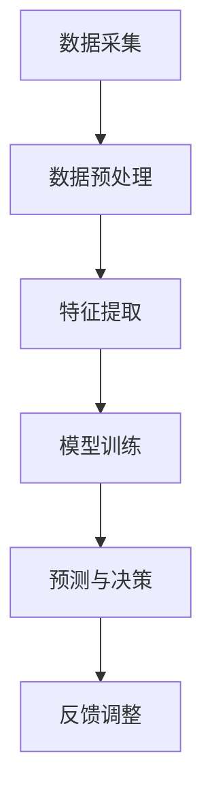

                 


# 提示词驱动的智能水质监测：保护水资源

## 关键词
- 水质监测
- 提示词驱动
- 智能算法
- 水资源保护
- 数据分析
- 机器学习

## 摘要
本文旨在探讨如何通过提示词驱动的智能水质监测技术，实现对水资源的有效保护。文章首先介绍了水质监测的重要性以及当前面临的问题，然后详细阐述了提示词驱动的智能水质监测方法，包括核心概念、算法原理、数学模型、系统分析与架构设计、项目实战和最佳实践。通过本文的介绍，读者将能够深入了解这一技术的原理和应用，为水资源的可持续发展提供有力支持。

## 目录大纲

----------------------------------------------------------------

## 第1章：背景介绍
### 1.1 问题背景
#### 1.1.1 水质监测的重要性
#### 1.1.2 当前水质监测面临的问题
#### 1.1.3 水质监测与水资源保护的关系

### 1.2 概念结构与核心要素组成
#### 1.2.1 核心概念术语说明
#### 1.2.2 关键技术
#### 1.2.3 应用场景

## 第2章：核心概念与联系
### 2.1 核心概念原理
#### 2.1.1 提示词驱动
#### 2.1.2 智能算法
#### 2.1.3 数据分析

### 2.2 ER实体关系图架构
```mermaid
erDiagram
  水质监测系统 ||--||| 数据采集模块 : 数据采集
  水质监测系统 ||--||| 数据处理模块 : 数据处理
  水质监测系统 ||--||| 模型训练模块 : 模型训练
  水质监测系统 ||--||| 预测与决策模块 : 预测与决策
```

## 第3章：算法原理讲解
### 3.1 算法概述
#### 3.1.1 提示词驱动的智能水质监测算法
#### 3.1.2 算法的工作流程

### 3.2 算法mermaid流程图


### 3.3 Python源代码实现
#### 3.3.1 代码解读
#### 3.3.2 算法原理详细讲解
#### 3.3.3 举例说明

## 第4章：数学模型和数学公式
### 4.1 数学模型介绍
#### 4.1.1 数据预处理模型
#### 4.1.2 特征提取模型
#### 4.1.3 模型训练模型

### 4.2 LaTeX格式数学公式展示
$$
\text{数据预处理}: \text{ } x' = \frac{x - \mu}{\sigma}
$$

$$
\text{特征提取}: \text{ } f(x') = \text{激活函数}
$$

$$
\text{模型训练}: \text{ } J(\theta) = -\frac{1}{m}\sum_{i=1}^{m} [y_i \log(a(z_i)) + (1 - y_i) \log(1 - a(z_i))]
$$

### 4.3 公式详细讲解与举例

## 第5章：系统分析与架构设计方案
### 5.1 问题场景介绍
#### 5.1.1 水质监测系统的问题场景

### 5.2 系统功能设计
#### 5.2.1 领域模型类图

### 5.3 系统架构设计
#### 5.3.1 系统架构图

### 5.4 系统接口设计与交互
#### 5.4.1 系统接口设计
#### 5.4.2 系统交互序列图

## 第6章：项目实战
### 6.1 环境安装
#### 6.1.1 Python环境配置
#### 6.1.2 相关库安装

### 6.2 系统核心实现
#### 6.2.1 源代码
#### 6.2.2 代码应用解读与分析

### 6.3 实际案例分析
#### 6.3.1 案例背景
#### 6.3.2 案例分析结果

### 6.4 详细讲解剖析
#### 6.4.1 技术细节分析
#### 6.4.2 系统优化建议

## 第7章：最佳实践与拓展
### 7.1 最佳实践
#### 7.1.1 数据采集与预处理
#### 7.1.2 特征提取与选择
#### 7.1.3 模型训练与优化

### 7.2 注意事项
#### 7.2.1 系统安全与隐私保护
#### 7.2.2 数据质量与一致性

### 7.3 拓展阅读
#### 7.3.1 相关文献
#### 7.3.2 研究方向展望

## 结论
本文通过对提示词驱动的智能水质监测技术进行深入剖析，提出了一个系统的解决方案。未来的研究方向将主要集中在算法优化、系统集成和实际应用场景拓展等方面，以期为水资源的可持续发展做出更大贡献。

## 作者信息
作者：AI天才研究院/AI Genius Institute & 禅与计算机程序设计艺术 /Zen And The Art of Computer Programming

