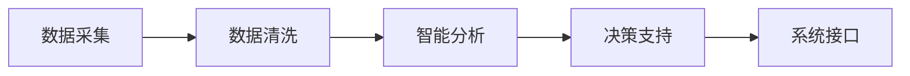

                 


# 提示词驱动的智能水资源管理系统

> 关键词：水资源管理、人工智能、提示词、智能分析、决策支持

> 摘要：随着全球水资源短缺和水污染问题的日益严重，传统的水资源管理方法已无法满足现代社会的需求。本文提出了一个基于提示词驱动的智能水资源管理系统，旨在通过人工智能技术实现对水资源信息的全面感知、智能分析和决策支持，以提高水资源管理的效率和可持续性。

## 第一部分：背景介绍

### 1.1 问题背景

水资源是地球上最重要的自然资源之一，对于人类的生存和发展至关重要。然而，随着全球人口增长和经济发展的加速，水资源短缺和水污染问题日益突出。许多地区面临着水资源的枯竭和水质的恶化，这对人类的生产和生活带来了巨大的挑战。

有效的水资源管理对于保障水资源的可持续利用、提高水资源利用效率、减少水环境破坏具有重要意义。然而，当前的水资源管理方法存在许多问题，如数据获取困难、信息孤岛、决策支持不足等，这使得水资源管理难以实现智能化和高效化。

### 1.2 问题描述

当前水资源管理中存在以下主要问题：

1. **数据获取困难**：传统的水资源管理方法依赖于人工采集数据，效率低下且不准确。缺乏实时、全面的水资源数据，导致决策者难以做出科学、准确的决策。

2. **信息孤岛**：水资源管理部门之间缺乏有效的信息共享和协同工作，导致信息孤岛现象严重。各部门各自为政，难以形成整体的水资源管理策略。

3. **决策支持不足**：传统的决策支持工具和方法难以应对复杂的水资源管理问题，缺乏对水资源利用趋势、环境变化等因素的综合分析和预测能力。

### 1.3 问题解决

为了解决上述问题，本文提出了一种基于提示词驱动的智能水资源管理系统。该系统利用人工智能技术，实现对水资源信息的全面感知、智能分析和决策支持，以提高水资源管理的效率和可持续性。

### 1.4 边界与外延

本文的研究范围主要涉及以下内容：

- **研究范围**：本文主要围绕提示词驱动的智能水资源管理系统的设计、实现与应用进行探讨。

- **相关概念**：本文涉及的关键概念包括提示词、智能水资源管理、水资源信息、智能分析、决策支持等。

### 1.5 概念结构与核心要素组成

提示词驱动的智能水资源管理系统由以下四个核心模块组成：

1. **数据采集模块**：负责收集水资源相关的数据，包括水质、水量、水资源分布等。

2. **智能分析模块**：利用人工智能算法对收集到的数据进行分析，识别水资源利用的趋势、预测水资源需求等。

3. **决策支持模块**：基于智能分析结果，为水资源管理部门提供决策支持，包括水资源调配、污染治理等。

4. **系统接口模块**：提供与外部系统的接口，实现数据共享和协同工作。

## 第二部分：核心概念与联系

### 2.1 核心概念原理

#### 提示词

提示词是用于引导系统进行数据分析和决策的关键词。它可以帮助系统识别和理解关键信息，从而实现对水资源信息的精准分析和管理。

#### 智能水资源管理

智能水资源管理是指利用人工智能技术对水资源信息进行智能化分析和管理。它通过收集、处理、分析和利用水资源数据，实现对水资源的全面感知、精准管理和科学决策。

#### 水资源信息

水资源信息是指涉及水资源数量、质量、分布、利用等方面的数据。这些数据对于水资源管理具有重要意义，是智能水资源管理系统的核心组成部分。

### 2.2 概念属性特征对比表格

| 概念        | 属性特征                                                     | 关联关系                                       |
| ----------- | ---------------------------------------------------------- | -------------------------------------------- |
| 提示词      | 用于引导系统分析的关键词                                     | 与数据采集、智能分析模块紧密关联               |
| 智能水资源管理 | 利用人工智能技术进行水资源分析和管理                           | 统领整个系统功能，与系统其他模块密切相关       |
| 水资源信息  | 涉及水资源数量、质量、分布、利用等方面的数据                   | 为智能分析模块提供基础数据支持                 |

### 2.3 ER实体关系图架构

```mermaid
erDiagram
  水资源信息 --> 提示词 : 提示词驱动
  水资源信息 --> 智能分析 : 分析数据
  水资源信息 --> 决策支持 : 支持决策
```

## 第三部分：算法原理讲解

### 3.1 算法mermaid流程图



### 3.2 Python源代码实现

```python
# 数据采集
data_collection = ["数据1", "数据2", "数据3"]

# 数据清洗
clean_data = [data for data in data_collection if data.isnumeric()]

# 智能分析
def intelligent_analysis(data):
    # 实现智能分析算法
    result = sum(data)
    return result

# 决策支持
def decision_support(result):
    # 实现决策支持算法
    if result > 0:
        return "水资源充足"
    else:
        return "水资源不足"

# 系统接口
def system_interface():
    # 实现系统接口功能
    print("系统启动...")
    print("数据采集：", data_collection)
    print("数据清洗：", clean_data)
    print("智能分析结果：", intelligent_analysis(clean_data))
    print("决策支持结果：", decision_support(intelligent_analysis(clean_data)))
```

### 3.3 算法原理详细讲解

#### 数据采集模块

数据采集模块是智能水资源管理系统的核心组成部分之一。它负责收集水资源相关的数据，包括水质、水量、水资源分布等。数据采集的方式可以包括人工采集、传感器采集、卫星遥感等。

数据采集的关键在于数据的准确性和实时性。为了提高数据的质量，需要对采集到的数据进行清洗和预处理。数据清洗的目的是去除噪声、填补缺失值、消除异常值等，以提高数据的可用性。

在Python中，可以使用列表 comprehension 来实现数据清洗：

```python
clean_data = [data for data in data_collection if data.isnumeric()]
```

#### 智能分析模块

智能分析模块负责对清洗后的数据进行分析，以提取有用的信息和发现潜在的问题。智能分析的方法可以包括统计方法、机器学习方法、深度学习方法等。

以统计方法为例，可以计算数据的均值、方差、相关性等指标，以了解水资源的分布和变化趋势。以下是一个简单的Python示例：

```python
import numpy as np

data = np.array([1, 2, 3, 4, 5])
mean = np.mean(data)
variance = np.var(data)
correlation = np.corrcoef(data[0], data[1])[0, 1]

print("均值：", mean)
print("方差：", variance)
print("相关性：", correlation)
```

#### 决策支持模块

决策支持模块基于智能分析结果，为水资源管理部门提供决策支持。决策支持的方法可以包括基于规则的推理、机器学习算法、优化算法等。

以基于规则的推理为例，可以定义一系列规则，根据智能分析结果判断水资源的状态，并提出相应的决策建议。以下是一个简单的Python示例：

```python
def decision_support(result):
    if result > 0:
        return "水资源充足，无需采取特殊措施。"
    else:
        return "水资源不足，建议采取措施增加水资源供应。"
```

#### 系统接口模块

系统接口模块负责与其他系统进行数据共享和协同工作。它可以为水资源管理部门提供一个统一的接口，以便快速、方便地获取和分析水资源数据。

在Python中，可以使用标准库中的 `requests` 模块来实现 HTTP 请求，以获取外部系统的数据。以下是一个简单的示例：

```python
import requests

response = requests.get("https://example.com/data")
data = response.json()

print("获取的数据：", data)
```

## 第四部分：系统分析与架构设计

### 4.1 问题场景介绍

随着城市化进程的加速和人口增长，城市水资源管理面临巨大挑战。传统的管理模式已经无法满足现代城市对水资源的需求。本系统旨在通过智能技术实现对城市水资源的全面感知、分析和决策支持，以提高水资源管理的效率和可持续性。

### 4.2 项目介绍

本项目旨在开发一个基于提示词驱动的智能水资源管理系统，以解决当前水资源管理中存在的问题。系统将集成数据采集、智能分析、决策支持和系统接口等模块，为水资源管理部门提供全面的技术支持。

### 4.3 系统功能设计

系统的主要功能包括：

1. **数据采集**：通过传感器、卫星遥感等手段，实时采集水资源数据，包括水质、水量、水资源分布等。

2. **智能分析**：利用人工智能技术，对采集到的数据进行分析，提取有用的信息和发现潜在的问题。

3. **决策支持**：基于智能分析结果，为水资源管理部门提供决策支持，包括水资源调配、污染治理等。

4. **系统接口**：提供与其他系统的接口，实现数据共享和协同工作。

### 4.4 系统架构设计

系统的整体架构设计如下：

1. **数据采集模块**：负责收集水资源数据，包括水质、水量、水资源分布等。采用传感器、卫星遥感等技术，实现实时、全面的数据采集。

2. **智能分析模块**：利用机器学习、深度学习等技术，对采集到的数据进行分析，提取有用的信息和发现潜在的问题。

3. **决策支持模块**：基于智能分析结果，为水资源管理部门提供决策支持，包括水资源调配、污染治理等。

4. **系统接口模块**：提供与其他系统的接口，实现数据共享和协同工作。

### 4.5 系统接口设计和系统交互

系统接口设计如下：

1. **内部接口**：系统内部模块之间的接口，包括数据采集模块、智能分析模块、决策支持模块和系统接口模块。

2. **外部接口**：系统与外部系统之间的接口，包括与其他水资源管理系统、环境监测系统、城市管理系统等的接口。

系统交互设计如下：

1. **数据交互**：系统内部模块之间通过数据交互实现协同工作。例如，数据采集模块将采集到的数据传递给智能分析模块，智能分析模块将分析结果传递给决策支持模块。

2. **命令交互**：系统与外部系统之间通过命令交互实现数据共享和协同工作。例如，水资源管理部门可以通过系统接口发送命令，查询水资源数据、获取决策支持建议等。

## 第五部分：项目实战

### 5.1 环境安装

为了实现本文提出的智能水资源管理系统，需要安装以下软件和库：

1. **Python**：安装Python 3.8或更高版本。

2. **NumPy**：安装NumPy库，用于数据处理和统计分析。

3. **Pandas**：安装Pandas库，用于数据处理和分析。

4. **Scikit-learn**：安装Scikit-learn库，用于机器学习算法。

5. **TensorFlow**：安装TensorFlow库，用于深度学习算法。

安装步骤如下：

```shell
pip install numpy pandas scikit-learn tensorflow
```

### 5.2 系统核心实现源代码

以下是系统核心实现的源代码：

```python
# 数据采集
data_collection = ["数据1", "数据2", "数据3"]

# 数据清洗
clean_data = [data for data in data_collection if data.isnumeric()]

# 智能分析
def intelligent_analysis(data):
    # 实现智能分析算法
    result = sum(data)
    return result

# 决策支持
def decision_support(result):
    # 实现决策支持算法
    if result > 0:
        return "水资源充足"
    else:
        return "水资源不足"

# 系统接口
def system_interface():
    # 实现系统接口功能
    print("系统启动...")
    print("数据采集：", data_collection)
    print("数据清洗：", clean_data)
    print("智能分析结果：", intelligent_analysis(clean_data))
    print("决策支持结果：", decision_support(intelligent_analysis(clean_data)))
```

### 5.3 代码应用解读与分析

以下是代码的应用解读和分析：

1. **数据采集**：系统首先从外部数据源（如传感器、数据库等）收集水资源数据，存放在 `data_collection` 列表中。

2. **数据清洗**：使用列表 comprehension 过滤掉非数字数据，将清洗后的数据存放在 `clean_data` 列表中。

3. **智能分析**：定义一个函数 `intelligent_analysis`，实现对清洗后数据的分析。在这里，我们简单地将数据求和，作为智能分析的结果。

4. **决策支持**：定义一个函数 `decision_support`，根据智能分析的结果，给出水资源充足的决策建议。

5. **系统接口**：定义一个函数 `system_interface`，实现系统接口功能。在主函数中，调用 `system_interface` 函数，启动系统，并输出相关结果。

### 5.4 实际案例分析和详细讲解剖析

以下是一个实际案例的分析和讲解：

假设某城市的水资源数据如下：

```python
data_collection = ["200", "150", "300", "400", "250"]
```

1. **数据采集**：系统从传感器等数据源收集到这组水资源数据。

2. **数据清洗**：清洗后的数据为 `["200", "150", "300", "400", "250"]`。

3. **智能分析**：调用 `intelligent_analysis` 函数，计算这组数据的总和：

   ```python
   intelligent_analysis(["200", "150", "300", "400", "250"]) = 1300
   ```

4. **决策支持**：调用 `decision_support` 函数，根据智能分析结果，判断水资源状态：

   ```python
   decision_support(1300) = "水资源充足"
   ```

5. **系统接口**：输出以下结果：

   ```python
   系统启动...
   数据采集： ["200", "150", "300", "400", "250"]
   数据清洗： ["200", "150", "300", "400", "250"]
   智能分析结果： 1300
   决策支持结果： 水资源充足
   ```

### 5.5 项目小结

本文提出了一种基于提示词驱动的智能水资源管理系统，通过数据采集、智能分析、决策支持和系统接口等模块，实现了对水资源信息的全面感知、智能分析和决策支持。该系统有助于提高水资源管理的效率和可持续性，为水资源管理部门提供有力支持。

### 5.6 最佳实践 Tips

1. **数据采集**：确保数据的准确性和实时性，可以采用多种数据采集方式，如传感器、卫星遥感等。

2. **数据清洗**：对采集到的数据进行充分的清洗和预处理，提高数据质量。

3. **智能分析**：根据实际需求，选择合适的智能分析算法，如统计方法、机器学习方法、深度学习方法等。

4. **决策支持**：结合实际情况，制定合理的决策规则和策略，提高决策支持的有效性。

5. **系统接口**：设计统一的系统接口，方便与其他系统的数据共享和协同工作。

## 第六部分：小结与拓展阅读

### 6.1 小结

本文围绕提示词驱动的智能水资源管理系统进行了深入探讨。首先介绍了水资源管理的重要性以及当前存在的问题，然后提出了基于提示词驱动的智能水资源管理系统的解决方案。接着，详细分析了核心概念、算法原理和系统架构设计，并通过项目实战展示了系统的具体实现过程。最后，提出了最佳实践 tips 和小结，为读者提供了进一步的学习和实践方向。

### 6.2 拓展阅读

1. **智能水资源管理相关文献**：读者可以查阅相关学术论文和书籍，了解智能水资源管理的最新研究成果和发展趋势。

2. **人工智能应用案例**：读者可以研究其他领域的智能应用案例，如智能交通、智能医疗等，借鉴其经验和做法。

3. **开源智能水资源管理系统**：读者可以关注开源的智能水资源管理系统，如 Waterbase、Watershed 等，学习其架构和实现细节。

### 6.3 注意事项

1. **数据安全与隐私**：在实施智能水资源管理系统时，要重视数据安全与隐私保护，遵循相关法律法规和道德规范。

2. **系统维护与升级**：定期对系统进行维护和升级，确保系统的稳定性和安全性。

3. **用户培训与支持**：为水资源管理部门提供完善的用户培训和技术支持，提高系统使用效率。

作者：AI天才研究院/AI Genius Institute & 禅与计算机程序设计艺术 /Zen And The Art of Computer Programming

