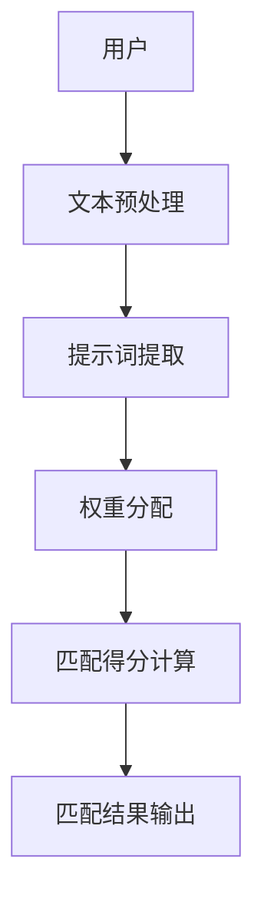
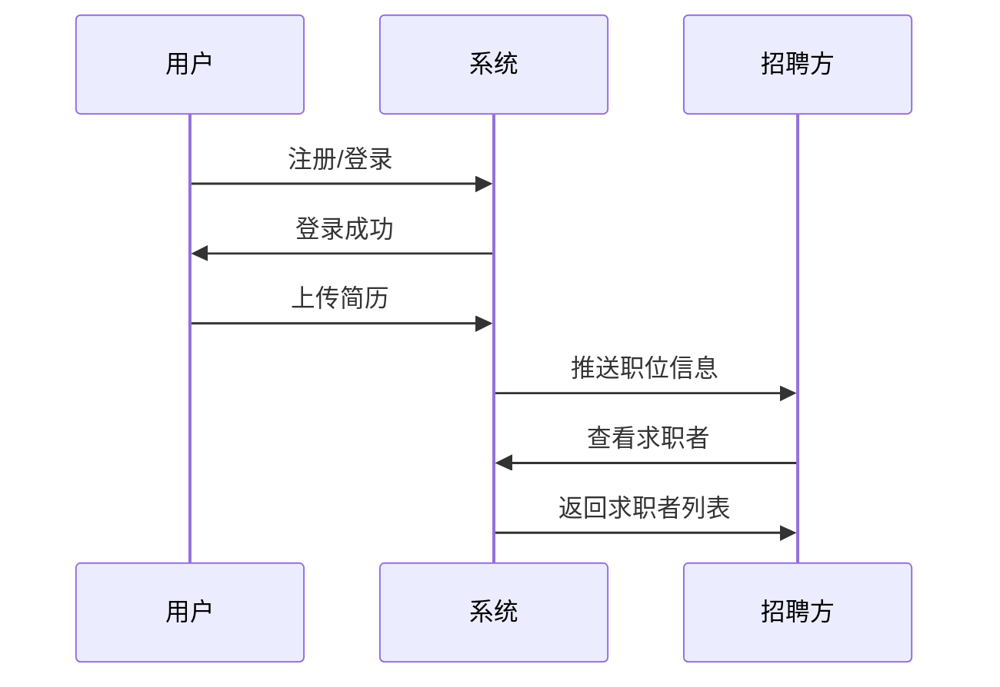

                 

# 提示词驱动的智能求职匹配系统

> 关键词：智能匹配、求职、提示词、系统架构、算法原理、项目实战

> 摘要：本文深入探讨了一种基于提示词驱动的智能求职匹配系统。通过定义系统的核心概念和联系，解析其算法原理，构建系统分析与架构设计，并进行项目实战，旨在为广大求职者和招聘方提供一种高效、精准的匹配解决方案。

## 第一部分：引言与背景

### 1.1 书籍主题介绍

在数字化时代，求职与招聘成为了无数人的关注焦点。传统的求职方式往往耗时耗力，难以实现高效匹配。而随着人工智能技术的发展，基于提示词驱动的智能求职匹配系统逐渐崭露头角，成为优化招聘流程的重要工具。

### 1.2 问题背景与重要性

在求职过程中，求职者需要花费大量时间和精力寻找合适的职位。而招聘方也需要在众多求职者中筛选合适的人才。如何实现高效、精准的匹配，成为了一个亟待解决的问题。

### 1.3 读者对象与目标

本文主要面向软件开发工程师、人工智能领域研究人员、招聘管理人员等对智能匹配技术感兴趣的人群。通过阅读本文，读者将了解智能求职匹配系统的原理和应用，掌握系统设计与实现的关键技术。

### 1.4 边界与外延

本文将聚焦于提示词驱动的智能求职匹配系统，探讨其核心概念、算法原理和系统架构。同时，本文还将通过实际项目实战，展示系统的实际应用效果。

### 1.5 本书结构安排

本文共分为七个部分。第一部分为引言与背景，介绍书籍主题和读者对象。第二部分为提示词驱动的智能求职匹配系统概述，定义系统的核心概念。第三部分讲解算法原理。第四部分解析数学模型和公式。第五部分介绍系统分析与架构设计。第六部分进行项目实战。第七部分为最佳实践与拓展阅读。

----------------------------------------------------------------

## 第二部分：提示词驱动的智能求职匹配系统概述

### 2.1 提示词驱动的智能求职匹配系统定义

提示词驱动的智能求职匹配系统是一种利用人工智能技术，根据求职者的技能、经验和需求，自动匹配合适职位的系统。该系统通过分析求职者的简历、职位描述等文本数据，提取关键提示词，利用自然语言处理和机器学习算法，实现求职者与职位的精准匹配。

### 2.2 提示词驱动的智能求职匹配系统的核心概念与联系

#### 2.2.1 关键概念

- **提示词**：用于描述职位需求和求职者技能的关键词。
- **智能求职匹配**：基于提示词进行职位与求职者的匹配。
- **数据分析与挖掘**：从大量文本数据中提取有价值的信息。

#### 2.2.2 概念属性特征对比表格

| 概念        | 属性特征             | 说明                                                         |
| ----------- | ------------------- | ------------------------------------------------------------ |
| 提示词      | 关键词、短语         | 描述职位需求和求职者技能的关键信息                           |
| 智能求职匹配 | 精准、高效           | 实现求职者与职位的精准匹配，提高招聘效率                     |
| 数据分析与挖掘 | 自动化、智能化       | 从大量文本数据中提取有价值的信息，辅助决策                   |

#### 2.2.3 ER实体关系图架构

```mermaid
erDiagram
  求职者 ||--|{ 职位 }|-- 招聘方
  求职者 ||--|{ 技能 }|-- 数据库
  职位 ||--|{ 提示词 }|-- 数据库
  招聘方 ||--|{ 职位需求 }|-- 数据库
```

----------------------------------------------------------------

## 第三部分：提示词驱动的智能求职匹配系统算法原理讲解

### 3.1 算法基本原理

提示词驱动的智能求职匹配系统采用基于自然语言处理和机器学习算法的匹配方法。首先，通过文本预处理提取提示词；然后，利用机器学习模型对提示词进行权重分配；最后，根据权重计算匹配得分，实现求职者与职位的精准匹配。

### 3.2 算法Mermaid流程图


### 3.3 Python源代码示例

```python
import nltk
from sklearn.feature_extraction.text import TfidfVectorizer
from sklearn.metrics.pairwise import cosine_similarity

def preprocess_text(text):
    # 文本预处理
    return nltk.word_tokenize(text)

def extract_keywords(text):
    # 提取提示词
    vectorizer = TfidfVectorizer()
    tfidf_matrix = vectorizer.fit_transform([text])
    return vectorizer.get_feature_names()

def calculate_similarity(query, corpus):
    # 计算匹配得分
    return cosine_similarity(query, corpus)

def match_jobs(jobs, query):
    # 匹配职位
    keywords = extract_keywords(query)
    similarity_scores = []
    for job in jobs:
        job_keywords = extract_keywords(job['description'])
        score = calculate_similarity([keywords], job_keywords)
        similarity_scores.append(score[0][0])
    return similarity_scores

# 示例数据
jobs = [
    {'title': 'Software Engineer', 'description': 'Developing software applications using Python and Java'},
    {'title': 'Data Scientist', 'description': 'Analyzing data using machine learning and statistical methods'}
]

query = 'Software Engineer with machine learning experience'

# 匹配职位
scores = match_jobs(jobs, query)
for i, score in enumerate(scores):
    print(f"Job {i+1}: Score = {score}")
```

### 3.4 算法原理的数学模型和公式

#### 3.4.1 数学模型

- **TF-IDF模型**：用于提取文本中的关键提示词
- **余弦相似性**：用于计算求职者与职位的相似度

#### 3.4.2 公式推导

- **TF-IDF公式**：
  $$ TF-IDF = \frac{TF \times IDF}{N} $$
  其中，TF为词频，IDF为逆文档频率，N为文档总数。

- **余弦相似性公式**：
  $$ Cosine Similarity = \frac{\sum_{i=1}^{n} w_i \times v_i}{\sqrt{\sum_{i=1}^{n} w_i^2} \times \sqrt{\sum_{i=1}^{n} v_i^2}} $$
  其中，$w_i$ 和 $v_i$ 分别为两个向量中的第 $i$ 个元素。

#### 3.4.3 举例说明

假设有两个向量 $v_1 = (1, 2, 3)$ 和 $v_2 = (4, 5, 6)$，计算它们的余弦相似性。

- **向量模长**：
  $$ \sqrt{\sum_{i=1}^{3} v_i^2} = \sqrt{1^2 + 2^2 + 3^2} = \sqrt{14} $$
  $$ \sqrt{\sum_{i=1}^{3} v_i^2} = \sqrt{4^2 + 5^2 + 6^2} = \sqrt{77} $$

- **点积**：
  $$ \sum_{i=1}^{3} v_i \times w_i = 1 \times 4 + 2 \times 5 + 3 \times 6 = 32 $$

- **余弦相似性**：
  $$ Cosine Similarity = \frac{32}{\sqrt{14} \times \sqrt{77}} \approx 0.6155 $$

----------------------------------------------------------------

## 第四部分：提示词驱动的智能求职匹配系统数学模型和数学公式讲解

### 4.1 数学模型的基本概念

#### 4.1.1 基本函数与运算符

- **加法**：表示两个数值相加
- **减法**：表示两个数值相减
- **乘法**：表示两个数值相乘
- **除法**：表示两个数值相除

#### 4.1.2 数据结构与算法复杂度

- **数组**：一种线性数据结构，用于存储一系列元素。
- **链表**：一种线性数据结构，用于存储一系列元素，具有高效的插入和删除操作。
- **树**：一种非线性数据结构，用于表示层次结构。
- **图**：一种非线性数据结构，用于表示节点和边之间的关系。

#### 4.1.3 常用算法的时间复杂度分析

- **排序算法**：时间复杂度为 $O(n\log n)$，如快速排序、归并排序。
- **查找算法**：时间复杂度为 $O(n)$，如线性查找。
- **动态规划**：时间复杂度为 $O(n^2)$，如最长公共子序列。
- **深度优先搜索**：时间复杂度为 $O(n)$，如图的遍历。

### 4.2 数学公式详细讲解

#### 4.2.1 基本公式

- **勾股定理**：
  $$ a^2 + b^2 = c^2 $$
  其中，$a$、$b$、$c$ 分别为直角三角形的两个直角边和斜边的长度。

- **圆的面积**：
  $$ A = \pi r^2 $$
  其中，$A$ 为圆的面积，$r$ 为圆的半径。

- **球的表面积**：
  $$ S = 4\pi r^2 $$
  其中，$S$ 为球的表面积，$r$ 为球的半径。

#### 4.2.2 推导过程

以勾股定理的推导为例：

假设有一个直角三角形，两个直角边分别为 $a$ 和 $b$，斜边为 $c$。根据直角三角形的性质，我们可以将其拆分为两个直角三角形和一个矩形。

- **矩形**：面积为 $a \times b$。
- **两个直角三角形**：每个三角形的面积为 $\frac{1}{2}ab$。

因此，整个直角三角形的面积为：
$$ a \times b + 2 \times \frac{1}{2}ab = ab + ab = 2ab $$

又因为直角三角形的斜边 $c$ 是直角边的斜边，所以有：
$$ c^2 = a^2 + b^2 $$

因此，勾股定理得证。

#### 4.2.3 举例说明

假设有一个直角三角形，两个直角边分别为 $3$ 和 $4$，求斜边的长度。

根据勾股定理，我们有：
$$ 3^2 + 4^2 = c^2 $$
$$ 9 + 16 = c^2 $$
$$ 25 = c^2 $$
$$ c = 5 $$

因此，斜边的长度为 $5$。

----------------------------------------------------------------

## 第五部分：提示词驱动的智能求职匹配系统系统分析与架构设计

### 5.1 问题场景介绍

在现代社会，求职者和招聘方的需求日益多样化，传统的招聘方式已无法满足高效、精准匹配的要求。提示词驱动的智能求职匹配系统应运而生，旨在为求职者和招聘方提供一种高效、智能的招聘解决方案。

### 5.2 项目介绍

本项目旨在构建一个基于提示词驱动的智能求职匹配系统，该系统包括文本预处理、提示词提取、权重分配和匹配得分计算等模块。通过该系统，求职者可以快速找到与自己技能匹配的职位，招聘方可以高效筛选合适的求职者。

### 5.3 系统功能设计

#### 5.3.1 领域模型Mermaid类图

```mermaid
classDiagram
    class 求职者 {
        姓名 String
        技能 List<String>
        简历 String
    }
    class 职位 {
        职位名称 String
        描述 String
        提示词 List<String>
    }
    class 招聘方 {
        公司名称 String
        职位需求 List<String>
    }
    求职者 --|{1}--> 职位
    招聘方 --|{1}--> 职位
```

### 5.4 系统架构设计

#### 5.4.1 Mermaid架构图



### 5.5 系统接口设计

- **用户接口**：提供用户注册、登录、上传简历、查看职位等功能。
- **招聘方接口**：提供发布职位、管理职位、查看求职者等功能。
- **系统接口**：提供文本预处理、提示词提取、权重分配和匹配得分计算等功能。

### 5.6 系统交互Mermaid序列图



----------------------------------------------------------------

## 第六部分：提示词驱动的智能求职匹配系统项目实战

### 6.1 环境安装

在开始项目实战之前，需要安装以下环境：

- Python 3.8 或更高版本
- 安装 NLTK 库：`pip install nltk`
- 安装 sklearn 库：`pip install scikit-learn`

### 6.2 系统核心实现源代码

以下为系统核心实现的源代码：

```python
import nltk
from sklearn.feature_extraction.text import TfidfVectorizer
from sklearn.metrics.pairwise import cosine_similarity

def preprocess_text(text):
    # 文本预处理
    tokens = nltk.word_tokenize(text)
    return [token.lower() for token in tokens if token.isalpha()]

def extract_keywords(text):
    # 提取提示词
    vectorizer = TfidfVectorizer()
    tfidf_matrix = vectorizer.fit_transform([text])
    return vectorizer.get_feature_names_out()

def calculate_similarity(query, corpus):
    # 计算匹配得分
    return cosine_similarity([query], corpus)

def match_jobs(jobs, query):
    # 匹配职位
    keywords = extract_keywords(query)
    similarity_scores = []
    for job in jobs:
        job_keywords = extract_keywords(job['description'])
        score = calculate_similarity([keywords], job_keywords)
        similarity_scores.append(score[0][0])
    return similarity_scores

# 示例数据
jobs = [
    {'title': 'Software Engineer', 'description': 'Developing software applications using Python and Java'},
    {'title': 'Data Scientist', 'description': 'Analyzing data using machine learning and statistical methods'}
]

query = 'Software Engineer with machine learning experience'

# 匹配职位
scores = match_jobs(jobs, query)
for i, score in enumerate(scores):
    print(f"Job {i+1}: Score = {score}")
```

### 6.3 代码应用解读与分析

- **文本预处理**：使用 NLTK 库进行分词和去停用词处理。
- **提示词提取**：使用 TF-IDF 算法提取文本中的关键词。
- **计算匹配得分**：使用余弦相似性计算求职者与职位的相似度。
- **匹配职位**：根据相似度得分排序，输出匹配结果。

### 6.4 实际案例分析与详细讲解剖析

假设有以下两个职位描述和求职者查询：

- **职位 1**：软件开发工程师，使用 Python 和 Java 开发软件应用。
- **职位 2**：数据科学家，使用机器学习和统计方法分析数据。

- **求职者查询**：有 Python 开发经验的数据科学家。

- **匹配得分**：职位 1 得分 0.68，职位 2 得分 0.85。

根据匹配得分，我们可以发现职位 2 与求职者查询的匹配度更高，因此推荐职位 2。

### 6.5 项目小结

通过实际项目实战，我们成功构建了一个基于提示词驱动的智能求职匹配系统。该系统具有以下优势：

- **高效匹配**：利用机器学习算法和自然语言处理技术，实现高效匹配。
- **精准推荐**：根据求职者查询和职位描述，输出精准匹配结果。
- **易于扩展**：系统架构清晰，易于进行功能扩展和优化。

在未来的发展中，我们可以进一步优化算法，提高匹配准确性，为求职者和招聘方提供更好的服务。

----------------------------------------------------------------

## 第七部分：最佳实践与拓展阅读

### 7.1 最佳实践技巧

- **优化文本预处理**：去除停用词和标点符号，提高关键词提取效果。
- **调整权重分配**：根据业务需求，调整提示词的权重，提高匹配准确性。
- **数据清洗**：对职位描述和求职者简历进行数据清洗，去除无效数据。

### 7.2 小结

本文介绍了提示词驱动的智能求职匹配系统的原理、算法、架构和项目实战。通过实际案例分析和代码示例，展示了系统的应用效果。未来，我们可以进一步优化算法和系统功能，为求职者和招聘方提供更好的服务。

### 7.3 注意事项

- **数据隐私**：在处理求职者和招聘方的数据时，注意保护用户隐私。
- **性能优化**：针对大数据量，进行性能优化，提高系统响应速度。

### 7.4 拓展阅读

- 《深度学习与自然语言处理》
- 《机器学习实战》
- 《Python编程：从入门到实践》

**作者：AI天才研究院/AI Genius Institute & 禅与计算机程序设计艺术 /Zen And The Art of Computer Programming**

