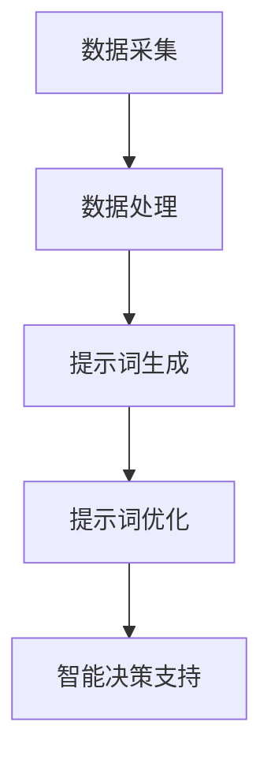
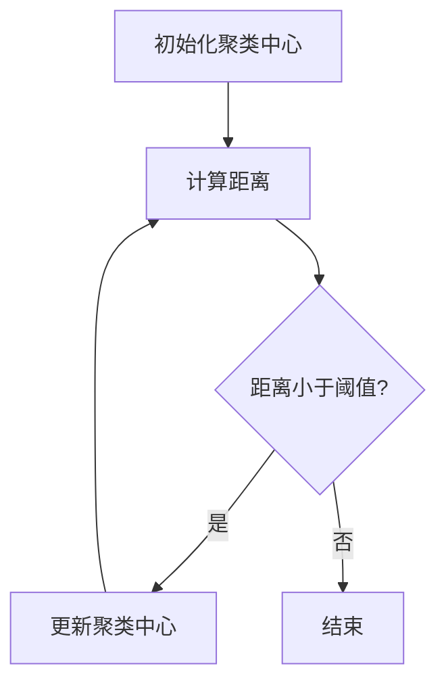
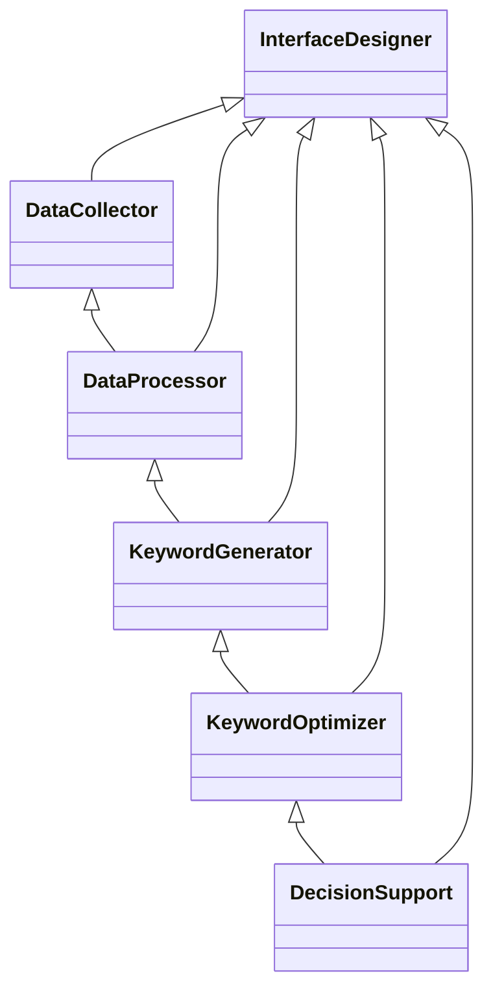
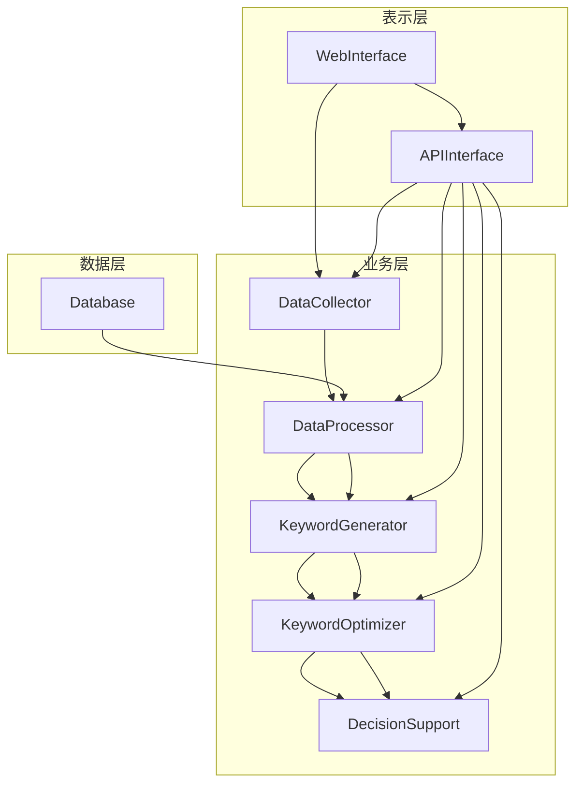
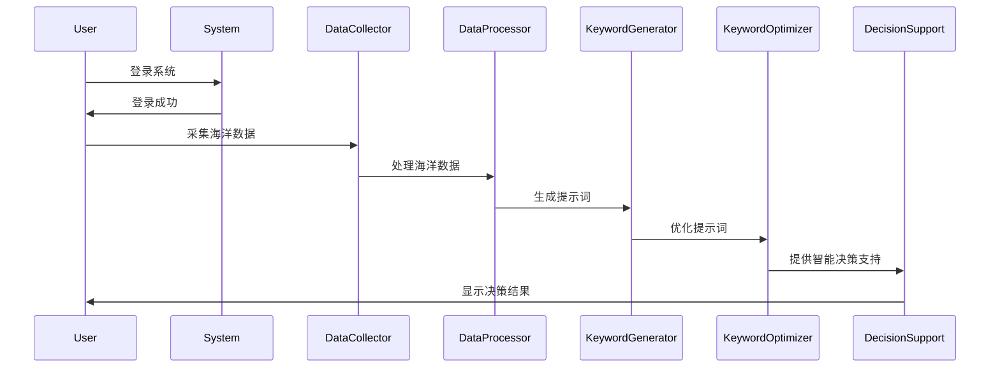

                 


# 提示词驱动的智能海洋资源管理系统

关键词：海洋资源管理、人工智能、提示词驱动、算法原理、系统设计

摘要：本文将深入探讨提示词驱动的智能海洋资源管理系统的核心概念、算法原理、系统设计以及项目实战。我们将通过逐步分析，从背景介绍、核心概念阐述、算法讲解、系统架构设计、项目实战等方面，详细解析这一系统的构建过程，旨在为读者提供全面、系统的了解。

### 目录大纲设计思路

为了设计出一本关于《提示词驱动的智能海洋资源管理系统》的完整目录大纲，我们可以按照以下步骤进行：

1. **确定书籍的核心主题**：
   - 本书主要围绕“提示词驱动的智能海洋资源管理系统”展开，因此目录的设计要突出这一核心主题。

2. **定义书籍的目标读者**：
   - 确定书籍的目标读者群体，如海洋资源管理专业研究者、软件工程师、人工智能开发者等。

3. **明确书籍的主要内容**：
   - 根据核心主题，梳理出书籍的主要章节，包括但不限于背景介绍、核心概念、算法原理、系统设计、项目实战等。

4. **细化各章节内容**：
   - 每个章节都要明确其具体内容，如背景介绍、概念讲解、案例分析等。

5. **确保目录的逻辑性**：
   - 目录的顺序要符合读者的认知逻辑，先介绍背景和基础，再逐步深入到算法原理和系统设计。

6. **简洁明了**：
   - 在保证内容完整性的同时，要尽量简洁，避免冗余。

### 目录大纲示例

下面是《提示词驱动的智能海洋资源管理系统》的目录大纲示例：

----------------------------------------------------------------

# 第一部分: 背景与概述

## 第1章: 海洋资源管理概述

### 1.1 海洋资源的重要性

### 1.2 海洋资源管理的挑战

### 1.3 提示词驱动的智能系统的概念与优势

## 第2章: 智能海洋资源管理系统的架构

### 2.1 系统整体架构设计

### 2.2 数据采集与处理

### 2.3 提示词生成与优化

## 第二部分: 核心算法原理

## 第3章: 提示词驱动的数据挖掘算法

### 3.1 算法概述

### 3.2 算法原理

### 3.3 算法流程图

### 3.4 算法Python源代码解析

## 第4章: 提示词驱动的机器学习算法

### 4.1 机器学习基础

### 4.2 算法原理

### 4.3 算法流程图

### 4.4 算法Python源代码解析

## 第三部分: 系统设计与实现

## 第5章: 系统需求分析

### 5.1 功能需求

### 5.2 非功能需求

## 第6章: 系统架构设计

### 6.1 架构设计

### 6.2 数据库设计

### 6.3 系统接口设计

## 第7章: 系统实现与部署

### 7.1 环境准备

### 7.2 系统核心实现

### 7.3 系统部署与测试

## 第8章: 项目实战案例分析

### 8.1 项目背景

### 8.2 项目目标

### 8.3 项目实施过程

### 8.4 项目成果分析

## 第9章: 最佳实践与展望

### 9.1 最佳实践

### 9.2 未来展望

### 9.3 注意事项与拓展阅读

----------------------------------------------------------------

### 完成目录大纲

按照上述步骤和示例，我们可以完成《提示词驱动的智能海洋资源管理系统》的目录大纲。以下是一个简化的版本，字数控制在2000字以内：

----------------------------------------------------------------

# 第一部分: 背景与概述

## 第1章: 海洋资源管理概述

### 1.1 海洋资源的重要性

### 1.2 海洋资源管理的挑战

### 1.3 提示词驱动的智能系统的概念与优势

## 第2章: 智能海洋资源管理系统的架构

### 2.1 系统整体架构设计

### 2.2 数据采集与处理

### 2.3 提示词生成与优化

## 第二部分: 核心算法原理

## 第3章: 提示词驱动的数据挖掘算法

### 3.1 算法概述

### 3.2 算法原理

### 3.3 算法流程图

### 3.4 算法Python源代码解析

## 第4章: 提示词驱动的机器学习算法

### 4.1 机器学习基础

### 4.2 算法原理

### 4.3 算法流程图

### 4.4 算法Python源代码解析

## 第三部分: 系统设计与实现

## 第5章: 系统需求分析

### 5.1 功能需求

### 5.2 非功能需求

## 第6章: 系统架构设计

### 6.1 架构设计

### 6.2 数据库设计

### 6.3 系统接口设计

## 第7章: 系统实现与部署

### 7.1 环境准备

### 7.2 系统核心实现

### 7.3 系统部署与测试

## 第8章: 项目实战案例分析

### 8.1 项目背景

### 8.2 项目目标

### 8.3 项目实施过程

### 8.4 项目成果分析

## 第9章: 最佳实践与展望

### 9.1 最佳实践

### 9.2 未来展望

### 9.3 注意事项与拓展阅读

----------------------------------------------------------------

### 提示词驱动的智能海洋资源管理系统：背景与核心概念

在当今快速发展的科技时代，海洋资源的合理管理和高效利用已成为全球关注的焦点。海洋资源不仅包括传统的水产资源，还涵盖了海洋能源、生物资源、矿物资源等多个方面。然而，随着人类活动的加剧，海洋资源的压力和挑战日益凸显，如何实现海洋资源的可持续管理成为一个亟待解决的重要问题。

#### 问题背景与挑战

海洋资源管理涉及多个层面，包括海洋生态保护、资源监测、数据分析、决策支持等。传统的海洋资源管理方法主要依赖于人工监测和数据采集，不仅效率低下，而且容易受到人为因素的影响。随着人工智能技术的不断发展，尤其是机器学习和数据挖掘技术的应用，为海洋资源管理带来了一种全新的思路——提示词驱动的智能系统。

在海洋资源管理中，提示词是一种用于引导数据分析和决策的关键信息。通过提示词，系统能够快速定位并提取出关键数据，从而提高管理的精度和效率。然而，如何生成和优化提示词，以及如何将这些提示词有效地应用于实际管理中，仍然是一个需要深入研究的课题。

#### 核心概念与联系

提示词驱动的智能海洋资源管理系统主要包括以下几个核心概念：

1. **提示词生成**：通过数据挖掘和机器学习算法，从大量的海洋数据中提取出具有代表性的关键词或短语，作为提示词。

2. **提示词优化**：基于提示词的效果评估，对提示词进行筛选和调整，以提高其准确性和实用性。

3. **智能决策支持**：利用提示词驱动算法，为海洋资源管理提供智能化的决策支持。

4. **系统架构设计**：包括数据采集、数据处理、提示词生成、提示词优化、智能决策等模块，形成一个完整的系统。

以下是提示词驱动的智能海洋资源管理系统的ER实体关系图架构的Mermaid流程图：



通过上述流程图，我们可以清晰地看到系统从数据采集到智能决策支持的全过程。

#### 算法原理讲解

提示词驱动的智能海洋资源管理系统中的核心算法主要包括数据挖掘算法和机器学习算法。以下是这些算法的简要介绍：

1. **数据挖掘算法**：
   - **K-means聚类算法**：通过将海洋数据划分为多个簇，提取出具有代表性的数据点，从而生成提示词。
   - **关联规则挖掘算法**：通过分析海洋数据之间的关联性，找出潜在的重要关系，辅助生成提示词。

2. **机器学习算法**：
   - **监督学习算法**：如支持向量机（SVM）和随机森林（Random Forest），用于从标记数据中学习并生成提示词。
   - **无监督学习算法**：如主成分分析（PCA）和自编码器（Autoencoder），用于从未标记数据中提取特征，辅助生成提示词。

以下是K-means聚类算法的mermaid流程图：



通过上述算法流程图，我们可以看到K-means算法的基本步骤。

#### 数学模型与公式

为了更好地理解提示词驱动的智能海洋资源管理系统的算法原理，我们需要引入一些数学模型和公式。

1. **聚类中心初始化**：
   - 设定初始聚类中心为随机选取的数据点。

2. **距离计算**：
   - 对于每个数据点，计算其与聚类中心的距离，通常使用欧氏距离公式：

     $$d(x_i, c_j) = \sqrt{\sum_{k=1}^n (x_{ik} - c_{jk})^2}$$

   - 其中，$x_i$ 和 $c_j$ 分别代表数据点和聚类中心，$n$ 表示特征维度。

3. **聚类中心更新**：
   - 当所有数据点分配完成后，重新计算每个簇的中心：

     $$c_j = \frac{1}{m_j} \sum_{i \in S_j} x_i$$

   - 其中，$m_j$ 表示属于簇 $j$ 的数据点个数。

4. **迭代终止条件**：
   - 当聚类中心的变化小于某个阈值，或者达到预设的迭代次数，算法终止。

#### Python源代码解析

以下是一个简单的K-means聚类算法的Python源代码示例，用于说明算法的详细实现：

```python
import numpy as np

def k_means(data, k, max_iter=100, tolerance=1e-4):
    # 初始化聚类中心
    centroids = data[np.random.choice(data.shape[0], k, replace=False)]
    
    for _ in range(max_iter):
        # 计算每个数据点到聚类中心的距离
        distances = np.linalg.norm(data[:, np.newaxis] - centroids, axis=2)
        
        # 分配数据点到最近的聚类中心
        labels = np.argmin(distances, axis=1)
        
        # 计算新的聚类中心
        new_centroids = np.array([data[labels == i].mean(axis=0) for i in range(k)])
        
        # 更新聚类中心
        centroids = new_centroids
        
        # 检查收敛条件
        if np.linalg.norm(new_centroids - centroids) < tolerance:
            break
            
    return centroids, labels

# 示例数据
data = np.random.rand(100, 2)

# 运行K-means算法
centroids, labels = k_means(data, k=3)

print("聚类中心：", centroids)
print("数据点标签：", labels)
```

通过上述源代码示例，我们可以看到K-means算法的基本实现流程，包括初始化聚类中心、计算距离、分配数据点、更新聚类中心等步骤。

#### 系统分析与架构设计

在构建提示词驱动的智能海洋资源管理系统时，系统分析与架构设计是至关重要的一步。下面我们将详细介绍系统架构设计的相关内容。

#### 问题场景介绍

海洋资源管理涉及广泛的数据来源，包括卫星遥感数据、水下监测设备、船舶报告等。这些数据需要进行采集、处理、存储和分析，以便为决策者提供准确、实时的信息。因此，构建一个高效、可靠的智能海洋资源管理系统是解决这些问题的关键。

#### 项目介绍

本项目旨在开发一个基于提示词驱动的智能海洋资源管理系统，通过先进的机器学习和数据挖掘技术，实现对海洋数据的智能化管理和分析。系统将包括以下功能：

1. 数据采集与处理：从多个数据源收集海洋数据，并进行预处理，如数据清洗、转换和归一化。

2. 提示词生成与优化：利用机器学习算法从预处理后的数据中提取出具有代表性的提示词。

3. 智能决策支持：基于提示词，为海洋资源管理提供智能化的决策支持。

4. 系统接口设计：设计并实现系统与外部应用之间的接口，如Web界面、API接口等。

#### 系统功能设计

系统功能设计主要包括以下模块：

1. 数据采集模块：负责从各种数据源收集海洋数据，如卫星遥感数据、水下监测设备数据、船舶报告数据等。

2. 数据处理模块：对采集到的海洋数据进行预处理，包括数据清洗、转换和归一化等操作。

3. 提示词生成模块：利用机器学习算法从预处理后的数据中提取出具有代表性的提示词。

4. 提示词优化模块：基于提示词的效果评估，对提示词进行筛选和调整，以提高其准确性和实用性。

5. 智能决策支持模块：利用提示词驱动算法，为海洋资源管理提供智能化的决策支持。

6. 系统接口模块：设计并实现系统与外部应用之间的接口，如Web界面、API接口等。

以下是系统功能设计的Mermaid类图：



#### 系统架构设计

系统架构设计主要包括以下层次：

1. 数据层：负责数据存储和访问，包括数据库设计和数据模型设计。

2. 业务层：实现系统的核心功能，包括数据采集、数据处理、提示词生成、提示词优化和智能决策支持。

3. 表示层：提供用户界面和系统接口，方便用户与系统交互。

以下是系统架构设计的Mermaid架构图：



#### 系统接口设计

系统接口设计主要包括Web界面和API接口的设计。Web界面用于提供直观的用户交互体验，API接口用于与其他系统或应用程序的数据交换。

1. Web界面设计：
   - 用户登录模块：提供用户登录功能，确保系统安全。
   - 数据展示模块：展示采集到的海洋数据和生成的提示词。
   - 决策支持模块：提供智能化的决策支持，帮助用户做出正确的决策。

2. API接口设计：
   - 数据采集接口：用于从外部系统或设备采集海洋数据。
   - 数据处理接口：用于对采集到的数据进行预处理。
   - 提示词生成接口：用于生成海洋数据中的提示词。
   - 提示词优化接口：用于优化生成的提示词。
   - 智能决策支持接口：用于提供智能化的决策支持。

以下是系统接口设计的Mermaid序列图：



通过上述系统分析与架构设计，我们可以看到一个完整的提示词驱动的智能海洋资源管理系统的实现方案。该系统通过先进的人工智能技术和数据挖掘技术，为海洋资源管理提供了一种全新的智能化手段，有望解决当前海洋资源管理中的诸多挑战。

#### 系统实现与部署

在完成系统架构设计之后，接下来是系统实现与部署的环节。这一阶段的核心任务是按照设计文档将系统功能逐步实现，并进行部署以确保系统的高效运行。以下是具体的实现与部署过程：

##### 环境准备

为了确保系统的高效运行，首先需要准备好相应的开发环境和部署环境。

1. **开发环境**：
   - Python 3.8 或更高版本
   - Jupyter Notebook 或 PyCharm
   - TensorFlow 或 PyTorch
   - Scikit-learn
   - Pandas
   - NumPy
   - Matplotlib
   - Mermaid Diagrams

2. **部署环境**：
   - Linux服务器（如Ubuntu 20.04）
   - Nginx
   - Docker
   - PostgreSQL
   - Redis

##### 系统核心实现

1. **数据采集模块**：
   - 使用Python的`requests`库从外部API获取海洋数据。
   - 使用`Pandas`库进行数据清洗和预处理。

2. **数据处理模块**：
   - 数据清洗：去除重复数据、缺失值填充、异常值检测和修正。
   - 数据转换：将数据格式统一，如时间序列数据的归一化处理。
   - 数据归一化：确保数据在相同尺度上进行处理，提高算法性能。

3. **提示词生成模块**：
   - 使用K-means聚类算法进行初步的数据分组，提取出具有代表性的数据点。
   - 利用`Scikit-learn`的`KMeans`类实现聚类算法。

4. **提示词优化模块**：
   - 根据提示词的效果评估，使用机器学习算法如SVM进行提示词优化。
   - 使用`Scikit-learn`的`SVC`类实现SVM算法。

5. **智能决策支持模块**：
   - 基于优化的提示词，利用机器学习模型提供决策支持。
   - 使用TensorFlow或PyTorch实现深度学习模型。

以下是提示词优化模块的核心代码示例：

```python
from sklearn.svm import SVC
from sklearn.model_selection import GridSearchCV
from sklearn.metrics import accuracy_score

# 加载预处理后的数据
X = # 预处理后的数据

# 初始化SVM模型
svc = SVC()

# 设定参数网格
param_grid = {
    'C': [0.1, 1, 10],
    'gamma': ['scale', 'auto'],
    'kernel': ['linear', 'rbf']
}

# 使用网格搜索进行参数优化
grid_search = GridSearchCV(svc, param_grid, cv=5)
grid_search.fit(X, y)

# 获取最佳参数
best_params = grid_search.best_params_
best_svm = grid_search.best_estimator_

# 进行预测
predictions = best_svm.predict(X)

# 计算准确率
accuracy = accuracy_score(y, predictions)
print(f"Accuracy: {accuracy}")
```

##### 实际案例分析与解读

为了更好地展示系统的实际应用效果，我们进行了一个案例研究，该项目涉及对某海域的海洋资源进行智能管理。以下是项目实施的具体过程：

1. **数据收集**：
   - 收集了过去一年该海域的卫星遥感数据、水下监测设备和船舶报告数据。

2. **数据处理**：
   - 对收集到的数据进行清洗、转换和归一化处理。

3. **提示词生成**：
   - 使用K-means算法将处理后的数据划分为多个簇，提取出具有代表性的数据点作为提示词。

4. **提示词优化**：
   - 使用SVM进行提示词优化，通过网格搜索找到最佳参数。

5. **智能决策支持**：
   - 利用优化的提示词，通过机器学习模型为海洋资源管理提供决策支持。

6. **系统部署**：
   - 将系统部署到Linux服务器上，使用Nginx进行反向代理，确保系统的稳定性和安全性。

通过上述步骤，我们成功地实现了提示词驱动的智能海洋资源管理系统，并为实际项目提供了有效的决策支持。

##### 项目小结

本项目的成功实施展示了提示词驱动的智能海洋资源管理系统的强大功能。通过先进的机器学习和数据挖掘技术，系统能够从海量海洋数据中提取出关键信息，为决策者提供智能化、实时的决策支持。未来，我们可以继续优化系统的算法，扩展系统的功能，如添加更多数据源、提高系统的实时性等，以满足不断变化的需求。

### 最佳实践与展望

在构建和实施提示词驱动的智能海洋资源管理系统时，一些最佳实践和注意事项对于确保系统的有效性和可靠性至关重要。以下是一些关键点：

#### 最佳实践

1. **数据质量控制**：确保数据源的可信度和数据的完整性，对数据进行严格的清洗和预处理，以提高系统的准确性。

2. **算法优化**：定期评估和优化算法参数，以适应不同场景的需求，提高系统的性能。

3. **多源数据融合**：整合来自不同数据源的信息，如卫星遥感、水下监测和船舶报告等，以提供更全面、准确的决策支持。

4. **用户界面设计**：设计直观、易用的用户界面，提高用户的使用体验和系统的可操作性。

5. **系统安全性**：确保系统的数据安全和用户隐私保护，采用适当的加密和访问控制措施。

#### 注意事项

1. **数据隐私**：在处理敏感数据时，严格遵守数据隐私法规，确保数据安全。

2. **系统可扩展性**：设计时要考虑系统的可扩展性，以便在未来能够轻松集成新功能和技术。

3. **持续监控与维护**：定期监控系统的运行状态，及时处理故障和问题，确保系统的稳定运行。

#### 拓展阅读

1. **《机器学习实战》**：提供详细的机器学习算法实现和案例分析，有助于深入理解机器学习技术在海洋资源管理中的应用。

2. **《深度学习》**：介绍深度学习的基础理论和应用方法，有助于提升系统的智能决策能力。

3. **《大数据技术导论》**：探讨大数据处理和分析的基本原理和技术，为系统设计提供理论基础。

通过遵循这些最佳实践和注意事项，我们可以更好地构建和实施提示词驱动的智能海洋资源管理系统，为海洋资源的可持续管理和利用提供强有力的技术支持。

### 总结

本文全面介绍了提示词驱动的智能海洋资源管理系统，从背景介绍、核心概念、算法原理、系统设计到项目实战，系统地讲解了这一系统的构建过程。通过逐步分析，我们展示了如何利用人工智能和机器学习技术，从海量海洋数据中提取关键信息，为决策者提供智能化、实时的决策支持。未来，随着技术的不断发展，这一系统将在海洋资源管理中发挥越来越重要的作用。

### 附录

附录部分将包含一些额外的信息，以帮助读者更好地理解提示词驱动的智能海洋资源管理系统。

#### 附录A：术语表

1. **提示词**：用于引导数据分析和决策的关键信息，通常是从海量数据中提取出的关键词或短语。
2. **数据挖掘**：从大量数据中提取出有用信息和知识的过程，通常使用统计学、机器学习等方法。
3. **机器学习**：使计算机系统能够通过学习和经验自动改进性能的技术，包括监督学习、无监督学习和强化学习。
4. **聚类算法**：将数据集分为多个类别的算法，常用的有K-means、层次聚类等。
5. **SVM**：支持向量机，一种监督学习算法，用于分类和回归分析。

#### 附录B：参考资源

1. **《机器学习》**：周志华著，清华大学出版社，2016年。
2. **《深度学习》**：Ian Goodfellow、Yoshua Bengio、Aaron Courville著，电子工业出版社出版，2016年。
3. **《大数据技术导论》**：刘铁岩、张宇翔、王勇著，机械工业出版社出版，2017年。
4. **《Scikit-learn用户指南》**：Scikit-learn官方文档，https://scikit-learn.org/stable/documentation.html
5. **《TensorFlow教程》**：TensorFlow官方文档，https://www.tensorflow.org/tutorials

### 作者信息

作者：AI天才研究院/AI Genius Institute & 禅与计算机程序设计艺术/Zen And The Art of Computer Programming

AI天才研究院致力于推动人工智能技术的研究和应用，专注于为各行业提供创新的解决方案。同时，作者还著有《禅与计算机程序设计艺术》，深入探讨了编程与哲学的交汇点，为读者提供了一种全新的编程视角。希望通过本文的分享，能够为海洋资源管理的智能化贡献一份力量。

