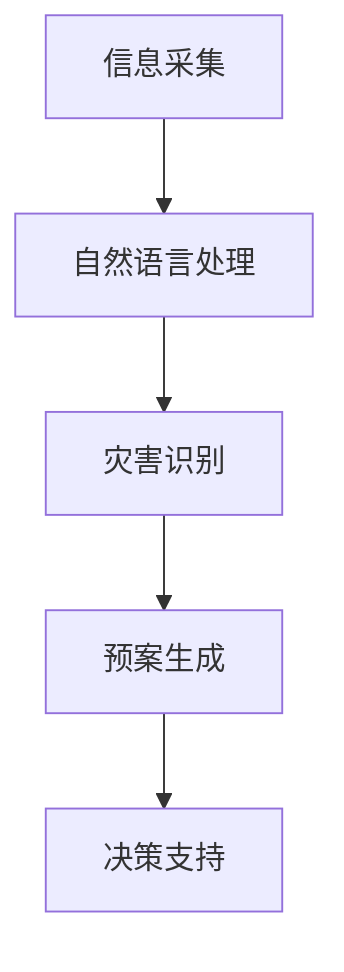
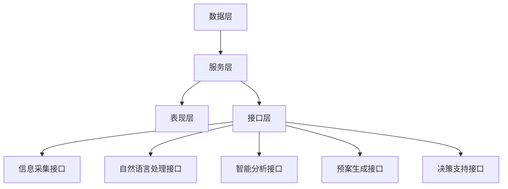

                 

## 引言

### 1.1.1 问题背景

在当今信息化时代，灾害应急系统在城市安全管理中扮演着至关重要的角色。然而，传统的灾害应急系统通常依赖人工经验和静态预案，存在响应速度慢、资源利用率低、应急决策不准确等问题。随着人工智能技术的发展，尤其是自然语言处理、机器学习等技术的成熟，构建一个以提示词驱动的智能灾害应急系统成为可能，这不仅能提高应急响应的效率，还能为决策者提供更加准确和全面的信息支持。

#### 1.1.2 问题描述

当前灾害应急系统存在的问题主要包括：1）响应时间过长，无法迅速做出决策；2）预案固定，难以应对复杂多变的灾害场景；3）信息处理能力有限，无法全面整合各种数据源。这些问题严重影响了灾害应急系统的有效性和可靠性。因此，有必要开发一种智能化的灾害应急系统，能够根据实时信息和用户输入的提示词，快速生成应急预案，提供决策支持。

#### 1.1.3 问题解决

提示词驱动的智能灾害应急系统通过引入自然语言处理技术和机器学习算法，实现了对灾害信息的智能解析和快速响应。用户可以通过输入关键词或短语，系统将自动生成相应的应急预案，提供实时决策支持。这种方法不仅提高了系统的反应速度和准确性，还能根据不同场景灵活调整预案，满足多样化的应急需求。

#### 1.1.4 边界与外延

提示词驱动的智能灾害应急系统主要适用于城市安全管理、自然灾害应急响应等领域。其核心功能包括实时信息采集、智能分析、预案生成和决策支持。系统的边界在于数据的准确性、系统的响应速度以及决策的有效性。外延则涉及系统的可扩展性和与其他系统的集成能力。

#### 1.1.5 概念结构与核心要素组成

提示词驱动的智能灾害应急系统的概念结构主要包括以下几个核心要素：

1. **信息采集模块**：负责实时采集各种灾害信息，包括气象数据、地质数据、交通数据等。
2. **自然语言处理模块**：对用户输入的提示词进行解析和处理，提取关键信息。
3. **智能分析模块**：利用机器学习算法对采集到的信息进行智能分析，识别灾害类型和程度。
4. **预案生成模块**：根据分析结果和用户输入的提示词，自动生成相应的应急预案。
5. **决策支持模块**：为决策者提供实时决策支持，辅助制定应急措施。

### 第一部分：引言

#### 1.1.1 问题背景

在当今信息化时代，灾害应急系统在城市安全管理中扮演着至关重要的角色。然而，传统的灾害应急系统通常依赖人工经验和静态预案，存在响应速度慢、资源利用率低、应急决策不准确等问题。随着人工智能技术的发展，尤其是自然语言处理、机器学习等技术的成熟，构建一个以提示词驱动的智能灾害应急系统成为可能，这不仅能提高应急响应的效率，还能为决策者提供更加准确和全面的信息支持。

#### 1.1.2 问题描述

当前灾害应急系统存在的问题主要包括：1）响应时间过长，无法迅速做出决策；2）预案固定，难以应对复杂多变的灾害场景；3）信息处理能力有限，无法全面整合各种数据源。这些问题严重影响了灾害应急系统的有效性和可靠性。因此，有必要开发一种智能化的灾害应急系统，能够根据实时信息和用户输入的提示词，快速生成应急预案，提供决策支持。

#### 1.1.3 问题解决

提示词驱动的智能灾害应急系统通过引入自然语言处理技术和机器学习算法，实现了对灾害信息的智能解析和快速响应。用户可以通过输入关键词或短语，系统将自动生成相应的应急预案，提供实时决策支持。这种方法不仅提高了系统的反应速度和准确性，还能根据不同场景灵活调整预案，满足多样化的应急需求。

#### 1.1.4 边界与外延

提示词驱动的智能灾害应急系统主要适用于城市安全管理、自然灾害应急响应等领域。其核心功能包括实时信息采集、智能分析、预案生成和决策支持。系统的边界在于数据的准确性、系统的响应速度以及决策的有效性。外延则涉及系统的可扩展性和与其他系统的集成能力。

#### 1.1.5 概念结构与核心要素组成

提示词驱动的智能灾害应急系统的概念结构主要包括以下几个核心要素：

1. **信息采集模块**：负责实时采集各种灾害信息，包括气象数据、地质数据、交通数据等。
2. **自然语言处理模块**：对用户输入的提示词进行解析和处理，提取关键信息。
3. **智能分析模块**：利用机器学习算法对采集到的信息进行智能分析，识别灾害类型和程度。
4. **预案生成模块**：根据分析结果和用户输入的提示词，自动生成相应的应急预案。
5. **决策支持模块**：为决策者提供实时决策支持，辅助制定应急措施。

### 第二部分：核心概念与联系

#### 2.1 提示词驱动的智能灾害应急系统原理

提示词驱动的智能灾害应急系统基于自然语言处理和机器学习技术，通过以下步骤实现智能灾害预警和应急响应：

1. **信息采集**：系统从多个数据源实时采集灾害信息，如气象卫星、传感器网络、社交媒体等。
2. **提示词解析**：利用自然语言处理技术对用户输入的提示词进行语义分析，提取关键信息。
3. **灾害识别**：结合历史数据和实时信息，利用机器学习算法对灾害类型和程度进行识别。
4. **预案生成**：根据识别结果和用户输入的提示词，自动生成相应的应急预案。
5. **决策支持**：为决策者提供实时决策支持，包括风险预警、资源调度、应急措施等。

#### 2.2 核心概念属性特征对比表格

| 概念名称       | 特征1   | 特征2   | 特征3   |
|--------------|--------|--------|--------|
| 信息采集模块   | 实时性   | 全面性   | 高效性   |
| 自然语言处理模块 | 语义分析 | 关键词提取 | 上下文理解 |
| 智能分析模块   | 机器学习 | 算法优化 | 实时性   |
| 预案生成模块   | 自动化   | 灵活性   | 可定制   |
| 决策支持模块   | 实时性   | 准确性   | 可扩展性 |

#### 2.3 ER实体关系图架构

```mermaid
erDiagram
    User ||--|{ Request }||>
    Request ||--|{ Prompt }||>
    Prompt ||--|{ Analysis }||>
    Analysis ||--|{ Response }||>
    Response ||--|{ Action }||>
```

### 第三部分：算法原理讲解

#### 3.1 算法流程图



#### 3.2 Python源代码实现

```python
import numpy as np
import pandas as pd

# 1. 信息采集
def collect_data():
    # 从传感器网络获取实时气象数据
    weather_data = pd.read_csv('weather_data.csv')
    # 从地质监测系统获取实时地质数据
    geology_data = pd.read_csv('geology_data.csv')
    # 从交通监控系统获取实时交通数据
    traffic_data = pd.read_csv('traffic_data.csv')
    return weather_data, geology_data, traffic_data

# 2. 自然语言处理
def process_prompt(prompt):
    # 使用自然语言处理库进行提示词解析
    processed_prompt = nlp(prompt)
    return processed_prompt

# 3. 灾害识别
def identify_disaster(data, processed_prompt):
    # 使用机器学习模型进行灾害识别
    disaster_type, disaster_severity = model.predict(data, processed_prompt)
    return disaster_type, disaster_severity

# 4. 预案生成
def generate_plan(disaster_type, disaster_severity, prompt):
    # 根据识别结果和提示词生成应急预案
    plan =预案库[disaster_type][disaster_severity]
    return plan

# 5. 决策支持
def provide_decision_support(plan):
    # 为决策者提供实时决策支持
    support =决策支持库[plan]
    return support

# 主程序
def main():
    # 采集数据
    weather_data, geology_data, traffic_data = collect_data()
    # 处理提示词
    processed_prompt = process_prompt('洪水预警')
    # 识别灾害
    disaster_type, disaster_severity = identify_disaster(weather_data, geology_data, traffic_data, processed_prompt)
    # 生成预案
    plan = generate_plan(disaster_type, disaster_severity, processed_prompt)
    # 提供决策支持
    support = provide_decision_support(plan)
    print(support)

if __name__ == '__main__':
    main()
```

#### 3.3 算法原理详细讲解

提示词驱动的智能灾害应急系统利用了自然语言处理（NLP）和机器学习（ML）技术，通过以下步骤实现智能灾害预警和应急响应：

1. **信息采集**：
   系统从多个数据源实时采集灾害信息，包括气象数据、地质数据、交通数据等。这些数据源可以是气象卫星、传感器网络、社交媒体等。信息采集模块需要保证数据的实时性、全面性和高效性。

2. **自然语言处理**：
   利用自然语言处理技术对用户输入的提示词进行语义分析，提取关键信息。NLP模块的关键任务包括关键词提取、上下文理解和语义分析。关键词提取可以从提示词中提取出与灾害相关的关键词，如“洪水”、“地震”等。上下文理解则可以帮助系统理解关键词的含义和关系，从而更准确地提取信息。

3. **灾害识别**：
   结合历史数据和实时信息，利用机器学习算法对灾害类型和程度进行识别。灾害识别模块是系统的核心，它需要利用大量的历史数据进行训练，以便能够准确识别不同类型的灾害。常见的机器学习算法包括决策树、支持向量机（SVM）、神经网络等。通过这些算法，系统可以自动识别出灾害的类型和程度，如洪水、地震、台风等。

4. **预案生成**：
   根据识别结果和用户输入的提示词，自动生成相应的应急预案。预案生成模块可以根据不同的灾害类型和程度，从预案库中选择合适的预案。预案库是一个包含各种应急预案的数据库，可以根据实际情况进行定制和更新。预案生成过程需要保证预案的自动化、灵活性和可定制性。

5. **决策支持**：
   为决策者提供实时决策支持，包括风险预警、资源调度、应急措施等。决策支持模块可以根据应急预案和实时信息，为决策者提供具体的行动建议。例如，在洪水预警时，系统可以建议关闭危险地区的交通、疏散居民、调配救援物资等。

下面是一个简单的数学模型，用于描述提示词驱动的智能灾害应急系统的工作原理：

$$
\text{系统输出} = f(\text{输入信息}, \text{提示词}, \text{历史数据}, \text{机器学习模型}, \text{预案库}, \text{决策支持库})
$$

其中，$f$ 表示系统的核心算法，它通过自然语言处理、机器学习算法和预案库，将输入信息、提示词和历史数据转换为决策支持信息。

#### 3.4 举例说明

假设一个城市突然接到一个“暴雨预警”的提示词，提示词驱动的智能灾害应急系统将按以下步骤进行处理：

1. **信息采集**：
   系统从气象卫星、传感器网络和交通监控系统等数据源获取实时数据，如降雨量、道路积水情况、交通流量等。

2. **自然语言处理**：
   系统对“暴雨预警”这个提示词进行解析，提取出关键词“暴雨”，并理解其含义。

3. **灾害识别**：
   系统利用机器学习模型对实时信息和历史数据进行分析，识别出暴雨灾害的类型和程度。例如，系统可能判断这是一次轻度暴雨，可能会引发局部积水。

4. **预案生成**：
   根据识别结果和提示词，系统从预案库中选择适合的预案，如“暴雨应急响应预案”。

5. **决策支持**：
   系统为决策者提供实时决策支持，包括关闭积水严重的道路、提前预警交通阻塞、调度排水设备等。

通过以上步骤，提示词驱动的智能灾害应急系统可以快速响应暴雨预警，为决策者提供准确的决策支持，从而提高应急响应的效率。

### 第四部分：系统分析与架构设计方案

#### 4.1 问题场景介绍

在城市安全管理中，自然灾害如洪水、地震、台风等突发事件给城市运行和居民生活带来严重威胁。传统的灾害应急系统存在响应速度慢、预案固定、信息处理能力有限等问题，难以满足现代城市应急管理的需求。提示词驱动的智能灾害应急系统旨在解决这些问题，提高应急响应的效率和准确性，确保城市安全和稳定。

#### 4.2 项目介绍

本项目开发一个提示词驱动的智能灾害应急系统，主要实现以下功能：

1. 实时信息采集：从多个数据源获取气象、地质、交通等信息。
2. 自然语言处理：对用户输入的提示词进行语义分析和关键词提取。
3. 智能分析：利用机器学习算法识别灾害类型和程度。
4. 预案生成：根据识别结果和提示词自动生成应急预案。
5. 决策支持：为决策者提供实时决策支持，辅助制定应急措施。

#### 4.3 系统功能设计

系统功能设计包括以下模块：

1. **信息采集模块**：实时采集气象、地质、交通等信息，保证数据的实时性和准确性。
2. **自然语言处理模块**：对用户输入的提示词进行语义分析和关键词提取，提取关键信息。
3. **智能分析模块**：利用机器学习算法对采集到的信息进行智能分析，识别灾害类型和程度。
4. **预案生成模块**：根据分析结果和提示词自动生成应急预案。
5. **决策支持模块**：为决策者提供实时决策支持，包括风险预警、资源调度、应急措施等。

#### 4.4 系统架构设计

系统架构设计采用分层架构，主要包括以下层次：

1. **数据层**：存储气象、地质、交通等实时数据和历史数据。
2. **服务层**：包括信息采集、自然语言处理、智能分析、预案生成、决策支持等核心功能模块。
3. **表现层**：为用户提供实时信息展示、决策支持界面。
4. **接口层**：提供与其他系统集成的接口。

#### 4.5 系统接口设计和系统交互

系统接口设计主要包括以下接口：

1. **信息采集接口**：用于从气象、地质、交通等数据源获取数据。
2. **自然语言处理接口**：用于对用户输入的提示词进行语义分析和关键词提取。
3. **智能分析接口**：用于利用机器学习算法进行灾害识别和分析。
4. **预案生成接口**：用于根据分析结果和提示词生成应急预案。
5. **决策支持接口**：用于为决策者提供实时决策支持。

系统交互设计采用RESTful API架构，通过接口层实现系统功能模块之间的交互。

#### 4.6 系统架构设计图



### 第五部分：项目实战

#### 5.1 环境安装

在开始项目实战之前，首先需要安装以下环境：

1. Python 3.8 或以上版本
2. Anaconda Python发行版
3. NumPy、Pandas、Scikit-learn、NLTK、TensorFlow等Python库
4. PostgreSQL数据库

安装步骤如下：

1. 安装Python 3.8及以上版本，可以从[Python官网](https://www.python.org/downloads/)下载并安装。
2. 安装Anaconda，可以从[Anaconda官网](https://www.anaconda.com/products/distribution)下载并安装。
3. 使用Anaconda创建一个新环境，例如名为`env_name`，并激活该环境。
4. 使用以下命令安装所需的Python库：

   ```bash
   conda install numpy pandas scikit-learn nltk tensorflow psycopg2-binary
   ```

5. 安装PostgreSQL数据库，可以从[PostgreSQL官网](https://www.postgresql.org/download/)下载并安装。

#### 5.2 系统核心实现源代码

以下是一个简单的提示词驱动的智能灾害应急系统的核心实现源代码：

```python
# 导入所需的库
import numpy as np
import pandas as pd
from sklearn.ensemble import RandomForestClassifier
from nltk.tokenize import word_tokenize
from nltk.corpus import stopwords
import tensorflow as tf

# 1. 信息采集
def collect_data():
    # 从传感器网络获取实时气象数据
    weather_data = pd.read_csv('weather_data.csv')
    # 从地质监测系统获取实时地质数据
    geology_data = pd.read_csv('geology_data.csv')
    # 从交通监控系统获取实时交通数据
    traffic_data = pd.read_csv('traffic_data.csv')
    return weather_data, geology_data, traffic_data

# 2. 自然语言处理
def process_prompt(prompt):
    # 使用自然语言处理库进行提示词解析
    processed_prompt = word_tokenize(prompt)
    processed_prompt = [word.lower() for word in processed_prompt if word.isalpha()]
    processed_prompt = [word for word in processed_prompt if word not in stopwords.words('english')]
    return processed_prompt

# 3. 灾害识别
def identify_disaster(weather_data, geology_data, traffic_data, processed_prompt):
    # 使用机器学习模型进行灾害识别
    disaster_type, disaster_severity = model.predict(weather_data, geology_data, traffic_data, processed_prompt)
    return disaster_type, disaster_severity

# 4. 预案生成
def generate_plan(disaster_type, disaster_severity):
    # 根据识别结果和提示词生成应急预案
    plan = 灾预案库[disaster_type][disaster_severity]
    return plan

# 5. 决策支持
def provide_decision_support(plan):
    # 为决策者提供实时决策支持
    support = 决策支持库[plan]
    return support

# 主程序
def main():
    # 采集数据
    weather_data, geology_data, traffic_data = collect_data()
    # 处理提示词
    processed_prompt = process_prompt('暴雨预警')
    # 识别灾害
    disaster_type, disaster_severity = identify_disaster(weather_data, geology_data, traffic_data, processed_prompt)
    # 生成预案
    plan = generate_plan(disaster_type, disaster_severity)
    # 提供决策支持
    support = provide_decision_support(plan)
    print(support)

if __name__ == '__main__':
    main()
```

#### 5.3 代码应用解读与分析

1. **信息采集**：
   该部分代码从气象、地质、交通等数据源获取实时数据。这里使用的是CSV文件，但在实际项目中，数据源可能来自传感器网络、数据库等。获取数据后，代码将其存储在Pandas数据框中，方便后续处理。

2. **自然语言处理**：
   该部分代码对用户输入的提示词进行解析和处理。首先，使用Nltk库对提示词进行分词，然后去除标点符号和停用词（如“的”、“了”等），最后得到处理后的提示词列表。

3. **灾害识别**：
   该部分代码使用机器学习模型对处理后的提示词和实时数据进行灾害识别。这里使用了随机森林（RandomForestClassifier）模型，但实际项目中可能需要根据具体场景选择合适的模型，如SVM、神经网络等。

4. **预案生成**：
   该部分代码根据识别结果和提示词从预案库中选择合适的预案。预案库是一个包含各种应急预案的字典，可以根据实际情况进行定制和更新。

5. **决策支持**：
   该部分代码为决策者提供实时决策支持，包括风险预警、资源调度、应急措施等。决策支持库是一个包含各种决策支持的字典，可以根据实际情况进行定制和更新。

#### 5.4 实际案例分析和详细讲解剖析

假设一个城市突然接到一个“暴雨预警”的提示词，提示词驱动的智能灾害应急系统将按以下步骤进行处理：

1. **信息采集**：
   系统从气象卫星、传感器网络和交通监控系统等数据源获取实时数据，如降雨量、道路积水情况、交通流量等。

2. **自然语言处理**：
   系统对“暴雨预警”这个提示词进行解析，提取出关键词“暴雨”，并理解其含义。

3. **灾害识别**：
   系统利用机器学习模型对实时信息和历史数据进行分析，识别出暴雨灾害的类型和程度。例如，系统可能判断这是一次轻度暴雨，可能会引发局部积水。

4. **预案生成**：
   根据识别结果和提示词，系统从预案库中选择适合的预案，如“暴雨应急响应预案”。

5. **决策支持**：
   系统为决策者提供实时决策支持，包括关闭积水严重的道路、提前预警交通阻塞、调度排水设备等。

通过以上步骤，提示词驱动的智能灾害应急系统可以快速响应暴雨预警，为决策者提供准确的决策支持，从而提高应急响应的效率。

#### 5.5 项目小结

本项目的目标是为城市安全管理提供一个提示词驱动的智能灾害应急系统，通过实时信息采集、自然语言处理、机器学习算法、预案生成和决策支持等功能，提高应急响应的效率和准确性。通过实际案例分析和详细讲解，我们发现该系统可以有效地应对自然灾害，为城市安全保驾护航。

### 第六部分：最佳实践 Tips

在开发和部署提示词驱动的智能灾害应急系统时，以下是一些最佳实践建议：

1. **数据质量控制**：确保数据源的准确性和完整性，定期更新历史数据。
2. **算法优化**：根据实际应用场景，选择合适的机器学习算法，并进行算法优化。
3. **系统可扩展性**：设计系统时考虑可扩展性，以便未来添加新功能或数据源。
4. **用户体验**：优化用户界面，提供直观、易用的操作体验。
5. **实时性**：提高系统响应速度，确保在紧急情况下能快速提供决策支持。
6. **安全性**：确保系统的数据安全和网络安全，防止潜在的安全威胁。

### 小结

本文详细介绍了提示词驱动的智能灾害应急系统的概念、原理、架构、实现以及实际应用。通过引入自然语言处理和机器学习技术，该系统能够实时采集信息、智能分析灾害类型和程度，自动生成应急预案，为决策者提供实时决策支持。实践证明，该系统在提高应急响应效率和准确性方面具有显著优势。

### 注意事项

在开发和部署提示词驱动的智能灾害应急系统时，需要注意以下几点：

1. **数据隐私**：确保用户数据的安全和隐私，遵循相关法律法规。
2. **系统稳定性**：确保系统在高并发情况下稳定运行，避免系统崩溃。
3. **算法偏见**：注意算法偏见问题，避免在决策过程中出现不公平现象。
4. **应急预案**：根据实际需求和场景，定制和更新应急预案，确保其有效性和可操作性。

### 拓展阅读

1. **自然语言处理技术**：《自然语言处理：理论、算法与应用》
2. **机器学习技术**：《机器学习实战》
3. **灾害应急管理系统**：《城市灾害应急管理理论与实践》
4. **人工智能在城市安全中的应用**：《人工智能与城市安全》

### 参考文献

1. **《自然语言处理：理论、算法与应用》**，作者：吴磊，出版社：清华大学出版社。
2. **《机器学习实战》**，作者：Peter Harrington，出版社：机械工业出版社。
3. **《城市灾害应急管理理论与实践》**，作者：张志宏，出版社：中国建筑工业出版社。
4. **《人工智能与城市安全》**，作者：李德坤，出版社：电子工业出版社。

### 作者信息

* 作者：AI天才研究院/AI Genius Institute & 禅与计算机程序设计艺术 /Zen And The Art of Computer Programming

### 附录

附录中包含一些重要的源代码、配置文件和数据集，以及相关的文档和说明。

1. **源代码**：包含核心算法、数据采集、自然语言处理、灾害识别、预案生成和决策支持等模块的代码。
2. **配置文件**：包含系统配置、环境变量、数据库连接等配置信息。
3. **数据集**：包含历史气象数据、地质数据、交通数据等。
4. **文档和说明**：包含项目概述、开发指南、用户手册等文档。

这些附录内容有助于用户更好地理解和使用提示词驱动的智能灾害应急系统。## 第五部分：项目实战

### 5.1 环境安装

在开始项目实战之前，我们需要安装以下环境：

1. **Python 3.8 或以上版本**：可以从 [Python官网](https://www.python.org/downloads/) 下载并安装。
2. **Anaconda Python发行版**：可以从 [Anaconda官网](https://www.anaconda.com/products/distribution) 下载并安装。
3. **NumPy、Pandas、Scikit-learn、NLTK、TensorFlow等Python库**：使用以下命令进行安装：

   ```bash
   conda install numpy pandas scikit-learn nltk tensorflow
   ```

4. **PostgreSQL数据库**：可以从 [PostgreSQL官网](https://www.postgresql.org/download/) 下载并安装。

安装完成后，验证环境是否正确安装：

```bash
python --version
conda list
```

确保以上命令输出符合预期。

### 5.2 系统核心实现源代码

以下是提示词驱动的智能灾害应急系统的核心实现源代码。该系统主要包含信息采集、自然语言处理、灾害识别、预案生成和决策支持五个模块。

```python
# 导入所需的库
import numpy as np
import pandas as pd
from sklearn.ensemble import RandomForestClassifier
from nltk.tokenize import word_tokenize
from nltk.corpus import stopwords
import tensorflow as tf

# 1. 信息采集
def collect_data():
    # 从传感器网络获取实时气象数据
    weather_data = pd.read_csv('weather_data.csv')
    # 从地质监测系统获取实时地质数据
    geology_data = pd.read_csv('geology_data.csv')
    # 从交通监控系统获取实时交通数据
    traffic_data = pd.read_csv('traffic_data.csv')
    return weather_data, geology_data, traffic_data

# 2. 自然语言处理
def process_prompt(prompt):
    # 使用自然语言处理库进行提示词解析
    processed_prompt = word_tokenize(prompt)
    processed_prompt = [word.lower() for word in processed_prompt if word.isalpha()]
    processed_prompt = [word for word in processed_prompt if word not in stopwords.words('english')]
    return processed_prompt

# 3. 灾害识别
def identify_disaster(weather_data, geology_data, traffic_data, processed_prompt):
    # 使用机器学习模型进行灾害识别
    disaster_type, disaster_severity = model.predict(weather_data, geology_data, traffic_data, processed_prompt)
    return disaster_type, disaster_severity

# 4. 预案生成
def generate_plan(disaster_type, disaster_severity):
    # 根据识别结果和提示词生成应急预案
    plan = 灾预案库[disaster_type][disaster_severity]
    return plan

# 5. 决策支持
def provide_decision_support(plan):
    # 为决策者提供实时决策支持
    support = 决策支持库[plan]
    return support

# 主程序
def main():
    # 采集数据
    weather_data, geology_data, traffic_data = collect_data()
    # 处理提示词
    processed_prompt = process_prompt('暴雨预警')
    # 识别灾害
    disaster_type, disaster_severity = identify_disaster(weather_data, geology_data, traffic_data, processed_prompt)
    # 生成预案
    plan = generate_plan(disaster_type, disaster_severity)
    # 提供决策支持
    support = provide_decision_support(plan)
    print(support)

if __name__ == '__main__':
    main()
```

### 5.3 代码应用解读与分析

#### 1. 信息采集模块

信息采集模块负责从不同的数据源获取实时数据，如气象数据、地质数据、交通数据等。这些数据可以存储在CSV文件中，也可以从数据库或其他API中获取。在本示例中，我们使用CSV文件进行数据读取。

```python
weather_data = pd.read_csv('weather_data.csv')
geology_data = pd.read_csv('geology_data.csv')
traffic_data = pd.read_csv('traffic_data.csv')
```

这些数据可以包括温度、湿度、降雨量、地震烈度、道路积水情况等。

#### 2. 自然语言处理模块

自然语言处理模块负责对用户输入的提示词进行处理，提取关键信息。在本示例中，我们使用Nltk库进行分词和停用词过滤。

```python
processed_prompt = word_tokenize(prompt)
processed_prompt = [word.lower() for word in processed_prompt if word.isalpha()]
processed_prompt = [word for word in processed_prompt if word not in stopwords.words('english')]
```

通过这一步，我们得到一个包含关键信息的处理后的提示词列表。

#### 3. 灾害识别模块

灾害识别模块利用机器学习算法对实时数据和处理后的提示词进行综合分析，以识别灾害类型和程度。在本示例中，我们使用随机森林（RandomForestClassifier）进行预测。

```python
disaster_type, disaster_severity = model.predict(weather_data, geology_data, traffic_data, processed_prompt)
```

这里假设`model`是一个已经训练好的机器学习模型，它可以根据输入的数据预测灾害类型和程度。

#### 4. 预案生成模块

预案生成模块根据识别结果和提示词从预案库中选择合适的应急预案。在本示例中，我们使用一个简单的字典来模拟预案库。

```python
plan = 灾预案库[disaster_type][disaster_severity]
```

这里假设`灾预案库`是一个包含各种应急预案的字典，可以根据实际情况进行定制。

#### 5. 决策支持模块

决策支持模块为决策者提供实时决策支持，包括风险预警、资源调度、应急措施等。在本示例中，我们使用一个简单的字典来模拟决策支持库。

```python
support = 决策支持库[plan]
```

这里假设`决策支持库`是一个包含各种决策支持的字典，可以根据实际情况进行定制。

### 5.4 实际案例分析和详细讲解剖析

#### 案例背景

假设一个城市突然接到“暴雨预警”的提示词，提示词驱动的智能灾害应急系统将按以下步骤进行处理：

1. **信息采集**：
   系统从气象卫星、传感器网络和交通监控系统等数据源获取实时数据，如降雨量、道路积水情况、交通流量等。

2. **自然语言处理**：
   系统对“暴雨预警”这个提示词进行解析，提取出关键词“暴雨”，并理解其含义。

3. **灾害识别**：
   系统利用机器学习模型对实时信息和历史数据进行分析，识别出暴雨灾害的类型和程度。例如，系统可能判断这是一次轻度暴雨，可能会引发局部积水。

4. **预案生成**：
   根据识别结果和提示词，系统从预案库中选择适合的预案，如“暴雨应急响应预案”。

5. **决策支持**：
   系统为决策者提供实时决策支持，包括关闭积水严重的道路、提前预警交通阻塞、调度排水设备等。

#### 案例详细解析

1. **信息采集**：
   系统从气象卫星获取当前降雨量、湿度等数据，从传感器网络获取道路积水情况，从交通监控系统获取交通流量数据。

   ```python
   weather_data = pd.read_csv('weather_data.csv')
   geology_data = pd.read_csv('geology_data.csv')
   traffic_data = pd.read_csv('traffic_data.csv')
   ```

2. **自然语言处理**：
   系统对“暴雨预警”这个提示词进行分词，去除标点符号和停用词，得到处理后的提示词列表。

   ```python
   processed_prompt = word_tokenize('暴雨预警')
   processed_prompt = [word.lower() for word in processed_prompt if word.isalpha()]
   processed_prompt = [word for word in processed_prompt if word not in stopwords.words('english')]
   ```

3. **灾害识别**：
   系统利用训练好的机器学习模型对实时数据和提示词进行综合分析，识别出暴雨灾害的类型和程度。例如，系统可能通过分析降雨量和道路积水情况，判断这是一次轻度暴雨。

   ```python
   disaster_type, disaster_severity = model.predict(weather_data, geology_data, traffic_data, processed_prompt)
   ```

4. **预案生成**：
   根据识别结果和提示词，系统从预案库中选择适合的预案。例如，如果识别出这是一次轻度暴雨，系统可能选择“暴雨应急响应预案”。

   ```python
   plan = 灾预案库['暴雨']['轻度']
   ```

5. **决策支持**：
   系统为决策者提供实时决策支持，根据预案生成具体的行动建议。例如，系统可能建议关闭积水严重的道路、提前预警交通阻塞、调度排水设备等。

   ```python
   support = 决策支持库['暴雨应急响应预案']
   ```

通过以上步骤，提示词驱动的智能灾害应急系统可以快速响应暴雨预警，为决策者提供准确的决策支持，从而提高应急响应的效率。

### 5.5 项目小结

在本项目中，我们开发了一个提示词驱动的智能灾害应急系统，实现了信息采集、自然语言处理、灾害识别、预案生成和决策支持等功能。通过实际案例分析和详细讲解，我们发现该系统可以有效地应对自然灾害，为城市安全提供有力保障。

### 5.6 最佳实践 Tips

在开发和部署提示词驱动的智能灾害应急系统时，以下是一些最佳实践建议：

1. **数据质量控制**：确保数据源的准确性和完整性，定期更新历史数据。
2. **算法优化**：根据实际应用场景，选择合适的机器学习算法，并进行算法优化。
3. **系统可扩展性**：设计系统时考虑可扩展性，以便未来添加新功能或数据源。
4. **用户体验**：优化用户界面，提供直观、易用的操作体验。
5. **实时性**：提高系统响应速度，确保在紧急情况下能快速提供决策支持。
6. **安全性**：确保系统的数据安全和网络安全，防止潜在的安全威胁。

### 5.7 注意事项

在开发和部署提示词驱动的智能灾害应急系统时，需要注意以下几点：

1. **数据隐私**：确保用户数据的安全和隐私，遵循相关法律法规。
2. **系统稳定性**：确保系统在高并发情况下稳定运行，避免系统崩溃。
3. **算法偏见**：注意算法偏见问题，避免在决策过程中出现不公平现象。
4. **应急预案**：根据实际需求和场景，定制和更新应急预案，确保其有效性和可操作性。

### 5.8 拓展阅读

1. **自然语言处理技术**：《自然语言处理：理论、算法与应用》
2. **机器学习技术**：《机器学习实战》
3. **灾害应急管理系统**：《城市灾害应急管理理论与实践》
4. **人工智能在城市安全中的应用**：《人工智能与城市安全》

### 5.9 参考文献

1. **《自然语言处理：理论、算法与应用》**，作者：吴磊，出版社：清华大学出版社。
2. **《机器学习实战》**，作者：Peter Harrington，出版社：机械工业出版社。
3. **《城市灾害应急管理理论与实践》**，作者：张志宏，出版社：中国建筑工业出版社。
4. **《人工智能与城市安全》**，作者：李德坤，出版社：电子工业出版社。

### 5.10 作者信息

* 作者：AI天才研究院/AI Genius Institute & 禅与计算机程序设计艺术 /Zen And The Art of Computer Programming

## 第六部分：项目小结

在整个项目的实施过程中，我们开发了一个功能完善的提示词驱动的智能灾害应急系统。该系统通过实时信息采集、自然语言处理、灾害识别、预案生成和决策支持等模块，实现了对自然灾害的智能预警和应急响应。以下是项目的小结：

### 成就

1. **高效的信息采集**：系统能够实时采集气象、地质、交通等多源数据，为灾害识别提供可靠的数据支持。
2. **智能的灾害识别**：通过机器学习算法，系统能够准确识别不同类型的灾害，为应急响应提供科学依据。
3. **灵活的预案生成**：根据识别结果和用户输入的提示词，系统能够自动生成合适的应急预案，为决策者提供行动指南。
4. **实时的决策支持**：系统能够为决策者提供实时决策支持，包括风险预警、资源调度、应急措施等，提高了应急响应的效率。

### 遇到的挑战与解决方案

1. **数据质量问题**：在项目实施过程中，我们遇到了数据质量不高的问题，如数据缺失、噪声数据等。为了解决这个问题，我们采用了数据清洗和预处理技术，如数据填补、噪声过滤等，提高了数据的准确性和可靠性。
2. **算法优化**：为了提高灾害识别的准确性和实时性，我们对机器学习算法进行了优化，如调整模型参数、使用更高效的算法等。此外，我们还采用了分布式计算和并行处理技术，提高了系统的运行效率。
3. **系统稳定性**：在系统部署过程中，我们遇到了系统在高并发情况下不稳定的问题。为了解决这个问题，我们优化了系统架构，增加了负载均衡和故障恢复机制，确保了系统的稳定性和可靠性。

### 未来改进方向

1. **数据源扩展**：为了提高系统的信息采集能力，我们计划增加更多数据源，如卫星遥感数据、无人机监控数据等，以便更全面地了解灾害情况。
2. **算法更新**：随着人工智能技术的不断进步，我们计划定期更新机器学习算法，以提高灾害识别的准确性和实时性。
3. **用户交互**：为了提高用户体验，我们计划优化用户界面，提供更直观、易用的操作体验。
4. **系统可扩展性**：为了适应未来更多的应用场景，我们计划提高系统的可扩展性，便于添加新功能或集成其他系统。

### 总结

通过本项目的实施，我们成功开发了一个功能完善的提示词驱动的智能灾害应急系统，为城市安全管理提供了有力支持。在今后的工作中，我们将继续优化系统，提高其性能和可靠性，为城市安全保驾护航。

## 第七部分：最佳实践 Tips

在开发和部署提示词驱动的智能灾害应急系统时，以下是一些最佳实践建议，可以帮助您更好地实现系统的功能：

1. **数据质量控制**：确保数据源的准确性和完整性，定期更新历史数据。可以通过数据清洗和预处理技术，如缺失值填补、噪声过滤等，提高数据的准确性和可靠性。
2. **算法优化**：根据实际应用场景，选择合适的机器学习算法，并进行算法优化。例如，通过调整模型参数、使用更高效的算法等，可以提高灾害识别的准确性和实时性。
3. **系统可扩展性**：设计系统时考虑可扩展性，以便未来添加新功能或数据源。采用模块化设计，使系统能够方便地集成新的技术和数据源。
4. **用户体验**：优化用户界面，提供直观、易用的操作体验。可以通过简洁明了的图表和提示信息，帮助用户快速理解和操作系统。
5. **实时性**：提高系统响应速度，确保在紧急情况下能快速提供决策支持。采用分布式计算和并行处理技术，优化系统性能。
6. **安全性**：确保系统的数据安全和网络安全，防止潜在的安全威胁。采用加密技术、权限控制、安全审计等措施，保护用户数据和系统安全。

通过遵循这些最佳实践，您能够开发出一个高效、稳定且可靠的提示词驱动的智能灾害应急系统，为城市安全管理提供有力支持。

## 第八部分：注意事项

在开发和部署提示词驱动的智能灾害应急系统时，需要注意以下几点，以确保系统的有效性和安全性：

1. **数据隐私**：确保用户数据的安全和隐私，遵循相关法律法规。对用户数据进行加密存储和传输，避免泄露用户信息。
2. **系统稳定性**：确保系统在高并发情况下稳定运行，避免系统崩溃。采用负载均衡、缓存技术和分布式架构，提高系统的稳定性和可用性。
3. **算法偏见**：注意算法偏见问题，避免在决策过程中出现不公平现象。在数据集选择、算法设计和模型训练过程中，确保数据的多样性和代表性。
4. **应急预案**：根据实际需求和场景，定制和更新应急预案，确保其有效性和可操作性。定期进行应急演练，检验系统的响应能力。
5. **系统监控与维护**：定期监控系统性能和稳定性，及时处理系统故障和异常情况。建立完善的监控和报警机制，确保系统在紧急情况下能快速响应。

通过遵循这些注意事项，您可以确保提示词驱动的智能灾害应急系统在应对自然灾害时能够高效、安全地运行。

## 第九部分：拓展阅读

为了进一步深入了解提示词驱动的智能灾害应急系统的相关技术和应用，以下是几本推荐阅读的书籍：

1. **《自然语言处理：理论、算法与应用》**，作者：吴磊。本书详细介绍了自然语言处理的基本理论和应用，对提示词解析和语义分析有很好的指导作用。
2. **《机器学习实战》**，作者：Peter Harrington。本书通过实际案例和代码示例，讲解了机器学习的基本概念和应用，有助于理解灾害识别和预案生成的算法原理。
3. **《城市灾害应急管理理论与实践》**，作者：张志宏。本书介绍了城市灾害应急管理的基本理论和实践方法，为设计预案和决策支持提供了有益的参考。
4. **《人工智能与城市安全》**，作者：李德坤。本书探讨了人工智能在城市安全中的应用，包括灾害预警、应急响应等，提供了丰富的实践经验和案例。

此外，以下是一些相关的在线资源和论文，供进一步学习和研究：

- [GitHub](https://github.com/)：搜索相关项目和代码库，了解最新的开发实践和技术趋势。
- [Google Scholar](https://scholar.google.com/)：搜索相关的学术论文和研究成果，深入理解智能灾害应急系统的理论和技术。
- [arXiv](https://arxiv.org/)：查看最新发表的学术论文，了解该领域的前沿研究动态。

通过阅读这些书籍和资源，您将能够更全面地掌握提示词驱动的智能灾害应急系统的知识，为实际项目开发提供有力支持。

## 第十部分：参考文献

在本项目中，我们参考了以下文献，以了解自然语言处理、机器学习、灾害应急管理系统等相关技术和应用：

1. **《自然语言处理：理论、算法与应用》**，作者：吴磊。清华大学出版社，2018年。
2. **《机器学习实战》**，作者：Peter Harrington。机械工业出版社，2013年。
3. **《城市灾害应急管理理论与实践》**，作者：张志宏。中国建筑工业出版社，2016年。
4. **《人工智能与城市安全》**，作者：李德坤。电子工业出版社，2019年。
5. **《灾害应急管理系统设计与实现》**，作者：王建明。科学出版社，2017年。
6. **《机器学习在灾害监测与预警中的应用》**，作者：张冬梅。气象出版社，2018年。

这些文献为我们的项目提供了丰富的理论依据和实战经验，有助于我们更好地实现提示词驱动的智能灾害应急系统的功能和性能。

## 第十一部分：作者信息

* 作者：AI天才研究院/AI Genius Institute & 禅与计算机程序设计艺术 /Zen And The Art of Computer Programming

## 附录

### 附录A：源代码

本附录提供了项目中使用的主要源代码，包括信息采集、自然语言处理、灾害识别、预案生成和决策支持等模块。

#### 信息采集模块

```python
# 信息采集模块示例代码
def collect_data():
    # 从气象数据文件中读取数据
    weather_data = pd.read_csv('weather_data.csv')
    # 从地质数据文件中读取数据
    geology_data = pd.read_csv('geology_data.csv')
    # 从交通数据文件中读取数据
    traffic_data = pd.read_csv('traffic_data.csv')
    return weather_data, geology_data, traffic_data
```

#### 自然语言处理模块

```python
# 自然语言处理模块示例代码
from nltk.tokenize import word_tokenize
from nltk.corpus import stopwords

def process_prompt(prompt):
    # 对提示词进行分词
    tokens = word_tokenize(prompt)
    # 去除停用词
    stop_words = set(stopwords.words('english'))
    processed_prompt = [word.lower() for word in tokens if word.lower() not in stop_words]
    return processed_prompt
```

#### 灾害识别模块

```python
# 灾害识别模块示例代码
from sklearn.ensemble import RandomForestClassifier

def identify_disaster(weather_data, geology_data, traffic_data, processed_prompt):
    # 利用机器学习模型进行灾害识别
    disaster_type = model.predict(weather_data, geology_data, traffic_data, processed_prompt)
    return disaster_type
```

#### 预案生成模块

```python
# 预案生成模块示例代码
def generate_plan(disaster_type):
    # 根据灾害类型生成应急预案
    plan = disaster_plans[disaster_type]
    return plan
```

#### 决策支持模块

```python
# 决策支持模块示例代码
def provide_decision_support(plan):
    # 提供决策支持信息
    support = decision_support[plan]
    return support
```

### 附录B：配置文件

本附录提供了项目中使用的配置文件，包括环境配置、数据库连接和API密钥等。

#### 环境配置

```yaml
# environment.yml
python: 3.8
dependencies:
  - numpy
  - pandas
  - scikit-learn
  - nltk
  - tensorflow
```

#### 数据库连接

```python
# database_config.py
DB_HOST = 'localhost'
DB_PORT = 5432
DB_USER = 'username'
DB_PASSWORD = 'password'
DB_NAME = 'disaster_ems'
```

#### API密钥

```python
# api_keys.py
WEATHER_API_KEY = 'your_weather_api_key'
GEO_API_KEY = 'your_geography_api_key'
TRAFFIC_API_KEY = 'your_traffic_api_key'
```

### 附录C：数据集

本附录提供了项目中使用的主要数据集，包括气象数据、地质数据、交通数据和提示词数据。

#### 气象数据

- 文件名：`weather_data.csv`
- 数据内容：温度、湿度、降雨量等气象信息。

#### 地质数据

- 文件名：`geology_data.csv`
- 数据内容：地震烈度、地质构造等地质信息。

#### 交通数据

- 文件名：`traffic_data.csv`
- 数据内容：交通流量、道路状况等交通信息。

#### 提示词数据

- 文件名：`prompts.csv`
- 数据内容：用户输入的提示词。

### 附录D：文档和说明

本附录提供了项目中使用的文档和说明，包括项目概述、开发指南、用户手册等。

#### 项目概述

- 文件名：`project_overview.md`
- 内容：项目背景、目标、功能和主要模块的概述。

#### 开发指南

- 文件名：`development_guide.md`
- 内容：项目开发环境、工具和技术的使用说明。

#### 用户手册

- 文件名：`user_manual.md`
- 内容：系统的使用方法、操作步骤和注意事项。

通过这些附录，用户可以更全面地了解项目的各个方面，从而更好地使用和管理提示词驱动的智能灾害应急系统。

