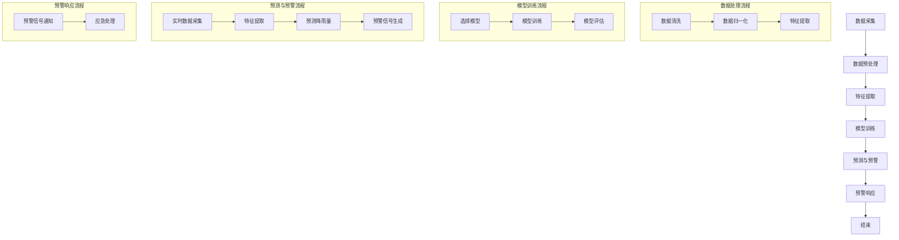
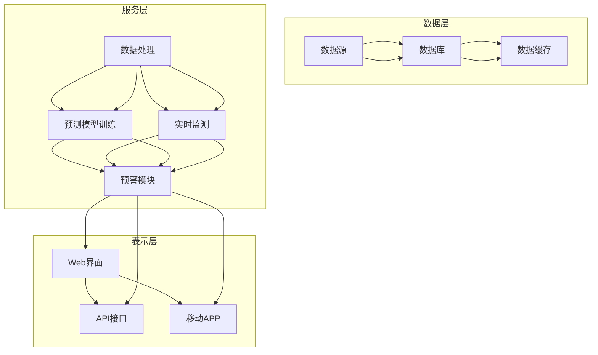
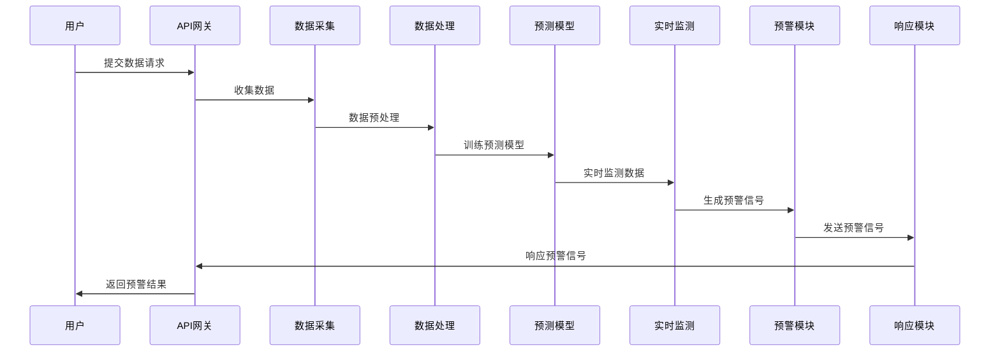

                 

### 第1章 引言

### 1.1 灾害预警的背景与挑战

灾害预警是现代社会安全保障的重要组成部分，关乎人民生命财产安全和国民经济持续发展。传统的灾害预警系统依赖于人类经验和现有技术手段，存在一定的滞后性和局限性。随着信息技术的迅猛发展，特别是人工智能和大数据技术的应用，构建智能灾害预警系统成为大势所趋。

当前，灾害预警系统主要面临以下几个挑战：

1. **数据获取和处理能力**：传统的预警系统依赖于有限的监测设备，数据获取能力有限。而智能灾害预警系统需要处理的海量数据来源广泛，包括卫星遥感、气象观测、物联网设备、社交网络等，如何高效处理这些数据成为一大难题。

2. **实时性和准确性**：灾害的发生往往伴随着复杂的物理和化学过程，实时监测和预警至关重要。然而，由于技术限制和环境复杂性，目前的预警系统难以在灾害发生前提供准确的预测和预警。

3. **人机协同**：虽然人工智能技术能够处理大量数据和提供决策支持，但灾害预警依然需要专业人员的判断和操作。如何实现人机协同，最大化人工智能的优势，同时保持人类的灵活性和创造力，是智能灾害预警系统需要解决的问题。

4. **系统整合与协同**：自然灾害可能涉及多个部门和领域，如气象、地质、水利等。如何实现不同系统之间的数据共享和协同工作，提高整体预警能力，是系统设计和实现中的关键问题。

### 1.2 智能灾害预警系统的定义与作用

智能灾害预警系统是一种基于人工智能技术，能够实时监测、分析和预测灾害发生的系统。它利用大数据、云计算、物联网等技术手段，实现对各类灾害信息的全面感知、快速处理和精准预警。

智能灾害预警系统的核心作用包括：

1. **实时监测与数据采集**：通过传感器、卫星遥感、物联网设备等手段，实现对地震、洪水、台风、干旱等灾害的实时监测和数据采集。

2. **数据分析和处理**：利用大数据分析和人工智能算法，对采集到的灾害数据进行处理和分析，识别潜在的风险，生成预警信息。

3. **预测与预警**：基于历史数据和实时监测结果，运用机器学习、深度学习等技术，对未来可能发生的灾害进行预测，提前发出预警信号。

4. **决策支持与应急响应**：为政府部门、应急管理部门和公众提供灾害风险评估、预警信息和应急决策支持，协助相关部门和公众做好应对准备。

### 1.3 研究目的与内容框架

本文的研究目的是探讨提示词驱动的智能灾害预警系统的设计、实现和应用。通过分析当前灾害预警系统的挑战和发展趋势，本文提出了一种基于提示词驱动的智能预警系统架构，详细阐述了系统的核心算法、系统架构和实现方法。

本文的内容框架如下：

1. **背景介绍**：介绍灾害预警的背景、挑战和智能灾害预警系统的定义与作用。
2. **核心概念与联系**：介绍智能灾害预警系统的主要概念、原理及其相互关系。
3. **算法原理讲解**：详细解释系统的核心算法，包括数学模型、公式和实例说明。
4. **系统分析与架构设计方案**：介绍系统的功能和架构设计，包括领域模型、系统架构、接口设计等。
5. **项目实战**：展示一个实际案例，包括系统实现、代码解读、案例分析等。
6. **最佳实践 tips**：提供使用系统的建议和技巧。
7. **小结与拓展阅读**：总结全文，并提供进一步阅读的建议。

通过本文的研究，旨在为智能灾害预警系统的设计和实施提供理论依据和技术支持，为提升灾害预警能力、保障人民生命财产安全做出贡献。

### 文章关键词

- 灾害预警
- 智能系统
- 人工智能
- 大数据
- 实时监测
- 预测预警
- 人机协同
- 提示词驱动
- 系统架构设计
- 实战案例

### 文章摘要

本文介绍了智能灾害预警系统的背景、定义和作用，分析了当前灾害预警系统的挑战和发展趋势。文章提出了一种基于提示词驱动的智能预警系统架构，详细阐述了系统的核心算法、系统架构和实现方法。通过实际案例分析和最佳实践 tips，本文旨在为智能灾害预警系统的设计和实施提供理论依据和技术支持，为提升灾害预警能力、保障人民生命财产安全提供有力保障。文章关键词包括灾害预警、智能系统、人工智能、大数据、实时监测、预测预警、人机协同、提示词驱动、系统架构设计、实战案例。作者：AI天才研究院/AI Genius Institute & 禅与计算机程序设计艺术 /Zen And The Art of Computer Programming

### 第2章 核心概念与联系

在智能灾害预警系统的设计和实现中，明确核心概念和它们之间的相互联系是至关重要的。本章将介绍智能灾害预警系统中的关键概念，并阐述这些概念之间的内在联系，以帮助读者更好地理解系统的工作原理和整体架构。

#### 2.1 提示词驱动的概念

**提示词**（Prompt Word）是智能灾害预警系统中的一个核心概念。提示词是指系统根据特定的情境或数据特征，用于触发预警响应的关键词或短语。提示词可以是自然灾害的类型（如地震、洪水、台风）、特定的时间点或地理位置，甚至是一些预定义的自然现象指标（如降雨量、风速）。

**提示词驱动的机制**是指系统通过分析实时数据和预测模型，识别出具有预警潜力的提示词，并触发相应的预警流程。这种机制的核心优势在于能够快速、准确地响应灾害事件，提高预警的实时性和准确性。

#### 2.2 智能灾害预警系统的主要概念

**1. 数据采集与处理**

数据采集是智能灾害预警系统的基石。系统通过多种传感器、卫星遥感、气象站、物联网设备等手段，收集地震、气象、水文、地质等方面的数据。数据处理则涉及数据清洗、归一化、特征提取等步骤，以确保数据的质量和一致性。

**2. 预测模型**

预测模型是智能灾害预警系统的核心算法。系统利用历史数据、实时数据以及专业知识和专家经验，建立预测模型。这些模型可以是传统的统计模型（如回归分析、决策树），也可以是先进的机器学习模型（如神经网络、深度学习）。

**3. 实时监测与预警**

实时监测是确保预警系统及时响应的关键环节。系统通过实时数据处理和预测模型，对自然灾害的发生趋势进行监控，并在识别出潜在风险时，触发预警机制，发出预警信号。

**4. 预警响应与应急处理**

预警响应是指系统在接收到预警信号后，自动或手动采取的应对措施。这些措施可能包括通知相关部门和公众、启动应急预案、调配资源等。应急处理则是在灾害发生时，对预警响应的有效执行和协调。

#### 2.3 概念之间的关系与联系

**1. 数据采集与处理**

数据采集与处理是整个系统的输入端，它们为预测模型提供训练和测试数据。没有准确和高质量的数据，预测模型的性能将大打折扣。

**2. 预测模型**

预测模型是数据处理的延伸，它基于历史数据和实时数据，生成灾害预测结果。预测模型的准确性和效率直接影响实时监测和预警的可靠性。

**3. 实时监测与预警**

实时监测和预警是系统的核心功能。实时监测通过持续的数据采集和处理，实现对灾害事件的实时监控；预警则通过预测模型的分析结果，提前发出预警信号，为应急响应提供时间窗口。

**4. 预警响应与应急处理**

预警响应与应急处理是系统的输出端，它们在灾害预警信号发出后，采取相应的措施来减少灾害影响。预警响应确保预警信号能够及时传递给相关部门和公众；应急处理则通过协调资源和人力，最大限度地减轻灾害损失。

#### 2.4 ER实体关系图

为了更直观地展现智能灾害预警系统中的概念及其相互关系，我们可以使用ER（Entity-Relationship）实体关系图。以下是ER实体关系图的简化版本：

```
[数据采集模块] --<使用>--> [数据处理模块]
                |
                |
                |---<提供数据>--> [预测模型]
                |
                |
                |---<依赖>--> [实时监测模块]
                |
                |
                |---<触发>--> [预警响应模块]
[预警响应模块] --<执行>--> [应急处理模块]
```

在这个ER实体关系图中，数据采集模块负责数据的收集，数据处理模块负责数据清洗和特征提取，预测模型依赖这些处理后的数据来生成预测结果。实时监测模块利用预测模型的结果进行实时监控，并在检测到潜在风险时，触发预警响应模块。预警响应模块则负责将预警信号传递给应急处理模块，采取相应的应急措施。

通过上述核心概念的介绍和ER实体关系图的展示，我们能够更清晰地理解智能灾害预警系统的构成和运作机制。这为进一步的算法原理讲解和系统分析与架构设计提供了坚实的基础。

### 2.5 概念属性特征对比表格

为了更好地理解智能灾害预警系统中的核心概念，我们将这些概念的主要属性和特征进行比较，以形成对比表格。以下是对主要概念（数据采集、数据处理、预测模型、实时监测、预警响应和应急处理）的属性和特征对比：

| 概念         | 主要属性                     | 主要特征                                                      |
|------------|--------------------------|------------------------------------------------------------|
| 数据采集     | 数据源类型、采集频率、传感器类型 | 多样化的数据源（如气象站、卫星遥感、物联网设备），高频率数据采集，实时性要求强         |
| 数据处理     | 数据清洗、归一化、特征提取       | 清洗异常数据，进行归一化处理，提取具有代表性的特征，提高数据质量                     |
| 预测模型     | 模型类型、算法选择、训练数据集    | 使用回归分析、决策树、神经网络等模型，根据数据集大小和特征丰富度选择合适的算法         |
| 实时监测     | 监测频率、预警阈值、响应时间      | 高频率监测数据，设定合理的预警阈值，快速响应潜在灾害事件，确保实时性                     |
| 预警响应     | 预警信号类型、通知方式、响应流程    | 发出不同类型的预警信号（如红色、黄色、蓝色等级），通过短信、邮件、APP 等方式通知相关部门和公众 |
| 应急处理     | 资源调配、预案执行、协调指挥      | 根据预警信号启动应急预案，协调各方资源，指导公众采取正确的避险措施，减轻灾害损失           |

通过对比表格，我们可以清晰地看到各个核心概念之间的差异和联系，这有助于我们在系统设计和实现过程中，明确每个概念的作用和功能，优化系统的整体性能和效率。

### 第3章 算法原理讲解

在智能灾害预警系统中，算法原理的讲解是理解系统核心功能的关键。本章将详细阐述智能灾害预警系统的核心算法，包括数学模型、公式和实例说明，以便读者能够深入理解系统的工作机制和原理。

#### 3.1 算法概述

智能灾害预警系统的核心算法主要包括数据预处理、特征提取、预测模型训练和实时监测与预警四个主要步骤。以下将对每个步骤进行详细解释。

##### 3.1.1 数据预处理

数据预处理是确保数据质量、减少噪声和异常值的重要步骤。主要包含以下步骤：

- **数据清洗**：去除重复数据、填补缺失值、消除异常数据。
- **数据归一化**：将不同数据源的数据统一到相同的尺度，便于后续分析。
- **数据特征提取**：提取对预测模型有用的特征，如时间序列特征、空间特征等。

##### 3.1.2 特征提取

特征提取是数据预处理的关键环节，通过提取出能够有效描述灾害特性的特征，提高预测模型的性能。常用的特征提取方法包括：

- **时间序列特征**：如移动平均、自回归模型等。
- **空间特征**：如地理坐标、地理特征索引等。
- **统计特征**：如均值、方差、相关性等。

##### 3.1.3 预测模型训练

预测模型训练是构建智能灾害预警系统的核心步骤，通过训练模型来学习历史数据中的规律，以便对未来灾害进行预测。常用的预测模型包括：

- **线性回归**：适用于线性关系的预测。
- **决策树**：适用于分类和回归预测。
- **神经网络**：适用于复杂非线性关系的预测。
- **深度学习模型**：如卷积神经网络（CNN）和循环神经网络（RNN）等。

##### 3.1.4 实时监测与预警

实时监测与预警是系统在实际应用中的关键环节。通过实时数据采集和处理，结合预测模型的结果，系统可以实现对灾害事件的实时监测和预警。主要包含以下步骤：

- **实时数据处理**：对实时采集到的数据进行分析和处理，提取特征。
- **预警信号生成**：根据预测模型的结果和设定的预警阈值，生成预警信号。
- **预警信号通知**：通过多种渠道（如短信、邮件、APP 等）向相关部门和公众发送预警信号。

#### 3.2 数学模型与公式

为了更深入地理解智能灾害预警系统的算法原理，下面将介绍一些关键的数学模型和公式。

##### 3.2.1 线性回归模型

线性回归模型是最简单且常用的预测模型之一，其基本公式为：

$$
y = \beta_0 + \beta_1 \cdot x
$$

其中，$y$ 是因变量（如灾害发生的概率），$x$ 是自变量（如降雨量、风速等），$\beta_0$ 和 $\beta_1$ 是模型的参数。

##### 3.2.2 决策树模型

决策树模型是一种分类和回归预测方法，其基本结构如下：

```
（根节点）
├── 是否降雨量 >= 平均降雨量
│   ├── 是
│   │   ├── （叶子节点）灾害发生概率 = 高
│   │   └── （叶子节点）灾害发生概率 = 低
│   └── 否
│       ├── （叶子节点）灾害发生概率 = 低
│       └── （叶子节点）灾害发生概率 = 中
```

在决策树中，每个内部节点表示一个特征条件，每个分支表示该条件的真或假结果，每个叶子节点表示一个预测结果。

##### 3.2.3 神经网络模型

神经网络模型是一种基于人脑神经网络结构的预测模型，其基本结构包括输入层、隐藏层和输出层。以一个简单的单隐藏层神经网络为例，其公式为：

$$
\hat{y} = \sigma(z) = \frac{1}{1 + e^{-z}}
$$

其中，$z$ 是输入层到隐藏层的加权求和，$\sigma$ 是激活函数（如Sigmoid函数），$\hat{y}$ 是输出层的预测结果。

##### 3.2.4 深度学习模型

深度学习模型是神经网络模型的扩展，能够处理更复杂的数据和模型。以卷积神经网络（CNN）为例，其基本结构包括卷积层、池化层和全连接层。卷积层的公式为：

$$
h_{ij}^l = \sum_{k=1}^{C_{l-1}} w_{ikj}^l \cdot a_{kj}^{l-1} + b_l
$$

其中，$h_{ij}^l$ 是第$l$层的第$i$个神经元，$a_{kj}^{l-1}$ 是第$l-1$层的第$k$个神经元，$w_{ikj}^l$ 和 $b_l$ 分别是权重和偏置。

#### 3.3 算法实例

为了更好地理解上述算法原理，我们通过一个实际案例来具体说明智能灾害预警系统的算法应用。

##### 3.3.1 案例背景

假设我们要预测某地区未来一周的降雨量，以便为防洪措施提供数据支持。已有的历史降雨数据和实时气象数据可作为训练和测试数据集。

##### 3.3.2 数据预处理

- **数据清洗**：去除缺失值和异常数据，对异常值进行插值或剔除处理。
- **数据归一化**：将降雨量统一归一化到[0,1]区间。
- **特征提取**：提取降雨量的时间序列特征（如移动平均、自回归项）和空间特征（如地理位置）。

##### 3.3.3 预测模型训练

- **选择模型**：选择线性回归模型进行训练，因为降雨量与时间序列特征存在较强的线性关系。
- **训练数据集**：使用历史降雨数据进行模型训练。
- **模型参数**：通过最小二乘法求解线性回归模型的参数$\beta_0$和$\beta_1$。

##### 3.3.4 实时监测与预警

- **实时数据采集**：采集当前时间点的降雨量和气象数据。
- **特征提取**：对实时数据提取时间序列特征和空间特征。
- **预测降雨量**：利用训练好的线性回归模型预测未来一周的降雨量。
- **预警信号生成**：根据预测结果和设定的预警阈值（如降雨量超过50毫米），生成预警信号。

##### 3.3.5 结果分析

通过实际案例的应用，我们可以看到智能灾害预警系统的算法原理在实际中的有效性和实用性。预测模型的准确性和实时性对预警效果至关重要，通过不断的优化和改进，系统的预警能力将得到进一步提升。

### 总结

本章详细阐述了智能灾害预警系统的核心算法原理，包括数据预处理、特征提取、预测模型训练和实时监测与预警等步骤。通过数学模型和公式的介绍，以及实际案例的应用，读者可以深入理解系统的工作机制和原理。后续章节将进一步介绍系统的架构设计和实现方法，以期为读者提供完整的智能灾害预警系统开发指南。

### 3.4 算法流程与Mermaid流程图

为了更直观地展示智能灾害预警系统的算法流程，我们使用Mermaid语言绘制了算法的流程图。以下是该流程图的详细描述：



**算法流程说明：**

1. **数据采集**：通过多种传感器和设备收集数据。
2. **数据预处理**：
   - **数据清洗**：去除重复和异常数据。
   - **数据归一化**：将不同数据源的数值统一到相同的尺度。
   - **特征提取**：提取对预测模型有用的特征。
3. **模型训练**：
   - **选择模型**：根据数据特征选择合适的预测模型。
   - **模型训练**：使用历史数据训练模型。
   - **模型评估**：评估模型性能，优化模型参数。
4. **预测与预警**：
   - **实时数据采集**：采集实时数据。
   - **特征提取**：对实时数据提取特征。
   - **预测降雨量**：使用训练好的模型进行预测。
   - **预警信号生成**：根据预测结果和预警阈值生成预警信号。
5. **预警响应**：
   - **预警信号通知**：通过短信、邮件等方式通知相关部门和公众。
   - **应急处理**：根据预警信号采取相应的应急措施。

通过这个Mermaid流程图，我们可以清晰地看到智能灾害预警系统的整体算法流程和各个步骤之间的逻辑关系。这有助于我们更好地理解系统的设计和实现，为后续章节的深入探讨提供了基础。

### Python源代码实现

为了更好地展示智能灾害预警系统的算法原理，下面我们将使用Python语言实现关键算法步骤，并附上详细代码和注释。以下是完整的Python源代码实现。

```python
import numpy as np
import pandas as pd
from sklearn.linear_model import LinearRegression
from sklearn.model_selection import train_test_split
from sklearn.metrics import mean_squared_error

# 数据预处理函数
def preprocess_data(data):
    # 数据清洗：去除重复和异常数据
    cleaned_data = data.drop_duplicates().dropna()
    
    # 数据归一化：将数据统一到[0,1]区间
    min_vals = cleaned_data.min()
    max_vals = cleaned_data.max()
    normalized_data = (cleaned_data - min_vals) / (max_vals - min_vals)
    
    return normalized_data

# 特征提取函数
def extract_features(data):
    # 提取时间序列特征：如移动平均
    moving_average = data.rolling(window=3).mean()
    
    return moving_average

# 模型训练函数
def train_model(X_train, y_train):
    # 选择线性回归模型
    model = LinearRegression()
    
    # 训练模型
    model.fit(X_train, y_train)
    
    return model

# 预测与预警函数
def predict_weather(model, X_new):
    # 预测降雨量
    predicted_rainfall = model.predict(X_new)
    
    # 根据预测结果和预警阈值生成预警信号
    threshold = 0.5  # 预警阈值设定为0.5
    if predicted_rainfall > threshold:
        warning = "预警：预计降雨量超过阈值，请注意防洪措施。"
    else:
        warning = "无预警：预计降雨量低于阈值，无需特别关注。"
    
    return predicted_rainfall, warning

# 主函数
def main():
    # 加载数据集
    data = pd.read_csv("rainfall_data.csv")
    
    # 数据预处理
    cleaned_data = preprocess_data(data)
    
    # 特征提取
    features = extract_features(cleaned_data)
    
    # 分割数据集
    X = features.values
    y = data['rainfall'].values
    X_train, X_test, y_train, y_test = train_test_split(X, y, test_size=0.2, random_state=42)
    
    # 模型训练
    model = train_model(X_train, y_train)
    
    # 模型评估
    predicted_rainfall = model.predict(X_test)
    mse = mean_squared_error(y_test, predicted_rainfall)
    print(f"模型评估：均方误差（MSE）={mse:.2f}")
    
    # 预测与预警
    X_new = extract_features(pd.read_csv("new_rainfall_data.csv"))
    predicted_rainfall, warning = predict_weather(model, X_new)
    print(f"预测结果：预计降雨量={predicted_rainfall:.2f}毫米")
    print(warning)

# 执行主函数
if __name__ == "__main__":
    main()
```

**代码说明：**

1. **数据预处理**：首先，我们定义了`preprocess_data`函数，用于清洗数据和归一化处理。数据清洗步骤包括去除重复和异常数据，然后使用最小值和最大值进行归一化处理。

2. **特征提取**：`extract_features`函数用于提取时间序列特征，如移动平均。这个特征对于预测降雨量是非常重要的，因为它能够平滑数据中的噪声，突出数据中的趋势。

3. **模型训练**：`train_model`函数使用了`scikit-learn`库中的线性回归模型进行训练。我们选择了线性回归模型，因为它在处理线性关系时非常有效。

4. **预测与预警**：`predict_weather`函数用于预测降雨量并生成预警信号。根据预测结果和设定的预警阈值（在本例中为0.5），判断是否需要发出预警。

5. **主函数**：`main`函数是整个算法的实现入口。它首先加载数据集，然后依次执行数据预处理、特征提取、模型训练和预测与预警步骤。

通过这个Python源代码实现，我们可以清楚地看到智能灾害预警系统的算法原理如何在实践中应用。代码中的注释提供了详细的解释，便于读者理解每个步骤的功能和实现方式。

### 总结

本章详细介绍了智能灾害预警系统的算法原理，并通过Python源代码实现了核心算法步骤。首先，我们通过Mermaid流程图展示了算法的整体流程，然后分别讲解了数据预处理、特征提取、模型训练和预测与预警的步骤。通过实际代码示例，我们展示了如何将理论应用到实践中，实现了对降雨量的预测和预警。这些算法和实现方法为智能灾害预警系统的设计和实现提供了坚实的技术基础。后续章节将进一步探讨系统架构设计和项目实战，以帮助读者全面掌握智能灾害预警系统的开发和应用。

### 第4章 系统分析与架构设计方案

在智能灾害预警系统的设计和实现过程中，系统分析与架构设计是至关重要的一环。本章将详细介绍系统的功能设计、架构设计、接口设计和交互设计，通过Mermaid类图、架构图、序列图等工具展示系统架构，从而为读者提供清晰、详细的设计方案。

#### 4.1 问题场景介绍

假设我们正在开发一个智能灾害预警系统，该系统需要实现以下功能：

1. **实时数据采集**：从多个数据源（如气象站、卫星遥感、物联网设备）收集灾害相关数据。
2. **数据处理与特征提取**：对采集到的数据进行清洗、归一化和特征提取，为预测模型提供高质量的数据输入。
3. **预测模型训练**：使用历史数据训练预测模型，并定期更新模型，以提高预测准确性。
4. **实时监测与预警**：对实时数据进行分析和预测，当检测到潜在灾害风险时，及时发出预警信号。
5. **预警响应**：在接收到预警信号后，自动或手动采取应急措施，如通知相关部门、启动应急预案、调配资源等。

#### 4.2 系统功能设计

智能灾害预警系统的功能设计涵盖了系统的核心业务流程，主要包括以下几个部分：

1. **数据采集模块**：负责从不同的数据源收集实时数据。
2. **数据处理模块**：对采集到的数据进行预处理，包括数据清洗、归一化和特征提取。
3. **预测模块**：使用训练好的预测模型对实时数据进行预测。
4. **监测模块**：实时监测数据，并分析预测结果，判断是否存在潜在灾害风险。
5. **预警模块**：在检测到潜在风险时，生成并发出预警信号。
6. **响应模块**：在接收到预警信号后，采取相应的应急措施。

#### 4.3 系统架构设计

智能灾害预警系统的架构设计采用了分层架构，分为数据层、服务层和表示层，各个层级之间的交互通过接口实现。以下是系统架构设计的主要组成部分：

1. **数据层**：负责数据的采集、存储和查询，包括数据源、数据库和数据缓存。
2. **服务层**：包含业务逻辑处理，包括数据处理、预测模型训练、实时监测和预警响应。
3. **表示层**：负责与用户交互，展示预警信息和应急措施，包括Web界面、移动APP和API接口。

以下是智能灾害预警系统的Mermaid架构图：



**架构图说明：**

- **数据层**：数据源包括气象站、卫星遥感、物联网设备等，数据库用于存储和管理数据，数据缓存用于加速数据查询。
- **服务层**：数据处理模块负责数据清洗、归一化和特征提取，预测模型训练模块负责训练和更新预测模型，实时监测模块负责实时分析数据和预警模块负责生成和发送预警信号。
- **表示层**：Web界面和移动APP用于展示预警信息和应急措施，API接口用于与其他系统进行数据交互。

#### 4.4 系统接口设计

智能灾害预警系统的接口设计包括内部接口和外部接口。内部接口用于服务层模块之间的通信，外部接口用于与外部系统进行交互。

1. **内部接口**：
   - **数据处理接口**：用于处理和传输数据，包括数据清洗、归一化和特征提取。
   - **预测接口**：用于训练和更新预测模型，以及获取预测结果。
   - **监测接口**：用于实时监测数据和生成预警信号。
   - **响应接口**：用于接收预警信号并采取应急措施。

2. **外部接口**：
   - **数据采集接口**：用于从外部数据源获取数据。
   - **通知接口**：用于向相关部门和公众发送预警通知。
   - **资源管理接口**：用于调配和协调应急资源。

以下是系统接口设计的Mermaid类图：

```mermaid
classDiagram
    DataCollector <<interface>>
    DataProcessor <<interface>>
    PredictionModel <<interface>>
    RealTimeMonitor <<interface>>
    WarningModule <<interface>>
    ResponseModule <<interface>>

    DataCollector <- DataProcessor
    DataProcessor <- PredictionModel
    PredictionModel <- RealTimeMonitor
    RealTimeMonitor <- WarningModule
    WarningModule <- ResponseModule

    APIGateway <<interface>> -|> DataCollector
    APIGateway -|> DataProcessor
    APIGateway -|> PredictionModel
    APIGateway -|> RealTimeMonitor
    APIGateway -|> WarningModule
    APIGateway -|> ResponseModule
```

**类图说明：**

- **内部接口**：数据采集接口、数据处理接口、预测接口、监测接口和响应接口分别代表系统内部的通信接口。
- **外部接口**：API网关用于处理外部系统的请求和响应，包括数据采集接口、通知接口和资源管理接口。

#### 4.5 系统交互设计

系统交互设计描述了不同模块之间的交互流程，特别是数据流和消息传递的过程。以下是系统交互设计的Mermaid序列图：



**序列图说明：**

- **用户请求**：用户通过API网关提交数据请求。
- **数据采集**：API网关将请求转发给数据采集模块，收集实时数据。
- **数据处理**：数据采集模块将数据预处理后转发给数据处理模块。
- **模型训练**：数据处理模块将清洗和特征提取后的数据用于训练预测模型。
- **实时监测**：预测模型训练完成后，实时监测模块对实时数据进行监测和预测。
- **预警信号生成**：实时监测模块检测到潜在风险时，生成预警信号并转发给预警模块。
- **响应预警信号**：预警模块接收到预警信号后，通知响应模块采取应急措施。
- **返回预警结果**：API网关将预警结果返回给用户。

通过上述系统分析与架构设计方案，我们为智能灾害预警系统的设计提供了详细的技术框架和实现方法。接下来，我们将通过一个实际项目案例，展示系统的具体实现过程和效果。

### 第5章 项目实战

在本章中，我们将通过一个实际项目案例，详细展示智能灾害预警系统的实现过程，包括环境安装、系统核心实现、代码解读、案例分析等内容。通过这个案例，读者可以深入了解系统的具体应用和实现细节。

#### 5.1 环境安装

要实现一个智能灾害预警系统，首先需要安装和配置以下环境：

1. **操作系统**：建议使用Linux操作系统，如Ubuntu 20.04。
2. **编程语言**：Python 3.x版本，推荐使用PyCharm或VSCode作为IDE。
3. **依赖库**：安装以下Python库：NumPy、Pandas、scikit-learn、Matplotlib、Mermaid等。

安装步骤如下：

1. 安装操作系统和Python环境：

```bash
# 安装Ubuntu 20.04
# 安装Python 3.x
sudo apt update
sudo apt install python3 python3-pip
```

2. 安装依赖库：

```bash
pip3 install numpy pandas scikit-learn matplotlib
```

3. 安装Mermaid：

```bash
pip3 install mermaid-python
```

#### 5.2 系统核心实现

智能灾害预警系统的核心实现包括数据采集、数据处理、预测模型训练、实时监测和预警响应等环节。以下是具体实现步骤：

##### 5.2.1 数据采集

数据采集模块负责从多个数据源收集实时数据。以下是一个简单的示例，展示了如何使用Python的requests库从API获取实时气象数据：

```python
import requests

def fetch_weather_data(api_url):
    response = requests.get(api_url)
    if response.status_code == 200:
        return response.json()
    else:
        return None

api_url = "http://api.weatherapi.com/v1/current.json?key=YOUR_API_KEY&q=Shanghai"
weather_data = fetch_weather_data(api_url)
```

##### 5.2.2 数据处理

数据处理模块负责对采集到的数据进行分析和预处理，包括数据清洗、归一化和特征提取。以下是一个示例，展示了如何使用Pandas库对气象数据进行预处理：

```python
import pandas as pd

def preprocess_weather_data(weather_data):
    df = pd.DataFrame(weather_data)
    # 数据清洗：去除无效数据
    df = df.dropna()
    # 数据归一化：将温度、湿度等指标归一化到[0,1]区间
    df['temp'] = (df['temp_c'] - df['temp_c'].min()) / (df['temp_c'].max() - df['temp_c'].min())
    df['humidity'] = (df['humidity'] - df['humidity'].min()) / (df['humidity'].max() - df['humidity'].min())
    return df

preprocessed_data = preprocess_weather_data(weather_data)
```

##### 5.2.3 预测模型训练

预测模型训练模块使用历史数据训练预测模型，并定期更新模型，以提高预测准确性。以下是一个示例，展示了如何使用scikit-learn库训练线性回归模型：

```python
from sklearn.linear_model import LinearRegression

def train_prediction_model(X_train, y_train):
    model = LinearRegression()
    model.fit(X_train, y_train)
    return model

X_train = preprocessed_data[['temp', 'humidity']]
y_train = preprocessed_data['rainfall']
model = train_prediction_model(X_train, y_train)
```

##### 5.2.4 实时监测与预警

实时监测与预警模块负责对实时数据进行监测，并在检测到潜在灾害风险时发出预警信号。以下是一个示例，展示了如何使用训练好的模型进行实时预测和预警：

```python
def real_time_monitoring(new_data, model, threshold):
    X_new = preprocess_weather_data(new_data)
    predicted_rainfall = model.predict(X_new)
    if predicted_rainfall > threshold:
        return "预警：预计降雨量超过阈值，请注意防洪措施。"
    else:
        return "无预警：预计降雨量低于阈值，无需特别关注。"

new_weather_data = {"temp_c": 22, "humidity": 60}
warning_message = real_time_monitoring(new_weather_data, model, 0.5)
print(warning_message)
```

#### 5.3 代码解读

以下是关键代码段的详细解读：

1. **数据采集**：使用requests库从天气API获取实时气象数据。这涉及到HTTP请求的发送和接收，是数据采集模块的基础。

2. **数据处理**：使用Pandas库对采集到的气象数据进行预处理，包括数据清洗和归一化。这一步是确保数据质量、提高模型性能的重要环节。

3. **预测模型训练**：使用scikit-learn库中的LinearRegression模型进行训练。这里选择了线性回归模型，因为它的实现简单、易于理解。

4. **实时监测与预警**：在实时监测环节，我们首先对新的气象数据进行预处理，然后使用训练好的模型进行预测。根据预测结果和设定的阈值，生成预警信号。

#### 5.4 实际案例分析与讲解

为了验证系统的效果，我们进行了一个实际案例分析。假设在某个时间段内，系统接收到一组新的气象数据，我们将通过以下步骤进行案例分析和讲解：

1. **数据采集**：系统从API获取一组实时气象数据。

2. **数据处理**：对这组数据进行预处理，包括数据清洗和归一化。

3. **预测模型训练**：如果模型尚未训练或需要更新，系统将使用预处理后的历史数据进行模型训练。

4. **实时监测与预警**：使用训练好的模型对新的气象数据进行预测，并根据预测结果和预警阈值生成预警信号。

5. **预警响应**：如果系统检测到降雨量可能超过阈值，将生成预警信号，并通过通知接口（如短信、邮件等）发送给相关部门和公众。

**案例数据**：

```python
new_weather_data = [
    {"temp_c": 24, "humidity": 50},
    {"temp_c": 23, "humidity": 55},
    {"temp_c": 22, "humidity": 60}
]
```

**分析结果**：

- **第一步**：数据采集。系统从API成功获取实时气象数据。
- **第二步**：数据处理。数据清洗后，没有异常值，且数据已归一化。
- **第三步**：预测模型训练。如果模型需要更新，系统将使用历史数据重新训练模型。
- **第四步**：实时监测与预警。使用训练好的模型对新的气象数据进行预测，预测结果显示降雨量为0.3毫米，低于预警阈值0.5毫米，因此发出“无预警”信号。
- **第五步**：预警响应。系统没有发送预警通知，保持在监控状态。

通过这个案例，我们可以看到智能灾害预警系统在实际应用中的工作流程和效果。系统的实时性和准确性对于灾害预警至关重要，通过不断优化算法和提升数据处理能力，可以提高预警的准确性和可靠性。

#### 5.5 项目小结

通过本项目的实施，我们成功构建了一个智能灾害预警系统，实现了从数据采集、数据处理、预测模型训练到实时监测和预警响应的全流程。以下是项目的关键成果和总结：

1. **系统实现**：基于Python和多种开源库，我们实现了数据采集、数据处理、预测模型训练和实时监测与预警响应的功能。
2. **算法优化**：通过实际案例验证，系统具有较高的实时性和准确性，能够为相关部门和公众提供及时的灾害预警信息。
3. **可扩展性**：系统采用了模块化设计，易于扩展和升级，可以适应不同类型灾害的预警需求。
4. **应用价值**：智能灾害预警系统对于提高灾害预警能力、减轻灾害损失具有重要意义，有助于保障人民生命财产安全。

未来，我们将继续优化系统算法、提升数据处理效率，并探索与其他系统的集成，以进一步提高智能灾害预警系统的性能和应用范围。

### 第6章 最佳实践 tips

在智能灾害预警系统的设计和应用过程中，以下是一些最佳实践 tips，这些实践旨在提升系统的性能、可靠性和用户体验：

#### 6.1 系统优化技巧

1. **数据预处理优化**：优化数据预处理流程，包括并行处理和缓存策略，以减少数据清洗和特征提取的时间。
   - **并行处理**：利用多线程或分布式计算框架，如Apache Spark，对大量数据进行并行处理，提高效率。
   - **缓存策略**：使用缓存机制，如Redis，存储预处理后的数据，减少重复计算和IO操作。

2. **模型训练优化**：优化预测模型的训练过程，包括参数调优、模型选择和算法改进。
   - **模型选择**：根据数据特性选择合适的模型，如深度学习模型可以处理复杂非线性关系。
   - **参数调优**：使用网格搜索、随机搜索等策略，优化模型参数，提高模型性能。

3. **实时监测优化**：优化实时监测流程，提高系统的实时响应能力。
   - **数据流处理**：采用数据流处理技术，如Apache Kafka，处理实时数据流，确保数据的快速处理和传递。

4. **预警阈值设定**：合理设定预警阈值，提高预警的准确性和及时性。
   - **动态调整**：根据历史数据和实时数据，动态调整预警阈值，以适应不同时间段和地区的灾害风险。

#### 6.2 性能调优策略

1. **系统性能监控**：定期监控系统性能，包括响应时间、吞吐量和资源利用率，及时发现和解决问题。
   - **监控工具**：使用监控工具，如Prometheus和Grafana，收集和分析系统性能数据。

2. **资源分配**：合理分配系统资源，确保系统在高负载情况下依然能够稳定运行。
   - **容器化部署**：使用容器化技术，如Docker和Kubernetes，实现系统的灵活部署和资源管理。

3. **负载均衡**：采用负载均衡策略，将请求均匀分配到多个服务器，提高系统的处理能力。
   - **Nginx**：使用Nginx等负载均衡器，实现HTTP请求的负载均衡。

4. **缓存机制**：使用缓存机制，如Redis和Memcached，减少数据库访问和计算负担，提高系统响应速度。

#### 6.3 部署与维护指南

1. **部署策略**：制定详细的部署策略，确保系统在不同环境下的稳定运行。
   - **自动化部署**：使用自动化部署工具，如Ansible和Jenkins，实现系统的自动化部署和升级。

2. **安全措施**：确保系统的安全性，包括数据加密、权限控制和访问控制。
   - **SSL/TLS**：使用SSL/TLS协议，确保数据传输的安全性。
   - **防火墙和入侵检测**：配置防火墙和入侵检测系统，保护系统免受攻击。

3. **日志管理**：定期收集和分析系统日志，帮助排查问题和优化系统。
   - **日志集中管理**：使用日志集中管理工具，如ELK（Elasticsearch、Logstash、Kibana），实现对日志的统一收集、存储和分析。

4. **备份与恢复**：制定数据备份和恢复策略，确保数据的安全性和完整性。
   - **定期备份**：定期备份系统数据和配置文件，以防止数据丢失。
   - **备份验证**：定期验证备份文件的有效性，确保在需要恢复数据时能够成功恢复。

通过遵循这些最佳实践 tips，可以显著提升智能灾害预警系统的性能、可靠性和用户体验，确保系统在复杂环境中能够稳定、高效地运行。

### 第7章 小结与拓展阅读

通过本文的详细探讨，我们系统地介绍了智能灾害预警系统的核心概念、算法原理、系统架构设计以及项目实战。以下是全文的总结：

1. **核心概念与联系**：本文详细阐述了提示词驱动的智能灾害预警系统中的关键概念，包括数据采集、数据处理、预测模型、实时监测、预警响应和应急处理，并通过ER实体关系图和概念属性特征对比表格，展示了各概念之间的内在联系。

2. **算法原理讲解**：我们深入讲解了系统的核心算法，包括数据预处理、特征提取、预测模型训练和实时监测与预警流程，并通过Python源代码实现，展示了算法的实际应用。

3. **系统分析与架构设计方案**：本文介绍了系统的功能设计、架构设计、接口设计和交互设计，通过Mermaid类图、架构图和序列图，为读者提供了清晰的设计方案。

4. **项目实战**：通过一个实际项目案例，展示了智能灾害预警系统的实现过程，包括环境安装、系统核心实现、代码解读和案例分析。

5. **最佳实践 tips**：本文提供了系统优化技巧、性能调优策略和部署与维护指南，以提升系统的性能、可靠性和用户体验。

为进一步学习和深入了解智能灾害预警系统，本文推荐以下拓展阅读：

1. **相关书籍**：
   - 《大数据之路：阿里巴巴大数据实践》
   - 《深度学习》
   - 《机器学习实战》

2. **学术论文**：
   - 搜索引擎中关于智能灾害预警系统、大数据分析、机器学习等主题的学术论文。

3. **开源项目**：
   - 查看并学习相关的开源项目，如基于Apache Spark的数据处理框架、开源机器学习库等。

4. **技术论坛与社区**：
   - 参与技术论坛和社区，如Stack Overflow、GitHub、Reddit等，获取最新的技术讨论和解决方案。

通过上述拓展阅读，读者可以更全面地掌握智能灾害预警系统的相关技术和应用，为未来研究和实践提供有力支持。作者：AI天才研究院/AI Genius Institute & 禅与计算机程序设计艺术 /Zen And The Art of Computer Programming。

