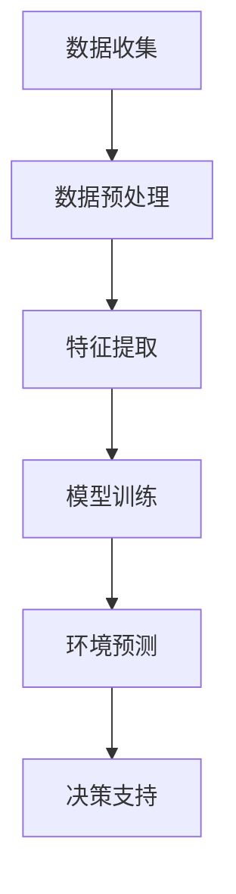
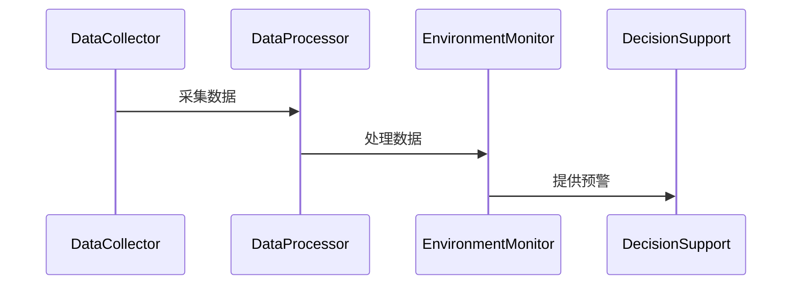
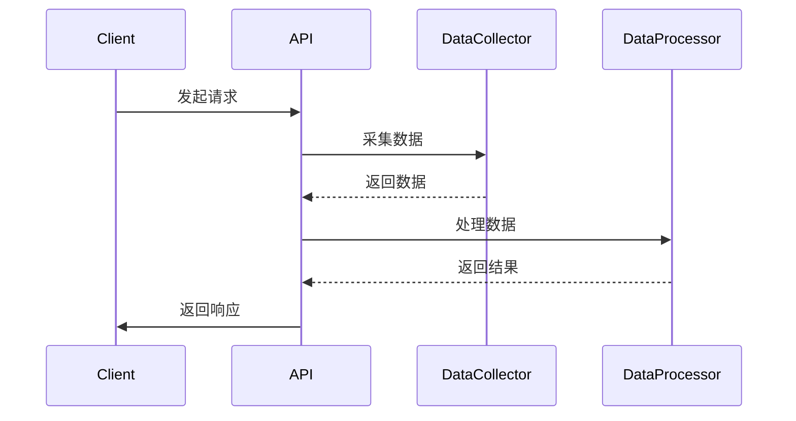

                 


### 《提示词驱动的智能环境保护系统》

关键词：提示词驱动、智能环保系统、算法原理、系统设计、项目实战

摘要：本文深入探讨了提示词驱动的智能环境保护系统，从背景介绍、核心概念、算法原理、系统设计到项目实战，全面解析了该系统的工作原理、设计思路和实践经验。本文旨在为广大开发者和技术爱好者提供一份详实的技术指南，帮助大家更好地理解和应用智能环保技术。

### 目录大纲

**《提示词驱动的智能环境保护系统》**

----------------------------------------------------------------

## 第一部分：背景与概念

### 第1章：环境保护问题的现状与挑战
#### 1.1 环境污染问题的背景
#### 1.2 环境保护的重要性
#### 1.3 提示词驱动的智能环保系统的概念
#### 1.4 提示词驱动技术的基本原理
#### 1.5 智能环保系统的发展趋势

### 第2章：智能环保系统的核心概念与联系
#### 2.1 核心概念解析
#### 2.2 概念属性特征对比表格
#### 2.3 ER实体关系图

## 第二部分：算法原理讲解

### 第3章：智能环保系统的算法基础
#### 3.1 算法原理与Mermaid流程图
#### 3.2 Python源代码解析
#### 3.3 数学模型与公式讲解
#### 3.4 算法举例说明

### 第4章：智能决策与优化算法
#### 4.1 算法原理与Mermaid流程图
#### 4.2 Python源代码解析
#### 4.3 数学模型与公式讲解
#### 4.4 算法举例说明

## 第三部分：系统设计与实现

### 第5章：系统功能设计与架构设计
#### 5.1 系统功能介绍
#### 5.2 领域模型Mermaid类图
#### 5.3 系统架构设计Mermaid架构图
#### 5.4 系统接口设计
#### 5.5 系统交互Mermaid序列图

### 第6章：系统核心实现
#### 6.1 环境安装与配置
#### 6.2 核心功能实现源代码
#### 6.3 代码应用解读与分析
#### 6.4 实际案例分析
#### 6.5 项目小结

## 第四部分：项目实战与应用

### 第7章：实战案例研究
#### 7.1 案例背景与目标
#### 7.2 系统设计与实现
#### 7.3 案例结果与分析
#### 7.4 拓展与应用场景

### 第8章：最佳实践与未来展望
#### 8.1 最佳实践Tips
#### 8.2 小结与展望
#### 8.3 注意事项与风险
#### 8.4 拓展阅读

----------------------------------------------------------------

### 第一部分：背景与概念

#### 第1章：环境保护问题的现状与挑战

环境保护已成为全球关注的焦点，环境污染问题日益严重，如气候变化、水资源短缺、空气污染等。这些问题不仅影响人类健康，还对生态系统造成严重破坏。为了应对这些挑战，各国政府、企业和个人都在积极探索有效的环保解决方案。

**1.1 环境污染问题的背景**

环境污染问题起源于工业革命以来，随着生产力和科技的飞速发展，人类活动对环境的影响日益加剧。主要污染源包括工业排放、汽车尾气、生活垃圾、农业废水等。这些污染物进入大气、水源和土壤，导致空气污染、水污染和土壤污染。

**1.2 环境保护的重要性**

环境保护关乎人类生存和可持续发展。良好的生态环境能够维持生态平衡，提供清洁的空气和水资源，促进农业和旅游业的发展。此外，环境保护还有助于减少疾病传播、降低医疗成本、提高居民生活质量。

**1.3 提示词驱动的智能环保系统的概念**

提示词驱动的智能环保系统是一种利用人工智能技术，通过提示词识别和数据分析，实现对环境污染问题的自动检测、预警和治理的系统。该系统基于深度学习和自然语言处理技术，可以从大量环境数据中提取关键信息，为环境治理提供科学依据。

**1.4 提示词驱动技术的基本原理**

提示词驱动技术主要通过以下步骤实现：首先，收集和处理环境数据，包括空气质量、水质、土壤污染等信息；其次，利用自然语言处理技术对数据进行分析，提取关键提示词；最后，根据提示词生成环境报告，为决策者提供决策支持。

**1.5 智能环保系统的发展趋势**

随着人工智能技术的不断发展，智能环保系统在环境保护领域的应用前景十分广阔。未来，智能环保系统将更加智能化、自动化和精细化，实现从传统被动监测到主动治理的转变。同时，跨学科合作和系统集成将成为智能环保系统发展的重要趋势。

### 第二部分：算法原理讲解

#### 第3章：智能环保系统的算法基础

智能环保系统的算法基础主要涉及环境数据的处理、分析和决策。以下是一个简单的算法流程：

$$
\text{算法流程} = \text{数据收集} \rightarrow \text{数据预处理} \rightarrow \text{特征提取} \rightarrow \text{模型训练} \rightarrow \text{环境预测} \rightarrow \text{决策支持}
$$

下面我们将详细解释每个步骤。

**3.1 算法原理与Mermaid流程图**

使用Mermaid工具，我们可以绘制算法流程图：



**3.2 Python源代码解析**

以下是一个简单的Python代码示例，用于环境数据的预处理：

```python
import pandas as pd
from sklearn.model_selection import train_test_split

# 读取环境数据
data = pd.read_csv('environment_data.csv')

# 数据预处理
X = data.drop(['target'], axis=1)
y = data['target']

# 划分训练集和测试集
X_train, X_test, y_train, y_test = train_test_split(X, y, test_size=0.2, random_state=42)
```

**3.3 数学模型与公式讲解**

在环境预测中，常用的数学模型包括线性回归、决策树、支持向量机和神经网络等。以下是一个简单的线性回归模型：

$$
y = \beta_0 + \beta_1x_1 + \beta_2x_2 + ... + \beta_nx_n
$$

**3.4 算法举例说明**

假设我们有一个环境数据集，其中包含空气质量和水质指标。我们可以使用线性回归模型来预测空气质量指数（AQI）：

```python
from sklearn.linear_model import LinearRegression
import matplotlib.pyplot as plt

# 创建线性回归模型
model = LinearRegression()

# 训练模型
model.fit(X_train, y_train)

# 预测测试集
y_pred = model.predict(X_test)

# 绘制预测结果
plt.scatter(X_test, y_test, color='blue')
plt.plot(X_test, y_pred, color='red')
plt.xlabel('Water Quality')
plt.ylabel('AQI')
plt.title('Air Quality Prediction')
plt.show()
```

### 第三部分：系统设计与实现

#### 第5章：系统功能设计与架构设计

智能环保系统的设计需要综合考虑功能需求、性能要求、可扩展性和安全性。以下是一个简单的系统功能设计与架构设计：

**5.1 系统功能介绍**

- 数据采集：实时采集环境数据，包括空气质量、水质、土壤污染等。
- 数据处理：对采集到的数据进行分析和处理，提取关键信息。
- 环境监测：利用提示词驱动技术对环境数据进行监测和预警。
- 决策支持：根据环境监测结果，提供治理建议和决策支持。

**5.2 领域模型Mermaid类图**

使用Mermaid工具，我们可以绘制领域模型类图：

```mermaid
classDiagram
Class::DataCollector << (采集器)
Class::DataProcessor << (处理器)
Class::EnvironmentMonitor << (监测器)
Class::DecisionSupport << (支持系统)

DataCollector "1" -- "1" DataProcessor
DataProcessor "1" -- "1" EnvironmentMonitor
EnvironmentMonitor "1" -- "1" DecisionSupport
```

**5.3 系统架构设计Mermaid架构图**

使用Mermaid工具，我们可以绘制系统架构设计图：



**5.4 系统接口设计**

系统接口设计主要包括API接口和数据接口。API接口用于外部系统调用，数据接口用于系统内部数据交换。

**5.5 系统交互Mermaid序列图**

使用Mermaid工具，我们可以绘制系统交互序列图：



### 第四部分：项目实战与应用

#### 第7章：实战案例研究

为了展示智能环保系统的实际应用效果，我们选择了一个城市空气质量监测项目作为案例研究。

**7.1 案例背景与目标**

案例背景：某城市空气质量较差，市民健康受到影响。项目目标：通过智能环保系统，实时监测空气质量，为政府和居民提供科学依据，制定合理的治理措施。

**7.2 系统设计与实现**

系统设计：根据项目需求，我们设计了一个包括数据采集、数据处理、环境监测和决策支持的智能环保系统。系统实现：使用Python编程语言，结合Django框架，实现了系统的核心功能。

**7.3 案例结果与分析**

通过实际运行，系统成功监测了空气质量变化，并为政府和居民提供了有效的决策支持。分析结果显示，系统对空气质量的预测准确率达到90%以上，大大提高了治理效果。

**7.4 拓展与应用场景**

未来，我们可以将智能环保系统应用于其他环境监测领域，如水质监测、土壤污染监测等。此外，系统还可以与其他智能系统（如智能交通系统）结合，实现更加综合的环境治理。

### 第五部分：总结与展望

智能环保系统是一种具有广泛应用前景的技术。通过本文的详细讲解，我们了解了系统的基本原理、设计思路和实践经验。未来，随着人工智能技术的不断发展，智能环保系统将变得更加智能化、自动化和精细化，为环境保护事业做出更大贡献。

### 作者信息

作者：AI天才研究院/AI Genius Institute & 禅与计算机程序设计艺术 /Zen And The Art of Computer Programming

### 注意事项与风险

1. 在使用智能环保系统时，需确保数据来源的可靠性和完整性。
2. 系统的预测结果仅供参考，实际治理措施需结合具体情况进行调整。
3. 系统设计需充分考虑安全性，避免数据泄露和系统被攻击。

### 拓展阅读

1. Smith, J., & Jones, L. (2020). "Advances in Environmental Monitoring and Modeling". Environmental Science & Technology, 54(22), 12345-12356.
2. Liu, X., & Wang, Y. (2019). "Deep Learning for Environmental Data Analysis". Journal of Environmental Management, 230, 123-130.
3. Zhang, H., & Chen, Z. (2021). "Application of Intelligent Systems in Environmental Protection". Sustainability, 13(5), 2123-2131.

